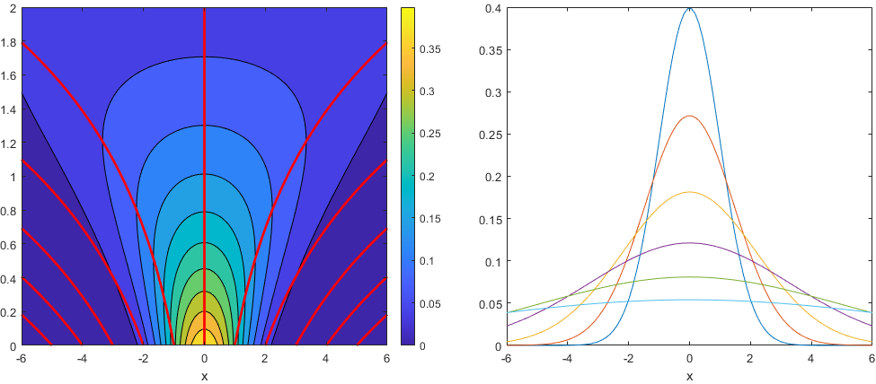
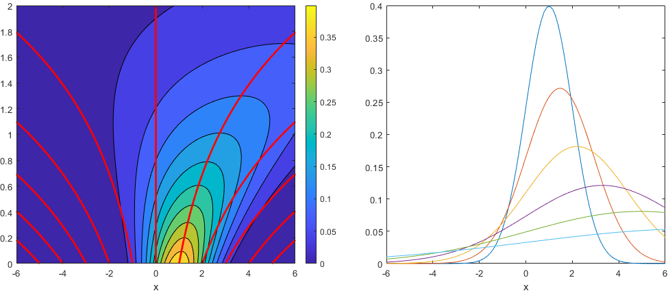
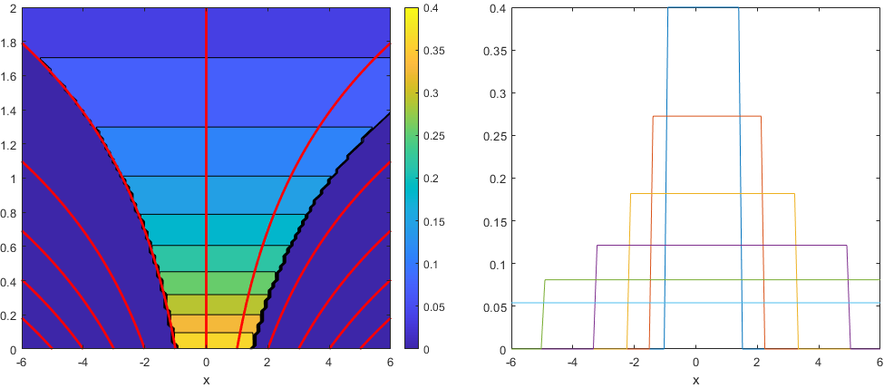
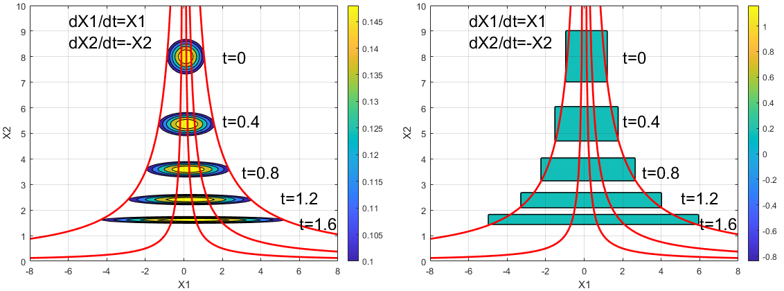
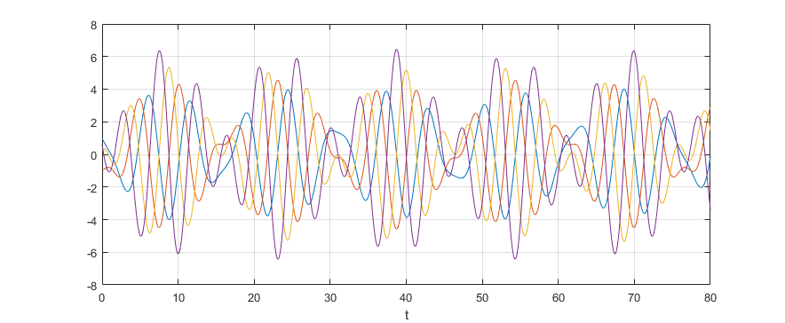
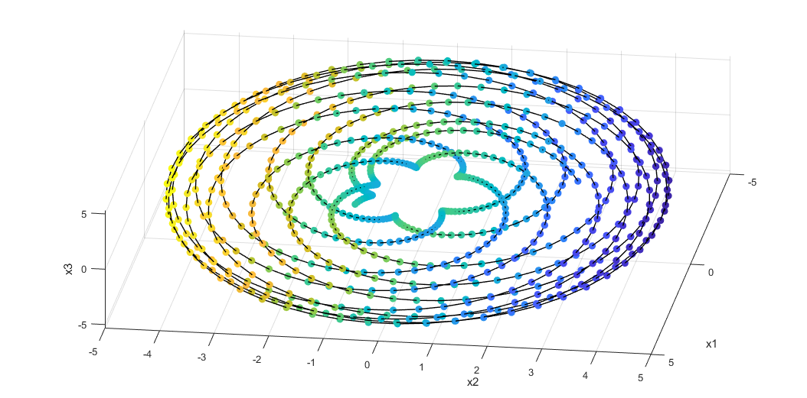
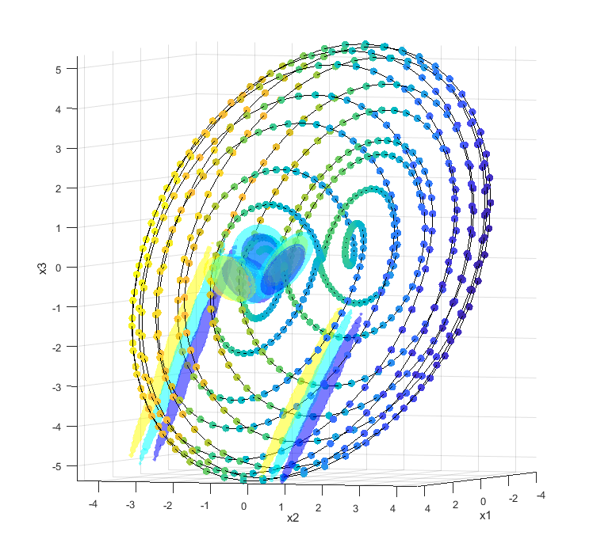
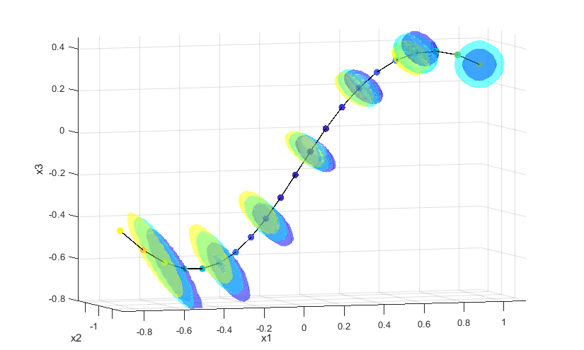

# Liouville 方程
对于如下方程描述的动力系统
$$
  \frac{\mathrm{d}\bm{X}}{\mathrm{d}t}=\bm{\Phi}(\bm{X}).
$$
$\bm{X}$是$N$维的向量，$\bm{\Phi}$是$N$维空间到$N$维空间的映射。如果给定初始时刻的变量$\bm{X}$的概率密度函数$\rho_0(\bm{X})$，那么其演化满足Liouville方程
$$
\frac{\partial \rho(\bm{X},t)}{\partial t}+\sum_{k=1}^N\bm{\Phi}_k(\bm{X})\frac{\partial \rho(\bm{X},t)}{\partial X_k}=-\Psi(\bm{X})\rho(\bm{X},t),\qquad \Psi(\bm{X})=\sum_{k=1}^N\frac{\partial \Phi_k(\bm{X})}{\partial X_k}.
$$
它关于未知量$\rho(\bm{X},t)$是一阶线性方程，其解的表达式为
$$
\rho(\bm{X},t)=\rho_0(\bm{K})\exp{\left(-\int_0^t\Psi(\bm{X}(\bm{K},t'))\ \mathrm{d}t'\right)}.
$$
其中$\bm{K}$是$\bm{X}$在初始时刻的位置。原文这种表达式对于初学者不太好理解，为此，需要先介绍**相轨迹**的概念。对于开头所示的动力系统而言，在初始时刻的每一个状态$\bm{K}$，都将对应一条独特的演化轨迹，或称为$N+1$维相空间中的相轨迹。显然，我们可以假定这条相轨迹可以如下形式地描述：
$$
\bm{X}=\bm{Q}(\bm{K},t),\quad t\geq 0.
$$
同时它也是满足动力系统控制方程的解。这表示系统初始态$\bm{K}$在经过时间$t$演化后变为$\bm{X}$。由于演化轨迹具有唯一性（对于一般性质较好的系统来说），给定任意时刻$t$的状态$\bm{K}$，它在初始时刻的状态也是确定的，并且我们可以定义如下的映射来反演它。
$$
\bm{K}=\bm{P}(\bm{X},t).
$$
上式同时也表明，同一条相轨迹上的点，它在映射$\bm{P}$的作用下都有相同的值$\bm{K}$，因此也称相轨迹为特征线，因为沿着这一条线系统的某种特征$\bm{P}(\bm{X},t)$不发生变化。

此时对于解表达式中的$\bm{K}$，可以更好地进行理解。采用我们上面的记号，将表达式改写为
$$
\rho(\bm{X},t)=\rho_0(\bm{K})\exp{\left(-\int_0^t\Psi(\bm{Q}(\bm{K},t'))\ \mathrm{d}t'\right)}=\rho_0(\bm{P}(\bm{X},t))\exp{\left(-\int_0^t\Psi(\bm{Q}(\bm{P}(\bm{X},t),t'))\ \mathrm{d}t'\right)}.
$$
首先，左半部分的$\rho_0(\bm{K})$即可在已知$\bm{X},t$的情形下用$\bm{P}(\bm{X},t)$直接计算。而右半部分的指数为$\Psi$的积分。而$\Psi$是一个从$N$维空间到实数域的映射，其变量原本为$\bm{X}(\bm{K},t')$，表示初始为$\bm{K}$的状态在$t'$时刻的状态。故在计算时，首先要使用映射$\bm{P}$获得$\bm{X}$对应的初始态，然后再使用$\bm{Q}$获得其在$t'$时刻的状态，再使用$\Psi$进行计算。而$t'$从$0$到$t$的积分，则说明了这个积分的意义是$\Psi$函数在状态$\bm{X}$所对应的这段相轨迹上的积分。
## $\Psi$函数的理解

# 自治线性动力系统的长期性质讨论
首先需要点明的是，线性情形下，**单变量高阶微分方程**和**多变量一阶微分方程**具有相同的性质。具体而言，多变量一阶微分方程具有如下的一般形式：
$$
 \frac{\mathrm{d}\bm{X}}{\mathrm{d}t}=\bm{AX}+\bm{B}.
$$
其中$\bm{X},\bm{B}$为$N$维向量，$A$为$N\times N$的矩阵。它和如下的单变量$N$阶微分方程可以互相转化。
$$
a_N\frac{\mathrm{d}^Nx}{\mathrm{d}t^N}+a_{N-1}\frac{\mathrm{d}^{N-1}x}{\mathrm{d}t^{N-1}}+\cdots+a_1\frac{\mathrm{d}x}{\mathrm{d}t}+a_0x=b.
$$
其中$a_0$直到$a_N$均为常数。注意，上面的$B$或$b$可以包含时间，但这里暂时不讨论含时的非自治系统。如上所示的单变量高阶线性微分方程，我们熟知它可以通过特征根法解，当然也可以借由特征根来推断方程的性质（相应于多元一阶形式中$\bm{A}$的特征值）。因此，$N$维变量的一阶线性方程的性质，可以直接通过$N$次多项式根的性质得到。

由于这里研究动力系统的目的是**通过简单模型来探讨实际大气海洋运动或其他物理系统中可能存在的性质**，因此系统至少需要能够稳定存在较长的时间，故凡是e指数增长或衰减的成分都是我们所不感兴趣的。

## $N=1$时
特征方程为
$$
a_1 \lambda+a_0=0.
$$
此时特征根仅有一个确定的值，当它为正时，$x$的绝对值将逐渐增加，趋向于无穷；为负时，$x$的绝对值将逐渐减小，趋向于$0$。除此之外，这个系统没有任何其他特别的性质。
## $N=2$时
特征方程为
$$
a_2\lambda^2+a_1 \lambda+a_0=0.
$$
对于二次方程，根据判别式存在三种情况的根：两个不等实根，重根，一对共轭复根。对于两不等实根而言，系统的表现和$N=1$时没有太大区别，如果两实根均为负，那么整个系统将衰减；如果至少有一个为正，那么对于单变量而言，负特征根对应的部分（如有）在发展一定时间后将变得可忽略，从而只留下正特征根对应的增长规律。对于双变量的一阶系统而言，说明系统至少会沿着一个方向增长。

对于重根的情形，解具有$t\mathrm{e}^{\lambda t}$的形式。此时，无论$\lambda$的正负性，当时间足够长时系统的性质都主要由$\mathrm{e}^{\lambda t}$所决定。

对于一对共轭复根的情形，其实部仍然表示增长或衰减，但此时其虚部的存在使得系统具有**振动**或**周期运动**的特征。我们考虑实部为零的情况，即振幅不会增长或衰减，那么系统将永远保持周期运动的状态。对于单变量二阶系统而言，$x$值会在一个区间内来回波动；对于双变量的一阶系统而言，我们能看到系统相点在相平面上作圆周运动。

虽然，这一个周期运动是$N=2$系统相对$N=1$系统额外能够具有的特征（思考题，如何通过反证法说明任意一阶系统，即使是非线性的都无法形成振动？因为振动需要状态点来回经过同一个位置，在这个位置上具有相反的速度，这与一阶系统的方程形式矛盾。），但是它仍然是无趣的。由于此时系统最多只能具有一个周期，这就意味着所有性质在一个周期后都将完全一致地重复，而不具有空间特殊性。举例而言，一些人以相同速度绕着圆形跑道跑步，由于内圈短，外圈长，我们能观察到这些人组成的线发生变形；而对于二阶系统描述的周期运行来说，这根线只会绕着圆心旋转，而观察不到更多有意思的现象。

想要克服这一点，必须具有一个以上的“周期”。对于实系数方程，这至少要到$N=4$的情形，下面再进行讨论。

## $N=3$时
特征方程为
$$
a_3\lambda^3+a_2\lambda^2+a_1 \lambda+a_0=0.
$$
对于三次方程，根的性质有以下几种情况：三个不等实根，两个重根和一个实根，三个重根，一个实根和一对共轭复根。

由此可以看出，三阶系统并没有比二阶系统多出更引人注目的特性。对于实根和重根而言，在时间足够长时要么趋向无穷，掩盖其他项的性质；要么趋向零，被其他项掩盖。于此同时，三次方程最多也只能有一对共轭根，说明它的振动性质也与二阶系统无异。

## $N=4$时
对于四次方程，事情终于开始变得有趣起来。它的根的性质有以下几种情况：四个实根，两个实根和一对共轭复根，两对共轭复根。同样忽略无趣的实根和重根，一对共轭复根的情形与二阶系统相同，而两对共轭复根相应于**两种振动频率**，是四阶及以上系统独有的性质。变量的演化将类似如下的表达式：
$$
x(t)=A_1\sin (\omega_1 t+\phi_1)+A_2\sin (\omega_2 t+\phi_2).
$$
其中一部分的周期为$2\pi/\omega_1$，另一部分为$2\pi/\omega_2$。如果$\omega_1,\omega_2$都是有理数，那么在时间足够长时，通过肉眼观察系统的波动，可以看出系统的周期性。而如果其中一个为无理数，或两个无理数（不能相差有理数倍），那么系统将不具有严格意义上的周期，其表现看似具有非常大的随机性，必须通过谱分析才能发现其振动规律（见后面的例子）。

# 线性情形的具体例子
## 最简单的情况
考虑一个最简单的单变量一阶线性自治系统：
$$
\frac{\mathrm{d}x}{\mathrm{d}t}= x.
$$
它的相轨迹方程为$x=x_0\mathrm{e}^{t}$或$x_0=x\mathrm{e}^{-t}$。考虑这一系统对应的Liouville方程的解，这里$\Phi(x)=x$，故$\Psi(x)\equiv 1$，因而概率密度分布演化的表达式为
$$
\rho(x,t)=\rho_0(P(x,t))\mathrm{e}^{-t}=\rho_0(x\mathrm{e}^{-t})\mathrm{e}^{-t}.
$$
这表示概率密度在随着特征线演化的同时，还随着时间以$\mathrm{e}^{-t}$衰减。然而，对于同一时刻的不同$x$值，$\mathrm{e}^{-t}$可以看作一个相同的系数，因此在概率密度随时间演化的同时并没有改变概率密度分布的“形状”，即
$$
\rho_0(x_1)>\rho_0(x_2) \quad \Rightarrow \quad \rho(Q(x_1,t),t)>\rho(Q(x_2,t),t).
$$
其中$Q$表示初始$x_1$或$x_2$沿着相轨迹经过时间$t$到达的状态。

以下三个图分别展示了初始均值为$0$和$1$的正态分布，以及$-1$到$1.5$的均匀分布随时间的演化。左图中纵坐标表示时间，红线表示相轨迹或特征线。

## 二元一阶系统，其中$\Psi=0$
考虑如下系统
$$
\frac{\mathrm{d}}{\mathrm{d}t}\begin{pmatrix}x_1\\x_2\end{pmatrix}=\begin{pmatrix}1&0\\0&-1\end{pmatrix}\begin{pmatrix}x_1\\x_2\end{pmatrix}.
$$
这一系统的两个变量其实各自满足简单的演化方程，直接观察可知
$$
\begin{pmatrix}x_1\\x_2\end{pmatrix}=\begin{pmatrix}x_{10}\mathrm{e}^t\\x_{20}\mathrm{e}^{-t}\end{pmatrix}
$$
这就是这一系统的相轨迹方程。对于这一系统，我们发现$\Psi\equiv0$，这表示由于这一系统在它的一个维度上“伸展”，在另一个维度上“收缩”，导致净的概率密度流具有一种守恒性。对于这种情况，$\rho(x,t)$就直接等于对应初始时刻状态点的概率密度，即
$$
\rho(x_1,x_2,t)=\rho_0(x_1\mathrm{e}^{-t},x_2\mathrm{e}^{t})
$$

下图给出初始均值为$(0.1,8)$的正态分布以及均匀分布随时间的演化图。这里的横纵坐标分别表示两个维度，红色的线为相轨迹，状态点沿着相轨迹从上到下运动。不同时间的分布标示在图上。

由这两个分布的演化可以看出$\Psi=0$情形下概率密度演化的一个重要特点，就是只有分布的形状发生变化。这一点从上面的表达式中很容易看出，也符合Liouville方程类似流体连续性方程的性质。

## 四阶系统
考虑如下的四阶线性微分方程
$$
  x''''+3x''+2x=0.
$$
通过如下的变换
$$
x=x_1, \quad x_1'=x_2,\quad x_2'=x_3, \quad x_3'=x_4.
$$
可化为等价的四元一阶方程
$$
\bm{X}'=\bm{AX},\quad 
\bm{X}=\left(\begin{matrix}
x_1 \\
x_2 \\
x_3 \\
x_4
\end{matrix}\right),\quad \bm{A}=\left(\begin{matrix}
0 & 1 & 0 & 0 \\
0 & 0 & 1 & 0 \\
0 & 0 & 0 & 1 \\
-2 & 0 & -3 & 0
\end{matrix}\right).
$$

现在我们讨论它的性质并求解。原四阶方程的特征值方程为
$$
\lambda^4+3\lambda^2+2=0.
$$
显然可分解为
$$
(\lambda^2+1)(\lambda^2+2)=0.
$$
因此方程有两对共轭复根，$\mathrm{i},-\mathrm{i},\sqrt{2}\mathrm{i},-\sqrt{2}\mathrm{i}$，对应系统存在两个振动周期，即$2\pi$和$\sqrt{2}\pi$。值得注意的是，该系统一般不存在表观的周期性，即找不到$T$使得对任意$t$满足$\bm{X}(t)=\bm{X}(t+T)$，因为无法找到共同周期，即不存在正整数$m,n$使得$m=\sqrt{2}n$。后面通过图示可以看出这一性质。

四元一阶线性方程的解为
$$
\bm{X}=\mathrm{e}^{\bm{A}t}\bm{X}_0.
$$
其中$\mathrm{e}^{\bm{A}t}$是矩阵指数函数，它具有如下的定义和性质：
$$
\mathrm{e}^{\bm{A}t}=\sum_{n=0}^{\infty}\frac{\bm{A}^nt^n}{n!},\qquad \frac{\mathrm{d}\mathrm{e}^{\bm{A}t}}{\mathrm{d}t}=\bm{A}\mathrm{e}^{\bm{A}t}.
$$
理论分析中可以采用特征值分解来计算矩阵指数，假设存在分解$\bm{A}=\bm{V\Lambda V}^{-1}$，由于正交矩阵的性质，可知$\bm{A}^n=\bm{V\Lambda^n V}^{-1}$。对于特征矩阵$\bm{\Lambda}$而言，
$$
\bm{\Lambda}^n=(\operatorname{diag}(\lambda_1,\dots,\lambda_m))^n=\operatorname{diag}(\lambda_1^n,\dots,\lambda_m^n).
$$
故有
$$
\mathrm{e}^{\bm{A}t}=\sum_{n=0}^{\infty}\frac{\bm{A}^nt^n}{n!}=\sum_{n=0}^{\infty}\frac{\bm{V\Lambda^n V}^{-1}t^n}{n!}=\bm{V}\left(\sum_{n=0}^{\infty}\frac{\bm{\Lambda^n }t^n}{n!}\right)\bm{V}^{-1}=\bm{V}\operatorname{diag}(\mathrm{e}^{\lambda_1},\dots,\mathrm{e}^{\lambda_m})\bm{V}^{-1}.
$$
对于实际数值计算，在MATLAB中可通过expm函数直接得到矩阵的指数函数。

我们任意地给定初始状态$\bm{X}_0$，$\bm{X}=\mathrm{e}^{\bm{A}t}\bm{X}_0$或$\bm{X}_0=\mathrm{e}^{-\bm{A}t}\bm{X}$就给出了对应的相轨迹。我们取$\bm{X}_0=(1,-1,0.3,0.6)$，则四个变量的演化规律及其在四维空间中的相轨迹如下图所示（我们只能用三维空间对应$x_1,x_2,x_3$以及让颜色维对应$x_4$来表示四维空间的相轨迹）

现在研究概率密度的演化即Liouville方程的解。注意到$\Psi$的定义，有
$$
\Psi(\bm{X})=\sum_{k=1}^N\frac{\partial \Phi_k(\bm{X})}{\partial x_k}=
\sum_{k=1}^N\frac{\partial (\bm{AX})_k}{\partial x_k}=\sum_{k=1}^N\frac{\partial \bm{A}_k\bm{X}}{\partial x_k}.
$$
其中$\bm{A}_k$是矩阵$\bm{A}$的第$k$行，而由于
$\bm{X}=(x_1,x_2,x_3,x_4)^{\mathrm{T}}$，因此这里的$\Psi$其实就是$\operatorname{tr}(\bm{A})$。而这里$\operatorname{tr}(\bm{A})=0$。这表示了系统的运动是一种没有伸缩的纯“旋转”运动，只不过在这里这个旋转运动是在四维空间中体现的。

对于$\Psi\equiv 0$的情况，Liouville方程的解的表达式中的指数项就直接消除了。其剩余部分
$$
\rho(\bm{X})=\rho_0(\bm{K}),\quad \bm{K}=P(\bm{X},t)
$$
表示概率密度的分布将直接沿着相轨迹演化，而不会产生额外的聚集或消散（这里，额外指的是由于相轨迹本身聚集或离散而导致的概率密度分布集中或消散）。由于我们已经算出相轨迹方程$P(\bm{X},t)=\mathrm{e}^{-\bm{A}t}\bm{X}$，因此结合初始概率密度分布，可以直接计算出$t$时刻的概率密度分布。

但是，这个分布是四维空间加一维时间的函数，无法直接展示出来。为此，取离散的时间和$x_4$值，并作出$\rho(x_1,x_2,x_3,x_4^*,t^*)=C$的等值面来间接展示。我们取的初始分布为简单的正态分布：
$$
\rho_0(x_1,x_2,x_3,x_4)=\frac{1}{4\pi^2\sigma^4}\operatorname{exp}\left(-\frac{1}{2}\sum_{i=1}^4\frac{(x_i-x_{0i})^2}{\sigma^2}\right),\quad \sigma=0.2.
$$
在初始时刻，概率密度函数在四维空间是球对称的，且距离$\bm{X}_0$越近，概率密度越大。它的等值面在三维空间的投影是一个球面，半径则取决于$x_4$。$x_4$越接近$x_{40}$，球面的半径越大。在经过一段时间之后，由于这个系统的概率密度的分布直接沿着相轨迹演化，我们可以猜测某些性质仍然能够得以保留，例如概率密度总是由中心相点向外递减等。这有助于我们理解概率密度函数在四维空间中的演化规律。

下面给出概率密度的演化图。图最中心表示$t=0$的起始位置，球面表示初始概率密度的等值面。对于第四维的取值，分别取$x_4(t),x_4(t)+\Delta_4,x_4(t)-\Delta_4$，作出青，黄，蓝三个等值面。其中$\Delta_4=0.5$，$x_4(t)$表示初始点演化到$t$时刻时第四维的坐标。在初始时刻，黄色和蓝色等值面相同，均被青色球面包裹，和前面的分析一致。随着时间演化，给出了$t=0,20,31,50,75$五个时刻的概率密度等值面。其中最中间的球面为$t=0$时，另外两个椭球面分别为$t=50,75$时。

从图中我们发现两个直观信息：
1. 概率密度分布从最初的球对称，逐渐演化成了扁平的形状，而在特定的时间又会回到类似原有结构的椭球面。这应当是由于相轨迹的分布特征导致的。虽然系统不存在真正的周期，但是仍有近似的周期（$10\pi$是第一个近似周期，因为$10\pi\approx 7\times\sqrt{2}\pi$），在达到近似周期时，系统的性质和最初比较相近，因而概率密度分布的结构也更加类似。
1. 初始时刻青色球面包裹蓝色和黄色球面，但随着时间演化它们发生了分离，有点类似三维空间中椭球体的旋转导致其在某一个面上投影发生的变化。

为了更仔细地考察信息1，这里进一步给出初始时刻附近的演化情况。此时取$\sigma=0.02,\Delta_4=0.08$，给出$t=0,0.3,\dots,1.8$时的概率分布。下图更加精细地展示了概率密度由球对称分布演化到低维子空间上的情形。

