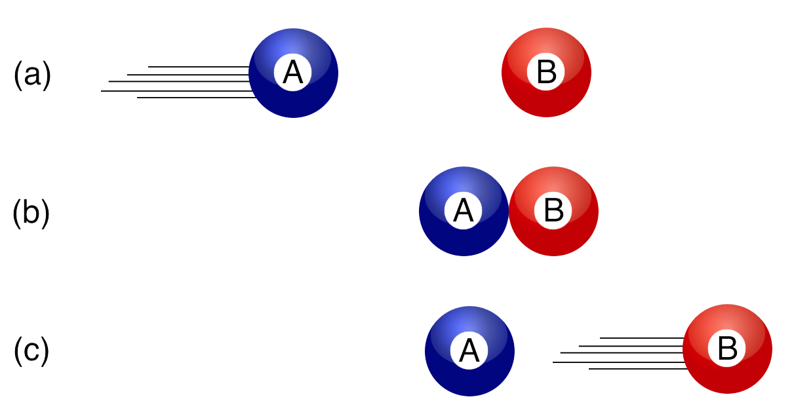
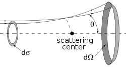
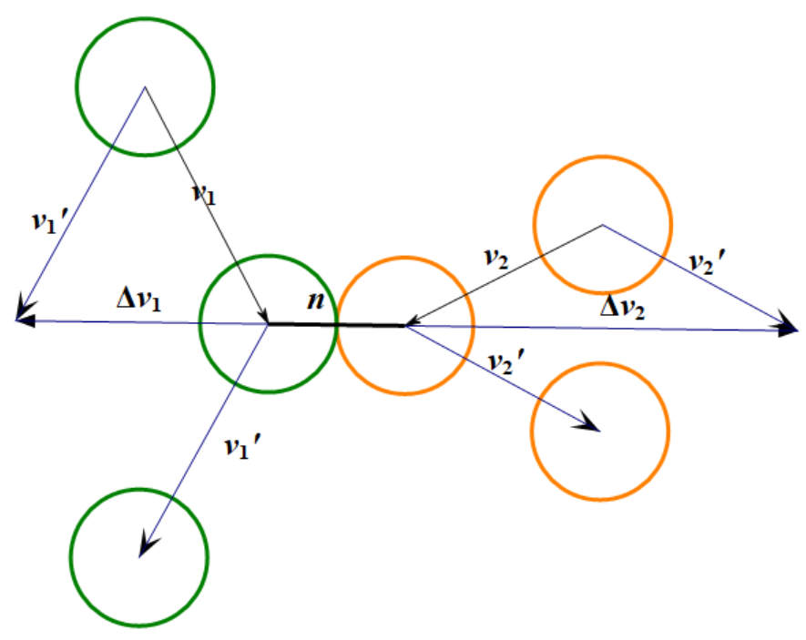
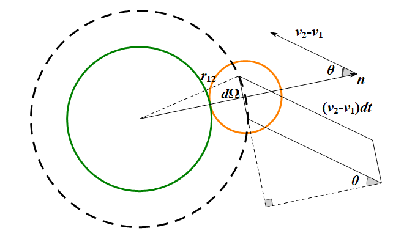

《热力学与统计物理》课程作业，老师给了一些题目让学生来讲，我负责玻尔兹曼积分微分方程。

\begin{frame}
        \maketitle % Automatically created using the information in the commands above
\end{frame}
\begin{frame}[plain]\tableofcontents
\end{frame}

# 引入：已完成的将要完成的

\begin{frame}
  \frametitle{相空间单粒子分布函数满足的方程}
  \begin{equation}
    \ppt[f]\mathrm{d}t\mathrm{d}\tau\mathrm{d}\omega=
    \left\{
      \brack{\ppt[f]}_d+\brack{\ppt[f]}_c
    \right\}\mathrm{d}t\mathrm{d}\tau\mathrm{d}\omega
  \end{equation}
  \begin{itemize}
  \item 漂移项(drift)：运动引起的分子数变化；
  \item 碰撞项(collision)： 分子碰撞引起的分子数变化。
\end{itemize}
  *林(10.1.4)，按汪书拆分体积微元和动量微元。
\end{frame}
\begin{frame}
  \frametitle{玻尔兹曼方程的弛豫时间近似}
  \begin{equation}
    \ppt[f]+\underbrace{\bm{v}\cdot\pp{f}{\bm{r}}+\bm{F}\cdot\pp{f}{\bm{v}}}_{\text{drift}}=\underbrace{-\frac{f-f^{(0)}}{\tau_0}}_{\text{collision}}
  \end{equation}
  *汪(11.1.13)，矢量形式。林(10.1.11)，漂移项。

  \begin{itemize}
  \item 问题：含有弛豫时间$\tau_0$，还需要进一步理论计算。
  \item 方法：先计算一对分子的碰撞，然后再进行统计分析。
\end{itemize}

\end{frame}

# 力学：分子碰撞模型

\begin{frame}
  \frametitle{两种碰撞模型}
  \begin{exampleblock}{弹性刚球模型}
    \begin{center}
      
    \end{center}
  \end{exampleblock}
  \begin{exampleblock}{力心点模型}
    \begin{center}
      
    \end{center}
  \end{exampleblock}
\end{frame}
\begin{frame}
  \frametitle{限制}
  \begin{alertblock}{两种模型均有的限制}
    只考虑平动能，不考虑转动能和振动能\\
    $\Rightarrow$\; 单原子分子气体，或碰撞中分子内部状态不改变。
  \end{alertblock}
  \vspace{1em}
  \begin{alertblock}{力心点模型的优势}
    力心点模型可以处理相互作用力的情形，刚球模型可以视为力心点模型在相互作用能$\varphi(r)=Kr^{-s}$当$s\rightarrow\infty$极限情况下的近似。(王，\S38)
  \end{alertblock}
\end{frame}
\begin{frame}
  \frametitle{解碰撞方程}
  \begin{equation}
    m_1\bm{v}_1+m_2\bm{v}_2=m_1\bm{v}_1'+m_2\bm{v}_2'
  \end{equation}
  \begin{equation}
    \frac{1}{2}m_1v_1^2+\frac{1}{2}m_2v_2^2=\frac{1}{2}m_1v_1'^2+\frac{1}{2}m_2v_2'^2
  \end{equation}
  \begin{equation}
    \bm{v}_1'-\bm{v}_1=\lambda_1\bm{n}\qquad    \bm{v}_2'-\bm{v}_2=\lambda_2\bm{n}
  \end{equation}
  *汪(11.4.1-2)
\begin{center}
  
\end{center}
\end{frame}
\begin{frame}[label=speed]\frametitle{解碰撞方程}
  \begin{block}{末速度}
  \begin{equation}
    \bm{v}_1'=\bm{v}_1+\brack{\frac{2m_2}{m_1+m_2}(\bm{v}_2-\bm{v}_1)\cdot \bm{n}}\bm{n}
  \end{equation}
  \begin{equation}
    \bm{v}_2'=\bm{v}_2-\brack{\frac{2m_1}{m_1+m_2}(\bm{v}_2-\bm{v}_1)\cdot \bm{n}}\bm{n}
  \end{equation}
  *汪(11.4.3)
\end{block}
\pause
\begin{exampleblock}{相对速度不变}
  \begin{equation}
    \bm{v}_1'-\bm{v}_2'=\bm{v}_1-\bm{v}_2+2((\bm{v}_2-\bm{v}_1)\cdot \bm{n})\bm{n}
  \end{equation}
  \begin{equation}
    (\bm{v}_1'-\bm{v}_2')\cdot \bm{n}=-(\bm{v}_1-\bm{v}_2)\cdot \bm{n}
  \end{equation}
  *汪(11.4.6)
\end{exampleblock}
\end{frame}
\begin{frame}[label=collision]\frametitle{碰撞与反碰撞}
  \begin{columns}
    \column{0.5\textwidth}
    \begin{block}{碰撞方程}
    \begin{equation*}
    m_1\bm{v}_1+m_2\bm{v}_2=m_1\bm{v}_1'+m_2\bm{v}_2'
  \end{equation*}
  \begin{equation*}
    \frac{1}{2}m_1v_1^2+\frac{1}{2}m_2v_2^2=\frac{1}{2}m_1v_1'^2+\frac{1}{2}m_2v_2'^2
  \end{equation*}
  \begin{equation*}
    \bm{v}_1'-\bm{v}_1=\lambda_1\bm{n}\qquad    \bm{v}_2'-\bm{v}_2=\lambda_2\bm{n}
  \end{equation*}
  离开相空间
\end{block}
  \column{0.5\textwidth}
  \begin{block}{反碰撞方程}
    \begin{equation*}
    m_1\bm{v}_1'+m_2\bm{v}_2'=m_1\bm{v}_1+m_2\bm{v}_2
  \end{equation*}
  \begin{equation*}
    \frac{1}{2}m_1v_1'^2+\frac{1}{2}m_2v_2'^2=\frac{1}{2}m_1v_1^2+\frac{1}{2}m_2v_2^2
  \end{equation*}
  \begin{equation*}
    \bm{v}_1-\bm{v}_1'=\lambda_1(-\bm{n})\quad    \bm{v}_2-\bm{v}_2'=\lambda_2(-\bm{n})
  \end{equation*}
  进入相空间
\end{block}
\end{columns}
\end{frame}

# 统计：碰撞项的计算

\begin{frame}
  \frametitle{可发生碰撞的体积元}
  \begin{center}
    
  \end{center}
  \begin{equation}
    \mathrm{d}\tau_2=r_{12}^2\mathrm{d}\Omega\cdot\abs{\bm{v}_2-\bm{v}_1}\mathrm{d}t\cos\theta=d_{12}^2v_r\cos\theta \mathrm{d}t\mathrm{d}\Omega
  \end{equation}
  *汪(11.4.7$\frac{1}{2}$)\tiny
  \begin{equation}
    r_{12}=d_{12}=\frac{1}{2}(d_1+d_2)\qquad v_r=\abs{\bm{v}_2-\bm{v}_1}
  \end{equation}\normalsize
\end{frame}
\begin{frame}
  \frametitle{发生碰撞的次数}
  \begin{equation}
    \mathrm{d}\tau_2=d_{12}^2v_r\cos\theta \mathrm{d}t\mathrm{d}\Omega
  \end{equation}
  \begin{exampleblock}{单个粒子1发生碰撞的次数}
  \begin{align}
    \mathrm{d}N_2&=f_2\mathrm{d}\omega_2 \mathrm{d}\tau_2=f_2d_{12}^2v_r\cos\theta \mathrm{d}t\mathrm{d}\Omega \mathrm{d}\omega_2\\
     &=f_{2} \Lambda \mathrm{d} \omega_{2} \mathrm{d} \Omega \mathrm{d} t\\
    \Lambda&=d_{12}^2v_r\cos\theta
  \end{align}
  *汪(11.4.8-9)
\end{exampleblock}
\end{frame}
\begin{frame}
  \frametitle{元碰撞数}
\begin{exampleblock}{$\mathrm{d}t$内发生的总碰撞次数}
  \begin{align}
    \mathrm{d}N_2&=f_{2} \Lambda \mathrm{d} \omega_{2} \mathrm{d} \Omega \mathrm{d} t\\
    \mathrm{d}N^{(-)}&=\mathrm{d}N_2f_1\mathrm{d}\omega_1\mathrm{d}\tau_1 \\
    &=f_1f_2\Lambda \mathrm{d} \omega_1 \mathrm{d}\tau_1 \mathrm{d}\omega_2 \mathrm{d}\Omega\mathrm{d}t
  \end{align}
\end{exampleblock}
*汪(11.4.10)，林(10.1.22)
\pause
\begin{alertblock}{分子混沌性假设}
  单粒子分布函数$f_1,f_2$可以简单相乘，即两分子的速度分布相互独立。
\end{alertblock}
\end{frame}
\begin{frame}[label=dnzf]\frametitle{元反碰撞数}
  反碰撞与碰撞有着相同的物理规律。\hyperlink{collision}{\beamergotobutton{查看方程}}
  \begin{exampleblock}{类比}
    \begin{equation}
      \mathrm{d}N^{(-)}=f_1f_2\Lambda \mathrm{d} \omega_1 \mathrm{d}\tau_1 \mathrm{d}\omega_2 \mathrm{d}\Omega\mathrm{d}t
    \end{equation}
    \begin{equation}
    \mathrm{d}N^{(+)}=f_1'f_2'\Lambda' \mathrm{d} \omega_1' \mathrm{d}\tau_1 \mathrm{d}\omega_2' \mathrm{d}\Omega'\mathrm{d}t
    \end{equation}
  \end{exampleblock}
  *林(10.1.24)，汪(11.4.11)\pause
  \begin{alertblock}{区别}
    \begin{equation}
      f_1(\bm{r},\bm{v}_1,t),\;f_1'(\bm{r},\bm{v}_1',t),\; f_2,\;f_2'
    \end{equation}
    \begin{equation}
     \mathrm{d}\Omega' \qquad \Lambda'\qquad \mathrm{d}\omega_1'\mathrm{d}\omega_2'
    \end{equation}
  \end{alertblock}
\end{frame}
\begin{frame}
  \frametitle{代换联系}
  \begin{block}{立体角微元相等}
    \begin{equation}
      \bm{n}'=-\bm{n}\quad\Rightarrow\quad \mathrm{d}\Omega'=\mathrm{d}\Omega
    \end{equation}
  \end{block}
  \begin{block}{$\Lambda$相等}
    \begin{align}
      \Lambda'&=d_{12}^2\abs{\bm{v}_2'-\bm{v}_1'}\cos\theta'=d_{12}^2(\bm{v}_2'-\bm{v}_1')\cdot \bm{n}'\\
      &=d_{12}^2(\bm{v}_2-\bm{v}_1)\cdot \bm{n}=\Lambda
    \end{align}
  \end{block}
  \hyperlink{speed}{\beamergotobutton{相对速度}}
\end{frame}
\begin{frame}
  \frametitle{代换联系·雅克比}
  \begin{equation}
    \mathrm{d}\omega_1'\mathrm{d}\omega_2'=\abs{J}\mathrm{d}\omega_1\mathrm{d}\omega_2
  \end{equation}
  *汪(11.4.13)，林(10.1.26)
  \begin{equation}
    J=\pp{(\bm{v}_1',\bm{v}_2')}{(\bm{v}_1,\bm{v}_2)}
  \end{equation}
  \hyperlink{speed}{\beamergotobutton{函数表达式}}
  \pause
  \begin{exampleblock}{对称性}
  \begin{equation}
    J^{-1}=\pp{(\bm{v}_1,\bm{v}_2)}{\bm{v}_1',\bm{v}_2'}=J\qquad JJ^{-1}=J^2=1\qquad \abs{J}=1
  \end{equation}
  *林(10.1.27-28)
\end{exampleblock}
\end{frame}
\begin{frame}
  \frametitle{碰撞项}
  \hyperlink{dnzf}{\beamergotobutton{回顾粒子数变化}}
  \begin{align}
    \brack{\pp{f_1}{t}}_c\mathrm{d}\tau_1\mathrm{d}\omega_1\mathrm{d}t&=\iint(\mathrm{d}N^{(+)}-\mathrm{d}N^{(-)})\\
    &=\brack{\iint(f_1'f_2'-f_1f_2)\mathrm{d}\omega_2\Lambda \mathrm{d}\Omega}\mathrm{d}\tau_1\mathrm{d}\omega_1\mathrm{d}t
  \end{align}
  *林(10.1.30)
  \begin{exampleblock}{碰撞项}
    \begin{equation}
      \brack{\pp{f}{t}}_c=\iint(f'f_1'-ff_1)\mathrm{d}\omega_1\Lambda \mathrm{d}\Omega
    \end{equation}
  *林(10.1.31)
  \end{exampleblock}
\end{frame}
\begin{frame}
  \frametitle{玻尔兹曼积分微分方程}
    \begin{equation}
    \ppt[f]+\underbrace{\bm{v}\cdot\pp{f}{\bm{r}}+\bm{F}\cdot\pp{f}{\bm{v}}}_{\text{drift}}=\underbrace{\iint(f'f_1'-ff_1)\mathrm{d}\omega_1\Lambda \mathrm{d}\Omega}_{\text{collision}}
  \end{equation}
  *汪(11.4.16)，林(10.1.32)

  未知函数$f$，$f_1=f(\bm{r},\bm{v}_1,t),f'=f(\bm{r},\bm{v}',t),f_1'=f(\bm{r},\bm{v}_1',t)$
\end{frame}

# 玻尔兹曼方程的适用条件

\begin{frame}
  \frametitle{玻尔兹曼方程的适用条件}
*林\S 10.1.5
  \begin{block}{假设}
\begin{enumerate}
\item 经典稀薄气体，短程分子力；
\item 漂移项与碰撞项互不干扰；
\item 只考虑二体碰撞；
\item 忽略内部结构，使用刚球模型；
\item 引入混沌性假设，分布独立。
\end{enumerate}
\end{block}
要求：气体稀薄，高温，非简并条件，短程力，不考虑分子内部结构等。
\end{frame}

# 简例：麦克斯韦分布律

\begin{frame}
  \frametitle{平衡态}
  *王\S 41

  H定理：
  \begin{equation}
    \pp{f}{t}=0\quad\Rightarrow\quad \brack{\pp{f}{t}}_c=0,\brack{\pp{f}{t}}_d=0
  \end{equation}
 \pause
  \begin{block}{稳定分布律}
  \begin{equation}
    f_1f_2=f_1'f_2'\quad\Rightarrow\quad \brack{\pp{f}{t}}_d=0
  \end{equation}
  H定理：这是唯一条件。
\end{block}

\end{frame}
\begin{frame}
  \frametitle{解方程}
  \begin{block}{待解方程}
    \begin{equation}
      \ln f_1'+\ln f_2'=\ln f_1+\ln f_2
    \end{equation}
  \end{block}
  \pause
  \begin{exampleblock}{观察守恒方程}
    \begin{equation*}
    m_1\bm{v}_1'+m_2\bm{v}_2'=m_1\bm{v}_1+m_2\bm{v}_2
  \end{equation*}
  \begin{equation*}
    \frac{1}{2}m_1v_1'^2+\frac{1}{2}m_2v_2'^2=\frac{1}{2}m_1v_1^2+\frac{1}{2}m_2v_2^2
  \end{equation*}
\end{exampleblock}
\end{frame}
\begin{frame}
  \frametitle{特解}
  \begin{block}{特解}
  \begin{equation}
    \ln f=1,\;mu,\;mv,\;mw,\;\frac{1}{2}m(u^2+v^2+w^2)
  \end{equation}
  分别对应分子数、动量和能量守恒。
  \pause
  \begin{alertblock}{不能有更多的特解}
    否则，会出现新的守恒条件，限制方程；与碰撞方向$\bm{n}$任意矛盾。
  \end{alertblock}
\end{block}
\end{frame}
\begin{frame}
  \frametitle{通解}
  \begin{equation}
    \ln f = \alpha+m\bm{\beta}\cdot \bm{v}+\gamma m \bm{v}^2
    =\ln a+ b m(\bm{v}-\bm{v}_0)^2
  \end{equation}
  \begin{equation}
    f=a\exp{bm(\bm{v}-\bm{v}_0)^2}
  \end{equation}
  \begin{block}{麦克斯韦分布律}
    \begin{equation}
    f=n\brack{\frac{m}{2\pi kT}}^{3/2}\mathrm{exp}
    \left\{
      -\frac{m}{2kT}(\bm{v}-\bm{v}_0)^2
    \right\}
  \end{equation}
  \end{block}
\end{frame}

# 引申：BBGKY

\begin{frame}
  \frametitle{BBGKY的解法}
  利用稀薄条件，级列终止于双粒子分布函数。当然也可进一步推导修正。

  见朗道《物理动理学》\S 16
\end{frame}
\begin{frame}[focus]Thanks for \textbf{Listening}!
\end{frame}
