本人按：我最近在让ai做一个自带自动微分，方便算梯度的模型，目前已经发展到一定的程度了，今天刚好它做了下面这个test，让ai整理出来给大家看个乐子。**注意，以下内容均由AI生成，从模式设计到跑试验再到诊断结果做分析出报告我都是甩手掌柜，只是简单看了两眼没什么大问题。**

---

想象我们只在几个时刻、几个位置看到了空气温度和上升运动的一小部分信息。问题是：能不能根据这些零散观测，约束并改进这团空气一开始大概是什么样子？

这个小实验回答的是“可以，而且可以用梯度自动完成”。模型在一个 `64 x 32 x 10` 的三维小盒子里模拟局地加热引发的上升运动；每个时间步是 `1` 秒模型时间，整个窗口是 `16` 秒。观测只来自第 `4、8、16` 步，也就是约 `4、8、16` 秒，而且每个时刻只采样约 `25.0%` 的温度扰动点和 `25.0%` 的垂直速度点。经过 `6` 次优化，总误差从 `0.5185` 降到 `0.003404`，下降了 `99.343%`。这说明观测约束到的轨迹和变量被明显改进，但不等于完整初始场已经被唯一、完全地恢复出来。

## 1. 这个模型是什么

真实大气很复杂，有球面、地形、水汽、辐射、边界层等许多过程。这个实验先把问题收缩到一个局地三维小盒子里：水平长度和宽度都是 `100 km`，高度是 `20 km`。空气不能穿过顶部和底部；水平方向采用周期边界，可以理解成从右边出去会从左边回来。

模型保留了热对流最核心的几件事：风会运动，温度扰动会被风搬运，暖空气会受到浮力而上升，压力会把风场调整到满足质量守恒。它没有试图成为完整天气预报系统，而是作为一个足够清楚、足够可微的小模型，用来演示“怎样用观测约束和改进初始状态”。

模型里的主要变量是：

| 量 | 可以怎样理解 |
| --- | --- |
| `u` | x 方向水平风 |
| `v` | y 方向水平风 |
| `w` | 垂直风，也就是上升或下沉速度 |
| `theta` | 位温扰动，可以近似理解成相对背景大气的冷暖异常 |

这些变量放在 C-grid 上：温度这类标量放在格点中心，速度分量放在对应方向的网格面上。这样做的好处是，计算“有多少空气穿过一个网格面”和“一个小体积里空气有没有凭空多出来”更自然。压力不是要同化的变量，也不是独立预报的变量；它在每个时间步被诊断出来，用来修正风场。


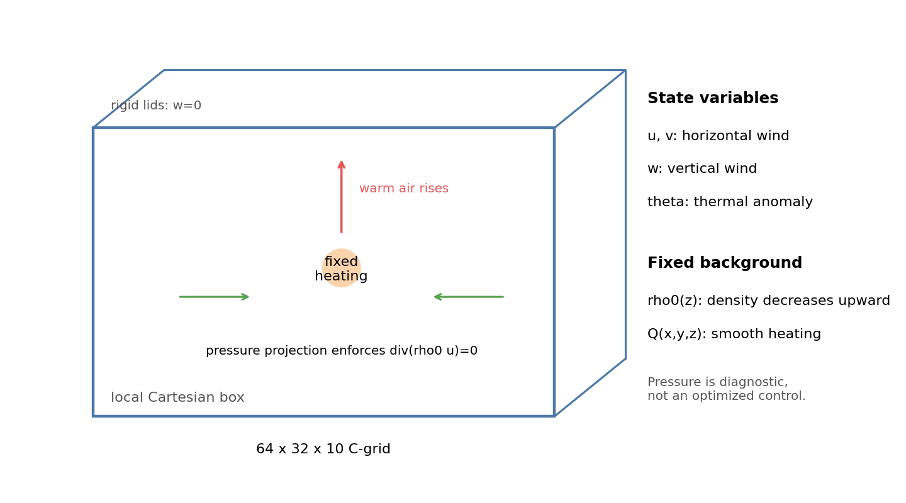

*图 1. 三维大气小盒子的示意图。模型预报水平风、垂直风和温度扰动；压力投影负责让密度加权质量通量保持平衡。*


## 2. 模型在解什么方程

这个模型可以看成一个“过滤掉声波、固定背景密度”的非静力热对流模型，或者说是一个接近非弹性思想的简化模型。这里的非静力，意思是垂直加速度被保留下来，空气可以明确地产生上升和下沉运动；固定背景密度，意思是背景空气密度 `rho0(z)` 随高度变化，但不随时间预报。它不是完整可压缩大气模式，而是为了演示同化机制而保留关键过程的教学模型。

用简化写法，模型近似求解：

```text
du/dt     = - dp/dx + diffusion
dv/dt     = - dp/dy + diffusion
dw/dt     = buoyancy(theta) - dp/dz + diffusion
dtheta/dt = - wind . grad(theta) + Q - stable-stratification effect
div(rho0 * wind) = 0
```

这几行分别表示：

- 水平风 `u`、`v` 会被压力梯度和扩散改变；
- 垂直风 `w` 除了受压力影响，还会受浮力影响；
- 温度扰动 `theta` 会被风带着走，也会被固定热源 `Q` 加热；
- 最后一行是约束：密度加权后的质量通量不能在一个网格单元里凭空发散。

最后这一行很重要。因为空气越高越稀薄，同样大小的垂直速度，在低层和高层代表的质量通量并不一样。所以模型约束的是 `rho0 * wind`，不是简单的 `wind`。每个时间步里，模型先根据加热、浮力和扩散得到一个临时风场，再通过压力投影把它修正到满足这个约束。

## 3. 基本态：安静但稳定的大气

实验不是从一团完全随意的空气开始，而是先设定一个基本态。基本态可以理解成“没有天气扰动时的大气背景”。本例的基本态有三层含义。

第一，基本风场为零，也就是背景大气本身不整体吹动：`u = v = w = 0`。这让我们能更清楚地看见局地热源和初始扰动造成的运动。

第二，背景密度随高度降低。下层空气更稠密，上层空气更稀薄，密度尺度高度为 `8 km`。

第三，基本位温随高度增加，垂直梯度约为 `3.058` K/km。这代表稳定层结：如果一个空气团被抬起来，它进入的环境通常更“抗拒”它继续上升。稳定层结不会阻止所有上升运动，但会让上升运动受到恢复力约束。


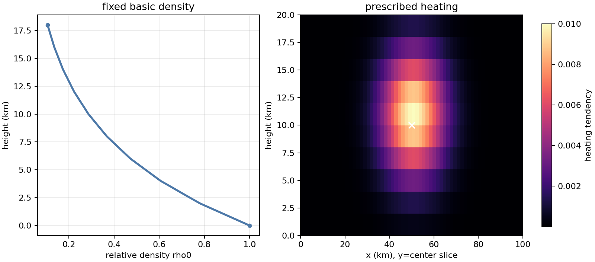

*图 2. 基本态密度和固定热源。左图显示空气越高越稀薄；右图显示加热集中在盒子中部。*


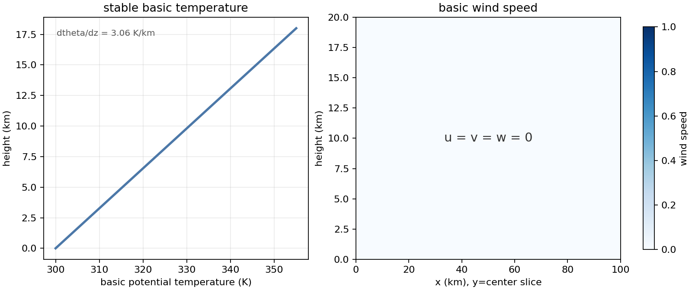

*图 3. 基本态风场和温度场。左图是随高度增加的基本位温，右图说明基本风速为零。*


在这个安静背景上，实验再加入一组光滑的初始扰动，作为“真实初始状态”。这些扰动包括温度扰动、水平风和垂直风。它们不是随机噪声，而是平滑的大尺度结构，方便模型稳定积分，也方便后面判断同化是否真的把状态往真值方向拉回去。


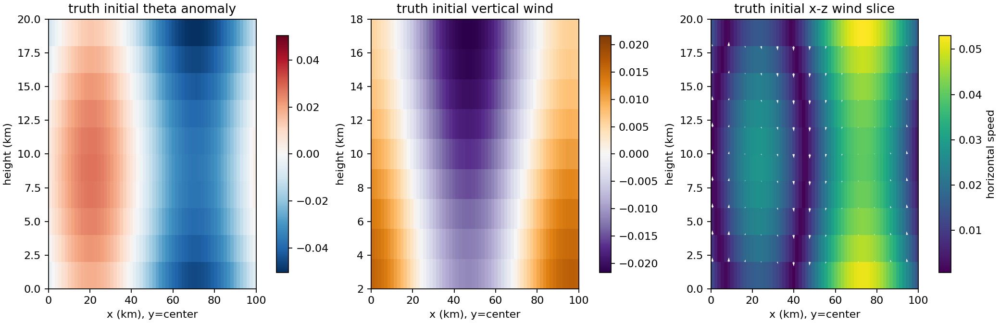

*图 4. 合成的真实初始扰动。左图是温度扰动，中图是垂直速度，右图用箭头显示 x-z 剖面上的风向。*


## 4. 加热以后会发生什么

盒子中部有一个固定的平滑热源。它持续给附近空气加热，使那里的 `theta` 变大。`theta` 增大后，空气团相对周围环境更暖，浮力增强，于是更容易向上运动。上升运动不能凭空发生：当中间空气向上走时，周围空气会发生补偿运动，压力投影会把整个风场调整到满足密度加权质量守恒。

可以把这个过程想成四步：

1. 中部热源让局地空气变暖；
2. 变暖空气获得浮力，形成上升运动；
3. 周围空气产生回流，补偿中部上升；
4. 稳定层结和扩散限制运动无限增强，使结构保持平滑。

这正是本报告关注的物理现象：局地加热触发的热对流。我们不是要预报真实天气，而是要问一个更基础的问题：如果只看到之后若干时刻的一部分温度和上升运动，能不能把一开始的风和温度扰动往更合理的方向拉回去？


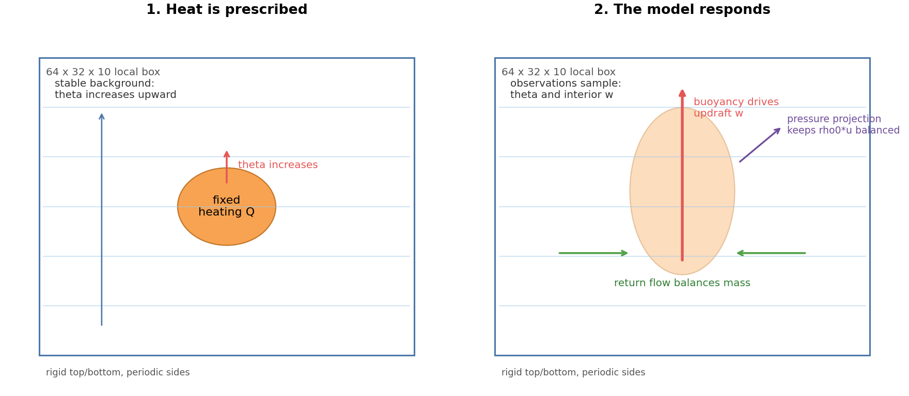

*图 5. 加热后的物理响应示意图。固定热源让局地空气变暖，浮力驱动上升，周围回流和压力投影共同维持质量通量平衡。*


## 5. 同化方案：用少量观测改初始状态

4D-Var 是资料同化的一种方法。这里的“4D”指三维空间加上一段时间窗口；“Var”指变分优化。它的核心不是单独拟合某一张图，而是调整初始状态，让模型在整个时间窗口内尽量接近观测。

本实验采用合成双胞胎设置，也就是先用同一个模型制造“真值”和“观测”，再看优化能不能找回合理的初始状态。这里 `dt = 1` 秒，所以第 `4、8、16` 步对应约 `4、8、16` 秒：

1. 构造一个真实初始状态；
2. 从真实初始状态积分模型，得到第 `4、8、16` 步的目标轨迹；
3. 在这些时刻只抽取稀疏 `theta` 和内部 `w` 作为观测；
4. 从一个较差的初始猜测开始重新跑模型；
5. 比较模型轨迹和观测之间的误差；
6. 根据梯度修改初始猜测，再重复这个过程。

控制变量，也就是优化器可以修改的量，是初始时刻的 `u`、`v`、`w_interior` 和 `theta`。上下边界的 `w` 固定为 0，不作为自由变量；压力也不是控制变量。脚本按指定的稀疏掩膜抽取观测点；在本次设置下，每个观测时刻最终约使用 `25.0%` 的温度扰动点和 `25.0%` 的垂直速度点。

目标函数可以用普通话写成：

```text
目标函数 J
  = 多个观测时刻的温度扰动误差
  + 多个观测时刻的内部垂直速度误差
  + 背景约束项
```

本次实验中背景约束权重是 `0`，所以误差主要来自观测项。水平风 `u`、`v` 虽然会被优化，因为它们会影响未来的温度和垂直速度；但观测没有直接要求最终水平风完全等于真值。这一点会影响后面对结果的解释。

更具体一点，脚本实际使用的是带掩膜的均方误差。设观测时刻集合为 `T = {4、8、16}`，`M_theta` 和 `M_w` 是稀疏观测掩膜，`s_theta = 0.03`、`s_w = 0.012` 是归一化尺度，则

```text
J(c) = (1 / |T|) * sum over t in T [
         0.5 * mean_mask( M_theta * ((theta_t(c) - theta_t*) / s_theta)^2 )
       + 0.5 * mean_mask( M_w     * ((w_t(c)     - w_t*)     / s_w)^2 )
       ] + beta * background_penalty
```

这里 `c` 是初始控制量，星号表示由真实初始状态生成的目标轨迹。注意，目标函数里直接优化的是稀疏 `theta` 和稀疏内部 `w`，不是 `rho0*w`，也不是水平风终态。


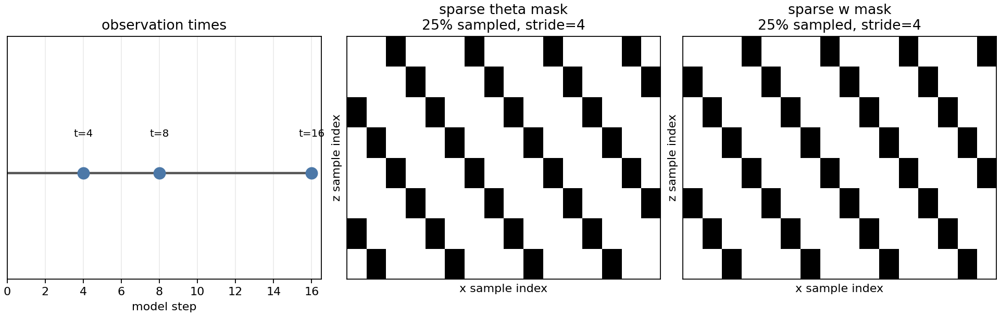

*图 6. 多时刻稀疏观测。同化系统只在第 4、8、16 步读取一部分温度扰动和垂直速度信息。*


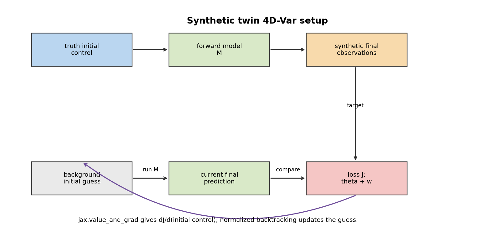

*图 7. 4D-Var 的优化流程。猜一个初始状态，跑模型，和观测比较，再用误差梯度修改初始状态。*


## 6. 优化怎么做

优化的关键是知道“应该往哪个方向改初始状态”。本实验没有手写一套伴随程序，而是使用自动微分计算目标函数对初始条件的梯度：

```text
loss, gradient = value_and_grad(J)(initial_control)
```

可以把 `gradient` 理解成一张灵敏度地图：它告诉我们，如果想让观测误差变小，初始温度、初始水平风和初始垂直风应该分别往哪个方向调整。

实际更新时还需要小心步长。不同变量的单位和典型大小不同，直接沿原始梯度走可能迈得太小或太大。因此脚本使用归一化梯度和回溯线搜索：

1. 先把梯度归一化，只保留“方向”；
2. 沿负梯度方向试着修改初始状态；
3. 如果误差没有下降，就把步长减半；
4. 接受第一个能让误差下降的步长；
5. 重复 `6` 次。

本次代表性运行中，`6/6` 次优化步都被接受，所有误差和梯度范数都是有限值。作为对照，早期同一模型上的一次简单梯度下降几乎不能降低误差，相对下降仅为 0.0221%。这提醒我们：知道“往哪个方向改”还不够，步子怎么迈也很重要。

写成公式，令第 `k` 轮的归一化控制增量为 `z_k`，目标函数梯度为

```text
g_k = dJ/dz_k
d_k = g_k / max(||g_k||, 1e-14)
z_{k+1} = z_k - alpha_k * d_k
```

`alpha_k` 就是每一轮要决定的步长。脚本每轮都先试 `alpha = 1`；如果新误差没有下降，就依次试 `1/2`、`1/4`、`1/8`，最多试 `24` 次，直到找到第一个让 `J(z_k - alpha d_k) <= J(z_k)` 的步长。若所有候选都失败，这一轮就不接受更新。

归一化控制量和真实初始物理量之间还有一层尺度换算。本例中：

```text
u0^{k+1}     = u0^k     - alpha_k * 0.025     * d_{u,k}
v0^{k+1}     = v0^k     - alpha_k * 0.02     * d_{v,k}
w0_int^{k+1} = w0_int^k - alpha_k * 0.012     * d_{w,k}
theta0^{k+1} = theta0^k - alpha_k * 0.03 * d_{theta,k}
```

上下边界的 `w` 始终固定为 0，不按这个公式更新；压力也不更新，因为它是每个时间步里诊断出来的约束变量。

本次 6 轮优化实际接受的步长如下：

| 轮次 | 梯度范数 | 试步次数 | 接受步长 | 总误差变化 |
| ---: | ---: | ---: | ---: | --- |
| 1 | `9.8648e-05` | `1` | `1` | `0.5185` -> `0.4923` |
| 2 | `9.7672e-05` | `2` | `0.5` | `0.4923` -> `0.01076` |
| 3 | `1.2981e-05` | `5` | `0.0625` | `0.01076` -> `0.004211` |
| 4 | `2.9584e-06` | `7` | `0.01562` | `0.004211` -> `0.003805` |
| 5 | `1.4999e-06` | `7` | `0.01562` | `0.003805` -> `0.003589` |
| 6 | `1.9303e-06` | `7` | `0.01562` | `0.003589` -> `0.003404` |

## 7. 优化结果

结果首先体现在目标函数上。总误差从 `0.5185` 下降到 `0.003404`，相对下降 `99.343%`。其中，稀疏温度扰动误差从 `0.4992` 下降到 `3.6141e-05`；稀疏垂直速度误差从 `0.01929` 下降到 `0.003368`。


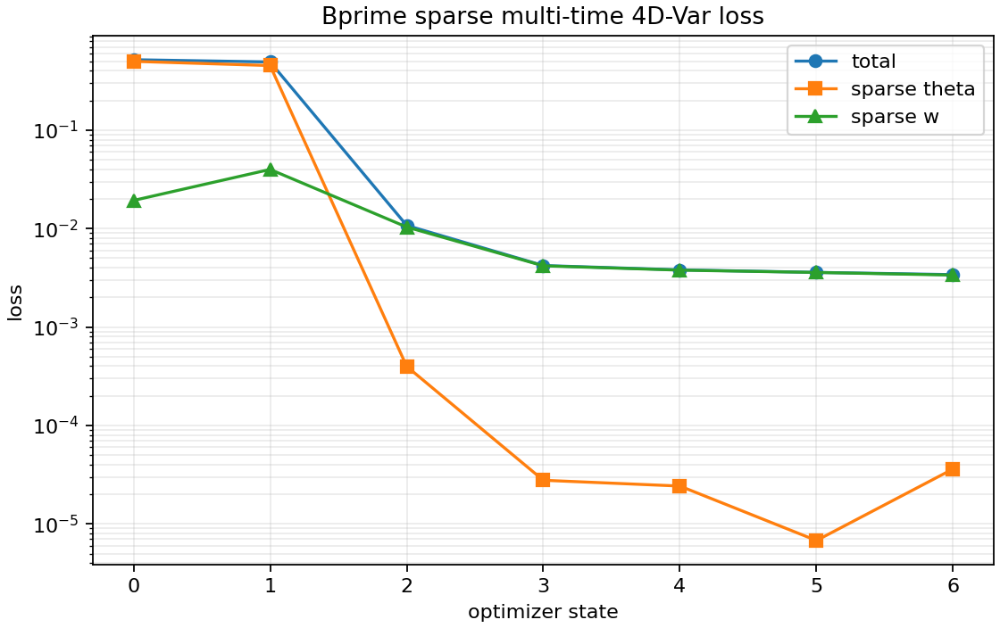

*图 8. 优化过程中误差的变化。纵轴使用对数坐标，曲线向下表示观测误差持续减小。*


| 指标 | 优化前 | 优化后 | 怎么理解 |
| --- | ---: | ---: | --- |
| 总观测误差 | `0.5185` | `0.003404` | 整体拟合明显变好 |
| 稀疏温度扰动误差 | `0.4992` | `3.6141e-05` | 观测到的温度扰动基本被拟合 |
| 稀疏垂直速度误差 | `0.01929` | `0.003368` | 观测到的上升/下沉运动被明显改善 |
| 初始场误差 | `4` | `3.705` | 初始猜测向真实初始状态靠近，但没有完全恢复 |

从物理量看，优化也不只是让一个抽象数字变小。最终时刻的垂直速度均方根为 `0.002721`，目标值为 `0.002762`，二者很接近。密度加权垂直通量为 `0.001205`，目标值为 `0.001017`，约为目标的 `1.185` 倍，出现了轻微过冲。


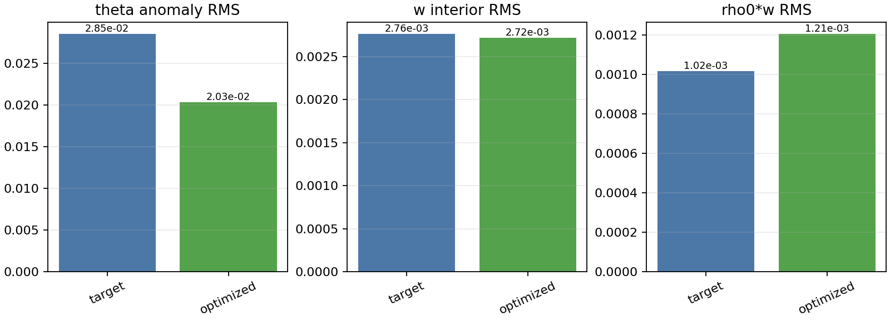

*图 9. 关键物理诊断量对比。优化后的垂直速度接近目标；密度加权垂直通量是诊断量，不是直接优化项，因此有轻微过冲。*


这个过冲并不表示优化目标变差了，因为 `rho0*w` 没有进入目标函数。目标函数直接约束的是稀疏内部 `w`，而 `rho0*w` 会额外乘上随高度变化的背景密度；当不同高度的 `w` 误差重新分布时，未加权的 `w` 误差可以下降，但密度加权 RMS 可能略高于目标。总速度均方根仍明显低于目标值，则更直接地反映了水平风没有被观测直接约束。优化会优先修正观测真正约束到的部分，而不是凭空恢复所有细节。


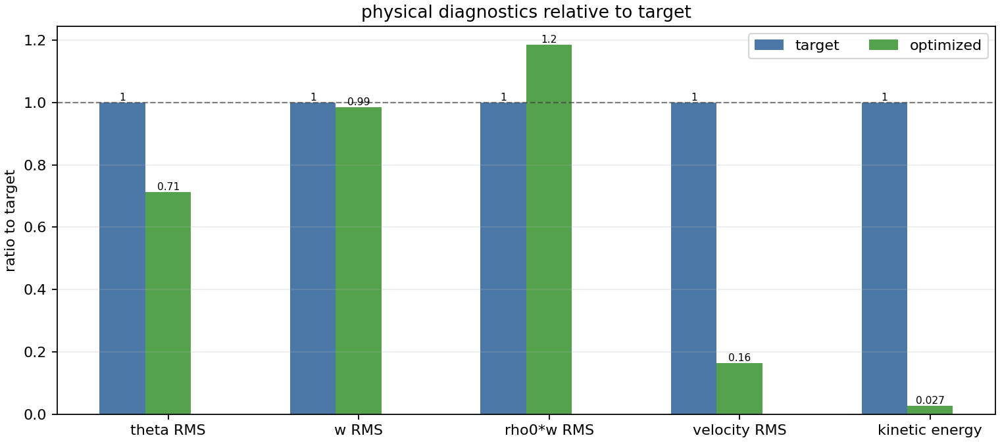

*图 10. 各物理量相对目标状态的比例。接近 1 表示接近目标；水平风相关的总速度没有被直接观测，因此恢复较弱。*


## 8. 这个例子说明了什么

这个例子说明，少量、多时刻、空间上不完整的观测，仍然可以包含关于初始状态的信息。在这个可微的合成实验里，误差可以沿着模型时间积分的链条传回初始条件，帮助我们改进初始风场和温度场。更一般地说，4D-Var 的核心思想就是在一段时间窗口内调整控制变量，使模型轨迹尽量符合观测；业务或研究系统中通常还需要明确的观测算子、背景项和优化/伴随实现。

它也说明，优化方法本身很重要。知道梯度方向并不等于优化一定成功；梯度尺度处理和线搜索会直接影响误差能否下降。


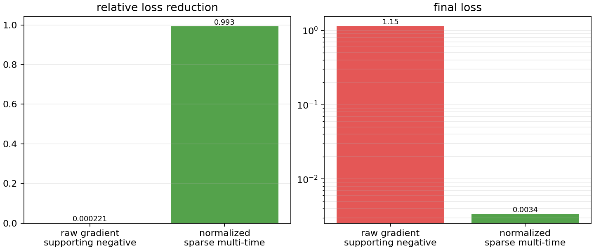

*图 11. 梯度尺度处理的影响。合适的归一化和线搜索能让误差明显下降；简单直接迈步可能几乎没有效果。*


这个案例仍然有明确边界。它是教学型、简化的局地非静力模型，不包含球面几何、地形、完整可压缩声波、预报密度或业务天气预报中的复杂物理过程。它展示的是资料同化思想、可微模型和初值优化机制，而不是完整业务模式的全部能力。
