2020年春季学期于UCB访学时，上Convective Transport课程所整理的笔记。

# Basic equations

## Introduction

Convection: using fluid to move heat or mass (species)

Transport energy and control temperature:

-   environment: temperature in room.

-   bio systems: blood, skin.

-   technologics: heat exchanger, cars. \$ 23 billion market!

-   food heating

Big picture: conservation of mass, force-momentum balance, 1st law of thermodynamics, transport models, conservation of species $\rightarrow$ governing equations and **boundary conditions**. $\rightarrow$ solution methods.

## Mass and Momentum equation

[Continuity - mass conservation]{.underline} `\newline`{=latex} rate of accumulation of mass inside = net rate of mass flow into volume through surface. $$\ppt[\rho]+\pp{\rho u}{x}+\pp{\rho v}{y}+\pp{\rho w}{z}=0$$ general 3-D continuity equation. If $\rho$ is constant, then $$\pp{u}{x}+\pp{v}{y}+\pp{w}{z}=0$$ [Momentum transport (3 direcitons)]{.underline}. I=II+III, where

1.  Time rate of momentum of fluid in volume

2.  net force on fluid in volume

3.  net rate pf momentum transport into volume.

$x$ - direction: $$\mathrm{I:}= \ppt(\rho\d x \d y\d z u)=\ppt[(\rho u)]\d x\d y\d z$$ For III, first calc the flow in $x$-dir $$\Brack{(\rho u \d y \d z)u}_x-\Brack{(\rho u \d y \d z)u}_{x+\d x}=-\pp{(\rho u^2)}{x}\d x \d y\d z$$ then same for $y$ and $z$ $$\mathrm{III:} =-u\cdot\brack{\pp{(\rho u)}{x}+\pp{(\rho v)}{y}+\pp{(\rho w)}{z}}\d x \d y\d z- \brack{\rho u\pp{u}{x}+\rho v\pp{u}{y}+\rho w\pp{u}{z}}\d x\d y\d z$$ For II, simply denote $$\mathrm{II:}=\rho X \d x\d y\d z+\rho S_x\d x\d y\d z$$ $X$ is the body force per unit mass, $S_x$ is the $x$ direction surface force. In total, $$\rho \pp{u}{t}+ u\pp{\rho}{t}=-u \Brack{\pp{(\rho u)}{x}+\pp{(\rho v)}{y}+\pp{(\rho w)}{z}}-\brack{\rho u\pp{u}{x}+\rho v\pp{u}{y}+\rho w\pp{u}{z}}+\rho X+\rho S_x$$ use continuity equation to cancel: $$\rho \pp{u}{t}+\brack{\rho u\pp{u}{x}+\rho v\pp{u}{y}+\rho w\pp{u}{z}}=\rho X+\rho S_x$$ $$\frac{\mathrm{D}}{\mathrm{D}t}\equiv \pp{}{t}+u\pp{}{x}+v\pp{}{y}+w\pp{}{z} \quad\Rightarrow\quad  \rho \frac{\mathrm{D}u}{\mathrm{D}t}=\rho X+\rho S_x$$ We get $x$-dir momentum equation. Also works for $y$ $$\rho \frac{\mathrm{D}v}{\mathrm{D}t}=\rho Y+\rho S_y =\rho F_y$$ using another annotation, $$(u,v,w)\rightarrow (v_1,v_2,v_3) \qquad (x,y,z)\rightarrow (x_1,x_2,x_3)$$ so $$\rho \dd[D]{v_i}{t}=\rho F_i$$

## Surface stresses

<figure>
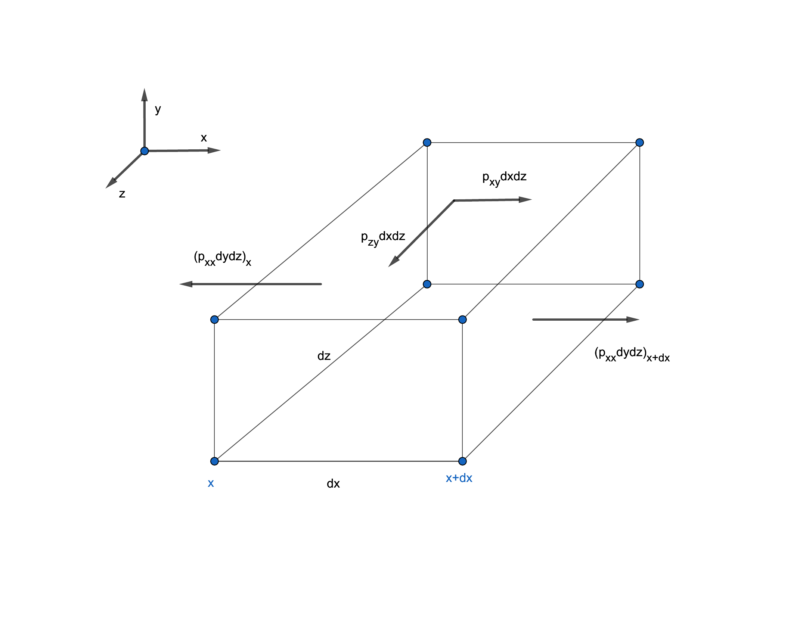
<figcaption>stress of control volume</figcaption>
</figure>

take $p_{xz}\d x\d z$ for example, first place $x$ means direction, second place $z$ means surface norm. $p$ doesnot mean pressure, just a notation of force here. $$\begin{aligned}
\sum \rho F_x \d x \d y\d z&=[(p_{xx})_{x+\d x}-(p_{xx})_x]\d y\d z+[(p_{xz})_{z+\d z}-(p_{xz})_z]\d x\d y+\dots +\rho X \d x\d y\d z
\end{aligned}$$ $x$-direction: $$\quad\Rightarrow\quad  \rho \dd[D]{u}{t}=\pp{p_{xx}}{x}+\pp{p_{xz}}{z}+\pp{p_{xy}}{y}+\rho X$$ generally, with Einstein's summation: $$\rho \dd[D]{v_i}{t}=\rho \pp{v_i}{t}+\rho v_j\pp{v_i}{x_j}=\pp{p_{ij}}{x_j}+\rho X_i$$ The decompose is (no subscript $p$ is pressure) $$p_{xx}=-p+\tau_{xx} \qquad p_{xy}=\tau_{xy} \qquad p_{xz}=\tau_{xz}$$ $\tau_{xx}$ is the viscous stress. And $x$-dir: $$\begin{aligned}
\rho\dd[D]{u}{t}&=-\pp{p}{x}+\pp{\tau_{xx}}{x}+\pp{\tau_{xy}}{x}+\pp{\tau_{xz}}{z}+\rho X \\
  &=\rho X-\pp{p}{x}+\mu \nabla^2u+\frac{\mu}{3}\pp{}{x} \brack{\pp{u}{x}+\pp{v}{y}+\pp{w}{z}} \\
  &-\frac{2}{3}\pp{\mu}{x}\brack{\pp{u}{x}+\pp{v}{y}+\pp{w}{z}}+2\pp{u}{x}\pp{\mu}{x}+\pp{\mu}{y} \brack{\pp{u}{y}+\pp{v}{x}}+\pp{\mu}{z} \brack{\pp{u}{z}+\pp{w}{x}}
\end{aligned}$$ Simplification, firstly, with continuity eq, $$\dd[D]{\rho}{t}=0 \quad\Rightarrow\quad  \brack{\pp{u}{x}+\pp{v}{y}+\pp{w}{z}}=0$$ and secondly if viscosity is constant, then derivatives with $\mu$ vanish.

Sometimes viscosity is related with temperature, so we can use the following technique instead: $$\pp{\mu}{x}=\pp{\mu}{T} \brack{\pp{T}{x}}$$ and $\pp{T}{x}$ can be calculated from heat transfer.

We now have momentum equation, after simplication: $$\rho \dd[D]{u}{t}=\rho X-\pp{p}{x}+\mu \Delta u$$ this is Navier-Stokes eq. same for $y$ and $z$

## Developed flow in pipe {#sec:developed-flow-pipe}

<figure>
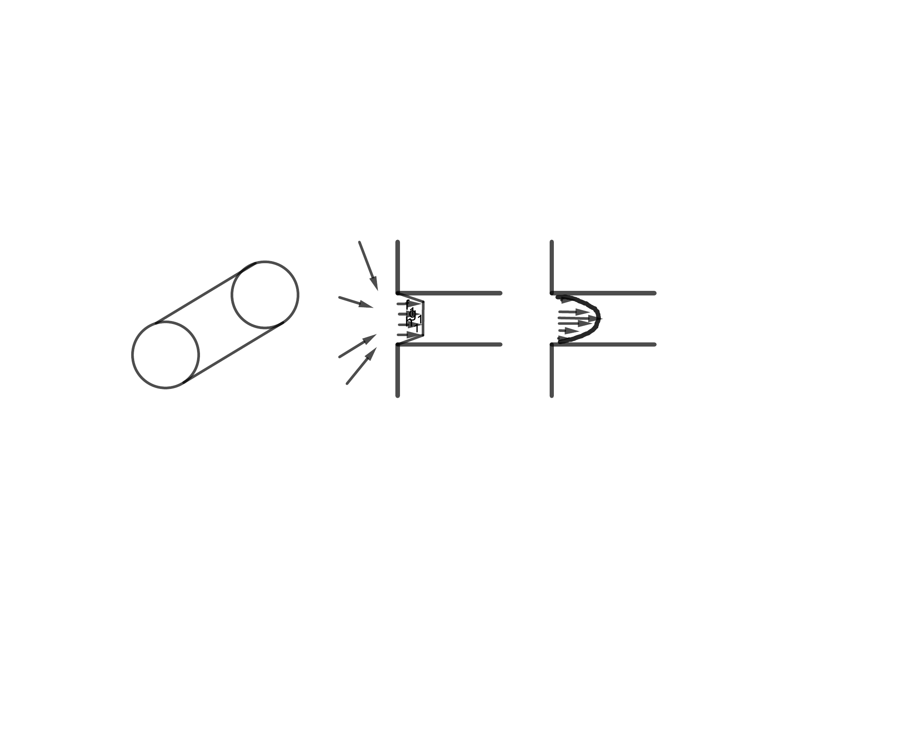
<figcaption>internal flow regime: developing and developed flow</figcaption>
</figure>

Internal flow regimes: developing flow and fully developed flow. The developed flow is unchanging in $x$.

The cylinder is $2a$ in diameter. Continuity equation is $$\pp{u}{x}+\pp{v_r}{r}+\frac{v_r}{r}+\frac{1}{r}\pp{v_{\theta}}{\theta}=0$$ symmetry tells no $v_r,v_{\theta}$, so $\pp{u}{x}=0\quad\Rightarrow\quad  u=u(r)$

$x$-dir momentum equation is $$\rho \Brack{\pp{u}{t}+u\pp{u}{x}+v_r\pp{u}{r}+\frac{v_{\theta}}{r}\pp{u}{\theta}}=X-\pp{p}{x}+\mu \Brack{\pp{^2u}{r^2}+\frac{1}{r}\pp{u}{r}+\frac{1}{r^2}\pp{^2u}{\theta^2}+\pp{^2u}{x^2}}$$ changing into $$0=-\pp{p}{x}+\mu \frac{1}{r}\pp{}{r} \brack{r\pp{u}{r}}$$ no slip cond: $u=0$ at $r=a$. another cond $\pp{u}{r}=0$ at $r=0$. Integrate momentum equation, $$u= \frac{a^2}{4\mu} \brack{-\dd{p}{x}} \Brack{1- \brack{\frac{r}{a}}^2}$$ define $$u_{avg},u_{mean},u_m=\frac{1}{\rho A_c}\brack{\int_{A_c}\rho u \d A_c} =\frac{1}{\rho\pi a^2} \int_0^a\rho u(2\pi r)\d r = \frac{a^2}{8\mu} \brack{-\dd{p}{x}}$$ substituting pressure term, then $$u=2u_{mean} \Brack{1-\brack{\frac{r}{a}}^2}$$

For the shear stress, in Newtonian fluid, $$\tau_{xr}=\mu \brack{\pp{v_r}{x}+\pp{u}{r}}= \mu \pp{u}{r}= \frac{r}{2} \dd{p}{x}$$

Take a $\d x$ length of the cylinder, the net force at two ends should be balanced by the friction of wall. That is $$p\pi a^2- \brack{p+\dd{p}{x}\d x}\pi a^2+\brack{\tau_{xr}}_{wall}2\pi a \d x=0 \quad\Rightarrow\quad  \brack{\tau_{xr}}_{wall}= \frac{a}{2} \dd{p}{x}$$ So this is consistent. [Friction coefficient]{.underline} $C_f$ is a ratio of friction of wall and the dynamic pressure. $$C_f= \frac{\tau_{wall}}{\rho u_m^2/2}= \frac{8\mu u_m}{a\rho u_m^2}=\frac{16}{Re} \qquad Re =\frac{\rho u_m D}{\mu}$$ so in the $Re-C_f$ log-log plot, the slope is $-1$. For turbulance as $Re$ goes up (transition about $Re=2000$), the slope is about $-0.2$.

$C_f$ is fanning friction factor. If using [Darcy friction factor]{.underline} $f$ then $C_f=f/4$

About the power, $$\dot{W}=\Delta p (\pi a^2)u_m$$

## Energy equation

In a control volume, derive from 1st law for control volume. We have input/output: conduction, convection and radiation. Work of the system $\dot{W}$. So the law is the rate of $E_{cv}$ should be equal to net inflow of convection, conduction radiation and surface/body forces.

<figure id="fig:energyeq">
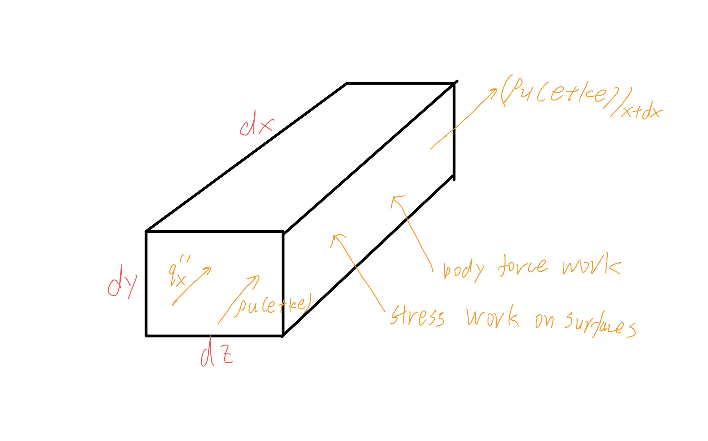
<figcaption>Energy equation C.V.</figcaption>
</figure>

By definition, we have kinetic energy per unit mass $$ke=\frac{1}{2}(u^2+v^2+w^2)=\frac{1}{2} v_kv_k$$ $$E_{cv}=\rho \brack{e+\frac{1}{2}(u^2+v^2+w^2)}V_{cv}$$ $e$ is internal energy per unit mass. Then $$\begin{aligned}
  \pp{}{t} \Brack{\rho \brack{e+\frac{1}{2}v_kv_k}}\d x\d y\d z&=-\pp{}{x_j} \Brack{\rho v_j(e+ke)}\d x\d y\d z-\pp{q_j''}{x_j}\d x\d y\d z\\
  &+ \rho \d x\d y\d z (Xu+Yv+Zw)+\pp{}{x_j}(p_{ij}v_i)\d x \d y\d z \\
&+\rho\d x\d y\d z R
\end{aligned}$$ The first term on $rhs$ is convection, second is conduction, last is radiation (may also include chemical reactions and etc.). $p_{ij}$ term represents for body force and shear stress. `\newline `{=latex}$p_{ij}=-p \delta_{ij}+\tau_{ij}$

Cancel all $\d x\d y\d z$, $$\pp{}{t} \Brack{\rho (e+ke)}+\pp{}{x_j} \Brack{\rho v_j(e+ke)}=-\pp{q_j''}{x_j}+ \rho X_jv_j+\pp{}{x_j}((-p\delta_{ij}+\tau_{ij})v_i) +\rho R$$ using continuity equation $\pp{\rho}{t}+\pp{}{x_j}(\rho v_j)=0$ to simplify, then $$\rho\pp{(e+ke)}{t} +\rho v_j\pp{(e+ke)}{x_j}=-\pp{q_j''}{x_j}+ \rho X_jv_j+\pp{}{x_j}((-p\delta_{ij}+\tau_{ij})v_i) +\rho R$$ on the $lhs$ we can use $\dd[D]{}{t}$ notation. and $$\dd[D]{(ke)}{t}=\dd[D]{}{t} \brack{\frac{v_kv_k}{2}}=v_k \dd[D]{v_k}{t}$$ we get $$\dd[D]{e}{t}+v_j\dd[D]{v_j}{t}=-\pp{q_j''}{x_j}+ \rho X_jv_j+\pp{}{x_j}((-p\delta_{ij}+\tau_{ij})v_i) +\rho R$$ using momentum equation, $\rho\dd[D]{v_i}{t}=\pp{p_{ij}}{x_j}+\rho X_i$ to simplify. Multiply it by velocity, we get [Mechanical energy equation]{.underline} $$\rho \DD{(ke)}{t}=\rho v_k\DD{v_k}{t}=v_i\pp{p_{ij}}{x_j}+\rho v_iX_i$$ And use mechanical energy equation to simplify, getting [thermal energy balance equation ]{.underline}or thermal transport equation $$\rho \DD{e}{t}=-\pp{q_j''}{x_j}+p_{ij}\pp{v_i}{x_j}+\rho R$$ It can also be written $$\rho \Brack{\DD{e}{t}+\frac{p}{\rho}\pp{v_i}{x_i}}=-\pp{q_i''}{x_i}+\tau_{ij}\pp{v_i}{x_j}+\rho R$$ Then make use of continuity $$\pp{v_i}{x_i}=-\frac{1}{\rho}\DD{\rho}{t}=\rho \DD{\rho^{-1}}{t}$$ we get $$\rho \Brack{\DD{e}{t}+p\DD{}{t} \brack{\frac{1}{\rho}}}=-\pp{q_i''}{x_i}+\tau_{ij}\pp{v_i}{x_j}+\rho R$$ We want to use enthalpy, that is $i=e+p/\rho$, we get $$\rho \DD{i}{t}-\DD{p}{t}=-\pp{q_i''}{x_i}+\Phi +\rho R \qquad \Phi=\tau_{ij}\pp{v_i}{x_j}$$ $\Phi$ is viscous dissipation function. Most of the time dissipation can be neglected in engineering. Also for $\DD{p}{t}$.

For gases, $\Phi$ is less likely to take effect unless in turbines. $\DD{p}{t}$ may be affective. For liquids, it is often incomressible, so $\DD{\rho}{t}=0$, $c_v=c_p=c$,$e=i$, $$\rho\DD{e}{t}=\rho\DD{i}{t}=\rho c(T)\DD{T}{t}=-\pp{q_i''}{x_i}+\Phi -\rho R$$

Integrating to get mean properties, we want to get thermal energy convected in axial direction. Mean enthalpy $i_m$, $$\dot{m} i_m=\int_{A_c}\rho ui \d A_c$$ If $\rho=\const$, $c_p=\const$, $i=c_pT$, define $i_m=c_pT_m$. For a cylinder tube, radius $a$, we have $$\text{in: } \pi a^2\rho u_mi_m \qquad \text{out: } \pi a^2\rho u_m \brack{i_m+\dd{i_m}{x}\d x}$$ while in the C.V. heat transfer from wall is $q_w''(2\pi a \d x)$. From out=in+tran, we get $$\pi a^2 \rho u_m \dd{i_m}{x} \d x=q_w''(2\pi a)\d x$$ further, $$\label{eq:4}
T_m= \frac{1}{u_mA_c}\int uT \d A_c\qquad q_w''=\frac{1}{2}a\rho u_m c_p \dd{T_m}{x}$$

## Summary

Continuity

:   $$\pp{\rho}{t}+\pp{}{x}(\rho u)+\pp{}{y}(\rho v)+\pp{}{z}(\rho w)=0$$ If incompressible, can be simplified.

Momentum

:   $x$-dir, incompressible flow, $\mu$ const $$\rho \DD{u}{t}=-\pp{p}{x}+ \mu \Brack{\pp{^2u}{x^2}+\pp{^2v}{y^2}+\pp{^2w}{z^2}}+X$$

Energy

:   $q_i''=-k \pp{T}{x_i}$, $i=c_pT$, $$\begin{aligned}
        \rho c_p\DD{T}{t}&=\pp{}{x} \brack{k\pp{T}{x}}+\pp{}{y} \brack{k\pp{T}{y}}+\pp{}{z} \brack{k\pp{T}{z}}+\Phi+\rho R \\
        &=k\nabla^2T+\Phi+\rho R \qquad (\const\, k)

    \end{aligned}$$

Example

:   Fully Dev flow in round tube, lam. flow, energy eqn. Ignored heat gen, viscosity diffusion. $$\rho u c_p \pp{T}{x}+\rho v_r c_p\pp{T}{r}= \frac{k}{r} \pp{}{r} \brack{r \pp{T}{r}}+ \frac{k}{r^2}\pp{^2T}{\theta^2}+k \ppn{T}{x}$$

# Fully Developed and developing flow

Fully developed: velocity field and thermal field.

## FD flow in round pipe

Energy equation for round pipe, `\marginnote{FD refers to fully developed.}`{=latex} $$\rho u c_p \pp{T}{x}+\rho v_r c_p\pp{T}{r}= \frac{k}{r} \pp{}{r} \brack{r \pp{T}{r}}+ \frac{k}{r^2}\pp{^2T}{\theta^2}+k \ppn{T}{x}$$ the $\theta$ term need not to be considered. But $\ppn{T}{x}$ can also be neglected in common situation, as it represents **conduction**, which is much slower than **convection**. We only need to consider it if the velocity is slow or the liquid is highly conductive. And with $v_r=0$, we end up with $$\label{eq:1}
\rho u c_p\pp{T}{x}= \frac{k}{r}\pp{}{r} \brack{r \pp{T}{r}}$$ The FD flow provile is given by `\autoref{sec:developed-flow-pipe}`{=latex} $$u=u_m \brack{1- \brack{\frac{r}{a}}^2} \qquad u_m=\frac{a^2}{8\mu} \brack{-\dd{p}{x}}$$ In order to make use of FD condition, the unitless temperature is introduced. $$\phi= \frac{T_w(x)-T(x,r)}{T_w(x)-T_m(x)} \qquad \pp{\phi}{r}=\frac{-1}{T_w-T_m}\pp{T}{r}$$ And FD means $\phi$ is only a function of $r$. With $\phi$, we can compute $q_w''$ and $h$. `\marginnote{note $\pp{\phi}{r}$ is also only a function of $r$.}`{=latex} $$q_w''=-k\pp{T}{r}\bigg|_{r=a}=k(T_w-T_m)\pp{\phi}{r}(r=a) \qquad h =\frac{q_w''}{T_w-T_m}=k\pp{\phi}{r}(a)$$

We need to specify BCs to solve the problem. There are usually 2 cases.

1.  constant heat flux $q_w''=\const$ $$\begin{aligned}
      &\phi=f(r)\quad\Rightarrow\quad \pp{\phi}{x}=\pp{}{x} \Brack{\frac{T_w-T}{T_w-T_m}}=0\\
    \quad\Rightarrow\quad  &\frac{1}{T_w-T_m}\dd{T_w}{x}-\frac{1}{T_w-T_m}\pp{T}{x}-\frac{T_w-T}{(T_w-T_m)^2}\dd{}{x}(T_w-T_m)=0 \\
      \label{eq:2}
      \quad\Rightarrow\quad & \dd{T_w}{x}-\pp{T}{x}-\phi \dd{}{x}(T_w-T_m)=0
    \end{aligned}$$ as $q_w''\sim (T_w-T_m)$, $q_w''=\const$ means $T_w-T_m$ is const, so `\autoref{eq:2}`{=latex} turns into $\dd{T_w}{x}=\pp{T}{x}$. Also $T_w-T_m$ is const leads to $\dd{T_w}{x}=\dd{T_m}{x}$, then, consider heat conservation `\autoref{eq:4}`{=latex} $$\dd{T_w}{x}=\pp{T}{x}=\dd{T_m}{x}$$ substitute $u$ with $u_m$ in Energy equation `\autoref{eq:1}`{=latex}, $$\begin{aligned}
    \frac{u_m}{\alpha}\dd{T_m}{x}\brack{1- \brack{\frac{r}{a}}^2}=\frac{1}{r} \pp{}{r} \brack{r\pp{T}{r}}
    \end{aligned}$$ With BC, $q_w''=-k\pp{T}{r}$ at $r=a$ and $\pp{T}{r}=0$ at $r=0$, and make use of `\autoref{eq:4}`{=latex} $$\dd{T_m}{x}= \frac{2 q_w''}{\rho u_m a c_p}$$ the solution is $$T(x,r)=T_w(x)- \frac{2 u_m a^2}{\alpha}\dd{T_m}{x} \Brack{\frac{3}{16}+\frac{1}{16} \brack{\frac{r}{a}}^4-\frac{1}{4} \brack{\frac{r}{a}}^2}$$ $$T_m(x)=T_w(x)-\frac{11}{96} \brack{\frac{2u_m}{\alpha}}\dd{T_m}{x}a^2$$ the relation of $\partial_x T_m$ and $q_w''$, in this case, the convection coefficient is $$h=\frac{q_w''}{T_w-T_m}= \frac{48}{11} \frac{k}{2a} \quad \text{or} \quad Nu_D=\frac{hD}{k}=\frac{48}{11}\approx 4.364$$

2.  constant wall temperature $T_w$. According to `\autoref{eq:2}`{=latex}, $$\pp{T}{x}- \frac{T_w-T}{T_w-T_m}\dd{T_m}{x}=0 \quad\Rightarrow\quad  \pp{T}{x}=\phi(r)\dd{T_m}{x}$$ using energy equation, $$\frac{u}{\alpha}\phi(r) \dd{T_m}{x}=\frac{1}{r}\pp{}{r} \brack{r\pp{T}{r}}$$ B.C., $T(a)=T_w,\pp{T}{r}|_{r=0}=0$. Assume the solution is of infinite series, then $$\phi(r)=1.803 \sum_{n=0}^{\infty}c_{2n} \brack{\frac{r}{a}}^{2n}$$

    \begin{questionbox}{The property of $\phi$?}
    With the definition of $\phi$, I found it would be strange if take average on it:
    \begin{equation}
    \phi=\frac{T_w-T}{T_w-T_m} \quad\Rightarrow\quad  T_w-T=(T_w-T_m)\phi
    \end{equation}
    take average on both side,  as $T_w$ and $T_m$ is not function of $r$,
    \begin{equation}
    T_w-T_m=(T_w-T_m) \frac{1}{u_mA_c}\int u\phi \d A_c
    \end{equation}
    Cancel out $T_w-T_m$, we find
    \begin{equation}
    u_m A_c=\int u\phi \d A_c
    \end{equation}
    and with the definition of $u_m$
    \begin{equation}
    u_m=\frac{1}{A_c}\int u\d A_c\quad\Rightarrow\quad  \int (u-u\phi)\d A_c=0
    \end{equation}
    For the case of fully developed flow in the pipe, as $u$ is already known,
    \begin{equation}
    \int_0^au_m \brack{1- \brack{\frac{r}{a}}^2}(1-\phi)r\d r=0 \quad\Rightarrow\quad \int_0^a \brack{1- \brack{\frac{r}{a}}^2}(1-\phi)r\d r=0
    \end{equation}
    So is the eqn. above a condition that every $\phi$ should satisfy, or we can even solve $\phi$ from it?
    \end{questionbox}

    substitute, generate equations for coefficients that balance powers of $r$. $$c_0=1 \quad c_2=-\frac{1}{4}\lambda_0^2=-1.828397 \quad c_{2n}=\frac{\lambda_0^2}{(2n)^2}(c_{2n-4}-c_{2n-2}) \quad \lambda_0=2.704364$$ In this situation, $Nu_D=\frac{h(2a)}{k}=3.657$, $q_w''=h(T_w-T_m)$ is getting smaller as $T_m$ increases. As $h=3.657 \frac{k}{D}$, if we want a higher $h$, then we need larger $k$ or smaller $D$.

Stanton number is a ratio of heat transfer and heat capacity. $$St\equiv \frac{h}{\rho u_m c_p}$$ $$Nu=St\cdot Pr\cdot Re \qquad Pr=\frac{\mu c_p}{k} \qquad Re=\frac{\rho u_m D}{\mu}$$

## FD Flow in Rectangular Channel

Rectangular channals, flow in $x$, dir $y,z$ length $b,a$. Fully developed steady flow, neglect viscosity, dissipation, radiation and press work, const properties, neglect axial conduction. $$\text{Continuity:  } \underbrace{\pp{u}{x}}_{=0}+\pp{v}{y}+\pp{w}{z}=0 \text{    B.C.   } v=w=0$$ so everywhere $v=w=0$. $$\text{Momentum:   } \rho \brack{u\pp{u}{x}+v\pp{u}{y}+w\pp{u}{z}}=-\pp{p}{x}+\mu \brack{\ppn{u}{y}+\ppn{u}{z}}$$ $$\quad\Rightarrow\quad  \ppn{u}{y}+\ppn{u}{z}=\frac{1}{\mu}\pp{p}{x}$$ as $\pp{p}{x}=\const$, this is poisson equation. We solve this with B.C. $u=0$ on boundaries. And we expect $\pp{u}{y}=\pp{u}{z}=0$ at centerline.

With $u(y,z)$, $$\rho c_p \brack{u \pp{T}{x}+\underbrace{v\pp{T}{y}+w\pp{T}{z}}_{=0}}=k \brack{\ppn{T}{y}+\ppn{T}{z}}$$ $$\quad\Rightarrow\quad \frac{u(x,y)}{\alpha}\pp{T}{x}=\ppn{T}{y}+\ppn{T}{z}$$ We can solve the equation for $T=T_w$ or $q=q_w$ at boundaries.

To solve, postulate temperature field $T=\phi(y,z)f(x)$, substitute into equation, we get $$\frac{f'}{f}=\frac{\alpha \nabla^2\phi}{u(y,z)\phi} =\const$$ we can solve the combination for every $a,b$.

\centering

::: {#tab:Nusdifshape}
  ----------- ---------- -------------------- ----------------------
                $b/a$     $Nu$, Heat flux BC   $Nu$, Temperature BC
    Circle                      4.364                  3.66
   Triangle                      3.11                  2.49
   Rectangle     1.0             3.61                  2.98
   Rectangle     2.0             4.12                  3.39
   Rectangle     4.0             5.33                  4.44
   Rectangle     8.0             6.49                  5.60
   Rectangle   $\infty$         8.235                  7.54
  ----------- ---------- -------------------- ----------------------

  : Nussel number in different shape
:::

Two affecting factors are the minimal distance from centerline to edges and internal corner angles. We can also use Stanton number.

Colburn $j$ factor, which is defined as $$j\equiv St Pr^{2/3}$$ Since $Nu$ is const for fully developed flow, $StPr\propto Re^{-1}$. Friction factor $c_f=f_{Fanning}=16Re^{-1}$, so $St\propto c_f$, meaning when we raise $St$, the friction effect also increased. This is heat/momentum transport analogy.

## Thermal Entry Flow Between Parallel Plates

\marginnote{Garetz problem}

Now we want to know what is the condition of fully developed flow.

<figure id="fig:flowbetweenparallelplates">
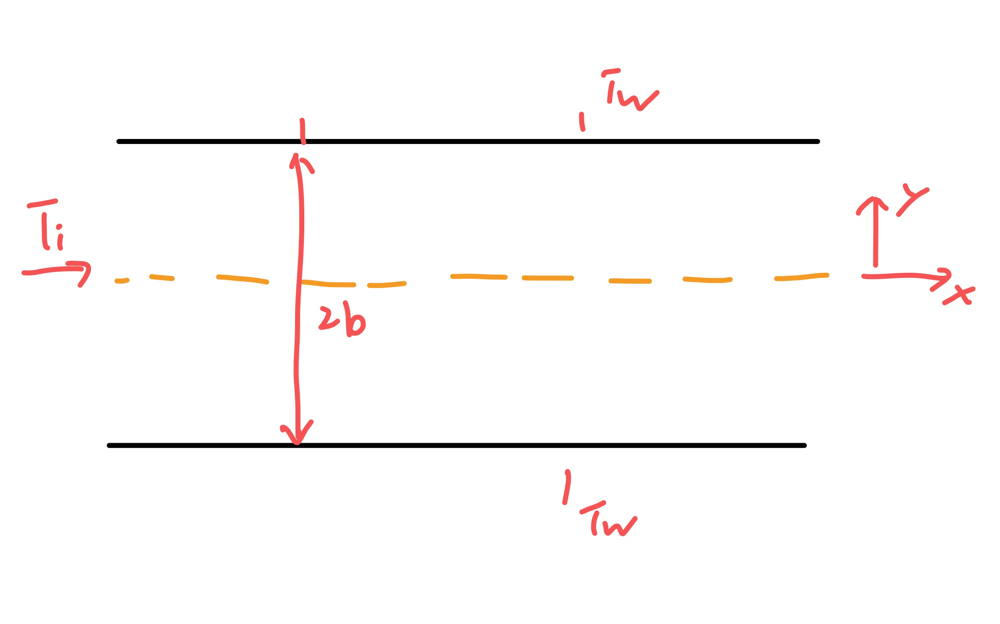
<figcaption>Flow between parallel plates</figcaption>
</figure>

$$D_H= \frac{4A_0}{D_w}=\frac{4 (2b)(1)}{2}=4b$$ The energy equation is $$\rho uc_p\pp{T}{x^{*}}=\pp{}{y^{*}} \brack{k \pp{T}{y^{*}}}$$ For developing flow we can have

(1) velocity field and $T$ developing

(2) velocity field fully developed, and $T$ is developing. Can occur when unheated entry or large $Pr$

we assume the second situation. The velocity profile is $$\frac{u}{u_m}=\frac{3}{2} \Brack{1- \brack{\frac{y^{*}}{b}}^2}$$ take $\rho c_p=\const$, $\alpha=k/\rho c_p$, $\alpha_{ref}=k_{ref}/\rho c_p$, dimensionless number $$y=\frac{y^{*}}{b} \qquad x= \frac{2x^{*}}{3u_m b^2/\alpha}=4\frac{x^{*}}{b} \frac{\alpha_{ref}}{\nu} \frac{\nu}{u_m(4b)} \frac{2}{3}= \frac{2}{3}  \frac{x^{*}}{b} \frac{4}{Pe}$$ where $Pe$ is Peclet number, $Pe=RePr$. Partially dimensions form: $$\frac{2}{3} \frac{u}{u_m}\pp{T}{x}=\pp{}{y} \brack{\frac{\alpha}{\alpha_{ref}}\pp{T}{y}}$$ $$\theta=\frac{T-T_w}{T_i-T_w}\quad\Rightarrow\quad  (1-y^2)\pp{\theta}{x}=\pp{}{y} \brack{\frac{\alpha}{\alpha_{ref}}\pp{\theta}{y}}$$ BC: $\theta(0,y)=\theta_i=1$, $\theta(x,\pm 1)=\theta_w=0$.

Postulate: $\theta(x,y)=X(x)Y(y)$, then $$(1-y^2)X'Y=\frac{\alpha'(y)}{\alpha_{ref}}+\frac{\alpha (y)}{\alpha_{ref}}XY'' \quad\Rightarrow\quad  \frac{X'}{X}=\frac{\alpha'}{\alpha_{ref}}\frac{Y'}{(1-y^2)Y}+\frac{\alpha}{\alpha_{ref}}\frac{Y''}{(1-y^2)Y}=-\beta^2$$ First consider $\alpha$ is constant, we get $$X'+\beta^2X=0 \quad\Rightarrow\quad  X=C\exp{-\beta^2x}$$ $$Y''+(1-y^2)\beta^2Y=0$$ We can have different $\beta$s. This is called Sturm-Liouville problem.

\begin{mybox}{Sturm-Liouville Problem}
\begin{equation}
\dd{}{y} \brack{r(y)\dd{\phi}{y}}+[q(y)+\lambda p(y)]\phi=0
\end{equation}
BC: $a_1\phi(a)-a_2\phi'(a)=0$, $b_1\phi(b)-b_2\phi'(b)=0$.
\tcblower
Usually there will be eigenvalues $\lambda_m=\{\lambda_1,\lambda_2,\dots\}$, and also eigenfunctions $\phi_m$. Any two eigenfactors are orhogonal.
\begin{equation}
\text{Orthogonality:  }\rightarrow \qquad \int_a^bp(y)\phi_m(y)\phi_n(y)\d y=0 \qquad n\neq m
\end{equation}
\end{mybox}

Method of Frobenius: we postulate $$Y=\sum_{n=0}^{\infty}a_ny^{n+c}$$ so we get $$\sum a_n(n+c)(n+c-1)y^{n+c-2}+\beta^2\sum a_n y^{n+c}-\beta^2\sum a_n y^{n+c+2}=0$$ then we get $$\begin{aligned}
  &n=0 \quad\Rightarrow\quad a_0c(c-1)=0 \quad\Rightarrow\quad  c=0,1\\
  &n=1 \quad\Rightarrow\quad a_1c(c+1)=0 \quad\Rightarrow\quad \text{choose } a_1=0
\end{aligned}$$ repeat the process to get other coefficients. `\marginnote{we set $a_1=0$ only for convenience, it does not matter.}`{=latex} $$a_n=\frac{-\beta^2(a_{n-2}-a_{n-4})}{(n+c)(n+c-1)}$$ $$Y=c_1 \Brack{1-\frac{\beta^2}{2}y^2+\frac{\beta^2}{12} \brack{\frac{\beta^2}{2}+1}y^4+\cdots}+c_2 \Brack{y-\frac{\beta^2y^3}{16}+\frac{\beta^2}{20} \brack{\frac{\beta}{6}+1}y^5+\cdots}$$ But the situation is symmetric with $y=0$, so only have $c_1$ term, or say $c_2=0$. And the remaining is the eigenfunction.

B.C. require $Y(1)=0$, so $\beta$ are the roots of $$1-\frac{\beta^2}{2}+\frac{\beta^2}{12} \brack{\frac{\beta^2}{2}+1}+\cdots=0\quad\Rightarrow\quad  \beta_0=1.67 \qquad \beta_1=5.67\quad \dots$$ Now $$\theta=\sum c_m\exp{-\beta_m^2x}Y_m(y)$$ using B.C., $$\theta(0,y)=1 \quad\Rightarrow\quad \sum c_mY_m(y)=1$$ multiply both sides by $(1-y^2)Y_n$ and integrate, $$\int_{-1}^1(1-y^2)Y_n\d y=\sum_m \int_{-1}^1c_mY_mY_n(1-y^2)\d y=c_n\int_{-1}^1Y_n^2(1-y^2)\d y$$ so we get $$c_n=\frac{  \int_{-1}^1(1-y^2)Y_n\d y}{\int_{-1}^1(1-y^2)Y_n^2\d y}$$

Once we get the function, $$\begin{aligned}
  Nu &= \frac{h\cdot 4b}{k}=\frac{4b q_w}{k(T_w-T_m)}=-\frac{4}{\theta_m} \brack{\pp{\theta}{y}}_{y=1}\\
  &= \frac{4\sum c_m\exp{-\beta^2_mx}Y_m'(1)}{\frac{3}{2}\sum c_m\exp{-\beta_m^2x}Y_m'(1)/\beta_m^2}
\end{aligned}$$ At large $x$, only the first term dominates, and Nussel number $\rightarrow$ $8\beta_0^2/3=7.56$. The process is $$Nu(x=0.0067)=13.1 \quad Nu(x=0.0667)=8.20 \quad Nu(x=0.2)=7.52 \quad Nu(x=1)=7.52$$

## Developing Flow in Round Tube {#sec:devel-flow-round}

constant heat flux $$u\pp{T}{x^{*}}=\frac{\alpha}{r}\pp{}{r} \brack{r\pp{T}{r}} \qquad T(0,r)=T_i=0 \quad\pp{T}{r}\bigg|_{r=0}=0 \quad \pp{T}{r}\bigg|_{r=r_w}=\frac{q_w}{k}$$ we solve for $T-T_{FD}$, as $T-T_{FD}\rightarrow 0$ as $x^{*}\rightarrow \infty$. Fully developed solution for this case can be written as $$\frac{T_{FD}}{q_wr_w/k}=\frac{4x^{*}/r_w}{Re Pr}-4 \Brack{\frac{3}{16}-\frac{1}{4} \brack{\frac{r}{r_w}}^2+\frac{1}{16} \brack{\frac{r}{r_w}}^4}$$ we postulate solution of the form $$T=T_{FD}+ \frac{q_wr_w}{k}V(x^{*},r)$$ substitute and use the fact that $$u\pp{T_{FD}}{x}=\frac{\alpha}{r}\pp{}{r} \brack{r\pp{T_{FD}}{r}}$$ leads to $$2u_m \brack{1- \brack{\frac{r}{r_w}}^2} \pp{V}{x^{*}}=\frac{\alpha}{r} \pp{}{r} \brack{r\pp{V}{r}}$$ we define dimensionless $$r^+=\frac{r}{r_w} \qquad x= \frac{x^{*}}{r_w} \brack{\frac{1}{RePr}}\qquad Re=\frac{u_m(2r_w)}{\nu} \qquad Pr=\frac{\nu}{\alpha}$$ then get $$(1-(r^+)^2)\pp{V}{x}=\frac{1}{r^+} \pp{}{r^+}\brack{r^+\pp{V}{r^+}}$$ BCs $$\pp{V}{r^+}\bigg|_{r^+=0}=0 \qquad \pp{V}{r^+}\bigg|_{r^+=1}=-\frac{3}{4} \qquad V|_{x=0}=\frac{3}{4}-(r^+)^2+\frac{1}{4}(r^+)^4$$ We still use separation of variables. Same methdology as flat plate case except eigenfunctions are different. Result is $$\label{eq:round-tube-developing-re}
Nu_x= \Brack{\frac{1}{Nu_{\infty}}-\frac{1}{2}\sum_m \frac{1}{A_m\gamma_m^4}\exp{-\gamma_m^2x}}^{-1}$$ $$\gamma_1^2=25.68 \quad \gamma_2^2=83.86\quad A_m=7.63\times 10^{-3} \quad A_m=2.053\times 10^{-3}$$ Then compute $x$ with $Nu$, $$\begin{aligned}
  &Nu_x(0)=\infty \quad Nu_x(0.002)=12.00 \quad Nu_x(0.010)=7.49\\
  &Nu_x(0.040)=5.19\quad Nu_x(0.100)=4.51 \quad Nu_x(\infty)=4.36
\end{aligned}$$

Now constant wall temperature $T_w$ case $$u\pp{T}{x}=\alpha \Brack{\frac{1}{r}\pp{}{r} \brack{r\pp{T}{r}}}+\alpha \ppn{T}{x}$$ Non-dimensionalize, $$r^+=\frac{r}{r_w} \qquad u^+=\frac{u}{u_m}\qquad x^+=\frac{2(x/2r_w)}{RePr} \qquad \theta=\frac{T_w-T}{T_w-T_i}$$ we get $$\frac{u^+}{2}\pp{\theta}{x^+}=\ppn{\theta}{(r^+)}+\frac{1}{r^+}\pp{\theta}{r^+}+\frac{1}{(RePr)^2}\pp{\theta}{(x^+)}$$ as $\theta,u^+,x^+,r^+$ are expected to have order $1$, if $Pe=RePr$ is very large, then the last term can be neglected. But if $Pe$ is very small, it will become important.

We assume this is hydrodynamically fully developed, so $u^+=2(1-r^{+2})$. Then postulate speparation of variables. $$\theta(x^+,r^+)=R(r^+)X(x^+)\quad\Rightarrow\quad  \frac{X'}{X}=-\lambda^2$$ the solution has the form $$\theta(x^+,r^+)=\sum_{n=0}^{\infty}c_nR_n(r^+)\exp{-\lambda_n^2x^+}$$ $c_n$ and $R_n(r^+)$ are determined using Sturm-Liouville process. Then we can have $T_m(x^+)$, $q_w$ and $h$, $Nu$ $$\begin{aligned}
  &Nu(0)=\infty \quad Nu(0.001)=12.80 \quad Nu(0.01)=6.00\\
  &Nu(0.10)=3.71 \quad Nu(\infty)=3.66
\end{aligned}$$ FD conditions reached at $x^+\approx 0.10$. $$\frac{2(x/D)}{RePr}=0.1 \quad\Rightarrow\quad  (x/D)_{FD}=0.05 RePr \sim 5 \text{ for air at } Re=100$$

## Summary

FD flow and heat transfer.

round pipe: $$\frac{u}{u_m}=2 \brack{1-\frac{r^2}{r_w^2}}\qquad f=\frac{\tau_w}{\rho u_m^2/2}=\frac{16}{Re}$$ $$\phi= \frac{T_w-T}{T_w-T_m}=\phi(r) \quad\Rightarrow\quad  h_{FD}= \frac{q_w}{T_w-T_m}=\const$$ $$\frac{h_{FD}D}{k}=Nu_{FD}=\const$$ $$u(r)\pp{T}{x}=\frac{k}{\rho c_p} \frac{1}{r}\pp{}{r} \brack{r\pp{T}{r}}$$ $\pp{T}{x}$ is const if $q_w$ is const, and $Nu_{FD}=4.36$, geometry affects.

Thermally developing flows. velocity field FD. $T(x,r)$, $u(r)$, $v=0$ $$u(r)\pp{T}{x}=\frac{k}{\rho c_p} \frac{1}{r}\pp{}{r} \brack{r\pp{T}{r}}$$ Isothermal wall $T(x=0,r)=T_m$, $T(x,r_w)=T_w$, $\pp{T}{r}(x,r=0)=0$

<figure id="fig:nuwithdev">
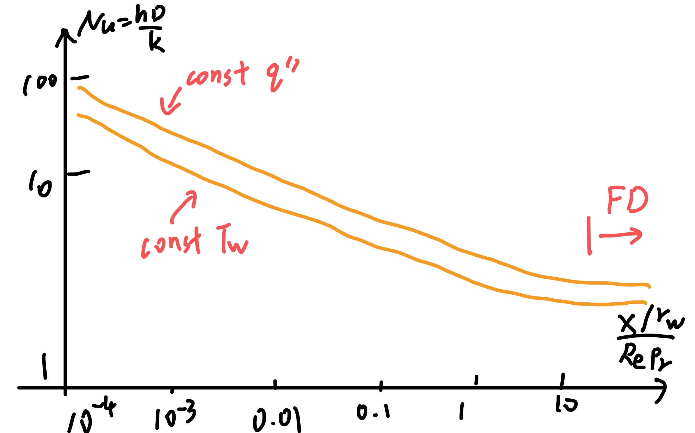
<figcaption>Nussel number along developing.</figcaption>
</figure>

# Boundary Layer

\begin{mybox}{Solution strategies}
  \begin{itemize}
  \item Analytical solutions or solving PDEs using math tools.
  \item PDE to ODE, using similarity, solve PDE with math tools or numerically.
  \item PDE, use finite difference or finite element equations, solve numerically.
  \end{itemize}
\end{mybox}

## Leveque Models

#### Near inlet heat transfer

Two parallel plates. Hydrodynamically to fully developed: $$u=u(y)\quad v=0 \quad\Rightarrow\quad  \frac{u}{u_m}=6 \brack{\frac{h}{H}-\frac{y^2}{H^2}}$$ Thermally developing, Leveque I model. $$u\pp{T}{x}=\alpha \ppn{T}{y}$$ At the boundary, want to linearize $u$. $$u=\underbrace{u_w}_{=0}+\pp{u}{y}\bigg|_wy+\frac{1}{2}\ppn{u}{y}\bigg|_wy^2+\cdots= \frac{\tau_w}{\mu}y$$ so $u=\beta y$, $\beta=\tau_w/\mu$, and $$\beta y\pp{T}{x}=\alpha\ppn{T}{y}$$ BC: at $x=0$, $T=T_i$; at $y=0$, $T=T_w$; at $y=H/2$, $\pp{T}{y}=0$. But we replace the last one with $T=T_i$ as $y\rightarrow \infty$.

Define a similarity variable, `\marginnote{usually let $\eta=cy^nx^{-p}$, and go through the process, choose suitable param value to let $x$-dependent terms (both in equation and BC) drop off.}`{=latex} $$\eta=  \brack{\frac{\beta}{9\alpha x}}^{1/3}y \qquad \pp{}{x}=\dd{}{\eta}\pp{\eta}{x}\qquad \pp{}{y}=\dd{}{\eta}\pp{\eta}{y}$$ then we get $$\ddn{T}{\eta}=-3\eta^2\dd{T}{\eta} \qquad T=T_w,\eta=0\quad T=T_i,\eta\rightarrow \infty$$ can show the solution is $$\frac{T-T_w}{T_i-T_w}=\frac{\int_0^{\eta}\exp{-s^3}\d s}{\int_0^{\infty}\exp{-s^3}\d s}=\frac{1}{0.893}\int_0^{\eta}\exp{-s^3}\d s$$ $$h=\frac{-k}{T_w-T_i} \pp{T}{y}\bigg|_{y=0}=\frac{k}{0.893} \brack{\frac{\beta}{9\alpha x}}^{1/3} \quad\sim\quad x^{-1/3}$$ We expect $h\sim k/\delta_t$, so $\delta_t\sim x^{1/3}$. $$Nu=\frac{hD_H}{k}=\frac{h(2H)}{k}= \brack{\frac{D_H}{k}}^{1/3} \brack{\frac{12 u_mD_H}{9\alpha}}^{1/3} \frac{1}{0.893}=1.23 \brack{\frac{D_H}{x}}^{1/3} \brack{\frac{u_mD_H}{\nu}}^{1/3} \brack{\frac{\nu}{\alpha}}^{1/3}$$ $$q_w=-k\pp{T}{y}\bigg|_{y=0}=\frac{k}{0.893 (9)^{1/3}} \brack{\frac{\beta}{\alpha x}}^{1/3}(T_w-T_i)$$ $$\quad\Rightarrow\quad q_w=0.538 k \brack{\frac{\tau_w}{\mu \alpha x}}^{1/3}(T_w-T_i)$$ This implies $q_w\sim \tau_w^{1/3}$, so increasing $q_w$ will lead to increase of $\tau_w$.

\begin{mybox}{Leveque I model}
  \begin{equation}
Cy\pp{T}{x}=\alpha\ppn{T}{y}
\end{equation}
$q_w\sim x^{-1/3}(T_w-T_i)$, $h\sim x^{-1/3}$, $Nu_x=\frac{hx}{k}\sim x^{2/3}$
\end{mybox}

There are other models.

\begin{mybox}{Slug Flow}
  \marginnote{Slug flow is where $u=c$ is constant}
  \begin{equation}
C\pp{T}{x}=\alpha\ppn{T}{y}
\end{equation}
$q_w\sim x^{-1/2}(T_w-T_i)$, $h=\frac{q_w}{T_w-T_i}\sim x^{-1/2}$, $Nu_x=\frac{hx}{k}\sim x^{1/2}$
\end{mybox}

For round tubes, $$u(r)\pp{T}{x}=\frac{\alpha}{r}\pp{}{r} \brack{r\pp{T}{r}}$$ FD flow $u=2u_m(1-(r/a)^2)$. Also use Leveque I approximation, $$u=\pp{u}{r}\bigg|_{r=a}(r-a)$$ set transformation $s=a-r$, assume $s\ll a$ so $a-s\approx a$ $$\frac{4u_ms}{a}\pp{T}{x}=\alpha\ppn{T}{s}$$

With similar approach, the result is $$Nu_x=\frac{hx}{k}=1.077(2a Pe/x)^{1/3}=1.36(x^+)^{-1/3} \qquad Pe=Re_DPr \quad x^+=\frac{x/a}{Re_DPr}$$ this models the left part of `\autoref{fig:nuwithdev}`{=latex}, and when the slope changes in the graph, it comes to fully developed state.

Leveque II, Thermal and quasi-hydro development. Parallel plates. $$u\pp{T}{x}+v\pp{T}{y}=\alpha\ppn{T}{y}$$ take $u=u(x,y)$, and $v\pp{T}{y}$ is small enough to negect. Take $u=\tau_w(x)y/\mu=\beta(x)y$. Integrate continuity equation, $$v=-\int\pp{u}{x}\d y=-\dd{\tau_w}{x}\int \frac{y}{\mu}\d y$$ assume $v\pp{T}{y}\ll u\pp{T}{x}$, we find $$u\pp{T}{x}=\alpha\ppn{T}{y} \quad\Rightarrow\quad  \frac{\tau_w(x)}{\alpha\mu}\pp{T}{x}=\frac{1}{y}\ppn{T}{y}$$ let $\d s=\alpha \mu /\tau_w(x) \d x$, $s=\int_0^x\alpha\mu/\tau_w(x) \d x$. Then equation becomes $$\pp{T}{s}=\frac{1}{y}\ppn{T}{y}$$ define $\eta=y/(9s)^{1/3}$, and the solution is $$\frac{T-T_w}{T_i-T_w}=\frac{1}{0.893}\int_0^{\eta}\exp{-\lambda^3}\d \lambda \qquad q_w(s)=\frac{(T_w-T_i)k\alpha^{-1/3}\mu^{-1/3}}{9^{-1/3}0.893}\int_{\overline{x}=0}^x \frac{\d \overline{x}}{\tau_w(\overline{x})}$$

#### Leveque III

$T(x,y),u(x,y),v(x,y)$. Again, $$\rho c_p \Brack{u\pp{T}{x}+v\pp{T}{y}}=k\ppn{T}{y}$$ apply the von mises transform $(x,y)\rightarrow (x,\psi)$, $\psi$ is stream function, $u=\psi_y$, $v=-\psi_x$. Convert $T(x,y)$ to $T(x,\psi(x,y))$. $$\begin{aligned}
  &u\ppp{T}{x}{y}=\ppp{\psi}{y}{x} \Brack{\ppp{T}{x}{\psi}+\ppp{T}{\psi}{x}+\ppp{\psi}{x}{y}}\\
  &v\ppp{T}{y}{x}=-\ppp{\psi}{x}{y}\ppp{T}{\psi}{x}\ppp{\psi}{y}{x}\\
  &\frac{k}{\rho c_p}\ppn{T}{y}= \frac{k}{\rho c_p}u\ppp{}{\psi}{x} \brack{u\ppp{T}{\psi}{x}}
\end{aligned}$$ $$\quad\Rightarrow\quad  u\ppp{T}{x}{\psi}= \frac{k}{\rho c_p} u\ppp{}{\psi}{x} \brack{u\ppp{T}{\psi}{x}}$$ this equation includes $v\pp{T}{y}$ term explicitly. Assume in the boundary layer region, $u=\tau_w(x)y/\mu$, $$\quad\Rightarrow\quad  \pp{\psi}{y}=\frac{\tau_w(x)y}{\mu}\quad\Rightarrow\quad  \psi=\frac{\tau_w(x)y^2}{2\mu}$$ so the actual transfrom is $$y= \sqrt{\frac{2\mu}{\tau_w(x)}}\psi^{1/2}\qquad u= \sqrt{\frac{2\tau_w(x)}{\mu}}\psi^{1/2}$$ $$\quad\Rightarrow\quad \frac{1}{k/\rho c_p} \frac{1}{(2\tau_w(x)/\mu)^{1/2}}\pp{T}{x}=\pp{}{\psi} \Brack{\psi^{1/2}\pp{T}{\psi}}$$ $$\text{let  }z=\psi^{0.5} \qquad V=\frac{1}{4}\int_0^x \frac{k}{\rho c_p} \brack{\frac{2 \tau_w(\overline{x})}{\mu}}^{1/2}\d \overline{x}$$ $$\quad\Rightarrow\quad  \pp{T}{V}=\frac{1}{z}\ppn{T}{z}$$ this is equivalent to Leveque II equation if $V$ replaces $s$ and $z$ replaces $y$. The solution is $$q''=-k\pp{T}{z}\bigg|_{z=0}=\frac{(T_w-T_i)kV^{-1/3}}{9^{-1/3}(0.893)}$$ rearrange it in physical terms, $$\pp{T}{z}=\pp{T}{y} \brack{\frac{2\mu}{\tau_w(x)}}^{1/2}$$ $$\label{eq:3}
q_w''=-k \brack{\pp{T}{y}}_{y=0}=-k \brack{\pp{T}{z}}_{z=0} \sqrt{\frac{\tau_w(x)}{2\mu}}= \frac{(T_w-T_i)k(\mu\alpha)^{-1/3}\tau_w(x)^{1/2}}{\sqrt[3]{9}(0.893) \Brack{\int_0^x \sqrt{\tau_w(\overline{x}) \d \overline{x}}}^{1/3}}$$

\begin{mybox}{Entry Flow solutions (Approx formulations)}
  \begin{description}
  \item[Leveque I]
\begin{equation}
 \underbrace{\brack{\frac{6u_m}{H}}}_{=u}yT_x=\alpha T_{yy}\quad\Rightarrow\quad  q_w''\sim \frac{T_w-T_i}{x^{1/3}}
\end{equation}
for slug flow $q_w''\sim (T_w-T_i)/x^{1/2}$
\item[Leveque II]
\begin{equation}
\frac{\tau_w(x)}{\mu}yT_x=\alpha T_{yy}\quad\Rightarrow\quad  q_w''=\frac{T_w-T_i}{0.893} \brack{\frac{k}{[9\alpha \mu]^{1/3}}} \brack{\int_0^x \frac{\d \overline{x}}{\tau_w(x)}}^{-1/3}
\end{equation}
\item[Leveque III]
  \begin{equation}
 \brack{\frac{\tau_w(x)}{y}}T_x- \dd{\tau_w(x)}{x}\frac{y^2}{2\mu}T_x=\alpha T_{yy}
\end{equation}
$q_w''$ refers to \autoref{eq:3}
\end{description}
For $\tau_w(x)$, the results of boundary layer flow theory can bu used. For BL laminar flow,
\begin{equation}
\tau_w=0.332 \mu \brack{\frac{u_{\infty}^{3/2}}{\nu^{1/2}}}x^{-1/2}
\end{equation}
For leveque III,
\begin{equation}
q_w''=\frac{(T_w-T_i)k}{x^{1/2}} \brack{\frac{\nu}{\alpha}}^{1/3} \brack{\frac{u_{\infty}}{\nu}}^{1/2} \frac{(0.332)(3/4)^{1/3}}{\sqrt[3]{9}(0.893)}
\end{equation}
\begin{equation}
Nu_x=\frac{q_w''x}{(T_w-T_i)k}=0.339 \brack{\frac{u_{\infty}x}{\nu}}^{1/2} \brack{\frac{\nu}{\alpha}}^{1/3}=0.339 Re_x^{1/2}Pr^{1/3}
\end{equation}
\end{mybox}

#### Assessment of Axial Fluid Conduction

$$\rho c_p \brack{u\pp{T}{x}+v\pp{T}{y}}=k\ppn{T}{x}+k\ppn{T}{y}$$ $$\frac{\text{axial conduction}}{\text{axial convection}}=\frac{k\partial_x^2T}{\rho c_pu\partial_xT}\sim \frac{\alpha}{U_cL_c}=\frac{1}{RePr}=Pe^{-1}$$ axial conduction is negligable for $RePr\gg 1$

## Variable Wall Temperature

$$u_m\pp{T}{x}=\alpha\ppn{T}{y}$$

Two steps: $$T(x<0)=T_i\qquad T(0\leq x\leq \xi)=T_{w0} \qquad T(x>\xi)=T_{w1}$$ In the first range, up to $x=\xi$, the solution is already known as $$T-T_i=(T_w-T_i) \Brack{1-\operatorname{erf} \brack{\frac{y}{2(\alpha x/u_m)^{0.5}}}}$$ Beyond $x=\xi$, the effect of step change $(T_{w1}-T_{w0})$ at $x=\xi$ is $$(T_{w1}-T_{w0}) \Brack{1-\operatorname{erf} \brack{\frac{y}{2(\alpha(x-\xi)/u_m)^{0.5}}}}$$ State the full solution as $$\begin{aligned}
  x<\xi\quad&:\quad T-T_i=(T_w-T_i) \Brack{1-\operatorname{erf} \brack{\frac{y}{2(\alpha x/u_m)^{0.5}}}}\\
  x\geq \xi\quad&:\quad T-T_i=(T_{w0}-T_i)[\cdots]+(T_{w1}-T_{w0}) \Brack{1-\operatorname{erf} \brack{\frac{y}{2(\alpha(x-\xi)/u_m)^{0.5}}}}
\end{aligned}$$

Three steps: $$T(x<0)=T_i\qquad T(0\leq x\leq \xi_1)=T_{w0}\qquad T(\xi_1\leq x\leq \xi_2)=T_{w1} \qquad T(x>\xi)=T_{w2}$$ Can state similar solutions. Use $f(x,y)$ to denote the $1-\operatorname{erf}$ terms,`\marginnote{For other ducts, we may have different $f$s}`{=latex} then we can summarize: for a change in a wall temperature $\Delta T_w$ at $x=\xi$, $$\Delta(\text{solution})=\Delta(T-T_i)=\Delta T_w\cdot f(x-\xi,y)$$ Generalize for $N$ step change, for $x>\xi_N$, solution is $$T(x,y)-T_i=\sum_{n=1}^Nf(x-\xi_n,y)(T_w(\xi_n)-T_w(\xi_{n-1}))=\sum_{n=1}^Nf(x-\xi_n,y)\frac{T_w(\xi_n)-T_w(\xi_{n-1})}{\xi_n-\xi_{n-1}}(\xi_n-\xi_{n-1})$$ We want to know when the distance between steps $\xi_n-\xi_{n-1}$ are very small $=\d \xi$, and we end up with an integral solution. $$T(x,y)-T_i=\int_{\xi=0}^xf(x-\xi,y)\dd{T_w}{\xi}\d \xi$$ This is called a stieltjes integral. Consider $$I=\int \psi(x)\dd{g}{x}\d x$$ we are interested in when $g(x)$ has a jump $\Delta g$at some point $x=\xi$, $$I=\int_0^xx\dd{g}{x}\d x=\brack{\int_0^{\xi-\epsilon}+\int_{\xi-\epsilon}^{\xi+\epsilon}+\int_{\xi+\epsilon}^x}\psi(x)\dd{g}{x}\d x$$ The middle term need to be considered. As in the small region, we expect $\psi=\psi(\xi)$ stays constant. $$\int_{\xi-\epsilon}^{\xi+\epsilon}\psi\dd{g}{x}\d x=\psi(\xi)\int_{\xi-\epsilon}^{\xi+\epsilon}\d g =\psi(\xi)\Delta g$$ we end up with $$I=\int_0^x\psi(x)\dd{g}{x}\d x +\psi(\xi)\Delta g$$ If there are $n$ jumps, we can treat it similarily. So for multiple jumps in wall temperature, $$T(x,y)-T_i=\int_{\xi=0}^xf(x-\xi,y)\dd{T_w}{\xi}\d \xi+\sum_nf(x-\xi_n,y)\Delta T_w(\xi_n)$$

\begin{examplebox}{Const Temp and Linearly incr Temp}
  For slug flow past a plate for $T_w=\const$,
\begin{equation}
T-T_{\infty}=(T_w-T_{\infty})\operatorname{erf} \brack{\frac{y}{2 \sqrt{\alpha x/u_m}}}
\end{equation}
\begin{equation}
q_w=-k\pp{T}{y}\bigg|_{y=0}=(T_w-T_{\infty}) \sqrt{\frac{u_m}{\pi\alpha x}}
\end{equation}
\begin{equation}
Nu_x=\frac{q_wx}{k(T_w-T_{\infty})}=0.564 Re_x^{1/2}Pr^{1/2}
\end{equation}
slug flow with $T_w-T_{\infty}=Bx$, no jumps
\begin{equation}
T(x,y)-T_{\infty}=\int_0^x\dd{T}{\xi}\operatorname{erf} \brack{\frac{y}{2 \sqrt{\alpha x/u_m}}} \d \xi \qquad \dd{T}{\xi}=B
\end{equation}
Evaluate integral and $q_w$,
\begin{equation}
q_w=\frac{2kB}{\sqrt{\pi \alpha/u_m}}x^{1/2} \qquad Nu_x=\frac{q_wx}{(T_w-T_{\infty})k}=\frac{2}{\sqrt{\pi \alpha /u_m}}x^{1/2}=1.128 Re_x^{1/2}Pr^{1/2}
\end{equation}
\end{examplebox}

Method extends to Leveque I, II, III models.

\begin{examplebox}{Wall temp jump in Leveque I}
  $u=\beta y$, leads to
\begin{equation}
T-T_i=(T_w-T_i) \Brack{1-\frac{1}{0.893}\int_0^w\exp{-s^3}\d s} \qquad w= \brack{\frac{\beta}{9\alpha x}}^{1/3}y
\end{equation}
Actually, the term after $(T_w-T_i)$ here is defined as $f(x,y)$.
\end{examplebox}

## Variable Heat Flux Case

slug flow, const $q_w$, $$u_{\infty}\pp{T}{x}=\alpha \ppn{T}{y} \qquad T(0,y)=T_i \quad T(x,\infty)=T_{\infty}=T_i \quad q_w=-k\pp{T}{y}\bigg|_{y=0}=\const$$ the solution $$T(x,y)-T_i=\frac{2q_w}{k} \Brack{\sqrt{\frac{x\alpha}{u_{\infty}\pi}} \operatorname{exp} \brack{-\frac{y^2u_{\infty}}{4x\alpha}}-\frac{y}{2}\operatorname{erf} \brack{\frac{y}{2}\sqrt{\frac{u_{\infty}}{\alpha x}}}}$$ $$Nu_x= \frac{q_wx}{(T_w-T_i)k}=\frac{x}{2} \sqrt{\frac{u_{\infty}\pi}{\alpha x}}=0.886 Re_x^{1/2}Pr^{1/2}$$ For $y=0$, $$T(x,0)-T_i=T_w(x)-T_i=\frac{2q_w}{k}\sqrt{\frac{\alpha x}{u_{\infty}\pi}}$$ so we know a step change of $q_w$ at $x=0$ can lead to $$T_w(x)-T_i=q_{w0}B \sqrt{x} \qquad B=\frac{2}{k}\sqrt{\frac{\alpha}{u_{\infty}\pi}}$$ So for multiple jumps. at $\xi_i$, $q_w$ jump to $q_{w1}$; at $\xi_2$, $q_w$ jump to $q_{w2}$. $$T_w(x)-T_i=q_{w1}B \sqrt{x-\xi_1}+(q_{w2}-q_{w1})B \sqrt{x-\xi_2}$$ generalized case, $$T_w(x)-T_i=B \sum (q_{w,n}-q_{w,n-1}) \sqrt{x-\xi_n}$$ For continuously change case, $\xi_n-\xi_{n-1}\rightarrow \d \xi$, $$T_w(x)-T_i=B\int_0^x \dd{q_w}{\xi} \sqrt{x-\xi}\d \xi \quad  \brack{+\sum_nB\Delta q_{w,n}\sqrt{x-\xi_n}}$$

\begin{examplebox}{Linear heat flux case}
\begin{equation}
\dd{q_w}{x}=C=\const \quad\Rightarrow\quad  T_w-T_i=\frac{2}{k} \sqrt{\frac{\alpha}{u_{\infty}\pi}}C\int_{\xi=0}^x \sqrt{x-\xi}\d \xi
\end{equation}
\end{examplebox}
\begin{examplebox}{Extend with Leveque I}
$u=\beta y$ case, for const $q_w$,
\begin{equation}
\beta y\pp{T}{x}=\alpha \ppn{T}{y} \qquad q_w=-k\pp{T}{y}\bigg|_{y=0}=C \qquad T(0,y)=T_i \quad T(x,\infty)=T_{\infty}=T_i
\end{equation}
solution is
\begin{equation}
T_w(x)-T_i=0.355 \frac{q_w}{k} \brack{\frac{\alpha}{\beta}}^{1/3} \frac{x^{1/3}}{1/3}=q_wF(x)\qquad F(x)=\frac{0.355}{k} \brack{\frac{\alpha}{\beta}}^{1/3} \frac{x^{1/3}}{1/3}
\end{equation}
so
\begin{equation}
T_w(x)-T_i=\int_{\xi=0}^xF(x-\xi)\dd{q_w}{\xi}\d \xi
\end{equation}
which can decompose into cont. integration and jump terms.
\end{examplebox}
\begin{examplebox}{Extend to round tube developing flow}
  Developing flow in round tube, constant $q_w$ solution \autoref{sec:devel-flow-round} \autoref{eq:round-tube-developing-re}.
\begin{equation}
T_w-T_m= \frac{q_wD}{k}  \Brack{\frac{1}{Nu_{\infty}}-\frac{1}{2}\sum_m \frac{1}{A_m\gamma_m^4}\exp{-\gamma_m^2x^+}}
\end{equation}
\begin{equation}
x^+=\frac{x}{r_w} \frac{\alpha}{2r_wu_m} \qquad D=2r_w
\end{equation}
as $T_w-T_i=T_w-T_m+T_m-T_i$, $T_m-T_i=2q_w x/(\rho c_p r_wu_m)=2q_wDx^+/k$,
\begin{equation}
T_w-T_i=\frac{q_wD}{k}\Brack{\frac{1}{Nu_{\infty}}-\frac{1}{2}\sum_m \frac{1}{A_m\gamma_m^4}\exp{-\gamma_m^2x^+}+2x^+}=q_wF(x^+)
\end{equation}
so for variable $q_w$ case,
\begin{equation}
T_w-T_i=\int_0^{x^+}\dd{q_w}{\xi}F(x^+-\xi)\d \xi \qquad (+\Delta\dots)
\end{equation}
\end{examplebox}

## Full Boundary Layer Problem

Steady 2D problem. First analyze the order of magnitude, $$u\sim U_{\infty} \qquad \pp{u}{y}\sim \frac{U_{\infty}}{\delta} \qquad \pp{u}{x}\sim \frac{U_{\infty}}{x}$$ In boundary layer we suggest boundary layer $\delta\ll x$. `\marginnote{$\delta\ll x$ because $\delta$ will only be of same magnitude of hydraulic diameter on FD condition }`{=latex} So $\pp{u}{y} \gg \pp{u}{x}$. The continuity equation, $$\pp{v}{y}=-\pp{u}{x} \quad\Rightarrow\quad  v=-\int \pp{u}{x}\d y\sim \frac{U_{\infty}\delta}{x}$$ which says $v$ is small compared to $U_{\infty}$. $x$-dir momentum: $$u\pp{u}{x}+v\pp{u}{y}=-\frac{1}{\rho}\pp{P}{x}+ \frac{\mu}{\rho} \brack{\ppn{u}{x}+\ppn{v}{y}}+\frac{\mu}{3\rho}\pp{}{x} \brack{\pp{u}{x}+\pp{v}{y}}$$ Note the left 2 terms has same magnitude, $\ppn{u}{x}\ll \ppn{u}{y}$, and the last term is vanished due to continuity. The remaining, $$u\pp{u}{x}+v\pp{u}{y}=-\frac{1}{\rho}\pp{P}{x}+ \nu\ppn{u}{y}$$ $$\frac{U_{\infty}^2}{x}\sim \frac{\nu U_{\infty}}{\delta^2} \quad\Rightarrow\quad  \frac{\delta }{x}= \sqrt{\frac{\nu}{U_{\infty}x}}=Re_x^{-1/2}$$ So $\delta\ll x$ holds in large Raynolds flow. For the $y$-dir equation $$u\pp{v}{x}+v\pp{v}{y}=-\frac{1}{\rho}\pp{P}{y}+\nu \Brack{\ppn{v}{x}+\ppn{v}{y}}$$ The magnitude of left 2 terms are $\frac{U_{\infty}^2}{x}\frac{\delta}{x}$ and $\frac{U_{\infty}^2}{x}\frac{\delta^2}{x^2}$, which is relatively small compare to the magnitude of $u\pp{u}{x}$, and also works for viscous terms. Then the only thing left is $$0=-\frac{1}{\rho}\pp{P}{y}  \quad\Rightarrow\quad  P=P_{\infty} \quad\forall y$$ But note $P_{\infty}$ can be a function of $x$.

Outer inviscid flow, governing equation: $$\pp{u}{x}+\pp{v}{y}=0 \qquad -\frac{1}{\rho}\dd{P}{x}=U_{\infty}\dd{U_{\infty}}{x}$$ This can be solved to get $U_{\infty}(x)$ and $P_{\infty}(x)$ for a given body.

In the B.L, $$\pp{u}{x}+\pp{v}{y}=0 \qquad u\pp{u}{x}+v\pp{u}{y}=-\frac{1}{\rho}\pp{P}{x}+\nu \ppn{u}{y}$$ B.C. $$u(x=0)=U_{\infty} \qquad u(y=0)=0 \qquad v(y=0)=0 \qquad u(y\rightarrow \infty)=U_{\infty}$$ The method is to introduce a similarity variable.

\begin{mybox}{General approach for similarity solutions}
  postulate streamfunction $\psi=a(x)f(\eta)$, where $\eta=b(x)y$. Substitute into equations and BCs, get
\begin{equation}
f(\eta,a,b,a',b')=0
\end{equation}
So what forms ob $a,b$, make the $x$ dependence in $f$ go away? This should work both in equation and BCs.
\tcblower
In this case, define
\begin{equation}
\psi=\sqrt{\nu x U_{\infty}}f(\eta)=\nu Re_x^{-1/2}f(\eta) \qquad \eta=\frac{y}{\sqrt{\nu x/U_{\infty}}}
\end{equation}
where $a(x)=\sqrt{\nu x U_{\infty}}$, $b(x)=1/\sqrt{\nu x/U_{\infty}}$.
\end{mybox}

With the definition of $\psi$, $$u=\pp{\psi}{y}=U_{\infty}f' \quad\Rightarrow\quad  f'=\frac{u}{U_{\infty}}$$ $$v=-\pp{\psi}{x}=\frac{1}{2} \sqrt{\frac{\nu U_{\infty}}{x}}(\eta f'-f)$$ The equation and BC becomes $$ff''+2f'''=0 \qquad f(0)=0\qquad f'(0)=0 \qquad f'(\infty)=1$$ Which can solve with shooting method. This is known as Blassius flow. Properties are $$\tau_w=\mu \pp{u}{y}\bigg|_{y=0}=\mu U_{\infty} \sqrt{\frac{U_{\infty}}{\nu x}}f''(0)$$ $$C_f(x)=\frac{\tau_w(x)}{\rho U_{\infty}^2/2}=\frac{2 f''(0)}{\sqrt{U_{\infty}x/\nu}}=\frac{0.664}{\sqrt{Re_x}}$$ Characteristic BL definitions, $\delta_{0.99}$ and $\delta_{0.999}$ means $y$ value where $f'=0.99$ or $0.999$ respectively. For displacement thickness, means displacement of leading edge flow that corresponds to mass transport loss. $$\rho U_{\infty}\delta_1=\int_0^{\infty}\rho(U_{\infty}-u)\d y$$ $$\delta_1= \sqrt{\frac{\nu x}{U_{\infty}}}(\eta_{\infty}-f(\eta_{\infty})) \quad\Rightarrow\quad  \frac{\delta_1}{x}=\frac{1.73}{\sqrt{Re_x}}$$ For momentum thickness, means displacement of leading edge flow that corresponds to momentum transport loss $$\rho U_{\infty}^2\delta_2=\int_0^{\infty}\rho u(U_{\infty}-u)\d y$$ $$\delta_2=0.664 \sqrt{\frac{\nu x}{U_{\infty}}}\quad\Rightarrow\quad  \frac{\delta_2}{x}=\frac{0.664}{\sqrt{Re_x}}$$

##

Heat transfer for B.L. flow over a flat plae. Energy equation for 2D flow $$\rho c_p \Brack{\underbrace{u\pp{T}{x}}+v\pp{T}{y}}- \Brack{u\pp{P}{x}+v\pp{p}{y}}=\Phi+k \Brack{\ppn{T}{x}+\ppn{T}{y}}$$ $$\begin{aligned}
  u\pp{T}{x}\sim \frac{U_{\infty}\Delta T}{x} &\qquad v\pp{T}{y}\sim \frac{U_{\infty}\delta}{x} \frac{\Delta T}{\delta_t}\\
  u\pp{P}{x}\sim U_{\infty} \frac{\rho U_{\infty}^2}{x} &\qquad v\pp{P}{y}\sim \frac{U_{\infty}\delta}{x}\cdot 0\\
  \ppn{T}{x}\sim \frac{\Delta T}{x^2} &\qquad \ppn{T}{y}\sim \frac{\Delta T}{\delta_t^2}
\end{aligned}$$ $$\Phi=2\mu \brack{\pp{u}{x}}^2+2\mu \brack{\pp{v}{y}}^2+\mu \Brack{\pp{u}{y}+\pp{v}{x}}^2-\frac{2}{3}\mu \Brack{\pp{u}{x}+\pp{v}{y}}^2$$ Keeping largest term, $$\Phi= \brack{\pp{u}{y}}^2$$ So Dominant terms are $$\rho c_p \brack{ u\pp{T}{x}+v\pp{T}{y}}=k\ppn{T}{y}+u\pp{P}{x}+\mu \brack{\pp{u}{y}}^2$$ The last 2 terms are often negligible, and our problem becomes $$\pp{u}{x}+\pp{v}{y}=0 \qquad u\pp{u}{x}+v\pp{u}{y}=\nu \ppn{u}{y} \qquad u\pp{T}{x}+v\pp{T}{y}=\alpha\ppn{T}{y}$$ B.C., at $y=0$, $u=v=0,T=T_w$; at $y=\infty$ $u=U_{\infty},T=T_{\infty}$.

Use similarity transformation, $$\psi=\nu \sqrt{Re_x}f(\eta) \qquad Re_x=\frac{U_{\infty}x}{\nu} \qquad \eta=\frac{y}{2 \sqrt{\nu x/U_{\infty}}} \qquad \phi=\frac{T-T_{\infty}}{T_w-T_{\infty}}$$ note here $\eta$ differs by factor of $1/2$. Equations and B.C.s transform to $$ff''+ff'''=0 \qquad \phi''+Pr f\phi'=0 \qquad f(0)=f'(0)=0,\phi(0)=1\qquad f'(\infty)=\phi(\infty)=0$$ Solve numerically for specified $Pr=\nu/\alpha$, $$q_w''=-k\pp{T}{y}\bigg|_{y=0}=-k \brack{\dd{\phi}{\eta}\pp{\eta}{y}}_{y=0}(T_w-T_{\infty})=-k\phi'(0) \frac{1}{2x} \sqrt{Re_x}(T_w-T_{\infty})$$ $$Nu_x=\frac{hx}{k}=\frac{q_w''x}{k(T_w-T_{\infty})}=-\frac{1}{2}\phi'(0)\sqrt{Re_x}$$ where $\phi'(0)$ is function of $Pr$.

-   Large $Pr$ leads to $\delta_t\ll \delta$, $Nu_x=0.332 Pr^{1/3}Re_x^{1/2}$. Recall Lighthill Leveque III, $Nu_x=0.339Pr^{1/3}Re_x^{1/2}$.

-   Small $P_r$ leads to $\delta_t\gg \delta$, $Nu_x=0.564 Pr^{1/2}Re_x^{1/2}$, agrees with slug flow model.

## Other Types of Boundary Layer Flows

#### Wedge flows

wedge angle $\beta$. Outer flow over wedge is dictated by potential flow solution $$U_{\infty}=cx^m \qquad m=\frac{\beta/\pi}{2-\beta/\pi}$$ $c$ determined from potential flow solution. If $\beta=\pi$, it is just a stagnation flow.

momentum eq. $$u\pp{u}{x}+v\pp{u}{y}=-\frac{1}{\rho}\dd{P_{\infty}}{x}+\nu \ppn{u}{y}$$ in potential flow, Bernoulli's equation dictates $$P_{\infty}-\frac{1}{2}\rho U_{\infty}^2=\const \quad\Rightarrow\quad  -\frac{1}{\rho}\dd{P_{\infty}}{x}=U_{\infty}\dd{U_{\infty}}{x}=c^2mx^{2m-1}=\frac{U_{\infty}^2m}{x}$$ so the momentum equation becomes $$u\pp{u}{x}+v\pp{u}{y}= \frac{mU_{\infty}^4(x)}{x}+\nu\ppn{u}{y}$$ B.C., at $y=0$, $u=v=0$; at $y=\infty$, $u=U_{\infty}$. Note different $m$ for different angles.

Introduce similarity transform $$\eta=y \sqrt{\frac{U_{\infty}(x)}{\nu x}} \qquad \psi=\sqrt{\nu x U_{\infty}(x)}\zeta(\eta)$$ this converts $u$-momentum equation and B.C. to $$\zeta'''+\frac{1}{2}(m+1)\zeta\zeta''+m(1-\zeta'^2)=0 \qquad \zeta(0)=\zeta'(0)=0 \quad \zeta'(\infty)=1$$ Could be solved numerically. The surface drag coefficient can be related to results of the similarity solution $$C_f=\frac{\tau_w(x)}{\phi U_{\infty}^2/2}=2\zeta''(0) Re_x^{-1/2}$$ $\zeta''(0)$ varies with wedge angle.

\centering

::: {#tab:wedgeflow}
  ---------------- ------- --------- --------------
                     $m$    $\beta$   $\zeta''(0)$
   Alligned Plate     0        0         0.332
   Inclined Plate   0.111    0.627       0.510
     Stagnation       1      $\pi$       1.233
     Separation     -0.09   -0.625         0
  ---------------- ------- --------- --------------

  : Wedge flow
:::

Energy equation $$u\pp{T}{x}+v\pp{T}{y}=\alpha\ppn{T}{y}$$ define $$\eta=\frac{y}{x} \sqrt{\frac{U_{\infty}(x)x}{\nu}} \qquad\theta=\frac{T-T_w}{T_{\infty}-T_w}$$ then we find $$\theta''+ \frac{Pr}{2}(m+1)\zeta\theta'=0 \qquad \theta(0)=0 \qquad \theta(\infty)=1$$ Integrating twice from $0$ to $\eta$ and using B.C.s yieds $$\theta(\eta)=\frac{\int_0^{\eta}\operatorname{exp} \Brack{-\frac{Pr}{2}(m+1)\int_0^{\overline{\eta}}\zeta(w)\d w}\d \eta}{\int_0^{\infty}\operatorname{exp} \Brack{-\frac{Pr}{2}(m+1)\int_0^{\overline{\eta}}\zeta(w)\d w}\d \eta}$$ and $$h=\frac{q_w''}{T_w-T_{\infty}}=k\pp{\theta}{y}\bigg|_{y=0}=k\theta'(0) \sqrt{\frac{U_{\infty}(x)}{\nu x}}=k\theta'(0)\sqrt{\frac{C}{\nu}}x^{\frac{m-1}{2}}$$ $$\frac{hx}{k}=Nu_x=\theta'(0) \sqrt{\frac{U_{\infty}x}{\nu}=\theta'(0)Re^{0.5}}$$ For $Pr=1.0$,

\centering

  --------- ------- -------------- -------------- ----------------- -------------------
   $\beta$    $m$    $\theta'(0)$   $\zeta''(0)$       $Re_x$               $h$
      0        0        0.332          0.332          $\sim x$       $\sim 1/\sqrt{x}$
    0.627    0.111      0.378          0.510       $\sim x^{1.11}$   $\sim x^{-0.445}$
    1.57     0.333      0.440          0.759       $\sim x^{1.33}$   $\sim x^{-0.333}$
    $\pi$
  --------- ------- -------------- -------------- ----------------- -------------------

Buoyancy induced boundary layer flow and heat transfer, transport close to a vertical or nearly vertical surface.

<figure id="fig:buoyancy">
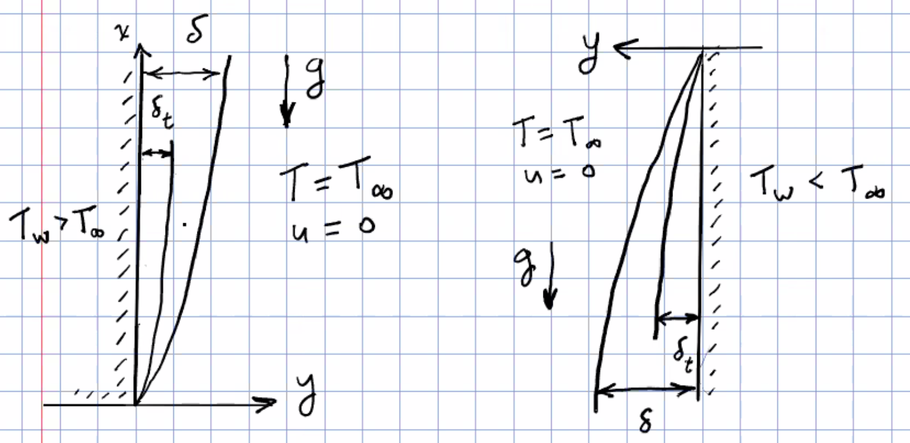
<figcaption>Buoyancy Convection</figcaption>
</figure>

-   neglecting streamwise viscous transport and viscous dissipation

-   constant $\mu, c_p,k$

-   include gravity body force

-   Assume Boundary Layer (2D) orders of magnitude apply

Governing equations: $$\pp{u}{x}+\pp{v}{y}=0$$ $$u\pp{u}{x}+v\pp{u}{y}=-\frac{1}{\rho}\pp{P}{x}-g+\nu \ppn{u}{y}$$ $$u\pp{T}{x}+v\pp{T}{y}=\alpha\ppn{T}{y}$$ in the $u$-momentum equation, $\pp{P}{x}$ is decomposed $$\pp{P}{x}=-\rho_{\infty}g+\pp{P_m}{x}$$ the first term is hydrostatic, the second is applied motion-inducing gradiant if any. Here it is $0$. Then the equation becomes $$u\pp{u}{x}+v\pp{v}{y}=g \frac{\rho_{\infty}-\rho}{\rho}+\nu\ppn{u}{y}$$ $\rho_{\infty}-\rho$ may be due to temperature differences or concentration differences.

For buoyancy driven flows, it is common to invoke the two Boussineseq approximations:

-   density is tanken to be constant, except for the density variation in the buoyancy force term

-   differences in density in the buoyancy force term are linearly proportional to temperature differences.

For liquids, imcompressible so $\rho=\rho(T)$. For common natural convection flows in gases, pressure differences are small. Ideal gas: $\rho=P/RT$. Taylor series expansion for small $\rho$ changes: $$\rho_{\infty}-\rho=\brack{\pp{\rho}{t}}_P(T_{\infty}-T)+\brack{\pp{\rho}{P}}_T(P_{\infty}-P)+H.O.T$$ $\brack{\pp{\rho}{P}}_T$ is pretty small. so $$\frac{\rho_{\infty}-\rho}{\rho}=\frac{1}{\rho} \brack{\pp{\rho}{T}}_P(T_{\infty}-T)=-\beta(T_{\infty}-T)$$ this is second Boussinesq approximation. $u$-momentum equation becomes $$u\pp{u}{x}+v\pp{u}{y}=g\beta(T-T_{\infty})+\nu\ppn{u}{y}$$ For B.L. flow, we expect $$u\sim U_c \qquad v\sim U_c\delta /L \qquad x\sim L \qquad y\sim \delta$$ what is characteristic velocity $U_c$? We expect accelerating force $\sim g(\rho_{\infty}-\rho)$. The accelerating force acting through distance $x$ should increase the K.E. of the flow, then $$\frac{1}{2}\rho u^2\sim gx(\rho_{\infty}-\rho)$$ take $U_c$ so that $$\frac{1}{2}\rho U_c^2=gx(\rho_{\infty}-\rho)=gx\rho\beta(T_w-T_{\infty}) \quad\Rightarrow\quad  U_c=\sqrt{gx\beta(T_w-T_{\infty})}$$ so for $u$-momentum equation, $$u\pp{u}{x}\sim U_c \frac{U_c}{x} \qquad v\pp{u}{y}\sim \frac{U_c\delta}{x}\frac{U_c}{\delta} \qquad \nu\ppn{u}{y}\sim \frac{\nu U_c}{\delta^2}$$ for momentum and buoyancy terms to be compressible, $$\frac{U_c^2}{x}=\frac{gx\beta(T_w-T_{\infty})}{x}\sim g\beta(T_w-T_{\infty})$$ also, for momentum and viscous terms to be comparable, $$\frac{U_c^2}{x}\sim \nu \frac{U_c}{\delta^2}\quad\Rightarrow\quad \frac{\delta}{x}\sim   \frac{1}{\sqrt{U_cx/\nu}}$$ where $$\frac{U_cx}{\nu}=\sqrt{\frac{gx^3\beta(T_w-T_{\infty})}{\nu^2}}$$ This is known as Grashof number, $$Gr_x=\frac{gx^3\beta(T_w-T_{\infty})}{\nu^2}$$ so $\delta/x\sim Gr_x^{-1/4}$

For energy equation, $$u\pp{T}{x}\sim U_c \frac{T_w-T_{\infty}}{x} \qquad v\pp{T}{y}\sim \frac{U_c\delta}{x} \frac{T_w-T_{\infty}}{\delta_t} \qquad \alpha\ppn{T}{y}\sim \alpha \frac{T_w-T_{\infty}}{\delta_t^2}$$ for convection to be comparable to conduction, $$\frac{U_c(T_w-T_{\infty})}{x}\sim \alpha \frac{T_w-T_{\infty}}{\delta_t} \quad\Rightarrow\quad  \frac{\delta_t}{x}\sim \frac{1}{Gr_x^{1/4}Pr^{1/2}}$$ thus boundary layer flow results only if $Gr_x$ is large. Laminar B.L. analysis expected to be valid for $$10^4<Gr_x<10^9 \qquad \frac{\delta}{x}<10^{-1}$$ For $Gr_x>10^9$, transitions to turbulent flow is expected. Note $Re=\sqrt{Gr_x}$, it is consistant with flat plate FC BL transition $Re=3.5\times 10^5$.

So governing equations and B.C.s for natural convection BL flows are $$\pp{u}{x}+\pp{v}{y}=0$$ $$u\pp{u}{x}+v\pp{u}{y}=g\beta(T_w-T_{\infty})+\nu\ppn{u}{y}$$ $$u\pp{T}{x}+v\pp{T}{y}=\alpha\ppn{T}{y}$$ At $y=0$, $u=v=0,T=T_w$; At $y=\infty$, $u=0, T=T_{\infty}$. This can be solved using a similarity transformation: $$\eta=\frac{y}{x} \brack{\frac{Gr_x}{4}}^{1/4} \qquad Gr_x=\frac{g\beta(T_w-T_{\infty})x^3}{\nu^2}$$ $$\psi=f(\eta) \brack{4\nu \brack{\frac{Gr_x}{4}}^{1/4}} \qquad \phi=\frac{T-T_{\infty}}{T_w-T_{\infty}}$$ then $$u=\pp{\psi}{y}=\frac{2\nu}{x}Gr_x^{1/2}f'(\eta)$$ $v$ is similarily determined using $v=-\pp{\psi}{x}$. substituting converts momentum equation, energy equation and B.C.s to $$f'''+3ff''-2f'^2+\phi=0\qquad\phi''+3Pr f\phi'=0$$ At $\eta=0$, $f=f'=0$, $\phi=1$; At $\eta=\infty$, $f'=0,\phi=0$

$$q_w''=-k\pp{T}{y}\bigg|_{y=0}=-k\phi'(0)\frac{1}{x} \brack{\frac{Gr_x}{4}}^{1/4} (T_w-T_{\infty})$$ $$h=\frac{q_w''}{T_w-T_{\infty}}=-\frac{k}{x}\frac{\phi'(0)}{\sqrt{2}}Gr_x^{1/4}$$ $$Nu_x=\frac{hx}{k}=-\frac{\phi'(0)}{\sqrt{2}}Gr_x^{1/4}$$ $\phi'(0)$ is determined for a specific $Pr$ value.

## Integral Relations for BL Transport

<figure>
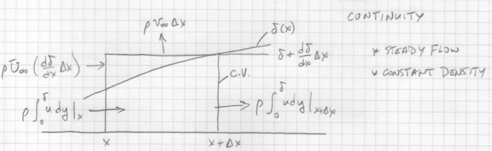
</figure>

Assume steady flow and constant density.

Inflow must equal outflow, $$\rho \pp{v}{y}=-\rho \pp{u}{x} \quad\Rightarrow\quad  \rho\int_0^{\delta}\pp{v}{y} \d  y=-\rho\int_0^{\delta}\pp{u}{x}\d y$$ $$\rho v|_0^{\delta}=-\rho \dd{}{x}\int_0^{\delta}u\d y+\rho u|_0^{\delta}\dd{\delta}{x}$$ rearrange to get $$\tcbhighmath{\rho\dd{}{x}\int_0^{\delta}u\d y=\rho U_{\infty}\dd{\delta}{x}-\rho v_{\infty}}$$

<figure>
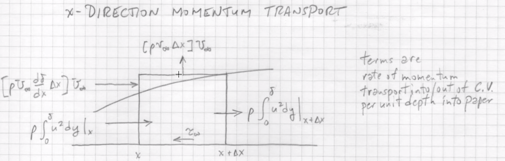
</figure>

$$\tau_w\Delta x=\Brack{\rho\int_0^{\delta}u^2\d y}_{x+\Delta x}^x+ \brack{\rho U_{\infty}\dd{\delta}{x}-\rho v_{\infty}}\Delta x U_{\infty}$$ expanding each term, $$\mu\pp{u}{y}\bigg|_{y=0}\Delta x=-\rho \dd{}{x}\int_0^{\delta}u^2\d y\Delta x+\rho \dd{}{x}\int_0^{\delta}uU_{\infty}\d y\Delta x$$ combining integrals yields $$\tcbhighmath{\rho \dd{}{x}\int_0^{\delta}(U_{\infty}-u)u\d y=\mu\pp{u}{y}\bigg|_{y=0}}$$ can show that order of differentiation and integral does not matter here. $$\dd{}{x} \int_0^{\delta}(U_{\infty}-u)u\d y= \underbrace{\Brack{(U_{\infty}-u)u}_{\delta}\dd{\delta}{x}}_{=0}+\int_0^{\delta}\pp{}{x} \Brack{(U_{\infty}-u)u}\d y$$

<figure>
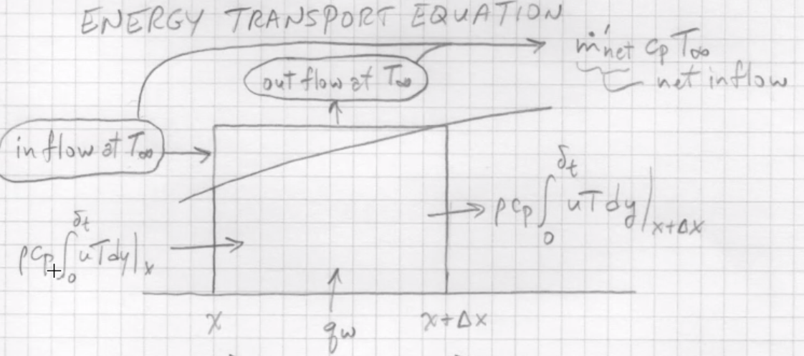
</figure>

$$q_w\Delta x=\Brack{\rho c_p \int_0^{\delta_t}uT\d y}_x^{x+\Delta x}-\dot{m}_{net}c_pT_{\infty}$$ $$-k\pp{T}{y}\bigg|_{y=0}=\rho c_p\dd{}{x}\int_0^{\delta_t}tU\d y\Delta x-\rho \dd{}{x}\int_0^{\delta_t}uT_{\infty}\d yc_p\Delta x$$ $$\label{eq:6}
\tcbhighmath{\rho c_p\dd{}{x}\int_0^{\delta_t}u(T_{\infty}-T)\d y=k\pp{T}{y}\bigg|_{y=0}=-q_w}$$

## Integral solution of the blasius flow problem

$$\rho\int_0^{\delta}\pp{}{x} \Brack{(U_{\infty}-u)u}\d y=\mu\pp{u}{y}\bigg|_{y=0}$$ postulate $$\frac{u}{U_{\infty}}=\frac{3}{2} \frac{y}{\delta}-\frac{1}{2} \brack{\frac{y}{\delta}}^3$$ the equation changes into $$\int_0^{\delta} \brack{U_{\infty}\pp{u}{x}-\pp{u^2}{x}}\d y=\nu \pp{u}{y}\bigg|_{y=0}$$ $$\begin{aligned}
  \label{eq:5}
  U_{\infty}\pp{u}{x}&=U_{\infty}\pp{u}{\delta}\dd{\delta}{x}=U_{\infty}^2 \overline{-\frac{3}{2}\frac{y}{\delta^2}+\frac{3}{2}\frac{y^3}{\delta^4}}\dd{\delta}{x}\\
  u^2&=U_{\infty}^2 \Brack{\frac{9}{4}\frac{y^2}{\delta^2}-\frac{3}{2} \frac{y^4}{\delta^4}+\frac{1}{4}\frac{y^6}{\delta^6}}\\
  \pp{u^2}{x}&=U_{\infty}^2 \Brack{-\frac{9}{2}\frac{y^2}{\delta^3}+6 \frac{y^4}{\delta^5}-\frac{3}{2}\frac{y^6}{\delta^7}}\dd{\delta}{x}\\
  \pp{u}{y}\bigg|_0&=U_{\infty} \Brack{\frac{3}{2\delta}-\frac{3y^2}{2\delta^3}}_{y=0}=\frac{3U_{\infty}}{2\delta}
\end{aligned}$$ substitute into equation, integrate polynomial and simplify to get $$\delta \dd{\delta}{x}=\frac{140}{13} \frac{\nu}{U_{\infty}}$$ Integrate, $$\int_0^{\delta}\delta\d \delta=\frac{140}{13} \frac{\nu}{U_{\infty}}\int_0^x\d x \quad\Rightarrow\quad  \frac{\delta^2}{2}=\frac{140\nu}{13U_{\infty}}x$$ $$\delta=4.64 x \sqrt{\frac{\nu}{xU_{\infty}}}$$ $$C_{fx}=\frac{\brack{\tau_w}_x}{\rho U_{\infty}^2/2}=\frac{0.646}{\sqrt{Re_x}}$$ This result is very close to Blasius similarity result.

#### Integral method for Thermal BL

$$\rho c_p\dd{}{x}\int_0^{\delta_t}u(T_{\infty}-T)\d y=k\pp{T}{y}\bigg|_{y=0}=-q_w$$ define $$\theta=\frac{T-T_0}{T_{\infty}-T_0} \quad\Rightarrow\quad  T=\theta(T_{\infty}-T_0)+T_0$$ we find $$\rho c_p\dd{}{x}\int_0^{\delta_t}u(1-\theta)\d y=k\pp{\theta}{y}\bigg|_{y=0}$$ postulate $$\theta=\frac{3}{2}\frac{y}{\delta_t}-\frac{1}{2} \frac{y^3}{\delta_t^3}$$ and same polynomial for $u/U_{\infty}$, $$\begin{gathered}
  \rho c_p\dd{}{x}\int_0^{\delta_t}U_{\infty} \Brack{\frac{3}{2}\frac{y}{\delta}-\frac{1}{2}\frac{y^3}{\delta^3}} \Brack{1-\frac{3}{2}\frac{y}{\delta_t}+\frac{1}{2}\frac{y^3}{\delta_t^3}}\d y\\
  =\frac{\alpha}{\delta_t} \Brack{\frac{3}{2}-\frac{3}{2} \frac{y^2}{\delta_t^2}}_{y=0}=\frac{3\alpha}{2\delta_t}
\end{gathered}$$ we specifically consider $Pr\geq 1, \zeta=\delta_t/\delta\leq 1$, integration leads to $$\dd{}{x} \Brack{U_{\infty}\delta \brack{\frac{3}{20}\zeta^2-\frac{3}{280}\zeta^4}}=\frac{3}{2}\frac{\alpha}{\zeta\delta}$$ neglect $O(\zeta^4)$ compared to $O(\zeta^2)$ terms, $$U_{\infty}\dd{}{x} \Brack{\delta \frac{3}{20}\zeta^2}=\frac{3}{2} \frac{\alpha}{\zeta\delta}$$ $$\frac{1}{10}U_{\infty}\zeta^3\delta\dd{\delta}{x}+\frac{1}{5}U_{\infty}\delta^2\zeta^2\dd{\zeta}{x}=\alpha$$ from momentum BL solution, $$\delta\dd{\delta}{x}=\frac{140}{13} \frac{\nu}{U_{\infty}}$$ we find $$\zeta^3+4x\zeta^2\dd{\zeta}{x}=\frac{13}{14Pr}$$ previous modeling indicate $\zeta$ is constant with $\delta_t,\delta\rightarrow 0$ at $x=0$, then $\dd{\zeta}{x}=0$, so $$\zeta^3=\frac{13}{14Pr} \qquad \zeta=\frac{1}{1.026 Pr^{1/3}}$$ By definition, $$h=-\frac{k\pp{T}{y}|_{y=0}}{T_0-T_{\infty}}=k\pp{\theta}{y}\bigg|_{y=0}=\frac{3k}{2\delta_t}=\frac{3k}{2}(1.026)Pr^{1/3} \sqrt{\frac{13}{280}}\sqrt{\frac{U_{\infty}}{\nu x}}$$ $$Nu_x=0.323 Re_x^{1/2}Pr^{1/3}$$ while the coefficient is 0.332 for similarity solution.

\begin{examplebox}{Uniform heat flux BC}
  Define
\begin{equation}
\phi=\frac{T-T_{\infty}}{\Delta T} \qquad \Delta T(x)=T_0-T_{\infty} \quad\Rightarrow\quad  T_{\infty}-T=-\Delta T\phi
\end{equation}
for \autoref{eq:6},
\begin{equation}
\pp{T}{y}=\Delta T \pp{\phi}{y} \qquad q_w=-k\pp{T}{y}\bigg|_{y=0}=-k\pp{\phi}{y}\bigg|_{y=0}\Delta T
\end{equation}
from integral momentum solution,
\begin{equation}
\frac{u}{U_{\infty}}=\frac{3}{2} \frac{y}{\delta}-\frac{1}{2} \brack{\frac{y}{\delta}}^3
\end{equation}
here we postulate a simple linear temperature profile $\phi=1-y/\delta_t$, substituting into eq
\begin{equation}
\dd{}{x}\int_0^{\delta_t}u\phi\Delta T\d y=\frac{q_w}{\rho c_p}
\end{equation}
\begin{equation}
\int_0^{\delta_t}u\phi\Delta T\d y =\int_0^{\delta_t}U_{\infty}\Delta T \brack{1-\frac{y}{\delta_t} }\brack{\frac{3}{2}\frac{y}{\delta}-\frac{1}{2} \brack{\frac{y}{\delta}}^3}
\end{equation}
neglect higher order as $\delta_t/\delta<1$, finally
\begin{equation}
\int_0^{\delta_t} u\phi \Delta T\d y=U_{\infty}\Delta T \delta \frac{1}{4}\frac{\delta_t^2}{\delta^2}
\end{equation}
The integral equation becomes
\begin{equation}
 \ frac{1}{4}U_{\infty} \dd{}{x} \Brack{\Delta T \frac{\delta_t^2}{\delta}}=\frac{q_w}{\rho c_p}
\end{equation}
\begin{equation}
\frac{1}{4} U_{\infty}\Delta T \frac{\delta_t^2}{\delta}=\frac{q_wx}{\rho c_p}
\end{equation}
using $q_w=-k\pp{T}{y}|_{y=0}$ and temperature profile, we find $q_w=k\Delta T/\delta_t$. So plug in and get
\begin{equation}
\delta_t^3=\frac{4\alpha x\delta}{U_{\infty}}
\end{equation}
from flow analysis,
\begin{equation}
\delta= \sqrt{\frac{280}{13}} \sqrt{\frac{\nu x}{U_{\infty}}}
\end{equation}
so
\begin{equation}
\delta_t=4^{1/3}  \brack{\frac{280}{13}}^{1/6}Pr^{-1/3}x Re_x^{-1/2}
\end{equation}
\begin{equation}
h=\frac{q_w}{\Delta T}=\frac{k}{\delta_t} \qquad Nu_x=0.378 \sqrt{Re_x} Pr^{1/3}
\end{equation}
\end{examplebox}

## Summary

Steady BL flow, can model using

1.  Finite difference solution of NS and energy equations, and $$h=f(\rho,\nu,c_p,k,x,U_{\infty},\overline{u})$$ must analyze lots of runs to resolve parameter trends, could improve if non-dimensionalize equations.

2.  Similarity solution, predicts forms of parametric variations, $$Nu_x=\frac{hx}{k}=-\frac{1}{2}\phi'(0) \sqrt{Re_x}$$ $\phi'(0)$ is get by solving ODE's for fixed $Pr$. Similarity framework illuminates parametric trends.

3.  Integral solution with postulated $u,T$ profiles \...\....

# Notes on Numerical solution of PDEs

general form of 2nd order ODE, $$A\ppn{\phi}{x}+B\ppm{\phi}{x}{y}+C\ppn{\phi}{y}+D\brack{x,y,\phi,\pp{\phi}{x},\pp{\phi}{y}}=0$$ if $\phi$ appears to first power throughout. then it is linear. Classification: $$\begin{aligned}
  B^2-4AC<0 &\quad\Rightarrow\quad  \text{elliptic}\\
  B^2-4AC=0 &\quad\Rightarrow\quad  \text{parabolic} \\
  B^2-4AC>0 &\quad\Rightarrow\quad  \text{hyperbolic}
\end{aligned}$$

hyperbolic

:   have wave behavior, solution is constant along characteristics. Finite velocity of disturbance (information) propagation. Classic expample: compressible flow. Another example, first order convection equation $$\pp{\phi}{t}+\hat{c}\pp{\phi}{x}=0 \quad\Rightarrow\quad \ppn{\phi}{t}+\hat{c}\ppm{\phi}{x}{t}=0$$ $A=0,B=\hat{c},C=1$, $B^2-4AC=\hat{c}^2>0$ is hyperbolic.

parabolic

:   Infinite propagation speed, information flows in one direction, can march solution forward if know solution at initial value. Example: 1D transient conduction solution $$\pp{T}{t}=\alpha\ppn{T}{x}$$ FTCS explicit method used in Proj2 does this for transient natural convection BL flow

elliptic

:   Information flows in all directions at once, infinite speed, no preferred direction. Example: 2D steady laplace equation, $$\ppn{T}{x}+\ppn{T}{y}=0$$ another example. FD flow and convection considered in Proj1.

Important numerical method properties

-   Convergence, if iterative

-   mesh independence

-   stability.

Stability of the FTCS method, consider as an expample $$\pp{T}{t}=\alpha\ppn{T}{x}$$ descritize as $$\pp{T}{t}=\frac{T_m^{*}-T_m}{\Delta t}+O(\Delta t)$$ $$\ppn{T}{x}=\frac{T_{m+1}-2T_m-T_{m-1}}{\Delta x^2}+O(\Delta x^2)$$ substituting into the PDEand rearranging $$T_m^{*}=T_m+F(T_{m+1}-2T_m+T_{m-1}) \qquad F=\frac{\alpha\Delta t}{\Delta x^2}$$ $F$ is called [grid Fourier number]{.underline}.

Suppose a steady-state solution has been reached which $T_m=T_s$ for all $m$, we then introduce a small instantaneous disturbance $\epsilon$ at location $m$, $T_m=T_s+\epsilon$, what happens as we march the scheme forward? $$T^{*}=T_s+\epsilon+F(T_s-2(T_s+\epsilon)+T_s) \quad\Rightarrow\quad  T_m^{*}-T_s=\epsilon (1-2f)$$ the $lhs$ is the deviation from steady state solution, for stability we want a disturbance to die-out, $$\frac{T_m^{*}-T_s}{\epsilon}<1 \quad\Rightarrow\quad  (1-2F)<1$$ so $-1\leq 1-2F\leq 1$, from left side we have $F\leq 1$, indicating $$\Delta t\leq \frac{\Delta x^2}{\alpha}$$ If we further want to assure that disturbance damp without overshoot, require $$\frac{T_m^{*}-T_s}{\epsilon}\geq 0 \quad\Rightarrow\quad  F\leq \frac{1}{2}$$ can show by analyzing subsequant timesteps that $F\leq 1/2$, $\Delta t\leq \Delta x^2/2\alpha$ is necessary for stability.

Somewhat more complicated for convective transport equations due to extreme terms, but concept is the same and liead to $$F_1=\frac{\Delta t\alpha}{\Delta y^2}\leq \sim \frac{1}{2} \qquad F_2=\frac{\Delta t \nu}{\Delta y^2}\leq \sim \frac{1}{2}$$ So for the FTCS explicit method, necessary conditions for stability in terms of grid Fourier numbers, $$F_1=\frac{\alpha \Delta t}{\Delta y^2}< \frac{1}{2} \quad\Rightarrow\quad  \Delta t<\frac{\Delta y^2}{2\alpha}$$ $$F_2=\frac{\nu \Delta t}{\Delta y^2}< \frac{1}{2} \quad\Rightarrow\quad  \Delta t<\frac{\Delta y^2}{2\nu}$$

## Another Solution of Interest-Transporation

Injection or suction at surface, can be due to evaporation, sublimation, condensation. PDE the same just new BC. $$\eta=\frac{y}{\sqrt{\nu x/U_{\infty}}} \qquad \psi=\sqrt{\nu x U_{\infty}}f(\eta)$$ $$u\pp{u}{x}+v\pp{u}{y}=\nu\ppn{u}{y} \quad\Rightarrow\quad  \frac{1}{2}ff''+f'''=0$$ $$v=-\pp{\psi}{x}=\frac{U_{\infty}}{2 \sqrt{U_{\infty}x/\nu}} \brack{-f(\eta)+\eta f'(\eta)}$$ at $y=0$, $\eta=0$, $$v=-\frac{U_{\infty}}{2 \sqrt{U_{\infty}x/\nu}}f(0)=v_w \quad\Rightarrow\quad  f(0)=\frac{2v_w}{U_{\infty}} \sqrt{\frac{U_{\infty}x}{\nu}}$$ If $v_w$ is constant, no similarity solution. For aligned plate, similarity requires $v_w\sim x^{-1/2}$.

For wedge flows with injection, same similarity formulation described earlier, $$v(\eta=0)=v_w=v_0=-\frac{m+1}{2}\zeta(0) \frac{U_{\infty}(x)}{\sqrt{U_{\infty}(x)/\nu}}$$ similarity requires $$v_w\sim \sqrt{\frac{U_{\infty}(x)}{x}}\sim \sqrt{\frac{Cx^m}{x}}\sim x^{(m-1)/2}$$ for similarity, $m=1$, $\beta=\pi$, $v_w$ is constant. If $b=0$, $m=0$, $v_w\sim x^{-0.5}$.

Now consider heat transfer, flat plate and aligned $(m=0)$ $$\rho c_p \brack{u\pp{T}{x}+v\pp{T}{y}}=\alpha \ppn{T}{y} \quad\Rightarrow\quad  \phi''+Pr f\phi'=0$$ for a solid plate, $v_w=0$, $$Nu_xRe_x^{-1/2}=0.332 \quad (Pr=1) \qquad 0.292\quad(Pr=0.7)$$ for $v_w\neq 0$, injection or suction $T_{gas}=T_w$, $Pr=1.0$

\centering

  ------------------------------------ -------- ------- ------- ------- -------
   $\frac{v_w}{U_{\infty}}Re_x^{1/2}$    0.5     0.25      0     -0.25   -0.75
           $Nu_xRe_x^{-1/2}$            0.0356   0.165   0.332   0.523   0.945
  ------------------------------------ -------- ------- ------- ------- -------

  : Injection and suction affects HT

from the table we can see suction enhance HT while injection weakens.

## Axisymmetric Plume Above a Point Source

Concentrated source, laminar flow.

\begin{examplebox}{}
  \begin{itemize}
  \item Above a candle flame
  \item Above an electrical component
  \item On a horizontal surface
  \item Above a heated sphere
  \end{itemize}
\end{examplebox}

We consider laminar BL flow. Assuming

1.  Boussinesq approximations

2.  Properties other than $\rho$ are constant

3.  Neglect viscous dissipation, pressure work

Equations (cyl. coordinates) and BCs ($y$ is radius) $$\begin{aligned}
  &\pp{(yu)}{x}+\pp{(yv)}{y}=0\\
  &u\pp{u}{x}+v\pp{u}{y}=g\beta (T-T_{\infty})+\frac{\nu}{y}\pp{}{y} \brack{y\pp{u}{y}}\\
  & u\pp{T}{x}+v\pp{T}{y}=\frac{\alpha}{y} \pp{}{y} \brack{y\pp{T}{y}}\\
  &y=0 \qquad v=\pp{u}{y}=\pp{T}{y}=0\\
  &y\rightarrow \infty \qquad u\rightarrow 0,\quad T\rightarrow T_{\infty}
\end{aligned}$$ we can explore a similarity formulation as follows, we define a stream function such that $$u=\frac{1}{y}\pp{\psi}{y} \qquad v=-\frac{1}{y}\pp{\psi}{x}$$ we then postulate definitions $$\eta=b(x)y \qquad \psi=\nu c(x) f(\eta) \qquad \phi=\frac{T-T_{\infty}}{d(x)}$$ $d(x)=T_0-T_{\infty}$, $T_0=T(y=0)$. Express $y,u,\nu,T$ in terms of $\eta,f(\phi),f'(\phi),\phi$, and substitute to get $$\begin{gathered}
  f'''+\frac{g\beta}{\nu^2}(yb)\frac{d}{b^4c}\phi+\frac{c_x}{yb}ff''- \Brack{\frac{c_x}{yb}+\frac{1}{yb} \brack{\frac{2cb_x}{b}}}f'^2\\
  -\frac{c_x}{(yb)^2}ff'-\frac{1}{yb}f''+\frac{1}{(yb)^2}f'=0
\end{gathered}$$ $x$ subscript means $\dd{}{x}$. $$\frac{\phi''}{Pr}+\frac{c_x}{yb}f\phi'-\frac{1}{yb} \brack{\frac{d_xc}{d}}f'\phi+\frac{1}{yb} \brack{\frac{1}{Pr}}\phi'=0$$ similarity requires that coefficients of terms must be constants or functions of $\eta$ alone. since $yb=\eta$, similarity requires $$\frac{d}{b^4c}=B_1 \quad c_x=B_2 \quad \frac{cb_x}{b}=B_3 \quad \frac{d_xc}{d}=B_4$$ $B_{1,2,3,4}$ are constants or functions of $\eta$. For $d(x)$ assumed to be a power law variation $d=Nx^n$, the above relations require that $$c(x)\sim x\qquad b(x)\sim x^{(n-1)/4}$$ These properties are satisfied if we pick $$c(x)=\nu x \qquad b(x)=\frac{Gr_x^{1/4}}{x} \qquad Gr_x=\frac{g\beta x^3(T_0-T_{\infty})}{\nu^2}$$ It follows that $$\eta=\frac{y}{x}Gr_x^{1/4} \qquad \psi=\nu xf(\eta) \qquad u=\frac{\nu}{x}Gr_x^{1/2} \frac{f'}{\eta} \qquad v=-\frac{\nu}{x}Gr_{x}^{1/4} \brack{\frac{f}{\eta}-\frac{f'}{2}}$$ and the equations and BCs become $$f'''+(f-1) \brack{\frac{f'}{\eta}}'-\frac{1+n}{2} \frac{f'^2}{\eta}+\eta\phi=0$$ $$(\eta\phi')'+Pr (f\phi'-n f'\phi)=0$$ $$f(0)=f'(0)=0 \qquad \phi(0)=1 \qquad \phi'(0)=0$$ How do we determine $n$? Note this is no input of thermal energy downstream of the source, so convected thermal energy above the ambient level $Q(x)$ at any $x$ location must be constant and equal to the rate of heat input at the source $$Q=\int_0^{\infty}\rho c_p(T-T_{\infty})u 2\pi y\d y$$ substituting to write this in terms of similarity variables. $$2\pi\rho c_p\nu(T_0-T_{\infty})x\int_0^{\infty}f'\phi\d \eta=2\pi \rho c_p\nu N x^{n+1}\int_0^{\infty}f'\phi\d \eta=0$$ note that $n$ must equal to $-1$ to make $x$ dependence go away on the $lhs$. So $$T_0-T_{\infty}=\frac{N}{x} \qquad N=\frac{Q}{2\pi\rho c_p \nu I} \qquad I=\int_0^{\infty}f'\phi\d \eta$$ For $n=-1$, the equations and BCs become $$f'''+(f-1) \brack{\frac{f'}{\eta}}'+\eta\phi=0$$ $$(\eta\phi')'+Pr(f \phi)'=0$$ $$\eta=0\qquad\brack{\frac{f'}{\eta}}'=0 \quad \phi'=0 \quad \frac{f}{\eta}-\frac{f'}{2}=0 \quad \phi=1$$ $$\eta\rightarrow \infty \qquad \frac{f'}{\eta}\rightarrow 0 \quad\phi\rightarrow 0$$ It can be shown that the BCs can be equivlantly stated as $$f(0)=f'(0)=\phi'(0)=0 \qquad \phi(0)=1 \qquad f'(\infty)= \text{bounded}$$ Integrating the enegy equation once with respect to $\eta$ and using the BCs to evaluate the integration constant yields $$\eta \phi'+Pr f\phi=0$$ Integrating this from $\eta=0$ to $\eta$ yields $$\phi(\eta)=\phi(0) \exp{-Pr \int_0^{\eta}f/\eta \d \eta}$$ as momentum equation is numerically integrated to get $f(\eta)$, this can be used to compute $\phi(\eta)$. Solutions of equations and BC's yields velocity and temperature fields for axisymmetric plumes (see plots).

Centerline temperature difference $$T_0-T_{\infty}=\frac{Q}{2\pi\rho c_p\nu I x}$$ centerline $u$ velocity $$u(x,0)= \sqrt{\frac{g\beta Q}{2\pi \rho c_p\nu I}} \brack{\frac{f'}{\eta}}_{\eta=0}$$ Note this is a constant. Accelerating effects of buoyancy are balanced by deaccelerating effects of entrainment. Defining $\eta_{\delta}$ as the $y$ location where the dimensionless velocity $f'/\eta$ drops to 1% of its peak value, it follows that the velocity boundary layer thickness is given by $$\delta(x)=\eta_{\delta} \brack{\frac{2\pi c_p\mu\nu^2 I}{g\beta Q}}^{1/4}\sqrt{x}$$ similarily for the thermal BL thickness $$\delta_t(x)=\eta_{\delta_t}  \brack{\frac{2\pi c_p\mu\nu^2 I}{g\beta Q}}^{1/4}\sqrt{x}$$ Mollerdorf and Gebhardt (1974) reported

  ---------- ---------- ------------- -------- -------
              $f''(0)$   $f(\infty)$     I
   $Pr=0.7$    1.351        7.91       2.074     air
   $Pr=7.0$    0.6683       3.08       0.2497   water
  ---------- ---------- ------------- -------- -------

note also $$v=\frac{-\nu}{x} Gr_x^{1/4} \brack{\frac{f}{\eta}-\frac{f'}{2}}$$ entrainment velocity $$v_{\delta}=-\frac{\nu}{x}Gr_x^{1/4} \brack{\frac{f}{\eta}-\frac{f'}{2}}_{\eta\rightarrow\infty}$$ what happens at $x=0$? We don't expect this solution to be very accruate as we assume $x\gg \delta$.

# Turbulent Flow

## Transition to turbulent flow

disturbances in laminar flow amplify, leading to a chaotic flow field. Usually modeled as fluctuations superimposed on mean fields. Transition in FD internal flow in a round tube., $Re_D=2300$. Not really this abrupt, transition ovvurs over a range $Re_D$ near 2300.

<figure>
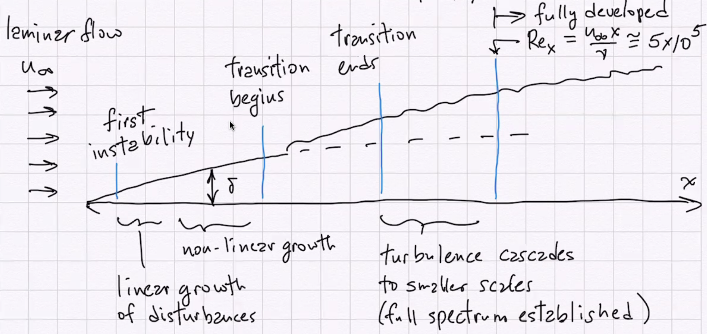
<figcaption>different picture for boundary layer flows</figcaption>
</figure>

For forced flow dictated by momentum transport.

For natural convection flows, process is similar. Key difference is momentum and thermal energy transport affect transition.

For isothermal surface

:   $$Ra_x=Gr_xPr= \frac{g\beta (T_w-T_{\infty})}{\nu\alpha}x^3\approx 10^9$$

For uniform heat flux surface

:   $$Ra^{*}=Gr_x^{*}Pr=\frac{g\beta x^4 q_w}{k\nu^2}Pr\approx 5\times 10^{14}$$

Linear stablility analysis for natural convection BL flow, predicts that disturbance Fourier frequencies in specific frequency range are amplified leading to transition to turbulent flow.

## FD Turbulent flow

characteristics: eddies, random erratic bursts, chaos. Fluctuations in $u,v,T$ with time. For laminar flow, mocular level diffusive transport only. (Conduction, viscosity transport of momentum.) In turbulent flows, molecular level + turbulent macroscopic transport. $$\overline{u}=\frac{1}{t_a}\int_0^{t_a}u\d t=\frac{1}{t_a}\int_0^{ta}\overline{u}\d t+\frac{1}{t_a}\int_0^{t_a}u'\d t$$ $\overline{u}=U,\overline{u'}=0$. Likewise for other velocity components. Decompose: $$u=U+u' \qquad v=V+v' \qquad w=W+w'$$

Continuity equation $$\pp{U}{x}+\pp{u'}{x}+\pp{V}{y}+\pp{v'}{y}+\pp{W}{z}+\pp{w'}{z}=0$$ note $$\frac{1}{t_a}\int_0^{t_a}\pp{U}{x}\d t=\frac{1}{t_a}\pp{}{x}\int_0^{t_a}U\d t=\pp{U}{x}$$ $$\frac{1}{t_a}\int_0^{t_a}\pp{u'}{x}\d t=\frac{1}{t_a}\pp{}{x}\int_0^{t_a}u'\d t=0$$ Continuity equation becomes $$\pp{U}{x}+\pp{V}{y}+\pp{W}{z}=0$$ subtract and get $$\pp{u'}{x}+\pp{v'}{y}+\pp{w'}{z}=0$$

BL cons of momentunm, $$\pp{u}{t}+u\pp{u}{x}+v\pp{u}{y}+w\pp{u}{z}=-\frac{1}{\rho}\pp{P}{x}+\nu\ppn{u}{y}$$ add $$u \brack{\pp{u}{x}+\pp{v}{y}+\pp{w}{z}}=0$$ get $$\pp{u}{t}+\pp{(uu)}{x}+\pp{uv}{y}+\pp{uw}{z}=-\frac{1}{\rho}\pp{P}{x}+\nu\ppn{u}{y}$$ note $\pp{u}{t}=\pp{U}{t}+\pp{u'}{t}$, steady flow leads to $\pp{U}{t}=0$. Also time averaging, $\pp{\overline{u}}{t}=0$. For other terms, e.g. $$\pp{}{x} (uu)=\pp{}{x}(UU+2Uu'+u'u') \quad\Rightarrow\quad  \overline{\pp{(uu)}{x}}=\pp{}{x}(UU+ \overline{u'u'})$$ viscosity term, $$\ppn{u}{y}=\ppn{}{y}(U+u') \quad\Rightarrow\quad  \overline{\ppn{u}{y}}=\ppn{U}{y}$$ Mean pressure $$\overline{\pp{P}{x}}=\pp{\mathcal{P}}{x}$$ finally we have $$\pp{}{x} (UU+ \overline{u'u'})+\pp{}{y} (UV+ \overline{u'v'})+\pp{}{z}(Uw+ \overline{u'w'})=-\frac{1}{\rho}\pp{\mathcal{P}}{x}+\nu \ppn{U}{y}$$ rearranging, $$\rho U\pp{U}{x}+\rho V\pp{U}{y}+\rho W\pp{U}{z}=-\pp{}{x} (\mathcal{P}+\rho \overline{u'u'})+\pp{}{y} \brack{\mu\pp{U}{y}-\rho \overline{u'v'}}+\pp{}{z}(-\rho \overline{u'w'})$$ we assume $O(u')=O(v')=O(w')$ (isotropic), for BL flow, $$\pp{}{y}\gg \pp{}{x},\pp{}{z}$$ so neglecting terms consistent with this and $w=0$, $$\rho U\pp{U}{x}+\rho V\pp{U}{y}=\pp{}{y} \brack{\mu\pp{U}{y}-\rho \overline{u'v'}}-\pp{\mathcal{P}}{x}$$

We can define an eddy diffusivity and turbulent (kinematic) viscosity associated with turbulence $$\tau_{turb}=-\rho \overline{u'v'} =\mu_{turb}\pp{U}{y}=\rho\epsilon_M\pp{U}{y}$$ $$\quad\Rightarrow\quad  \epsilon_M= -\frac{ \overline{u'v'}}{\pp{U}{y}}$$ big when $u'$ and $v'$ are correlated both big at the same time. $$\tau_{total}=\tau_{visc}+\tau_{turb}=\rho(\nu+\epsilon_M)\pp{U}{y}$$ momentum equation becomes $$U\pp{U}{x}+V\pp{U}{y}=\pp{}{y} \brack{(\nu+\epsilon_M)\pp{U}{y}}-\frac{1}{\rho} \pp{\mathcal{P}}{x}$$

## Turbulent boundary layer heat transfer

$$\rho c_p \Brack{\pp{T}{t}+u\pp{T}{x}+v\pp{T}{y}+w\pp{T}{z}}= \Brack{\ppn{T}{x}+\ppn{T}{y}+\ppn{T}{z}}$$ assume 2D $w=0$, use decomposition $$\begin{gathered}
  \rho c_p \Brack{U\pp{\overline{T}}{x}+V\pp{\overline{T}}{y}}+\rho c_p \Brack{\pp{}{x}(\overline{u'T'})+\pp{}{y}(\overline{v'T'})+\pp{}{z}(\overline{w'T'})}\\
  =k \Brack{\ppn{\overline{T}}{x}+\ppn{\overline{T}}{y}}+\ppn{\overline{T}}{z}
\end{gathered}$$ And for B.L. flow, $\pp{}{y}\gg \pp{}{x},\pp{}{z}$, $$\ppn{\overline{T}}{x}\ll\ppn{\overline{T}}{y} \qquad \ppn{\overline{T}}{z}\ll\ppn{\overline{T}}{y}$$ Neglecting small terms, $$\rho c_p \Brack{U\pp{\overline{T}}{x}+V\pp{\overline{T}}{y}}=\pp{}{y} \Brack{k\pp{\overline{T}}{y}-\rho c_p \overline{v'T'}}$$ for constant properties this can be written $$U\pp{\overline{T}}{x}+V\pp{\overline{T}}{y}=\pp{}{y} \Brack{\alpha\pp{\overline{T}}{y}- \overline{v'T'}}$$ similar to what we did for momentum transport, we define an eddy diffusivity for heat $\epsilon_H$ as $$\epsilon_H= \frac{- \overline{v'T'}}{\pp{\overline{T}}{y}}$$ and the equation becomes $$U\pp{\overline{T}}{x}+V\pp{\overline{T}}{y}=\pp{}{y} \Brack{(\alpha+\epsilon_H)\pp{T}{y}}$$ note $$q''_{molecular}=-k\pp{\overline{T}}{y} \qquad q''_{turb}=-k\pp{\overline{T}}{y}=-\rho c_p\epsilon_H\pp{\overline{T}}{y}$$ This analysis formulates turbulent transport modeling in terms of $\epsilon_M$ and $\epsilon_H$ which are related to cross correlations $\overline{v'u'}$ and $\overline{v'T'}$. We also define the turbulent Prandtl number $Pr_t$, $$Pr_t= \frac{\epsilon_M}{\epsilon_H}$$ It is often argued that $Pr_t\sim 1.0$. Now the equation $$U\pp{\overline{T}}{x}+V\pp{\overline{T}}{y}=\pp{}{y} \Brack{(\alpha+\frac{\epsilon_M}{Pr_t})\pp{T}{y}}$$

Some models of turbulent transport are based on analogies with kinetic theory.

Consider a laminar gas flow with velocity progifle $U(y)$ near surface, $l$ is mean free path of molecules between collisions. From basic kinetic theory. the velocity distribution is $$\frac{\d  N_{uvw}}{N}=f(u,v,w)= \brack{\frac{m}{2\pi k_BT}}^{3/2}\exp{-m(u^2+v^2+w^2)/2k_BT}\d u\d v\d w$$ $c^2=u^2+v^2+w^2$, mean molecular speed $$\overline{c}= \sqrt{\frac{8k_BT}{\pi m}}$$ In the flow, shear is rate of momentum transport over $m^2$. A molecule crossing horizontal plane at $y$ has travelled an average distance $l$ since its last colision. $y'$ is average $y$ location of last collision, $y'=y-vl/\overline{c}$. Using taylor series $$[p_x]_{y=y'}=[p_x]- \brack{\dd{[p_x]}{y}} \frac{vl}{\overline{c}}$$ flux of $x$ direction momentum $$j_{[p_x]}=\iiint_{-\infty}^{\infty} [p_x]_{y=y'}\nu \rho_N f(u,v,w) \d u\d v\d w$$ $f$ is the probability of $u,v,w$ combination. substituting leads to $$j_{[p_x]}=-\frac{1}{3} \rho_n n l \overline{c} \dd{U}{y}$$ since $\tau=-j_{[p_x]}=\mu\pp{U}{y}=\rho v\pp{U}{y}$ $$\mu=\rho\nu=\frac{1}{3}\rho_Nml\overline{c} c\quad\Rightarrow\quad  \nu=\frac{1}{3}\overline{c}l$$ $l$ is the distance since last interaction, $\overline{c}$ is characteristic spped. For gases, $l$ can be predicted from kinetic theory, simple analysis: $$l=\frac{k_BT}{\sqrt{2}\pi D^2P}$$ substitute and get $$\mu=\frac{1}{3} \brack{\frac{1}{\pi}}^{3/2} \frac{\sqrt{m k_BT}}{D^2}$$ $\mu$ depends only on $T$, not on $P$.

SImilar analysis for transport of internal energy in a temperature gradient yields $$j_Q=-\frac{1}{3} \brack{\frac{\rho_Nl \hat{c}_V\overline{c}}{N_A}} \pp{T}{y}$$ Since fourier's Law indicates $j_Q=q''=-k\pp{T}{y}$, then $$k= \frac{1}{3}  \brack{\frac{\rho_Nl \hat{c}_V\overline{c}}{N_A}}=\frac{\mu \hat{c}_v}{m N_A} \quad\Rightarrow\quad  \frac{k}{ \hat{\rho} \hat{c}_V}=\frac{1}{3} \overline{c} l$$ $k$ only depends only on $T$ for ideal gas.

Turbulent flow mixing length hypothesis, based on analogy with kinetic theory. Ball of fluid \<=\> molecule. $$\tau_{turb}=\rho \overline{u'v'}\sim \rho \sqrt{\overline{v'^2}} \sqrt{\overline{\overline{u'^2}}}$$ $$O(\sqrt{\overline{u'^2}})\sim O(u')=U(y)-U(y-1)=\pp{U}{y}l$$ $l$ is mixing length, distance along which ball of fluid maintains its identity. $$\tau _{turb}=\rho \sqrt{\overline{v'^2}}l\pp{U}{y}=\mu_{turb}\pp{U}{y}$$ $$\quad\Rightarrow\quad  \mu_{turb}= \rho \sqrt{\overline{v'^2}l}$$ If turbulence is isotropic, $$\sqrt{\overline{v'^2}}\sim \sqrt{\overline{u'^2}}\sim l\pp{U}{y}$$ $$\tau_{turb}\sim \abs{ \rho \overline{v'u'}}\sim l^2\pp{U}{y}\abs{\pp{U}{y}}$$ mixing length model, $$\epsilon_M=l^2 \abs{\pp{U}{y}} \qquad  \tau_{turb}=\rho \epsilon_M\pp{U}{y} \qquad \tau=\rho(\nu+\epsilon_M)\pp{U}{y}$$

## Turbulent FD flow in round tube

$$\rho U \pp{U}{x}+\rho V \pp{U}{r}=-\pp{P}{x}+\frac{1}{r}\pp{}{r}(r\tau)$$ here $\tau=\nu+\epsilon_M$. FD means $\pp{U}{x}=0,v=0$, equation becomes $$\frac{1}{r}\pp{}{r}(r\tau)=\dd{P}{x}=\const$$ Integrate once, using $\tau=0$ at $r=0$ by symmetry, $$\tau=\frac{r}{2}\dd{P}{x}\quad\Rightarrow\quad  \frac{\tau}{\tau_w}=\frac{r}{r_w} \quad \tau_w=\frac{r_w}{2}\dd{P}{x}$$ combined to eliminate $\dd{P}{x}$, $$\frac{\tau}{\tau_w}=\frac{r}{r_w}$$ combine this result with $\epsilon_M$ wo get $$\frac{\rho(\nu+\epsilon_M)}{\tau_w}\dd{U}{r}=\frac{r}{r_w}$$ con solve for $U(r)$ if $\epsilon_M(r)$ is known.

## Turbulent FD heat transfer in a tube

$$\rho U c_p\pp{T}{x}+\rho V c_P\pp{T}{r}=-\frac{1}{r}\pp{}{r}(rq'')$$ here $q''=-\rho c_p(\alpha+\epsilon_M)\pp{T}{r}$ can solve this numerically with known $U(r),\epsilon_M(r)$. Consider simplified case, $q_w''$ is const, so $h$ is const, $Y_w-T_m$ is const. $\dd{T_w}{x}=\dd{T_m}{x}$. Assume $\pp{T}{x}=\dd{T_m}{x}$, and equation becomes $$\rho U c_p\dd{T_m}{x}=-\frac{1}{r} \pp{}{r}(rq'')$$ integrate w.r.t. $r$, $$\rho c_p \dd{T_m}{x}\int U(r)r\d r=-rq''$$ further simplify by taking $U(r)=U_m$ in integral, $$\rho c_p \dd{T_m}{x} \frac{U_mr^2}{2}=-rq''$$ $$q''=\frac{\rho c_pU_m}{2}\dd{T_m}{x}r \quad\Rightarrow\quad  \abs{\frac{q''}{q_w''}}=\frac{r}{r_w}$$ note for both $$\abs{\frac{q}{q_w}}=\frac{\tau}{\tau_w}=\frac{r}{r_w}$$ so $$\frac{\rho c_p(\alpha+\epsilon_H)\dd{T}{r}}{q_W}=\frac{\rho(\nu+\epsilon_M)\dd{U}{r}}{\tau_w}$$ rearrange to find $$\frac{\tau_w}{q_w''}c_p \brack{\frac{\alpha+\epsilon_H}{\nu+\epsilon_M}}\d T=\d U$$ for $Pr=Pr_T=1$, the bracket is $1$, so $$\frac{\tau_w}{q_w''}c_p\d T=\d U \quad\Rightarrow\quad \frac{\tau_w}{q_w''}c_p(T_m-T_w)=U_m$$ note $$\frac{T_m-T_w}{q_w''}=\frac{1}{h}\qquad \tau_w=c_f \frac{\rho U_m^2}{2}$$ substitute to get $$\frac{c_f}{2}=\frac{h}{\rho U_mc_p}=St \qquad \text{ for } Pr=1$$ This is called heat transfer Raynolds analogy

For $Pr\neq 1$, experimental data imply $$\frac{c_f}{2}=StPr^n \qquad n\approx \frac{2}{3}$$ Since $c_f=f(Re)$, analogy implies $StPr^{2/3}=f(Re)$, ususally define colburn $j$ factor $j=StPr^{2/3}$.

And for laminar fully developed flow in a round tube (isothermal wall), $Nu_D=\frac{hD}{k}-3.66$, $$St=\frac{h}{\rho U_mc_p}=3.66 Pr^{-1}Re^{-1} \qquad j=3.66 Pr^{-1/3}Re^{-1}$$ and laminar result $f=\frac{16}{Re}$.

## Near wall in turbulent flows

<figure>
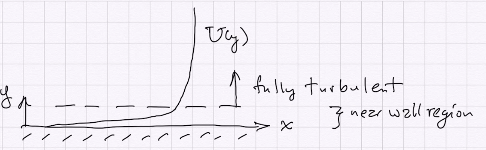
<figcaption>Near wall flow regime</figcaption>
</figure>

In Fully turbulent regime, we expect $\epsilon_M\gg \nu$. Also, we have the $x$ dir momentum equation $$U\pp{U}{x}+V\pp{U}{y}=-\pp{P}{x}+\frac{1}{r}\pp{}{r}(r\tau)$$ Close to wall we expect terms on $lhs$ to be small since velocities are low there. $$0=-\dd{P}{x}+\frac{1}{r}\pp{}{r}(r\tau)$$ If we have flow in a pipe, $\dd{P}{x}$ is constant and $\neq 0$, and as before $$\frac{\tau}{\tau_w}=\frac{r}{r_w}-1=1-\frac{y}{r_w}$$ for $y\ll r_w$, $\tau\approx \tau_w$.

If we have a free boundary layer flow with $\dd{P}{x}=0$, equation becomes $$\pp{}{r}(r\tau)=0 \quad\Rightarrow\quad  r\tau=\const=r_w\tau_w$$ $$\tau=\frac{r_w}{r}\tau_w=\frac{r_w}{r_w-y}\tau_w=\frac{1}{1-y/r_w}\tau_w$$ and again if $y\ll r_w$ leads to $\tau=\tau_w$. For constant shear region, $\tau=\tau_w=\epsilon_M\pp{U}{y}$.

or if we use mixing length theory $$\frac{\tau_w}{\rho}=l^2 \brack{\pp{U}{y}}^2$$ and using $l=\kappa y$ proposed by Prandtl. He argued that eddy size varied proportional to distance from the wall implying $l\sim y$, so $$\frac{\tau}{\rho}=\kappa^2y^2 \brack{\frac{U}{y}}^2$$ data indicates $\kappa=0.41$, called Von Karmen const.

Next introduce non-dimensional variables $$u^+=\frac{U}{\sqrt{\tau_w/\rho}} \qquad y^+=\frac{y \sqrt{\tau_w/\rho}}{\nu}$$ substituting into equation and we find $$\dd{u^+}{y^+}=\frac{1}{\kappa y^+} \qquad \tau=\tau_w$$ Integrating this equation, $$u^+=\frac{1}{\kappa}\ln y^++c_0$$ the best fit to expreimental velocity profile data in the fully turbulent portion of the near wall region is achieved with $c_0=5.0$. $$u^+=2.44 \ln y^+ +5.0$$ note that as $y^+\rightarrow 0$, $u^+\rightarrow -\infty$, which is not physically realistic.

Very close to the wall we expect to find a viscous sublayer in which $\nu\gg \epsilon_M$, for constant $\tau$ region, $$\frac{\tau}{\rho}=\nu \pp{U}{u}$$ Integrating from wall yields $$\int_0^U\d U=\frac{\tau_w}{\mu}\int_0^y\d y \quad\Rightarrow\quad  U=\frac{\tau_w}{\mu}y$$ substituting yields $u^+=y^+$ for viscous sublayer.

<figure>
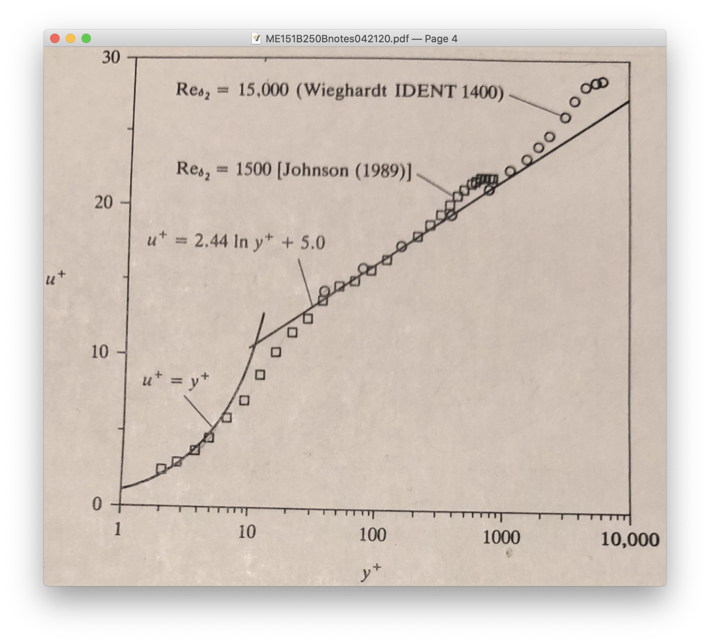
<figcaption>Similarity turbulent result</figcaption>
</figure>

Comparison of these equations with data. Indicates data agrees with viscous sublayer relation to about $y^+=5$ and then transitions to fully turbulent region. $u^+$ vs $y^+$ relation established experimentally is the universal velocity profile near a wall for $\dd{P}{x}=0$ or low-moderate $\dd{P}{x}$ values.

Note: need best fit near wall (small to moderate $y^+$) to predict heat transfer well at wall.

Other curve-fit relations for the universal veloctiy profile have been proposed. e.g., power law fit $$u^+=8.75 (y^+)^{1/7}$$ which fits fairly well to $y^+=1500$. More convenient for calculations (not segmented). A variation is $$u^+=A (y^+)^n$$ wjere $n$ is a function of $Re$ or $y^+$. e.g., 3 layer model

Viscous sublayer

:   $0\leq y^+\leq 5$, $u^+=y^+$

Buffer region

:   $5< y^+\leq 30$, $u^+=-3.05+5\ln y^+$

Fully turbulent region

:   $y^+>30$ $u^+=5.5+2.5\ln y^+$

Note if we have a relation $u^+=u^+(y^+)$ for the universal profile, we can derive a relation for $\epsilon_M$ $$u^+=\frac{U}{\sqrt{\tau_w/\rho}}=u^+(y^+) \qquad y^+=y \frac{\sqrt{\tau_w/\rho}}{\nu} \quad\Rightarrow$$ $$\pp{U}{y}=\sqrt{\frac{\tau_w}{\rho}}\dd{u^+}{y}=\frac{\tau_w}{\rho \nu}\dd{u^+}{y^+}$$ In general $\tau=\rho(\nu+\epsilon_M)\pp{U}{y}$. And for the constant shear layer near the wall, $\tau=\tau_w$ so $$\tau_w=\rho(\nu+\epsilon_M)\pp{U}{y}=\rho(\nu+\epsilon_M)\frac{\tau_w}{\rho\nu}\dd{u^+}{y^+}$$ solve, $$\frac{\epsilon_M}{\nu}=\frac{1}{\dd{u^+}{y^+}}-1$$ which predicts $\epsilon_M=\epsilon_M(y^+)$.

1.  In viscous sublayers $$u^+=y^+,$$

Or for a 3 regime model,

1.  Viscous sublayer $0\leq y^+\leq 5$: $u^+=y^+$, $\epsilon_M=0$

Another expample: van Driest model, mixing length is $l=\kappa y(1-\exp{-y/A})$ $$y/A=y^+/A^+ \qquad l= \frac{\kappa y^+\nu}{\sqrt{\tau_w/\rho}} (1-\exp{-y^+/A^+})$$ where $A^+\sim 26.0$ is good for fitting data. With this we have $$\epsilon_M=l^2\abs{\pp{u}{y}}$$ using definitions to replace $y$ with $y^+$ and $U$ with $u^+$ yields $$\frac{\epsilon_m}{\nu} =\kappa^2y^{+2}(1-\exp{\abs{-y^+/A^+}}) \dd{u^+}{y^+}$$ note: can get relation $\frac{\epsilon_M}{\nu}(y^+)$ if we know $u^+(y^+)$.

Note also the relations for $u^+(y^+)$ can be modified to include effects of suction, blowing (at the wall) or finite $\pp{P}{x}$ if necessary.

## Two equations approach

$k-\epsilon$ two-equation model of turbulent transport. Concept: turbulent kinetic energy and dissipation of turbulent kinetic energy vary throughout flow field. $$k'=\frac{1}{2}(u'u'+v'v'+w'w') \qquad \overline{k}=\frac{1}{2} (\overline{u'u'+v'v'+w'w'})$$ consider mixing length model $$\epsilon_M=l^2 \abs{ \pp{U}{y}}=l_{ml} \brack{l_{ml}\cdot \abs{\pp{U}{y}}}$$ this is length scale times velocity scale, which suggests $\epsilon_M=a l_k \sqrt{\overline{k}}$, $l_k$ is eddy size in turbulence.

Dimensional analysis suggests that dissipation $\epsilon$ $$\epsilon=C_D \frac{(\sqrt{\overline{k}})^3}{l_{\epsilon}} \qquad \Phi\sim \rho\nu \brack{\pp{u}{y}}^2\sim \rho\unit{m^2/s^3}$$ A bit of reasoning can be applied to relate $l_k$ and $l_{\epsilon}$ to $l_{ml}$, which leads to $$\epsilon_M=C_D^{1/4}l_{ml} \sqrt{\overline{k}} \qquad \epsilon=C_d^{3/4}\frac{\overline{k}^{3/2}}{l_{ml}}$$ To use in transport modeling, we need to predict $\overline{k}$ and $\epsilon$ throughout the flow. With decomposition and time-averaging of equations, we can derive equations for transport of $\overline{k}$ and $\epsilon$.

\begin{examplebox}{}
  Deriving $\overline{k}$ equation for boundary layer flow, start with
\begin{equation}
u\pp{u}{x}+v\pp{u}{y}=-\pp{p}{x}+\frac{\nu}{\rho}\ppn{u}{y}
\end{equation}
multiply by $u$ and use continuity to get
\begin{equation}
\pp{}{x}(u u^2/2)+\pp{}{y}(vu^2/2)=\nu\ppn{}{y} (u^2/2)-\nu  \brack{\pp{u}{y}}^2-u\pp{P}{x}
\end{equation}
then substitute $u=U+u'$, $v=V+v'$, $p=P+p'$, $\pp{P}{x}=0$, time average, combine with mean velocity equation
\begin{equation}
U\pp{U}{x}+V\pp{U}{y}=\nu\ppn{U}{y}-\pp{}{y}/9 \overline{u'v'}
\end{equation}
multiplied by $U$. Neglect $x$ derivative terms compared to $y$ derivative terms (BL approx). Write result in terms of
\begin{equation}
\overline{k}=\frac{1}{2} (\overline{u'u'+v'v'+w'w'}) \qquad\epsilon=\nu \brack{ \overline{\pp{u_i'}{x_j}\pp{u_i'}{x_j}}}
\end{equation}
resulting equation
\begin{equation}
\rho U \pp{\overline{k}}{x}+\rho V\pp{\overline{k}}{y}=\pp{}{y} \Brack{-\rho \overline{v'\overline{k'}}-\overline{v'P'}+\mu\pp{\overline{k}}{y}}-\rho \overline{u'v'}\pp{\overline{V}}{y}-\rho\epsilon
\end{equation}
with modeling implemented
\begin{equation}
U \pp{\overline{k}}{x}+v\pp{\overline{K}}{y}=\pp{}{y} \Brack{(\nu+\epsilon_k)\pp{\overline{k}}{y}}+\epsilon_M \brack{\pp{U}{y}}^3-\epsilon
\end{equation}
can similarly derive an equation for local dissipation $\epsilon$
\begin{equation}
U\pp{\epsilon}{x}+V\pp{\epsilon}{y}=\pp{}{y} \Brack{(\nu+\epsilon_{\epsilon})\pp{\epsilon}{y}}+c_1 \frac{\epsilon}{\overline{k}} \brack{\epsilon_M \brack{\pp{U}{y}}^2}-c_2 \frac{\epsilon^2}{\overline{k}}
\end{equation}
typical definitions,
\begin{equation}
Sc_{\epsilon}=\epsilon_M/\epsilon_{\epsilon} \qquad Sc_k=\epsilon_M/\epsilon_k
\end{equation}
$\overline{k}$ and $\epsilon$ equations are solved simultaneously with mean continuity, $u$-momentum and energy equations for model constants. we also need boundary conditions ($\overline{k},\epsilon$ match at sublayer boundary). Example,
\begin{equation}
\epsilon_M=C_{\mu} \overline{k}^2/\epsilon \qquad C_{\mu}=0.09
\end{equation}
\begin{equation}
C_1=1.44 \qquad C_2=1.92 \qquad Sc_k=1.0 \qquad Sc_{\epsilon}=1.3
\end{equation}
note these equations apply outside the sublayer.

Inside sublayer, use law of the wall or mixing length model. Law of the wall still important for predicting heat transfer at the wall.
\end{examplebox}

# Mass transfer

Note that for each convective transport of thermal energy( we will consider BL case specifically) $$\rho c_p \brack{u\pp{T}{x}+v\pp{T}{y}}=\pp{}{y} \brack{k\pp{T}{y}}=-\pp{}{y}  q''$$ define $i$ as enthalpy/unitmass $i=c_pT$, we can rewrite equation as $$\rho u\pp{i}{x}+\rho v\pp{i}{y}=\pp{}{y} \brack{\frac{k}{c_p}\pp{i}{y}}$$ so $i$ is a transportable property per unit mass of fluid. Flux of this property (relation to center of mass of moving fluid) is $$q''=j_i=-\frac{k}{c_p}\pp{i}{y}  \Leftrightarrow \frac{1}{c_p}\pp{i}{y}=\pp{T}{y}$$ another transportable quantity is the mass of species 1 per unit of total fluid mass $c_1$. Species concentration on flux $j_{e1}$ obeys the diffusive transport relation known as Fick's law. $$m''_{c1}=j_{c1}=-\rho D_{12} \pp{c_1}{y}$$ we invoke the analogy $$-q''=\frac{k}{c_p}\pp{i}{y}\Leftrightarrow -j_{c1}= \rho D_{12}\pp{c_1}{y}$$ the mass transport for species 1 is $$\rho  \brack{u\pp{c_1}{x}+v\pp{c_1}{y}}=\pp{}{y} \brack{\rho D_{12}\pp{c_1}{y}}$$ or for constant density $D_{12}$ $$u \pp{c_1}{x}+v\pp{c_1}{y}=D_{12}\ppn{c_1}{y}$$

## Forced convection with mass flow over a flat plate

$$\pp{u}{x}+\pp{v}{y}=0 \qquad u\pp{u}{x}+v\pp{u}{y}=\nu \ppn{u}{y}$$ $$u\pp{T}{x}+v\pp{T}{y}=\alpha \ppn{T}{y} \qquad u\pp{c_1}{x}+v\pp{c_1}{y}=D_{12} \ppn{c_1}{y}$$ binary mixture $c_2=1-c_1$. BC $$y=0 \quad : \quad u=0 \quad v=v_0 \quad T=T_0 \quad c_1=c_{10}$$ $$y=\infty \quad : \quad u=U_{\infty} \quad T=T_{\infty} \quad c_1=c_{1\infty}$$ similarity solution $$\eta= \frac{y}{2} \sqrt{\frac{U\infty}{\nu x}} \qquad \theta=\frac{T-T_{\infty}}{T_{\infty}-T_0} \qquad =\frac{c_1-c_{10}}{c_{1\infty}-c_{10}}$$ $$f(\eta)=\psi/\sqrt{U_{\infty}\nu x} \qquad u=\pp{\psi}{x} \qquad v=-\pp{\psi}{y}$$ equations and BC become $$f'''+\frac{1}{2}ff''=0$$ $$\theta''+\frac{1}{2} \frac{\nu}{\alpha}f\theta'=0$$ $$\phi''+\frac{1}{2} \frac{\nu}{D}f\phi'=0$$ $$\eta=0 \quad :\quad f'=0 \quad \theta=0\quad \phi=0 \quad f=\frac{2v_0}{U_{\infty}}$$

Note that here we define a mass transfer coefficient $\mu_D$ such that $$m''_1=\mu_D(c_{1,s}-c_{1,\infty})$$

\begin{examplebox}{wet and dry bulb thermometer}
  \begin{figure}[H]
    \centering
    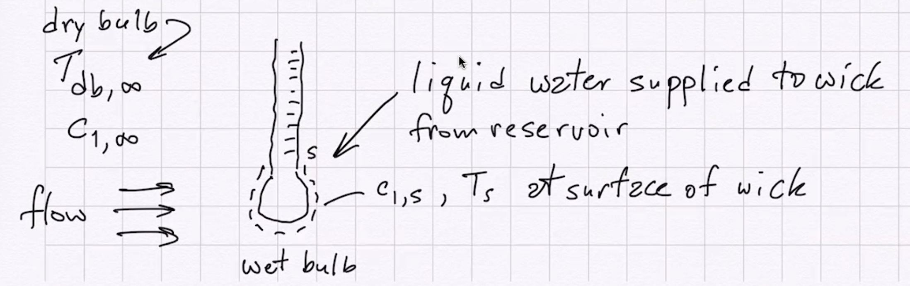
  \end{figure}

at steadystate, negligible conduction into thermometer. surface energy balance on wet bulb
\begin{equation}
\text{ heat transfer from air}= \text{evaporation rate} h_{ev}
\end{equation}
\begin{equation}
\overline{h}_c(T_{db,\infty}-T_s)A= \overline{h}_D(c_{1,s}-c_{1,\infty})A h_{ev}
\end{equation}
rearrange this to solve for $c_{1,\infty}$
\begin{equation}
c_{1,\infty}=c_{1,s}-\frac{\overline{h}_c}{\overline{h}_Dh_{ev}}(T_{db,\infty}-T_s)
\end{equation}
\begin{equation}
c_{1,s}=\frac{x_{1,s}M_1}{x_{1,s}M_1+(1-x_{1,s})M_2}
\end{equation}
\begin{equation}
x_{1,s}=\frac{p_{sat}(T_s)}{p_{atm}}
\end{equation}
If we measure $T_s$ and $T_{db}$, compute $x_{1,s},c_{1,s},c_{1,\infty}$ then
\begin{equation}
x_{1,\infty}=\frac{c_{1,\infty}/M_1}{\frac{c_{1,\infty}}{M_1}+\frac{1-c_{1,\infty}}{M_2}}
\end{equation}
RH is $x_{1,\infty}/x_{1,s}$
\end{examplebox}

For flow over a cylinder or sphere, heat transfer - mass transfer analogy leads to similar relations for the mean heat transfer and mass transfer coefficients $$\frac{\overline{h}_cD}{k_f} =0.615 Re_D^{0.466}Pr^{1/3} \qquad 40<Re_D<4000$$ $$\frac{\overline{h}_cD}{k_f}=0.172 Re_D^{0.618}Pr^{1/3} \qquad 4000<Re_D<40000$$ $$\frac{\overline{h}_cD}{k_f}=A Re_D^nPr^{1/3} \quad\Rightarrow\quad  \frac{\overline{h}_c}{\rho c_p U_{\infty}} \frac{\rho U_{\infty}D}{\mu} \frac{\mu c_p}{k_f}=ARe_D^nPr^{4/3}$$ so $$St=\frac{\overline{h}_c}{\rho c_p U_{\infty}}=A Re_D^{n-1}Pr^{-2/3}$$ by analogy, we expect $$St_m=\frac{\overline{h}_D}{\rho U_{\infty}}=A Re_D^{n-1}Sc^{-2/3}$$ taking the ratio of $St/St_m$ yields $$\frac{\overline{h}_c}{c_p \overline{h}_D} = \brack{\frac{Pr}{Sc}}^{-2/3}$$ define Lewis number $$Le=\frac{\overline{h}_c}{c_p\overline{h}_D}= \brack{\frac{Pr}{Sc}}^{-2/3}$$ for water -vapor and air mixtures $Le\approx 1$

So measure $T_{db}$, $T_{wb}$, compute $x_{1,s},c_{1,s}$, use above relation.
