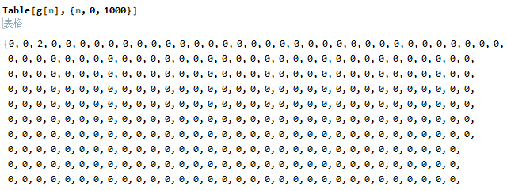

这个定理是在高中就发现的，并且逐渐也在三个排列组合的应用中嗅到了它的独特
价值和玄幻的内在含义。然而定理本身一直没有证明出来。直到一年多后有了一些经验
的积累，机缘巧合之下（上概率论与数理统计课）又翻起了这个定理并成功的将其证明。
证明的过程并不一帆风顺，关键部分还是靠猜出来的。这当然十分有意思，因此我把和
此定理相关的所有内容都写下来。先呈现完整的证明过程，再说一说其中的技巧是如何
想到的，接着再举出三个应用，最后探讨一下其中的原理。

没错，定理名字又是我自己取的，因为我还没在什么资料上见过。

# 写在前面 {#sec:preface}

这个定理是在高中就发现的，并且逐渐也在三个排列组合的应用中嗅到了它的独特价值和玄幻的内在含义。然而定理本身一直没有证明出来。直到一年多后有了一些经验的积累，机缘巧合之下（上概率论与数理统计课）又翻起了这个定理并成功的将其证明。证明的过程并不一帆风顺，关键部分还是靠猜出来的。这当然十分有意思，因此我把和此定理相关的所有内容都写下来。先呈现完整的证明过程，再说一说其中的技巧是如何想到的，接着再举出三个应用，最后探讨一下其中的原理。

**[没错，定理名字又是我自己取的]{.underline}**，因为我还没在什么资料上见过。

**注：本项目仅供交流，未经允许请勿用于盈利目的，且作者保留版权。**

# 组合求和对偶定理 {#sec:main-theorem}

对于$N \in \mathbb{N}$，设$\{a_n\},\{b_n\}$为两定义在$\{0,\dots,N\}$上的数列， 则对$\forall n \in \{0,\dots,N\}$，有

$$\sum_{i=0}^n{C_n^ia_i} \equiv b_n \Leftrightarrow
  \sum_{i=0}^n{C_n^i(-1)^{n-i}b_i} \equiv a_{n}\label{eq:main-theorem}$$

# 定理的证明 {#sec:proof}

从左到右，先采用直接代入法验证。

对$\forall n \in \{0,\dots,N\}$，已知 $$\sum_{i=0}^n{C_n^ia_i}=b_n$$

换用符号将其改写为 $$\sum_{j=0}^i{C_i^ja_j}=b_i$$

代入右式等号左端 $$\label{eq:proof}

\begin{align}
  &\sum_{i=0}^n{C_n^i(-1)^{n-i}b_i} \\
  &=\sum_{i=0}^n{C_n^i(-1)^{n-i}\left(\sum_{j=0}^i{C_i^ja_j}\right)}
    \intertext{\indent{}整理多重求和式}
  &=\sum_{i=0}^n{\sum_{j=0}^i{C_i^jC_n^i(-1)^{n-i}a_j}}\label{subeq:proof-c}
    \intertext{\indent{}用求和的嵌套交换定理，$\sum_{i=0}^n{\sum_{j=0}^i{f(i,j)}}
    =\sum_{j=0}^n{\sum_{i=j}^n{f(i,j)}}$，证略}
  &=\sum_{j=0}^n{\sum_{i=j}^n{C_i^jC_n^i(-1)^{n-i}a_j}}\label{subeq:proof-d}
    \intertext{\indent{}用组合数的恒等式，证略，可见小节\ref{sec:my-exp}}
  &=\sum_{j=0}^n{\sum_{i=j}^n{C_n^jC_{n-j}^{n-i}(-1)^{n-i}a_j}}\label{subeq:proof-e}
    \intertext{\indent{}将与内部求和无关的变量提到外层，并对内部求和变量进行平移替换}
  &=\sum_{j=0}^n{C_n^ja_j\left(\sum_{i=0}^{n-j}{C_{n-j}^{n-i-j}(-1)^{n-i-j}1^{i}}\right)}\label{subeq:proof-f}
    \intertext{\indent{}外部对$j=n$的情况单独提出一项，易验证就是$a_n$;内部则显然是二项式的展开，将其收回}
  &=\sum_{j=0}^{n-1}{C_n^ja_j(1+(-1))^{n-j}} + a_n
    \intertext{\indent{}对每一个求和项而言$n-j$均大于零，故系数均为零}
  &=a_n
\end{align}$$

然后来考虑解的唯一性。对于给定的$N$，等价式`\eqref{eq:main-theorem}`{=latex}左端是一个函数恒等式，相当于$N+1$个普通等式： $$\left\{
    \begin{aligned}
       & C_0^0a_0 = b_0 \\
       & C_1^0a_0+C_1^1a_1 = b_1 \\
       & C_2^0a_0+C_2^1a_1+C_2^2a_2 = b_2 \\
       & \quad\vdots \\
       & C_N^0a_0+ C_N^1a_1+ \cdots + C_N^Na_N = b_N
      \end{aligned}
    \right.$$

其中的系数矩阵为 $    \begin{bmatrix}
      C_0^0 & 0 & 0 & \cdots & 0 \\
      C_1^0 & C_1^1 & 0 & \cdots & 0 \\
      C_2^0 & C_2^1 & C_2^2 & \cdots & 0 \\
      \vdots & \vdots & \vdots & \ddots & \vdots \\
      C_N^0 & C_N^1 & C_N^2 & \cdots & C_N^N
    \end{bmatrix}
  $ `\vspace{5pt}`{=latex}

显然系数矩阵是满秩的，另外也可从消元法易知 $a_0,\dots,a_N$ 只有一组解，也就是`\eqref{eq:main-theorem}`{=latex}等价式中右端的表达式。

由右至左的证明同理。

# 我是如何得出这个定理并证明的 {#sec:my-exp}

**一句话，全靠罗列然后找规律猜。**

得到定理本身：对每个具体的$N$，直接通过代入法解方程组。如当$N=3$时，方程组为 $$\left\{
      \begin{aligned}
       & a_0 = b_0 \\
       & a_0+a_1 = b_1 \\
       & a_0+2a_1+a_2 = b_2 \\
      &  a_0+3a_1+3a_2+a_3 = b_3
      \end{aligned}
    \right.$$

用代入消元法，很容易就依次得到以下等式 $$\left\{
      \begin{aligned}
      &  a_0 = b_0 \\
       & a_1 = b_1 - b_0\\
       & a_2 = b_2 - 2b_1 + b_0 \\
       & a_3 = b_3 - 3b_2 + 3b_1 - b_0
      \end{aligned}
    \right.$$

显然很容易猜出定理`\eqref{eq:main-theorem}`{=latex}，并且由后面应用（见小节`\ref{sec:application}`{=latex}）的正确性（和用别的方法算出来一样）、[数学的优美性]{.underline}也可知定理的正确性。

\vspace{10pt}

证明定理：验证唯一性后只需直接代入验证。关键步骤是`\eqref{subeq:proof-c}`{=latex},`\eqref{subeq:proof-d}`{=latex}和`\eqref{subeq:proof-e}`{=latex}

在拿到`\eqref{subeq:proof-c}`{=latex}的二重求和式后，发现$a_j$的下标$j$作为求和变量在内层，因此我们需要将它换到外层来，使得式子具有$?a_0+?a_1+\dots+?a_N$的形式，这样由于$a_0,\dots,a_N$是互相独立的，要满足等式就只需要验证$a_0,\dots,a_{N-1}$的系数均为零，而$a_N$的系数为$1$即可。这里的嵌套交换是三角型的，是之前Σの艺术研究的结果。

交换后得到`\eqref{subeq:proof-d}`{=latex}式，稍加观察可知只需要证明每一项的系数 $$\label{eq:core}
  \sum_{i=j}^n{C_i^jC_n^i(-1)^{n-i}}$$ 对$j=0,\dots,n-1$均为零即可。当$j=n$时易知其为$1$，是符合要求的。

然而从这里并不能直接看出证明过程`\eqref{subeq:proof-d}`{=latex}到`\eqref{subeq:proof-e}`{=latex}中使用的组合数等式，因此证明起来十分头疼。想不出很好的办法，我就只好先按照$n$和$j$列了一下表，看看是否能找出运算结果为零的内在机理。 $$\begin{aligned}
n=1:&  -C_1^0 + C_1^1 \\
 n=2:& C_2^0 - C_2^1 + C_2^2 ,\qquad -C_2^1C_1^1 + C_2^2C_2^1\\
n=3:&  -C_3^0 + C_3^1 - C_3^2 + C_3^3 ,\qquad C_3^1C_1^1 - C_3^2C_2^1 + C_3^3C_3^1 ,\qquad -C_3^2C_2^2+C_3^3C_3^2 \\
  n=4:& C_4^0 - C_4^1 + C_4^2 - C_4^3 + C_4^4 ,\qquad -C_4^1C_1^1 + C_4^2C_2^1 - C_4^3C_3^1 + C_4^4C_4^1, \\
  &C_4^2C_2^2 - C_4^3C_3^2 + C_4^4C_4^2 ,\qquad -C_4^3C_3^3 + C_4^4C_4^3
\end{aligned}$$

由于篇幅的原因，组合数的形式只能列四行，事实上我写到第六行才发现规律。对于项数为偶数的式子，发现对称的项可以消去，用通项代入亦然，不过这个办法对奇数项没有用。真正通用的是下面的方法。首先，把组合数计算出来，写成数字相加减的形式。这次省去每行没什么意思的第一项和最后一项，可以写到第六行。 $$\begin{aligned}
&  \dots \\
  &3-6+3  \\
 & -4+12-12+4 ,\quad 6-12+6 \\
 & 5-20+30-20+5 ,\quad -10+30-30+10 ,\quad 10-20+10 \\
 & -6+30-60+60-30+6 ,\quad 15-60+90-60+15 ,\quad -20+60-60+20 ,\quad 15-30+15
\end{aligned}$$ `\vspace{5pt}`{=latex} 发现每个式子都可以分别提出一个倍数，即 $$\begin{aligned}
&  3(1-2+1)  \\
&  4(-1+3-3+1),\quad 6(1-2+1) \\
&  5(1-4+6-4+1) ,\quad 10(-1+3-3+1) ,\quad 10(1-2+1) \\
&  6(-1+5-10+10-5+1) ,\quad 15(1-4+6-4+1) ,\quad 20(-1+3-3+1) ,\quad 15(1-2+1)
\end{aligned}$$ `\vspace{5pt}`{=latex} 显然，括号里面都是二项式的展开，将其收回后显然是零。为了在通项中让二项式展开的形式显露出来，只需要把前面的倍数给除掉。继续观察倍数，不难发现是关于$n,j$的组合数，更确切地说就是$C_n^j$。 `\vspace{5pt}`{=latex}

那么就试着除一下看看是否能化简 $$\frac{C_i^jC_n^i}{C_n^j}
 =\frac{\frac{i!}{j!(i-j)!}\frac{n!}{i!(n-i)!}}{\frac{n!}{j!(n-j)!}}
 =\frac{(n-j)!}{(i-j)!(n-i)!}
 =C_{n-j}^{n-i}$$

于是我们得到了组合数的一个性质 $$C_i^jC_n^i=C_n^jC_{n-j}^{n-i}$$

将其代入到`\eqref{eq:core}`{=latex}式中，得到 $$\sum_{i=j}^n{C_i^jC_n^i(-1)^{n-i}}=\sum_{i=j}^n{C_n^jC_{n-j}^{n-i}(-1)^{n-i}}$$

此时$C_n^j$在求和过程中是一个常数，可以直接提出；对求和变量进行平移，内部就可用二项式定理。即`\eqref{subeq:proof-f}`{=latex}式及之后过程。

# 在排列组合中的三个重要应用 {#sec:application}

## 全错位问题 {#sec:all-mess}

**问题：**有$N$个球和$N$个盒子，均从$1$到$N$编号。向每个盒子中各放一个球，求每个球的编号都与所在的盒子编号不同的情况总数。

假设对于$n$个球而言所求情况总数为$T_n$， 显然，每个盒子中放一个球，总共的情况就是$N$个球全排列，有$A_N^{N}=N!$种。 这$N!$种可以分成这么几类：`\newline{}`{=latex} ·所有球均放错，即球的编号与盒子的编号均不同的种数为$T_N$；`\newline{}`{=latex} ·$N$个球中有一个球没有放错，其余$N-1$个球放错。相当于从$N$个球中选出$N-1$个放错，剩余的一个放对。放对的一个只有一种情况。所以根据我们的符号约定，总的种数为$C_N^{N-1}T_{N-1}$；`\newline{}`{=latex} ·同理，只有两个球没有放错的种数为$C_N^{N-2}T_{N-2}$；`\newline{}`{=latex} \...`\newline{}`{=latex} ·虽然只有一个球放错的种数为$0$，即这种情况是不存在的。但我们还是可以单独定义$T_1=0$以保持形式的连续性，总种数为$C_N^1T_1$；`\newline{}`{=latex} ·没有球放错的种数为$T_0=1$，总种数为$C_N^0T_0$

这些情况互不重叠地覆盖了所有的可能，于是有

$$\label{eq:mess}
  \sum_{i=0}^{N}{C_N^iT_i} = A_N^N = N!$$

若把$N$看作在正整数上取值的变量，则式`\eqref{eq:mess}`{=latex}可视为恒等式。由式`\eqref{eq:main-theorem}`{=latex}直接可得

$$\label{eq:mess-solution}
  T_{N} = \sum_{i=0}^N{C_N^i(-1)^{N-i}i!} = \sum_{i=0}^N{(-1)^{N-i}A_N^i}$$

## 分配问题 {#sec:allocation}

**问题：**$N$个盒子分别从$1$到$N$编号，有$M(M\geq N)$个球，任意向盒子内放球，求每个盒子至少有一个球的情况总数。

设对于有$n$个盒子而言每个盒子至少有一球总数为$S_n$。类比之前的思路，先求所有情况的数量。每个球都有$N$种选择，故总共有$N^M$种情况。可以分为以下几类：`\newline{}`{=latex} ·向$N$个盒子里放球，每个盒子至少有一个球，共有$S_N$种;`\newline{}`{=latex} ·选出$N-1$个盒子使其不为空，这正是$S_{N-1}$，剩下的一个盒子为空，空盒子只有一种情况。故这一情况的总数为$C_{N}^{N-1}S_{N-1}$；`\newline{}`{=latex} 选出$N-2$个盒子不为空，剩下两个盒子为空，共有$C_N^{N-2}S_{N-2}$种；`\newline{}`{=latex} \...`\newline{}`{=latex} 选出$0$个盒子不为空，虽然这种情况不存在，但同样为了形式的连续性单独定义$S_0=0$，则这种情况共有$C_N^0S_0$种。

同样，这些情况不重叠地覆盖了所有可能性，于是有

$$\label{eq:allocation}
  \sum_{i=0}^N{C_N^iS_i} = N^M$$

根据式`\eqref{eq:main-theorem}`{=latex}，得到

$$\label{eq:allocation-solution}
  S_N=\sum_{i=0}^N{C_N^i(-1)^{N-i}i^M}$$

## 涂色问题 {#sec:painting}

**问题：**对于某一个图，已知用$N$种颜色（可以不用完所有的颜色）对其上色，总共有$f(N)$种方法。即已知函数$f(N)$， 试求用$N$种颜色（需要用完所有的颜色）对其上色，总共的方法数。

设用完$N$种颜色进行上色总共有$g(N)$种方法，将总共的$f(N)$种方法进行分类。`\newline{}`{=latex} ·$N$种全用完，共有$g(N)$种方法。`\newline{}`{=latex} ·在$N$种颜色中选出$N-1$种颜色用尽涂色，共有$C_N^{N-1}g(N-1)$种方法。`\newline{}`{=latex} \...

当选出的颜色数目过少时，可能无法完成涂色任务，即可认为有零种办法。同样，为了形式的连续性我们可以单独规定相应的$g(n)=0$

于是也成立有

$$\label{eq:painting}
  \sum_{i=0}^N{C_N^ig(i)}=f(N)$$

由式`\eqref{eq:main-theorem}`{=latex}即得

$$\label{eq:painting-solution}
  g(N)=\sum_{i=0}^N{C_N^i(-1)^{N-i}f(i)}$$

# 思考与总结 {#sec:review}

通过对这三个例子的应用，可以看到式`\eqref{eq:main-theorem}`{=latex}在排列组合中具有独特的地位。这三类问题都是用一般方法做十分令人头疼的题目，纵观几个过程，我们都是先找出总情况数，然后发现所有的情况可以分解为（在其中选出一部分对象进行子问题的方案种数）之和。这有一些分形或者说是数学归纳法的意味，即问题$Q(N)$可以通过$Q(0),\dots,Q(N-1)$结合组合选择系数$C_N^i$拼凑得出，并且由于式`\eqref{eq:main-theorem}`{=latex}的存在，求解过程中的其余部分都变得十分简单。

相信它的应用和含义不止于此。

# 彩蛋 {#sec:Eggs .unnumbered}

刚刚想验证一下涂色问题得到的公式的正确性，设想只有两个格子，用$N$种颜色涂，于是$f(N)=N(N-1)$。而$N$大的时候显然是涂不完的，即当$N$比较大时$g(N)=\sum_{i=0}^N{C_N^i(-1)^{N-i}i(i-1)}$应当全为零。

然而这看着好悬啊？拿Mathematica看看。

<figure>

<figcaption>mma给出的结果</figcaption>
</figure>

结果还真的是......只有$g(2)=2$，想了想还确实应该是这样。这实实在在是很神奇了。

# 参考资料 {#参考资料 .unnumbered}

我以前自己写过的东西。
