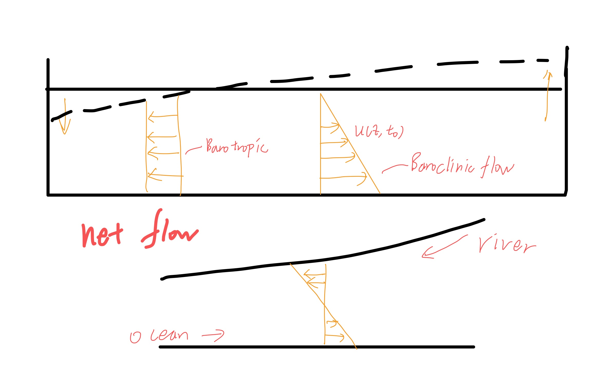
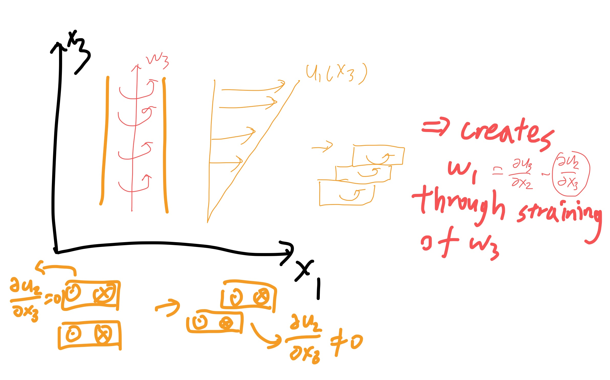
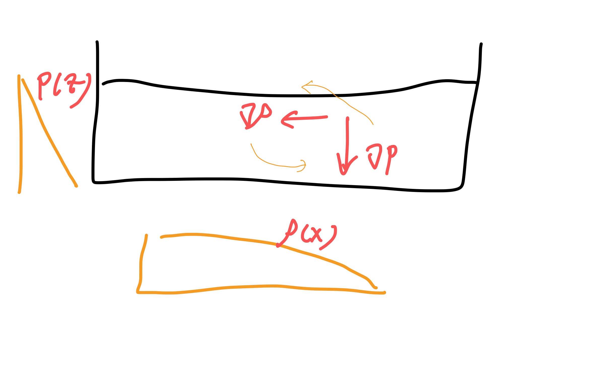
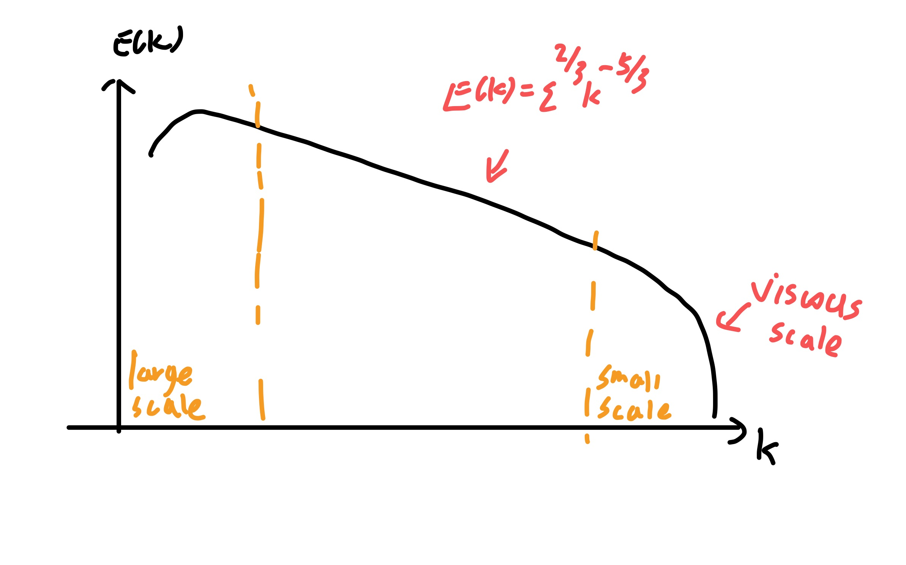
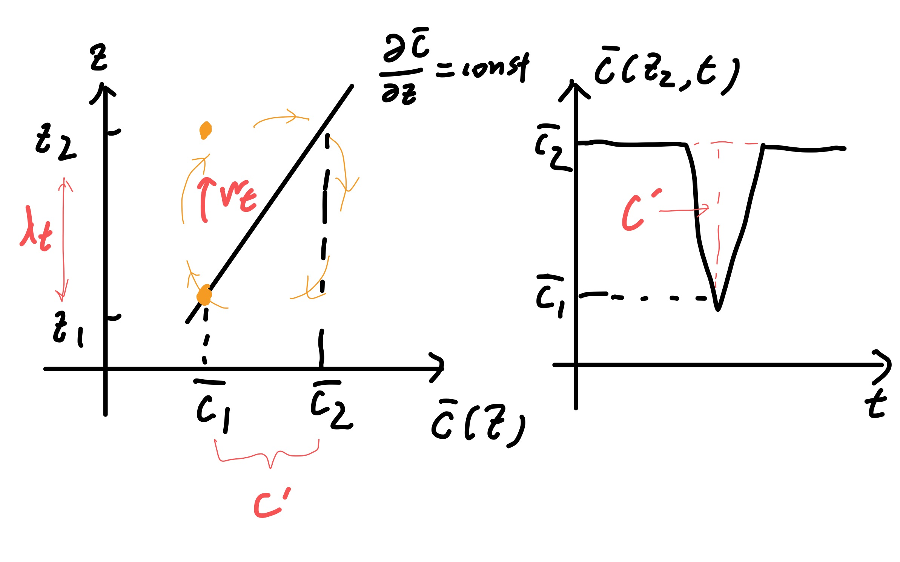
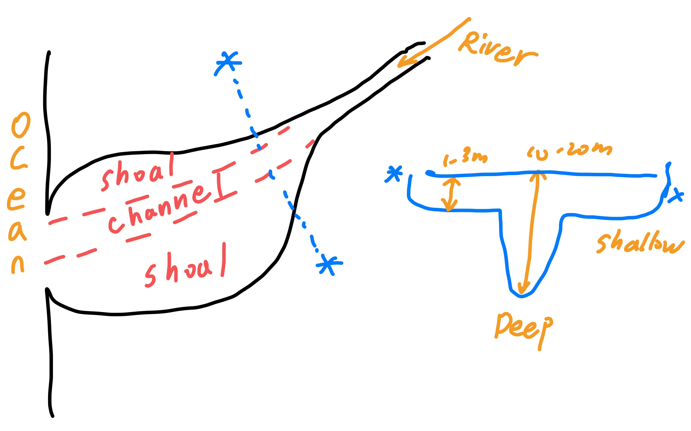

2020年春季学期于UCB访学时，上Environmental flow课程所整理的笔记。

可惜因为疫情，只旁听了半截。

# Review

## Fundamental equations

`\noindent`{=latex}[Advection diffusion]{.underline}, concentration $C$ $$\dd[D]{C}{t}=\pp{C}{t}+u_i\pp{C}{x_i}=D\pp{^2C}{x_i\partial x_I}$$ [Mass conservation (continuity)]{.underline} $$\dd[D]{\rho}{t}+\rho\pp{u_i}{x_i}=0$$ if $\rho$ is nearly constant, we get incompressible continuity equation. $$\frac{1}{\rho}\dd[D]{\rho}{t}\ll \pp{u_1}{x_1} ,\pp{u_2}{x_2},\pp{u_3}{x_3}\quad\Rightarrow\quad  \pp{u_i}{x_i}=0$$ [Navier-Stokes(momentum) equations]{.underline} $$\pp{u_i}{t}+u_j\pp{u_i}{x_j}=-\frac{1}{\rho}\pp{p}{x_i}+\nu\nabla^2u_i+g_i$$ this is for fixed reference frame (inertial) and incompressible, $\rho$ and $\nu$ are constant. The terms on the $rhs$ are pressure, viscous stress and weight. $\bm{g}=(0,0,-g)$ or only $g_3=-g$.

On the Vertical direction, i.e., $i=3$, $g_i=-g$, we write the equation like following. $$\pp{u_3}{t}+u_j\pp{u_3}{x_j}-\nu\nabla^2u_3=-\frac{1}{\rho}\pp{p}{x_3}-g$$ the $rhs$ represent hydrostatic relevance. if the 3 terms on $lhs$ are **individually** $\ll g$, that is, $$\pp{u_3}{t}\ll g \quad \mathrm{and} \quad u_j\pp{u_3}{x_j}\ll g \quad \mathrm{and} \quad \nu \nabla^2u_3\ll g$$ then we can get [hydrostatic approximation]{.underline} $$\label{eq:hydrostatic}
\tcbhighmath{\pp{p}{x_3}=-\rho g}$$ $\ll$ the other term on rhs is also ok, but that term is responding to $g$, and $g$ is fixed(easy to compare). if $u_3=0$, then hydrostatic approximation is exactly valid.

## Density variations in the environment

the density varies $\rho=\rho(x_1,x_2,x_3,t)$. this is in response to temperature (for water or air), salinity (for water), pressure (for air). We will focus on the first two, so $\rho=\rho(S,T)$. For fresh water, $\rho=1000 \unit{kg/m^3}$. For sea water, $\rho\approx 1030 \unit{kg/m^3}$.

We can decompose varying density to background constant density and fluctuations. $\bar{\rho},\rho'\ll \rho_0$ and $\rho_0=1000 \mathrm{kg/m^3}$. $\bar{\rho}(x_3)$ represent stable vertical density stratification. $$\rho(x_1,x_2,x_3,t)=\rho_0+\bar{\rho}(x_3)+\rho'(x_1,x_2,x_3,t)=\rho_0+\tilde{\rho}$$ [Boussinesq Approximation]{.underline}, if $\rho=\rho_0+\tilde{\rho}$ and $\tilde{\rho}\ll \rho_0$ so we can neglect some terms. e.g., in continuity equation with variable density would be $$\frac{1}{\rho}\dd[D]{\rho}{t}+\pp{u_i}{x_i}=0$$ using $\rho=\rho_0+\tilde{\rho}$, then we left just $\tilde{\rho}$, getting $$\frac{1}{\rho_0+\tilde{\rho}}\dd[D]{\tilde{\rho}}{t}+\pp{u_i}{x_i}=0$$ And as $\tilde{\rho}\ll \rho_0$, the denominator becomes $\rho_0$. $$\frac{1}{\rho_0}\dd[D]{\tilde{\rho}}{t}+\pp{u_i}{x_i}=0$$

momentum equations for density not constant: $$\rho \pp{u_i}{t}+\rho u_j\pp{u_i}{x_j}=-\pp{p}{x_i}+\mu \nabla^2u_i+\rho g_i$$ also use $\rho=\rho_0+\tilde{\rho}$ and assume $\tilde{\rho}\ll \rho_0$, dividing all term by $\rho_0$, we get $$\frac{\rho_0+\tilde{\rho}}{\rho_0}\dd[D]{u_i}{t}=-\frac{1}{\rho_0}\pp{p}{x_i}+\frac{\mu}{\rho_0}\nabla^2u_i+\frac{\rho_0+\tilde{\rho}}{\rho_0}g_i$$ leading to $$\dd[D]{u_i}{t}=-\frac{1}{\rho_0}\pp{p}{x_i}+\nu\nabla^2u_i+g_i+\frac{\tilde{\rho}}{\rho_0}g_i$$ it shows that what density variation may cause effect is the last term. note $g_i$ is balanced by hydrostatic approximation, and the last gravity term may affect $lhs$ as well as vertical movement. we call the last term [reduced gravity]{.underline} $g'=g \tilde{\rho}/\rho_0$ or [buoyancy forcing]{.underline}.

\begin{mybox}{Further explanation on balance}
For further explanation, separate pressure into hydrostatic and dynamic components $p=p_H+p_D$, then
\begin{equation}
\dd[D]{u_3}{t}=-\frac{1}{\rho_0}\pp{p_H}{x_3}-\frac{1}{\rho_0}\pp{p_D}{x_3}+\nu\nabla^2u_3-g-\frac{\tilde{\rho}}{\rho_0}g
\end{equation}
we say the balance may be
\begin{equation}
\pp{p_H}{x_3}=-\rho g
\end{equation}
the remaining is
\begin{equation}
\dd[D]{u_3}{t}=-\frac{1}{\rho_0}\pp{p_D}{x_3}+\nu\nabla^2u_3-\frac{\tilde{\rho}}{\rho_0}g
\end{equation}
and we can not say which term is bigger or smaller in the equation above.
\begin{questionbox}{}
  What if $\dd[D]{u_3}{t}$ is of nearly the same magnitude with $g$ ?  Should it be put into (16)?

  ans: $p_D$ will respond.
\end{questionbox}
\end{mybox}

## Vertical density-based motions

Assuming density linearly increses with depth. We will get $\pp{\rho}{z}<0$ is stable while $\pp{\rho}{z}>0$ is unstable.

Take a small parcel of fluid, and write its equation, that is $$\pp{}{t}(\rho_0 w)=-g\Delta \rho$$ while $w=\pp{z}{t}$ where $z$ is position of parcel. $\Delta \rho=-\pp{\rho}{z}\Delta z$. so we get`\marginnote{we choose at the stable point $z=0$ so $\Delta z=z$}`{=latex} $$\rho_0\ppn{z}{t}=g\pp{\rho}{z}z \quad\Rightarrow\quad  \ddn{z}{t}= \brack{\frac{g}{\rho_0}\pp{\rho}{z}}z$$ the term in the bracket is constant, we assign it $-N^2$, called [Brunt-Väisälä Frequency]{.underline}. For $\pp{\rho}{z}<0$, we will get $N^2>0$, and we get $\sin$ and $\cos$ solutions. The oscillatory period is $2\pi/N$. $$\ddn{z}{t}+N^2z=0 \quad\Rightarrow\quad  z=A\cos(Nt)+B\sin(Nt)$$ For $\pp{\rho}{z}>0$, we get exponentials. $$z=A \exp{N t}+B\exp{-Nt}$$ so this is unstable. The abs of $\pp{\rho}{z}$ measures the strenth of stratification and $N$. bigger $N$ leads faster oscillation.

## Long Box problem, Coastal Estuary

Now we think about **horizontal stratification**. River flows into ocean. In river, the salinity is zero. In ocean, the salinity is $35 \unit{ppt}$. Tides, winds affects. and we get salinity gradient. Set $S=S(x)$ and $\rho=\rho(x)$, depth $H(x)$. Dynamics for $u_1$ is $$\pp{u_1}{t}+u_j\pp{u_1}{x_j}=-\frac{1}{\rho_0}\pp{p}{x_1}+\nu \pp{^2u_1}{x_j\partial x_j}$$ And $v=0$, and because large-scle horizontal flow, $w\rightarrow 0$, also horizontal scale is very large so $\pp{u}{x}\rightarrow 0$. For invisicd solution also no $\nu$ term. so $$\pp{u}{t}=-\frac{1}{\rho_0}\pp{p}{x}$$ so $\pp{p}{x}$ is crucial in controlling flow. we want to derive $\pp{p}{x}$. Assuming $u_3=0$, flat bottom $z=0$, with hydrostatic approximation `\autoref{eq:hydrostatic}`{=latex}, $$p(x,z)=p_{\mathrm{atm}}+\rho(x) g(H-z)$$ then $$\pp{p}{x}=\pp{}{x} \Brack{p_{\mathrm{atm}}+\rho g(H-z)}=\rho g\pp{H}{x}+g\pp{\rho}{x}(H-z)$$ $$\pp{u}{t}=-g\pp{H}{x}-\frac{g}{\rho_0}\pp{\rho}{x}(H-z)$$ the first term is barotropic like tides, river flow, etc., meaning the density and pressure together varies in the vertical direction. The second term is baroclinic, density driven flow or say exchange flow. The density and pressure varies in different direction. Also because it is a function of $z$. As going deeper, the baroclinic force is bigger.

<figure id="fig:costales">

<figcaption>Costal Estuary</figcaption>
</figure>

## Rotating effects

the momentum eq $$\pp{u_i}{t}+ u_j\pp{u_i}{x_j}=-\frac{1}{\rho_0} \pp{p}{x_i}+\nu \nabla^2u_i+g_i$$ is hold in the fixed reference frame. Consider a reference frame rotating at $\bm{\Omega}$. We define $\bm{r}$ to be the pos vector from $(x_1,x_2,x_3)=(0,0,0)$, $\bm{u},\bm{a}$ is velocity and accleration vectors. Use subscript $F$ as fixed frame and $R$ as rotating frame. so $\pp{\bm{u}_F}{t}|_F=\bm{a}_F$ is the time rate of change, observed in a fixed frame, of the velocity observed in fixed frame. Also works for $\pp{\bm{u}_R}{t}|_R=\bm{a}_R$.

For any vector $\bm{p}$, there is $$\brack{\dd{\bm{p}}{t}}_F=\brack{\dd{\bm{p}}{t}}_R+\bm{\Omega}\times \bm{p}$$ So using $\bm{r}$, we get $$\brack{\dd{\bm{r}}{t}}_F= \brack{\dd{\bm{r}}{t}}_R+\bm{\Omega}\times \bm{r} \qquad
  \bm{u}_F=\bm{u}_R+\bm{\Omega}\times \bm{r}$$ again, $$\begin{aligned}
  \brack{\dd{\bm{u}_F}{t}}_F&=\brack{\dd{}{t} \brack{\bm{u}_R+\bm{\Omega}\times \bm{r}}}_F\\
  &=\brack{\dd{}{t}(\bm{u}_R+\bm{\Omega}\times \bm{r})}_R+\bm{\Omega}\times(\bm{u}_R+(\bm{\Omega}\times \bm{r})) \\
  &= \brack{\dd{\bm{u}_R}{t}}_R+\brack{\dd{}{t}(\bm{\Omega}\times \bm{r})}_R+\bm{\Omega}\times \bm{u}_R+\bm{\Omega}\times(\bm{\Omega}\times \bm{r})
\end{aligned}$$ as $\dd{}{t}(\bm{\Omega}\times \bm{r})_R=\bm{\Omega}\times \bm{u}_R$, $\bm{\Omega}\times\bm{\Omega}\times \bm{r}=-\bm{\Omega}^2\bm{r}$,

\begin{questionbox}{}
   $\bm{\Omega}\times(\bm{\Omega}\times \bm{r})=\bm{\Omega}(\bm{\Omega}\cdot \bm{r})-\bm{\Omega}^2\bm{r}$ ans: TBD
\end{questionbox}

$$\brack{\dd{\bm{u}_F}{t}}_F= \brack{\dd{\bm{u}_R}{t}}_R+2(\bm{\Omega}\times \bm{u}_R)-\bm{\Omega}^2\bm{r}$$ so we have 2 new terms. $$\dd{\bm{u}}{t}=-\frac{1}{\rho_0}\nabla p+\nu \nabla^2\bm{u}+(\bm{g}+\bm{\Omega}^2 \bm{r})-2(\bm{\Omega}\times \bm{u})$$ $\bm{\Omega}^2\bm{r}$ is centrifugal accleration which is oftern neglected because it is small compared to $\bm{g}$. The last term is coriolis force.

\begin{examplebox}{2D Coriolis Force}
  For example, $x_1-x_2$ plane, rotation vector along $x_3$. we will get
\begin{equation}
\pp{u_1}{t}+\cdots = \cdots +f u_2 \qquad \pp{u_2}{t}+\cdots =\cdots -fu_1
\end{equation}
where $f=2\abs{\bm{\Omega}}$. At $t=0$ , $\bm{u}=(u_0,0)$, the object will go around a circle.
\end{examplebox}

$$\pp{u_1}{t}+u_1\pp{u_1}{x_1}+u_2\pp{u_1}{x_2}=-\frac{1}{\rho_0}\pp{p}{x_1}+\nu \nabla^2u_1+fu_2$$ comparing the advection term and coriolis term, $$u_1\pp{u_1}{x_1}\approx \frac{U^2}{L} \qquad fu_2\approx fU \quad\Rightarrow\quad  Ro=\frac{U}{fL}$$ We get [Rossby number]{.underline}.

\begin{questionbox}{}
  We assume $u_1$ and $u_2$ have same magnitude $U$ when deriving $Ro$. What if, like in horizontal flow, $u_1\ll u_2$? Is $Ro$ still make sense?

  ans: when rotating make sense, we are considering 2D problem, and $u_1$ and $u_2$ will have same magnitude.
\end{questionbox}
\begin{questionbox}{}
  Is there a unitless number measuring the strength of stratification? ans: $Ri$
\end{questionbox}

## vorticity equation

local rotational (angular) velocity of a fluid element. $\bm{\omega}$ can complete description of flow field. $\bm{\omega}=\nabla\times \bm{u}$. Taking curl to NS equ, constant $\rho$ case. $$\nabla\times \Brack{\pp{\bm{u}}{t}+\bm{u}\cdot\nabla \bm{u}=-\frac{1}{\rho_0}\nabla p+\bm{g}+\nu \nabla^2\bm{u}}$$ Consider each term, $$\begin{aligned}
  &\nabla\times \pp{\bm{u}}{t}=\pp{}{t}(\nabla\times \bm{u})=\pp{\bm{\omega}}{t}\\
  &\nabla\times(\nu\nabla^2 \bm{u})=\nu \nabla^2 \bm{\omega}\\
  &\nabla\times \nabla p =\bm{0} \qquad \nabla\times \bm{g}=0
\end{aligned}$$ For advection term, $$\begin{aligned}
&\nabla\times(\bm{u}\cdot\nabla \bm{u})=\nabla\times(\bm{\omega}\times \bm{u})+\frac{1}{2} \nabla\times(\nabla(\bm{u}\cdot \bm{u})) \\
& \nabla\times(\bm{\omega}\times \bm{u})=\bm{u}\cdot\nabla\bm{\omega}-\bm{\omega}\cdot \nabla \bm{u}
\end{aligned}$$ We finally get $$\dd[D]{\bm{\omega}}{t}=\pp{\bm{\omega}}{t}+\bm{u}\cdot\nabla \bm{\omega}=\bm{\omega}\cdot\nabla \bm{u}+\nu\nabla^2\bm{\omega}$$ So there is a new term $\bm{\omega}\cdot\nabla \bm{u}$. e.g. $$\pp{\omega_1}{t}=\omega_1 \pp{u_1}{x_1}+\omega_2\pp{u_1}{x_2}+\omega_3\pp{u_1}{x_3}$$ note $\pp{u_1}{x_1}$ measures the stretch of fluid, so if fluid is stretched long, the vorticity will increase.

\begin{examplebox}{Vorticity from Straining
}Take $\omega_1$ as example.
\begin{equation}
\pp{\omega_1}{t}+u_j\pp{\omega_1}{x_j}=\nu \nabla^2\omega_1+\omega_j\pp{u_1}{x_j}
\end{equation}
the first three terms are advection-diffusion of $\omega_1$, the last term is stretching and straining of $\bm{\omega}$.
\begin{equation}
\pp{\omega_1}{t}\cdots = \cdots+\omega_1\pp{u_1}{x_1}+\omega_2\pp{u_1}{x_2}+\omega_3\pp{u_1}{x_3}
\end{equation}
\begin{figure}[H]
  \centering
  
  \caption{vorticity from straining}
  \label{fig:vorticityfromstrain}
\end{figure}
\end{examplebox}

## Variable density

$$\pp{\bm{u}}{t}\cdots=-\frac{1}{\rho}\nabla p+\cdots$$ taking curl, the new term is $$\begin{aligned}
  &\nabla\times \brack{-\frac{1}{\rho}\nabla p} \quad \rightarrow \quad \epsilon_{ijk}\pp{}{x_j} \brack{-\frac{1}{\rho}\nabla p}\\
  &=\epsilon_{ijk} \brack{-\frac{1}{\rho}} \pp{^2p}{x_j\partial x_k}+\epsilon_{ijk} \brack{ \frac{1}{\rho^2}\pp{\rho}{x_j}}\pp{p}{x_k}\\
  &=\frac{1}{\rho} \Brack{\epsilon_{ijk}\pp{\rho}{x_j}\pp{p}{x_k}}\\
  &=\frac{1}{\rho^2} \nabla \rho\times\nabla p
\end{aligned}$$ now the equation is $$\pp{\bm{\omega}}{t}+\bm{u}\cdot\nabla\bm{\omega}=\nu\nabla^2\bm{\omega}+\bm{\omega}\cdot\nabla \bm{u}+\frac{1}{\rho^2} \nabla \rho\times\nabla p$$ the last new term is a source term. If $\nabla \rho$ aligns wigh $\nabla p$ then it is zero. If not, there will be baroclinic vorticity production. Just like the Long Box problem.

\begin{mybox}{Important:
}Without the new term, initial $\bm{\omega}=\bm{0}$ will leads to $\bm{\omega}=\bm{0}$ all times. But with this term, even initial $\bm{\omega}=\bm{0}$, there will be vorticity generation.
\end{mybox}

<figure id="fig:barocliniclongbox">

<figcaption>Baroclinic Long Box</figcaption>
</figure>

## Fluid Column Model

set up grid from $z=0$ tp $z=H$, $z_1,z_2,\dots,z_N$. Concentration $C(z,t)$, velocity $u(z,t)$, temperature $T(z,t)$, Salinity $S(z,t)$, pressure $p(z,t)$. We focus on concentration first. The equation is $$\pp{C}{t}=\pp{}{z} \brack{D \pp{C}{z}}$$ $lhs$ use Implicit/Explicit time advancement. Using implicit method, $$\frac{1}{\Delta t}\brack{C_i^{n+1}-C_i^n}= \Brack{\pp{}{z} \brack{D\pp{C}{z}}}^{n+1}= \frac{1}{\Delta z} \brack{ \brack{D \pp{C}{z}}_{i+1/2}- \brack{D\pp{C}{z}}_{i-1/2}}$$ (also show explicit here:) $$\frac{D\Delta t}{\Delta z^2}<\beta \quad\Rightarrow\quad  \Delta t< \beta \frac{\Delta z^2}{D}$$ also $$\brack{D \pp{C}{z}}_{i+1/2} = D_{i+1/2} \frac{1}{\Delta z} (C_{i+1}^{n+1}-C_i^{n+1}) \qquad  \brack{D\pp{C}{z}}_{i-1/2}=D_{i-1/2} \frac{1}{\Delta z}(C_i^{n+1}-C_{i-1}^{n+1})$$ finally $$\frac{1}{\Delta t}\brack{C_i^{n+1}-C_i^n}=\frac{1}{\Delta z^2} \Brack{D_{i+1/2}C_{i+1}^{n+1}-(D_{i+1/2}+D_{i-1/2})C_i^{n+1}+D_{i-1/2}C_{i-1}^{n+1}}$$ so the full equation can be written $$\Brack{- \frac{\Delta t}{\Delta z^2}D_{i+1/2}}C_{i+1}^{n+1}+ \Brack{1+ \frac{\Delta t}{\Delta z^2}(D_{i+1/2}+D_{i-1/2})}C_i^{n+1}+ \Brack{-\frac{\Delta t}{\Delta z^2}D_{i-1/2}}C_{i-1}^{n+1}=C_i^n$$ this can be expressed in matrix form. In matlab just use. $$C^{n+1}= \mathrm{tridiag}(a,b,c,C^n)$$ For B.C., most common we will use Neumann BC to specify gradient of a quantity at $z=0$ or $H$. If $\pp{C}{z}=0$ at $z=0,H$, or specified $C'$. At $i=1$, $z=\Delta z$, assume $D$ constant, $$C_1^{n+1}=C_1^n+ \frac{\Delta t D}{\Delta z^2} \Brack{C_2^{n+1}-2C_1^{n+1}+C_0^{n+1}}$$ we use $$\pp{C}{z}\sim \frac{C_1-C_0}{\Delta z}=C' \quad\Rightarrow\quad  C_0=C_1-\Delta z C'$$ so the $C_1^{n+1}$ changes into $$\begin{aligned}
  C_1^{n+1}&=C_1^n+ \frac{\Delta t D}{\Delta z^2} \Brack{C_2^{n+1}-2C_1^{n+1}+C_1^{n+1}-\Delta z C'}\\
         &= C_1^n+ \frac{\Delta t D}{\Delta z^2} \Brack{C_2^{n+1}-C_1^{n+1}}-\frac{\Delta t D}{\Delta z} C'
\end{aligned}$$ $$\Brack{-\frac{\Delta t D}{\Delta z^2}}C_2^{n+1}+ \Brack{1+\frac{\Delta t D}{\Delta z^2}}C_1^{n+1}=C_1^n-\frac{\Delta t D}{\Delta z} C'$$

# Turbulent Flows

## What is turbulent flow

Turbulent flow is characterized by 3 features:

1.  3d flow structures

2.  unsteady

3.  contain a wide range of "scales", spatial and temporal variability

A laminar flow is stable with time, but turbulent flow varies around initial speed a lot. Define mean/average velocity profile $\bar{u}(z)$, then we can use deviation $u'(z,t)$ (called turbulent/fluctuation velocity) to analyze.

## Averaging in turbulent flow

Consider evolving mean flow.

-   The easiest way to visulize is to use [time average]{.underline} $$\brack{u}(z,t)=\frac{1}{T}\int_{-T/2}^{T/2}u(z,t)\d t$$ But $T$ can be differently chosen. In order to be effective, it requires $T$ to be longer than turbulent variations, but is shorter than mean flow variations.

    Think of hydrograph`\marginnote{Hygrograph is the flux-time plot $Q(t)$}`{=latex} in river, its mean flow time scale may be days, but turbulent time scale may only be seconds. Then think of flow under waves, the mean flow time scale is only seconds, so we cannot taking time averages.

-   The second method is [ensemble average]{.underline}. That is creating a set of $N$ realizations, $i$th is $u(z,t)$, then $$\bar{u}(z,t)=\frac{1}{N} \sum_{i=1}^Nu_i(z,t)$$

-   The third method is [raynolds average]{.underline}. It is simply a separation of velocity into mean $\overline{u}$ and turbulent $u'$ components.

Consider the scale of $u',v',w'$ first.

[Turbulent eddy]{.underline}: streamline shows overturning motion. Eddies are useful in describing turbulent length scales. The size of turbulent eddy is denoted as $\lambda_t$ where $t$ refers to turbulence. It also have velocity scale $u_t$. The time scale, is $\tau_t=\lambda_t/u_t$

How to estimate $u_t,\lambda_t,\tau_t$? Use root-mean-square of $u'(t)$ to calc $u_t$. Integral time scale $\tau_t$. Mean of turbulent velocities equals $0$. That is $$\overline{u'}=\overline{v'}= \overline{w'}=0$$ the overline means Raynolds average. However, $$\overline{(u')^2}, \overline{(v')^2}, \overline{(w')^2}\neq 0$$ Let [Turbulent Kinetic Energy]{.underline}, or TKE, which is the key factor, to be $$q^2= \overline{(u')^2}+ \overline{(v')^2}+ \overline{(w')^2}   \quad \text{ or} \quad k= \frac{1}{2} \brack{ \overline{(u')^2}+ \overline{(v')^2}+ \overline{(w')^2}}$$

## Turbulent Scale and Properties

\begin{mybox}{Turbulent Scales}
  Turbulent length scales goes from largest: constrained by solid boundaries; smallest: constrained by viscosity.
\begin{description}
\item[Large scales] Set by boundaries and motions are set by external forcing. Get energy from outside.
\item[Intermediate] Get energy from Large scale, transfer to smaller scale.
\item[Small scales] Set by viscosity. Energy dissipated by viscosity.
\end{description}
\end{mybox}

If we say turbulent is **steady**, we mean the energy flows through this system is stable, assign $\epsilon$ to it as the [Turbulent Dissipation Rate]{.underline}. As energy is conserved, the rate of energy transfer in all process will also be $\epsilon$. This is known as [Energy Cascade]{.underline}.

Smallest scales respond only to $\epsilon$ and $\nu$, they don't care about the larger scale process. So the energy conservation simply leads to the [Kolmogorov Length Scale]{.underline} $\lambda_{\nu}=\brack{\nu^3/\epsilon}^{1/4}$. This scale is the smallest

[Kolmogorov Spectrum]{.underline} for turbulent. For specturm we use wavenumber $k=\lambda^{-1}$ where $\lambda$ is the length scale. Energy density $E(k)$ is the energy per wavenumber. $$q^2=\int_0^{\infty}E(k)\d k$$

<figure id="fig:Turbulencespec">

<figcaption>Turbulence energy specturm (Steady)</figcaption>
</figure>

The large scale has most energy and is dominant in affecting density mixing and other effects.

For the largest turbulent scale, we use $u_t,\lambda_t,\tau_t$ to refer to velocity, length and time scale. e.g., the velocity scale can be rms of $\overline{u'}$, $\sqrt{q^2}$, length scale can be $H$, $u_t\tau_t$, time scale can be $q^2/\epsilon$.

The correlation, or Integral time scale, can be calculated from [lagged auto-correlation]{.underline}. $$R(\Delta t)=\overline{u'(t)\cdot u'(t+\Delta t)}\bigg/ \overline{(u')^2}$$ In real turbulent flow, $R(\Delta t)$ usually starts from $1$ at $\Delta t=0$ then drops as $\Delta t$ increases. Integrate it to get the [Integral time scale]{.underline}: $$\tau_t=\int_0^{\infty}R(\Delta t)\d  (\Delta t)$$ The time scale here represent how long the flow is similar to itself, or say how long the turbulence will change.

## Turbulent DIffusion Equation

Start with advection-diffusion equation $$\pp{C}{t}+u\pp{C}{x}+v\pp{C}{y}+w\pp{C}{z}=D\nabla^2C$$ With turbulent flow, $C=\overline{C}+C'$, $u=\overline{u}+u'$, $v=\overline{v}+v'$, $w=\overline{w}+w'$. We mainly want to know $\overline{C}(x,y,z,t)$. Using coninuity equation, $$\pp{C}{t}+\pp{}{x}(uC)+\pp{}{y}(vC)+\pp{}{z}(wC)=D\nabla^2C$$ Now apply average in each term, we get $$\pp{\overline{C}}{t}+\pp{}{x}(\overline{uC})+\pp{}{y}(\overline{vC})+\pp{}{z}(\overline{wC})=D\nabla^2\overline{C}$$ Substituting, $$\begin{gathered}
  \pp{(\overline{\overline{C}+C'})}{t}+\pp{}{x}(\overline{(\overline{u}+u')(\overline{C}+C')})+\pp{}{y}(\overline{(\overline{v}+v')(\overline{C}+C')})+\pp{}{z}(\overline{(\overline{w}+w')(\overline{C}+C')})\\
  =D\nabla^2 (\overline{\overline{C}+C'})
\end{gathered}$$ with some properties, $$\overline{f+g}=\overline{f}+\overline{g} \qquad  \overline{\overline{f}+f'}=\overline{\overline{f}}+\overline{f'}=\overline{f} \qquad
  \overline{f'g'}\neq 0 \qquad \overline{\overline{f}\overline{g}}=\overline{f}\overline{g}$$ $$\overline{(\overline{u}+u')(\overline{C}+C')}= \overline{\overline{u}\overline{C}}+ \underbrace{\overline{\overline{u}C'}}_{=0}+ \underbrace{\overline{u'\overline{C}}}_{=0}+ \overline{u'C'}= \overline{u}\overline{C}+ \overline{u'C'}$$ The correlation term $\overline{u'C'}$ is a new term. Putting back, $$\pp{\overline{C}}{t}+ \overline{u}\pp{\overline{C}}{x}+ \overline{v}\pp{\overline{C}}{y}+ \overline{w}\pp{\overline{C}}{z}=D\nabla^2\overline{C}-\pp{}{x}(\overline{u'C'})-\pp{}{y}( \overline{v'C'})-\pp{}{z}(\overline{w'C'})$$ Those new terms on the $rhs$ represents the turbulent mixing. Take $\overline{w'C'}$ term for example,

<figure id="fig:turbdiff">

<figcaption>Turbulence diffusion example. The Yellow circle represents the turbulence. A parcel was carried by turbulence from <em>z</em>1 to <em>z</em>2, causing the concentration at <em>z</em>2 to drop at certain time.</figcaption>
</figure>

We approximately calculate the term as $$\overline{w'C'}\approx -w_t\lambda_t \pp{\overline{C}}{z}$$ and define $k_t=w_t\lambda_t$ is [Turbulent Diffusion Coefficient]{.underline} $$\pp{\overline{C}}{t}+\cdots=D\nabla^2\overline{C}+\cdots -\pp{}{z} \brack{-w_t\lambda_t\pp{\overline{C}}{z}}=D\nabla^2\overline{C}+\cdots +\pp{}{z} \brack{k_t\pp{\overline{C}}{z}}$$

if $u_t\approx v_t\approx w_t$, which is called isotropic turbulence, then it is same for $x$ and $y$ dir. $$\pp{\overline{C}}{t}+ \overline{u}\pp{\overline{C}}{x}+\overline{v}\pp{\overline{C}}{y}+\overline{w}\pp{\overline{C}}{z}=D\nabla^2\overline{C}+\pp{}{x} \brack{k_t\pp{\overline{C}}{x}}+\pp{}{y} \brack{k_t\pp{\overline{C}}{y}}+\pp{}{z} \brack{k_t\pp{\overline{C}}{z}}$$ if $k_t$ is not a function of $x,y,z$, the $rhs$ becomes $(D+k_t)\nabla^2\overline{C}$. Usually $D\ll k_t$.

\begin{mybox}{Turbulent Properties Comparison
}\begin{enumerate}
\item Homogeneous turbulence, means
  $\overline{(u')}, \overline{(v')}, \overline{(w')}$ is not a  function of $x,y,z$.
\item Isotropic turbulence: $ \overline{(u')^2}\approx \overline{(v')^2}\approx \overline{(w')^2}$.  If there is boundary, external force, or stratification, this assumption may not holds.
\item Steady turbulence: $\overline{(u')^2}, \overline{(v')^2}, \overline{(w')^2}$ is not a function of $t$.
\end{enumerate}
\end{mybox}

It is same for NS equation. $$\pp{u_i}{t}+u_j\pp{u_i}{x_j}=-\frac{1}{\rho}\pp{p}{x_i}+\nu \nabla^2u_i$$ changes into $$\pp{\overline{u_i}}{t}+ \overline{u_j}\pp{\overline{u_i}}{x_j}=-\frac{1}{\rho}\pp{\overline{p}}{x_i}+\nu\nabla^2\overline{u_i}-\pp{}{x_j} (\overline{u_i'u_j'})$$ the last new term is called turbulent stresses. It act like viscous stresses, but based on turbulent motions. $\overline{w'u'}$ is vertical transport of horizontal momentum. We can define $\nu_t=u_t\lambda_t$, which is turbulent viscosity. $$\pp{\overline{u_i}}{t}+ \overline{u_j}\pp{\overline{u_i}}{x_j}=-\frac{1}{\rho_0}\pp{\overline{p}}{x_i}+\nu\nabla^2\overline{u_i}+g_i+\pp{}{x_j} \brack{\nu_t\pp{\overline{u_i}}{x_j}}$$ Where estimating $\nu_t$ is the core for turbulence modeling.

## Turbulent Models

Consider a case, flat bottom, general depth $H$, slight slope top surface $\pp{\eta}{x}=\const$. Steady flow $\overline{v}=\overline{w}=0$, $\overline{u}$ is not a function of $x$, but a function of $z$. $$0=-\frac{1}{\rho_0}\pp{\overline{p}}{x}+\nu \ppn{\overline{u}}{z}-\pp{}{z}(\overline{u'w'})\underbrace{-\pp{}{y}(\overline{u'v'})-\pp{}{x}(\overline{u'u'})}_{=0}$$ molecular viscous stress $\ll$ turbulent, so neglect. $$-\frac{1}{\rho_0}\pp{\overline{p}}{x}=\pp{}{z}(\overline{u'w'})$$ Depth average from $0\rightarrow H$, $$\frac{1}{H}\int_0^H-\frac{1}{\rho_0}\pp{\overline{p}}{x}\d z=\frac{1}{H}\int_0^H\pp{}{z}(\overline{u'w'})\d z$$ the $lhs$, $$-\frac{1}{\rho_0}\pp{\overline{p}}{x}=-g\pp{\eta}{x}$$ so $$-g\pp{\eta}{x}=\frac{1}{H} \Brack{\overline{u'w'}(H)- \overline{u'w'}(0)}$$ assume free surface, so no free slip. Then $\tau=0$, so $\overline{u'w'}(H)=0$. then $$\underbrace{\rho_0gH\pp{\eta}{x}}_{\tau_{bed}}=\rho_0 \overline{u'w'}(z=0)$$ The turbulence actually is transporting horizontal momentum vertically to the bed, so $\rho_0 \overline{u'w'}$ can be written as $\overline{w'(\rho_0u')}$. Near the boundary, the turbulent motions are limited. $\pp{\overline{u}}{z}$ increase.

Previously we know $$-\overline{u'w'}=\nu_t\pp{\overline{u}}{z} \qquad -\overline{w'C'}=k_t\pp{\overline{C}}{z}$$ But actually the coefficient should be defined as $$\nu_t=\frac{-\overline{u'w'}}{\pp{\overline{u}}{z}} \qquad k_t=\frac{-\overline{w'C'}}{\pp{\overline{C}}{z}}$$ So how to define $\nu_t,k_t$? Actually there are $\nu_x,\nu_y,\nu_z$. But if we make isotropic turbulence assumption, then $\nu_t=\nu_x=\nu_y=\nu_z$. Same for $k_t$. And we assume $\nu_t=\beta k_t$, $\beta$ is an order 1 number. `\marginnote{This assumption breaks down for sediment}`{=latex}.

Modeling for $\nu_t$. $\nu_t=k_t=u_t\lambda_t$. Mixing (scalar or momentum) is dominated by the largest turbulent scales. So $\lambda_t$ is largest scales, $u_t$ is energy-containig scales.

Some models:

0-equation model

:   scalinqestionates: mean flow or external forcing. $\lambda_t$ is set by physical boundaries. $u_t$ is bulk forcing, channal flow. $$\tau_b=\rho \overline{u'w'}(z=0)=\rho gH\pp{\eta}{x}$$ and $\tau_b=\rho u_{*}^2$, $u_{*}$ is friction velocity. So $\overline{u'w'}(z=0)=u_{*}^2$ leads to approximation $u_t\approx u_{*}$. $$\tau_b=\rho u_x^2=\rho C_D \overline{u}^2 \quad\Rightarrow\quad  u_{*}=\sqrt{C_D}\overline{u}\approx u_t$$ $C_D$ is Empirical drag coefficient, depends on the height at which $\overline{u}$ is evaluated. It depends on roughness of surface. $C_D\approx 0.0025$ for muddy, $u_{*}\approx 0.05\overline{u}$

    Estimating $\lambda_t$, as turbulence can not go into boundary, then $\lambda_t\leq 2z$. For Vonkarman's constant, $k=0.41$. $$\lambda_t=kz \quad(z<H/2) \qquad \lambda_t=k(H-z)\quad(z>H/2)$$ or more smoothly, $$\lambda_t=kH \frac{z}{H} \brack{1-\frac{z}{H}} \qquad \lambda_t^{max}=\frac{1}{4}kH \qquad \lambda_t^{avg}=\frac{1}{6}kH$$ In summary. $$u_t=u_{*} \qquad \lambda_t=f(kH)$$ But what we are missing, is loss of structure/variability of turbulent energetics and influence of stratification.

1-equation model

:   similar, $\lambda_t=f(kH)$, but for $u_t=\sqrt{q^2}$. $q^2$ is solved from $$\pp{q^2}{t}+\overline{u_j}\pp{q^2}{x_j}=\cdots$$

2-equation model

:   still $u_t=\sqrt{q^2}$, but $\lambda_t$ is calc from second turbulence variable. e.g., $\epsilon(x,y,z,t)$, $\lambda_t=(q^2)^{3/2}/\epsilon$. Also known as $k-\epsilon$ models. For Mellor-Yamada models. use $q^2\lambda_t$, as with same unit, $$\int_0^{\infty} \overline{u'(x)u'(x+\delta)}\d \delta \quad\Rightarrow\quad  q^2L$$

A note on the code: models $$\pp{u}{t}=\underbrace{-\frac{1}{\rho_0}\pp{p}{x}}_{f(t)}+\underbrace{\pp{}{z} \brack{\nu_t\pp{u}{z}}}_{\text{implicit}}$$ $$\frac{u_i^{n+1}-u_i^n}{\Delta t}= \brack{-\frac{1}{\rho}\pp{p}{x}}^{n+1}+ \brack{\pp{}{z}(\nu_t\pp{u}{z})}^{n+1}_i$$ $$u_i^{n+1}- \brack{\pp{}{z}(\nu_t\pp{u}{z})}^{n+1}_i=\Delta t \overline{-\frac{1}{\rho_0}\pp{p}{x}}+u_i^n$$ where $u_i^n\rightarrow u_p(z)$

\begin{mybox}{Turbulence models}
  \begin{description}
  \item[0-eqn] Physical scaling: $\lambda_t\approx H$, $u_t\approx u_{*}$
  \item[1-eqn] $\lambda_t\approx H$, $u_t=q$
  \item[2-eqn] $u_t=q$, $\varepsilon(x,y,z,t)$, $q^2l(x,y,z,t)$
  \end{description}
\end{mybox}

## Turbulent Energy Equation

We want an equation for $q^2(x,y,z,t)$. Boundary layer approximation, horizontal scales of problem $\ll$ vertical, which means vertical gradients $\gg$ horizontal gradients. Assume $\pp{}{x}=0$, then $\pp{}{y}\rightarrow 0$. With continuity, we know $\pp{w}{z}=0$, further apply to $w=0$ boundary, we get $w=0$.

Focus on $x$ component $\overline{u'}$. For full velocity, $$\label{eq:2}
\pp{u}{t}+\pp{}{x}(uu)+\pp{}{y}(uv)+\pp{}{z}(uw)=-\frac{1}{\rho_0}\pp{p}{x}+\nu\nabla^2u$$ and $u=\overline{u}+u',v=\overline{v}+v',w=\overline{w}+w',p=\overline{p}+p'$, get RANS $$\label{eq:3}
\pp{\overline{u}}{t}+\pp{}{x}(\overline{u}\overline{u})+\pp{}{y} (\overline{u}\overline{v})+\pp{}{z}(\overline{u}\overline{w})=-\frac{1}{\rho_0}\pp{\overline{p}}{x}+\nu\nabla^2\overline{u}-\pp{}{x}(\overline{u'u'})-\pp{}{y}(\overline{u'v'})-\pp{}{z}(\overline{u'w'})$$ let `\autoref{eq:2}`{=latex} minus `\autoref{eq:3}`{=latex}, we get $$\begin{gathered}
  \pp{u'}{t}+\pp{}{x}(2\overline{u}u'+u'u')+\pp{}{y}(\overline{u}v'+u'\overline{v}+u'v')+\pp{}{z}(\overline{u}w'+u'\overline{w}+u'w')\\
  =-\frac{1}{\rho_0}\pp{p'}{x}+\nu\nabla^2u' +\pp{}{x}(\overline{u'u'})+\pp{}{y}(\overline{u'v'})+\pp{}{z}(\overline{u'w'})
\end{gathered}$$ we want a equation for $\overline{u'^2}$, and $$u'\pp{u'}{t}=\pp{}{t}\brack{\frac{1}{2}u'^2}$$ so multiply each term with $u'$, then take Raynold average, obviously $\overline{u'\pp{}{x}(\overline{u'u'})}$ term vanished. $$\begin{gathered}
  \pp{}{t}\brack{\frac{1}{2}\overline{u'^2}}+ \overline{2u'\pp{}{x}(\overline{u}u')}+ \overline{u'\pp{}{x}(u'u')}\\
  +\overline{u'\pp{}{y}(\overline{u}v')}+\underbrace{ \overline{u'\pp{}{y}(u'\overline{v})}}_{\text{term 5}}+ \overline{u'\pp{}{y}(u'v')}\\
  + \overline{u'\pp{}{z}(\overline{u}w')}+ \overline{u'\pp{}{z}(u'\overline{w})}+\underbrace{ \overline{u'\pp{}{z}(u'w')}}_{\text{term 9}}\\
  = \overline{-u' \frac{1}{\rho_0}\pp{p'}{x}}+ \underbrace{\overline{\nu u'\nabla^2u'}}_{ \text{term 11}}
\end{gathered}$$ For term 9, $$\overline{u'\pp{}{z}(u'w')}=\frac{1}{2}\pp{}{z} \overline{w'u'^2}=\pp{}{z} \brack{\overline{w' \frac{1}{2}u'^2}}$$ this term looks like $\overline{w'C'}$, where $C'=u'^2/2$, so we can use similar model $$\overline{w'C'}=k_t\pp{\overline{C}}{z}\quad\Rightarrow\quad  \pp{}{z} \brack{\overline{w'(u'^2/2)}}=\pp{}{z}\brack{k_q\pp{}{z}(\overline{u'^2}/2)}$$ where $k_q$ is turbulent diffusion coefficient for turbulent energy. Term 3,6,9 are turbulent diffusion of TKE. Other $u'u'$, $u'v'$ term can be similarily treated too. For term 11, simply let $\nu \overline{u'\nabla^2u'}=\epsilon$. For term 5, $$\overline{u'\pp{}{y}(u'\overline{v})}= \overline{u'u'\pp{\overline{v}}{y}}+ \overline{u'\overline{v}\pp{u'}{y}}
  =\underbrace{ \overline{u'u'}\pp{\overline{v}}{y}}_{\text{term 5a}}+\underbrace{\overline{v}\pp{}{y}(\overline{u'^2}/2)}_{\text{Advection of TKE by mean flow}}$$ For term 8, it is similar. $$\overline{u'\pp{}{z}(u'\overline{w})}=\underbrace{ \overline{u'u'}\pp{\overline{w}}{z}}_{\text{term 8a}}+ \overline{w}\pp{}{z}(\overline{u'^2}/2)$$ For term 4, $$\overline{u'\pp{}{y}(\overline{u}v')}=\overline{u} \overline{u'\pp{v'}{y}}+ \overline{u'v'}\pp{\overline{u}}{y}$$ For term 7, $$\overline{u'\pp{}{z}(\overline{u}w')}= \overline{u} \overline{u'\pp{w'}{y}}+ \overline{u'w'}\pp{\overline{u}}{z}$$ For term 2, $$2 \overline{u'\pp{}{x}(\overline{u}u')}=2\overline{u} \overline{u'\pp{u'}{x}}+2 \overline{u'u'}\pp{\overline{u}}{x}
 = \underbrace{\overline{u} \overline{u'\pp{u'}{x}}}_{\text{term 2a}}+ \overline{u}\pp{}{x}(\overline{u'^2}/2)+\underbrace{2 \overline{u'u'}\pp{\overline{u}}{x}}_{\text{term 2c}}$$ Add term 8a, 5a and 2c, $$\overline{u'u'}\pp{\overline{w}}{z}+ \overline{u'u'}\pp{\overline{v}}{y}+2 \overline{u'u'}\pp{\overline{u}}{x}= \overline{u'u'}\pp{\overline{u}}{x}$$ also works for 4a, 7a, 2a, $$\overline{u} \overline{u' \brack{\pp{u'}{x}+\pp{v'}{y}+\pp{w'}{z}}}=0$$

Finally, $$\begin{gathered}
  \underbrace{\pp{}{t}(\overline{u'^2}/2)}_{\text{unsteadiness}}+ \underbrace{\overline{u}\pp{}{x}(\overline{u'^2}/2)+\overline{v}\pp{}{y}(\overline{u'^2}/2)+\overline{w}\pp{}{z}(\overline{u'^2}/2)}_{\text{advection}}\\
  =\overline{-u' \frac{1}{\rho_0}\pp{p'}{x}}+\epsilon-\underbrace{\pp{}{x} \brack{\overline{u'(u'^2/2)}}-\pp{}{y} \brack{\overline{v'(u'^2/2)}}-\pp{}{z} \brack{\overline{w'(u'^2/2)}}}_{\text{Turbulent Diffusion}}\\
  + \underbrace{\overline{u'u'}\pp{\overline{u}}{x}+ \overline{u'v'}\pp{\overline{u}}{y}+ \overline{u'w'}\pp{\overline{u}}{z}}_{\text{P=shear production}}
\end{gathered}$$ The last one, shear production is a source term. Example, $$\overline{u'w'}=-\nu_t\pp{\overline{u}}{z}\quad\Rightarrow\quad  - \overline{u'w'}\pp{\overline{u}}{z}=-\nu_t \brack{\pp{\overline{u}}{z}}^2\geq 0$$ As $$\begin{gathered}
  \pp{}{t}(q^2/2)= \overline{u} \pp{}{x}(q^2/2)+\overline{v}\pp{}{y}(q^2/2)+ \overline{w}\pp{}{z}(q^2/2)\\
  =\pp{}{x}(k_q\pp{}{x}(q^2/2))+\pp{}{y}(k_q\pp{}{y}(q^2/2))+\pp{}{z}(k_q\pp{}{z}(q^2/2))+P-\epsilon
\end{gathered}$$ usually $k_q$ are set to include the three terms below. $$-\overline{u' \frac{1}{\rho_0}\pp{p'}{x}}-\overline{v' \frac{1}{\rho_0}\pp{p'}{y}}-\overline{w' \frac{1}{\rho_0}\pp{p'}{z}}$$ $$\ppt[q^2]+u\pp{q^2}{x}+v\pp{q^2}{y}+w\pp{q^2}{z}=\pp{}{x} \brack{k_q \pp{q^2}{x}}+\pp{}{y} \brack{k_q\pp{q^2}{y}}+\pp{}{z} \brack{k_q\pp{q^2}{z}}+2P-2\epsilon$$ $$\pp{}{z} \brack{k_q\pp{q^2}{z}}=\pp{}{z} \Brack{-\frac{1}{\rho_0} \overline{p'w'}-\overline{w'(u'^2+v'^2+w'^2)}}$$ $$\epsilon=-\nu \overline{u'\nabla^2u'}-\nu \overline{v'\nabla^2v'}-\nu \overline{w'\nabla^2w'}$$ $P$ contains 9 terms, interaction of mean slow and turbulence $$P=- \underbrace{\overline{u_i'u_j'}}_{\text{turbulent stress}}\cdot \underbrace{\pp{\overline{u_i}}{x_j} }_{\text{mean shear}}$$ suppose $\overline{u}(z),\overline{v}=\overline{w}=0$, general parallel shear flows. All the mean shear components are $0$ except $\pp{\overline{u}}{z}$, which means shear production $P=- \overline{u'w'}\pp{\overline{u}}{z}$, but $\overline{u'w'}=-\nu_t\pp{\overline{u}}{z}$, so $P=\nu_t \brack{\pp{\overline{u}}{z}}^2$.

## Applications of TKE Equation

\begin{examplebox}{Breaking waves on a motionless ocean}
  $\varepsilon \neq f(x,y,t)$, $q^2\neq f(x,y,t)\rightarrow q^2(z)$, $\overline{u}=\overline{v}=\overline{w}=0$, so $P=0$, the equation is
\begin{equation}
0=\pp{}{z} \brack{k_q\pp{q^2}{z}}-2\epsilon
\end{equation}
the $q^2$ is diffusived deep into the ocean and dissipated.
\end{examplebox}
\begin{examplebox}{Internal Turbulent event}
  Stratified ocean, double profile $\rho_1<\rho_2$. On the interface there is internal wave, it can reach a point where they overturn and break, causing patch of turbulence.
  $\overline{u}(z)$, $\overline{v}=\overline{w}=0$, $q^2=f(x,y,z,t)$,
\begin{equation}
\pp{q^2}{t}+ \overline{u}\pp{q^2}{x}= \text{ Diffution Terms } +2P-2\epsilon
\end{equation}
The advection term will create horizontal transport of $q^2$.
\end{examplebox}

Boundary layer Approximation, $\overline{u}(z,t)$, $\overline{v}=\overline{w}=0$ $$\ppt[\overline{u}]=-\frac{1}{\rho_0}\pp{\overline{p}}{x}+\pp{}{z} \brack{\nu_t\pp{\overline{u}}{z}}$$ where assume $\pp{\overline{p}}{x}$ is not a function of $x$. $$\pp{q^2}{t}=\pp{}{z} \brack{k_q\pp{q^2}{z}}+\underbrace{2\nu_t \brack{\pp{\overline{u}}{z}}^2}_{\text{source}}-2\epsilon$$ The source term is large near boundary. Steady flow: $$0=\pp{}{z} \brack{k_q\pp{q^2}{z}}+2P-2\epsilon \quad\Rightarrow\quad  \text{Diffusion }=2\epsilon-2P$$ diffusion depends on the balance of $\epsilon$ and $P$. But usually $\epsilon \approx P$, [local equilibrium approximation]{.underline} $P=\epsilon$ is often hold for small shear case.

$$\begin{aligned}
  &\pp{\overline{u}}{t}=-\frac{1}{\rho_0}\pp{}{z} \brack{\nu_t\pp{\overline{u}}{z}}\\
  &\pp{\overline{C}}{t}=\pp{}{z} \brack{k_t\pp{\overline{C}}{z}}\\
  &\pp{q^2}{t}=\pp{}{z} \brack{k_q\pp{q^2}{z}}+2\nu_t \brack{\pp{\overline{u}}{z}}^2-2\epsilon
\end{aligned}$$ $\nu_t\approx u_t\lambda_t\approx k_t\approx k_q$, $u_t= \sqrt{q^2}$, given $\lambda_t$, $\epsilon=(q^2)^{3/2}/\lambda_t$; given $\epsilon$, $\lambda_t=(q^2)^{3/2}/\epsilon$. For $\lambda_t$, options are

1.  $kz$, $kH$, $k \frac{z}{H}(1-\frac{z}{H})$

2.  Mellor-Yamada models, equation for $q^2l$

3.  $k-\epsilon$ models, $k=q^2/2$, $$\pp{\epsilon}{t}=\pp{}{z} \brack{k_q\pp{\epsilon}{z}}-\gamma_1P \frac{\epsilon}{k}-\gamma_2 \frac{\epsilon^2}{k}$$

4.  generalized lengthscale model. $\pp{\lambda_t}{t}+\cdots$, can choose different coefficients to reproduce Mellor-Yamada and $k-\epsilon$ models.

In turbulent cascade, $P$ input into large scale while $\epsilon$ output from large scale into intermediate scale. We are modeling large scale because it is dominate $\nu_t$, $k_t$, $q^2$ as well as $u_t,\lambda_t$. Then we can ignore smaller scale, when the cascade is complete or fully developed turbulence.

#### Comparison of Forcing and Mixing timescale

The boundary layer approximation, (omit prime and bar as Raynold average) $$\pp{u}{t}+u\pp{u}{x}+v\pp{u}{y}+w\pp{u}{z}=-\frac{1}{\rho_0}\pp{p}{x}+\pp{}{x} \brack{\nu_t\pp{u}{x}}+\pp{}{y} \brack{\nu_t\pp{u}{y}}+\pp{}{z} \brack{\nu_t\pp{u}{z}}$$ ignore $u_x,v,w$ and $x,y$ turbulent diffuision, become $$\pp{u}{t}=\underbrace{-\frac{1}{\rho_0}\pp{p}{x}}_{f(t)}+\pp{}{z} \brack{\nu_t\pp{u}{z}}$$ `\marginnote{When baroclinic $f(t)\rightarrow f(z,t)$.}`{=latex} Assume flow is forced by pressure, compare importance of other $2$ terms, $u\sim U_0, t\sim T, z\sim H$ $$\frac{\text{Unsteadiness}}{\text{Turbulent Stress}}\approx \frac{U_0/T}{\nu_t U_0/H^2}=\frac{H^2}{\nu_tT}=\frac{H^2\nu_t}{T}=\frac{T_{mix}}{T}$$ $T$ is forcing timescale. $T_{mix}=H^2/\nu_t$ is the time it takes for momentum to be mixed over distance $H$.

1.  $T_{mix}\gg T$, unsteadiness much larger than viscous`\marginnote{short for turbulent viscous}`{=latex}, $$\quad\Rightarrow\quad \pp{u}{t}=-\frac{1}{\rho_0}\pp{p}{x}=f(t)$$ oscillatory tidal forcing $$-\frac{1}{\rho_0}\pp{p}{x}=P_x\cos(\omega t) \qquad \omega=\frac{2\pi}{T} \quad T= \text{12.4 hr}$$ $$\pp{u}{t}=P_x\cos(\omega t)\quad\Rightarrow\quad  u(t)=\frac{P_x}{\omega}\sin(\omega t)\neq f(z)$$

2.  $T_{mix}\ll T$, viscous much larger than unsteady $$0=-\frac{1}{\rho_0}\pp{p}{x}+\pp{}{z} \brack{\nu_t\pp{u}{z}}$$ Solid bottom boundary $z=0$, $u=0$, no stress condition at $z=H$, $\pp{u}{z}=0$. If $\nu_t=\const$, integrate and get $$u(z,t)=A(t)(z^2-2Hz) \qquad A(t)=-\frac{1}{2\nu_t} \frac{1}{\rho_0}\pp{p}{x}=\frac{1}{2}P_x\cos(\omega t)$$

When $T_{mix}\gg T$, $H^2\gg \nu_tT$, which shows deep case. On the contrary, shows shallow case. In the deep case, the flow goes $\sin(\omega t)$ while forcing goes $\cos(\omega t)$, flow lags forcing. This reflects effects of intertia of flow. In the shallow case, the flow goes $\cos(\omega t)$ while Forcing goes with $\cos(\omega t)$, means there is no inertia and flow evolves with forcing.

#### Costal Embayment Channel-Shoal Morphology

Deep part have larger inertia.

<figure id="fig:costalembay">

<figcaption>Costal Embayment</figcaption>
</figure>

$$\pp{u}{t}=-\frac{1}{\rho_0}\pp{p}{x}+\nu_t\ppn{u}{z}$$ $u(0,t)=u_0\cos(\omega t)$, infinite plate $\pp{p}{x}=0$. Periodic steady state solution. Solution of the from $u(z,t)=\exp{\i \omega t}f(z)$ and take the real part. $$\i\omega\exp{\i\omega t}f=\nu_t\exp{\i\omega t}f'' \quad\Rightarrow\quad f''- \frac{\i \omega}{\nu_t}f=0$$ $$k=\pm(\i+1) \sqrt{\frac{\omega}{2\nu_t}} \qquad f(z)=A\exp{kz}+B\exp{-kz}$$ To prevent $f\rightarrow \infty$ as $z\rightarrow \infty$, $B=0$. $$u(z,t)=u_0\exp{\i\omega t}\exp{-(1+\i)z \sqrt{\omega/2\nu_t}}=u_0\exp{-z \sqrt{\omega/2\nu_t}}\exp{\i (\omega t-z \sqrt{\omega/2\nu t})}$$ Take real part, $$u(z,t)=u_0\exp{-z \sqrt{\omega/2\nu_t}}\cos \brack{\omega t-\sqrt{\frac{\omega}{2\nu_t}}z}$$ vertical structure set by $\phi(z)=z \sqrt{\omega/2\nu_t}=\sqrt{\pi} \sqrt{z^2/\nu_tT}$. Note this is similar with $H^2/\nu_tT$.

## Stratified TKE Equation And Richardson Number

TKE equation $$\pp{q^2}{t}+u_j\pp{q^2}{x_j}=\pp{}{x_j} \brack{k_q\pp{q^2}{x_j}}+2P-2\epsilon$$ If we allow $\rho=\overline{\rho}+\rho'$, in Boussinesq approximation, $\rho'$ only appears in $\rho' g$ in $w'$ equation. $$\pp{w'}{t}+\cdots=\cdots -\frac{\rho'}{\rho_0}g \quad\Rightarrow\quad  \ppt (\overline{w'^2}/2)+\cdots=\cdots-\frac{g}{\rho_0} \overline{\rho'w'}$$ so we can add it to the TKE equaiton $$\pp{q^2}{t}+u_j\pp{q^2}{x_j}=\pp{}{x_j} \brack{k_q\pp{q^2}{x_j}}+2P+2B-2\epsilon \qquad 2B=-\frac{2g}{\rho_0} \overline{\rho'w'}$$ $B$ is Buoyancy "production".

Since $\overline{\rho'w'}=-k_{\rho}\pp{\overline{\rho}}{z}$, Then if in stable stratification case, $\pp{\overline{\rho}}{z}<0$, then $\overline{\rho'w'}>0$, $B<0$ is a sink of energy`\marginnote{conversion to potential energy due to mixing of $\overline{\rho}(z)$}`{=latex}. On the other hand, if the profile is unstable at first, the term serves as a source for TKE, and there will be overturning and potential energy is transforming into kinetic energy. Usually only $B<0$ case persist in the environment.

For a case where there is both velocity profile $\overline{u}(z)$ and stable stratification $\overline{\rho}(z)$, $B$ and shear production $P$ will compete. On the other hand, turbulence will decrease both the shear and stratification strength. So in order to maintain a steady state, there should exist outer forcing. For shear it can be the boundary, for stratification it can be temperature or salinity.

#### Richardson Numbers

Capture the competition between shear and stable stratification.

[Gradient Richardson Number]{.underline} $$Ri_g=\frac{N^2}{\brack{\pp{u}{z}}^2}=\frac{-\frac{g}{\rho_0}\pp{\rho}{z}}{\brack{\pp{u}{z}}^2}$$ $Ri_g$ large ($>1/4$, approx.) leads to decaying turbulence. $Ri_g$ small leads to active turbulence.

[Munk-Anderson Turbulence model]{.underline} for stratified flows. Estimate $\nu_t,k_t$, based on unstratified scaling first, $$\nu_t^o=k_t^o=ku_{*}H \frac{2}{H} \cdot\brack{1-\frac{2}{H}}$$ And correct with Richardson number $$\nu_t=\nu_t^of(Ri_g) \qquad k_t=k_t^of(Ri_g)$$ the function $f$ should start at $1$ when $Ri_g=0$ as be consistent with no-stratification case, and reach to $0$ when $Ri_g\rightarrow\infty$. The choice is `\marginnote{Params are chosen from empirical ocean observation data.}`{=latex} $$f(Ri_g)=(1+10Ri_g)^{1/2}$$

[Bulk Richardson Number]{.underline} $$\pp{\rho}{z}\sim \frac{\Delta\rho}{H} \qquad \pp{u}{z}\sim \frac{\Delta u}{H}\qquad Ri_b=\frac{-\frac{g}{\rho_0}\Delta\rho H}{\Delta u^2}$$

[Flux Richardson Number]{.underline} Compare the magnitude of the buoyancy flux due to turbulence $g \overline{\rho'w'}$ and momentum flux $P=- \overline{u'w'}\pp{u}{z}$. $$R_f=\frac{-B}{P}$$ So $R_f>0$ in stable stratification. Consider a case, steady, homogeneous`\marginnote{homogenous leads to no advection and diffusion term in TKE equation}`{=latex} turbulence. $$P+B-\epsilon=0 \quad\Rightarrow\quad P=\epsilon-B$$ $P$ is a source and $\epsilon,-B$ is sink. So that shows $R_f\leq 1$ in all cases. $B=-R_f\cdot P$, observations in thermocline of ocean indicates $R_f=0.15$; Numerical studies show $R_f=0.15$ is maximum. That shows for much strongly stratified and less strongly stratified case, $R_f$ is much lower.

$\epsilon=(1-R_f)P$ means $\epsilon\approx(0.85\sim 1.0) P$ and $B\approx (0\sim 0.15)P$.

Oceangraphic observations are able to get $\epsilon(z)$,$T(z)$, then can infer $\rightarrow\rho(z)\rightarrow N^2(z)$. As $B=-k_{\rho}N^2$, $k_{\rho}=-B/N^2$. So if we get $B$ and $N^2$ we can get $k_{\rho}$. For $P+B=\epsilon$, we get $\epsilon=(-R_f^{-1}+1)B$. So $$k_{\rho}=\frac{R_f}{1+R_f} \frac{\epsilon}{N^2}$$

## Numerical Models

#### Water column model

$$\pp{u}{t}=-\frac{1}{\rho_0}\pp{p}{x}+\pp{}{z} \brack{\nu_t\pp{u}{z}} \qquad \pp{C}{t}=\pp{}{z} \brack{k_t\pp{C}{z}}$$ $$\ppt[q^2]=\pp{}{z} \brack{k_q\pp{q^2}{z}}+2P+2B-2\epsilon$$ Vertical Diffusion(viscosity) terms are implicit. $$\frac{C_i^{n+1}-C_i^n}{\Delta t}=\frac{1}{\Delta z} \Brack{\brack{k_t\pp{C}{z}}_{i+\frac{1}{2}}^{n+1}-\brack{k_t\pp{C}{z}}_{i-\frac{1}{2}}^{n+1}}$$ $$\Brack{-\frac{\Delta t}{\Delta z^2}k_{t,i+\frac{1}{2}}^n}C_{i+1}^{n+1} + \Brack{1+\frac{\Delta t}{\Delta z^2} \brack{k_{t,i+\frac{1}{2}}^n+k_{t,i-\frac{1}{2}}^n}}C_i^{n+1}+ \Brack{\frac{\Delta t}{\Delta z^2}k_{t,i-\frac{1}{2}}^n}C_{i-1}^{n+1}=C_i^n$$ While $k_{t,i+\frac{1}{2}}$ and $k_{t,i-\frac{1}{2}}$ is calc as following $$k_{t,i+\frac{1}{2}}^n=\frac{1}{2}(k_{t,i}^n+k_{t,i+1}^n) \qquad k_{t,i-\frac{1}{2}}^n=\frac{1}{2}(k_{t,i}^n+k_{t,i-1}^n)$$ For momentum form, the $lhs$ is similar. $$\Brack{-\frac{\Delta t}{\Delta z^2}\nu_{t,i+\frac{1}{2}}^n}u_{i+1}^{n+1} + \Brack{1+\frac{\Delta t}{\Delta z^2} \brack{\nu_{t,i+\frac{1}{2}}^n+\nu_{t,i-\frac{1}{2}}^n}}u_i^{n+1}+ \Brack{-\frac{\Delta t}{\Delta z^2}\nu_{t,i-\frac{1}{2}}^n}u_{i-1}^{n+1}=u_i^n-P_{x_i}^n\Delta t$$ While the pressure term is $$P_{x_i}^n= \Brack{-\frac{1}{\rho_0}\pp{p}{x}}(z_1,t_n)$$ Top Boundary $z=H$, $i=N$, $\pp{u}{z}=0$, $u_{N+1}=u_N$. For $i=N$, it leads to $$\Brack{1+\frac{\Delta t}{\Delta z^2}\nu_{t,N-\frac{1}{2}}^n}u_N^{n+1}+ \Brack{-\frac{\Delta t}{\Delta z^2}\nu_{t,N-\frac{1}{2}}^n}u_{N-1}^{n+1}$$ Bottom Boundary $z=0$, $i=0$, $\pp{u}{z}=\frac{u_{*}}{kz}$ comes from log-layer below $i=1$. `\marginnote{Assume below $i=1$ there is log profile.
\begin{equation*}
u(z)=\frac{u_{*}}{k}\ln \frac{z}{z_0}
\end{equation*}}`{=latex} $$\frac{u_1-u_0}{\Delta z}=\frac{u_{*}}{\kappa \Delta z} \quad\Rightarrow\quad  u_0=u_1-\frac{u_{*}}{\kappa }$$

$$\frac{u_1^{n+1}-u_1^n}{\Delta t}=-P_{x1}^n+ \frac{1}{\Delta z} \Brack{\nu_{t,\frac{3}{2}}\pp{u}{z}\bigg|_{\frac{3}{2}}-\nu_{t,\frac{1}{2}}\pp{u}{z}\bigg|_{\frac{1}{2}}}$$ with $u_{*}^2=C_du_1^2$, above eq turns into $$u_1^{n+1}=u_1^n-\Delta t\cdot P_{x1}^n+\frac{\Delta t}{\Delta z^2 } \Brack{\nu_{t,\frac{3}{2}}^n(u_2^{n+1}-u_1^{n+1})-\nu_{t,\frac{1}{2}}^n\frac{C_d^{1/2}}{\kappa}u_1^{n+1}}$$ which leads to $$\Brack{-\frac{\Delta t}{\Delta z^2 }\nu_{t,\frac{3}{2}}^n}u_2^{n+1}+ \Brack{1+\frac{\Delta t}{\Delta z^2 }\nu_{t,\frac{3}{2}}^n+\dd[\Delta]{t}{z^2 }\frac{\sqrt{C_d}}{\kappa}\nu_{t,\frac{1}{2}}^n}u_1^{n+1}=u_1^n-P_{x1}^n$$

For $P,B,\epsilon$ terms, explicitly calculate $$\begin{aligned}
  &P_i^n=- \Brack{\overline{u'w'}\pp{u}{z}}_i^n=\nu_{t_i}^n \Brack{\frac{u_{i+1}^n-u_{i-1}^n}{2\Delta z}}^2\\
  &B_i^n=-\frac{g}{\rho_0} \overline{w'\rho'}=k_{\rho} \brack{-\frac{g}{\rho_0}\pp{\rho}{z}}= \Brack{k_{\rho}N^2}^n_i\\
  &\epsilon\approx \frac{(q^2 )^{3/2}}{l} \qquad \epsilon_i^n=\Brack{\frac{(q^2 )^{3/2}}{B_1l}}_i^n \quad B_1=15\sim 16
\end{aligned}$$ So the mixed explicit-implicit formulation for $\epsilon$ $$\frac{q_i^{2,n+1}-q_i^{2,n}}{\Delta t}= \Brack{\text{Diff}}_i^{n+1}+2P_i^n+2B_i^n- \Brack{\frac{2 \sqrt{q^2}}{B_1l}}_i^n\cdot q_i^{2,n+1}$$

#### Code Blocking

1.  Advance $u_i^n\rightarrow u_i^{n+1}$, uses $\nu_{t_i}^n,P_{x_i}^n$. $u_{p_i}\rightarrow u_i$

2.  Advance $C_i^n\rightarrow C_i^{n+1}$, uses $\kappa_{z_i}^n$. $C_{p_i}\rightarrow C_i$

3.  Advance $q_i^{2,n},q^2l_i^n\rightarrow q_i^{2,n+1},q^2l_i^{n+1}$, uses $\kappa_{q_i}^n,\kappa_{z_i}^n,\nu_{t_i}^n,u_i^n,N_i^{2,n}$. $Q2_{p_i}\rightarrow Q2_i$

4.  Update everything $$L_i^{n+1}=\frac{Q2L_i^{n+1}}{Q2_i^{n+1}} \qquad Q_i^{n+1}= \sqrt{Q2_i^{n+1}}$$ $$\nu_{t_i}^{n+1}=S_mQ_i^{n+1}L_i^{n+1} \qquad k_{z_i}^{n+1}=S_hQ_i^{n+1}L_i^{n+1} \qquad k_{q_i}^{n+1}=S_qQ_i^{n+1}L_i^{n+1}$$ $S_m,S_n,S_q$ are all emprical coefficients.

5.  $F_p=F$ for all variables.

#### Steady Turbulent Channel Flow

$$\begin{aligned}
  0&=-\frac{1}{\rho}\pp{P}{x}+\pp{}{z} \brack{\nu_t\pp{u}{z}}\\
  0&=\pp{}{z} \brack{k_q\pp{q^2}{z}}+2P-2\epsilon\\
  0&=\pp{}{z} \brack{k_q\pp{q^2l}{z}}+2Pl-2\epsilon l
\end{aligned}$$ This is unable to solve analytically. We can only use time advancement to let flow evolve to steady state. Define a convergence threshold, and define $$C_u=\sum_{i=1}^N (u_i^{n+1}-u_i^n)^2< \text{threshold for convergence}$$

#### Vegetated Flows

Vegetated flows, in wetlands, marshes \... there is drag force on the flow.

[Vegetation drag force]{.underline}, when flow around a cylinder, $$F_D=C_D  \cdot \frac{1}{2}\rho u^2 A_p$$ so $$\pp{u}{t}=-\frac{1}{\rho_0}\pp{p}{x}+\pp{}{z} \brack{\nu_t\pp{u}{z}}-\frac{F_D}{\rho(\Delta V)}=\cdots - \underbrace{\frac{C_D A_p}{2\Delta V}}_{C_{veg}}u\abs{u}$$ The $u\abs{u}$ term was modified to ensure the drag force is oppose to the flow direction. The numeric method is $$\frac{u_i^{n+1}-u_i^n}{\Delta t}=\cdots -C_{veg}\abs{u}_i^n u_i^{n+1}$$

The vertical structure, if emergent vegetation `\marginnote{emergent vegetation means vegetation through all water depth}`{=latex}, vegetative drag dominates. Actually in the steady state, $$\Brack{-\frac{1}{\rho_0}\pp{p}{x}}=C_{veg}\abs{u}u \quad\Rightarrow\quad  u=\sqrt{\frac{1}{C_{veg}} \brack{-\frac{1}{\rho}\pp{p}{x}}}$$ down to near bottom height, viscosity matters. For submerged case, from bottom to top, there is veg+bed stress, veg dominate, turbulent viscous stresses, 3 regions. As a result, there is great shear production in the bed region and at the intersection of veg top and turbulent bottom.
