2020年春季学期于UCB访学时，上Heat Transfer课程所整理的笔记。

# Introduction

Application: Nature, Manufacture, Bio, Astronomy\...

Three modes of HT: conduction, convection, radiation.

## Conduction

Physics: Microscopic thermal jiggling, in a medium that is macroscopically stationary.

400K $\leftrightarrow$ 300K, heat flow: gas, sound wave, agitation. Sustaining this gradient requires energy $\rightarrow$ heat flow $\rightarrow$ conduction.

Postulate: $''$ means per area, $q''$ means heat flow. From [Fourier's law]{.underline}, $q''$ is proportional to the temperature gradient, or "downhill" $$\tcbhighmath{q_x'' = -k\pp{T}{x}} \qquad [q_x'']= \Brack{\mathrm{W/m^2}}$$ $k$ is Thermal conductivity. $$[k]= \Brack{\mathrm{\frac{W}{m\cdot K}}}$$ Typical $k$ is $10^{-2}\sim 10^3\unit{W/m\cdot K}$ `\marginnote{(Fig 2.4 in BLID7)}`{=latex}

Analogy to electric conductivity, $\sigma$, $R=L/(\sigma A)$, $L$ is the length and $A$ is the cross-sectional area. $$V_2-V_1=I\cdot R \qquad [R]=[\Omega]=[V/A]$$ In thermal, $R_{th}=L/(kA)$, $$T_2-T_1=Q\cdot R_{th} \qquad R_{th}: [K/W]$$ For metals, both $\sigma$ and $k$ are determined by the electron. e.g., Cu has high $\sigma$ and $k$, while Nichrome has low.

\begin{theorembox}{Wiedemann Franz law}
  \begin{equation}
\frac{k}{\sigma}= L_0T
\end{equation}
$L_0$ is Lorentz number $\approx 2.4\times 10^{-8} W\omega /K^2$
\end{theorembox}

Further explanation in `\autoref{sec:simple-therm-resist}`{=latex}.

## Convection

Like conduction, but with moving substance. Hot cylinder with surface temperature $T_s=400 \mathrm{K}$, air temperature $T_{\infty}=300 \mathrm{K}$, get a fan blowing air at velocity $v$. There is a boundary layer. In the boundary layer there is great temperature gradient. Zooming in it will become a conduction problem.

Big $\Delta T$ over small distance $\quad\Rightarrow\quad$ large conduction $q''$. If $v$ increses, BL thinner, steeper $\pp{T}{r}$ in air at surface of cylinder, so more $q''$. We can expect $q''$ to be proportional to the driven "force" $T_s-T_{\infty}$. $$q''=h(T_s-T_{\infty}) \qquad [h]= \Brack{\frac{\mathrm{W}}{\mathrm{m^2\cdot K}}}$$ where $h$ is the "convection" coefficient. This is [Newton's Law of cooling]{.underline}. $h$ is a function of $v$, fluid, cylinder diameter. Approximately, $$h\approx \frac{k_{\mathrm{fluid}}}{\delta_{\mathrm{BL}}}$$

## Radiation

Thermo jiggling of solids(electron, protons) cause E+M waves. Burning a log will cause flame, even if there is a glass window between us and flame, we still feels heat. Photons, EM waves carry energy and travel through the glass window. In the soat(?), charges jiggling and shoot photons out.

Just to get started. For a small convex body in large surroundings, The surface temperature of the body is $T_s$, surface area is $A_s$, there is vaccum/air (transparent), and the surrounding surface has temperature $T_{\mathrm{sur}}$ and $A_{\mathrm{sur}}$. The body and surrounding surface shoot photons. The radiation law is $$q_{\mathrm{rad},\mathrm{net}}= q_{\mathrm{rad}, \mathrm{net}}''\cdot A_s= \sigma (T_s^4-T_{\mathrm{sur}}^4) A_s$$ $\sigma$ is Stefan-Boltzmann constant. $\sigma=5.67\times 10^{-8} \mathrm{W/m^2K^4}$

If we taken surface properties into account, emissivity $\varepsilon_s\in (0,1)$, then $$q_{\mathrm{rad},\mathrm{net}}= \varepsilon_s \sigma (T_s^4-T_{\mathrm{sur}}^4) A_s$$ we can find $\varepsilon_s$ in Appendix A.II.

\begin{questionbox}{}
  what about rate of emission, absorbtion and reflection?
\end{questionbox}
\begin{mybox}{Why?}
The $q_{\mathrm{rad}}$ is independent of $A_{\mathrm{sur}}$ and $\varepsilon_{\mathrm{sur}}$ because the body is very small compared to the large surroundings. $A_{\mathrm{sur}}\gg A_s$
\end{mybox}

Linearize it, $$q_{\mathrm{rad}}''=\varepsilon \sigma(T_s^4-T_{\mathrm{sur}}^4)=h_{rad}(T_s-T_{\mathrm{sur}})$$ can show for $\Delta T$ small enough, $$h=4\varepsilon\sigma T_m^3 \qquad T_m=\frac{1}{2} (T_s+T_{\mathrm{sur}})$$ For $300 \mathrm{K}$, $\varepsilon_s=1$ then $h_{\mathrm{rad}}\approx 6 \mathrm{\frac{W}{m^2K}}$

# 1D heat conduction

## Thermal circuit

### Simple Thermal Resistors {#sec:simple-therm-resist}

SS1D, no gen, Temperature at two ends $T_1$ and $T_2$, insul on other 4 sides. Relate $T_1,T_2,q$, or given $T_1,q$, find $T(x),T_2$.

<figure id="fig:heatres">
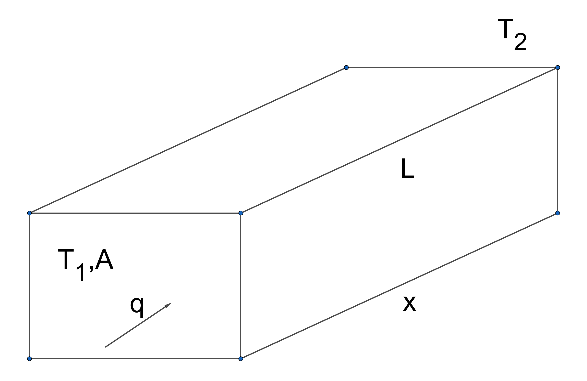
<figcaption>heat resistor</figcaption>
</figure>

From Fourier Law, 1D, steady state, no heat generation, $$\frac{q}{A_c}=q_x''=-k \pp{T}{x}$$ Integrate this and we get $$T(x)=\frac{-q}{A_ck}x+C_1$$ using BC condition $T(0)=T_1$ to fix $C_1$, get $$T(x)=\frac{-q x}{A_ck}+T_1   \qquad T_2=T(L)=\frac{-q L}{k A_c}+T_1$$ so we can compare $$T_1-T_2=q  \brack{\frac{L}{kA_c}}\qquad \leftrightarrow \qquad V_1-V_2=I
\brack{\frac{L}{\sigma A_c}}$$ we can let $L/(kA_c)$ to be the thermal resistance, $R_t$ in 1D, steady state and no gen. we will soon see familiar for cylinder shells and spherical shells.

Also works for convection, and radiation (applies simplification for $h_{rad}$), $$\tcbhighmath{R_{th,cond}=\frac{L}{kA_c}\qquad R_{th,conv}= \frac{1}{h A_s} \qquad R_{th,rad}=\frac{1}{h_{rad}A_s}}$$

\begin{examplebox}{Thermal circuit for verification}
 SS1D, no gen,
\begin{equation}
\pp{}{x} \brack{k\pp{T}{x}}=0 \quad\Rightarrow\quad  T(x)=c_1x+c_2
\end{equation}
B.C., $T(0)=T_1$, $-k\pp{T}{x}|_L=h(T_2-T_{\infty})$. So
\begin{equation}
c_2=T_1 \qquad -kc_1=h(c_1L+c_2-T_{\infty})
\end{equation}
the temperature dist is
\begin{equation}
T(x)= \frac{h(T_{\infty}-T_1)}{(k+hL)}x+T_1
\end{equation}
\tcblower
we can use thermal resistors to verify the answer.
\begin{equation}
R''=R_{cond}''+R_{conv}''=\frac{L}{k}+\frac{1}{h}\qquad q''=-k\pp{T}{x}=(T_1-T_{\infty})/R''
\end{equation}
\end{examplebox}

### Thermal Circuit with input heat flow

usually thermal circuits only apply to SS1D no gen. Think of a thin chip on a thick board, both side are cooled by fluids. There are contact resistence $R_{t,c}''$. There is also heat generation $q''_c$ uniformly distributed across the chip. We want to know the temperature. Using circuit.

<figure id="fig:chip">
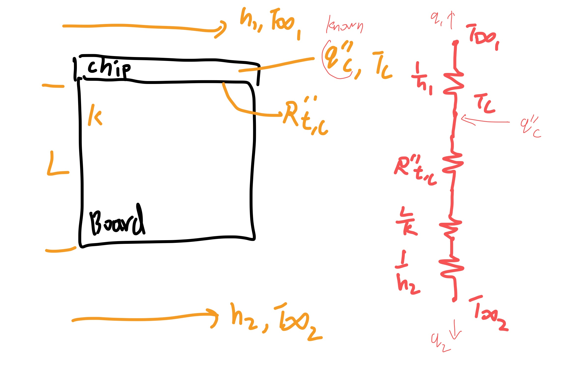
<figcaption>Thin chip on a board with heat generation</figcaption>
</figure>

first law: $$q_c''=q_1''+q_2''= \frac{T_c-T_{\infty,1}}{\frac{1}{h_1}}+\frac{T_c-T_{\infty,2}}{\frac{1}{h_2}+\frac{L}{k}+R_{t,c}''}$$ so the circuit theory can be extended to SS1D with gen

## surface energy balance

`\marginnote{Fig 1.9 of BLID7}`{=latex}. solid body contact with fluid.

<figure id="fig:3-2">
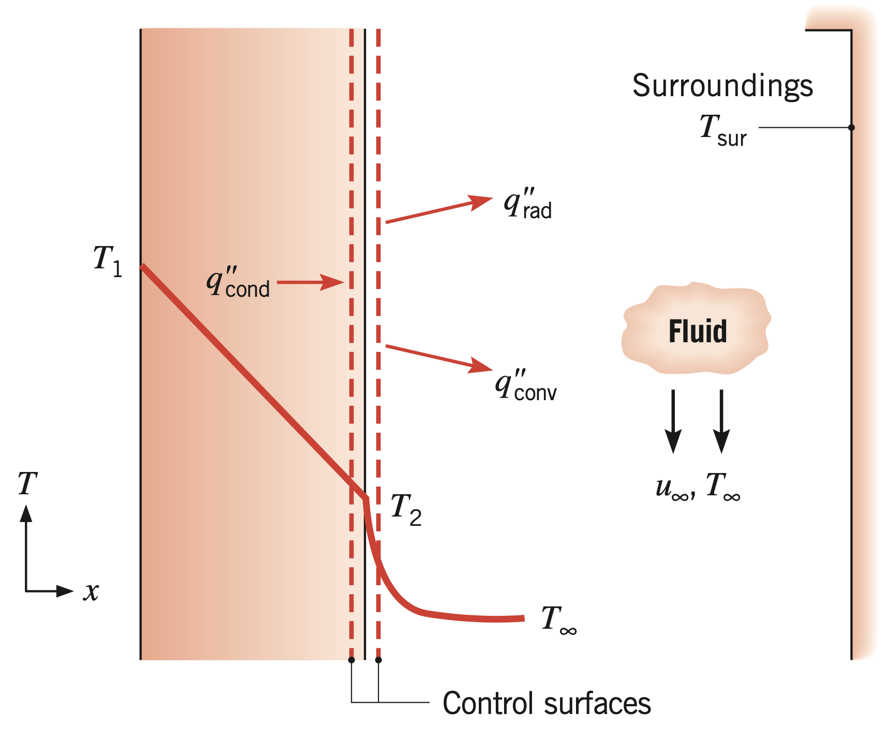
<figcaption>surface energy balance</figcaption>
</figure>

We focus on the solid side. Solid opaque inside so no radiation inside. First law of thermo: $$\dot{E}_{st}=\dot{E}_{in}-\dot{E}_{out}+\dot{E}_{gen}$$ on the $lhs$, without phase changing, $$\dot{E}_{st}=mC \pp{T}{t} \qquad m=\rho \d  A_c\Delta x$$ and $\dot{E}_{gen}$ can be divided into $$\dot{E}_{gen}=\dot{E}_{gen,V}'''\cdot\d A_c\cdot\Delta x +
\dot{E}_{gen,surf}'' \cdot \d A_c$$ and $$\dot{E}_{in}-\dot{E}_{out}=[q_{cond}''-q_{conv}''-q_{rad}'']\d A_c$$ cancel all $\d A_c$, $$\rho \Delta x C \pp{T}{t}=q_{cond}''-q_{conv}''-q_{rad}''+
  \dot{E}_{gen,vol}'''\Delta x+\dot{E}_{gen,surf}'''$$ take limit as $\Delta x\rightarrow 0$, then $$q_{cond}''=q_{conv}''+q_{rad}''-\dot{E}_{gen,surf}''$$

## the Heat Diffusion eqn.

\marginnote{section 2.3}

### General Diffusion equation

first law: $$\dot{E}_{in}-\dot{E}_{out}+\dot{E}_{gen}=\dot{E}_{st}$$ left 2 are on the surface.

No $\dot{m}\rightarrow$no enthalpy. No body work. Assume no phase change.

\begin{questionbox}{}
  Why enthalpy??

  ans: enthalpy is related with temperature and mass. we do not think mass change here. But enthalpy will be useful in case of convection (fluid).
\end{questionbox}

$$\dot{E}_{gen}=\dot{q} \d x \d y \d z \qquad \dot{E}_{st}=mc_p\pp{T}{t}$$ `\marginnote{For incompressible substance, like solid or liquid, $c_p=c_v=c$.}`{=latex} $E_{st}$ is the energy stored. For energy flow in and out in $x$ direction, $$\dot{E}_{in}=q_x(x)=-k \pp{T}{x}\bigg|_x \d y \d z \qquad \dot{E}_{out}=q_x(x+\d x)=-k \pp{T}{x}\bigg|_{x+\d x} \d y \d z$$ using taylor series, the net is $$\dot{E}_{in}-\dot{E}_{out}= -\pp{}{x} \brack{-k\pp{T}{x}\cdot(\d y \d z)}\d x=\pp{}{x} \brack{k\pp{T}{x}}\cdot (\d x\d y\d z)$$ along with other direcitons, from 1st law we have $$\label{eq:1}
  \pp{}{x} \brack{k_x\pp{T}{x}}+\pp{}{y} \brack{k_y\pp{T}{y}}+\pp{}{z} \brack{k_z\pp{T}{z}}+\dot{q}=\rho c\pp{T}{t}$$ e.g., carbon fiber have different $k_x,k_y,k_z$. But in this course we usually assume $k$ constant. Then $$\tcbhighmath{k\nabla^2 T+\dot{q}=\rho c_p \pp{T}{t}}$$ If there is no heat gen $\dot{q}$, define [thermal diffusivity]{.underline} $\alpha$, the equation is $$\pp{T}{t} =\alpha\nabla^2T \qquad\tcbhighmath{ \alpha\equiv \frac{k}{\rho c}}$$ If it is in steady state, SS, $$\nabla^2T=-\dot{q}/k$$ This is Poisson equation. If plus no generation, we get $\nabla^2T=0$, a Laplace equation.

### SS1D no gen

the heat equation simplify $$\pp{}{x} \brack{k\pp{T}{x}}=0 \quad\Rightarrow\quad \tcbhighmath{T(x)=c_1x+c_2}$$ Integrate and with temperature $T_1,T_2$ at $x=0,L$ we will get $$T(x)=\frac{T_2-T_1}{L}x+T_1 \qquad \frac{T(x)-T_1}{T_2-T_1}=\frac{x}{L}$$

### SS1D with gen

$$\pp{}{x} \brack{k \pp{T}{x}}+\dot{q}=0 \quad\Rightarrow\quad  \pp{^2T}{x^2}=-\frac{\dot{q}}{k} \quad\Rightarrow\quad  \tcbhighmath{T=-\frac{\dot{q}}{2k}x^2+c_1x+c_2}$$ similarily we get ($x=-L$ and $x=L$) $$T(x)=\frac{\dot{q}}{2k}(L^2-x^2)+\frac{T_2-T_1}{2} \frac{x}{L}+ \frac{T_2+T_1}{2}$$

### Different BCs

\marginnote{Section 2.4}

Dirichlet

:   : knowing the boundary temperature $T_s$, e.g., contact with boiling water or ice-water bath.

Neumann

:   : knowing the heat flux ($q$ or $\partial_xT$). e.g., friction, laser heating, thin film heaters.

Insulated

:   : $\partial_xT|_{x=0}=0$. The slope is zero.

Convection

:   : fluid flowing across the surface, there is convection. Knowing $T_{\infty},h$, `\newline `{=latex}$q_{conv}=h(T_{\infty}-T)$ $$-k\pp{T}{x} \bigg|_s=h(T_{\infty}-T)  \qquad -k\pp{T}{x}+h T=h T_{\infty}$$ a.k.a. Radiation B.C. in some older lit.

### BC Conversion by Symmetry

\marginnote{sec 3.5 fig 3.10 b/c}

Principles: more specific problem leads to straightforward solution. More general, complic solution. Symmetries make a problem more specific and easier.

Example: 1D plane wall, length $2L$, same convection boundary $h,T_{\infty}$, heat gen $\dot{q}(x)$. Given $\dot{q}(x)$ symmetry about MP, Find $T_0,T_s$.

Pick Coordinate system, since the physical system, B.C., Forcing ($\dot{q}(x)$) are all symmetry about $M.P.$, lets pick coordinate symmetry that way too. $$\ddn{T}{x}=- \frac{\dot{q}(x)}{k} \quad\Rightarrow\quad  T(x)= -\frac{1}{k}\int \int \dot{q}(x)\d x\d x+c_1x+q_2$$ To match book, let $\dot{q}=\const$. Need to fix $c_1$ and $c_2$. Three methods:

1.  most obvious: apply convection B.C at $x=\pm L$ $$-k\pp{T}{x}\bigg|_{x=L}=h (T(L)-T_{\infty}) \qquad -k\pp{T}{x}\bigg|_{x=-L}=-h(T(-L)-T_{\infty})$$ get $$-k \Brack{-\frac{\dot{q}L}{k}+c_1}=h \Brack{-\frac{\dot{q}L^2}{2k}+c_1L+c_2-T_{\infty}}$$

2.  Similar but further exploit symmetry. What does symmetry tell us about M.P.? Is $T$ kink, or say $q_x$ discontinuity allowed at $x=0$? Is inf. curvature OK? recall $\ppn{T}{x}=-\frac{\dot{q}}{k}$, as $\dot{q}$ is finite, so no kink. Then we have a new B.C., $\pp{T}{x}|_{x=0}=0$, which implies perfect insulation at $x=0$. $$\dd{T}{x}\bigg|_{x=0}=0 \quad\Rightarrow\quad  -\frac{\dot{q}x}{k}\bigg|_{x=0}+c_1=0$$

3.  Global view. Similar, but exploit global Energy cons. Recogn. all $\dot{E}_{gen}$ goes out by convection, $$\dot{E}_{gen}=\dot{q} L A_c \qquad \dot{E}_{out} =h A_c(T_s-T_{\infty})$$ $$\dot{E}_{gen}=\dot{E}_{out}\quad\Rightarrow\quad T_s= T_{\infty}+\frac{\dot{q}L}{h}$$ note $\dot{E}_{st}=0$ cuz steady state. Now we transformed BC at $x=L$ from $h$ to $T$, and can easily get $c_2$.

So we go BC from $h-h$ to $q-h$ then $q-T$.

### General Tools

1.  1st law -- be used to check answers, tracking $q$, $\dot{q}$ or $q_{gen}$ inputs to circuits B.C.

2.  Thermal circuit -- get $q$ and $T$ at the boundaries

3.  Integrating heat equation -- get complex $T(x)$, deal with volumetric gen, $q''$

## Contact resistence

Put a bootle on a podium,

<figure id="fig:botandpod">
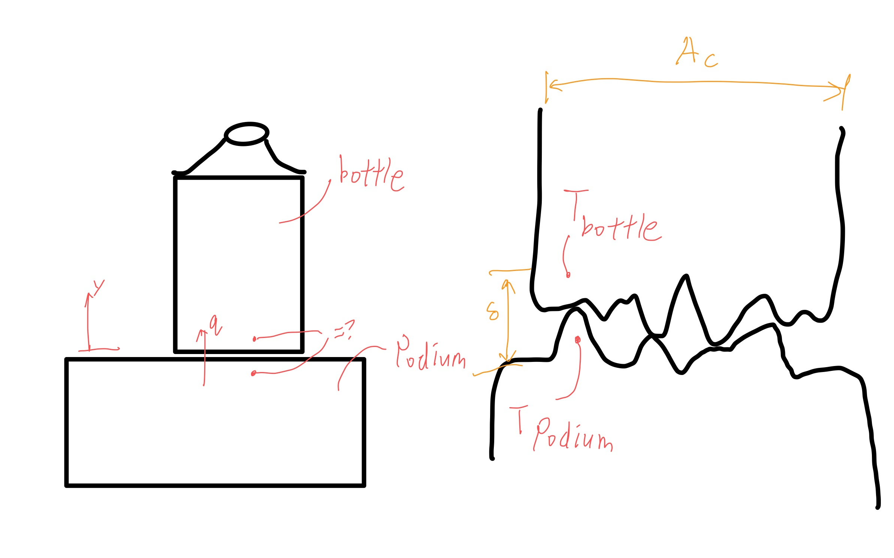
<figcaption>Is temperature same on the surface?</figcaption>
</figure>

Question: can we say $T_{bottle}(y=0^+)=T_{podium}(y=0^-)$? Actually, The air gap causes an extra $R_{th}$ $$T(0^-)-T(0^+)=q\cdot \frac{\delta}{kA_c}=qR_c$$ $R_c$ is the contact Resistence, and usually $\tcbhighmath{R_c\equiv R_c''/A_c}$. Typical air, $\delta=100\unit{\mu m}$, then $$R_c''=\frac{\delta}{k}= \frac{10^{-4}\unit{m}}{0.03\unit{W/mK}}=3\times 10^{-3} \unit{\frac{m^2K}{W}}$$

Methods to reduce $R_c''$:

1.  Smoother surfaces

2.  pressure, clamping

3.  interstitial fillers(grease, foil, pad)

4.  Macro intef? $10^{-4}\sim 10^{-6}$

5.  Epitaxial (atom intiwate?) $10^{-7}\sim 10^{-9}$ (metal-metal)

\marginnote{can skip section: 3.1.5,3.7,3.8,3.9}

## Cylindral and Spherical Systems

There are three approaches. Energy Conservation, Integrate the thermal resistence and Directly integrating.

### Energy Conservation

<figure id="fig:sphericalthermoresis">
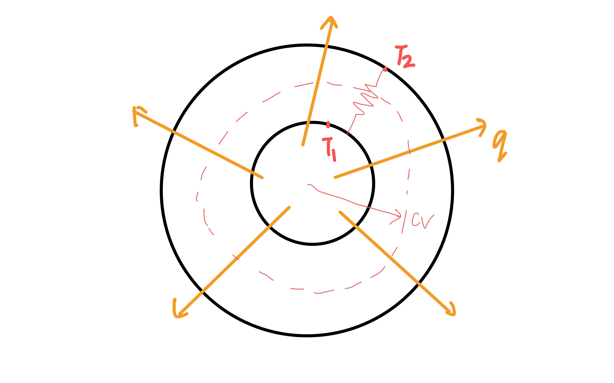
<figcaption>Cylindrical (bottom) and Spherical Thermoresistor</figcaption>
</figure>

Consider a control volume (a shell) at some arbitary $r_1<r<r_2$, $q$ is indepent of $r$. From F.L., we know $$q(r)=-k A_c(r)\dd{T}{r}$$ the $lhs$ is constant, but $A_c(r)=4\pi r^2$, so $\pp{T}{r}$ should be proportional to $r^{-2}$. $$\dd{T}{r}=-\frac{q}{4\pi k}\frac{1}{r^2}\quad\Rightarrow\quad T_2-T_1= \frac{q}{4\pi k } \brack{\frac{1}{r_1}-\frac{1}{r_2}}$$ so we can define $$R_{th,sph}= \frac{1}{4\pi k}\brack{\frac{1}{r_1}-\frac{1}{r_2}}$$ consider $r_2\rightarrow \infty$, even for walls $\infty$ thick, $R_{th}$ is still finite, at $(4\pi k r_1)^{-1}$`\marginnote{see also sec. 3.2 (An alt analysis)}`{=latex}

### Integrate Thermal Resistence

First calculate the thermal resistence of a thin shell $r\rightarrow r+\d r$ and then integrate it. As $\d r \ll r$, can neglect curvature effect. So $$\d  R_{th}= \frac{\d  r}{k(4\pi r^2)} \quad\Rightarrow\quad  R_{th}=\int_1^2\d R_{th}=\frac{1}{4k\pi} \brack{\frac{1}{r_1}-\frac{1}{r_2}}$$

### Direct Integrate Method

#### Cylindrical coordinates

$$\frac{1}{r}\pp{}{r} \brack{kr\pp{T}{r}}+\frac{1}{r^2}\pp{}{\phi} \brack{k\pp{T}{\phi}}+\pp{}{z} \brack{k\pp{T}{z}}+\dot{q}=\rho c\pp{T}{t}$$ SS1D, radial symmetry, the equation changes into $$\frac{1}{r}\pp{}{r} \brack{k r\pp{T}{r}}=0 \quad\Rightarrow\quad  \tcbhighmath{T(r)=c_1\ln r+c_2}$$ For temperature BC, exact expression is $$\tcbhighmath{T(r)= \frac{T_1-T_2}{\ln(r_1/r_2)}\ln \frac{r}{r_2}+T_2 }$$ For thermal resistor, $$q=-kA\pp{T}{r}=-k\cdot 2\pi r L\cdot \frac{T_1-T_2}{\ln (r_1/r_2)} \frac{1}{r}=-2\pi k L \frac{T_1-T_2}{\ln (r_1/r_2)}$$ $$\quad\Rightarrow\quad  R=\frac{T_1-T_2}{q}=\frac{1}{2\pi L k} \ln \frac{r_2}{r_1}$$

#### Spherical coordinates

$$\frac{1}{r^2} \pp{}{r} \brack{r^2\pp{T}{t}}+\pp{}{\phi} \text{stuff}+\pp{}{\theta} \text{stuff} +\frac{\dot{q}}{k}=\frac{1}{\alpha}\pp{T}{t}$$ turns into $$\frac{1}{r^2} \dd{}{r} \brack{r^2\dd{T}{r}}=0 \quad\Rightarrow\quad  \tcbhighmath{T=-\frac{c_1}{r}+c_2}$$ With B.C., $T(r_1)=T_1,T(r_2)=T_2$, $$\tcbhighmath{T=-\frac{T_1-T_2}{r_1-r_2} \frac{r_1r_2}{r}+\frac{T_1r_1-T_2r_2}{r_1-r_2}}$$ For the heat flux, use F.L., $$q=-kA\dd{T}{r}=k\cdot 4 \pi r^2 \frac{T_1-T_2}{\frac{1}{r_1}-\frac{1}{r_2}} \frac{1}{r^2}=4\pi k \frac{T_1-T_2}{\frac{1}{r_1}-\frac{1}{r_2}}$$ so the resistence is $$R_{th}= \frac{T_1-T_2}{q}= \frac{1}{4\pi k} \brack{\frac{1}{r_1}-\frac{1}{r_2}}$$

### Comparison In different coordinates

$$\tcbhighmath{q''=\frac{k\Delta T}{L} \text{(cartisian)} \quad \frac{k\Delta T}{r\ln(r_2/r_1)} \text{(cyl)} \quad \frac{k\Delta T}{r^2(r_1^{-1}-r_2^{-1})} \text{(sph)}}$$ $$\tcbhighmath{q=\frac{kA\Delta T}{L} \text{(cartisian)} \quad \frac{2\pi L k\Delta T}{\ln(r_2/r_1)} \text{(cyl)} \quad \frac{4\pi k\Delta T}{(r_1^{-1}-r_2^{-1})} \text{(sph)}}$$ $$\tcbhighmath{R_{th}=\frac{L}{kA} \text{(cartisian)} \quad \frac {\ln(r_2/r_1)}{2\pi L k} \text{(cyl)} \quad \frac{(r_1^{-1}-r_2^{-1})}{4\pi k} \text{(sph)}}$$

### Critical Insulation Thickness

\marginnote{ex 3.6}

Add cladding layer on the ext. of cyl. (finger, pipe, wire, \...). As $\delta$ goes up, what about $q$?

<figure id="fig:coating">
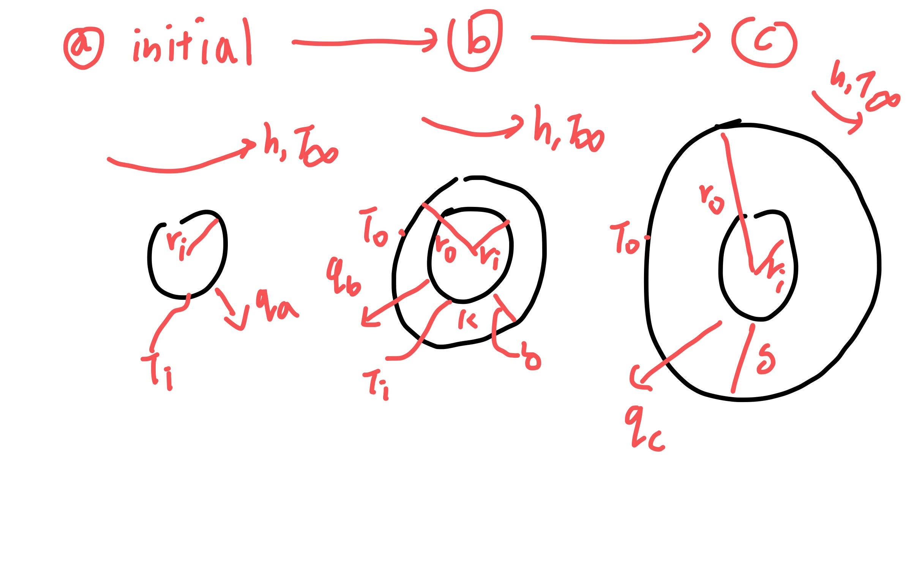
<figcaption>Add a layer to the cylinder, what will happen to <em>q</em>?</figcaption>
</figure>

the thermal resistence of cylinder is $\ln(r_0/r_i)/2\pi k L$, for the convection is $(h 2\pi r_0L)^{-1}$, $$\Delta T=qR=\frac{q}{L} RL=q'R' \quad\Rightarrow\quad  R'=RL=\frac{1}{2\pi k} \ln \frac{r_0}{r_i} + \frac{1}{2\pi r_0h}$$ Find minimum, $$\dd{R'}{r_0}=\frac{1}{2\pi k} \frac{1}{r_0}-\frac{1}{2\pi r_0^2h}\geq 0\quad\Rightarrow\quad  r_0\geq r_{0,crit}=\frac{k}{h}$$ There are 3 scenarios.

1.  $r_{0,crit}<r_i$ : big $h$, no minimum (physically).

2.  $r_i<r_{0,crit}<r_0$ : $r_0\uparrow R' \uparrow q\downarrow$

3.  $r_i<r_0<r_{0,crit}$ : $r_0\uparrow R' \downarrow q \uparrow$

Biot number, $$\frac{h r_i}{k_{solid}}=B_i$$ Not to confuse with Nuselt number $$Nu=\frac{h\cdot L_{char}}{k_{fluid}}$$

## Extended Sueface: Fins

<figure id="fig:fins">
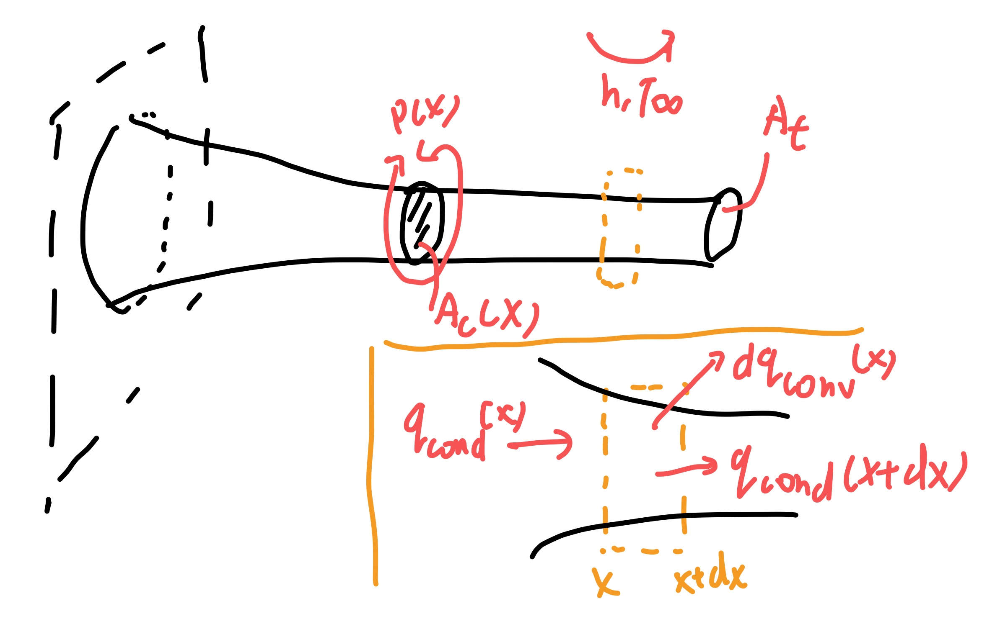
<figcaption>Fin with variable cross-sectional area</figcaption>
</figure>

With fins, heat convection surface turn into three part: (for uniform cross-sectional area fin case)the fin tip surface $A_c$, the fin side surface $P\cdot L$, the other bottom surface $A_o$. There are 3 convection resistors in parallel: $1/(hA_o),1/(hA_c),1/(hPL)$. For variable cross-secitonal area fin case, total $A_s=\int_0^LP(x)\d x$, plus tip $A_t$, total volume is $V=\int_0^LA_c(x)\d x$.

### Temperature Dist. Inside Fins {#sec:temp-dist.-inside}

In the control volume, energy balance : SS no gen $$\dot{E}_{in}=\dot{E}_{out} \quad\Rightarrow\quad  -\dd{q_{cond} }{x} \d x=hP(T-T_{\infty})\d x \qquad q_{cond}=-k\dd{T}{x}A_c$$ Note approxmately $T(x,y,z)\rightarrow T(x)$. Define excess $T$, $\theta=T-T_{\infty}$, $$\dd{}{x} \Brack{A_c\dd{\theta}{x}}-\frac{hP}{k}\theta=0 \quad\Rightarrow\quad \ddn{\theta}{x}+\frac{1}{A_c}\dd{A_c}{x}\dd{\theta}{x}- \frac{hP\theta}{kA_c}=0$$ Now start with uniform cross section $A_c=\const$, define $\tcbhighmath{m^2=\frac{hP}{kA_c}}$, $m^{-1}$ is the [fin length]{.underline}. The expression of $m$ shows competetion between convective and conductive heat transfer. $$\ddn{\theta}{x}-m^2\theta=0 \quad\Rightarrow\quad \tcbhighmath{\theta(x)=c_1\exp{mx}+c_2\exp{-mx}}$$ B.C, at the base, $x=0,T=T_b,\theta=\theta_b=T_b-T_{\infty}$. For tip at $x=L$, usually 4 options: temperature, adiabatic, convection, infinite long. $$T \qquad q=0 \qquad h \qquad L\rightarrow \infty$$

### Infinite long and Adiabatic Fins

Consider infinite long fin, need 2 BCs. At $x=0$, $\theta=\theta_b=T_b-T_{\infty}$, so $c_1+c_2=\theta_b$. For another BC, at $x=L$, $T=T_{\infty}$, so $\theta=0$. `\marginnote{or at least, $T$ is finite.}`{=latex} Hence $c_1=0$. So the solution is $$\tcbhighmath{\theta(x)=\theta_b\exp{-mx}} \qquad \tcbhighmath{T(x)=T_{\infty}+(T_b-T_{\infty})\exp{-mx}}$$ Now we want to know the heat rate. From F.L., $$q_f=-kA_c\dd{T}{x}\bigg|_{x=0^+}=mkA_c(T_b-T_{\infty})=\sqrt{hPkA_c}(T_b-T_{\infty})$$ It can be treated as thermal resistor, and it is put between $T_b$ and $T_{\infty}$. $$\tcbhighmath{q_f=M}\qquad \tcbhighmath{M=\sqrt{hPkA_c}\theta_b} \qquad \tcbhighmath{R_{fin}=\frac{1}{\sqrt{hPkA_c}}}$$ The heat flow into the fin must all go out by convection, no $q_{tip}$ since $T(\infty)=T_{\infty}$. $$q_f=\int_0^LhP(T(x)-T_{\infty})\d x =hP\int_0^{\infty}\theta_b\exp{-mx}\d x= \sqrt{hPkA_c}(T_b-T_{\infty})$$ For adiabatic at the end of fin, $\pp{\theta}{x}|_L=0$. The solution is `\marginnote{Table 3.4}`{=latex} $$\tcbhighmath{\theta=\theta_b \frac{\cosh m(L-x)}{\cosh mL} }\qquad \tcbhighmath{q_f=M\tanh mL} \qquad \tcbhighmath{R_f=\frac{1}{\sqrt{hPkA_c}\tanh mL}}$$ Note the value of $mL$, affects the value of $\tanh mL$, which shows for large $mL$, adiabatic fins can be treated as infinite long.

Otherwise, we may use [corrected length]{.underline} $L_c$ and use adiabatic tip condition if not specified. Corrected length, is approx a convection tip as some equivlent insulated tip fin. Choose $\Delta L$ s.t. $P\Delta L=A_c$, so $$\tcbhighmath{L_c=L+\frac{A_c}{P}= \frac{D}{4} \text{(cyl)} = \frac{ab}{2(a+b)}\approx \frac{a}{2} \text{(rec)}}$$

### Fin Performance

\marginnote{Surface efficiency Table 3.4, 3.5, Fig 3.19, 3.20}

#### Effectiveness

Fins are used for Cooling and Isolation. First when we determine whether we need to use fins, use [fin effectiveness]{.underline}, which measures the ratio of **total heat flux with and without fin**. $$\varepsilon_f = \frac{q_f}{h A_c\theta_b}= \frac{G_f}{G_{bare,area}} \qquad G=R^{-1}$$ we usually choose to use fin when $\varepsilon >2$, but usually $\varepsilon\rightarrow 1000$.

For infinite long fins, $q_f=\sqrt{hPkA_c}\theta_b$, effectiveness is $$\tcbhighmath{\varepsilon_f= \brack{\frac{k_fP}{hA_c}}^{1/2}}$$ Effectiveness in other condition all smaller than this, so we can focus on this. It tells that $k_f\uparrow,h\downarrow,P/A_c\uparrow$ lead to $\varepsilon_f\uparrow$.

#### Efficiency

Another parameter is [fin efficiency]{.underline}, which measures the ratio of **total heat flux with fin and with fin has uniform $\theta_b$**. $$\eta_f=\frac{q_f}{q_{max}}= \frac{q_f}{hA_f\theta_b}$$

### Fin Biot Number

Define [Fin characteristic thickness]{.underline} $\delta_c=A_c/P$, which represents some average distance the heat must flow in the transversely to escape the fin. We have been assuming $T_{cl}(x)=T_s(x)$, good enough if $$T_{cl}(x)-T_s(x)\ll T_s-T_{\infty}$$ For this $\d q$, this is equivlent to $R_{int}\ll R_{ext}$, $$\frac{\delta_c}{k\d x P}\ll \frac{1}{hP\d x}\quad\Rightarrow\quad  \frac{h\delta_c}{k}\ll 1$$ the $h\delta_c/k$ is called Fin Biot number.

<figure id="fig:finbiot">
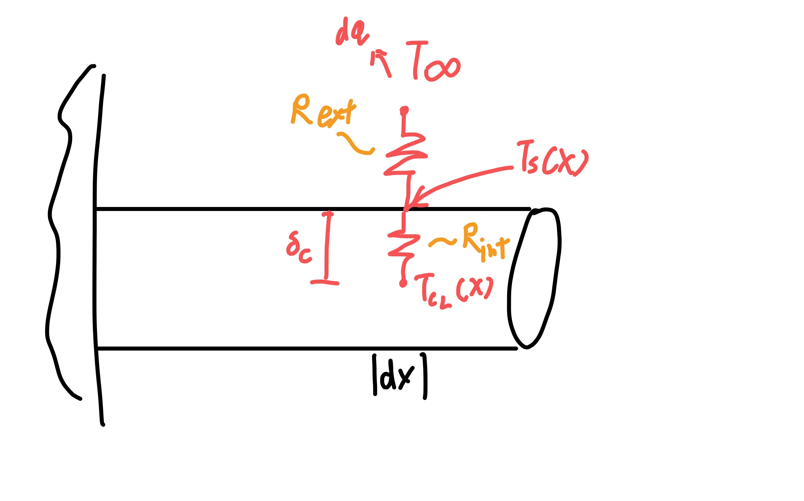
<figcaption>Fin Biot number and how can we ignore the internal resistence</figcaption>
</figure>

### Annular Fins

With similar approach in `\autoref{sec:temp-dist.-inside}`{=latex}, we can derive the governing equation for annular fins. With annular fin thickness $t$, inner and outer radius $r_1$, $r_2$, $$-\dd{}{r} \brack{-2\pi r t k\pp{T}{r}}\d r=2h\cdot 2\pi r \d r (T-T_{\infty}) \quad\Rightarrow\quad \ddn{\theta}{r}+\frac{1}{r}\dd{\theta}{r}-\frac{2h}{tk}\theta=0$$ define $m^2=2h/kt$, this equation is modified zero-order Bessel equation. The general solution and with base temperture $\theta_b$, adiabatic tip condition, solution is $$\theta(r)=c_1I_0(mr)+c_2K_0(mr)=\theta_b \frac{I_0(mr)K_1(mr_2)+K_0(mr)I_1(mr_2)}{I_0(mr_1)K_1(mr_2)+K_0(mr_1)I_1(mr_2)}$$ The heat flux is $$q_f=-2\pi r_1 t k \dd{\theta}{r}\bigg|_{r=r_1}=2\pi k m r_1 t \theta_b\lambda \qquad \lambda=\frac{K_1(mr_1)I_1(mr_2)-I_1(mr_1)K_1(mr_2)}{K_0(mr_1)I_1(mr_2)+I_0(mr_1)K_1(mr_2)}$$ Fin effectiveness and efficiency is $$\varepsilon_f=\frac{q_f}{h \cdot2\pi r_1 t\theta_b}=\frac{mk \lambda}{h}= \sqrt{\frac{2k}{ht}}\lambda \qquad \eta_f=\frac{q_f}{h\cdot 2\pi(r_2^2-r_1^2)}=\frac{2r_1 }{m(r_2^2-r_1^2)}\lambda$$

### Multiple Fins

To solve for fin resistor, use efficiency. If there are $N$ fins, over all fin efficiency, $$\eta_{all}=\frac{q_{all}}{q_{max}}=\frac{N\eta_f \cdot hA_f\theta_b+hA_o\theta_b}{h(A_o+N A_f)\theta_b}=\frac{N\eta_f A_f+A_o}{A_o+N A_f}$$ Define all surface area $A_t=NA_f+A_o=A_b+NPL_f$. $$\tcbhighmath{\eta_{all}=1- \frac{NA_f}{A_t}(1-\eta_f) }$$ And overall thermal resistor is $$\tcbhighmath{R_{all}=\frac{1}{\eta_o hA_t}}$$

Another approach is use parallel resistors. $$R_{all}= \brack{R_f^{-1}+R_o^{-1}}^{-1}= \brack{R_f^{-1}+hA_o}^{-1}$$

<figure id="fig:finarray">
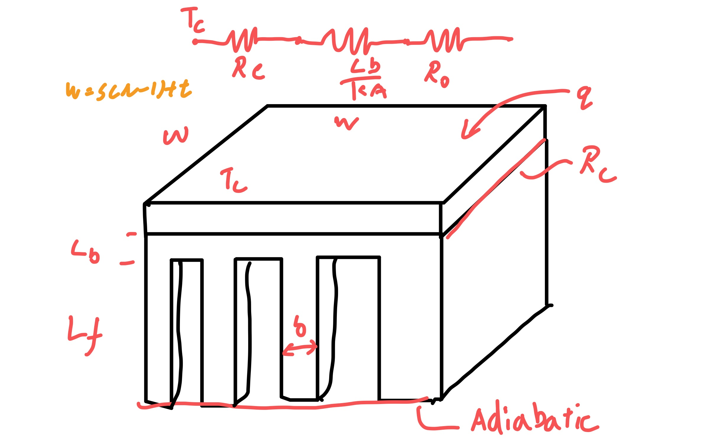
<figcaption>fins array</figcaption>
</figure>

# 2D+ Heat Conduction Equation

## 2D Heat Conduction Equation

$k$ is const. $$\nabla^2T+\frac{\dot{q}}{k}=\frac{1}{\alpha}\pp{T}{t}\quad \text{SS, no gen}\rightarrow\quad \nabla^2T=0$$ 2D case $$\ppn{T}{x}+\ppn{T}{y}=0 \qquad  \text{B.C.: } T(x=0)=T(x=L)=T(y=0)=T_1,T(y=w)=T_2$$ Solve using SOV`\marginnote{SOV refers to separation of variables}`{=latex}. Let $\theta= \frac{T-T_1}{T_2-T_1}$, try $\theta(x,y)=X(x)Y(y)$, plug into equation, get fourier series $$\theta=\sum_{n=1}^{\infty}c_n\sin \brack{\frac{n\pi x}{L}}\cdot \sinh \brack{\frac{n\pi y}{w}}$$ $\sin$ and $\cos$ where BCs are \"homogeneous", here $\theta=0$ for $x$. Fix $c_n$ from BCs and we have $\theta(x,y)$. `\marginnote{(Fig 4.3)}`{=latex}

## Shape Factor

Generally it is very diffifult to deal with 2D+ heat equations, but we can use [conduction shape factors]{.underline}, $S$, which is a method with existing solutions. Generally $$\tcbhighmath{q=Sk\Delta T}\qquad \tcbhighmath{R =\frac{1}{Sk}}$$ Different shape factors can refer to Tabel 4.1, page 236. Here we analyze a simple case qualitatively.

A cylinder in squred box. Given $D,w,L,k,T_1,T_2$, find $q_{1\rightarrow 2}$. By inspection, $q\propto L$, use $q'=q/L$ $$q'=f(D,w,k,T_1,T_2)$$ There are a lot of independent vars, how to collapse? Use dimensional analysis.

-   Rigorous: Buckingham $\Pi$ Theorem.

-   Seat-of-the-pants: $N$ variables, $M$ independent dimensions, $N-M$ dimensionless groups.

<figure>
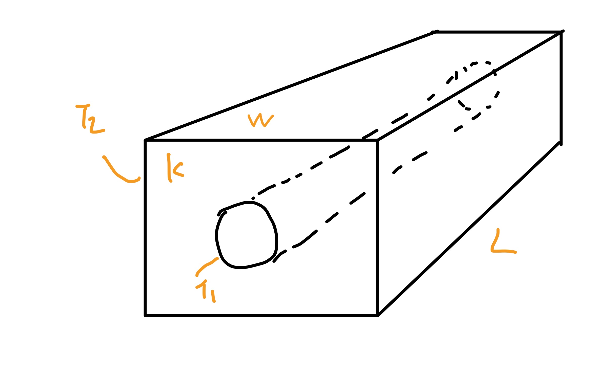
<figcaption>dimensional analysis of Circular cylinder centered in a square solid of equal length</figcaption>
</figure>

$$[q']= \mathrm{W/m} \quad [D]=[w]=\mathrm{m} \quad [k]= \mathrm{W/m\cdot K}\quad [T_1-T_2]=\mathrm{K}$$ It is easy to find $$\Brack{q' \frac{1}{k} \frac{1}{T_1-T_2}}=1 \qquad  \Brack{\frac{w}{D}}=1$$ So we know the form below must holds: $$\frac{q'}{k(T_1-T_2)}=f(w/D)=S'$$ it is a function of $w/D$ or a geometry param, shape factor $S$ for other cases. In the previous cylinder case, we actually have $$\frac{q}{k(T_1-T_2)}=S=\frac{2\pi L}{\ln (1.08\frac{w}{D})}$$ here we could have made a rough ones.

<figure id="fig:shapefac">
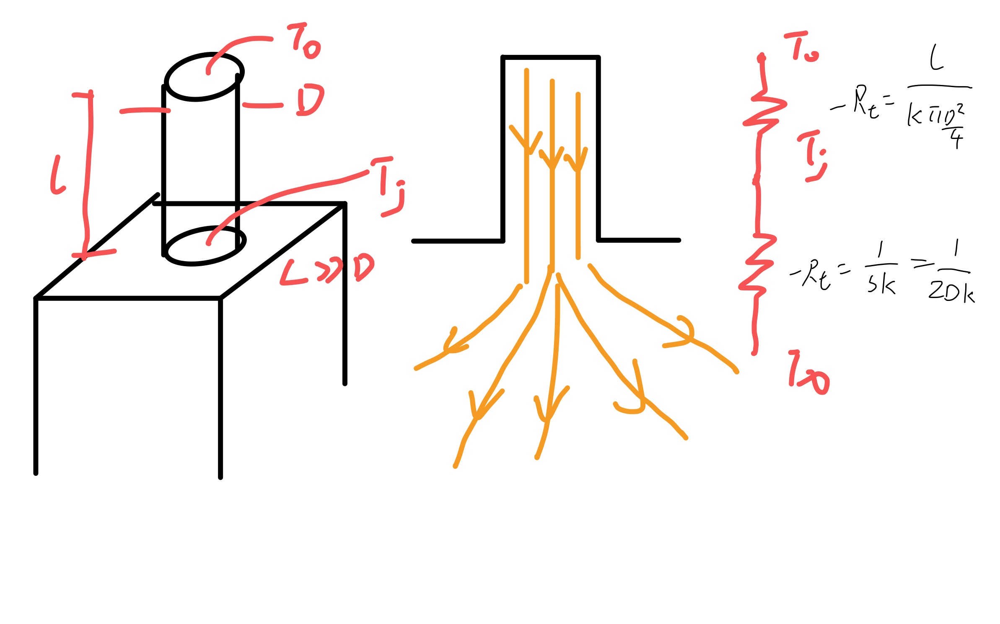
<figcaption>Shape Factor</figcaption>
</figure>

# Transient Analysis

## Quenching problem

<figure id="fig:quench">
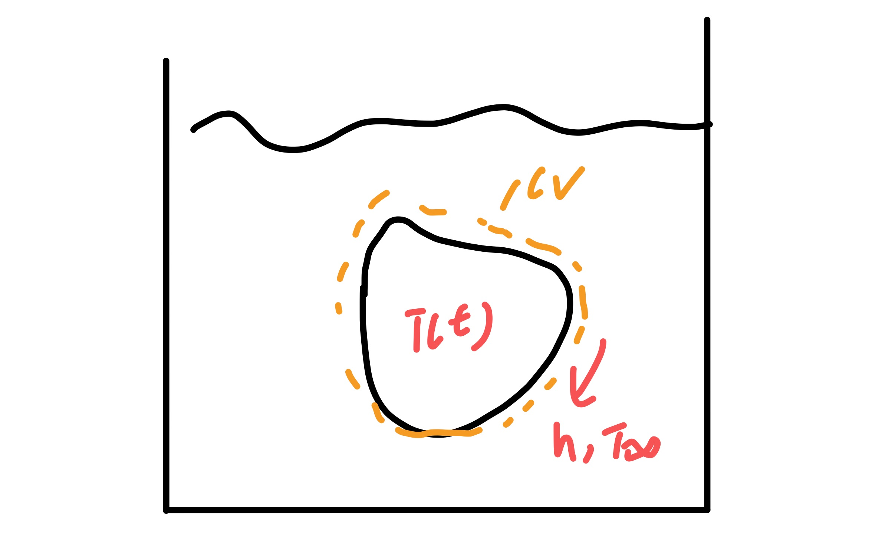
<figcaption>Quench some arbitary shape</figcaption>
</figure>

The quenching problem, put something with initial temperature $T_i$ into a fluid with uniform temperature $T_{\infty}$. Assume it keeps convection on the boundary, and assume spatially uniform $T$, $T(x,y,z,t)\rightarrow T(t)$ inside the body, i.e., there is no conduction inside. The latter assumption will be discussed later in `\autoref{sec:just-lump-assumpt}`{=latex}.

With 1st law, $$\underbrace{\dot{E}_{in}}_{=0}-\dot{E}_{out}+\underbrace{\dot{E}_{gen}}_{=0}=\dot{E}_{st}$$ $$\quad\Rightarrow\quad -hA_s(T(t)-T_{\infty})=\iiint (\rho \d V)c\dd{T}{t}$$ Let $\theta=T-T_{\infty}$, then $$\theta+R_tC_t \dd{\theta}{t}=0 \qquad R_t=\frac{1}{hA_s} \quad C_t=\iiint \rho c\d V=mc$$ where $C_t$ is body heat capacity. If $h,\rho,c$ all const, then get $$\tcbhighmath{\theta(t)=\theta_i\cdot \exp{-t/(R_tC_t)}=\theta_i\exp{-t/\tau_t} \qquad \tau_t=R_tC_t}$$ It can be treated as a RC circuit,

Relax condition, allow for $h=h(T),C_t=C_t(T)$, $$-\dot{E}_{out}=\dot{E}_{st} \qquad \frac{-\theta(t)}{R_t(T)}=C(T)\dd{T}{t}$$ using I.C. $\theta(t=0)=\theta_i$ still can get solution. But we can flip: know $C(T)$, measure $T(t)$, then determine $h(T)$.

## Justification of Lump assumption {#sec:just-lump-assumpt}

<figure id="fig:lump">
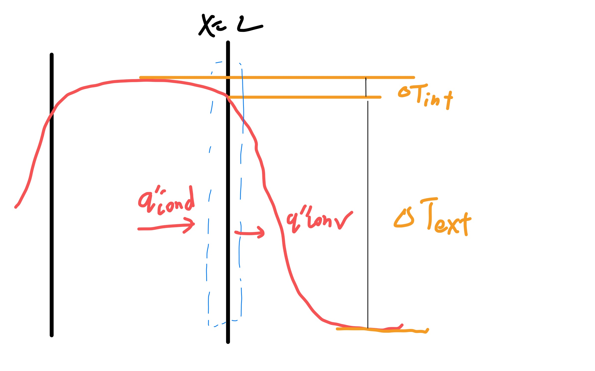
<figcaption>lumped: the different of temperature internally is far smaller than externally</figcaption>
</figure>

When is lumping justified? If lumped, $T(x,t)\rightarrow T(t)$. Intuitively, "lumped" when $\Delta T_{int}\ll \Delta T_{ext}$, qualitatively $k\uparrow,L\downarrow,h\downarrow$. Quantitatively, need to solve full PDE. $$q_{cond}''=-k\pp{T}{x}\bigg|_{L^-}\approx -k\dd[\Delta]{T_{char}}{x_{char}}=-k \frac{\Delta T_{int}}{L} \qquad q_{conv}''=h\Delta T_{ext}$$ want $\Delta T_{int}/\Delta T_{ext}\ll 1$ for lumped, $$\frac{q_{cond}'' L/k}{q_{conv}''/h}\quad\Rightarrow\quad \tcbhighmath{ \frac{h L}{k}=Bi\ll 1}$$ This is Biot number. So we can say when I. $\frac{\Delta T_{int}}{\Delta T_{ext}}\ll 1$ along certain direction, or usually II. $\frac{R_{int}}{R_{ext}}\ll 1$ along that direction, or also III. $Bi\ll 1$, we can neglect temperature $T$ gradient inside a body in a certain direction.

Often $R_{int}$ is conduction, $R_{conv}$ is convection, $Bi=h L_{char}/k_{solid}$, $L_{char}$ is of the $\Delta T_{int}$, often $V/A_s$. $$\frac{R_{in}}{R_{out}}=\frac{L/kA}{1/hA}=\frac{hL}{k}=Bi$$

## Spatial effects and Exact Solution

If not lumped, then there will be spatial effects.

<figure id="fig:spatial">
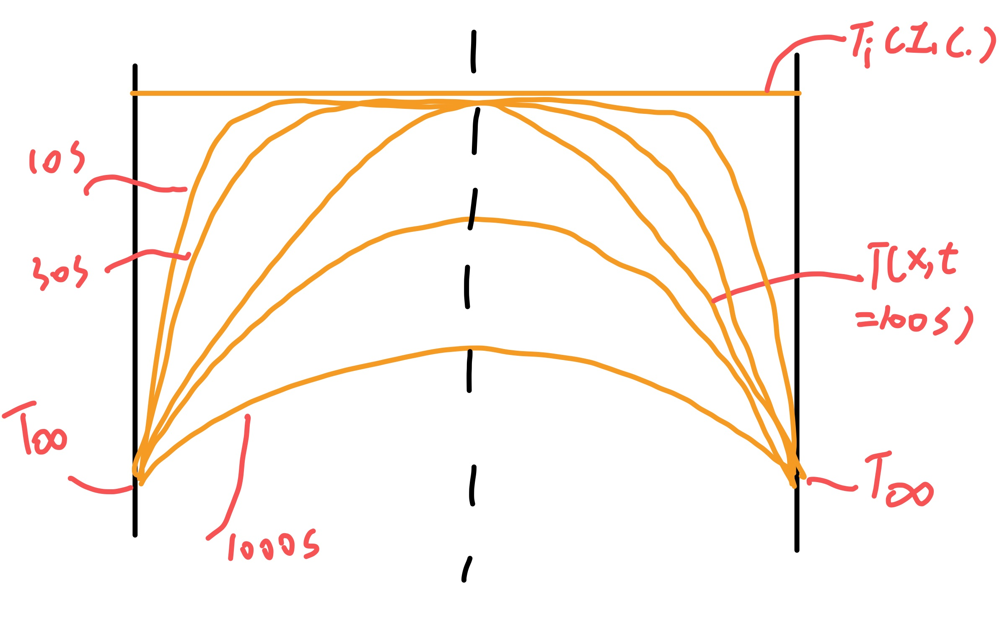
<figcaption>spatial effects, not lumped. See fig 5.4</figcaption>
</figure>

`\marginnote{refer to section 5.4 and 5.5 in BILD 7}`{=latex} Solve PDE for exact solution, $$\text{I.C. } T(x,0)=T_i \qquad \text{B.C. } T(L)=T_{\infty} \quad \text{sym. } \pp{T}{x}\bigg|_0=0$$ Define $$\theta^{*}=\frac{\theta}{\theta_i}=\frac{T-T_{\infty}}{T_i-T_{\infty}} \qquad x^{*}=\frac{x}{L}\qquad t^{*}=\frac{t}{t_{char}} \qquad t_{char}= \frac{L^2}{\alpha}$$ $t^{*}=\alpha t/L^2=Fo$ is [Fourier number]{.underline}. $t_{char}$ is the timescale for diffusion. The equation becomes $$\ppn{\theta^{*}}{(x^{*})}=\pp{\theta^{*}}{t^{*}} \qquad \text{I.C. }\theta^{*}=1 \qquad \text{B.C. }\theta^{*}|_{x^{*}=1}=0 \quad \pp{\theta^{*}}{x^{*}}\bigg|_{x^{*}=0}=0$$ Using SOV, the solution is $$\theta^{*}(x^{*},t^{*})=\sum_{n=1}^{\infty}c_n\exp{-\xi_n^2t^{*}}\cos(\xi_nx^{*}) \qquad c_n=\frac{2(-1)^{n+1}}{\xi_n}\qquad \xi_n= \brack{n-\frac{1}{2}}\pi$$ we want to find a time when the term 1 is much larger than term 2 so we can make approximation. Namely, we want $$\frac{c_2\cos(\xi_2x^{*})\exp{-\xi_2^2t^{*}}}{c_1\cos(\xi_1x^{*})\exp{-\xi_1^2t^{*}}}\leq \epsilon=0.1$$ $c_2/c_1$ and $\cos$ terms all have ratio $\sim 1$, so only exponential term affects. $$\exp{t^{*}(\xi_1^2-\xi_2^2)}\leq \epsilon \quad\Rightarrow\quad  t^{*}\geq  \frac{\ln \epsilon^{-1}}{ \brack{\frac{3\pi}{2}}^2- \brack{\frac{\pi}{2}}^2}=0.117$$ So for $Fo\geq 0.117$, the 2nd term is less than $1/10$ of 1st term, where $t\geq 0.117\cdot L^2/\alpha$.

\begin{mybox}{General sense of heat conduction rate}
 Time for heat to diffuse a distance $L$: $t\approx L^2/\alpha$; Also in a time $t$ heat can diffuse $\delta_p\approx \sqrt{\alpha t}$.

We can say ``short time'', when thermal penetration depth $\delta_p\ll L$, slab acts as infinitely thick. ``Long time'', $\delta_p$ reaches $L$.
\end{mybox}

## Semi-infinite Problem

Quench $T_s$ on the surface of a semi-infinite body with initial temperature $T_i$. `\newline `{=latex}I.C. $T(x,0)=T_i=200\degC$, B.C. $T(0,t)=T_s=20\degC$ Define $\delta_p(t)$ to be the length where $$T_i-T(\delta_p(t))=\frac{1}{10} (T_i-T_s) \quad\Rightarrow\quad  T(\delta_p(t))=182\degC$$

### Dimensional Analysis

D.A. for $\delta_p(t)$, $\delta_p(t)$ may be a function of $k,T_i-T_s,c,t,\rho$,\...`\marginnote{no $L$ since this is a semi-infinite case}`{=latex} Pick $k,\alpha$ out of $k,\rho c,\alpha,k\rho c$. $$[\delta_p]=\mathrm{m}\qquad [k]=\mathrm{W/m\cdot K} \qquad [\alpha]= \mathrm{m^2/s} \qquad [T_i-T_s]= \mathrm{K} \qquad[t]=\mathrm{s}$$ We can't eliminate $[W]$ so $k$ can't matter here! For same reason, $T_i-T_s$ will also drop out. It's easy to see $\delta_p\sim \sqrt{\alpha t}$.

### Scaling

use governing equation, estimate magnitude of various terms `\marginnote{See Bejan, Convection PDF}`{=latex} $$\ppn{T}{x}= \frac{1}{\alpha} \pp{T}{t}$$ Use straight line to approx $\exp{-x}$ curve, average slope `\marginnote{here $T(\delta_p)$ is set to be $T_i$ for approximation}`{=latex} $$\overline{m}= \frac{T(\delta_p)-T(0)}{\delta_p-0}=\frac{T_i-T_s}{\delta_p}$$ next we need $$\ppn{T}{x}\approx \pp{\overline{m}}{x}\approx \frac{\overline{m}(\delta_p)-\overline{m}(0)}{\delta_p-0}\approx -\frac{2 \overline{m}-0.3\overline{m}}{\delta_p}=-\frac{1.7 \overline{m}}{\delta_p}=-1.7\frac{T_i-T_s}{\delta_p^2}$$ Next, deal with $\pp{T}{t}$. $$\pp{T}{t}\approx  \frac{T(\delta/2,t)-T(\delta/2,0)}{t-0}=\frac{(T_i+T_s)/2-T_i}{t}=-\frac{T_i-T_s}{2t}$$ Put them into heat equation, $$-1.7\frac{T_i-T_s}{\delta_p^2}=-\frac{1}{\alpha}\frac{T_i-T_s}{2t} \quad\Rightarrow\quad  \delta_p^2\sim \alpha t$$ Then estimate heat flux. By F.L., $$q_s''(t)=-k\pp{T}{x}\bigg|_{0^+}\approx -k \frac{T_i-T_s}{\delta_p(T)}=-\frac{k(T_i-T_s)}{\sqrt{\alpha t }}$$ Exact solution `\marginnote{eq 5.61}`{=latex} is $\pi^{-1/2}$ times this.

### Exact Solution: Similarity

A key step is to introduce a similarity variable $\eta=\frac{x}{\sqrt{4\alpha t}}$. Define dimensionless temperature $\theta^{*}=\frac{T-T_s}{T_i-T_s}$, $$\theta^{*}(x,t)=\frac{2}{\sqrt{\pi}}\int_0^{x/\sqrt{4\alpha t}}\exp{-u^2}\d u$$ The $rhs$ function is known as Gaussian error function erf.

## Discussion

$$\frac{\theta}{\theta_i}= \operatorname{exp} \brack{-\frac{hA_s}{\rho Vc}t}$$ $Bi=hL_c/k$, $$\frac{hA_st}{\rho V c} \frac{kL_c}{kL_c}= \frac{hL_c}{k} \frac{k}{\rho c}\frac{A_s}{V} \frac{1}{L_c}= Bi \frac{\alpha t}{L_c^2}$$ so $$\frac{\theta}{\theta_i}=\exp{-Bi\cdot Fo}$$ To deal with transient problem, first look at $Bi$, if $Bi<0.1$, use L.C.; if $Bi>1$, look at $Fo$. If $Fo>0.2$, single term approx. If $Fo<0.2$, then it is difficult.

# Convection

## Boundary Layer

Flow $T_{\infty}=300 \unit{K}$, two square-sectional blocks with edge length $2l$ and $l$. At steady state, the $2l$ has a $10\unit{W}$ heater inside, what about the $l$ one? $\sim 10 \unit{W}$. Though the perimeter of the $2l$ is the double of the $l$ block. This is because of the boundary layer.

<figure>
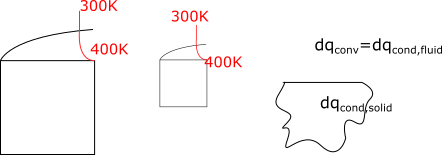
<figcaption>Convection boundary</figcaption>
</figure>

In the thermal boundary layer, it works like conduction. $$\d  q_{conv}=\d q_{cond,fl} \quad\Rightarrow\quad  h \d A(T_s-T_{\infty})=-k_f\d A\pp{T_f}{y}\bigg|_{0^+}$$ so $$h=\frac{-k_f\pp{T_f}{y}\bigg|_{0^+}}{T_s-T_{\infty}}\sim -k_f \frac{T_{\infty}-T_s}{\delta}/(T_s-T_{\infty})=\frac{k_f}{\delta}$$ For laminar flow, the ratio of the thickness of BL of $2l$ block and $l$ block is $\sqrt{2}$, so the $h$ for $l$ block is $\sqrt{2}$ times of that. In the end, $$q_{l}=\frac{l}{2l}\frac{h_l}{h_{2l}}q_{2l}\approx=7.07\unit{W}$$

Typical procedure of convection problem to get $h$. For a given flow config, solve $u(x,y)$ then solve $T(x,y)$. Evaluate $T(t=0^+)$ and $\pp{T}{y}(0^+)$, calculate $h$ , also may prefer average. $$h(x)=-\frac{k_f\pp{T}{y}|_{y=0^+}}{(T(0^+)-T_{\infty})} \qquad \overline{h}=\frac{1}{L}\int_0^Lh(x)\d x$$ Dimensionless number [Nusselt]{.underline} $$Nu_x=\frac{hx}{k_f} \qquad \overline{Nu_L}= \frac{\overline{h}L}{k_f}$$

\begin{mybox}{Taxonomy}
Convection can be
  \begin{itemize}
  \item Internal or External
  \item Laminar or Turbulant
  \item Forced or Free
  \item Single phase or 2-phase
  \item Compressible or Imcompressible
  \end{itemize}
\end{mybox}

Boundary Layer is a very thin transition region between far-field and surface. Key physic is

-   Hydrodynamic: $$\pp{u}{y}\bigg|_{0^+}\sim \frac{U_{\infty}}{\delta} \quad\Rightarrow\quad  \tau_s\sim \frac{\mu U_{\infty}}{\delta}$$

-   Thermal: $$\pp{T}{y}\bigg|_{0^+}\sim \frac{T_{\infty}-T_s}{\delta_T}\quad\Rightarrow\quad  h\sim \frac{k_f}{\delta_T}$$

Define $$Nu_x=\frac{h_x\cdot x}{k_f}\sim \frac{k_f}{\delta_t}\cdot \frac{x}{k_f}=\frac{x}{\delta_T}$$ Where Nusselt number can be treated as dimensionaless $h$.

## Deriving the Energy Equation

Define dimensionless $x^{*}=x/L$. Conditions: **Laminar, Single phase, Incompressible**. $\rho$ is const, $c_p=c_v=c$. $$\dot{E}_{in}+\dot{E}_{gen}=\dot{E}_{out}+\dot{E}_{st}$$ where $$\dot{E}_{gen}=\dot{q}_{gen}\d x\d y\d z\qquad \dot{E}_{st}=\dd{}{t}(\rho cT)\d x\d y\d z$$ $\dot{E}_{in}$ and $\dot{E}_{out}$ are measured by $\dot{m}$ times enthalphy. In the $x$-dir, $$\dot{E}_{in}=\dot{m} h_{in} \bigg|_x= \Brack{\rho \Delta y \Delta z u \cdot cT}_x\qquad \dot{E}_{out}=\dot{m}h_{out} \bigg|_{x+\d x}$$ Net in is $$\dot{E}_{in}-\dot{E}_{out}=-\pp{}{x} \Brack{\rho\Delta y\Delta z u c T}\Delta x$$ Similarily, in $y$ and $z$ dir. So totally $$\dot{E}_{in}-\dot{E}_{out}=\nabla \cdot (\rho u cT)\d  x\d  y\d  z$$ `\marginnote{Viscous effect become infortant like glass flow where viscosity is large, or hypersonic flow where velocity is very high.}`{=latex} Combine them together, $$\rho c (u\cdot \nabla T)=k\nabla^2T+\dot{q}_{gen}+\mu \Phi$$ $$u\cdot \nabla T=\alpha \nabla^2T+\frac{\dot{q}_{gen}}{\rho c}+\frac{\mu}{\rho c}\Phi$$ Using boundary layer simplification, $u\gg v$, $\pp{}{y}\gg \pp{}{x}$, $\ppn{}{y}\gg \ppn{}{x}$, ignore $\Phi$. $$u\cdot\nabla T=\alpha\ppn{T}{y}+\frac{1}{\rho c} \dot{q}_{gen}$$ This is energy equation. For momentum equation, in the boundary layer, assume $\pp{P}{x}\approx \dd{P_{\infty}}{x}\approx 0$. $$u\cdot \nabla u=\nu \ppn{u}{y}-\frac{1}{\rho}\dd{P_{\infty}}{x}$$ Concentration, $$u\cdot \nabla C_A=D_{AB}\ppn{C_B}{y}$$`\marginnote{$D_{AB}$ is diffusivity of A in B}`{=latex}

\begin{mybox}{Raynolds Analogy}
  Neglecting $\pp{P_{\infty}}{x}, \Phi, \dot{q}_{gen}$, and $\alpha\approx\nu\approx D_{AB}$, then
\begin{equation}
u\cdot\nabla \phi=D\ppn{}{y} \qquad \phi=u^{*},T^{*},C_{AB}^{*}
\end{equation}
Analogous BCs, $\tau,h,h_m$ replate to $\pp{\phi}{y}|_{0^+}$
\end{mybox}

$$Pr=\frac{\nu}{\alpha}\qquad Sc=\frac{\nu}{D_{AB}} \qquad Le=\frac{\alpha}{D_{AB}}$$ Prandtl number, gas 0.6-1.0, oils, $10^2$-$10^5$, liquid met, $10^{-2}$.

## Scaling analysis

For $Pr\gg 1$ $$\delta\sim L \cdot Re_L^{-1/2}$$ $$\delta_T\sim L Re_L^{-1/2}Pr^{-1/3}$$

# Discussion {#discussion-1 .unnumbered}

In the boundary layer, this should always be hold: $h\downarrow$, $q_s''\downarrow$ with $x\uparrow$.

\begin{mybox}{Approach}
\begin{enumerate}
\item Geometry
\item Ref. temperature to evaluate fluid props. $T_f=(T_s+T_{\infty})/2$
\item Reynolds number, decide laminar or turbulent
\item local or average
\item Find correlation
\item $q=h(\Delta T)$
\end{enumerate}
\end{mybox}
\begin{examplebox}{}
  $T_{\infty}=300\deg , T_s=27\deg$.
  \begin{enumerate}
  \item first flat plate $L$,
  \item second $T_f=(T_s+T_{\infty})/2$, get all air properties at this $T_f$.
  \item find $Re=9597<5\times 10^8$, so laminar
  \item Use average $h\rightarrow \overline{h}$
  \item Correlation, $\overline{Nu}=0.664Re^{1/2}Pr^{1/3}$, then $\overline{h}= \overline{Nu}k_f/L$
\end{enumerate}
\end{examplebox}

## Turbulence

Transition: $Re_{x,c}\sim 10^5 - 3 \times 10^6$. Generally take $5\times 10^5$. `\marginnote{Example 7.1 page 447}`{=latex}

## Internal flow

Bulk mean velocity, enforce same $\dot{m}$, $$\dot{m}=\int \rho u \d A_c=\rho u_m A_c \quad\Rightarrow\quad  u_m=\frac{1}{\rho A_c}\int \rho u \d  A_c=\frac{\int \rho u \d A_c}{\int \rho \d A_c}$$ For Raynolds Number, use $u_m$ $$Re=\frac{\rho u_m D}{\mu}=\frac{4\dot{m}}{\pi D \mu} \quad \text{(for round tube)}$$ Similar Bulk mean temperature. Enforce unifrom transport of enthalphy. $$\dot{E}=\int \rho u c_p (T-T_{ref}) \d A_c=\dot{m} c_p(T_m-T_{ref}) \quad\Rightarrow\quad  T_m=\frac{\int \rho u c_p(T-T_{ref})\d A_c}{\int \rho u c_p \d A_c}+T_{ref}$$ For round tubes, $$T_m=\frac{2}{u_mr_0^2}\int_0^{r_0}u T r\d  r$$

### Overall energy balance

<figure id="fig:overallenergybal">
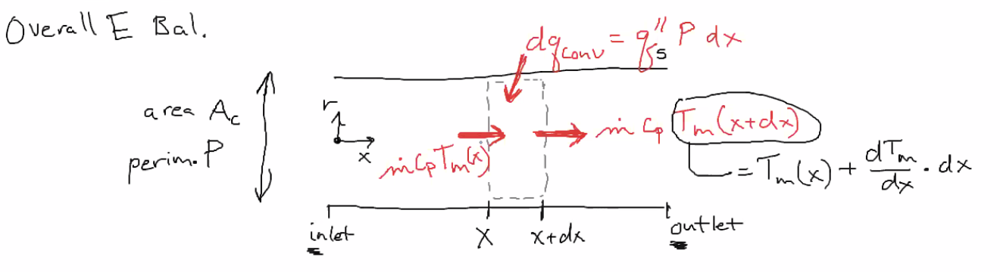
<figcaption>Overall energy balance</figcaption>
</figure>

Combine them we get $$q_s''P \d x=\dot{m} c_p \dd{T_m}{x}\d x \quad\Rightarrow\quad \dd{T_m}{x}=\frac{q_s''P}{\dot{m}c_p}$$ also express as $$q_s''=h(T_s-T_m)$$ which defines $h$ for internal convection. So $$\tcbhighmath{\dd{T_m}{x}=\frac{h P(T_s(x)-T_m(x)}{\dot{m} c_p}}$$`\marginnote{eq 8.37 BLID}`{=latex}

\begin{mybox}{Different regimes}
  \begin{description}
  \item[Fully developed] $u$ is not a function of $x$,
\begin{equation}
\frac{x_{fd}}{D}\sim 0.05 Re_D \qquad Re_D=\frac{\rho u_m D}{\mu}
\end{equation}
\item[Thermal FD] with constant $q_s''$, there can not be $\pp{T}{x}=0$. But under consant $q_s''$ and $T_s$, the term
\begin{equation}
\frac{T_s(x)-T(r,x)}{T_s(x)-T_m(x)}
\end{equation}
does not depend on $x$.
\begin{equation}
\pp{}{r} \frac{T_s-T}{T_s-T_m}=\frac{-\pp{T}{r}}{T_s-T_m}
\end{equation}
\begin{equation}
q_s''=k \pp{T}{r}\bigg|_{r=r_0}=h\Delta T
\end{equation}
so $h$ is not a function of $x$
  \end{description}
\end{mybox}

### Constant Heat flux

Constant $q_s''$,`\marginnote{e.g., wrapped electric heater}`{=latex} $q_{conv}=q_s''PL$, also $q_{conv}=\dot{m}c_p(T_{mo}-T_{mi})$ $$\dd{T_m}{x}=\frac{q_s''P}{\dot{m}c_p}=\frac{P}{\dot{m}c_p}h(T_s-T_m)$$ $$T_m(x)=\frac{q_s''P}{\dot{m}c_p}x+T_{mi}$$ In FD, $T_s-T_m$ is constant.

<figure>
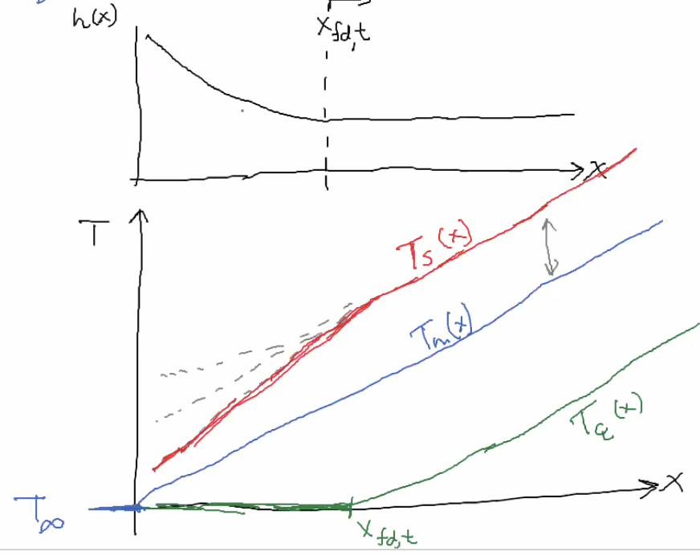
<figcaption>Surface, mean and centerline temperature</figcaption>
</figure>

Near the entry, as $h\sim k/\delta$, smaller $\delta$ leads to larger $h$. And as $q_s''=h(T_s-T_m)$, larger $h$ indicates smaller $T_s-T_m$.

\begin{examplebox}{}
  Air flow in tube, $q_s''$ is constant, $T_{si},T_{so},T_{mi},T_{mo}$, find $q_{conv},T_{mo},T_{si},T_{so}$. Sketch $T_m(x)$. \tcblower

\begin{equation}
q=q_s''PL=q_s''\pi DL=q_{conv}
\end{equation}
outlet:
\begin{equation}
q=\dot{m}c_p(T_{mo}-T_{mi}) \quad\Rightarrow\quad  T_{mo}=\frac{q_s''\pi D L}{\dot{m}c_p}+T_{mi}
\end{equation}
surface:
\begin{equation}
q_s''=h(T_{si}-T_{mi})\quad\Rightarrow\quad  T_{si}=T_{mi}+\frac{q_s''}{h}
\end{equation}
\begin{equation}
T_{so}=\frac{q_s''\pi D L}{?}
\end{equation}
\end{examplebox}

### Constant Surface Temperature

Define local $\Delta T(x)\equiv T_s-T_m(x)$, $$-\dd{}{x} \Delta T=\frac{hP}{\dot{m}c_p}\cdot\Delta T$$ Integrate $x$ from $0$ to $L$, where $L$ is the length of pipe, and get $$\Delta T= \Delta T_i\exp{-\frac{\overline{h}_LPL}{\dot{m} c_p}} \qquad \overline{h}_LL=\int_0^Lh\d x$$ or $$\Delta T_o=\Delta T_i \exp{-L/L_c} \qquad L_c=\frac{\dot{m}c_p}{\overline{h}_LP}$$ special case $h$ is constant, the temperature will exponentially reach $T_s$.

Simpler if cound write $q_{conv}=hA_s\Delta T$, from 1L $$q_{conv}=\dot{m}c_p(T_{mo}-T_{mi})=\dot{m}c_p(\Delta T_i-\Delta T_o)=\overline{h}_LPL\frac{\Delta T_o-\Delta T_i}{\ln \frac{\Delta T_o}{\Delta T_i}}$$ Where we see Logarithmic average of temperature $\Delta T_{lm}$. Also, $q_{conv}=\dot{m}c_p(T_{mo}-T_{mi})$, so $$\overline{h}=\frac{\dot{m}c_p}{PL}\Delta T_{lm}$$

Powerful generalization, tube wall thickness $t_w$, consant outer flow $T_{\infty},h_0$, $$q=\overline{U}PL \Delta T_{lm}$$ e.g., if thin tube $t_w\ll r_0$, can show $$\frac{1}{U(x)}=\frac{1}{h_0(x)}+\frac{t_w}{k_w}+\frac{1}{h_L(x)}$$

## Exact solutions

Laminar flow in tube, fully developed. No body force $$u\pp{u}{x}+v\pp{u}{r}=\nu \ppn{u}{x}+\nu \frac{1}{r}\pp{}{r} \brack{r\pp{u}{r}}-\frac{1}{\rho }\dd{p}{x}$$ FD, $\pp{u}{x}=0$, $v=0$, $\ppn{u}{x}=0$, which is Hagen Poiseuille flow `\marginnote{eq 8.15}`{=latex} $$u(r)=2u_m \brack{1- \brack{\frac{r}{r_0}}^2}$$ Thermal PDE, $$u\pp{T}{x}+v\pp{T}{r}=\alpha\ppn{T}{x}+\alpha \frac{1}{r}\pp{}{r} \brack{r\pp{T}{r}}+ \frac{\mu}{\rho c} \Phi +\frac{\dot{q}}{\rho c}$$ where $v=0$, $\Phi=0$, $\dot{q}=0$, $\ppn{T}{x}$ is negligible compared to radial convection. finally we find $$u\pp{T}{x}=\frac{\alpha}{r} \brack{r\pp{T}{r}}$$

Solve for constant $q_s$, know $$\pp{T}{x}=\dd{T_m}{x}=\frac{q_s''P}{\dot{m}c_p}=\const$$ PDE for $T(x,r)$, $u(x,r)$ already known, $$\frac{1}{4\mu} \brack{-\dd{P}{x}} r_0^2 \Brack{1- \brack{\frac{r}{r_0}}^2}\dd{T_m}{x}=\frac{\alpha}{r}\pp{}{r} \brack{r\pp{T}{r}}$$ define $$a=\frac{1}{4\mu} \brack{-\dd{P}{x}}r_0^2\dd{T_m}{x}\alpha=\frac{2 u_m}{\alpha r_0^2}\dd{T_m}{x}$$ $$ar_0^2r-ar^3=\pp{}{r} \brack{r\pp{T}{r}} \quad\Rightarrow\quad \frac{ar_0^2r^2}{2}-\frac{ar^4}{4}+c_1(x)=r\pp{T}{r}$$ Choose from Two BCs:

Symmetry

:   $\pp{T}{r}|_{r=0}=0$

Finiteness

:   $T$ at centerline finite

use first BC here so $c_1=0$ for all $x$, integrate again $$\frac{ar_0^2r^2}{4}-\frac{ar^4}{16}+c_2(x)=T(x,r)$$ BC at wall $T(x,r_0)=T_s(x)$, so `\marginnote{eq 8.50}`{=latex} $$T(x,r)=T_s(x)+ar_0^4 \brack{\frac{1}{4}\tilde{r}^2-\frac{1}{16}\tilde{r}^4-\frac{3}{16}}$$ Find $$T_m(x)= \frac{2}{u_mr_0^2} \int_0^{r_0}uTr \d r=T_s(x)+4ar_0^4 \brack{\frac{-11}{384}}$$ note $a$ contains $\dd{T_m}{x}$ so have $T_s-T_m$ as well, $$T_m-T_s=-\frac{11}{48} \frac{hD}{k} (T_s-T_m) \quad\Rightarrow\quad  Nu_D=\frac{48}{11}=4.36$$ This is laminar, fully developed flow, uniform $q$ and round tube case. Independent of $Re_D,Pr$.

If redo for constant $T_s$ BC, we can find $Nu_D=3.66$

## Thermal Entry Length

$x_{fd}/D$, different cases

Laminar, Hydro

:   0.05$Re_D$

Laminar, Thermal

:   0.05$Re_DPr$

Turbulence, Hydro

:   $\sim 10$

Turbulence, Thermal

:   $\sim 10$

Correlation, use Graetz number, `\marginnote{Fig 8.10}`{=latex} $$Gz=\frac{D}{x} Re_DPr \qquad Gz^{-1}=\frac{x}{D Re_DPr}=0.05 \frac{x}{x_{fd,hydro,lam}}$$

## Turbulent Internal flow

Hydrodynamic, describe using Moddy/Darcy friction factor `\marginnote{Moddy Diagram fig 8.3}`{=latex} $$f=\frac{-\dd{P}{x}D}{\frac{1}{2}\rho u_m^2}$$ Thermal, Chilton-Colburn analogy, expect $Nu_D=\propto f$, Dittus-Boelter $Nu_D=0.023 Re^{4/5}Pr^n$, $n=0.3$ for cooling the fluid and $n=0.4$ for heating the fluid. Better, Petukhov, Gnielinski.

For non-circular tubes, Match ratio $P/A_c$, where $D_h=4A_c/P$ is best for turbulent.

# Natural Convection

Momentum equation, competition between buoyancy and (drag force of the plate and $\Delta$ momentum). $$-F_{shear}+F_{buoy}=\dot{m}_1(u_3-u_1)+\dot{m}_2(u_3-u_2)$$ $u_1,u_2\ll u_{char}\sim u_3$, so the $rhs=(\dot{m}_1+\dot{m}_2)u_{char}=\dot{m}_3u_{char}$. $$\dot{m}_3=\rho\delta_T\cdot w\cdot u_{char}$$ $w$ is width in $z$. For the $lhs$, $$F_{shear}=\tau L w\qquad F_{buoy}=(\rho_{\infty}-\rho)\underbrace{\delta_Tw Lg}_{\text{volume of CV}}$$ Buoyancy term, require $\Delta \rho\ll \rho_{\infty}$, write $\rho=\rho(T,p)$, $$\Delta \rho=\pp{\rho}{T}\bigg|_p\Delta T+\pp{\rho}{p}\bigg|_T\Delta p$$ the first term is dominant. As $\rho=p/RT$ for ideal gas, volumetric thermal expansion coefficient is $$\beta=-\frac{1}{\rho}\pp{\rho}{T}\bigg|_p=\frac{1}{T}$$ so $$\Delta \rho=\rho_{\infty}-\rho=(T-T_{\infty})\rho_{\infty}\beta$$ collect together, $$-\mu \pp{u_c}{\delta_T}L+\delta_TLg\rho_{\infty}\beta(T_s-T_{\infty})\sim \rho \delta_Tu_c^2$$ what is stronger? shear or momentum? $$\frac{\text{shear}}{ \text{mom}}\sim \frac{\nu L}{u_c\delta_T^2}$$ not know yet, need to estimate $u_c$ and $\delta_T$.

From energy balance, $$\delta_t\sim \sqrt{\frac{\alpha L}{u_c}} \quad\Rightarrow\quad  \frac{\text{shear}}{ \text{mom}}\sim \frac{\nu}{\alpha}=Pr$$ For high Pr number fluid, like oil, flow determined by buoyancy and shear. For small Pr, like liquid metal, determined by buoyancy and momentum. We will do $Pr\ll 1$ case.

## single stream heat exchanger

For constant $T_s$ case, $$q= \overline{h} A_s \Delta T_{lm}$$ the resistence is $R=1/\overline{h}A_s$.

Now the outer is stream with $T_{\infty}$ and $h_2$. Assume thin walled, from $T_m$ to $T_{\infty}$, we have resistence $1/\overline{h}_1A_s$ and $1/\overline{h}_2 A_s$. $$R=\frac{1}{\overline{u}A}=\frac{1}{\overline{h}_1A}+ \frac{1}{\overline{h}_2A} \quad\Rightarrow\quad  \overline{u}= \brack{\frac{1}{\overline{h}_1}+\frac{1}{\overline{h}_2}}^{-1}$$ and define $\Delta T=T_{\infty}-T_m$, made adjustment to $\Delta T_{lm}$. So $$q=\overline{u}A \Delta T_{lm}$$

## Free conveciton

$$Gr_L= \frac{g\beta (T_s-T_{\infty})L^3}{\nu^2}$$ ratio of buoyancy and viscous. $$g\beta\Delta T L \sim u_c^2 \quad\Rightarrow\quad  Gr_L=\frac{u_c^2L^2}{\nu^2}=Re^2$$ Rayleigh number , $$Ra_x=Gr_xPr=\frac{g\beta \Delta T L^3}{\nu \alpha}$$ use to evaluate turbulence, $Ra_c=10^9$.

Find $h$, $\overline{Nu}=f(Ra,Pr)$ or $f(Gr,Pr)$ `\marginnote{9.26}`{=latex} $$\overline{Nu}_L=\brack{0.825 +\frac{0.387 Ra_L^{1/6}}{\brack{1+\brack{0.492/Pr}^{9/16}}^{8/27}}}^2$$ can describe whole range of Rayleigh number.

# Radiation

when important? Frequently, $q''_{rad}$ is // to $q''_{conv}$. $q_{rad}>q_{conv}$ in:

1.  High $T$ problems

2.  Vacuum, $h\rightarrow 0$

3.  Weak $h$, like natural convection.

4.  Problems with solar radiation.

physical origins, thermal "jiggling" of charged atoms, create EM waves. For thermal radiation, spectrum range from $0.1\mu \unit{m}$ to $100\mu \unit{m}$.

#### Energy Balance

vaccum air, solid surface.

<figure>
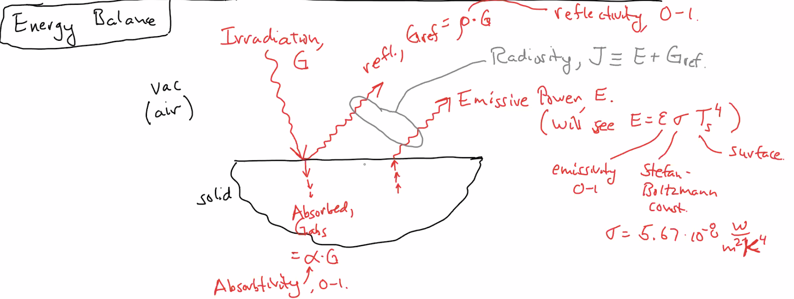
<figcaption>Radiation energy balance</figcaption>
</figure>

<figure>
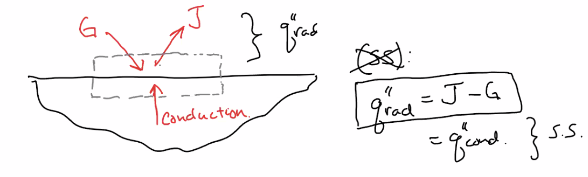
<figcaption>Radiation energy balance</figcaption>
</figure>

#### Intensity

Define "emitted intensity", $I_e$, via energy convs. By inspection, $$\d  q\propto L w \cos\theta \cdot \frac{\d  A_{receiver}}{r^2}$$ $$\d q_{receiver} = I_{e,\lambda} \d A_1\cos\theta \d \omega \d \lambda$$ $\lambda$ is detection spectrum range of receiver.

Define $I_{\lambda,e}(\lambda,\theta,\phi,x,y,t)$ rate at which radiant energy is emitted at a wavelength $\lambda$, in the $(\theta,\phi)$ direction, per unit area of the emitter normal to ($\theta,\phi$), per solid $\Delta$ about $(\theta,\phi)$, per unit wavelength.

we will frequent assume $I_e$ is independent of $(\theta,\phi)$, diffuse emission, while the $\lambda$ dependence often very important. $$[I_{\lambda,e}]= \Brack{\frac{W}{m^2\cdot sr\cdot m}}$$

$\d  \omega=\sin\d \theta\d \phi$, integrate over outgoing hemisphere $\theta$ from $0$ to $\pi/2$, $\phi$ from $0$ to $2\pi$ $$q_{rad,e}=\int_{\lambda=0}^{\infty}\iint_{\theta,\phi} \iint_{x,y} I_{e,\lambda}(\theta,\phi,\lambda,T,x,y,t)\underbrace{\d x\d y \cos \theta}_{\text{area normal to direction)}} \d \omega \d \lambda$$ Now suppose $I_{\lambda,e}$ independent of $x,y$. And independent of $\theta,\phi$ (diffuse emission), $$q_{rad,e}=\iint_{xy} \d x\d y \cdot \int_{\theta=0}^{\pi/2}\int_{\phi=0}^{2\pi}\sin\theta\cos\theta\d\theta\d \phi \cdot \int_{\lambda=0}^{\infty}I_{e,\lambda}(\lambda,T)\d \lambda=A_1\pi I_e(T)$$ define $q_{rad,e}=E\cdot A_1$, then $$E=\pi I_e$$ similarily, $G=\pi I_i$, $J=\pi(I_e+I_r)$, which all requires $I$ indepent of $(x,y,\theta,\phi)$

## Black body

1.  Absorbs everything hit it, any $(\lambda,\theta,\phi)$, $\rho=0,\alpha=1$

2.  For a given $T$ and $\lambda$, no real surface can emit more than a black body.

3.  Blackbody emission is diffuse, $I_{\lambda,b}$ is independent of $\theta,\phi$

4.  Actual Blackbody emission given by Planck distribution. `\marginnote{eq 12.29, 12.30}`{=latex} $$E_{\lambda,b}(\lambda,T)=\pi\cdot I_{\lambda,b}(\lambda,T)=\frac{c_1}{\lambda^5 (\exp{c_2/(\lambda T)}-1)}$$ $$c_1=2\pi h c_0=3.74\times 10^8 \unit{W/m^2\cdot \mu m^4 } \qquad c_2=\frac{hc_0}{k_B}=1.44\times 10^4 \unit{\mu m\cdot K}$$

find peak $\lambda$ of plank spectrum at given $T$ , $$\lambda_{pk}\cdot T=2898 \unit{\mu m\cdot K}$$ Wien's Displacement Law.

Total black body emission power $$E_b=\int_{\lambda=0}^{\infty} \frac{c_1}{\lambda^5(\exp{c_2/\lambda T}-1)}\d \lambda=\sigma T^4 \qquad \sigma=5.67\times 10^{-8} \unit{W/m^2K^4}$$

Black body radiation functions $$F_{0-\lambda}= \frac{\int_0^{\lambda}E_{b,\lambda}\d \lambda}{\int_0^{\infty}E_{b,\lambda}\d \lambda}$$

## Emission from real surfaces

Definition of spectral, directional emissivity $\epsilon_{\lambda,\theta}$, $$I_{\lambda,e}(\theta,\phi,\lambda)=\epsilon_{\lambda,\theta}(\theta,\phi,\lambda)\cdot I_{\lambda,b}(\theta,\phi,\lambda)$$ real materials. emission reasonably independent of direction and $T$, $$\epsilon_{\lambda,\theta}(\theta,\phi,\lambda,T)\approx \epsilon_{\lambda}(\lambda)$$ $$I_{\lambda,e}(\theta,\phi,\lambda,T)\approx\epsilon_{\lambda}(\lambda)\cdot I_{\lambda,b}(\lambda,T)$$ similarily, for absorbtivity, define $$\alpha_{\lambda}= \frac{I_{\lambda,i,abs}(\lambda)}{I_{\lambda,i}(\lambda)}$$ It is $1$ for black body.

## Kirchoff's law

$$\epsilon_{\lambda,\theta}(\lambda,\theta,\phi,T)=\alpha_{\lambda,\theta}(\lambda,\theta,\phi,T)$$ for most practice materials, $$\epsilon_{\lambda,\theta}(\lambda,\theta,\phi,T)\approx \epsilon_{\lambda}(\lambda) only.$$ most convenient quantity is $\epsilon(T)$.

Focusing of $\lambda$ dependence, when is $\epsilon(T)$ equal to $\alpha(T)$? `\marginnote{$T$ refers to surface temperature}`{=latex} $$\epsilon(T)=\frac{\int \epsilon_{\lambda}\cdot E_{b\lambda}(\lambda,T)\d \lambda}{\int E_{b\lambda}(\lambda,T) \d \lambda}$$ $$\alpha (T)= \frac{\int \alpha_{\lambda}G_{\lambda}(\lambda)\d \lambda}{\int G_{\lambda}(\lambda)\d \lambda}$$ true in 2 cases:

1.  Gray surface, $\epsilon_{\lambda}$ independent of $\lambda$. From kirchoff law $\lambda_{\lambda}$ also independent of $\lambda$.

2.  If $G_{\lambda}=E_{b\lambda}(\lambda,T)\cdot \const$.

usually a decent approx. Note except radiation among surfaces of very different $T$. e.g. Table 12.3

# Radiation exch among surfaces in an enclosure

assume surface are opaque, diffuse, gray, $\epsilon=\alpha$.

Furthermore, every surface $i$ is

1.  isothermal

2.  uniform irradating

3.  uniform radiosity

4.  uniform heat flux

$$q_i=A_i(J_i-G_i) \qquad J_i=\epsilon_iE_{bi}+\rho_iG_i$$ $\rho_i=1-\alpha_i$ for opaque, $\alpha_i=\epsilon_i$. $$G_i=\frac{J_i-\epsilon_iE_{bi}}{1-\epsilon_i}$$ So $$q_i=\frac{E_{bi}-J_i}{\frac{1-\epsilon_i}{\epsilon_i A_i}}$$ Driving potential is $E_{bi}-J_i$, units $\unit{W/m^2}$ not $\unit{K}$.

Surface radiative resistance is $$R=\frac{1-\epsilon_i}{\epsilon_iA_i}$$ Two ways $R\rightarrow 0$, $\epsilon_i=1$ and $A_i\rightarrow \infty$ `\marginnote{if area much larger than any other surfaces in problem, usually small body in large room.}`{=latex}.

## View factors

Define VF $F_{ij}$ is fraction of diffuse radiation leaving $i$, as $J_iA_i$, that is intercepted by $j$, $G_jA_j$. Thus $$G_iA_i=\sum_{j=1}^N F_{ji} A_jJ_j$$ sum rule: from energy conservations $$\sum_{j=1}^NF_{ij}=1$$ Reciprocity $$\d q_{i\rightarrow j}=I_i \d A_i\cos\theta_i \d \omega \qquad \d \omega=\frac{\d A_j\cos\theta_j}{R_{ij}^2}$$ $$\d q_{i\rightarrow j}=\frac{1}{\pi}J_i \frac{\cos\theta_i\cos\theta_j}{R_{ij}^2}\d A_i\d A_j$$ Generalize if $A_i,A_j$ finite, integrate.

Recall $$F_{ij}=\frac{q_{i\rightarrow j}}{A_jJ_i} \quad\Rightarrow\quad A_iF_{ij}=\iint_{A_i} \iint_{A_j} \Brack{\frac{\cos\theta_i \cos\theta_j}{\pi R_{ij}^2}\d A_i\d A_j}$$ note there is symmetry from above $$A_iF_{ij}=A_jF_{ji}$$

Evaluating view factors. For $N$ surfaces, the $F_{ij}$ matrix has $N^2$ entries, but only $N(N-1)/2$ are independent.

-   By inspection exploiting symmetries, sum and reciprocity rule.`\marginnote{example 13.2}`{=latex}

-   Tables and charts

-   Direct integral.

$$q_{i\rightarrow j}=J_iA_iF_{ij}$$ For black body, $$J_i=E_{bi} \qquad q_{i\rightarrow j}= E_{bi} A_iF_{ij}$$ and $$q_{j\rightarrow i}=E_{bj}A_jF_{ji}$$ define net radiative exchange $$q_{ij}=q_{i\rightarrow j}-q_{j\rightarrow i}=\sigma(T_i^4-T_j^4)A_iF_{ij}$$

\begin{examplebox}{2 concentric blackbody disks}
  \begin{figure}[H]
    \centering
    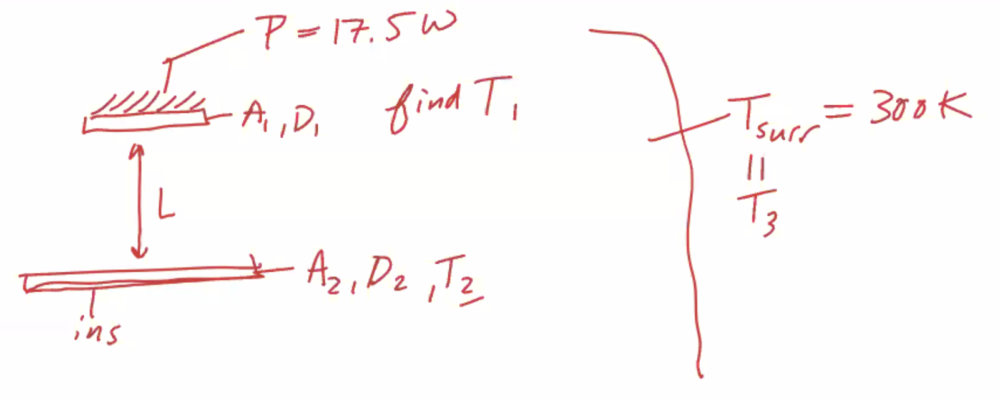
    \caption{Two disks}
  \end{figure}
\end{examplebox}

Take energy balance, $$P=\sum_{j=1}^3q_{ij}=A_1F_{12}\sigma(T_1^4-T_2^4)+A_1F_{13}\sigma(T_1^4-T_3^4)$$ use table 13.2, fig 13.5 to find $F_{12}$. Then use sum rule to find $F_{13}$.

## General radiative exchange assumption

Opaque ($\tau=0$), Diffuse (no angular dependence), Gray ($\epsilon=\alpha$), In an closure. Radiosity and irradition to be uniform.

This leads to `\marginnote{Eq 13.21}`{=latex} $$q_i=\frac{E_{bi}-J_i}{\frac{1-\epsilon_i}{\epsilon_iA_i}}$$ also $$q_i=\sum_{j=1}^N A_iF_{ij}=\sum_{j=1}^N \frac{J_i-J_j}{\frac{1}{A_iF_{ij}}}$$ Form a radiative circuit `\marginnote{example 13.4}`{=latex}.

1.  Radiosities

2.  Spatial resistors

3.  surface resistors.

4.  evaluate VF

5.  solve the system

$$G_iA_i=\sum_{j=1}^NJ_jA_jF_{ji}=\sum_{j=1}^NJ_jA_iF_{ij} \quad\Rightarrow\quad  G_i=\sum_{j=1}^NJ_jF_{ij}$$ $$q_i=A_i(J_i-G_i)=A_i(1\cdot J_i-\sum_{j=1}^NF_{ij}J_j)=A_i(\sum_jF_{ij}(J_i-J_j))$$ $$q_{ij}= \frac{J_i-J_j}{\frac{1}{A_iF_{ij}}} \quad\Rightarrow\quad  q_i=\sum_j q_{ij}$$ spatial resistence $R_{sp}=\frac{1}{A_iF_{ij}}=\frac{1}{A_jF_{ji}}$

## Solving problems

For each of $N$ surfaces, wrtie an energy balance. `\marginnote{eq 13.21 13.22}`{=latex}

## Three surface problem
