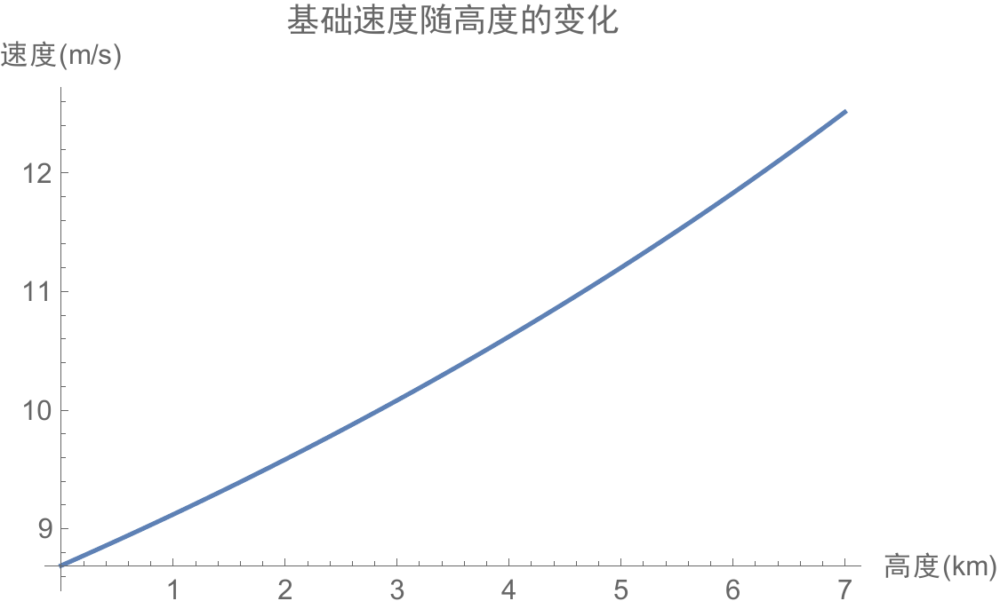
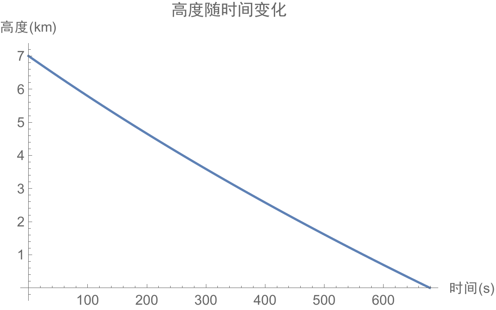
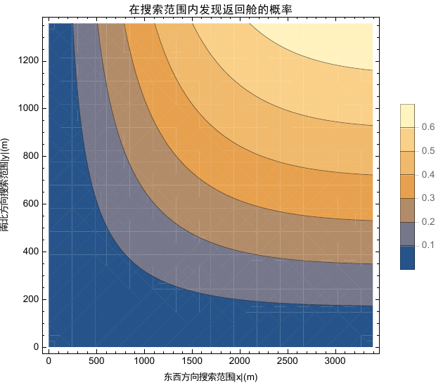
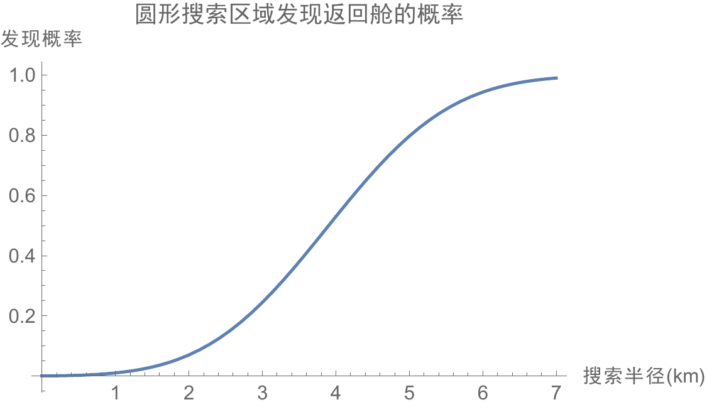
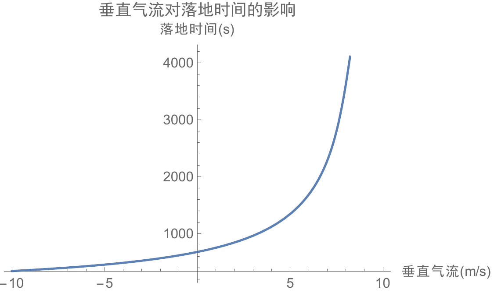

《工程科学概论》课程作业，找了一个简单问题研究了一下。

着陆阶段垂直气流对无动力返回舱的影响，
并议空天往返运输系统伞降返回舱配备动力的必要性与注意点。

\maketitle
\tableofcontents
\newpage

# 背景 {#sec:background}

一次空天往返可分为三个阶段：发射、飞行和返回。 返回阶段又可分为进入、下降和着陆三个阶段。 对于无动力返回舱而言，在经历了下降阶段高温热流、通讯中断等恶劣环境后， 其往往会采用降落伞的方式进入平稳着陆阶段$^{[1]}$。 虽然相比下降阶段，着陆阶段的危险性已经大大降低，但是其仍然具有重要的意义。

对其上游而言，经过数日的飞行，下降时的各种干扰，航天器的各项性能参数相较于预期 可能已经发生了一些变化。 对过程本身而言，仍然有许多影响因素、技术细节值得探讨。 一般选择在$10\mathrm{km}$高度开伞，以避开风速较大的高空急流$^{[2-3]}$。这一高度大约是对流层顶，也就是说返回舱要挂着降落伞 穿越整个对流层到地面。然而，对流层中天气多变，大气状况难以预测。和无降落伞的自由下落段 相比，降落伞-返回舱联合体受到气流的影响显著加强。同时，无动力的返回舱也使得返回过程 具有了一定的不确定性和不可控性。 对其下游而言，着陆过程直接影响返回舱落点位置及预报难度，宇航员人身安全，返回舱的受损程度等等指标。如果天气状况复杂恶劣，对落点位置的预报会产生很大影响，进而进一步延长搜救时间，增大搜救难度。更甚者，会导致返回舱落入回收场附近较大的水域，或是村庄等人口密集区，造成一定的经济损失与恐慌。而返回舱的受损程度则与其复用性息息相关，若是能够顺利着陆，对于复用型航天器而言则省下了一笔不小的成本。

为使返回舱能够顺利着陆，圆满完成任务最后一阶段，需要对其最后着陆过程中所经历的大气环境有 清晰的认识和准确的预报。对于水平风场的影响和预报，已经有了不少研究$^{[2-4]}$。然而文献$^{[3]}$ 表示未能考虑垂直气流对飞船影响。本人查找到的相关研究和资料也并不多。虽然，一般认为垂直气流 的速度要比水平风速低一个量级，对降落伞-返回舱联合体影响不大。但是如果能从定量上加以分析，也未尝不是一件有意义的事。另外，如果在着陆时遇到一些对流强烈的云，其中垂直气流速度可达$12\mathrm{m/s}$$^{[5]}$，这就可能会产生一些难以预料的影响。

目前，可以通过一些手段较为准确地分析预测某地区某时段的大气状况，确定其适合航天器着陆。但是，未来空天运输系统中航天器起降频繁，地点可能也有多处。若每次都要专门分析天气状况，选择适合起降的时间，将会较大地增加成本，降低运输效率。航空飞机已经能穿越云层而仅有一些颠簸，未来的航天器也不应当过于"娇嫩"。因此，分析各种情况下大气运动对航天器的发射与返回是有必要的。在本文中，只研究返回阶段。

# 分析

## 用于计算的基本参数

文献$^{[3]}$对"神舟七号"的返回过程作了精细的研究，因此本文也以"神舟七号"为原型。 假设返回舱为质地均匀的球体，半径$r=1\mathrm{m}$，质量为$3000\mathrm{kg}$。 降落伞为半径$R=12\mathrm{m}$的半球面，质量忽略不计。

讨论的运动范围从返回舱在距离地面$h_0=7\mathrm{km}$处开伞完毕开始，到着陆地面结束，称为匀速飘移阶段。此阶段神七的参考初速度$v_0^{*}=30\mathrm{m/s}$，总过程参考耗时$t^{*}=500\mathrm{s}$，参考平均速度$\bar{v}^{*}=14\mathrm{m/s}$。重力加速度值在地面为$9.8\mathrm{m/s^2}$，计算得在$7\mathrm{km}$高度为$9.78 \mathrm{m/s^2}$，全过程参考重力加速度为$g=9.79m/s^2$。

水平速度不在专门考虑范围之内，东西和南北方向分别设为正态分布，均值为$u_1^{*}=5\mathrm{m/s}$和$u_2^{*}=2\mathrm{m/s}$，标准差即水平风波动范围设为$\sigma=2\mathrm{m/s}$。两个方向的风速设为是相对独立的。

垂直气流分几个数量级讨论。$v_a=5\mathrm{cm/s}$，对应晴朗稳定的大气状态$^{[6]}$；$v_B=0.5\mathrm{m/s}$，对应有一定活动但未成云的大气状态；$v_C=5\mathrm{m/s}$，对应一般对流强烈的雨云状态$^{[5]}$。

## 雷诺数和阻力系数

对于各种情况，降落伞-返回舱基本都处于大雷诺数运动状态。分析如下：

雷诺数的定义为 $$\label{eq:leinuo}
  Re=\frac{\rho v L}{\mu}$$ 其中$\rho$为气体密度，$v$为相对运动速度，$L$为特征尺度，取为返回舱或降落伞的直径。$\mu$为气体的动力粘度。

在地面，空气的密度为$1.225\mathrm{kg/m^3}$，动力粘度$\mu=17.9\times 10^{-6}Pa\cdot s$ 特征尺度取返回舱直径$2r=2\mathrm{m}$。相对运动速度取为$10\mathrm{m/s}$量级。则由`\autoref{eq:leinuo}`{=latex}计算出地面附近该问题的雷诺数为$Re=1.37\times 10^6$。

考虑其他因素对雷诺数的影响。在$10\mathrm{km}$高空，依照ISA标准大气模型计算空气密度为$0.49\mathrm{kg/m^3}$，较地面小一个数量级。动力粘度应当也有所减少，但未查到相关数据。特征尺度还能选为降落伞，只会偏大一个数量级。这样，即使相对运动速度只有$1\mathrm{m/s}$数量级，雷诺数也至少有$10^4$量级。因此，整个过程可视为大雷诺数流动。

在此基础上，结合相关资料可设定返回舱和降落伞的阻力系数分别为$c_{w1}=0.8,c_{w2}=1.4$$^{[7-8]}$。

## 垂直方向动力学方程

据文献$^{[3]}$，在不考虑垂直气流和密度梯度时，垂直方向动力学方程为 $$\label{eq:vertical}
  mg=D_1+D_2$$ 其中$D_1,D_2$分别为返回舱、降落伞阻力。阻力可按照下式计算。 $$\label{eq:friction}
  D_1=\frac{1}{2}\rho v^2 c_{w1} \pi r^2,\qquad D_2=\frac{1}{2}\rho v^2c_{w2} \pi R^2$$

考虑垂直气流速度时，可将$v$从降落速度改为相对垂直气流的速度。于是实际的降落速度$w=v+v'$，其中$v'$为垂直气流的速度。最终表达式为 $$\label{eq:vs}
  w=v'+\sqrt{\frac{2mg}{\rho \pi(c_{w1}r^2+c_{w2}R^2)}}$$

## 基础速度的计算和讨论

当$v'=0\mathrm{m/s}$时，代入各项数据计算基础速度，得 $$w_0=8.68 \mathrm{m/s}$$

若考虑在高空和地面附近重力加速度和密度的差异，将其值用 $$g(h)=9.8\mathrm{m/s^2}
  \left(
    \frac{R}{R+h}
  \right)^2,\qquad \rho(h)=1.225
  \left(
    1-\frac{6.5h}{288.15 \mathrm{km}}
  \right)^{4.25588}$$ 代替，其中$R=6400 \mathrm{km}$为地球半径，则得到速度随高度（单位：$\mathrm{km}$）变化的函数$w_0(h)$，计算得 $$w_0(0)=9.12 \mathrm{m/s},~w_0(7)=12.51 \mathrm{m/s}$$ 其变化曲线如下图所示。

<figure id="fig:w0-h">

<figcaption>速度随高度的变化曲线</figcaption>
</figure>

进一步，通过数值求解ODE $$h'(t)=-\frac{1}{1000}w_0(h),~h(0)=7$$ 可得到高度随时间的变化图线如`\autoref{fig:h-t}`{=latex}所示。

<figure id="fig:h-t">

<figcaption>高度随时间的变化</figcaption>
</figure>

其中落地时间可解得$t=678.66\mathrm{s}$。

结合两图，可得出结论高度、速度均随时间大致均匀减小。各个参数与参考值相比均偏差不大。

## 基础落点分布

在匀速飘移阶段，伞-舱水平方向与空气相对静止。由水平风速的假设，可知其落点为二维正态分布。 其落点中心为正东$x_0=3.39\mathrm{km}$，正北$y_0=1.36\mathrm{km}$。积分可知在搜索范围为$x_0\pm x,y_0\pm y$的矩形区域内发现返回舱的概率如`\autoref{fig:search}`{=latex}所示。

<figure id="fig:search">

<figcaption>在矩形范围内搜索发现返回舱的概率</figcaption>
</figure>

如果在以落点为中心的圆形区域内搜索，则积分得到在区域内发现返回舱概率随半径变化如`\autoref{fig:p-r}`{=latex}所示。

<figure id="fig:p-r">

<figcaption>圆域内发现返回舱概率</figcaption>
</figure>

从图中可以看出要达到$50\%$的概率，半径需要达到$4\mathrm{km}$；要达到$80\%$的概率，搜索半径需要达到$5\mathrm{km}$。

需要指出的是，由于水平风假设分布是不随时间变化的，因此其落点位置、分布和相应的搜索半径完全取决于落地时间$t$。

## 垂直气流影响

考虑垂直气流影响时，只需将动力学ODE方程修改为 $$h'(t)=-\frac{w_0(h)-v'}{1000},~h(0)=7$$ 其中$v'$为垂直气流速度，正值表示上升气流，负值表示下沉气流。 求解这个方程即可解出落地时间。变化曲线如`\autoref{fig:t-v}`{=latex}所示。

<figure id="fig:t-v">

<figcaption>垂直气流速度对落地时间影响</figcaption>
</figure>

从图中可以看出，对于下沉气流的情况，落地时间会减少，但是减少得不多。 即使对于$v_C=10\mathrm{m/s}$的气流而言也需要$328\mathrm{s}$下落，大约是 无气流时耗时的一半。但是对于上升气流而言，耗时增加得非常快。如果遇到$8\mathrm{m/s}$的强 上升流，会导致需要$4000\mathrm{s}$才能降落，大约是无气流时的六倍。这就会使得搜索难度大大增加。

以所选取的三个垂直气流速度和无垂直气流为例，将落点偏移距离和以圆形区域搜索，达到$80\%$概率所需的半径等参数一并列表如`\autoref{tab:1}`{=latex}所示。

\centering

::: {#tab:1}
  ---------- ---------- -------------------------- --------------------------- -------------- -------------------- --
   代表状况   气流性质           气流速度                   落地时间            中心飘移距离   $80\%$概率搜索半径
                                   m/s                        分:秒                  km                km
   强烈对流   下沉气流   `\phantom{0.0}`{=latex}5   `\phantom{0}`{=latex}7:36       2.46              3.37
    弱对流    下沉气流   `\phantom{0}`{=latex}0.5             10:47                 3.48              4.78
   稳定大气   下沉气流             0.05                       11:15                 3.64              4.99
   稳定大气      无      `\phantom{0.0}`{=latex}0             11:19                 3.65              5.01
   稳定大气   上升气流             0.05                       11:22                 3.67              5.04
    弱对流    上升气流   `\phantom{0}`{=latex}0.5             11:54                 3.84              5.27
    对流云    上升气流   `\phantom{0.0}`{=latex}5             22:24                 7.24              9.93
  ---------- ---------- -------------------------- --------------------------- -------------- -------------------- --

  : 三种量级的垂直气流速度与其对应的参数指标
:::

根据`\autoref{tab:1}`{=latex}所示的数据，我们可以得出如下结论。

1.  对稳定大气和弱对流天气而言，轻微的垂直气流对着陆过程影响不大。稳定大气的着陆时间相差在$10$秒以内，弱对流大气的着陆时间相差也不超过$1$分钟。搜索的半径仅需要调整$5\%$左右。

2.  强对流对于着陆过程的影响是较大的。其中较大的下沉气流会使得落地时间有较为明显的减少，搜索半径也能相应减少$20\%$左右。而较大的上升气流会使得落地时间显著增加，飘移距离和搜索半径也会翻倍。

虽然实际情况下风和垂直气流的具体参数与假设不尽相同，但这些结论仍然具有参考价值。

# 结论与建议

结合得到的结论，再考虑到其他一些事实，可以提出相应的建议。

1.  对于一般较稳定的大气而言，垂直气流对返回舱着陆的影响在可以容忍的范围之内。

2.  无动力返回舱在面对恶劣天气时较为被动。因此，在伞降的基础上可以配备一定的动力，以主动避开不良情况；甚至不采用降落伞，直接采用类似飞机的姿态降落$^{[9]}$。本文研究的主体仍然是伞-舱联合体，因此以下建议只是针对前者而言。

3.  若需增加动力，需要考虑到在着陆段已经是平稳降落，但是宇航员刚经过超重减速，并未完全恢复，无法执行复杂的命令。

4.  单从数据上看，借助下沉气流能够减少耗时。提高搜索精确度。但是考虑到降落伞的开伞过程，着地速度不宜过大，给航天员提供更平缓的体验等，还是应当尽量避开强下沉气流。

5.  更好的方式或许是在平稳下降的中途利用下沉气流加速，在刚开始释放降落伞段和预备着陆段离开下沉气流。这就要求返回舱具有一定的灵活性。

6.  强上升气流会严重影响着陆点和搜救难度，并且会伴随着水汽甚至雷电等复杂状况，必须要避开。

7.  强上升气流一般出现在积云中，因此只要避开大型云即可。相比之下，强下降气流更为罕见，因为下降气流会抑制云的形成。但是，若其真的存在，则是肉眼不可见而难以识别的。若之后需要返回舱自主动力飞行，还需要有雷达等设备辅助探测并导航避开。

8.  上升气流一般出现在低气压区，下沉气流一般出现在高气压区，这可为回收场选址提供一些参考。

9.  动力学方程`\autoref{eq:vertical}`{=latex}和`\autoref{eq:friction}`{=latex}中还有别的因素会影响着陆速度。考虑返回舱的质量，为了平稳着陆，可在降落后期抛弃一部分质量以减小速度，如"神七"在$5\mathrm{km}$高度抛防热底座$^{[3]}$。返回舱截面提供的阻力只有降落伞的百分之一，在对阻力系数和截面积进行改进时主要还是考虑降落伞的优化。

# 结语

限于时间、精力和能力所限，本研究未能获取详细的垂直气流数据并加以模拟，对降落伞-返回舱的联合体也作了刚体近似，并只考虑了垂直运动。真实情况下，降落伞受到水平气流和垂直气流混合作用时，会产生一定的耦合效应，将其简单分解会产生一些误差。在落点的分布上，本研究只讨论了一种理想的水平风分布。风场的实际情况瞬息万变，情况更为复杂。

即便如此，研究结果也定量揭示了大致的垂直气流对伞降返回舱的影响模式，为未来带动力伞降返回舱提出了一些建议。为了应对空天往返运输系统中频繁出现的天气问题，提高航天器对恶劣天气的容忍度，进而降低成本，提高安全性，我们仍然还有很长的路要走。

# 致谢

感谢李家春老师、姚朝晖老师和鲍麟老师的悉心指导，郭志梅等同志所做研究为本研究提供的巨大帮助。

# 参考文献

`\noindent
[1]`{=latex}方方,周璐,李志辉.航天器返回地球的气动特性综述\[J\].航空学报,2015,36(01):24-38. `\newline
[2]`{=latex}熊菁,秦子增,程文科.回收过程中高空风场的特点及描述\[J\].航天返回与遥感,2003(03):9-14. `\newline
[3]`{=latex}郭志梅.利用天气雷达网监测神七返回舱试验及基于精细风场的神七伞降轨迹预测研究\[D\].南京信息工程大学,2011. `\newline
[4]`{=latex}钱山,孙守明,李恒年,王海涛,马宏.基于气象风修正的返回舱落点快速预报方法\[J\].飞行器测控学报,2013,32(03):245-250. `\newline
[5]`{=latex}王昂生,徐乃璋.垂直气流的气球探测方法(上)\[J\].气象,1978(02):29-30. `\newline
[6]`{=latex}朱乾根,林锦瑞,寿绍文.天气学原理和方法\[M\].北京:气象出版社,1981:490-498 `\newline
[7] `{=latex}H. 欧特尔等.普朗特流体力学基础\[M\].北京:科学出版社,2008:146 `\newline
[8]`{=latex}陈明长,唐海锋,李涛,马文勇.环形降落伞阻力系数及流场分析\[J\].南阳理工学院学报,2014,6(03):102-104. `\newline
[9]`{=latex}闫晓东,唐硕.亚轨道飞行器返回轨道设计方法研究\[J\].宇航学报,2008(02):467-471.
