《自动控制原理》课程作业。

\maketitle

# 背景

光源自动追踪系统模型在实际中具有广泛的应用，例如在太阳能电池中，若能使得电池板保持追踪太阳的 位置，则能提高发电效率。同一模型也可应用于飞行物体的瞄准，地面卫星通信，加工设备的位置控制等方面。事实上，他们都是典型的随动系统[@sdxt]。

随动系统的目的是让输出量复现输入量，达到同步的状态。在光源自动追踪系统中，通过两块成夹角的光敏元件如光电池来感知光线的偏离，利用产生的电压差驱动电机向相应方向运动，在负反馈作用下使得机械总是朝向光源方向。

# 模型建立

## 总体框架

在未添加校正环节时，系统的结构图如 `\autoref{fig:ori-fig}`{=latex}所示。

<figure id="fig:ori-fig">
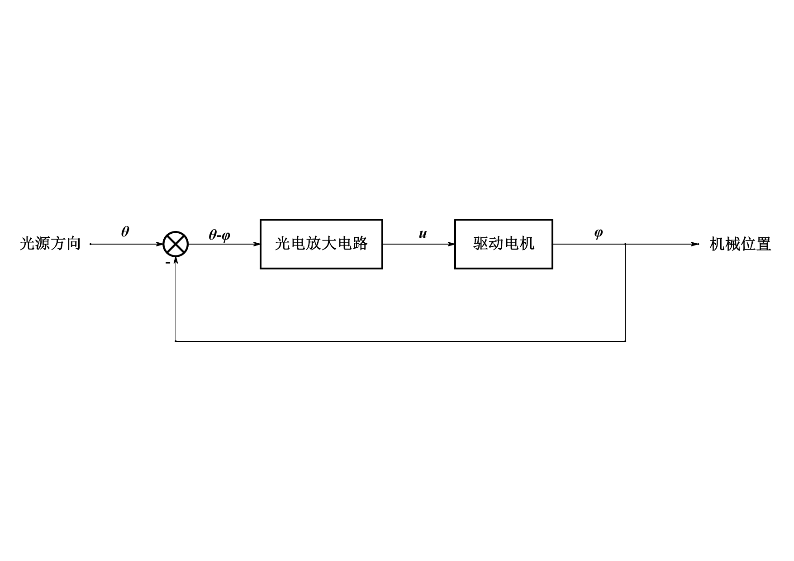
<figcaption>原始系统框图</figcaption>
</figure>

## 光源探测部分

如 `\autoref{fig:lightget}`{=latex}所示是接收光源的帆板，帆板内两侧附有相同的光敏元件。当光线与帆板中心线偏离时， 两光敏元件接收到光线的角度不同，导致产生的电压不同。

<figure id="fig:lightget">
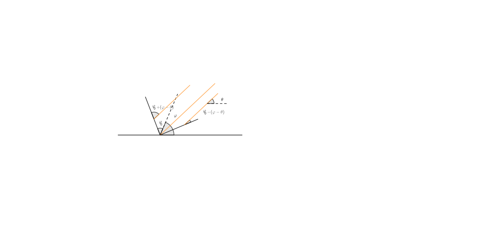
<figcaption>光源接收器示意图</figcaption>
</figure>

设产生的电压与光线与光敏元件夹角的正弦成正比，比例系数为$k$。如图所示，帆板中心线与基准线夹角为$\varphi$，光线与基准线夹角为$\theta$， 帆板半顶角为$\varphi_0$，设$\varphi$与$\theta$夹角较小可线性化处理，则有 $$\begin{aligned}
&u_l=k\sin(\varphi_0+(\varphi-\theta)) \qquad u_r=k\sin(\varphi_0-(\varphi-\theta)) \\
  &u=u_r-u_l=-2k\cos\varphi_0\sin(\varphi-\theta)\approx 2k(\theta-\varphi)\cos\varphi_0
\end{aligned}$$ 设比例系数$K=2k\cos\phi_0$，并在零初始条件下作拉氏变换，可知这是一个比例环节。 $$\label{eq:g1}
u(s)=K\theta(s) \qquad  G_1(s)=\frac{u(s)}{\theta(s)}=K$$

## 电机部分

电机部分参考资料[@3光源自动跟踪系11:online]，在驱动电压为$u$时，转角$\phi$的规律为 $$JL_a\ddn[3]{\varphi}{t}+(JR_a+BL_a)\ddn[2]{\varphi}{t}+(R_aB+k_vk_t)\ddt[\varphi]=k_tu$$ 其中电机阻值$R_a=1.75\Omega$，电感$L_a=2.83\times 10^{-3}\,\mathrm{H}$，电势常数$k_v=0.093\,\mathrm{V\cdot s/rad}$， 转矩常数$k_t=0.0924\,\mathrm{N\cdot m/A}$，电机和帆板等负载总转动惯量为$J=3\times 10^{-5}\,\mathrm{N\cdot m\cdot s^2}$， 阻尼系数$B=5\times 10^{-3}\,\mathrm{N\cdot m\cdot s}$。

在零初始条件下作拉氏变换，得 $$(JL_as^3+(JR_a+BL_a)s^2+(R_aB+k_vk_t)s)\varphi(s)=k_tu(s)$$

本阶段传递函数为 $$\label{eq:g2}
G_2(s)=\frac{\varphi(s)}{u(s)}=\frac{k_t}{JL_as^3+(JR_a+BL_a)s^2+(R_aB+k_vk_t)s}$$

## 系统整体

系统框图如 `\autoref{fig:ori-fig1}`{=latex}所示。

<figure id="fig:ori-fig1">
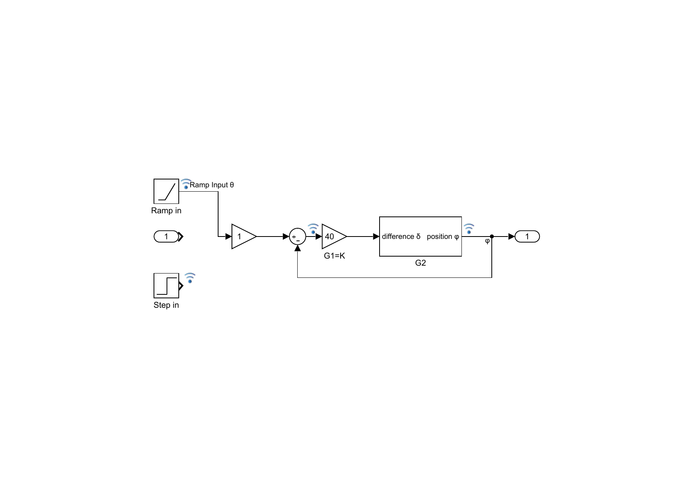
<figcaption>系统框图</figcaption>
</figure>

根据传递函数的表达式 `\autoref{eq:g1}`{=latex} `\autoref{eq:g2}`{=latex}，代入相关参数，可得开环传递函数 $$G_O=\frac{K k_t}{JL_as^3+(JR_a+BL_a)s^2+(R_aB+k_vk_t)s}$$ 系统闭环传递函数为 $$G_C=\frac{G_1G_2}{1+G_1G_2}=\frac{G_O}{1+G_O}$$ 这是一个三阶，I型系统。

# 系统分析

## 根轨迹

系统的增益未知，因此先作根轨迹考察。

<figure id="fig:rlocus">

<figcaption>根轨迹图</figcaption>
</figure>

从图中可见系统可能产生不稳定，求与虚轴交点处增益$K=147.4$，因此$K$必须要小于此数值才能稳定。

## 单位阶跃和单位斜坡输入响应

取$K=40$，观察单位阶跃响应，表示当光源突然产生较小的位置改变时响应情况。如 `\autoref{fig:stepres}`{=latex}

<figure id="fig:stepres">

<figcaption>单位阶跃响应</figcaption>
</figure>

峰值时间为$14.3\,\mathrm{ms}$，超调量为$21.47\%$，调节时间为$28.0\,\mathrm{ms}$

对于单位斜坡输入，相应于跟踪光源匀速运动的情况，例如太阳的位置。模拟结果如 `\autoref{fig:rampres}`{=latex}

<figure id="fig:rampres">

<figcaption>单位斜坡响应</figcaption>
</figure>

定义斜率差距小于$5\%$时达到稳定，则调整时间为$27\,\mathrm{ms}$，稳态误差为$0.0046$。

## 伯德图

系统的伯德图如 `\autoref{fig:bode}`{=latex}所示。

<figure id="fig:bode">

<figcaption>系统的伯德图</figcaption>
</figure>

低频段斜率为$-20\,\mathrm{dB/dec}$，经过中频段过渡后，到高频段斜率为$-60\,\mathrm{dB/dec}$。相角裕量为$47.8^{\circ}$，幅值裕量为$11.3\,\mathrm{dB}$。

# 系统校正

## 前馈校正

作为随动系统，最常用的优化手段为增加前馈控制，在不影响稳定性的同时提高精度与快速性。

对于单位斜坡输入，在计算误差之前增加PD控制器，连接到电机之前，可以改善跟踪精度。 校正后的系统框图如 `\autoref{fig:PDramp}`{=latex}

<figure id="fig:PDramp">
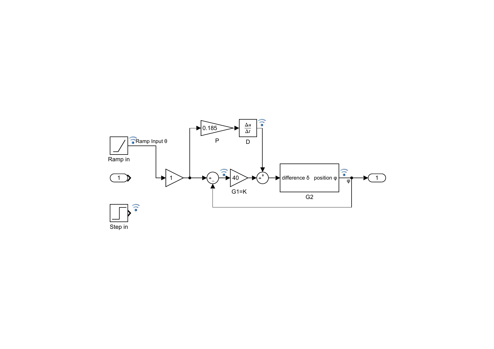
<figcaption>PD前馈校正系统框图</figcaption>
</figure>

通过调参选取比例系数，模拟结果如 `\autoref{fig:PDrampres}`{=latex}

<figure id="fig:PDrampres">
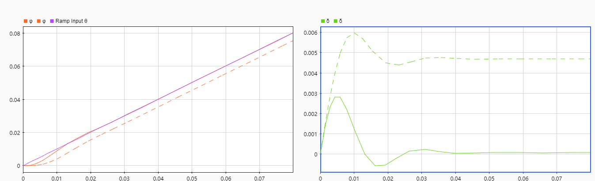
<figcaption>PD前馈校正结果</figcaption>
</figure>

图中虚线为校正前，实线为校正后。左图紫色线为光源方向的单位斜坡输入，橙色线为机械方向角输出。右图为跟踪误差图线。此时跟踪误差已经小于$10^{-4}$，事实上可继续精细调整参数完全消除跟踪误差。若以误差小于$10^{-4}$为界，调整时间为$36.5\,\mathrm{ms}$。

对于单位阶跃输入，由于输入不存在微分，这一调节方法不适用。

## 串联PID

在系统中直接串联PID控制器以改善性能，框图如 `\autoref{fig:PIDserie}`{=latex}。

<figure id="fig:PIDserie">
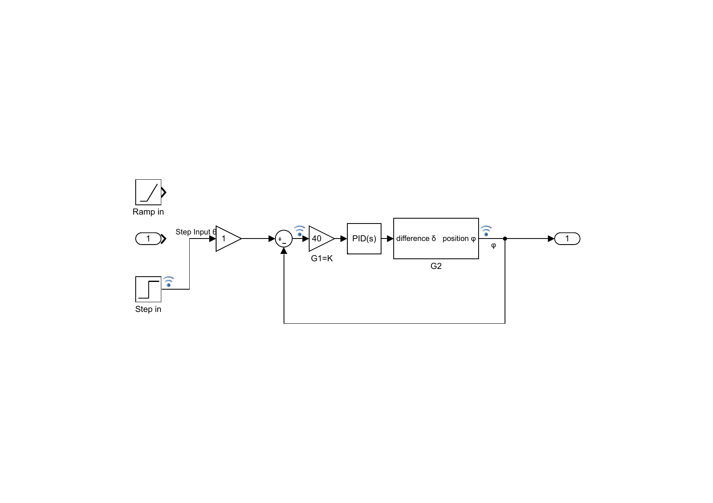
<figcaption>串联PID控制器校正系统框图</figcaption>
</figure>

通过MATLAB PID tuning程序自动调参，得较为合适的PID参数。 $$\mathrm{PID}(s)=P+I \frac{1}{s}+D \frac{N}{1+N \frac{1}{s}}$$ $P=1.61478,I=22.41153,D=0.00973,N=62610.55249$。

仿真结果如下。

<figure id="fig:step-PIDseries">
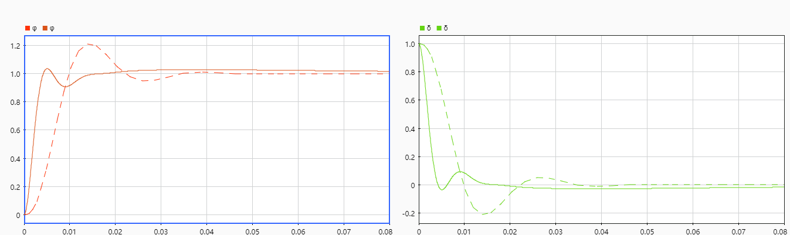
<figcaption>串联PID校正单位阶跃输入响应</figcaption>
</figure>

<figure id="fig:step-PIDseries">
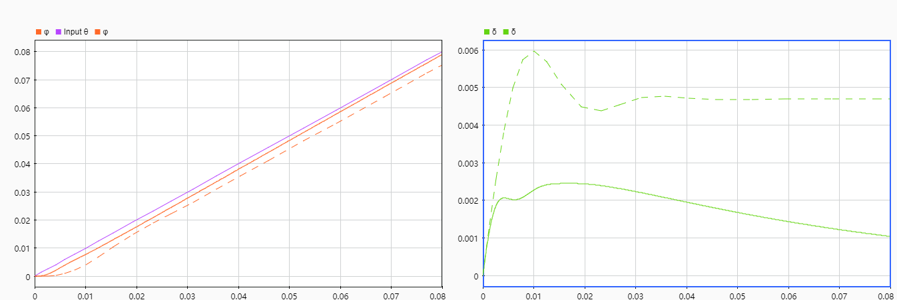
<figcaption>串联PID校正单位斜坡输入响应</figcaption>
</figure>

图例同前，可见在此PID调整下，对单位阶跃输入而言，超调量减小至$4\%$，抑制减小了系统的振荡，上升快，提早进入稳态，但是趋向稳定值的速度较之前略慢。对于单位斜坡输入而言，也在一定程度上改善了跟踪性能，但是误差减小不如PD前馈控制快，达到$10^{-4}$的误差需要$210\,\mathrm{ms}$。

## 前馈校正与串联PID结合

如前所述，前馈校正能够消除单位斜坡输入的跟踪误差，但不能改变单位阶跃输入的情况；串联PID改善了单位阶跃输入时系统的振荡性，但是对单位斜坡的输入的改善效果一般。能不能结合起来同时改善两种输入下的性能呢？发现确实可以，并且直接将两种情况 相叠加就能得到较好的效果。系统图如 `\autoref{fig:sys-PIDandPD}`{=latex}

<figure id="fig:sys-PIDandPD">
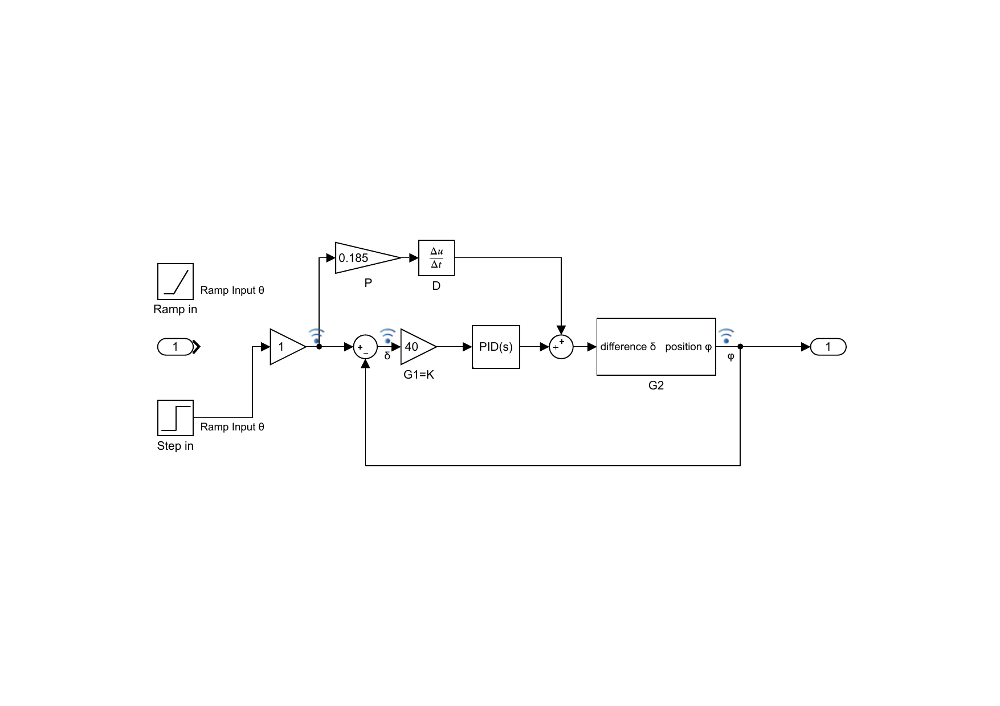
<figcaption>结合前馈校正与串联PID的系统框图</figcaption>
</figure>

在单位斜坡输入下，结果如 `\autoref{fig:ramp-PIDandPD}`{=latex}所示，图中 绿色虚线为校正前单位斜坡跟踪误差，实线为前馈校正与PID串联结合时的单位斜坡跟踪误差。 其中还用紫色线，橙色线给出了只用前馈校正，只用串联PID时的误差情况。

<figure id="fig:ramp-PIDandPD">
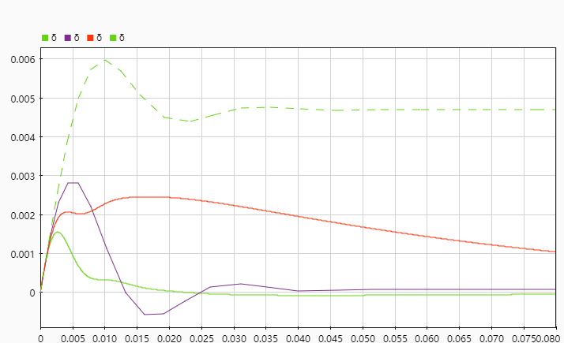
<figcaption>结合前馈校正与串联PID时的单位斜坡输入响应误差曲线</figcaption>
</figure>

可以发现，结合使用前馈校正与串联PID时校正效果比单独使用时效果更好，不仅减小了振荡，还使得系统快速达到稳态。 对于单位阶跃输入而言，因为前馈校正不起作用，故结果与之前相同。

## 直接调整增益校正

在$K=40$时（已经串联入增益器），根轨迹图像及极点位置如 `\autoref{fig:rloc40}`{=latex}所示。 从图中可见此时系统有三个极点，并且当忽略较远的极点时，剩余两个共轭极点为主导极点，可以近似为二阶系统分析。因此想要降低超调量，就得让主导极点向着实轴和实轴负方向移动。 但事实上，这样会减慢上升速度。

<figure id="fig:rloc40">

<figcaption><em>K</em> = 40时极点位置</figcaption>
</figure>

于是选取根轨迹与实轴的交点，此时在$K=40$的基础上还需要另一个$K=0.405$的增益。系统框图略。调整后系统单位阶跃响应如 `\autoref{fig:step-P}`{=latex}。

<figure id="fig:step-P">
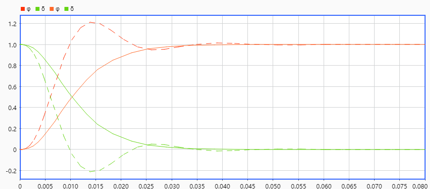
<figcaption>增益调整后单位阶跃响应</figcaption>
</figure>

图中橙色虚线实线分别为校正前与校正后输出的变化，绿色虚线实线分别为校正前与校正后误差的变化。可见调整增益后确实系统振荡减小，调节时间略微下降，但是起步较慢。

单位斜坡响应如 `\autoref{fig:ramp-P}`{=latex}。

<figure id="fig:ramp-P">

。 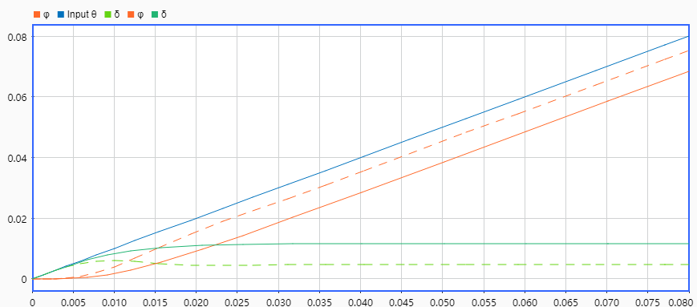

<figcaption>增益调整后单位斜坡响应</figcaption>
</figure>

可见此时对单位斜坡输入跟踪误差反而增加了。

## 根轨迹进一步超前校正

尝试利用超前装置，即在根轨迹图中增加一对零极点，极点在零点左侧，在改变增益的基础上进行进一步校正。

经过不断尝试发现以下结论：

1.  增加的零极点对实轴上下两条根轨迹产生排斥的效果，且零极点之间距离越近，它们距离根轨迹越远，排斥效果越弱。

2.  在开环增益不变的情况下，排斥时会将极点略向虚轴方向推移动，较大地将极点向远离实轴方向推动。

3.  在时域上，反映为零极点之间距离越远时，系统振荡越强烈，补偿增益后发现无法解决响应速度与振荡相矛盾的问题。

理论上零极点的选取应当依照理想主导极点进行分析，要想让超调量基本不变，上升时间和调节时间尽量小，可以让主导极点向远离实轴、虚轴方向移动，但是事实上发现 无论如何调整，由于多个极点的相互运动，主导极点的实部总不能越过某个界限，由此给调节时间带来了一定的全局限制。通过排斥效果，可以让极点实部在交会时（实部绝对值的最小值最大）提高一些超调量来 换取较快的上升速度。

经过多次尝试后得到相对较优的结果，串联的传递函数如下，框图略。 $$G_f=\frac{1+125 s}{1+226 s} \times 0.7$$

调整前后的根轨迹图如 `\autoref{fig:rlocusadj}`{=latex}

<figure id="fig:rlocusadj">

<figcaption>校正前后根轨迹图</figcaption>
</figure>

对于单位阶跃输入，结果如 `\autoref{fig:steprlocadj}`{=latex}所示。

<figure id="fig:steprlocadj">
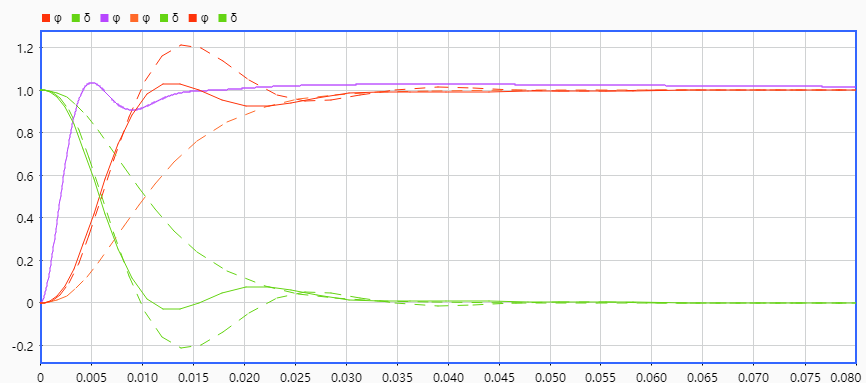
<figcaption>根轨迹调整后单位阶跃输入响应</figcaption>
</figure>

同理，图中橙色虚线实线分别为校正前与校正后输出的变化，相对较上的虚线为原系统，相对较下的虚线为调节增益校正的系统，绿色虚线实线分别为校正前与校正后误差的变化，两条虚线也分别对应原系统和调节增益校正的系统。 图中还用紫色线给出了PID串联校正得到的结果。比较可知，校正后上升速度恢复到和原系统差不多的水平，超调量减小到$5\%$，虽然速度仍然不如PID校正，但是比PID更早进入稳态。

对于单位斜坡输入，结果如 `\autoref{fig:ramprlocadj}`{=latex}所示。

<figure id="fig:ramprlocadj">
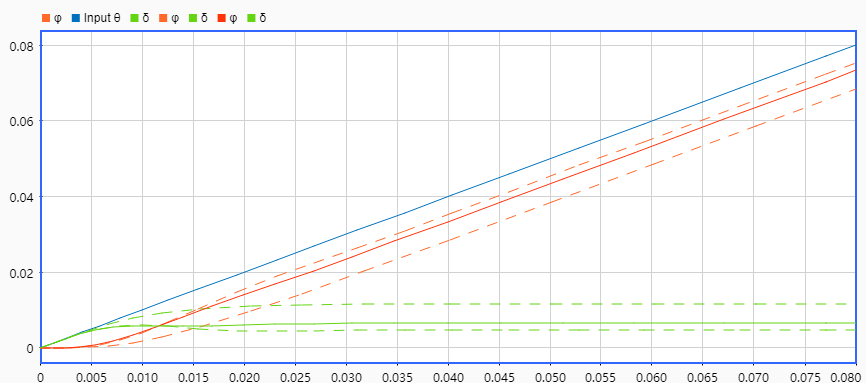
<figcaption>根轨迹调整后单位斜坡输入响应</figcaption>
</figure>

橙色、绿色线图例同上，蓝色线为斜坡输入。可以发现，在根轨迹校正后跟踪误差比原系统大，但是比增益校正的系统误差小。它也有稳定的跟踪误差， 因此可以和PD前馈结合，消除误差。测试发现可以用相同的PD前馈参数进行校正，结果和单独使用PD前馈校正类似，几乎同时达到跟踪误差$10^{-4}$的稳态， 但是其比PD前馈校正波动小一些，具体方法和图略。

## 鲁棒性分析

由于Simulink不支持分母阶数小于等于分子阶数系统的分析，因此无法分析直接添加零点来拦截根轨迹的情况。

但既然鲁棒性要求$K$值变化时系统变化不敏感，而$K$值过大时系统不稳定，那么能不能尝试进行校正以增加$K$值上限？对$K=40$时未校正的系统而言，要新增一个增益，临界$K^{*}$值为$3.7$。 同样采用增加一对零极点的方式，设增加的零点为$z$，极点为$p$，控制增益不变，则此时传递函数形式变为 $$\frac{\alpha}{s(s^2+ts+r)}\cdot \frac{s-z}{s-p}\cdot \frac{p}{z}$$ 其中$\alpha,t,r$均为已知实数。求此时增益上限，可代入$s=b\mathrm{i}$并解关于$K^{*},b$的方程 $$\frac{\alpha K^{*}}{b\mathrm{i}(r-b^2+tb\mathrm{i})} \frac{b\mathrm{i}-z}{b\mathrm{i}-p}\cdot \frac{p}{z}=-1$$ 解的过程略，由$pz>0$删去不合理的解得 $$K^{*}=\frac{z}{2\alpha p} \brack{pt(p-t)+(p-t)^2 z+r(p+t)+(p-t) \sqrt{(-p (t+z)+r+t z)^2+4 p r z}}$$ 代入已知$r,t,\alpha$的具体数值，对上面$K^{*}$关于$p,z$作等高线图，得到 `\autoref{fig:kpz}`{=latex}

<figure id="fig:kpz">
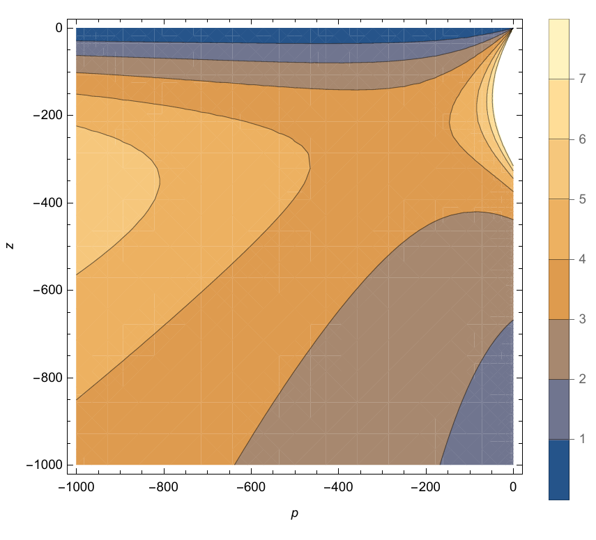
<figcaption><em>K</em>*关于<em>p</em>, <em>z</em>的等高线图</figcaption>
</figure>

从图中可见向左偏下和右偏上方向是$K^{*}$增大的方向，右上方对应$z=-200,p\rightarrow 0$的情况。虽然在右上方$K^{*}$增加非常快， 但是代入系统后发现此时超调量很大，并且较难稳定。

考虑左偏下的方向，代入$z=-400,p=-2500$，此时根轨迹如 `\autoref{fig:robustrloc}`{=latex}所示，临界增益$K^{*}=10.8$。

<figure id="fig:robustrloc">

<figcaption>鲁棒性调整后根轨迹</figcaption>
</figure>

绘出此时单位阶跃响应，如 `\autoref{fig:robustrloc}`{=latex}所示。

<figure id="fig:step-robust">
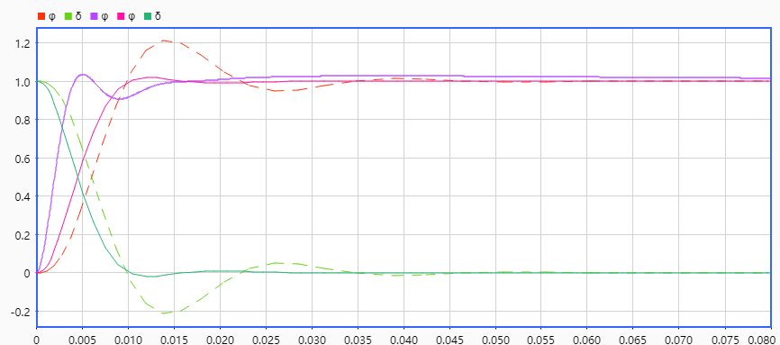
<figcaption>鲁棒性调整后单位阶跃输入响应</figcaption>
</figure>

紫色线仍然为PID串联校正结果。可见此时系统响应速度变快，超调量也减小到$2\%$，甚至比之前根轨迹校正还要好，说明之前并未寻找到最好的解。虽然此时上升速度仍然不及PID校正，但是进入稳态的速度最快。

单位斜坡输入结果则与原系统类似，亦可通过$PD$前馈校正，此处略。

# 总结与展望

本文对光源追踪系统进行了建模分析并校正，发现

1.  PD前馈控制能极大改善单位斜坡输入的跟踪精度，

2.  串联PID校正则能同时改善单位阶跃输入的快速性，稳定性和单位斜坡输入的跟踪精度，但对于后者而言效果不如PD前馈控制。将二者结合使用时，达到了同时改善单位斜坡和单位阶跃输入性能的效果。 此外，PID校正是使得超调量在一定限制内上升速度最大的方案。

3.  直接调整增益，可以减小超调量，但是上升较慢，到达稳态的时间差异不大。

4.  在直接调整增益的基础上，增加超前装置，能在控制超调量较小的情况下保持上升速度，到达稳态的时间差异不大。

5.  通过超前装置或滞后装置来最大化临界增益，发现不仅加快了上升速度，超调量也很小，进入稳态的速度也最快。

可以用于校正的手段还有很多未尝试，如依据伯德图，使用期望频率特性校正法等，对根轨迹校正也未依照成熟的理论路线。 除此之外，角度偏差过大时可能会受到非线性因素的影响，并且对于跟踪太阳这样缓慢移动的光源可以采用离散控制系统以节约电力资源，也是需要考虑的问题。 `\printbibliography[heading=bibliography,title=参考文献]`{=latex}

最后感谢老师的课件以及教材，赵汪洋同学提供了选题的灵感。
