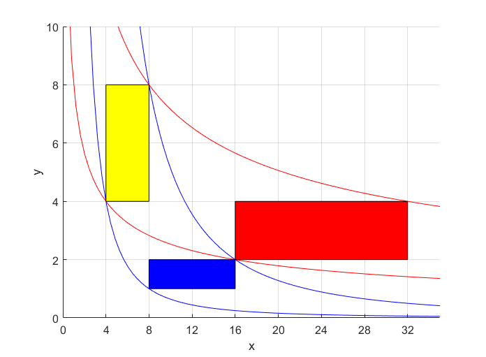
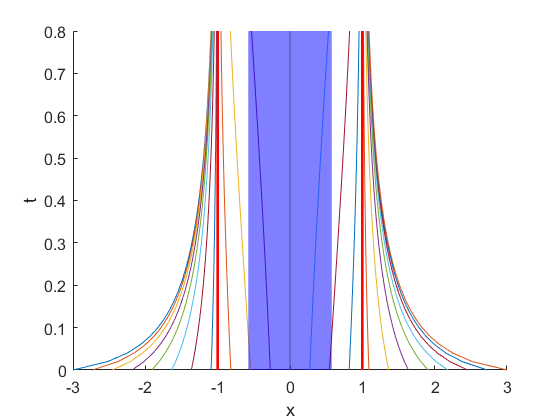

1 Liouville 方程的导出

1.1 Liouville 方程回顾及基于输运定理的导出

1.2 基于 Liouville 定理导出输运定理

1.3 Liouville 定理的导出

2 Liouville 方程的解及其验证

2.1 Liouville 方程解的导出：特征线法

2.2 Liouville 方程解的验证

3 概率密度性质的讨论：基于 Liouville 方程的解

3.1 从概率密度的视角理解吸引子

3.2 概率密度增加一定意味着吸引子吗？

3.3 耗散系统中概率密度一定增大吗？

3.4 概率密度增大，与维数，自由度的随想

[前一篇](https://vortexer99.github.io/posts/2024/09/liouville/)

\maketitle
\tableofcontents
\newpage

# Liouville方程的导出 {#section:1}

## Liouville方程回顾及基于输运定理的导出

\marginnote{观前提示：推导不重要，理解含义最重要，推导只是服务于更好的理解含义。}

前两天大致看了一下Martin Ehrendorfer的"The Liouville Equation in Atmospheric Predictability"一章，对于Liouville方程的导出讲得还挺清楚的，感兴趣的推荐去阅读一下。 这里相当于只是进一步作一些自己学习时的一些注解，之前正好想学习导出方法但一直没找到学习材料。

首先回顾一下Liouville方程，它是在一个已知动力系统的基础上，所定义的一个描述**状态概率分布随动力系统演化**的方程。这一个动力系统（无论是否自治）如下定义： $$\frac{\mathrm{d}\bm{X}}{\mathrm{d}t}=\bm{\Phi}(\bm{X},t).$$ $\bm{X}$是$N$维的向量，$\bm{\Phi}$是$N$维空间到$N$维空间的映射（简而言之，当下状态如何决定当下的演化速度）。如果给定初始时刻的变量$\bm{X}$的概率密度函数$\rho_0(\bm{X})$，那么其演化满足Liouville方程

$$\label{eq:liou}
\frac{\partial \rho(\bm{X},t)}{\partial t}+\sum_{k=1}^N\bm{\Phi}_k(\bm{X},t)\frac{\partial \rho(\bm{X},t)}{\partial X_k}=-\psi(\bm{X},t)\rho(\bm{X},t),\quad \psi(\bm{X},t)=\sum_{k=1}^N\frac{\partial \Phi_k(\bm{X},t)}{\partial X_k}.$$ 或者用张量的形式表达 $$\frac{\partial \rho(\bm{X},t)}{\partial t}+\frac{\partial \rho(\bm{X},t)}{\partial \bm{X}}\cdot \bm{\Phi}(\bm{X},t)=-\psi(\bm{X},t)\rho(\bm{X},t),\quad \psi(\bm{X},t)=\nabla_{\bm{X}}\cdot\bm{\Phi}(\bm{X},t).$$

借助现成的理论工具，可以快速导出Liouville方程。Liouville方程所描述的是$\rho=\rho(\bm{X},t)$的演化规律，这一概率密度是定义在$N$维相空间加$1$维时间中的函数。 `\marginnote{$V_T$严格来说就是构成初始相体积的初始状态的集合在$T$时刻构成的集合}`{=latex}基于具有较好性质的一阶动力系统，过相空间中任何一点均有且仅有一条相轨迹经过。因此，对于$t=0$时刻任意给定的初始的$N$维相体积$V_0$，均在$T$时刻对应另一个相体积$V_T$。我们通过如下等价描述来导出Liouville方程：**给定初始概率密度分布，对于任意选定的初始相体积$\bm{V_0}$，概率密度在这一相体积（随时间演变）上的积分守恒。**显然，对于$\rho$能被称为概率密度而言这是必要的条件。这也就是书中所说的"realizations cannot leave the material region or the probability mass in the material region must remain constant"。这一要求的数学表达即为 $$\label{eq:1.2}
\forall V(0),t:\quad\dd{}{t}\int_{V(t)}\rho(\bm{X},t)\mathrm{d}\bm{X}=0.$$ `\marginnote{哎，六年后又碰到了RTT，下一次碰到不知道我在哪里了}`{=latex}这里的积分区域是随着时间运动的相体积$V(t)$（拉格朗日观点），而不是固定的区域（欧拉观点），因此时间导数无法直接进入积分号。这种积分需要我们用**输运定理（Transport Theorem）或称雷诺输运定理**将其展开为三项，即： $$\label{rtt}
\dd{}{t}\int_{V(t)}\rho(\bm{X},t)\mathrm{d}\bm{X}=\int_{V(t)} \brack{\pp{\rho}{t}+\pp{\rho}{\bm{X}}\cdot\bm{\Phi}+\rho\nabla\cdot\bm{\Phi}} \mathrm{d}\bm{X}.$$ 通过这三项，输运定理其实表达的是如下原理：**物理量在运动的物质体积上的积分的变化，由三部分构成：物理量本身在局地随时间产生的变化；物理量由于在空间上分布不均，由物质运动输送（平流）在局地产生的变化；以及由于物质体积边界发生收缩或膨胀所导致的积分量的变化。**在三维空间中，体积块的运动一般以速度$\bm{v}$表示，此时如果将$\rho$视为一般意义下的密度即得到连续性方程的形式；而在相空间中，相体积运动的速度即为动力系统方程中的$\bm{\Phi}$。由于`\eqref{eq:1.2}`{=latex}式的要求，`\eqref{rtt}`{=latex}中积分号内的值必须恒为零，这也就是Liouville方程。由此也可以看出，Liouville方程如何提供了一种工具，使得我们能够基于动力系统的性质$\bm{\Phi}$来研究概率密度分布随动力系统的演化。`\marginnote{不想看公式推导的，可以跳到2.1节看一眼解然后跳到第3节。}`{=latex}

## 基于Liouville定理导出输运定理

> \"From now on, we'll assume that all our vector fields are smooth enough to ensure the existence and uniqueness of solutions, starting from any point in phase space.\"
>
> \begin{flushright}
>   —— Strogatz 《Nonlinear Dynamic and Chaos》
> \end{flushright}

`\marginnote{可以思考一下$x=x_0+t$，$x=x_0+t^2$，$x=x_0(1+t)$，$x=x_0(1+t^2)$四个简单例子中的$F$，并结合其相轨迹线来体会一下。}`{=latex}所以剩余的问题其实只有输运定理是怎么导出来的。这需要我们借助变形梯度张量$\bm{F}$的概念，它描述的是当前状态（当前构形）相对于初始状态（参考构形）在微分意义下的变化，表达式为 $$\mathrm{d}\bm{X}=\bm{F}(\bm{X_0},t)\mathrm{d}\bm{X_0} \qquad \bm{F}(\bm{X_0},t)=\pp{\bm{X}}{\bm{X_0}}.$$ 由此，可以将对当前相体积$V(t)$的积分转到初始相体积的积分上$V(0)$。类似积分的换元，此时需要额外乘$\bm{F}$的行列式值$J$（即相应于当前状态和初始状态的Jacobian）来配合体积微元的变化。同时，需要注意将$\bm{X}$转换为$\bm{X_0},t$表达。方便起见，我们把这个要计算的积分称为$I$。`\marginnote{注意，上面的$\mathrm{d}\bm{X}$和$\mathrm{d}\bm{X_0}$表示微小线元，下面的$\mathrm{d}X$和$\mathrm{d}X_0$表示当前状态和初始状态的微小体积元，所以一个用$\bm{F}$连接一个用$J$连接。}`{=latex} $$I=\dd{}{t}\int_{V(t)}\rho(\bm{X},t)\mathrm{d}X=\dd{}{t}\int_{V(0)}\rho(\bm{X}(\bm{X_0},t),t)J(\bm{X_0},t)\mathrm{d}X_0.$$ 此时时间导数就可以穿过积分号，变为对被积函数的时间偏导数。 $$\begin{aligned}
  I &= \int_{V(0)} \brack{\brack{\ppp{\rho}{t}{\bm{X}}+\ppp{\rho}{\bm{X}}{t}\ppp{\bm{X}}{t}{\bm{X_0}}}J(\bm{X}_0,t) +\rho \pp{J}{t}} \mathrm{d}\bm{X_0}\\
  &=\int_{V(0)} \brack{\brack{\ppp{\rho}{t}{\bm{X}}+\ppp{\rho}{\bm{X}}{t}\cdot\bm{\Phi}(\bm{X}(\bm{X_0},t),t)}J(\bm{X}_0,t) +\rho \pp{J}{t}} \mathrm{d}\bm{X_0}.
\end{aligned}$$ Liouville有如下定理（书中2.2.2.5式） $$\label{eq:2225}
\pp{J(\bm{X_0},t)}{t}=\brack{\nabla_{\bm{X}(\bm{X_0},t)}\cdot\bm{\Phi}(\bm{X}(\bm{X_0},t),t)}J(\bm{X_0},t).$$ 它表明：初始时为$\bm{X_0}$的状态，$t$时刻的状态为$\bm{X}$，则**由初始状态$\bm{X_0}$和时间$\bm{t}$所描述的体积微元大小的变化率$\bm{\ln J}$，等于$\bm{t}$时刻相空间的速度$\bm{\Phi}$在状态$\bm{X}$处的散度。** 这也很好理解，因为$J$反映的是当前状态体积微元和初始状态体积微元的比值，初始状态体积微元是固定不变的，而当前状态体积微元的改变当然来自于相流在局部的扩张或收缩。 由这个定理，我们就可以把积分$I$中的$J$提取为公因式，即得到 $$I=\int_{V(0)} \brack{\ppp{\rho}{t}{\bm{X}}+\ppp{\rho}{\bm{X}}{t}\cdot\bm{\Phi}(\bm{X}(\bm{X_0},t),t)+\rho \nabla_{\bm{X}(\bm{X_0},t)}\cdot\bm{\Phi}} J(\bm{X}_0,t) \mathrm{d}\bm{X_0}.$$ 此时，又可以将$J \mathrm{d}\bm{X}_0$还原回原来的积分相体积上，同时各函数也还原回$\bm{X},t$的表达 $$I=\int_{V(t)} \brack{\ppp{\rho}{t}{\bm{X}}+\ppp{\rho}{\bm{X}}{t}\cdot\bm{\Phi}(\bm{X},t)+\rho \nabla_{\bm{X}}\cdot\bm{\Phi}} \mathrm{d}\bm{X}.$$ 此时不存在可能导致误解的表达（没有$\bm{X_0}$了），因此可以去除括号和下标让结果更简洁一些。 $$I=\int_{V(t)} \brack{\pp{\rho}{t}+\pp{\rho}{\bm{X}}\cdot\bm{\Phi}+\rho \nabla\cdot\bm{\Phi}} \mathrm{d}\bm{X}.$$ 这也就是我们想要的输运定理。到这里，其实剩余的问题就归结为如何导出Liouville定理`\eqref{eq:2225}`{=latex}式。

## Liouville定理的导出

Liouville定理`\eqref{eq:2225}`{=latex}式描述的是Jacobian随时间的变化。书中并没有给出它的一个详细证明，这里借助在连续介质力学课上学到的方法来给出其推导（见赵亚溥《理性力学》相关内容）。 虽然形成这一推导的逻辑链条较长，但是几乎全都是线性代数、张量代数的工具应用，不涉及数学以外的东西。

为了导出$J=\det \bm{F}$对时间的导数，我们将证明以下结论。所需要解释的概念将会在碰到时给出。 $$\begin{aligned}
  1. \quad& \pp{J}{\bm{F}}=J \bm{F}^{-\mathrm{T}} .\\
  2. \quad& \pp{J}{t}=J \bm{F}^{-\mathrm{T}}:\pp{\bm{F}}{t}.\\
  3. \quad& \bm{F}^{-\mathrm{T}}: \pp{\bm{F}}{t}=\nabla_{\bm{X}}\cdot\bm{\Phi}(\bm{X},t).
\end{aligned}$$

先来解决第一个结论。等式左端$\partial J/\partial \bm{F}$是一个**张量的标量函数对张量的导数**。我们这里的$\bm{F}$是$N$维的二阶张量，这里先以一个$2\times 2$的例子说明，即考虑如下的例子： $$\bm{F}=\pmbb{a}{b}{c}{d} \quad\Rightarrow\quad J=ad-bc \quad\Rightarrow\quad  \pp{J}{\bm{F}} = \pmbb{ \partial_aJ}{ \partial_bJ }{ \partial_cJ }{ \partial_dJ }= \pmbb{d}{-c}{-b}{a}.$$ `\marginnote{下面的导数定义和上面这种基于对每一个分量的导数定义是等价的可以互推的，只需考虑任意二阶张量$\bm{B}$均可以由每个分量上的单位二阶张量线性组合而成即可。}`{=latex} 从中可以看出，由于例子中的张量是一个$2\times 2$的矩阵，其中存在四个分量，故一个标量函数对其的偏导数也是一个同样大小的矩阵（张量），且其相应位置为标量函数对相应分量的偏导数。 对于$N$维的情况当然也是如此。然而，我们在形式计算$J$对$\bm{F}$的导数时这种形式非常不方便，因为我们不可能把行列式展开然后计算。为此，我们需要采用下面的等价定义。 对于任意$N$维二阶张量$\bm{A},\bm{F_0}$以及张量的标量函数（不局限于行列式）$J(\bm{F})$： $$\left.\pp{J(\bm{F})}{\bm{F}}\right|_{\bm{F}=\bm{F_0}}=\bm{A} \quad\text{当且仅当}\quad \forall \bm{B}, \lim_{\alpha\rightarrow 0} \frac{J(\bm{F_0}+\alpha \bm{B})-J(\bm{F_0})}{\alpha} =\bm{A}:\bm{B}.$$ `\marginnote{$\bm{F_0}$中的下标$0$并没有什么和初始状态相关联的特殊含义，只是为了在导数表达式中不引起歧义。}`{=latex} 其中上式右端的$\bm{B}$为任意和$\bm{F}$尺寸相同的二阶张量，冒号表示双缩并。在这里，暂时只需要知道**对于二阶而言，双缩并是将两个张量相应位置相乘后求和得到一个标量**即可，详细的介绍偏离主线太远，请参考张量代数。

采用上面这种方法的好处是，我们无需展开计算行列式$J$，而可以通过利用其一些性质来化简极限表达式，从而在形式上找到导数。因此，我们的目的是化简如下表达式，它其实是标量函数沿着方向$\bm{B}$的方向导数。方便起见我们将其记为$G$。 $$G=\lim_{\alpha\rightarrow 0} \frac{\det (\bm{F}+\alpha \bm{B})-\det(\bm{F}) }{\alpha}.$$ 为了处理这一式，需要用到如下的行列式定理。对于$N$维方阵$\bm{M}$， $$\det (\bm{M}+\beta \bm{\mathrm{I}})=\beta^N+I_1(\bm{M})\beta^{N-1}+I_2(\bm{M})\beta^{N-2}+\cdots+I_N(\bm{M}).$$ `\marginnote{矩阵的不变量，其名字来源于它们在坐标变换下不变的性质。对于$3x3$的方阵$\bm{M}$来说，$I_1=\tr \bm{M}$，$I_2=(\tr^2 \bm{M}-\tr \bm{M}^2)/2$，$I_3=\det \bm{M}$。}`{=latex}其中$I_1,I_2,...,I_N$为矩阵的不变量。侧边给出了三维方阵不变量的例子。这里同样不对矩阵不变量作过多的探讨，仅需知道$I_1(\bm{M})=\tr \bm{M}$即可，这通过行列式的余子式表达可以马上得到。同时，注意到$\det (\bm{M}\bm{N})=\det \bm{M} \det \bm{N}$，我们有 $$\begin{aligned}
  \det (\bm{F}+\alpha \bm{B}) &= \det \brack{ \alpha \bm{F}(\alpha^{-1}\bm{\mathrm{I}}+\bm{F}^{-1}\bm{B})}\\
                         &=\det(\alpha \bm{F})\det (\bm{F}^{-1}\bm{B}+\alpha^{-1}\bm{\mathrm{I}})\\
                         &=\alpha^N \det \bm{F} \brack{\alpha^{-N}+\tr (\bm{F}^{-1}\bm{B})\alpha^{-N+1}+\cdots+I_N(\bm{F}^{-1}\bm{B})}\\
                         &=\det \bm{F}+\alpha \det \bm{F} \tr (\bm{F}^{-1}\bm{B})+\cdots +\alpha^NI_N(\bm{F}^{-1}\bm{B}).
\end{aligned}$$ 注意到$\alpha^2$及以上的高阶项在取极限时均消去，得到 $$G= \det \bm{F} \tr(\bm{F}^{-1}\bm{B}).$$ `\marginnote{考虑两个矩阵$\bm{M},\bm{N}$相乘时，所得结果的矩阵的对角线第一位是$\bm{M}\T$第一列和$\bm{N}$第一列的乘积，第二位是第二列和第二列的乘积，结合双缩并在这里的定义马上就可以知道这一性质。当然，如果用爱因斯坦求和约定表示的话证明起来更快。}`{=latex} 由于双缩并的计算性质，$\tr (\bm{F}^{-1}\bm{B})=\bm{F}^{-\mathrm{T}}:\bm{B}$，因此我们得到了最终想要的形式，即 $$\pp{J(\bm{F})}{\bm{F}}=J\bm{F}^{-\mathrm{T}}.$$ 这样就完成了第一个结论的导出。

第二个结论的导出是比较直接的。在前面的推导中，我们没有引入时间这一变量。而实际上，$\bm{F}$的每个分量也都随时间变化。因此，根据链式求导法则，$J$对时间的导数可以通过求和其对$\bm{F}$的每个分量的导数，乘以每个分量对时间的导数得到。这一操作当然也可以用双缩并来表达，即 $$\pp{J}{t}= \pp{J}{\bm{F}} : \pp{\bm{F}}{t}= J \bm{F}^{-\mathrm{T}}: \pp{\bm{F}}{t}.$$ 这也就是第二个结论的导出，其关键在于如何理解链式法则在这里的应用及表达。

现在，我们来导出最后一个结论。借助双缩并的性质，我们有 $$\bm{F}^{-\mathrm{T}}: \pp{\bm{F}}{t}=\tr \brack{\bm{F}^{-1}\pp{\bm{F}}{t}}$$ 我们将$\bm{F}$还原为对当前构形相对初始构形微分变化的描述，注意偏导时保持不变的量： $$\tr \brack{\bm{F}^{-1}\pp{\bm{F}}{t}}= \tr \brack{\ppp{\bm{X_0}}{\bm{X}}{t}\pp{}{t}\ppp{\bm{\bm{X}}}{\bm{X_0}}{t}}.$$ 交换偏导次序，注意动力系统定义，有 $$\pp{}{t}\ppp{\bm{\bm{X}}}{\bm{X_0}}{t}= \pp{}{\bm{X_0}} \ppp{\bm{X}}{t}{\bm{X_0}}= \ppp{\bm{\Phi}(\bm{X},t)}{\bm{X}_0}{t}= \ppp{\bm{\Phi}(\bm{X},t)}{\bm{X}}{t}\ppp{\bm{X}}{\bm{X_0}}{t}.$$ 注意交换律$\tr \bm{M} \bm{N}=\tr \bm{N}\bm{M}$，互逆的两项可以消去，因此得到 $$\tr \brack{\bm{F}^{-1}\pp{\bm{F}}{t}}= \tr \ppp{\bm{\Phi}(\bm{X},t)}{\bm{X}}{t}.$$ 事实上，右端正是在当前构形下散度的表达式，由此就导出了 $$\bm{F}^{-\mathrm{T}}: \pp{\bm{F}}{t}= \nabla_{\bm{X}}\cdot \bm{\Phi}(\bm{X},t).$$ 基于上面的结论2、3，就导出了我们需要的Liouville定理`\eqref{eq:2225}`{=latex}。

# Liouville方程的解及其验证

## Liouville方程解的导出：特征线法

敏锐的读者能看出Liouville方程`\eqref{eq:liou}`{=latex}是关于未知量$\rho(\bm{X},t)$的一阶线性方程。书中给出其解的表达式为

$$\label{eq:solve}
\rho(\bm{X},t)=\rho_0(\bm{X_0})h(\bm{X},t), \qquad h(\bm{X},t)\coloneqq \operatorname{exp}\brack{-\int_0^t\psi(\bm{X}(\bm{X_0},t'),t')\ \mathrm{d}t'}.$$

其中$\bm{X_0}$是$\bm{X}$在初始时刻的位置，$\rho_0$表示初始给定的状态分布概率密度函数，而$\rho_{0}(\bm{X_0})$表示**相应于当前状态$\bm{X}$的初始位置$\bm{X_0}$**的概率密度函数值。 $h(\bm{X},t)$是一个标量函数，书中称之为"Likelyhood Ratio"，这也就联系到如何理解这一解的表达式的含义------当前状态的概率密度其实就是相应初始状态的概率密度乘了一个比例值$h$， 这个比例值是怎么决定的呢？它是一个积分的e指数，这个积分表达的含义是$\psi$在初始状态到当前状态演化轨迹上的值的一个积分。

对于初次接触这些概念的读者而言，这里的很多表达可能十分费解，这是十分正常的。事实上，这些内容的难度有相当一部分在于如何把握**初始状态和当前状态之间的联系及其符号表达**。 例如，如果可以从上面的表达式中独立理解出这一个积分所表达的意义，可能就已经成功一半了。如果完全看不懂，可以先看一下动力系统的基本定义以及一些基本例子，也可以看一下我前一篇对线性系统的Liouville方程的具体讨论分析（里面也有很多例子）。

下面首先讨论这个解是如何得到的。书中没有详细给出，只提到了借助特征线法------不过这样确实很快。我们先借助下面的简单例子来理解特征线法，然后马上就能照葫芦画瓢导出Liouville方程的解。 特征线法的思想如下：**对于时空一阶的PDE而言，函数对时间的偏导和对空间的偏导的线性组合，可以视为对函数的一种平流输送**。例如 $$\pp{u}{t}+2 \pp{u}{x}=u.$$ 可以认为它描述的是初始函数$u_0(x)$在一个大小为$2$的速度场中的平流，或者说初始波形以$2$的速度在移动，无论哪种理解，均可以认为**初始在$\bm{x_0}$处的"信息"经过时间$\bm{t}$会到达$\bm{x=x_0+2t}$的位置**。因此，$x-2t=x_0$就定义了一根特征线，它的"特征"就是$x_0$，即在这条线上所有的$(x,t)$组合均满足$x-2t=x_0$。对于其他特征线也是如此，因此我们有特征线簇$x-2t=m$，不同的$m$值对应不同的特征线。

现在，我们假设未知函数$u$通过$m$和$t$间接依赖于$x,t$，即$u(x,t)=u'(m(x,t),t)$，这里$u'$和$u$在同一$x_0,x,t$组合下具有相同的值，但是$u'$通过变量$m,t$表达。基于此，我们将$u$在空间上随$x,t$的变化分离为两种近乎独立的变化，一种仍是随着时间$t$的变化，另一种则是**$\bm{(x,t)}$变化时由于所处的特征线变化所导致的变化**。 这样做的好处是，**基于这种平流输送的性质，当我们限制在同一根特征线上讨论函数的变化时，后一种变化立刻消失，从而仅存在一种变化，成为可解的常微分方程。**其数学表达如下，基于上述假设，很容易得到： $$\pp{u(x,t)}{t}=\pp{u'(m,t)}{m} \pp{m}{t}+\pp{u'(m,t)}{t}=-2 \pp{u'(m,t)}{m}+\pp{u'(m,t)}{t}.$$ $$\pp{u(x,t)}{x}=\pp{u'(m,t)}{m}\pp{m}{x}=\pp{u'(m,t)}{m}.$$ 代入原方程后立即得到 $$\label{eq:example}
\pp{u'(m,t)}{t}=u'(m,t) \quad\Rightarrow\quad u'(m,t)= C(m)\exp{t}.$$ 将右端的$m$展开为$x-2t$，并代入初始条件$u_0(x)$即得 $$u(x,t)=u_0(x-2t)\exp{t}.$$

现在我们用同样的流程来解Liouville方程。回顾Liouville方程`\eqref{eq:liou}`{=latex}，可以发现待求解的概率密度函数$\rho$就相当于上面例子中的$u$，$\bm{\Phi}$就相当于平流速度，等号右端的$-\psi\rho$就相当于`\eqref{eq:example}`{=latex}中换元之后剩余的部分。 动力系统的相轨迹已经定义了特征线： $$\label{eq:charline}
\bm{X}=\bm{X}(\bm{X_0},t).$$ `\marginnote{一维情形的偏导数关系是好理解的，多维情形的导出类似，放在本节末。}`{=latex}显然地，对于性质正常的动力系统而言，也存在$\bm{X_0}=\bm{X_0}(\bm{X},t)$，即$\bm{X},\bm{X}_0,t$三者中确定任意二者即可确定剩余的一个。由此，有偏导数关系： $$\label{eq:ppp}
\ppp{t}{\bm{X_0}}{\bm{X}}\cdot \ppp{\bm{X_0}}{\bm{X}}{t} \cdot\ppp{\bm{X}}{t}{\bm{X_0}}  =-1.$$

其中角标表示求偏导数时保持不变的量。注意到动力系统的定义，最后一项就是$\bm{\Phi}$。因此有 $$\ppp{\bm{X_0}}{\bm{X}}{t}\cdot\bm{\Phi}=- \ppp{\bm{X_0}}{t}{\bm{X}}.$$ 多提一嘴，这也就说明 $$\label{eq:ppp1}
\dd{\bm{X_0}}{t} =\ppp{\bm{X_0}}{t}{\bm{X}}+  \ppp{\bm{X_0}}{\bm{X}}{t}\cdot\bm{\Phi}=\bm{0}.$$ 这表达的意思是对于一个相体积的运动，其对应的初始状态随时间是不变的（当然就应该是这样的）。

对于张量形式的Liouville方程左端，我们假设$\rho=\rho(\bm{X},t)=\rho'(\bm{X_0}(\bm{X},t),t)$，其中$\rho'$是以$\bm{X_0},t$为自变量的$\rho$的表达式（函数），我们有 $$\begin{aligned}
  \label{eq:1}
  &\ppp{\rho}{t}{\bm{X}}   +\ppp{\rho}{\bm{X}}{t} \cdot\bm{\Phi}\\
  =& \ppp{\rho'}{t}{\bm{X_0}}+ \ppp{\rho'}{\bm{X_0}}{t} \ppp{\bm{X_0}}{t}{\bm{X}}+\ppp{\rho'}{\bm{X_0}}{t} \ppp{\bm{X_0}}{\bm{X}}{t}\cdot\bm{\Phi}\\
  =& \ppp{\rho'}{t}{\bm{X_0}}+ \ppp{\rho'}{\bm{X_0}}{t} \ppp{\bm{X_0}}{t}{\bm{X}}+\ppp{\rho'}{\bm{X_0}}{t} \brack{- \ppp{\bm{X_0}}{t}{\bm{X}}}\\
  =& \ppp{\rho'}{t}{\bm{X_0}}.
\end{aligned}$$ 于是方程立刻简化为 $$\ppp{\rho'}{t}{\bm{X_0}} =-\psi \rho'.$$ 剩余右端$\psi$的处理要比较小心，其原表达式以$\bm{X},t$为自变量，这里需要换成$\bm{X}_0,t$为自变量的形式，即$\psi(\bm{X},t)=\psi(\bm{X}(\bm{X}_0,t),t)$，然后在积分时保持$\bm{X}_0$不变，得 $$\rho'(\bm{X_0},t)=\rho'(\bm{X_0},0) \operatorname{exp} \brack{-\int_0^t\psi(\bm{X}(\bm{X_0},t'),t') \mathrm{d} t'}.$$ 将右端的$\bm{X_0}$用$\bm{X},t$表达，并结合初始条件$\rho(\bm{X},0)=\rho_0(\bm{X})$，即得到$\rho(\bm{X},t)$表达式 $$\rho(\bm{X},t)=\rho_0(\bm{X}_0(\bm{X},t)) \operatorname{exp} \brack{-\int_0^t\psi(\bm{X}(\bm{X_0}(\bm{X},t),t'),t') \mathrm{d} t'}.$$ 该式和本节开头给出的解的表达式一致。这里面的$\bm{X}$和$\bm{X_0}$有时候作为函数，有时候作为变量，可能比较费解。为此，可以如下定义由初始状态演化到当前状态以及反推的函数（映射）$\bm{P},\bm{Q}$： $$\bm{P}(\bm{X_0},t)=\bm{X}\qquad \bm{Q}(\bm{X},t)=\bm{X_0}.$$ 则上面解的表达式可以如下更明确地表达 $$\rho(\bm{X},t)=\rho_0(\bm{Q}(\bm{X},t)) \operatorname{exp} \brack{-\int_0^t\psi(\bm{P}(\bm{Q}(\bm{X},t),t'),t') \mathrm{d} t'}.$$

下面给出偏导数关系`\eqref{eq:ppp}`{=latex}的导出。考虑相轨迹或特征线的表达式`\eqref{eq:charline}`{=latex}，以隐函数形式表达。 $$\bm{F}(\bm{X},\bm{X_0},t)=\bm{0}.$$ 由于原表达式中$\bm{X}$是$N$维向量，这里的$\bm{F}$也是相应的$N$维。两边作全导数，得 $$\mathrm{d}\bm{F}=\pp{\bm{F}}{\bm{X}}\mathrm{d}\bm{X}+ \pp{\bm{F}}{\bm{X_0}} \mathrm{d} \bm{X}_0+ \pp{\bm{F}}{t} \mathrm{d} t=\bm{0}.$$ 由此得到 $$\begin{aligned}
    \ppp{\bm{X}}{t}{\bm{X_0}}&= -\brack{\pp{\bm{F}}{\bm{X}}}^{-1}\pp{\bm{F}}{t}.\\
 \ppp{\bm{X_0}}{\bm{X}}{t}&=- \brack{\pp{\bm{F}}{\bm{X_0}}}^{-1}\pp{\bm{F}}{\bm{X}}. \\
   \ppp{t}{\bm{X_0}}{\bm{X}}&=- \brack{\pp{\bm{F}}{t}}^{-1} \pp{\bm{F}}{\bm{X_0}}.
\end{aligned}$$

三者相乘得到 $$\begin{aligned}
  &\ppp{t}{\bm{X_0}}{\bm{X}} \cdot  \ppp{\bm{X_0}}{\bm{X}}{t}\cdot  \ppp{\bm{X}}{t}{\bm{X_0}}\\
  =&-\brack{\pp{\bm{F}}{t}}^{-1} \pp{\bm{F}}{\bm{X_0}}\cdot\brack{\pp{\bm{F}}{\bm{X_0}}}^{-1}\pp{\bm{F}}{\bm{X}} \cdot \brack{\pp{\bm{F}}{\bm{X}}}^{-1}\pp{\bm{F}}{t}\\
  =&-1.

\end{aligned}$$ 注意这里默认张量缩并的顺序是分母往前缩并和分子往后缩并，所以相邻项之间就成为矩阵乘法，即可全部消去。

## Liouville方程解的验证

得到Liouville方程解的表达式后，我们想将其代回去看看它是如何让方程成立的，这有助于加深我们对解的表达式的进一步理解。这并不是一项简单的推导，至少对我来说也花了一个晚上的工夫才整理出如下的简洁推导。如果读者有兴趣的话，可以先不看后面的内容，自行尝试推一遍，如果碰到卡住的地方，就说明在这里还没有理解透彻。

Liouville方程可写为 $$\pp{\rho}{t}+\pp{\rho}{\bm{X}}\cdot\bm{\Phi}+\psi\rho=0.$$ 我们将$\rho=\rho_0(\bm{X_0}(\bm{X},t))h(\bm{X},t)$代入左端，得 $$l.h.s.=\pp{\rho_0}{\bm{X_0}}\pp{\bm{X_0}}{t}h+\rho_0 \pp{h}{t}+ \pp{\rho_0}{\bm{X_0}}\pp{\bm{X_0}}{\bm{X}}\cdot \bm{\Phi}h+\rho_0 \pp{h}{\bm{X}}\cdot\bm{\Phi}+\psi\rho_0h.$$ 我们将要导出以下两式，从而说明解符合原方程 $$\pp{\bm{X_0}}{t}+\pp{\bm{X_0}}{\bm{X}}\cdot\bm{\Phi}=\bm{0}\qquad     \pp{h}{t}+\pp{h}{\bm{X}}\cdot\bm{\Phi}+\psi h=0.$$ 其中第一式，基于`\eqref{eq:ppp1}`{=latex}已经得到。然后我们来处理第二式。将其左端除以$h$，使得可以讨论$\ln h$，即左端成为 $$l.h.s./h= \pp{\ln h}{t}+ \pp{\ln h}{\bm{X}}\cdot\bm{\Phi}+\psi .$$ 现在代入$\ln h$，其表达式为 $$\ln h = -\int_0^t\psi(\bm{P}(\bm{Q}(\bm{X},t),t'),t') \mathrm{d}t'.$$ 此时可以看出使用这种形式而非书中给出形式的好处，在于我们对$t$求导时不会漏掉最中间$\bm{Q}$对于$t$的依赖性。因此，有 $$\pp{\ln h}{t}= - \psi(\bm{P}(\bm{Q}(\bm{X},t),t),t)-\int_0^t \pp{\psi}{\bm{P}}\pp{\bm{P}}{\bm{Q}} \pp{\bm{Q}}{t} \mathrm{d}t'.$$ 注意$\bm{Q}(\bm{X},t)=\bm{X_0}$，$\bm{P}(\bm{X_0},t)=\bm{X}$，上式第一项就是$-\psi(\bm{X},t)$。对于第二项，我们参考函数原始的形式写成如下更好理解的样子。 $$\pp{\ln h}{t}=-\psi(\bm{X},t)-\int_0^t
\left. \pp{\psi(\bm{X},t')}{\bm{X}}\right|_{\bm{X}=\bm{P}(\bm{Q}(\bm{X},t),t')}\cdot
\left.
  \pp{\bm{P}(\bm{X_0},t')}{\bm{X_0}}
\right|_{\bm{X_0}=\bm{Q}(\bm{X},t)} \cdot \pp{\bm{Q}(\bm{X},t)}{t} \mathrm{d}t'.$$ 同样地，我们有 $$\pp{\ln h}{\bm{X}}=-\int_0^t
\left. \pp{\psi(\bm{X},t')}{\bm{X}}\right|_{\bm{X}=\bm{P}(\bm{Q}(\bm{X},t),t')}\cdot
\left.
  \pp{\bm{P}(\bm{X_0},t')}{\bm{X_0}}
\right|_{\bm{X_0}=\bm{Q}(\bm{X},t)} \cdot \pp{\bm{Q}(\bm{X},t)}{\bm{X}} \mathrm{d}t'.$$ 但是其实中间项都不重要，注意到$\bm{Q}$就是$\bm{X_0}$关于$\bm{X},t$的表达式 $$\pp{\bm{Q}(\bm{X},t)}{t}+  \pp{\bm{Q}(\bm{X},t)}{\bm{X}} \cdot\bm{\Phi}=\bm{0}.$$ 同时$\bm{\Phi}$与$t'$无关，可以直接进入积分中，那么显然就得到了 $$\pp{\ln h}{t}+ \pp{\ln h}{\bm{X}}\cdot\bm{\Phi}+\psi=0$$ 由此就验证了解确实满足Liouville方程。

# 概率密度性质的讨论：基于Liouville方程的解

## 从概率密度的视角理解吸引子

> "当然，全世界的水都会重逢，北冰洋与尼罗河会在湿云中交融。这古老美丽的比喻让此刻变得神圣。即使漫游，每条路也都会带我们归家。"
>
> \begin{flushright}
>     ——黑塞 《克林索尔的最后夏天》
>   \end{flushright}

\marginnote{这书我没看过，网上找来的。}

吸引子是讨论一个动力系统的性质时需要重点考量的部分，它最直观地反映了系统在长期演化中所呈现出的规律，标志着万物的终结。 我们先从较为朴素的角度理解，吸引子就是一个稳定的不动点，其邻域中的相轨迹均以此为终点。 这些认知都是基于传统的动力系统分析方法，而我们所导出的概率密度的演化规律则提供了新的思考角度。

在 `\autoref{section:1}`{=latex}中导出Liouville方程时，就已经要求概率密度在运动的相体积上的积分保持守恒。 类比现实中的质量守恒，它的一个直接推论就是：**对于选定的同一块相体积而言，其体积越大，其平均概率密度就越小，反之亦然。** 而对于如上所述的吸引子来说，在它的周围必定是相体积收缩（可参考Introduction to nonlinear science by G. Nicolis, 3.4节），因而必定有平均概率密度增大，且随时间趋向于无穷而趋向于无穷大。 在这里，对于这种吸引子，其**作为一个稳定的不动点**的定义和在其周围相体积呈现收缩形态基本是等价的。仍然考虑输运定理`\eqref{rtt}`{=latex}，其对任意标量函数均成立，对全空间为常数$1$的函数$f$当然也成立。将其代入，即得 $$\dd{}{t} \int_{V(t)}1 \mathrm{d} \bm{X}= \int_{V(t)}  \brack{\pp{1}{t}+ \pp{1}{\bm{X}}\cdot\bm{\Phi}+1 \nabla\cdot\bm{\Phi}}\mathrm{d} \bm{X} .$$ 注意到上式左端积分正是**相体积的大小**，右端对$1$的时空导数均为零，我们马上得到关于相体积的变化规律 $$\dd{V(t)}{t}= \int_{V(t)}\nabla\cdot\bm{\Phi} \mathrm{d}\bm{X}.$$ 接下去有两种思路来说明吸引子周围同一块相体积必然随时间减小。第一种是将右端的积分利用Gauss定理化成$\bm{\Phi}$在相体积边界上的通量形式，由如上所述吸引子的性质，我们在吸引子周围总能找到一块邻域，其中相轨迹是以稳定的不动点为终点，因此对其中的相体积的表面而言，$\bm{\Phi}$对其总的通量必定是负的。第二种是利用线性稳定性分析的方法，在这一吸引子周围系统的性质和线性化后的系统性质一致（参考Hartman-Grobman定理），因此$\nabla\bm{\Phi}$的特征值均小于零，由此$\bm{\Phi}$的散度当然也小于零。

在上面的分析中，我们借助相体积作为桥梁，将动力系统的吸引子性质和概率密度的增大联系了起来。这通过Liouville方程解的表达式`\eqref{eq:solve}`{=latex}也能体现，即Likelyhood ratio $h(\bm{X},t)$的指数部分正是$\bm{\Phi}$的散度在相轨迹上的积分。在吸引子附近有$\nabla\cdot\bm{\Phi}<0$，因而$h(\bm{X},t)>1$，且随时间增加，由此也得到概率密度随时间增大的结论。

这一结论具有深刻的意义。如果动力系统中存在吸引子，其附近概率密度随着时间增大，必定伴随着其他区域概率密度减小（由更大的空间或全空间概率密度守恒可知）。`\marginnote{每次到这里都会感觉跟《三体》中高维都不可逆地向低维跌落的表述很像，蛮神秘的。}`{=latex} 这也就说明，如果我们初始均匀给定或者随机给定各种状态，它们具有很好的多样性，概率密度分布在相空间中也较为均匀。但随着时间发展，**概率密度分布由均匀分布演化为以吸引子为峰值的形态**，即这些状态都将跑到吸引子附近，而在其他地方找到这些状态的可能性较低，体现出初始多样性的丧失，也即开头所述"万物的终结"。

`\marginnote{同样见Nicolis书的3.4节，以Gibbs提出的统计系综的观点，概率密度定义为单位体积内的状态数当体积趋于零的极限，即
\begin{equation*}
\rho=\frac{1}{N_{tot}} \lim_{\Delta \Gamma\rightarrow 0} \frac{\Delta N}{\Delta \Gamma}
\end{equation*}
至于这一定义下的概率密度是否也满足Liouville方程，还需要进一步讨论（需要的数学看起来也不简单）。}`{=latex}利用这一结论，我们也可以利用概率密度的变化来反推动力系统的性质。**如果我们以某种方式得知某个状态的概率密度随着时间增大，那么无需计算相轨迹或者稳定性分析，也可以推测这个状态是一个吸引子**------但并不一定，我们会在后面的例子中见到这一点。例如，面对一个黑盒系统，可以通过采样的办法，给一些初始状态观察它们的演化，并且以频率代表概率。 如果发现很多状态都演化到了一个相似的状态"附近"，即这一状态周围找到初始放进去的状态的频率较高，那么说明这个状态很可能是一个吸引子。这可能就与集合预报产生一定联系。

## 概率密度增加一定意味着吸引子吗？

\marginnote{这几节讨论的都是概率密度的长期行为，即在经过很长的时间仍保持增长的性质。}

在上面的讨论中，我们已经证明了，对于作为"稳定的不动点"的吸引子，其附近概率密度将随时间增加。但是在数学上反过来不完全成立，其原因主要在于稳定的不动点要求矩阵$\nabla\bm{\Phi}$的所有特征值均小于零，而概率密度增加只需要特征值之和小于零即可。考虑下面的一对简单例子： $$A:  \left\{ \begin{aligned}
    &\dot{x}=x\\
    &\dot{y}=-2y
  \end{aligned}\right. \qquad
  B:  \left\{ \begin{aligned}
    &\dot{x}=2x\\
    &\dot{y}=-y
  \end{aligned}\right. .$$ 对于这两个系统，很容易得到它的解为 $$A:  \left\{ \begin{aligned}
    &x=x_0\exp{t} \\
    &y=y_0 \exp{-2t}
  \end{aligned}\right. \qquad
  B:  \left\{ \begin{aligned}
    &x=x_0\exp{2t}\\
    &y=y_0\exp{-t}
  \end{aligned}\right. .$$ 对于这两个系统，它们具有类似的动力性质，即在$x$方向上趋向于正负无穷，在$y$方向上趋于$0$。但是，概率密度在这两个系统中的演化却截然不同。 我们根据Liouville方程解的表达式`\eqref{eq:solve}`{=latex}计算其Likelyhood Ratio，对于系统A，$\nabla\cdot\bm{\Phi}=1-2=-1$，而对于系统B，$\nabla\cdot\bm{\Phi}=2-1=1$，因此有 $$h_A(x,y,t)=\exp{t} \qquad h_B(x,y,t)=\exp{-t}$$ 所以在A系统中，任意初始状态的概率密度随着时间演化都将增加，而B系统中任意初始状态的概率密度随着时间演化都将降低，尽管它们具有相似的动力学性质。 针对这一点的理解可以通过相体积来进行。我们选取初始时$[4,8]\times [4,8]$的矩形，给出经过时间$T$（$\exp{T}=2$）后的结果，如`\autoref{fig:1}`{=latex}所示，初始的矩形以黄色表示，A系统的相轨迹及演化后的矩形以蓝色表示，B系统则以红色表示。图中初始状态的黄色矩形面积为$4\times 4=16$，蓝色矩形的面积为$8\times 1=8$，红色矩形的面积为$16\times 2=32$。根据概率密度守恒，A系统的概率密度就随着相体积减小而增加，B系统的概率密度就随着相体积增大而减少。

<figure id="fig:1">

<figcaption>一个概率密度增加但不完全是吸引子的例子</figcaption>
</figure>

由此我们就明白，**造成这两个系统演化规律相似但概率密度变化不同的原因，在于其造成相体积的膨胀或收缩效应是截然相反的。**

针对这一个例子，我们也认识到$\nabla\cdot\bm{\Phi}<0$这一导致概率密度增加的条件（所有特征值之和为负），是如何弱于稳定不动点条件（所有特征值均为负）。 在概率密度增加的条件下，我们只能推知至少有一个特征值为负，即在至少一个或一些方向上呈现稳定的特征。 对于A系统而言，$y$方向就是稳定的，然而不动点$(0,0)$似乎也很难称为一个吸引子，因为在$x$方向上所有状态都在远离这一不动点。

`\marginnote{不变流形指的是一个集合，集合中任意初始状态随着时间演化都不离开这一集合。}`{=latex}我们也可以考虑放宽吸引子的要求，使得其不必是零维的点。按照Nicolis书中的表述，在上面的例子中，$x$轴就可以成为A系统的吸引子，因为时间$t$趋向于无穷时，任意初始的二维相体积都会成为$x$轴上的一维的直线或射线，且它是系统的不变流形，具有比相空间低的维数。此时，这一吸引子也体现出初始状态在某一维度上特征消失的性质。但是这一吸引子的条件又弱于概率密度增加的条件，以上面的B系统作为反例可知。综上，我们发现**概率密度持续增加其实是一个介于稳定不动点和吸引子之间的条件。**以局部线性化系统的特征值理解，稳定不动点要求所有特征值小于零，概率密度增加要求所有特征值之和小于零，而上述吸引子定义只需要存在至少一个特征值小于零。

不过对于现实存在的系统来说，如果要求系统不能趋向于无穷大，那么后二者应当是可以等价的。对于更弱的吸引子条件而言，此时只要相体积在一个方向上的尺度趋于零，因其在其他方向上的尺度有限，故总体积必然趋于零，导致概率密度增大。

## 耗散系统中概率密度一定增大吗？

`\marginnote{基于前面针对现实系统的讨论，由于$S$维度低于相空间维度，且不能存在趋向于无穷大的尺度（否则能量定义就有问题），因此相体积将趋于零。}`{=latex}针对耗散系统最原始的定义：给定任意能量不为零的初始状态，其能量都随时间衰减到零这样的系统，答案是肯定的。我们只需要注意**能量为零定义的相空间子集$S$满足前面讨论的吸引子条件**，即维度低于相空间维度（如果等于的话，那这能量的定义......有点迷），其为系统的不变流形（能量为零的初始状态仍保持能量为零），同时也是任意初始相体积或初始相空间子集的归宿。注意到任意相体积随着时间演化在趋于$S$时体积趋于零（见侧边注），概率密度一定增大。这一个条件甚至可以放宽一些， 只需要能量降低而不一定要降低到零。当然，从上面的讨论也可以看出更宽松的条件是维数降低或"自由度"降低，随着后面的讨论会进一步认识到这一点。 `\marginnote{如果硬要说，比如对于二维平面，单位圆内的能量均为零，令初始位于单位圆中的点作圆周运动，单位圆外的点在作圆周运动的同时径向上趋向于单位圆，而不能进入单位圆，否则就产生相轨迹交叉（某时刻单位圆中的点，不知道它本来就是在单位圆中，还是从外面来的）。这种情况下，我们讨论初始能量不为零的状态时，这些状态肯定都是渐近地趋于单位圆，对它们来说单位圆内的能量为零和单位圆上的能量为零完全等价，后者可以作为$S$。}`{=latex}

讨论这一问题的原因是Nicolis书中将$\nabla\cdot\bm{\Phi}$的积分小于零作为耗散系统的定义。在这种定义下，概率密度当然也是增加的，从Liouville方程解的表达式可以看出这一点。 需要指出的是，这种对于耗散系统的定义弱于前面的原始定义，因为仅凭这一点也可能出现能量增加的情况。考虑如下的简单例子： $$\dot{x}=x-x^3.$$ 它有三个不动点，$x=0$是不稳定点，$x=\pm 1$是稳定点。在$(-\infty,-1)$上的初始点将向正方向趋向于$x=-1$，$(-1,0)$上的初始点则向负方向趋向于$x=-1$，对于$x>0$的情况也是类似地趋向于$x=1$。

计算其散度值为$\psi(x)=1-3x^2$，其在$\left[  -1/\sqrt{3},1/\sqrt{3}\right]$上大于等于零，在其他地方小于零。注意到初始任意非零的$x$都将趋向于$x=\pm1$，因此对于任意初始点$x_0$，总能找到一个时间$T$，当$t>T$时有$\psi(x)<0$，甚至我们可以说$\psi(x)<-1$，因此总能找到$T_1>T$使得$t>T$时$\int_0^t\psi \mathrm{d}t'<0$。由此便简单说明了这一系统概率密度在足够长时间后概率密度增加的性质，可以参考`\autoref{fig:2}`{=latex}来理解，其中蓝色区域为$\psi>0$的区域，其中的相轨迹总会在一定时间后离开这一区域。

<figure id="fig:2">

<figcaption>一个概率密度增加但不是严格耗散系统的例子</figcaption>
</figure>

显然，如果我们定义能量为$x^2$，这个例子当然不是一个耗散系统，因为对于$(-1,1)$中的非零初值，其能量都会随着时间逐渐增大。

## 概率密度增大，与维数，自由度的随想

从前一节的例子中我们看到，耗散系统原始定义中能量趋于零并不是导致概率密度增大的根本原因，能量趋向于一些特定的取值才是。结合前面小节的进一步讨论，更一般的说，**如果系统的演化使得我们所关心的所有初始状态都趋向于具备一种特性$\bm{f(X)\in T}$，且由这种特性定义的相空间子集$\bm{S:  \left\{  X|f(X)\in T    \right\}}$具有低于相空间本身的维度，同时相轨迹在每个方向上都不趋向于无穷（存在一个和相空间具有相同维的有限的相空间子集，其中出发的初始状态不会离开这个子集），那么借由相体积趋于零我们就可以得出概率密度最终会持续增大并趋向于无穷的结论。**这并非什么深奥的结论。最初的状态有多种多样的特性$f(\bm{X})$，多样性减少自然就导致概率密度的增加。例如食堂刚开饭时各种菜分量差不多，菜空间的初始概率密度分布是均匀的或者正态的，但是过了一段时间之后菜状态都趋于具有"好吃的菜的份量为零"的特性，无论最开始好吃的菜做了多少份量，我们去食堂的时候都只能观测到好吃的菜份量集中分布于零附近，只剩难吃的菜了。兜了这么大一个圈子，最终只是再次认识了这么一个简单的道理。`\marginnote{好吃的菜在较快时间尺度上趋于零，难吃的菜则在较慢时间尺度上趋于零，这里甚至还能讨论多尺度效应？}`{=latex}

考虑如下的Lorenz63方程（式中$\sigma,r,b>0$） $$\dot{x}=\sigma (y-x) \qquad \dot{y}=rx-y-xz \qquad \dot{z}=xy-bz.$$ 如果我们考察其$\nabla\cdot\bm{\Phi}$值，其在全空间上均小于零，由此可知随着初始状态演化，概率密度也会持续增加至无穷。这是非常不寻常的，因为相体积在奇怪吸引子上一直持续运动时，很难想象其体积会趋向于零。事实上，初始状态将趋于奇怪吸引子就可以作为这一系统的特性或特征，而**奇怪吸引子是一种维度介于2和3之间的分形**，因此确实会形成相体积趋于零而概率密度一直增大的结果。在这里我们看到，上面所讨论的**特性定义的相空间子集的维度甚至只需要比原始相空间的维度小一丁点儿，也能导致概率密度的持续增加而趋于无穷**。我们知道，如果把$N$维空间中的任意点投影到$N-1$维流形上，就会减少一个自由度，使得部分信息丢失。对动力系统来说，令两个初始状态在某个维度上趋向同一个值，虽然总会有所不同，但是当差别超过特定的分辨精度时，也可以认为失去了这一维度上的信息。但对于奇怪吸引子来说，似乎并没有哪个维度上的信息是会完全被消掉的（否则，就变成二维了），其对信息产生的作用仍然值得深思（也许可参考Strogatz书中9.6节利用混沌秘密传递消息的例子）。

上面得到的结论虽然能帮助我们快速判断概率密度长期变化的情况，但是可能也导致了一些问题。如果我们想考察的系统中存在这种趋同特性，那么这种趋同特性导致的概率密度的增加可能会干扰我们想研究的那部分内容。比方说如下简单系统 $$\dot{x}=y\qquad \dot{y}=-x \qquad \dot{z}=-z.$$ 显然，由于$z$方向的稳定性，概率密度总会随着时间增大直至无穷。而如果我们不关心那些衰减的方向，只关心概率密度在$x,y$平面上投影的变化规律，似乎就会由于趋向于无穷而很难讨论（至少，画图时选择colorbar就很麻烦），必须要想办法把$z$这种单一的稳定方向对概率密度的影响剥离开来才行。实际系统中可能总有一些维度是衰减的，因此这或许是一个问题。

\newpage

## 以熵反映概率密度的演变

熵是系统无序程度的一种衡量。如果概率密度在相空间中的分布越平坦，相当于各种状态都有较小的概率出现，那么似乎对应着熵较大的情况，反之亦然。如果我们以如下形式定义熵： $$S=-\int_{V^{*}(t)}\rho \ln \rho \ \mathrm{d} \bm{X} .$$ 我们就能基于概率密度的变化反映系统无序程度的变化。这里先研究全空间积分的情况，以$V^{*}(t)$表示。关于$S$的演化方程可以如下得到，我们有 $$-\dd{S}{t}=\dd{}{t}  \int_{V^{*}(t)}\rho \ln \rho \ \mathrm{d} \bm{X} .$$ 注意到右端虽然是对全空间的积分，但仍然是在当前构形下进行，所以仍需要用输运定理展开，即 $$\dd{}{t}  \int_{V^{*}(t)}\rho \ln \rho \ \mathrm{d} \bm{X} = \int_{V^{*}(t)} \brack{\pp{(\rho \ln \rho)}{t}+\pp{(\rho \ln \rho)}{\bm{X}}\cdot\bm{\Phi} + \brack{\rho \ln \rho}\nabla\cdot\bm{\Phi}  }\mathrm{d} \bm{X}.$$ 展开$\rho \ln \rho$的导数项，上式右端被积量成为 $$\begin{aligned}
  &\pp{(\rho \ln \rho)}{t}+\pp{(\rho \ln \rho)}{\bm{X}}\cdot\bm{\Phi} + \brack{\rho \ln \rho}\nabla\cdot\bm{\Phi}  \\
  =& (\ln \rho +1)\pp{\rho}{t} + (\ln \rho+1)\pp{\rho}{\bm{X}}\cdot\bm{\Phi}+(\rho\ln \rho) \nabla\cdot\bm{\Phi}\\
  =&\ln \rho \brack{\pp{\rho}{t}+ \pp{\rho}{\bm{X}}\cdot\bm{\Phi}+\rho \nabla\cdot\bm{\Phi}}+ \pp{\rho}{t}+\pp{\rho}{\bm{X}}\cdot\bm{\Phi}.
\end{aligned}$$ 注意到$\rho$满足Liouville方程，上式第一个括号为零，剩余项则以$-\rho\nabla\cdot\bm{\Phi}$表示。因此得到 $$\dd{S}{t}=\int_{V^{*}(t)}\rho\nabla\cdot\bm{\Phi} \ \mathrm{d} \bm{X} .$$ 上式表明，熵随时间的变化，取决于$\rho\nabla\cdot\bm{\Phi}$在全空间上的积分。如果$\nabla\cdot\bm{\Phi}$在全空间上均为负，对应概率密度增大的情形，则熵随着时间减小，表示系统的状态分布趋向于集中在某些点附近；反之对应概率密度减小的情形，系统的状态分布趋向于分布在各种状态上。如果在某些地方正某些地方负，系统整体熵的变化则取决于其及其"权重"$\rho$的相对大小。
