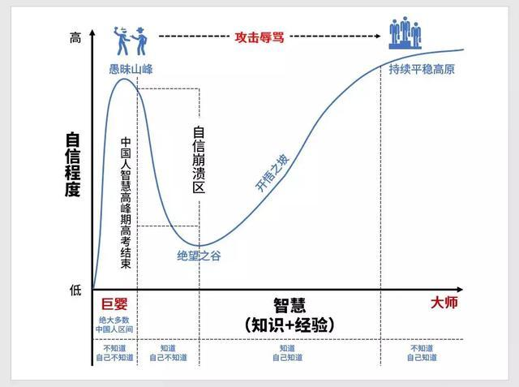

《密码学史》课程作业。是我很感兴趣的一个逻辑问题。

1 引言
2 认知模态逻辑
2.1 简介与基本运算符
2.2 基本公理
2.3 群体知识
3 归纳谜题
3.1 归纳谜题的总体特征
3.2 引言中问题的解析：Common Knowledge 的力量
3.3 其他类似归纳谜题的例子
4 思考与启示
4.1 认知陷阱：Facts & Opinions
4.2 隐式信息：“我不知道”=“我知道”
4.3 达克效应：不知道自己知道
4.4 推理成本：时间与脑力
4.5 已读回执：线下交流与线上的区别
4.6 战术推理：猜疑链
4.7 人工智能：动态认知逻辑
5 结语
6 附录
6.1 陶哲轩博客原文
6.2 引言中命题的证明过程

\tableofcontents

# 写在前面 {#写在前面 .unnumbered}

在上这门课之前，我以为最后我会简单地写一篇关于某种密码的讨论了事。 但老师上课时说，希望我们更关注于信息的产生，传递等方面。 这让我一下子想起一直以来都想不明白的谜题，类似于大家都不知道自己帽子颜色，关灯开灯几次后大家突然都知道了这样的问题。 在这个过程中，信息到底是怎么传播的？这种"我知道你不知道"到底该怎么处理？ 由于我并没有学过逻辑的相关基础知识，不知道相关概念，起初在中文互联网上找资料费了很久也一无进展。 后来巧合之下看到有人讨论陶哲轩提出的问题，惊喜地发现这正是我所想探讨的。 但陶哲轩原文并没有给出解答，也没有提供相关资料。 同样是巧合之下，我在翻阅评论区时点到了认知模态逻辑的维基百科链接，由此才真正地打开了新知识的大门。 认知逻辑通过逻辑的语言重新描述了各种认知概念，又和我在其他地方了解到的知识碎片都产生了链接，使我大受启发。 经此一役，我不仅把困扰多年的归纳谜题搞清楚了，还获得了研究"知道不知道"的有力工具，收获甚大。 故作文记录下所学所想。

# 引言

数学家陶哲轩提出过关于这样一个逻辑推理题的悖论[@tao] （英文原文见附录）。

-   有一个1000人的部落聚居于一个小岛上。他们的宗教信仰禁止他们观察自己眼睛的颜色，也不可和其他人讨论相关话题。 因此，他们每个人都能看到其他人的眼睛颜色，却无法知道自己的。 如果有人通过任何方式知道了自己眼睛的颜色，他将会在信仰的迫使下于第二天正午在村中的广场自杀，且所有人都能看到这一情景。 所有人都是绝对虔诚并且足够理性，且所有人也知道其余人是这样。

-   注："足够理性"指的是由岛民所知的知识能推理出的任何结论，都被认为是岛民所知的。

-   这1000个岛民中，有100个蓝眼睛的人和900个棕眼睛的人。 岛民们原先并不知道这一统计数字，因为他们每个人只能看到除自己之外999个人的眼睛颜色。

-   有一天，一个蓝色眼睛的外来者拜访了这座岛，并且获得了岛民们的信任。 在一个晚上，外来者向全体族人表达了对热情招待他的谢意。 但是由于他不知道岛上的宗教传统，他无意间在他的致谢辞中提到了眼睛颜色： "在世界的这个角落，能遇到跟我一样蓝眼睛的人真是太难得了！" 请问，这一句无心之言将会对这一部族产生什么影响呢？

-   陶哲轩点评说，关于这个问题，有两个看似合理的解释，但是它们却给出了截然相反的结论。

    1.  什么结果也不会发生，因为外来者并没有带来任何**新的信息**。 显然，部落中所有人都能看到部落中有蓝眼睛的人，他们早就知道这一点。

    2.  100天之后，所有的蓝眼睛的岛民都自杀了，这是如下命题的特例。 命题即假设部落中有$n$个蓝眼睛的岛民，那么在来访者说完话之后的第$n$天，所有$n$个蓝眼睛的居民都会自杀。 这一命题很容易通过归纳法证明，证明过程可见附录。

这两个解释乍看之下各自都有道理，那么在这个过程中，**信息到底是怎么传递变化的**？ 为此，我们需要一些认知模态逻辑与归纳谜题的基础知识来帮我们厘清这其中的玄妙之处。

# 认知模态逻辑

## 简介与基本运算符

（本节基于维基[@Epi]）

认知模态逻辑（Epistemic modal logic）是模态逻辑的一个子分支，是一门研究关于知识推理的学科[@Epi]。 认知逻辑的一个基本运算符是$K$，表示"知道某事"。 如果这一知识是某人$a$独有的，则将$a$加在下标上。 因此，对于某个命题$p$，$K_ap$即表示"$a$知道命题$p$"这一命题。 而"不知道"则采用$\neg K$符号表示。

1.  例如，$a$不知道$p$也不知道非$p$，表示为$\neg K_ap \wedge \neg K_a\neg p$。

2.  $K_ap$也是一个命题，$a$知道这一个命题则表示为$K_aK_ap$，即"$a$知道自己知道$p$"。

## 基本公理 {#sec:ax}

（本节的公理介绍基于维基[@Epi]，评述为个人发挥。）

如果我们假定对象是足够理性的，那么有以下几条公理。 这些公理与我们的常识相符，但是此时我们将通过逻辑的语言来考察它们。

分布公理（Distribution axiom）：

:   如果$a$知道命题$p$，也知道$p$能推出$q$，那么$a$也知道$q$。 $$K_ap\wedge K_a(p\Rightarrow q) \quad\Rightarrow\quad  K_aq$$ 这表示$a$这个人非常聪明，在相同的知识条件下，我们需要经过大量费脑筋的逻辑推理才能得出的结论，对于他则是不证自明的。 换言之，此时我们不可能比$a$知道更多的信息。 用"分布"来称呼这一公理看起来并不很合适，反而是用"知识不断扩展的过程"来意会"Distribute"更加贴切一些。

必要性规则（Necessitation rule）：

:   如果$p$是有效的（例如永真式），那么$a$必定知道$p$。 需要注意的是，这并不意味着如果$p$为真，那么$a$必定知道$p$。 例如，"今天要么是星期四要么不是星期四"这个命题为真；而"2022年4月27日晚上雁栖湖下雨了"这个命题也为真。 但是如果随便去街上找个人询问，他一定知道前一个命题，却不一定知道后一个命题。 一方面，这是由于前一个命题是一个永真式；而另一方面，我们在进行研究时其实默认了一个隐性规则， 即我们根据我们的固有认知，武断地认定"今天要么是星期四要么不是星期四"为真。 更准确的解释是，在一些可能的世界中"今天要么是星期四要么不是星期四"为真，在另一些世界中则不一定为真。 对于$a$而言，他认为只有这一命题为真的世界才是可能存在的，因此我们只将讨论范围限定在这一些世界， 并且由此可知在这些世界中$a$都知道"今天要么是星期四，要么不是星期四"。 更严格的解释则需要借助通过语义学进行，此处不展开讨论。

认知与事实公理 （Knowledge or truth axiom）：

:   如果$a$知道$p$，那么$p$一定为真。 $$K_ap \quad\Rightarrow\quad  p$$ 这是一个简明而又意味深长的公理，它指出了"事实（或知识）"与"信念（或观点）"的一个本质区别。 我们可以相信一个命题，即使它是错的；但是在认知逻辑的语义下，我们不能"知道"一个错误的命题，因为这并非事实。 可以用$B_ap$这个记号来表示$a$相信$p$，但是$B_ap$则不能推出$p$。 与认知逻辑类似，"相信"需要使用信念逻辑（Doxastic logic）来研究。 另一方面，通过换质位法可推出 $$p\quad\Rightarrow\quad \neg K_a(\neg p)$$ 即如果一个命题$p$为真，则我们不能知道"$p$为假"，即我们不能存在错误的认知。

正向自省公理（Positive introspection axiom）：

:   $a$知道他自己知道什么。 $$K_ap \quad\Rightarrow\quad  K_a(K_ap)$$ 同样，也可得出其否定形式，即$a$不知道"他不知道自己所知道的事"。 $$\neg  K_a(K_ap) \quad\Rightarrow\quad \neg K_ap$$

负向自省公理（Negative introspection axiom）：

:   $a$知道他自己不知道什么。 $$\neg K_ap\quad\Rightarrow\quad  K_a(\neg K_ap)$$ 同样，也可得出其否定形式，即$a$知道"他不知道自己不知道的事"。 $$\neg K_a(\neg K_ap) \quad\Rightarrow\quad K_ap$$ 这两个公理表明一个理性人能够对自己所掌握的知识了如指掌。 如果他不知道某些知识，那一定是真的不知道，而非一时没在意。 而我们则经常会发现自己忘了自己其实知道某些知识。 另一方面，如果对于某事，理性人不知道自己不知道这件事，那他一定会得出自己其实是知道这件事的结论。 但是对我们来说，这个概念就足够让我们一头雾水。 关于这一点，将在后面`\ref{sec:dk}`{=latex}节中关于达克效应的思考中进一步评述。

## 群体知识

（本节基于维基[@com]等，部分例子除外。）

除了$K_i$运算符之外，还有用于表示群体知识的$E_G,C_G,D_G$运算符，分别表示对于群体$G$的共有知识（Mutual Knowledge，一说General Knowledge），常识（Common Knowledge）和分散式知识（Distributed Knowledge）。乍看之下这三个概念似乎相同，但是将其精巧地区分出来，正是认知逻辑学的精妙所在。 由于中文直译并不达意，故后面的介绍仍采用英文名称。

对于命题$p$，Common Knowledge $C_Gp$表示群体$G$中的所有人不仅知道命题$p$，还知道"所有人都知道命题$p$"，并且也知道"所有人都知道所有人都知道命题$p$"，如此迭代直至无穷。这与我们一般认知中的常识相类似，即大家都认为是理所当然的事情。而Mutual Knowledge $E_Gp$则仅仅表示所有人都知道命题$p$，但大家不能确认其他人是否知道命题$p$。Distributed Knowledge则与这二者有较大的区别。它表示的是群体中同时利用群体中各人各自的知识，所能推出的结论。

可以通过如下形式来定义$E_G$与$C_G$： $$\label{eq:def}
E_Gp \Leftrightarrow \bigwedge_{i\in G}K_ip, \qquad C_Gp\Leftrightarrow \bigwedge_{i=0}^{\infty} E^ip, \qquad E^np \coloneqq E \brack{E^{n-1}p}$$

1.  如果对群体$G$公开宣称命题$p$，那么$C_Gp$就为真，$E_Gp$当然也为真； 而如果向群体$G$中的每个人私下里告知$p$，那么就仅成立$E_Gp$了。并且，即 使进一步向每个人私下里告知"所有人都知道$p$"，也只能成立$E_G(E_Gp)$， 仍然无法成立$C_Gp$。

2.  如果群体$G$中的对象$a$，公开地宣称他知道$p$，那么就成立$C_GK_ap$。 如果群体中每个人都如此做，那么此时$p$就成为了一个Common Knowledge，即由$C_GE_Gp$可推出$C_Gp$。

3.  Distributed knowledge的一个典型例子。对于两个人的群体$G= \left\{ a,b \right\}$而言， $$K_bp\wedge K_a(p\Rightarrow  q) \quad\Rightarrow\quad D_{a,b}q$$ 这表示如果$b$知道$p$（根据认知逻辑的公理，此时$p$一定为真），而$a$知道$p$能推出$q$，那么对于$a,b$组成的群体$G$而言，如果将$a,b$的知识相结合，就能知道$q$。例如，如果小王知道朝阳区发生疫情（$p$），小李知道如果朝阳区发生疫情，那下周的课就得线上上课（$p\Rightarrow q$）。对于小王和小李组成的集体而言，利用这两个信息即可得知下周会线上上课（$q$）。但是他们依靠自己的信息，并不能独立地推知下周会线上上课这一结论。

4.  显然，如果群体中每个人都公开自己所拥有的知识（例如$C_GK_ap$与$C_GK_b(p\Rightarrow q)$），那么对于完全理性的群体而言，原先的Distributed knowledge将成为Common knowledge（如$C_Gq$）。

# 归纳谜题

## 归纳谜题的总体特征

（本节基于维基[@Induc]。）

引言中的问题是一个典型的归纳谜题（Induction puzzles）。 归纳谜题是一类需要用归纳法来求解的多主体推理逻辑谜题[@Induc]。 归纳谜题的构建常含有以下的要素：

1.  每个人都假定是绝对理性的，并且大家都知道所有人都是绝对理性的，这是一个Common Knowledge。

2.  每个人都知道关于其他人的信息，但关于他们自己的信息则往往被限制。这也是一个Common Knowledge。 例如，每个人都能看到其余人的眼睛颜色，但不知道他们自己的眼睛颜色，同时也被限制了借助外物或他人来获知自己眼睛颜色。且大家都知道这一点。

3.  信息常通过非言语交流在主体间传递，并且成为Common Knowledge。例如，所有人都能知道当天是否有人自杀，并且知道其余人也知道这一点。 个人认为，非言语并不是一个必要条件，但是通过非言语手段构建的谜题在描述上更具有艺术性，容易显得高深莫测，博人眼球。

## 引言中问题的解析：Common Knowledge的力量

（本节基于维基[@com]提供的思路再加工而成。）

在理解了群体知识的概念之后，我们可以利用认知逻辑的知识来解答引言中提出的问题。 我们指出，外来者的话将"岛上有蓝眼睛的人"从Mutual Knowledge（以下简记为MK）转化为了Common Knowledge（以下简记为CK），这就是所谓的"**新的信息**"。 分析如下。

我们记岛上所有人的群体为$G$，其中蓝眼睛人组成的群体记为$H$。 当$n=2$时，岛上有两个蓝眼睛的岛民$i,j$，他们各自都知道岛上有蓝眼睛的人，其他人当然也知道。 根据式`\eqref{eq:def}`{=latex}，MK等价于每个人都知道某个命题。 $$K_i(j\in H) \wedge K_j(i\in H) \wedge \brack{\forall m\in G\setminus H,K_m(i,j\in H)} \quad\Rightarrow\quad  E_G \brack{\exists p\in H}$$ 我们将$E_G^n \brack{\exists p\in H}$记为$n$阶MK。 但是，$i,j$都不能确定另一个蓝眼睛的人是否知道一阶MK，因为$i,j$都不知道自己是不是蓝色眼睛。由于至少有一个人不知道一阶MK，二阶MK不能成立。 $$\neg K_i(K_j \brack{ \exists p\in H})\quad\Rightarrow\quad  \neg K_i \brack{E_G \brack{\exists p\in H}} \quad\Rightarrow\quad  \neg E_G ^2 \brack{\exists p\in H}$$

当$n=3$时，岛上有三个蓝眼睛的岛民$i,j,k$。此时一阶MK当然成立。但是对于二阶MK而言，此时由于$i$能看到两个蓝眼睛的人，因此也成立。 $$\begin{aligned}
    &\brack{\bigwedge_{\left\{ a_1,a_2,a_3 \right\}= \left\{ i,j,k \right\}} K_{a_1}(K_{a_2}(a_3\in H)) }
    \\ \wedge &\brack{\forall m\in G\setminus H,K_m(E_G \brack{\exists p\in H})} \quad\Rightarrow\quad  E_G^2  \brack{\exists p\in H}
\end{aligned}$$ 但是同样地，$i,j,k$都不能确定他们三个人之中的另外两个人是否知道一阶MK。 首先分析$i$，$i$认为自己有可能是棕色眼睛，那么在此基础上**以$i$的视角**分析$j$，$j$也认为自己有可能是棕色眼睛，此时$j$会认为$k$不知道有蓝色眼睛的人，即$j$会不认同一阶MK。既然$i$认为$j$有可能不认同一阶MK，那么$i$也有 理由不认同二阶MK。 因此，三阶MK不成立。 $$\neg K_i(K_j(E_G \brack{\exists p\in H}))\quad\Rightarrow\quad  \neg K_i \brack{E_G^2  \brack{\exists p\in H}} \quad\Rightarrow\quad  \neg E_G ^3 \brack{\exists p\in H}$$ 以此类推，我们可以知道，如果岛上有$n$个蓝眼睛的人，那么对于整个岛民群体$G$，虽然每个人都知道岛上有蓝眼睛的人， 但是这个知识至多只能是$n-1$阶MK。而根据定义`\eqref{eq:def}`{=latex}，CK必须是无穷阶的MK，而岛上的居民数当然是有限的。 因此，在外来者公开宣称岛上有蓝眼睛的人之前，"岛上有蓝眼睛的人"并不是CK。 而公开宣称这一过程，将MK转化为了CK，才使得大家的推理得以进行。

那么，为什么必须是CK才能让推理得以进行呢？ 这是由于大家必须从其他人的行为中获得新的信息，因此首先必须得知道其他人所掌握的信息。 以$n=2$的情况为例，注意在岛民的视角，他们不知道$n=2$。

1.  如果$i$猜想自己是棕眼睛（$n_i=1$），那么**$i$认为**此时$j$看到的全是棕眼睛，$j$无法确定$j$自己是蓝眼睛（$n_{ij}=1$）还是棕眼睛（$n_{ij}=0$），故$j$不会自杀。

2.  如果$i$猜想自己是蓝眼睛（$n_i=2$），那么$i$就能认为$j$的推理结果与自己相同。

3.  在$i,j$都没有自杀时，他们各自都能通过对方没有自杀这一事实来确认自己是棕眼睛的可能。另一方面，他们也不能排除自己是蓝眼睛的可能，因为$i,j$是蓝眼睛是事实，根据公理，完全理性的他们不可能得到与事实相反的结论。

4.  因此，$i,j$仍然都不能确定自己的眼睛颜色，在下一天仍然不会自杀，如此循环。

对于更多蓝眼睛人的情况也是类似。可以注意到，仅通过一种路径可以让蓝眼睛的人否决掉自己是棕眼睛的猜想。 那就是第一个人猜想自己是棕眼睛，并且猜想第二个人也认为自己是棕眼睛且猜想第三个人......即 $$B_1( \abs{H}=n-1 \wedge B_2 \brack{\abs{H}=n-2 \wedge B_3 \brack{\cdots B_n(\abs{H}=0)}\cdots})$$ 上面用了$B$这个符号表示猜想而非事实。 由此可知当岛上有蓝眼睛的人不是CK时，其中最里一层的$\abs{H}=0$是无法被否决的， 因为第一个蓝眼睛人知道第二个人知道......第$n-1$个人知道"第$n$个人可能看到的都是棕眼睛，他不知道自己的眼睛颜色"。 但是一旦岛上有蓝眼睛的人成为CK，那么上面引号内的结论就不成立。如果那一个人看到的都是棕眼睛，他就知道自己是蓝眼睛并自杀，并且这也是一个CK。当大家发现第二天没人自杀时，就会每天逐步往前推一层，依次否定$\abs{H}=1,2,\dots$，直至蓝眼睛的人能够否决自己是棕眼睛的猜想，从而同时确认自己是蓝眼睛而同时自杀。

关于CK与有限阶MK的区别还有一个简单而生动形象的例子。如果"靠右行驶"是CK，那么所有人在路上靠右行驶时都会很安心。而如果仅仅是大家都知道要靠右行驶（一阶MK），那么大家在靠右行驶时会提心吊胆，因为大家不知道其他人是否知道要靠右行驶，怕有人从对面靠左行驶而相撞。对于二阶，三阶乃至有限阶MK都是如此，无法让大家真正地完全放心。

## 其他类似归纳谜题的例子 {#sec:other--example}

除了引言中的谜题之外，还有不少知名的逻辑谜题，也属于或类似于归纳谜题。

\begin{description}
\item[泥孩谜题（Muddy Children Puzzle）\cite{Induc}：]\textit{有一群的孩子在泥地里玩，其中有些孩子玩得满脸是泥。
  每个孩子都能看到其他人的脸是不是干净的，却无法看到自己的。
  看管孩子们的老师把他们叫到一起，并且告诉他们有的孩子脸上全是泥巴。
  然后老师从$1$开始数数，每数一个数，认为自己满脸是泥的孩子可以主动站出来。
  假定孩子们具有卓越的推理能力，那么老师数到几时，脸上有泥的孩子们会站出来？}

显然，这和蓝眼睛与棕眼睛问题是完全相同的，很容易找到它们之中各个要素的对应。
\item[国王的智者帽子谜题（The King's Wise Men Hat Puzzle）\cite{Induc}：]\textit{从前，有一位国王想寻找一位足智多谋的顾问。
    他找来了全国最聪明的三个人，意图通过考验来选出其中一个作为顾问。国王请他们闭上眼睛，然后为他们各戴上一顶帽子。帽子有白色与蓝色两种。
    然后，国王请他们睁开眼睛，由此他们能够看到其他两个人的帽子颜色，却无法知道自己的帽子颜色。
  国王告诉他们，三顶帽子中至少有一顶蓝色的帽子，即总共可能有1,2,3顶蓝色帽子。从现在起，谁最先正确说出自己帽子颜色，谁就能成为我的顾问。同时国王声明，他们不能够相互交流，且这个测试对他们三个人是公平的。过了许久，其中一个人正确地说出了他自己帽子的颜色。那么他是怎么知道的？}

这个谜题同样需要分别思考蓝色帽子数为$1,2,3$的情况进行归纳。
但是与泥孩谜题不同之处在于，这里没有给出明确的阶段划分，而是通过“公平”这一声明来让参与者各自独立推理。
若将“公平”条件换为“智者绝对理性，且经过足够长的分析时间”谜题也成立，读者不妨思考一下这是为什么。
当然，我们在分析的时候仍可以按阶段进行。
\item[智者的考验谜题：]\textit{承接国王的智者帽子谜题，在选出顾问后，国王想考验一下这位顾问。
    他仍然把这三个人叫到一起，告诉他们这里共有三顶蓝帽子和两顶白帽子。
    随后国王请他们闭上眼睛并为他们戴上帽子。国王请第一个人睁眼，问他头上帽子的颜色，他看了看说：“我不知道。”
    国王又请第二个人睁眼，问他头上帽子的颜色，他也看了看说：“我不知道。”
    最后国王请顾问睁眼，但顾问说：“不必睁眼了，我知道我头上帽子是蓝色。”国王很高兴。请问，顾问是如何知道的？}

  这一谜题只需要通过简单的排除法即可求解，并没有很显式地用到归纳的知识。这里的“三顶蓝帽子和两顶白帽子”其实和之前问题中“至少有一顶蓝帽子”是等价的。通过这一谜题我们可以直观地认识到“不知道”也是一种“知道”。
\item[帽子谜题的合作方案\cite{Induc}：]\textit{同样是一群人戴着蓝色或红色帽子，他们能看到其他人的帽子颜色却看不到自己的。
    每个人都需要给出关于自己帽子颜色的判断，但不能进行其他交流。如果他们能在游戏开始前秘密商量好按如下方案行动，那么大家都将得到正确答案。
    \begin{enumerate}
    \item 用同样的时间（如一分钟）数出你看到的蓝帽子数和红帽子数。
    \item 取其中较小的一个数，然后等待对应的秒数。
    \item 如果还没有人说话，那么如果你看到的蓝帽子数比红帽子少，就猜测你戴的是蓝帽子并说出来，反之则猜测你戴的是红帽子。
    \item 如果已经有人声称过他的猜测了，那么猜测你的帽子颜色和他声称的相反。
    \end{enumerate}

  这一方案的正确性读者可自行验证。事实上这个问题并不需要通过归纳法来求解，但它与其他归纳谜题的场景构造相似，
  且也涉及到了认知与信息传递相关的问题。
  这一类需要大家商定合作方案，最大化利用有限的信息传递手段，来达到集体最优的问题，也已经自成一派，有非常多的变种。这里就不展开了。
\end{description}

# 思考与启示

## 认知陷阱：Facts & Opinions

认知逻辑中有一种被称为认知陷阱[@Epi]的悖论。它具有如下的形式：

前提1：

:   我知道小王是谁。

前提2：

:   我不知道这个戴着面具的人是谁。

结论：

:   所以，小王不是这个戴着面具的人。

这个推理过程是有问题的，因为小王当然可以是戴着面具的人。 问题出在认知逻辑与信念逻辑的区别上，即如`\ref{sec:ax}`{=latex}节中提到的事实与观点之间的区别： 我们所认知的事实必定是真的，但相信的观点则不一定是真的。 上面这个例子应当如下修改才能成为合理的推断。

前提1：

:   小李认为他知道小王是谁。

前提2：

:   小李认为他不知道这个戴着面具的人是谁。

结论：

:   所以，小李认为小王不是这个戴着面具的人。

事实上，之前经常在英语课，写作课之类的课程上听老师强调要区分Facts and Opinions， 但完全是以文科的形式进行学习。在这里通过认知逻辑的方式又重温了这两个概念，豁然开朗，有了印象更深的理解。

## 隐式信息："我不知道"="我知道"

引言和`\ref{sec:other--example}`{=latex}节中的逻辑谜题之所以广为流传，有很大一个原因是它所讲述的故事乍看之下非常离奇。 为什么大家之间互相没有交流，最后却会同时采取行动？为什么前两个人都说"我不知道"，第三个人却"我知道了"？ 未经训练的受众会因为想不明白这其中信息的流动而啧啧称奇。 但是经过前面如此之多的分析，我们此时已经知道并不是只有简单直接的"我知道......"才能传递信息。 如果把这类信息称为"表面信息"，那么在其他人表示不知道，或不采取行动时，我们所能获得的信息就是"隐式信息"。

在前面的谜题中，隐式信息帮助我们破解谜题。而在日常生活中，如果仔细分析，它们也能为我们所用。 例如，在网购电脑时商家往往会在宣传图片上强调各种硬件参数，这些就属于表面信息。 而懂行的买家就会看商家没有宣传什么参数，从而推测产品实际的性能。 毕竟，如果产品在某一方面做得很好，商家不可能不拿出来宣传，而反之亦然。 正如俗话说"除了听他说了什么，还要听他没说什么"。

## 达克效应：不知道自己知道 {#sec:dk}

达克效应（Dunning--Kruger effect）原本指的是一种自我认知偏差。 在面向大众的科普传播中，其演变为个人认知的四个阶段即"不知道自己不知道"，"知道自己不知道"，"知道自己知道"，"不知道自己知道"，并有如下的示意图。

<figure>

<figcaption>达克效应与自我认知</figcaption>
</figure>

回想前面讨论的认知逻辑，我们知道对于完全理性人而言，只存在"知道自己不知道"和"知道自己知道"两个象限。 在认知逻辑的公理系统中（`\ref{sec:ax}`{=latex}节），"不知道自己不知道$p$"和"不知道自己知道$p$"两个象限分别被"知道$p$"和"不知道$p$"完全包括，因此只存在两个象限。 但是现实中的我们对自己并不是全知的，这两个象限便分离出来。 因此若想对现实中人们的认知进行理论研究，或需要采用不同的公理系统，或需要使用信念逻辑，将"知道"改为"认为"。 当然，这并不完全是一件坏事。毕竟理性人永远无法体会到无知者之乐与"随心所欲不逾矩"之乐。

此外，既然我们对自己不是全知的，那么也许四个象限也不足以描述认知。是否还有"知道自己不知道自己不知道$p$"呢？ 这就一下子很难理解，需要再仔细琢磨了。

## 推理成本：时间与脑力

理论与现实的另一个区别则是现实推理需要耗费的时间与脑力。 在认知逻辑的公理系统中，我们指出如果一个理性人知道$p$且知道$p$能推出$q$，那么这个理性人当然也知道$q$。 但是在现实中这很难成立。一个例子是，大家都知道只能被$1$和它本身整除的数是质数，但是大家并不能马上知道$256040383897895802617$是不是质数------当然在这里我声明这个数确实是我用计算机生成的一个质数。 很显然，对于理性人而言，他知道质数的定义，就等同于他知道了所有的质数。 而对现实人而言，在知道定义后虽然我们能够判断任意一个数是不是质数，但是这可能需要耗费非常长的时间。 更具有冲击力的例子是，当一个理性人看到欧几里得的五条公理时，他就已经知道了《几何原本》的全部内容， 因为书中的定理都是这些公理的推论。并且，他还能知道书中没有写出来的，甚至我们还没有发现的定理。 所以对于理性人而言，也不存在P是否等于NP的问题，因为这只是P/NP问题定义的推论罢了。

在前面的逻辑谜题中，这个假定也起着作用。例如在蓝棕眼睛问题中，如果有人推理耗费的时间太久，到了第三天中午才推出来自己应该在第二天自杀，那么就会使得其他所有人的推理受到误导，陷入混乱而无法进行下去。由此可见，这些逻辑谜题虽然具有令人称奇的现象描述，但在现实生活中却几乎不可能得以复现。

## 已读回执：线下交流与线上的区别

对于重要内容的传达，往往会要求对方提供已读回执。 这主要是为了避免两种信息未传达到的情况：通信信道本身不可靠（客观因素）或是对方未检查消息（主观因素）。

1.  在面对面交流时，对于这两个人而言所有传达的信息都是CK（Common Knowledge），当回答"我知道了"的时候，通过观察对方的反应就能够确认"对 方知道我知道了"以及更高阶的MK（Mutual Knowledge）。可以说这种天然信道是可靠的，并且这个可靠性也是CK。

2.  线上交流时，在通信信道可靠是CK的情况下（如微信一般不会丢失消息是个常识），只需要发送一次已读回执即可排除主观因素。当然，已读回执的接收方可能又暂时离开了，但他迟早会看到，这一般不重要。如果不考虑主观因素或时间因素，那么在这样的信道中流动的信息全部是CK。

3.  但如果通信信道可靠性未知，想要靠已读回执来验证信道可靠性的话，就非常困难了，因为这时候只能传递MK。例如，$a$告诉$b$命题$p$，则成立$K_bp$。$K_ap$当然也成立，故有$E_Gp$，且$K_bE_Gp$。随后$b$发送已读回执，即$K_aE_Gp$，故有$E_G^2 p$。显然，通过有限次交流是不可能达成$C_Gp$，只能通过其他手段。

在信道可靠，主客观因素都排除的情况下，我们可以控制信息成为CK还是MK。 例如，在微信群公开的通知就是CK；单独和所有人私聊告知（或通过邮件密送）就是MK。这相当于和每个人单独各建立一个对于双方都是CK的信道，但对于其他人是不可见的。

## 战术推理：猜疑链

利用认知进行战术推理是极具魅力的。 例如中途岛战役中美军破译了日军的密码，并且知道"日军不知道美军破译了密码"，由此设计了陷阱让日军踩入其中，泄漏了作战的目标，从而大获全胜。 事实上，如果日军知道了自己的密码被破译，而美军却不知道"日军知道美军破译了密码"的话，主动权就又回到日军手中了。日军完全可以利用泄露的密码向美军传达假情报，从而赢得这场战役。 甚至，如果两方首领再敏锐一些，密码被破译这件事甚至已经不重要了，谁想得更深一层谁就拥有了主动权。 但是显然在实际战场上预判对手是一个非常困难的事情。 恐怕日军直到输掉这场战役之后才意识到密码被破译，但显然已经为时已晚。

类似的推理也常常出现在我们日常的牌桌上。每个人最初知道自己手上的牌，在出牌的过程中老手则会记住已经出过的牌，由此来判断其他玩家手上的牌以及意图，而更工于计算的玩家甚至能够对其他人想要做什么，知道什么和不知道什么，以及自己的计划是否暴露也一清二楚。

《三体》中提到的猜疑链也有类似之处。这是双方都知道信道不可靠的情况。 以两个人为例$i,j$，$i$不知道$j$是否会攻击$i$，但是$i$知道$j$不知道$i$会不会攻击自己。 双方都知道对方不知道自己会不会发动攻击。 因此在信道不可靠是CK的情况下，双方并不是毫无所知，反而能知道双方的行动只有自己清楚；再加上一点博弈论知识，就足够导致灾难性的结果。

## 人工智能：动态认知逻辑

认知逻辑虽然采用了一些理想假设，但在一定程度上仍能帮助我们理解人们知识的演化过程。 而近年来兴起的人工智能则更需要认知逻辑的帮助。 例如，一个智能管家机器人应当能够知晓主人知道什么与不知道什么，传达信息后将其从"主人未知"状态转变为"主人已知"状态， 从而减少重复信息的播报，提高效率。而对于多个人工智能互相通信的场景，例如合作破解谜题，联邦学习等情景，每一方只有部分信息， 有时需要人工智能具有较强的推理能力。

为此，人们开发了动态认知逻辑（Dynamic epistemic logic, DEL）[@del]。它是一个用于处理知识与信息交换的逻辑框架，研究多主体的知识在事件影响下的变化情况。 DEL所研究的内容除了前述的归纳谜题，还有博弈情景等，应用于经济学与人工智能领域。DEL的具体细节十分复杂，有兴趣的读者可以自行了解。

# 结语

在本文中，我们首先介绍了一个知名的逻辑问题，并提出信息是如何传递的问题。 接着，我们首先介绍了认知模态逻辑的基础知识。 认知模态逻辑中最基本的运算符是"知道"，具有一些符合常识的基本公理。 我们可能早已了解这些基本公理的内涵，但此时从逻辑的角度重新审视，又获得了一些新的体悟。 当研究的对象扩展为群体知识时，又新增了三个运算符，分别表示Common Knowledge（CK），Mutual Knowledge（MK）和Distributed Knowledge（DK）。它们所代表的含义有细微的区别。 CK代表大家都知道也知道其他人知道的知识，MK代表大家都知道但不知道其他人知道的知识，而DK则代表需要大家合作才能知道的知识。

在介绍完认知逻辑的基础知识后，我们认识了归纳谜题这一概念及其特征，利用所学到的认知逻辑工具对最初的问题作了剖析，指出关键在于CK与有限阶MK的区别。我们也了解到归纳谜题有许多兄弟姐妹，它们都体现了信息能够暗中流动。

认知逻辑的相关知识也给我们带来不少启发。

-   关于认知陷阱，我们给出了一个悖论并讨论了Facts and Opinions的区别。我们无法知道假的Facts，却可以相信假的Opinions。

-   关于隐式信息，我们讨论了之前谜题中人物看似莫名其妙获得信息的反常现象，并指出在生活中留意这些信息也是有益的。

-   关于达克效应，我们讨论了认知逻辑与实际的第一个区别：人们对自己并不是全知的，存在"不知道自己不知道"和"不知道自己知道"两个新象限。但这也是人之所以区别于机器所在。

-   关于推理成本，我们讨论了认知逻辑与实际的第二个区别：人们不可能立刻知道命题的所有推论。因此这些归纳谜题很难在实际中复现，在利用认知逻辑进行研究时需要考虑推理能力。

-   关于已读回执，我们讨论了交流信道对信息成为MK还是CK的影响。线下交流时信息几乎都是CK，但线上办公时则需要注意信息有可能是MK。

-   关于战术推理，我们给出了美军利用日军密码设下陷阱，日常打牌和《三体》中猜疑链的例子。在这些例子中人们都利用了对方所知和对方所不知的信息，决定下一步如何行动，获取优势。

-   关于人工智能，我们讨论了如果主体都是机器人时，它们的认知发展与行动策略。对此，需要采用动态认知逻辑的框架进行研究。

由此可见认知逻辑与各方面的日常经验都有着联系，逻辑学真不愧为世界运行的基石！ `\printbibliography[title=参考资料]
`{=latex}

# 附录

## 陶哲轩博客原文

There is an island upon which a tribe resides. The tribe consists of 1000 people, with various eye colours. Yet, their religion forbids them to know their own eye color, or even to discuss the topic; thus, each resident can (and does) see the eye colors of all other residents, but has no way of discovering his or her own (there are no reflective surfaces). If a tribesperson does discover his or her own eye color, then their religion compels them to commit ritual suicide at noon the following day in the village square for all to witness. All the tribespeople are highly logical and devout, and they all know that each other is also highly logical and devout (and they all know that they all know that each other is highly logical and devout, and so forth).

\[Added, Feb 15: for the purposes of this logic puzzle, "highly logical" means that any conclusion that can logically deduced from the information and observations available to an islander, will automatically be known to that islander.\]

Of the 1000 islanders, it turns out that 100 of them have blue eyes and 900 of them have brown eyes, although the islanders are not initially aware of these statistics (each of them can of course only see 999 of the 1000 tribespeople).

One day, a blue-eyed foreigner visits to the island and wins the complete trust of the tribe.

One evening, he addresses the entire tribe to thank them for their hospitality.

However, not knowing the customs, the foreigner makes the mistake of mentioning eye color in his address, remarking "how unusual it is to see another blue-eyed person like myself in this region of the world".

What effect, if anything, does this faux pas have on the tribe?

The interesting thing about this puzzle is that there are two quite plausible arguments here, which give opposing conclusions:

\[Note: if you have not seen the puzzle before, I recommend thinking about it first before clicking ahead.\]

**Argument 1.** The foreigner has no effect, because his comments do not tell the tribe anything that they do not already know (everyone in the tribe can already see that there are several blue-eyed people in their tribe).

**Argument 2.** 100 days after the address, all the blue eyed people commit suicide. This is proven as a special case of

> **Proposition.** Suppose that the tribe had n blue-eyed people for some positive integer n. Then n days after the traveller's address, all n blue-eyed people commit suicide.

## 引言中命题的证明过程

当$n=1$时，这个蓝眼睛的岛民看到除了他自己外，岛上其余人都是棕色眼睛，因此他立刻会意识到自己是蓝色眼睛，并在后一天自杀。当$n=2$时，这两个蓝眼睛的岛民都能看到其余人中只有一个人是蓝色眼睛，因此他们第一天无法判断，没有人自杀。而在第二天，既然前一天没有人自杀，那么所有人都知道不可能只有一个人是蓝眼睛（因为$n=1$时第一天必定有人自杀），那么至少有两个。由此，这两个岛民此时能够意识到自己是蓝眼睛，并在下一天自杀。以此类推。
