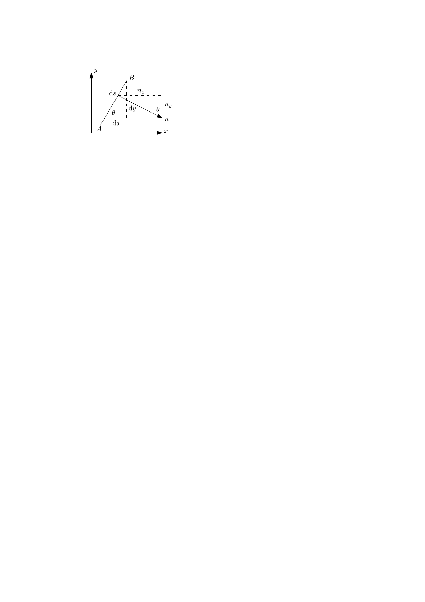

2021年秋季学期，基于《中小尺度天气学》课程中高守亭老师，冉令坤老师主讲部分内容整理而成。

\tableofcontents

# 中小尺度动力学基本知识

## 基本大气动力参数

Rossby数

:   是惯性力与科氏力的比值。 $$Ro=\frac{\rho U^2 /L}{\rho fU}=\frac{U}{fL}$$

内Froude数

:   是惯性力与浮力的比值。 $$Fr_i= \sqrt{\frac{\rho_0U^2 /L}{(\rho_2-\rho_1)g}}= \frac{U}{\sqrt{g'L}} \qquad g'=g \frac{\rho_2-\rho_1}{\rho_0}$$ 可以引入浮频率来表示$g'$ $$g'\approx g H \frac{1}{\rho_0} \pp{\rho}{z}=N^2 H$$ 即 $$Fr_i=\frac{U}{N \sqrt{HL}}$$

Burger数

:   $$Bu= \brack{\frac{fL}{NH}}^2 = \brack{\frac{Fr_i}{Ro}}^2$$

Richardson数

:   $$Ri=\frac{N^2 }{ \brack{\dd{\overline{u}}{z}}^2 }$$

下面通过两个例子来阐释Richardson数的物理意义。

\begin{example}[两层切变流的混合]\marginnote{Introduction to geophysical fluid dynamics, Benoit Cushman-Roisin, 14.1, p421.}  考虑两层切变流混合过程的能量变化。初始时，两层流厚度均为$H/2$。上层密度，速度为$\rho_1,U_1$，下层则为$\rho_2,U_2$，$\rho_2>\rho_1$。假定发生混合，在此之后，整体形成厚度为$H$的流动，密度，速度记为$\rho,U$。由质量守恒可知
\begin{equation}
\rho=\frac{\rho_1+\rho_2}{2}
\end{equation}
则势能变化为
\begin{equation}
\begin{aligned}
  \Delta PE&=\int_0^H\rho_{after}(z)gz\d z-\int_0^H\rho_{before}(z)gz\d z\\
       &=\frac{1}{2}\cdot \frac{\rho_1+\rho_2}{2} g H^2 -\brack{ \frac{1}{2}\rho_2g\cdot \frac{1}{4}  H^2 +\frac{1}{2}\rho_1g \cdot \frac{3}{4} H^2 }\\
  &=\frac{1}{8}(\rho_2-\rho_1)g H^2
\end{aligned}
\end{equation}

在考虑动量与动能时，我们忽略密度的差异，或引用Boussinesq近似，取$\rho_1\approx\rho_2$，记为$\rho_0$，那么由动量守恒可知
\begin{equation}
U=\frac{U_1+U_2}{2}
\end{equation}
则动能变化为
\begin{equation}
  \begin{aligned}
    \Delta KE&= \frac{1}{2}\rho U^2H -\brack{\frac{1}{2}\rho_1U_1^2 \frac{H}{2}+\frac{1}{2}\rho_2U_2^2 \frac{H}{2}}\\
    &=\frac{1}{8}\rho_0 H \brack{U_1^2 +2U_1U_2+U_2^2 -2U_1^2 -2U_2^2 }\\
    &=-\frac{1}{8}\rho_0H (U_1-U_2)^2
  \end{aligned}
\end{equation}
由此可见，在混合过程中势能增加，动能减少。其增加量与减少量的比例为
\begin{equation}
\frac{\abs{\Delta PE}}{\abs{\Delta KE}}= \frac{(\rho_2-\rho_1)gH^2 }{\rho_0H(U_1-U_2)^2 }=\dfrac{\dfrac{g}{\rho_0}\dfrac{\rho_2-\rho_1}{H}}{\brack{\dfrac{U_1-U_2}{H}}^2 }=\frac{N^2 }{ \brack{\dd{\overline{u}}{z}}^2 }=Ri
\end{equation}
这表示Richardson数衡量了剪切流混合中能量的变化情况。如果$Ri<1$，那么势能增加小于动能减少，多余的能量可以供给不稳定发生。因此$Ri<1$是发生不稳定的一个必要条件。
\end{example}
\begin{example}[气块的混合]考虑两气块交换位置前后的能量变化情况。假设气块A处于高度为$z$的位置，气块B处于高度为$z+h$的位置，$h$很小。
  记高度为$z$处，环境的位温，密度，水平风速，压强为$\theta_0,\rho_0,U_0,p_0$，高度为$z+h$处环境量相应为$\theta_1,\rho_1,U_1,p_1$，由Taylor展开得
  \begin{align}
    \theta_1&=\theta_0+\theta'h \qquad  \theta'=\dd{\theta}{z}\bigg|_z \\
    \rho_1&=\rho_0+\rho' h \qquad  \rho'=\dd{\rho}{z}\bigg|_z \\
    U_1&=U_0+U'h \qquad  U'=\dd{U}{z}\bigg|_z
  \end{align}
由位温的定义，
\begin{equation}
\theta=T \brack{\frac{p_s}{p}}^{R/c_p}=\frac{p}{\rho R} \brack{\frac{p_s}{p}}^{R/c_p} \quad\Rightarrow\quad  \rho \theta=g(p)
\end{equation}
可知$\rho\theta$只是压强$p$的函数，即
\begin{equation}
\rho_0\theta_0=g(p_0) \qquad\rho_1\theta_1=g(p_1)
\end{equation}
假设气块在调整过程中，压强立刻适应环境压强，且位温不变。气块A初始密度，位温为$\rho_0,\theta_0$，当其移动到$z+h$高度时，位温仍为$\theta_0$，密度成为$\rho_A$。
\begin{equation}
\rho_A\theta_0=g(p_1)=\rho_1\theta_1 \quad\Rightarrow\quad  \rho_A=\frac{\rho_1\theta_1}{\theta_0}\approx \rho_0+\rho'h+\rho_0 \frac{\theta'}{\theta_0}h
\end{equation}
同理，气块B初始密度，位温为$\rho_1,\theta_1$，当其移动到$z$高度时，位温仍为$\theta_1$，密度成为$\rho_B$。
\begin{equation}
\rho_B=\frac{\rho_0\theta_0}{\theta_1}\approx\rho_0 \brack{1- \frac{\theta'}{\theta_0}h}
\end{equation}
势能的变化为
\begin{equation}
  \begin{aligned}
    \Delta PE=&(\rho_Ag(z+h)+\rho_Bgz)-(\rho_0gz+\rho_1g(z+h))\\
    =&(\rho_A-\rho_1)g(z+h)+(\rho_B-\rho_0)gz\\
    =&\rho_0 g\frac{\theta'}{\theta_0}h^2 \\
    =&\rho_0N^2 h^2
\end{aligned}
\end{equation}
在考虑动能变化时，同样忽略密度的小变化，均记为$\rho_0 $。假设交换后两气块水平速度均为$z+h/2$高度处的水平速度，则动能变化为
\begin{equation}
  \begin{aligned}
    \Delta KE=&2\cdot \frac{1}{2} \rho_0   \brack{U_0+\frac{U'h}{2}}^2  -\frac{1}{2}(\rho_0  U_0^2 +\rho_0  U_1^2 )\\
    =&\rho_0  U_0^2 +\rho_0  U_0U' h+\frac{1}{4}\rho_0  U'^2 h^2 -\brack{\rho_0  U_0^2 +\rho_0  U_0U'h+\frac{1}{2}\rho_0  U'^2 h^2 }\\
    =&-\frac{1}{4}\rho_0  U'^2 h^2
\end{aligned}
\end{equation}
记水平动能变化为$\Delta k$，则由能量守恒定律得
\begin{equation}
\Delta k=-\Delta KE-\Delta PE
\end{equation}
如果运动是稳定的，那么$\Delta k<0$，即
\begin{equation}
\rho_0N^2 h^2 -\frac{1}{4}\rho_0 U'^2 h^2 >0 \quad\Rightarrow\quad  \rho_0U'^2 h^2 \brack{Ri-\frac{1}{4}}>0
\end{equation}
可见$Ri>1/4$是运动稳定的一个判据。

\spacerule
如果不以平均速度考虑末动能，结果为
\begin{equation}
  \begin{aligned}
    \Delta KE=&\frac{1}{2}\brack{\rho_AU_1^2 +\rho_BU_0^2 }-\frac{1}{2} \brack{\rho_0U_0^2 +\rho_1U_1^2 }\\
    =&\frac{1}{2} (\rho_A-\rho_1)U_1^2 +\frac{1}{2}(\rho_B-\rho_0)U_0^2 \\
    =&\frac{1}{2}\rho_0 \frac{\theta'}{\theta_0}h (U_1^2-U_0^2 )\\
    \approx&\rho_0 \frac{\theta'}{\theta_0}U_0U'h^2
  \end{aligned}
\end{equation}
怎么分析呢？TODO....
\end{example}
\newpage

## 中尺度运动及基本方程组

中尺度运动主要可以分为三个尺度。`\marginnote{Orlanski(1975)尺度标准}`{=latex}

\centering

  ----------------------------------- -------------------- -------------- --------------
                 尺度                         系统              例子         持续时间
     $2 \unit{km}$- $20 \unit{km}$     中$\gamma$尺度系统       龙卷       几至几十分钟
    $20 \unit{km}$- $200 \unit{km}$    中$\beta$尺度系统    强对流，飑线      几小时
   $200 \unit{km}$- $2000 \unit{km}$   中$\alpha$尺度系统    气旋，台风     一天至几天
  ----------------------------------- -------------------- -------------- --------------

  : 中尺度系统划分

**理想正压未饱和湿空气方程组** $$\begin{dcases}
&\pp{u}{t}+u \pp{u}{x}+v \pp{u}{y}-fv=-g \pp{h}{x} \\
&\pp{v}{t}+u \pp{v}{x}+v \pp{v}{y}+fu =-g \pp{h}{y}\\
&\pp{h}{t}+u \pp{h}{x}+v \pp{h}{y}+ h \brack{ \pp{u}{x}+ \pp{v}{y}}=0
\end{dcases}$$ **理想斜压未饱和湿空气方程组** $$\begin{dcases}
&\dd{\bm{v}}{t}+f \bm{k}\times \bm{v} =-\frac{1}{\rho}\nabla p-g \bm{k}\\
& \pp{\rho}{t}+\nabla\cdot (\rho \bm{v})=0\\
& \dd{\theta}{t}=0
\end{dcases}$$ 引入无量纲数$\pi=(p/p_0)^{R/c_p}$，可得适用于中尺度的基本方程组 $$\begin{dcases}
&\dd{\bm{v}}{t}+f \bm{k}\times \bm{v} =-c_p\theta\nabla\pi+g \bm{k}\\
& \pp{\pi}{t}+\frac{R\pi}{c_v}\nabla\cdot  \bm{v}=0\\
& \dd{\theta}{t}=0
\end{dcases}$$ `\newpage`{=latex}

## 风

\marginnote{21/09/13}

### 流线与迹线

**流线**(streamline)是处处与瞬时的风矢量相切的一条线。 以$\d \bm{r}$代表某一条流线上的线元，其分量为$\d x, \d y$，$\bm{v}$表示速度，两者相切的条件是 $$\bm{v}\times \d \bm{r}= \abs{\bm{v}} \abs{\d  \bm{r}} \sin \theta= \bm{0}$$ `\marginnote{注：对于三维的情况，流线方程为
\begin{equation*}
\frac{\d x}{u}=\frac{\d  y}{v}=\frac{\d z}{w}=\d s
\end{equation*}}`{=latex}

用行列式展开叉乘可得 $$\bm{v}\times \d \bm{r}=  \begin{vmatrix}
    \bm{i} & \bm{j} & \bm{k}\\
    u&v&0\\
    \d x &\d  y&0
  \end{vmatrix}=(u \d y- v\d x) \bm{k}$$ 即导出流线的方程为 $$\dd{y}{x}= \frac{v(x,y)}{u(x,y)}$$

**迹线**(trajectory)指空气块在各个连续时刻所在位置构成的曲线。

\marginnote{注：迹线方程为
\begin{equation*}
\frac{\d x}{u}=\frac{\d  y}{v}=\frac{\d z}{w}=\d t
\end{equation*}
}

考察流线与迹线的关系，设$\beta$为风向，$K_s$和$K_t$分别表示流线，迹线的曲率。 如此，风向的变化率可如下表示。 $$\dot{\beta}=v K_t$$ `\marginnote{曲率为曲率圆半径的倒数。}`{=latex} 而$\dot{\beta}$可以利用物质导数展开，得 $$\dot{\beta}=\dd{\beta}{t}= \pp{\beta}{t}+ v\cdot\nabla\beta= \pp{\beta}{t}+v \pp{\beta}{s} = \pp{\beta}{t}+ v K_s \qquad K_s\coloneqq \pp{\beta}{s}$$ 此处$\partial_s$表示沿着曲线（流线）方向求方向偏导数。由上面两式，得到两个曲率的关系 $$\pp{\beta}{t}= v(K_t-K_s)$$ 由上式可见，当$\partial_t\beta$为零时，两曲率相等，流线与迹线重合。特别地，在定常流中这一条件显然满足。

### 流函数

考虑二维不可压方程 $$\pp{u}{x}+ \pp{v}{y}=0$$ 可以引入流函数$\psi$，其满足 $$u=-\pp{\psi}{y} \qquad  v= \pp{\psi}{x}$$ 将其代回到不可压方程中，容易验证。 $$-\ppm{\psi}{x}{y}+ \ppm{\psi}{x}{y}=0$$

流函数的物理意义可如下考虑。考虑二维平面上的一条曲线$C$，计算[在此刻]{.underline}通过这条线的速度通量。 其计算过程如下。`\marginnote{线元的切向与法向单位向量表达式为
\begin{align*}
  &\bm{t}= \dd{x}{s}\bm{i}+\dd{y}{s}\bm{j}\\
  &\bm{n}= \dd{y}{s}\bm{i}-\dd{x}{s}\bm{j}
\end{align*}}`{=latex} $$\begin{aligned}
  \int_C \bm{v}_h\cdot \bm{n}\d s&=\int_C  \brack{u \bm{i}+v \bm{j}} \brack{\dd{y}{s}\bm{i}- \dd{x}{s}\bm{j}}\d s\\
  &=\int_C \brack{- \pp{\psi}{y}\d y- \pp{\psi}{x}\d x}\\
  &=-\int_C\d  \psi=\psi_1-\psi_2
\end{aligned}$$ `\marginnote{
\begin{equation*}
\sin\theta= \dd{y}{s} \quad \cos\theta = \dd{x}{s}
\end{equation*}
\begin{equation*}
n_x=n \sin \theta \quad n_y=n \cos \theta
\end{equation*}
其中$n=1$}`{=latex} 可见通过任意一条线的速度通量，即为这条线两端的流函数值之差。

如果曲线$C$正好就是流线，由于流线是速度矢量连成的线，自然不会有速度通过流线，即通量应为零。 由此，结合上面的结论可知同一条流线上流函数的值处处相等，即流线就是流函数的等值线。下面来证明这一点。

结合流线的定义式，有 $$\frac{\d x}{- \pp{\psi}{y}} = \frac{\d y}{\pp{\psi}{x}} \quad\Rightarrow\quad  \pp{\psi}{x}\d x+\pp{\psi}{y}\d y=\d \psi=0$$ 由此得$\psi=C$，即证明了沿流线流函数保持常数。

注：注意以上讨论均针对同一时刻而言。

### 速度势

如果流体运动旋度为零，可类似流函数引入速度势$\chi$，其满足 $$\pp{\chi}{x}=u \qquad \pp{\chi}{y}=v$$ 容易验证 $$\xi=\pp{v}{x}-\pp{u}{y}=0$$ 注：三维的情况，定义类似。

基于速度势和流函数，可以定义复速度势 $$w(z)=\chi(x,y)+\i \psi(x,y) \qquad z=x+\i y$$ 如果$w(z)$可微，那么存在 $$\dd{w}{z}=\pp{\chi}{x}+\i \pp{\psi}{x}= \pp{\psi}{y}-\i \pp{\chi}{y}$$ 以及Cauchy-Riemann关系 $$\pp{\chi}{x}=\pp{\psi}{y} \qquad \pp{\chi}{y}=- \pp{\psi}{x}$$ 并可导出$\chi$和$\psi$均满足Laplace方程$\Delta \psi=\Delta \chi=0$，以及$\nabla \chi\cdot \nabla \psi=0$。 这说明流函数和势函数的等值线互相正交。

### 风的微分性质

在原点展开风速场，有`\marginnote{$O(2)$表示二阶及以上的小量。这些偏导数均在原点取值。}`{=latex} $$u=u_0+ \pp{u}{x}x+\pp{u}{y}y+O(2) \qquad v=v_0+ \pp{v}{x}x+ \pp{ v}{y}y+O(2)$$ 忽略高次项，引入散度和涡度 $$\delta= \pp{u}{x}+ \pp{v}{y}\qquad\zeta= \pp{v}{x}-\pp{u}{y}$$ 以及表征变形的量 $$E_{st}= \pp{u}{x}-\pp{v}{y} \qquad E_{sh}= \pp{v}{x}+\pp{u}{y}$$ 则风速可表为 $$\begin{aligned}
u&=u_0+ \frac{1}{2} \brack{\delta+E_{st}}x+ \frac{1}{2} \brack{E_{sh}-\zeta}y\\
v&=v_0+\frac{1}{2}  \brack{E_{sh}+\zeta}x+\frac{1}{2} \brack{\delta-E_{st}}y
\end{aligned}$$ 方程中各项表示平移，变形，扩张，旋转。具体可见书P31。

从散度场和涡度场重建风场的数学过程见P33。可得Helmholtz分解表达式为 $$\bm{v}_h=\nabla\chi+\nabla\times \psi$$

### 等熵流

考虑Lagrange坐标$\bm{\xi}$，引入坐标转换的偏导矩阵。`\marginnote{本小节采用张量表示方法，注意区分标量，矢量（一阶张量），矩阵（二阶张量）}`{=latex} $$\nabla \bm{\xi} =  \pp{\xi^I}{x^i}  \qquad \nabla_{\xi}\bm{x}= \pp{x^i}{\xi^I} \qquad I,i=1,2,3$$

根据流体的Lagrange描述和Euler描述的转换关系，有以下结论： $$\label{eq:1}
\brack{\pp{}{t}}_{\xi}=\dd{}{t}$$

考虑无摩擦等熵流体，记$H$为焓，$\Phi$为外力的势能。在Euler坐标系下原始运动方程为 $$\dd{\bm{v}}{t}=-\frac{1}{\rho}\nabla p-\nabla \phi$$ 结合以下热力学关系 $$\nabla s= \frac{c_p}{\theta}\nabla\theta=\frac{c_p}{T}\nabla T-\frac{R}{p}\nabla p \quad\Rightarrow\quad -\frac{1}{\rho}\nabla p=T\nabla s-\nabla H$$ 可将方程写为 $$\label{eq:2}
\dd{\bm{v}}{t}=T\nabla s-\nabla(H+\phi)$$

将`\eqref{eq:2}`{=latex}代入如下方程中，利用`\eqref{eq:1}`{=latex}，和链式法则$\nabla_{\xi}\bm{x}\cdot\nabla=\nabla_{\xi}$，可得 $$\begin{aligned}
  \dd{}{t} \brack{ \nabla_{\xi}\bm{x}\cdot \bm{v}}&= \brack{\brack{\pp{}{t}}_{\xi}\nabla_{\xi}\bm{x}}\cdot \bm{v}+\nabla_{\xi}\bm{x}\cdot \dd{}{t}\bm{v}\\
   &=\nabla_{\xi}\frac{\bm{v}^2 }{2}+\nabla_{\xi}\bm{x}\cdot \dot{\bm{v}}\\
  &=T\nabla_{\xi}s-\nabla_{\xi}(H+\phi-v^2/2)
\end{aligned}$$ 令$\dot{\Lambda}=T,\dot{\Psi}=H+\phi-v^2 /2$，注意等熵流中$\dd{s}{t}=0$，对上式时间积分得 $$\nabla_{\xi} \bm{x}\cdot \bm{v}-\nabla_{\xi} \bm{x}\big|_{t=0}\bm{v}_0=\Lambda \nabla_{\xi}s-\nabla_{\xi}\Psi$$ 注意$t=0$时两坐标系重合，$\nabla_{\xi} \bm{x}$为单位矩阵。在两边点乘$\nabla\bm{\xi}$最终得到 $$\bm{v}=\Lambda \nabla s-\nabla\Psi+\nabla \bm{\xi}\cdot \bm{v}_0$$ 即无摩擦等熵流的运动方程。该方程将$\bm{v}$显式地表示出来。 `\marginnote{“Lagrangian坐标和Euler坐标的转换称为Web变换。”\\——高老师说的，但我暂时没查到相关资料。}`{=latex}

### 变形场及应用

锋生函数，原为 $$F=\dd{\abs{\nabla\theta}}{t}$$ `\marginnote{暂时没找到书中相关资料。}`{=latex} 引入变形场后，可表为 $$F=\pp{}{t} \abs{\nabla E}$$

### 变压风

\marginnote{本节内容参考S. 佩特森《天气分析与预报 上》第四章4.6节}

变压风模型用于研究空气经过变化气压场时的表现。该模型需要引入一些近似。

首先是地转风近似，即加速度比科氏加速度小得多。其次是二级地转风近似，即 加速度的时间导数比科氏加速度的时间导数小得多。书中认为二级地转风近似无法从动力上衡量其恰当性， 但基本符合实际情况。此外假设运动水平无摩擦，密度均匀分布。

考虑地转方程`\marginnote{在$p$坐标系中气压梯度力表达略有不同，此处结合原书方便推导不采用$p$坐标系。}`{=latex} $$\dot{u}=-\frac{1}{\rho} \pp{p}{x}+f v \qquad \dot{v}=-\frac{1}{\rho} \pp{p}{y}-f u$$ 对其再求一次时间导数，得 $$\ddot{u}=-\frac{1}{\rho} \pp{\dot{p}}{x}+f \dot{v} \qquad \ddot{v}=-\frac{1}{\rho} \pp{\dot{p}}{y}-f \dot{u}$$ 用地转方程消去$\dot{u},\dot{v}$得 $$\begin{dcases}
& \ddot{u}=-\frac{1}{\rho} \pp{\dot{p}}{x}-f \frac{1}{\rho} \pp{p}{y}-f^2 u\\
&\ddot{v}=-\frac{1}{\rho} \pp{\dot{p}}{y}+f \frac{1}{\rho} \pp{p}{x} -f^2  v
\end{dcases}$$ 根据二级地转风近似，设$\ddot{u},\ddot{v}$均为零，并引入地转风的表达式得 $$\begin{dcases}
&f^2 (u-u_g)=-\frac{1}{\rho} \pp{\dot{p}}{x}=-\frac{1}{\rho} \brack{\ppm{p}{x}{t}+u\ppn{p}{x}+v\ppm{p}{x}{y}}\\
&f^2 (v-v_g)=-\frac{1}{\rho} \pp{\dot{p}}{y}=-\frac{1}{\rho} \brack{\ppm{p}{y}{t}+u\ppm{p}{x}{y}+v\ppn{p}{y}}
\end{dcases}$$ 在式中，$\partial_tp$体现了变压的影响。我们记 $$J_x=-\frac{1}{\rho f^2 }\ppm{p}{x}{t} \qquad J_y=-\frac{1}{\rho f^2 }\ppm{p}{y}{t}$$ 注意到$J_x,J_y$具有与速度相同的量纲，故称为变压风。

其余偏导数项表示等压线的弯曲情况。 将$x$轴取成等压线方向，$y$轴取成垂直等压线方向，则可用曲率简单地表示偏导数。记$K_i$为切线曲率，$K_n$为正交曲率（即法线曲率），有 $$\ppn{p}{x}=-K_i \pp{p}{y} \qquad \ppm{p}{x}{y}=K_n \pp{p}{y}$$ 同时，在这个瞬间$\partial_xp$为零，$v_g=0$。但是$\partial_{xt}p$仍可能有值。 将剩余的偏导数再用地转风表示，可以将方程整理成如下形式 $$\pmbb{A}{B}{C}{D}\pmba{u}{v}+\pmba{E}{F}=\pmba{0}{0}$$ 其中 $$A=-f(f+u_gK_i) \qquad B=C=fu_gK_n \qquad D=-f \brack{f- \pp{u_g}{y}}$$ $$E=f^2 (u_g+J_x )\qquad F=f^2 J_y$$ 从中可解得 $$u=\frac{CF-DE}{AD-C^2 } \qquad v=\frac{CE-AF}{AD-C^2 }$$ 一个简单的例子是等压线平行均匀分布的情况，此时$K_i=K_n=0$，$\partial_yu_g=0$，易得 $$u=u_g+J_x\qquad v=J_y$$ 将其写为矢量形式，可见实际风与地转风相差变压的时间偏导数项，即 $$\bm{u}=\bm{u}_g+\bm{J}=\bm{u}_g-\frac{1}{\rho f^2 } \nabla \pp{p}{t}$$ 这称为勃隆特-道格拉斯方程。

\newpage

## 涡度

### 涡度方程

如下导出涡度过程。 基本运动方程为 $$\pp{\bm{v}}{t}+\bm{v}\cdot\nabla \bm{v}+f \bm{k}\times \bm{v}=-\frac{1}{\rho}\nabla p+\nabla\phi+\bm{F}$$ 其中$\phi$为保守力（如重力的位势），$\bm{F}$为非保守力（如摩擦力）。 利用矢量公式\
$\bm{v} \cdot\nabla \bm{v}=\nabla v^2 /2+\bm{\xi}\times \bm{v}$，可将方程化为 $$\pp{\bm{v}}{t}+\bm{\xi}\times \bm{v}+f \bm{k}\times \bm{v}=-\frac{1}{\rho}\nabla p+\nabla(\phi-v^2 /2)+\bm{F}$$ 注意梯度的旋度为零，作叉乘后得到 $$\ppt \brack{\nabla\times \bm{v}}+\nabla \times \brack{\brack{\bm{\xi}+f\bm{k}}\times \bm{v}}=\frac{1}{\rho^2 }\nabla p\times \nabla \rho+\nabla\times \bm{F}$$ 定义$\bm{\xi}_a\coloneqq \bm{\xi}+f\bm{k}$为绝对涡度。利用公式 $$\nabla\times(\bm{a}\times \bm{b})=(\bm{b}\cdot\nabla )\bm{a}-(\bm{a}\cdot\nabla )\bm{b}+\bm{a}\nabla \cdot \bm{b}-\bm{b}\nabla\cdot \bm{a}$$ 可得 $$\nabla\times(\bm{\xi}_a\times \bm{v})=\bm{v}\cdot\nabla \bm{\xi}_a- \bm{\xi}_a\cdot\nabla \bm{v}+\bm{\xi}_a\nabla\cdot \bm{v}-\underbrace{\bm{v}\nabla\cdot\bm{\xi}_a}_{=0}$$`\marginnote{2021/09/15}`{=latex} 代回方程中，得到 $$\label{eq:12}
\pp{\bm{\xi}_a}{t}+\bm{v}\cdot\nabla \bm{\xi}_a= \bm{\xi}_a\cdot \nabla\bm{v}-\bm{\xi}_a\nabla\cdot \bm{v}+\frac{1}{\rho^2 }\nabla \rho\times\nabla p+\nabla\times \bm{F}$$ 其中$\nabla\rho\times \nabla p/\rho^2$项称为力管项。绝对涡度方程两边点乘$\bm{k}$即得到绝对垂直涡度$\zeta_a$的方程。注意有 `\marginnote{将$\bm{\xi}_a\cdot\nabla$分为$x,y$方向和$z$方向，$x,y$方向最终得到扭转项。$z$方向与散度项的相应部分相消。}`{=latex}$$(\bm{\xi}_a\cdot \nabla\bm{v})\cdot \bm{k}=\bm{\xi}_a\cdot\nabla w=\pp{u}{z}\pp{w}{y}-\pp{v}{z}\pp{w}{x}+ \zeta_a \pp{w}{z}$$ 故绝对垂直涡度方程为`\marginnote{$B_z$为力管项的$z$方向分量。}`{=latex} $$\label{eq:3}
\dd{\zeta_a}{t}+\brack{\nabla_h\cdot \bm{v}_h}\zeta_a=\brack{\pp{u}{z}\pp{w}{y}-\pp{v}{z}\pp{w}{x}}+B_z+\brack{\pp{F_y}{x}-\pp{F_x}{y}}$$

下面导出$p$-坐标系中绝对垂直涡度方程。导出方法（个人设想）大致至少有以下三种。

1.  从$p$-坐标系下基本运动方程开始推导，采用标量方法，即根据绝对垂直涡度的定义，利用$u,v$动量方程导出。

2.  从$p$-坐标系下基本运动方程开始推导，采用矢量方法。

3.  从原始坐标系绝对垂直涡度方程`\eqref{eq:3}`{=latex}式出发，进行偏导数转换。

上面第一种方法较为常见，在各书中均有说明，这里就不赘述了。第三种方法目前还没有在资料中见过，仍处于个人设想阶段。 这里利用第二种方法进行推导，以期利用矢量恒等式的方便性质，这将在后面的过程中体现。`\marginnote{老师上课没有具体讲推导，这里是我补的。}`{=latex}

在$p$-坐标系中运动基本方程为 $$\label{eq:4}
\pp{\bm{v}_h}{t}+\bm{v}_h\cdot\nabla_h \bm{v}_h+\omega \pp{\bm{v}_h}{p}+f \bm{k}\times \bm{v}_h=-\nabla_h(gz)+\bm{F}_h$$ 上式包含$u,v$两个方向的方程，$\bm{v}_h=(u,v)$和$\nabla_h=(\partial_x,\partial_y)$等也都是二维的，在应用矢量恒等式时有些许不便。 此处将其增补为三维，即记 $$\bm{v}_h=(u,v,0) \qquad \nabla_h=(\partial_x,\partial_y,0) \qquad \bm{F}_h=(F_x,F_y,0)$$ 则`\eqref{eq:4}`{=latex}式此时包含三个方程，其中两个为原方程，第三个方程两端均为零，矢量方程仍然成立。

容易验证，此时仍然成立矢量恒等式 $$\bm{v}_h\cdot\nabla_h \bm{v}_h=\frac{1}{2}\nabla_h \bm{v}_h^2 +(\nabla_h\times \bm{v}_h)\times \bm{v}_h$$ 注意到$\nabla_h\times \bm{v}_h=\zeta\bm{k}$，$\nabla_h\times(\nabla_h\Phi) =\bm{0}$，对`\eqref{eq:4}`{=latex}式作$\nabla_h\times$操作，得 $$\pp{\zeta}{t}\bm{k}+\nabla_h\times (\zeta \bm{k}\times \bm{v}_h)+\nabla_h\times  \brack{\omega \pp{\bm{v}_h}{p}}+\nabla_h\times (f\bm{k}\times \bm{v}_h)=\nabla_h\times \bm{F}_h$$ 根据绝对垂直涡度的定义$\zeta_a=\zeta+f$，并在上式两端点乘$\bm{k}$，可得 $$\label{eq:5}
\pp{\zeta_a}{t}+\bm{k}\cdot \nabla_h\times (\zeta_a \bm{k}\times \bm{v}_h)+\bm{k}\cdot \nabla_h\times  \brack{\omega \pp{\bm{v}_h}{p}}=\bm{k}\cdot\nabla_h\times \bm{F}_h$$ 展开其中的两个复杂矢量乘式，有 $$\label{eq:6}
\nabla_h\times (\zeta_a \bm{k}\times \bm{v}_h)=\brack{\nabla_h\cdot \bm{v}_h} \zeta_a\bm{k}- \underbrace{\zeta_a \bm{k}\cdot\nabla_{h} \bm{v}_h}_{=0}+ \bm{v}_h\cdot\nabla_h(\zeta_a \bm{k})-\underbrace{\nabla_h\cdot(\zeta_a \bm{k}) \bm{v}_h}_{=0}$$ 上式中出现散度项和$x,y$方向平流项。 $$\nabla_h\times \brack{\omega \pp{\bm{v}_h}{p}}=\nabla_h\omega\times \pp{\bm{v}_h}{p}+\omega\nabla_h\times \pp{\bm{v}_h}{p}=\nabla_h\omega\times \pp{\bm{v}_h}{p}+\omega \pp{\zeta}{p}\bm{k}$$ 上式中出现扭转项和$p$方向平流项。将展开后的项代回方程，并注意到$\pp{\zeta}{p}=\pp{\zeta_a}{p}$，得 $$\label{eq:7}
\pp{\zeta_a}{t}+\bm{v}_h\cdot\nabla_h\zeta_a+\omega \pp{\zeta_a}{p}=-\brack{\nabla_h\cdot \bm{v}_{h} }\zeta_a-\bm{k}\cdot\nabla_h\omega \times\pp{\bm{v}_h}{p}+\bm{k}\cdot\nabla_h\times \bm{F}_h$$ 其中扭转项展开后为 $$-\bm{k}\cdot\nabla_h\omega \times\pp{\bm{v}_h}{p}=\pp{\omega}{y}\pp{u}{p}-\pp{\omega}{x}\pp{v}{p}$$ 最后我们将三维的$\bm{v}_h,\nabla_h,\bm{F}_h$改回它们原来的二维形式，这对方程没有任何影响。

### 涡度通量矢量

我们想把$\partial_t\zeta_a$表示成某矢量散度的形式，但从上面最后得到的方程入手似乎有些困难。

这里我们从`\eqref{eq:5}`{=latex}出发，只展开第一个矢量乘式。 由`\eqref{eq:6}`{=latex}可知， $$\bm{k}\cdot \nabla_h\times (\zeta_a \bm{k}\times \bm{v}_h)=\brack{\nabla_h\cdot \bm{v}_h} \zeta_a+ \bm{v}_h\cdot\nabla_h\zeta_a =\nabla_h\cdot(\bm{v}_h\zeta_a)$$ 利用矢量三重积的轮换性质，将`\eqref{eq:5}`{=latex}改写为 $$\pp{\zeta_a}{t}+\nabla_h\cdot(\bm{v}_h\zeta_a)+ \nabla_h\cdot  \underbrace{\brack{\omega \pp{\bm{v}_h}{p}\times \bm{k}}}_{=\partial_p\bm{v}_h\times\omega \bm{k}}=\nabla_h\cdot \brack{\bm{F}_h\times \bm{k}}$$

\marginnote{老师上课说要利用如下矢量公式，我这里就不需要了。\\
 $\nabla\cdot (\bm{A}\times \bm{B})$ \\ $=\bm{B}\cdot\nabla\times \bm{A}-\bm{A}\cdot\nabla\times \bm{B}$
}

于是得到 $$\pp{\zeta_a}{t}=-\nabla_h\cdot \bm{K} \qquad \bm{K}=\bm{v}_h\zeta_a-\omega \bm{k}\times \pp{\bm{v}_h}{p}+\bm{k}\times \bm{F}_h$$ 最后我们也将三维的$\bm{v}_h,\nabla_h,\bm{F}_h$改回它们原来的二维形式，在这里显然也不会有任何影响。

在这里，$\bm{K}$称为涡度通量矢量，为二维矢量。`\marginnote{关于涡度通量矢量的相关资料还未找到。}`{=latex}将绝对涡度方程右端写成散度形式后，就可以在积分时应用积分公式，将面积分化为线积分。定义绝对环流$C_a$如下。 $$C_a=\iint_D\zeta_a\d \sigma$$

研究绝对环流的局地变化率，可代入涡度通量矢量。记环绕区域$D$的曲线为$L$， 外法向为$\bm{n}$，引用二维高斯公式。 $$\pp{C_a}{t}= \iint_D \pp{\zeta_a}{t}\d \sigma=-\iint_D \nabla_h\cdot \bm{K}\d \sigma=-\oint_L\bm{K}\cdot \bm{n}\d l$$ 代入$\bm{K}$的表达式可得 $$\pp{C_a}{t}=-\oint_L \zeta_a \bm{v}_h \cdot\bm{n}\d L+ \oint_L\omega \bm{k}\times \pp{\bm{v}_h}{p}\cdot \bm{n} \d L-\oint_L\bm{k}\times \bm{F}_h\cdot \bm{n}\d L$$ 利用$\bm{n}\times\bm{k}=-\bm{t}$，$\bm{t}\d L=\d \bm{r}$得 $$\label{eq:8}
\pp{C_a}{t}=-\oint_L \zeta_a \bm{v}_h \cdot\bm{n}\d L- \oint_L\omega  \pp{\bm{v}_h}{p}\cdot \d \bm{r} +\oint_L\bm{F}_h\cdot \d \bm{r}$$ 在积分时，上式第一项常用平均值代替（老师说的）。而上式第二项，即扭转项则导致在地形处经常出现小涡，个人猜想是地形处$\omega$较大所致。 `\spacerule`{=latex} 注：其实最后大费周章得到的方程，就是绝对环流加速度定理，不过在形式上略有不同。我们所研究的绝对环流处在等$p$面上，故其方程形式为 $$\dd{C_a}{t}=\iint_{D'}\bm{B} \d \sigma+\oint_L\bm{F}_h\cdot\d \bm{r}$$ 在`\eqref{eq:8}`{=latex}式中，前两项还原为二重积分，类似前一节的推导，分别展开得$x,y$方向平流项，散度项，$p$方向平流项，扭转项。平流项和局地导数合成为随体导数。散度项则是积分区域变化导致。原定理中$D'$积分区域随体运动，而我们选取的$D$是固定在空间中不随体运动。这一因素导致的差值表达式为 $$\iint_{D'} \zeta_a\brack{\nabla_h\cdot \bm{v}_h}\d \sigma$$ 具体推导过程待补。 `\spacerule`{=latex}

### 涡度的冻结性质与等效涡度

要证明涡线是物质线，考虑无穷小的物质线元$\delta l$。`\marginnote{}`{=latex} 通过微元法研究其随时间变化的情况。如侧图所示，$\delta \bm{l}$为连接$A,B$两点的量。在经过$\delta t$后， $A,B$两点分别运动到$A',B'$两点。其中$B$点的运动速度可近似为 $$\bm{v}_B=\bm{v}_A+(\nabla \bm{v})\cdot\delta \bm{l}=\bm{v}+\delta \bm{v}$$ 式中$\delta \bm{v}$表示在$\delta \bm{l}$两端速度$\bm{v}$的变化。由矢量的运算法则易知 $$\delta \bm{l}(t+\delta t)=\delta \bm{l}(t)+(\bm{v}+\delta \bm{v})\delta t- \bm{v}\delta t=\delta \bm{l}+\delta \bm{v}\delta t$$ 于是`\marginnote{注意此处$\delta \bm{l}$与梯度点乘，而不是$\nabla \bm{v}\cdot\delta \bm{l}$，是因为作为方向导数，梯度应当和方向相点乘。}`{=latex} $$\dd{\delta \bm{l}}{t} = \frac{1}{\delta t} \brack{\delta \bm{l}(t+\delta t)-\delta \bm{l}(t)}=\delta \bm{v}=\delta \bm{l} \cdot \nabla \bm{v}$$

考虑正压不可压无摩擦绝对涡度方程 $$\label{eq:9}
\dd{\bm{\xi}_a}{t}=\bm{\xi}_a\cdot\nabla \bm{v}$$ 我们找一条$\delta \bm{l}$，使得其在$t=0$时与同位置的涡线平行，即 $$\delta l(\bm{x},t=0)=A\bm{\xi}_a(\bm{x},t=0)$$ 即$\delta \bm{l}\times \bm{\xi}_a=0$，式中$A$为一个常系数。现在，如果能够证明 $$\dd{\bm{\xi}_a\times\delta \bm{l}}{t}=0$$ 那么就能够说明$\delta \bm{l}$与$\bm{\xi}_a$一直平行。下面马上证明这一点。 $$\begin{aligned}
  \dd{\brack{\bm{\xi}_a \times \delta \bm{l}}}{t}&=\dd{\bm{\xi}_a}{t}\times \delta \bm{l}+\bm{\xi}_a\times \dd{\delta \bm{l}}{t}\\
  &= (\bm{\xi}_a\cdot\nabla) \bm{v}\times \delta  \bm{l}- (\delta \bm{l}\cdot\nabla)\bm{v}\times \bm{\xi}_a\\
  &= (\bm{\xi}_a\cdot\nabla)\bm{v}\times A\bm{\xi}_a- (A\bm{\xi}_a\cdot\nabla)\bm{v}\times\bm{\xi}_a=0
\end{aligned}$$ 因此。在此条件下（绝对）涡线就是物质线。涡线上的质点被"冻结"在这条涡线上，这称为涡线的"冻结"性质。`\marginnote{事实上，这一性质是赫姆霍兹第一定理，它可以利用开尔文环流定理简单证明，有兴趣的同学可以参考庄礼贤《流体力学》5.3节（155-156页）。在阅读过后不妨思考一下，书中的证明方法是否可以应用于下面介绍的两种“涡度”呢？}`{=latex}

在不同的条件下，可以修改涡度的定义，只要成立`\eqref{eq:9}`{=latex}式的形式，则"冻结"性质仍然保持。例如，在可压时，涡度方程为 $$\dd{\bm{\xi}_a}{t}= \brack{\bm{\xi}_a\cdot\nabla}\bm{v}-\bm{\xi}_a\nabla\cdot \bm{v}$$ 结合连续方程 $$\label{eq:10}
\frac{1}{\rho }\dd{\rho}{t}+\nabla\cdot \bm{v}=0\quad\Rightarrow\quad  \dd{}{t} \brack{\frac{1}{\rho}}=\frac{1}{\rho}\nabla\cdot \bm{v}$$ 可得 $$\dd{}{t}\brack{ \frac{\bm{\xi}_a}{\rho}}=\frac{1}{\rho}\dd{\bm{\xi}_a}{t}+\bm{\xi}_a \dd{}{t}  \brack{\frac{1}{\rho}}=\frac{\bm{\xi}_a\cdot\nabla \bm{v}}{\rho}= \brack{ \frac{\bm{\xi}_a}{\rho}\cdot\nabla} \bm{v}$$ 那么若将$\bm{\xi}_a/\rho$视为"涡度"，则其满足`\eqref{eq:9}`{=latex}式的形式，具有类似的"冻结"性质。

再例如，我们进一步考虑斜压性，此时涡度方程为 $$\dd{\bm{\xi}_a}{t}= (\bm{\xi}_a\cdot\nabla)\bm{v}-\bm{\xi}_a \nabla\cdot \bm{v}+\nabla T\times \nabla s$$ 先用类似方法推得 $$\label{eq:11}
\dd{}{t} \brack{\frac{\bm{\xi}_a}{\rho}}= \brack{ \frac{\bm{\xi}_a}{\rho}\cdot\nabla}\bm{v}+\frac{1}{\rho} \nabla T\times\nabla s$$ 下面我们要研究$\nabla\Lambda\times\nabla S/\rho$的变化，其中$\dot{\Lambda}=T$。为此，我们要先单独研究其中各量的变化方程。 但这里不需要从基本方程出发，只需要将梯度从物质导数中提出即可。 $$\begin{aligned}
  \dd{\nabla\Lambda}{t}&=\pp{\nabla \Lambda}{t}+ \brack{\bm{v}\cdot \nabla}\nabla\Lambda\\
             &=\nabla \pp{\Lambda}{t}+\nabla \brack{\bm{v}\cdot\nabla\Lambda}-\nabla \brack{\bm{v}\cdot\nabla\Lambda}+\brack{\bm{v}\cdot \nabla}\nabla\Lambda\\
  &= \nabla \dd{\Lambda}{t}+\brack{\bm{v}\cdot \nabla}\nabla\Lambda -\nabla \brack{\bm{v}\cdot\nabla\Lambda}
\end{aligned}$$ 根据矢量恒等式，有 $$\brack{\bm{v}\cdot \nabla}\nabla\Lambda -\nabla \brack{\bm{v}\cdot\nabla\Lambda}=-\nabla \bm{v}\cdot\nabla\Lambda$$ 代回方程，得到如下将梯度提到随体导数外的重要等式 $$\label{eq:26}
\dd{\nabla\Lambda}{t}=\underbrace{\nabla \dd{\Lambda}{t}}_{=\nabla T}-\nabla \bm{v}\cdot\nabla\Lambda$$ 类似地，有`\marginnote{假定流动等熵，$\dd{s}{t}=0$。}`{=latex} $$\dd{\nabla s}{t}=\underbrace{\nabla \dd{s}{t}}_{=0}-\nabla \bm{v}\cdot\nabla s$$ 由此二式构建$\nabla\Lambda \times\nabla s$的方程如下。 $$\begin{aligned}
  \dd{(\nabla\Lambda \times\nabla s)}{t}&=\nabla\Lambda \times \dd{\nabla s}{t}+ \dd{\nabla \Lambda}{t}\times\nabla s\\
  &=\nabla T\times \nabla s-(\nabla \bm{v}\cdot\nabla\Lambda )\times\nabla s-\nabla\Lambda \times(\nabla \bm{v}\cdot\nabla s)
\end{aligned}$$ 进一步，利用连续方程`\eqref{eq:10}`{=latex}，构建$\nabla\Lambda \times\nabla s/\rho$的方程如下 $$\begin{aligned}
  \dd{}{t} \brack{ \frac{1}{\rho}\nabla \Lambda\times\nabla s}&=\dd{}{t} \brack{\frac{1}{\rho}}\nabla \Lambda\times\nabla s+\frac{1}{\rho}\dd{(\nabla \Lambda\times\nabla s)}{t}\\
  &=\frac{1}{\rho} \brack{\nabla T\times \nabla s+R}
\end{aligned}$$ 其中$R$为矢量式 $$R=-(\nabla \bm{v}\cdot\nabla\Lambda )\times\nabla s-\nabla\Lambda \times(\nabla \bm{v}\cdot\nabla s)+(\nabla\cdot \bm{v})\nabla \Lambda\times\nabla s$$ 根据矢量恒等式，有 $$R=(\nabla \Lambda\times\nabla s)\cdot\nabla \bm{v}$$ 故得到 $$\dd{}{t} \brack{ \frac{1}{\rho}\nabla \Lambda\times\nabla s}=\frac{1}{\rho}\nabla T\times \nabla s+\brack{\frac{(\nabla \Lambda\times\nabla s)}{\rho}\cdot\nabla} \bm{v}$$ 用`\eqref{eq:11}`{=latex}式减去此式，立刻得到 $$\dd{}{t} \brack{\frac{\bm{\xi}_a-\nabla\Lambda\times\nabla s}{\rho}}= \brack{\frac{\bm{\xi}_a-\nabla\Lambda\times\nabla s}{\rho}\cdot\nabla }\bm{v}$$ 同样，如果我们定义新的"涡度"为$(\bm{\xi}_a-\nabla\Lambda\times\nabla s)/\rho$，则"冻结"性质仍然成立。

此外，如果假定是不可压斜压大气，那么注意到$\nabla\cdot \bm{v}=0$，易得此时可定义涡度$\bm{\xi}_a-\nabla\Lambda\times\nabla s$使"冻结"性质成立， 证明已经暗含在上面的过程中，就不单独给出了。下表对上面的四种涡度作了一个总结。

\centering

  假定         涡度方程                                                                                                等效涡度$\bm{\xi}_g$
  ------------ ------------------------------------------------------------------------------------------------------- ---------------------------------------------------------
  正压不可压   $\d_t\bm{\xi}_a= (\bm{\xi}_a\cdot\nabla)\bm{v}$                                                         $\bm{\xi}_a$
  正压可压     $\d_t\bm{\xi}_a= (\bm{\xi}_a\cdot\nabla)\bm{v}-\bm{\xi}_a \nabla\cdot \bm{v}$                           $\bm{\xi}_a/\rho$
  斜压不可压   $\d_t\bm{\xi}_a= (\bm{\xi}_a\cdot\nabla)\bm{v}+\nabla T\times \nabla s$                                 $\bm{\xi}_a-\nabla\Lambda \times \nabla s$
  斜压可压     $\d_t\bm{\xi}_a= (\bm{\xi}_a\cdot\nabla)\bm{v}-\bm{\xi}_a \nabla\cdot \bm{v}+\nabla T\times \nabla s$   $\brack{\bm{\xi}_a-\nabla\Lambda \times \nabla s}/\rho$

  : 无摩擦情况的四种等效涡度，$\dot{\Lambda}=T$

在相应的假定下，$\bm{\xi}_g$满足`\marginnote{这称为随体1-形式。注意到本节开头的$\d \bm{l}$也是随体1-形式。}`{=latex} $$\label{eq:equiv-vort}
\dd{\bm{\xi}_g}{t}=\brack{\bm{\xi}_g\cdot\nabla}\bm{v}$$ 这是一个在位涡研究中所用到的重要性质。若考虑摩擦，则在右端加上$\nabla\times \bm{F}$或$\nabla \times \bm{F}/\rho$。

### 平流涡度方程

事实表明平流效应在大气中具有重要影响。研究平流对涡度的影响程度大小，需要结合平流涡度方程。 采用从$p$-坐标系和$\beta$平面近似，忽略摩擦力，有如下基本方程 $$\begin{aligned}
&\pp{u}{t}+\bm{v}_h\cdot\nabla_h u+\omega \pp{u}{p}- (f_0+\beta y)v=-\pp{p}{x}\\
& \pp{v}{t}+\bm{v}_h\cdot\nabla_h v+\omega \pp{v}{p}+ (f_0+\beta y)u =- \pp{p}{y}\\
&\pp{\phi}{p}=-\frac{1}{\rho}\\
&\nabla_h\cdot \bm{v}_h+\pp{\omega}{p}=0
\end{aligned}$$ 这里不遵照书上的过程，而是采取矢量形式推导。记$f=f_0+\beta y$，前二式合为基本方程 $$\pp{\bm{v}_h}{t}+\bm{v}_h\cdot\nabla_h \bm{v}_h+\omega \pp{\bm{v}_h}{p}+f \bm{k}\times \bm{v}_h=-\nabla_h(gz)$$ 这里不用矢量恒等式对平流项展开，而是直接作$\bm{k}\cdot\nabla_h\times$，得 $$\pp{\zeta}{t}=-\bm{k}\cdot\nabla_h\times \brack{\bm{v}_h\cdot\nabla_h \bm{v}_h}-\bm{k}\cdot\nabla_h\times \brack{\omega \pp{\bm{v}_h}{p}}-\bm{k}\cdot\nabla_h\times \brack{f \bm{k}\times \bm{v}_h}$$ 下面定义$\bm{F},\bm{\tau}$用于替换上式中前两项中作旋度的量`\marginnote{这里为何选取这种形式，其物理意义还不是很清楚，故只能在已知目标结果的情况下向着目标推导。 $u-fy-\beta y^2/2 $的形式是$\zeta_a-\partial_xv$展开后对$y$积分得到，但是有何物理意义还不清楚。老师说$\bm{F}$中引入这种形式没什么必要，主要还是$\bm{\tau}$中构造了这个形式。}`{=latex} $$\begin{aligned}
&\bm{F}=\bm{v}_h-\int f\d y \bm{i}=\brack{u-f_0y-\frac{1}{2}\beta y^2 }\bm{i}+v \bm{j}\\
  & \bm{\tau}=\bm{v}_h\cdot\nabla_h \bm{v}_h-v f \bm{i}=\brack{ u \pp{u}{x}+v \brack{\pp{u}{y}-f_0-\beta y}} \bm{i}+ \brack{u \pp{v}{x}+v \pp{v}{y}} \bm{j}
\end{aligned}$$ 注意到可以直接用$\bm{F}$替换式中的$\bm{v}_h$ $$\pp{}{p} \int f\d  y =0 \quad\Rightarrow\quad  \pp{\bm{v}_h}{p}= \pp{\bm{F}}{p}$$ 以及第一项替换成$\bm{\tau}$时$v f \bm{i}$与最后一项合并 $$-\bm{k}\cdot\nabla_h\times \brack{vf\bm{i}+f\bm{k}\times \bm{v}_h}=-\bm{k}\cdot\nabla_h\times (uf\bm{j})=-\pp{u}{x}(f_0+\beta y)$$ 可得 $$\pp{\zeta}{t}=- \bm{k}\cdot (\nabla_h\times \bm{\tau})-\bm{k}\cdot \brack{\nabla_h\times \brack{\omega \pp{\bm{F}}{p}}}-\pp{u}{x}(f_0+\beta y)$$ 由于$\bm{\tau}$中包括了平流效应，上式的第一项就称为平流项，表征平流的旋转效应对垂直涡度所造成的影响。第二项 被称为涡度倾侧项，第三项称为地转涡度和水平散度项。这一方程就（被老师）称为平流涡度方程。其应用见书45页。

### 流线涡及其方程

流线涡在大气层中，出现在边界层顶（$850-700\unit{hPa}$）Ekman抽吸垂直运动导致速度方向剧烈变化处附近。

自然坐标系中流线涡方程的推导在书中4.3节已经详细给出，没有过于繁杂或跳跃之处，此处仅对部分过程作一解释。

书中式(4.3.12)中，应用了等式 $$\pp{\bm{\xi}_a}{t}+(\bm{v}\cdot\nabla \bm{\xi}_a)=-\bm{\xi}_a(\nabla\cdot \bm{v})+(\bm{\xi}_a\cdot\nabla)\bm{v}+\nabla \ln \rho \times (\bm{g}-\bm{a}-f_n\bm{n}-f_b\bm{b})$$ 这其实就是涡度方程`\eqref{eq:12}`{=latex}式（不考虑摩擦力）。前半部分没有变化，而在后半部分改写了基本运动方程。注意到 $$\bm{a}=\dd{\bm{v}}{t}=-\frac{1}{\rho}\nabla p+\bm{g}-f\bm{k}\times \bm{v} \qquad f_n\bm{n}+f_b\bm{b}=f\bm{k}\times \bm{v}$$ 可知 $$\bm{g}-\bm{a}-f_n\bm{n}-f_b\bm{b}=\frac{1}{\rho}\nabla p$$ 这便对上了。

(4.3.13)式中第二行展开$\bm{a}$时正负号似乎错了，老师说确实可能有问题。展开中 $$q_{\eta}\pp{\bm{t}}{t}+\pp{q_{\eta}}{t}\bm{t}=\pp{q_{\eta}\bm{t}}{t}=\pp{\bm{v}}{t}$$ 剩余两项则分别对应(4.3.9)式中$\bm{a}$表达式的剩余两项，但是在这里变成了正号，连带着后面一大串都有问题。

### 螺旋度及其方程

螺旋度方程的导出老师书上也写得比较清楚，这里也只作一些注记。

螺旋度的定义为 $$h_e=(\bm{v}\cdot \nabla\times \bm{v}) \qquad H_e=\iiint \bm{v}\cdot\nabla\times \bm{v}\d \tau$$ `\marginnote{Recall
\begin{equation*}
\pi=(p/p_0)^{R/c_p}
\end{equation*}}`{=latex} 书中(4.4.2)式的导出过程如下。展开基本态和扰动态，有 $$c_p(\overline{\theta}+\theta') \pp{(\overline{\pi}+\pi')}{z}+g=c_p \overline{\theta} \pp{\overline{\pi}}{z}+c_p \overline{\theta} \pp{\pi'}{z}+ c_p\theta' \pp{\overline{\pi}}{z}+c_p\theta' \pp{\pi'}{z}+g$$ 平均态应满足静力平衡，即 $$c_p\overline{\theta} \pp{\overline{\pi}}{z}+g=0$$ 同时由此式导出 $$c_p\theta' \pp{\overline{\pi}}{z}=-g \frac{\theta'}{\overline{\theta}}$$ 而$\theta'$和$\pi'$相乘项为二阶小，略去。因此 $$c_p(\overline{\theta}+\theta') \pp{(\overline{\pi}+\pi')}{z}+g=c_p \overline{\theta} \pp{\pi'}{z}-g \frac{\theta'}{\overline{\theta}}+O(2)$$ $x,y$方向同理，不过在$x,y$方向不存在$\bm{g}$项，即$\partial_x\overline{\pi}=\partial_y \overline{\pi}=0$，也有类似上式的结果。由此，写成矢量式即为 $$c_p\theta \nabla \pi +g \bm{k}\approx c_p \overline{\theta}\nabla \pi'-b \bm{k} \qquad b=g \frac{\theta'}{\theta}$$ (4.4.7)式导出(4.4.8)式，注意矢量等式 $$\frac{1}{2}\nabla \cdot (\bm{\xi} \bm{v}^2 )=\frac{1}{2}\bm{v}^2 \underbrace{\nabla\cdot \bm{\xi}}_{=0}+\bm{\xi}\cdot\nabla \bm{v}\cdot \bm{v}= \bm{v}\cdot (\bm{\xi}\cdot\nabla)\bm{v}$$

\newpage

## 位涡

### 位涡及其广义位涡方程

\marginnote{这部分老师提前讲了一点，以后讲位涡的时候还会补充。2021/09/15。为了逻辑更通顺，把位涡一节调整到涡度一节之后。2021/09/29}

位涡(potential vorticity)是综合了位势温度和涡度的物理量，意为"潜在的涡度"，其定义为 $$q= \frac{\bm{\xi}_a\cdot\nabla \theta}{\rho}$$ 如果以等熵面为垂直坐标，那么易知$q\sim \zeta_a$，即等熵面上的涡度就是位涡。又由于 $$\dd{\theta}{t}=0 \qquad \dd{q}{t}=0$$ 故气块一定在等熵面和等位涡面的交线上运动。因此等熵面上的涡线就是运动轨迹。

位涡倾向方程为 $$\dd{q}{t}=\alpha \nabla\theta\cdot\nabla\times \bm{F}+\alpha \bm{\xi}_a\cdot\nabla Q$$ 其推导过程可见书8.1节。老师上课还给出了两种方法，一是利用冻结定理，二是在导出过程中将涡度方程保留叉乘项，并将其写为散度形式。

下面通过导出书中的(8.2.11)式，来导出位涡方程。我们利用等效涡度方程`\eqref{eq:equiv-vort}`{=latex}和将梯度提到随体导数外的等式`\eqref{eq:26}`{=latex}如下 $$\dd{\bm{\xi}_g}{t}=(\bm{\xi}_g\cdot\nabla )\bm{v} \qquad \dd{\nabla f}{t}=\nabla \dd{f}{t}-\nabla \bm{v}\cdot\nabla f$$ 其中$f$为任意标量。由此，`\marginnote{这里需要注意$\nabla$的作用对象。}`{=latex} $$\begin{aligned}
  \dd{}{t} \brack{\bm{\xi}_g\cdot\nabla f}&=\dd{\bm{\xi}_g}{t}\cdot\nabla f+\bm{\xi}_g\cdot \dd{\nabla f}{t}\\
                                        &=\bm{\xi}_g\cdot\nabla \bm{v}\cdot\nabla f+\bm{\xi}_g\cdot \nabla\dd{f}{t}-\bm{\xi}_g\cdot\nabla \bm{v}\cdot\nabla f\\
  &=\bm{\xi}_g\cdot\nabla \dd{f}{t}
\end{aligned}$$ 令$f=\theta$，则得到广义位涡方程。 $$\label{eq:28}
  \dd{}{t} \brack{\bm{\xi}_g\cdot\nabla \theta}=\bm{\xi}_g\cdot\nabla \dd{\theta}{t}$$ 在绝热时，$\d_t\theta=0$，立刻导出位涡守恒方程（无摩擦） $$\dd{}{t} \brack{\bm{\xi}_g\cdot\nabla \theta}=0$$ 注意在斜压时，由于$s=c_p\ln \theta$单值确定，$\nabla s$与$\nabla \theta$平行，故$\brack{\nabla\Lambda\times\nabla s}\cdot\nabla\theta=0$，即得传统位涡方程 $$\dd{}{t} \brack{\bm{\xi}_a\cdot\nabla\theta}=0 \quad \text{或}\quad   \dd{}{t} \brack{\frac{\bm{\xi}_a\cdot\nabla \theta}{\rho}}=0$$ 对于非绝热和有摩擦的情况，只需分别在$\d_t\theta$和$\d_t\bm{\xi}_g$中加入相应的项即可。记$d_t\theta=Q$，则 $$\dd{}{t} \brack{\bm{\xi}_a\cdot\nabla\theta}=\nabla\times \bm{F}\cdot\nabla\theta+\bm{\xi}_a\cdot\nabla Q$$ 或 $$\label{eq:29}
   \dd{}{t} \brack{\frac{\bm{\xi}_a\cdot\nabla \theta}{\rho}}=\frac{1}{\rho}\nabla\times \bm{F}\cdot\nabla\theta+\frac{1}{\rho}\bm{\xi}_a\cdot\nabla Q$$

### 全型涡度方程

由位涡可以如下导出垂直涡度，以$p$坐标系中的情形为例 $$\zeta=-\frac{q}{g \pp{\theta}{p}}-\frac{\zeta_h\cdot\nabla\theta}{\pp{\theta}{p}}-f$$ 这是由于 $$q=-g (\bm{\xi}_a\cdot \nabla \theta)=-g(\bm{\zeta}_h\cdot\nabla\theta+\zeta_a \bm{k}\cdot\nabla\theta)=-g \brack{\bm{\zeta}_h\cdot\nabla \theta+\zeta_a \pp{\theta}{p}}$$ 该式的意义为，$\partial_p\theta$变小，垂直涡度就变大，即等熵面倾斜涡度发展。在强对流系统中，等熵面垂直，$\nabla\theta$方向和$\bm{\xi}_a$方向垂直， 位涡趋向于零，此时需要发展新的方法来进行研究。

全型涡度方程，其实是由位涡方程改造而来。将位涡的定义代入左端展开，得到关于$\zeta$的表达式`\marginnote{可参考高守亭,周玉淑.2019. 近年来中尺度涡动力学研究进展[J].暴雨灾害,38(5):431-439}`{=latex} $$\label{eq:25}
\dd{q}{t}=\dd{}{t} \brack{\frac{\bm{\xi}_a\cdot\nabla \theta}{\rho}}=\frac{1}{\rho}\dd{}{t} \brack{(\zeta+f)\pp{\theta}{z}+\bm{\xi}_h\cdot\nabla_h\theta}+\brack{\zeta_a \pp{\theta}{z}+\bm{\xi}_h\cdot\nabla_h\theta} \dd{}{t} \brack{\frac{1}{\rho}}$$ 展开第一项，记$\xi_{h\theta}$为$\bm{\xi}_h$在$\nabla_h\theta$方向的投影，即$\xi_{h\theta}=\bm{\xi}_h\cdot\nabla_h\theta/ \abs{\nabla_h\theta}$ $$\dd{}{t} \brack{(\zeta+f)\pp{\theta}{z}+\bm{\xi}_h\cdot\nabla_h\theta}=\pp{\theta}{z} \dd{\zeta}{t}+ \pp{\theta}{z}\underbrace{\dd{f}{t}}_{=v\beta}+\zeta_a \dd{}{t}\pp{\theta}{z}+\dd{}{t} \brack{\xi_{h\theta} \abs{\nabla_h\theta}}$$ 结合连续性方程 $$\dd{}{t} \brack{\frac{1}{\rho}}=\frac{1}{\rho} \nabla\cdot \bm{v}$$ 记$\theta_z=\partial_z\theta$，则`\eqref{eq:25}`{=latex}式成为 $$\frac{\rho}{\theta_z}\dd{q}{t}=\dd{\zeta}{t}+v\beta+\frac{\zeta_a}{\theta_z}\dd{\theta_z}{t}+\frac{\xi_{h\theta}}{\theta_z} \dd{}{t} \abs{\nabla_h\theta}+\frac{\abs{\nabla_h\theta}}{\theta_z}\dd{\xi_{h\theta}}{t}+\zeta_a \nabla\cdot \bm{v}+\frac{\bm{\xi}_h\cdot\nabla_h\theta}{\theta_z}\nabla\cdot \bm{v}$$ 利用位涡倾向方程替换左端的$\d _tq$，最终得到关于$\d _t\zeta$的方程 $$\begin{aligned}
    \dd{\zeta}{t}=&-\beta v- \frac{\zeta_a}{\theta_z}\dd{\theta_z}{t}-\frac{\xi_{h\theta} }{\theta_z}\dd{}{t} \abs{\nabla_h\theta} - \frac{\nabla_h\theta}{\theta_z}\dd{}{t} \xi_{h\theta}\\
    &-\zeta_a\nabla\cdot \bm{v}-\frac{\zeta_h\cdot\nabla_h\theta}{\theta_z}\nabla\cdot \bm{v} + \frac{1}{\theta_z}\brack{\nabla\theta\cdot\nabla\times \bm{F}+\bm{\xi}_a\cdot\nabla Q}
  \end{aligned}$$

在$p$坐标系中，全型涡度方程中的散度项消失，方程有一定简化。

### 位涡物质的不可渗透性原理

\marginnote{
  与书上不同，这里用$q$表示位涡，$Q$表示非绝热加热
  \begin{equation*}
\dd{\theta}{t}=Q
\end{equation*}
需要注意老师书上自(8.5.6)式起摩擦力项的符号都取了负，但实际意义影响不大。
这里为了保持一致性仍取正号。
}

记$\rho q=\bm{\xi}_a\cdot\nabla \theta$为位涡物质，考察其变化情况。此处考虑的是斜压可压情况，我们从`\eqref{eq:29}`{=latex}式出发。 $$\dd{}{t} \brack{\frac{\bm{\xi}_a\cdot\nabla \theta}{\rho}}=\frac{1}{\rho}\nabla\times \bm{F}\cdot\nabla\theta+\frac{1}{\rho}\bm{\xi}_a\cdot\nabla Q$$ 将$\rho$从导数中拆出，得 $$\dd{(\bm{\xi}_a\cdot\nabla \theta)}{t} +(\bm{\xi}_a\cdot\nabla \theta)(\nabla\cdot \bm{v})=\nabla\times \bm{F}\cdot\nabla\theta+\bm{\xi}_a\cdot\nabla Q$$ 上式左端将平流项拆出与散度项合并，并用$\rho q$ 表示位涡物质得 $$\pp{(\rho q)}{t}=-\nabla\cdot (\rho q \bm{v})+\nabla\times \bm{F}\cdot\nabla\theta+\bm{\xi}_a\cdot\nabla Q$$ 注意到$\nabla\times\nabla\theta=\bm{0}$，$\nabla\cdot\bm{\xi}_a=0$，可将摩擦项和非绝热项写为散度形式，并合并。 $$\pp{(\rho q)}{t}=-\nabla\cdot  \brack{\rho q \bm{v}-\bm{F}\times \nabla\theta-Q\bm{\xi}_a}$$ 此即书上(8.6.3)式。记上式右端为$-\nabla\cdot \bm{J}$，`\marginnote{虽然我这里调整了顺序试图让逻辑显得不那么无中生有，但是更好的方式是：既然我们要考虑的是位涡物质在等位温线垂直方向上的移动速度，那直接计算$\bm{J}\cdot\nabla\theta$就行了。}`{=latex} $$\bm{J}=\rho q \bm{v}-\bm{F}\times \nabla\theta-\dd{\theta}{t}\bm{\xi}_a$$ 由此可以将方程写为类似连续性方程的形式 $$\pp{}{t} \brack{\rho q}+ \frac{\bm{J}}{\rho q}\cdot\nabla (\rho q)+\rho q \nabla\cdot \brack{\frac{\bm{J}}{\rho q}}=0$$ 从中可以看出，位涡物质$\rho q$满足以$\bm{J}/\rho q$为速度的连续性方程。

为了阐明这一"连续性方程"中"速度"的含义，下面对$\bm{J}$进行分析，首先如下引入$\bm{\xi}_a$和$\bm{v}$在$\nabla\theta$垂直方向的分量，即与$\theta$等值线平行的分量。 $$\bm{\xi}_{a//}= \bm{\xi}_a-\frac{\bm{\xi}_a\cdot\nabla \theta}{ \abs{\nabla \theta}^2 }\nabla\theta \qquad \bm{v}_{//}= \bm{v}- \frac{\bm{v}\cdot\nabla\theta}{\abs{\nabla \theta}^2 }\nabla\theta$$ 代入$\bm{J}$表达式得 $$\bm{J}=\rho q \bm{v}_{//}+\rho q \frac{\bm{v}\cdot\nabla\theta}{\abs{\nabla \theta}^2 }\nabla\theta-\bm{F}\times \nabla\theta-\dd{\theta}{t}\bm{\xi}_{a//}-\dd{\theta}{t}\frac{\bm{\xi}_a\cdot\nabla \theta}{ \abs{\nabla \theta}^2 }\nabla\theta$$ 注意到$\rho q=\bm{\xi}_a\cdot\nabla \theta$，有 $$\rho q \frac{\bm{v}\cdot\nabla\theta}{\abs{\nabla \theta}^2 }\nabla\theta -\dd{\theta}{t}\frac{\bm{\xi}_a\cdot\nabla \theta}{ \abs{\nabla \theta}^2 }\nabla\theta=-\rho q \frac{\nabla\theta}{ \abs{\nabla\theta}^2 }\pp{\theta}{t}$$ 上式右端表示等位温面沿着其梯度方向的移动速度，记为$\bm{v}_{\theta\perp}$。`\marginnote{这里记号和书上略有不同，是为了更好地区分$\bm{v}_{//}$和$\bm{v}_{\theta\perp}$的物理意义。至于为何$\bm{v}_{\theta\perp}$表示等位温面的移动速度，可以将其近似为差分形式理解得出，或直接认为局地的变化由等位温面的移动速度和梯度相乘决定。}`{=latex} $$\bm{v}_{\theta\perp}=-\frac{\nabla\theta}{ \abs{\nabla\theta}^2 }\pp{\theta}{t}$$ 此时得到 $$\begin{aligned}
\bm{J}=\rho q \bm{v}_{\theta\perp}+\rho q \bm{v}_{//}-\bm{\xi}_{a//} \dd{\theta}{t}-F\times\nabla \theta
\end{aligned}$$

注意$\bm{J}$表达式中四项的后三项，$\bm{v}_{//}$和$\bm{\xi}_{a//}$与等位温线平行，$\bm{F}\times\nabla\theta$与$\nabla\theta$垂直，也与等位温线平行。 故，位涡物质在等位温线垂直方向上移动的速度分量，仅有第一项$\bm{v}_{\theta\perp}$，但这正是等位温线移动的速度。因此，两条等位温线之间的位涡物质总是一定的。 在实际工作中，等压面上的等温线就是等位温线，如果知道等位温线的变化情况，相应地也就知道了其中位涡物质的变化情况。

### 二阶位涡

$$q_s=\alpha \bm{\xi}_a\cdot\nabla q$$ 二阶位涡是否是守恒的？根据`\eqref{eq:28}`{=latex}，取$f=q$，有 $$\dd{}{t} (\bm{\xi}_g\cdot\nabla q )=\frac{\bm{\xi}_a}{\rho}\cdot\nabla \dd{q}{t}=0$$ $\bm{\xi}_g\cdot\nabla q$即为二阶位涡，或位涡梯度。在绝热无摩擦时它是守恒的。

### Rossby不变量

位涡没有考虑浮力，惯性等。

采用clebsch变换，对无旋流 $$\bm{v}=\nabla \phi+\eta \nabla s+\alpha \nabla \beta \qquad \dd{\alpha}{t}=\dd{\beta}{t}=0 \qquad \dd{\phi}{t}=\frac{1}{2}\bm{v}^2 -I-\phi$$ 有旋流则 $$\bm{v}+\bm{v}_e=\nabla \phi+\eta \nabla s+\alpha \nabla \beta$$ TODO：需要进一步收集资料研究。 `\newpage`{=latex}

## 湿大气

### 未饱和湿空气的动热力方程

未饱和湿空气，可以分为干空气和其中的水汽两部分。 记未饱和湿空气密度为$\rho_m$，则其等于气块中干空气质量$m_d$和其中水汽的质量$m_v$之和除以总体积， 也可记为相应的干空气与水汽密度之和，即$\rho_m=\rho_d+\rho_v$。

\marginnote{干空气与水汽的分子量之比为$1.61$，可见干空气比水汽要重。
  这就导致当湿急流进入干空气时，密度降低，导致气压梯度力变大。}

干空气和水汽，性质分别满足各自的理想气体定律。根据分压定律，未饱和湿空气气压等于其中的干空气气压加上水汽压，即 $$\label{eq:13}
p_m=p_d+e=(\rho_dR_d+\rho_vR_v)T=\rho_mR_d \brack{ \frac{1+(m_{v}/m_d)(R_{v}/R_d)}{1+(m_{v}/m_d)}}T$$ 记水的分子量和空气的平均分子量分别为$M_v,M_d$，对于理想气体有 $$R_vM_v=R_dM_d=R^{*} \quad\Rightarrow\quad  \epsilon\coloneqq\frac{R_d}{R_v}=\frac{M_v}{M_d}=\frac{18.02}{28.96}\approx0.62 \qquad \epsilon^{-1}\approx1.61$$ 再记水汽和干空气的混合比记为$r =m_v/m_d$。如此，可以将`\eqref{eq:13}`{=latex}式记为 $$p_m=\rho_mR_d \brack{1+\frac{0.61r }{1+r }}T$$ 定义比湿$q=r /(1+r )=m_v/(m_d+m_v)$，则可以进一步简记为 $$p_m=\rho_mR_d(1+0.61q)T$$ `\marginnote{也可以定义$R_m=(1+0.61q)R_d$}`{=latex}定义虚温$T_v=(1+0.61 q)T$，则未饱和湿空气状态方程最终可写为和理想气体方程同样的形式 $$p_m=\rho_mR_dT_v$$ `\spacerule`{=latex} 下面考察未饱和湿空气的相关方程。首先是连续性方程，其推导过程可以参考老师的论文， 注意物质面包围体积的变化可用速度散度表示。 $$\delta V = \iint_S\bm{v}\cdot \bm{n}\delta t\d S=\iiint_V\nabla\cdot \bm{v}\delta t\d V\approx V \nabla\cdot \bm{v}\delta t \quad\Rightarrow\quad \frac{1}{V}\dd{V}{t}=\nabla \cdot \bm{v}$$

但事实上，未饱和湿空气不考虑凝结，干空气和水汽一同运动，选取任意气块其质量在运动中当然不发生变化，那么连续性方程也没有特殊之处，即 $$\dd{\rho_m}{t}+\rho_m\nabla \cdot \bm{v}=0$$

运动方程只需要用新的密度和压强修改气压梯度力即可。 $$\dd{\bm{v}}{t}+f \bm{k}\times \bm{v}=-\frac{1}{\rho_m} \nabla p_m+g \bm{k}+\bm{F}$$

热力学方程具有类似的形式。 $$c_{Vm} \dd{T}{t}+ p_m \dd{\alpha_m}{t}=\dot{Q}$$ 下面来计算$C_{Vm}$的表达式。

首先未饱和湿空气的内能由干空气的内能与水汽内能构成， 即$I_m=m_di_d+m_{v}i_{v}$，其中$i_d,i_v$分别表示单位质量的干空气与水汽内能。 由此得混合气体的定体比热 $$C_{Vm}= \pp{I_m}{T}=m_d \ppp{i_d}{T}{V}+m_v \ppp{i_v}{T}{V}=m_dc_{Vd}+m_vc_{Vv}$$ 单位质量混合气体的定体比热为 $$c_{Vm}=\frac{c_{Vm}}{m_d+m_{v}}=\frac{1}{1+r }c_{Vd}+\frac{r }{1+r }c_{Vv}$$ 类似地，定压比热为 $$c_{pm}=\frac{1}{1+r } c_{pd}+ \frac{r }{1+r } c_{pv}$$

\centering

            定体比热$c_V$   定压比热$c_p$
  -------- --------------- ---------------
   干空气       0.72            1.00
    水汽        1.35            1.81

  : 干空气和水汽的定容定压比热，单位$\unit{J/g\cdot K}$

\marginnote{注意$r=q/(1-q)$}

根据具体数值，上二式成为 $$c_{Vm}=\frac{1}{1+r }c_{Vd}(1+1.89 r )=c_{Vd}(1+0.89 q) \qquad c_{pm}=c_{pd}(1+0.81q)$$ 由此，热力学方程可记为 $$c_{Vd}(1+0.89q )\dd{T}{t}+p_m \dd{\alpha_m}{t}=\dot{Q}$$

### 垂直递减率与饱和湿空气

Clausius-Clapeyron方程的导出见热力学的相关书籍。

先导出干绝热垂直递减率。干大气的静力能表达式为`\marginnote{这里直接根据总能量进行推导，而不使用微元法与热力学第一定律，因为后者在分析中容易出问题。}`{=latex} $$\Phi_d=c_pT+gz$$ 由于绝热，能量没有发生变化，故 $$c_pT+gz=\const \quad\Rightarrow\quad  c_p\dd{T}{z}+g=0 \quad\Rightarrow\quad  \Gamma_d=-\dd{T}{z}=\frac{g}{c_p}$$

用类似的方法导出湿绝热垂直递减率。湿大气的静力能表达式为 $$\Phi_m=c_pT+gz+L q$$ TODO：如何用湿大气净力能导出湿绝热垂直递减率？

$$\mu_s=\frac{e_s(T)}{p}\epsilon$$ 将其取对数并微分得 $$\frac{\d \mu_s}{\mu_s}= \frac{\d e_s}{e_s}- \frac{\d p}{p}$$ 此时，绝热关系成为 $$\delta Q=-L\d  \mu_s=c_p\d T+g \d z  \quad\Rightarrow\quad c_p\d T+g\d z+L\d \mu_s=0$$ 结合Clausius-Clapeyron方程， $$\frac{1}{e_s}\dd{e_s}{T}= \frac{L}{R_{v}T^2 }$$ 结合以上各式得 $$\brack{c_p+ \frac{L^2 \mu_s}{R_{v}T^2 }}\d T+g \brack{1+\frac{L\mu_s}{R_vT}}\d z=0$$ 因此可导出饱和湿空气绝热垂直递减率为 $$r _s=-\dd{T_v}{z}= \frac{g \brack{1+\frac{L \mu_s}{R_vT_v}}}{c_p \brack{1+\frac{L^2 \mu_s}{c_pR_{v}T_v^2 }}}$$ 当$\mu_s=0$时，上式即退化为干空气情况。

相当位温的导出： $$\delta s= c_p \frac{\delta T}{T}- \frac{R}{p}\delta p$$ $$c_p\delta (\ln T)-R \delta \ln p= \frac{\delta Q}{T}= \frac{-L \delta \mu_s}{T}\approx-\delta \brack{\frac{L\mu_s}{T}}$$ 于是有 $$\delta \brack{c_p\ln T-R \ln p+ \frac{L \mu_s}{T}}=0$$ 积分得 $$\theta_e (T,p)=T \brack{\frac{p}{p_0}}^{-R/c_p} \operatorname{exp} \brack{\frac{L \mu_s}{c_pT}}=\theta(T,p) \operatorname{exp} \brack{\frac{L \mu_s}{c_pT}}$$ 这称为相当位温。

### 饱和湿空气方程

$$\pp{\rho_d}{t}+\nabla_h\cdot\brack{\rho_d \bm{v}_h}+ \pp{}{z} (\rho_dw)=0$$ $$\pp{\rho_v}{t}+\nabla_h\cdot \brack{\rho_{v} \bm{v}_h}+ \pp{}{z} (\rho_{v}w)=-Q_{r}$$ 水汽凝结量为$Q_r$ $$\pp{\rho_r}{r}+\nabla_h\cdot (\rho_r\bm{v}_h)+ \pp{}{z} \brack{\rho_r(w+W_T)}=Q_r$$ $W_T$为水滴下落末速度。

湿空气$\rho_m=\rho_d+\rho_{v}$，满足方程 $$\dd{\rho_m}{t}+\rho_m\nabla\cdot \bm{v}=-\rho_r\nabla\cdot \bm{v} - \pp{}{z} (\rho_rW_T)=0$$ 可见其连续方程并不守恒。

将其写为通量形式 $$\pp{(\rho_m\bm{v}_m)}{t}+ \nabla_h\cdot (\rho_m\bm{v}_h\bm{v}_h)+ \pp{}{z} (\rho_m \bm{v}_hw+\rho_r \bm{v}_hW_T)=-\nabla_hp+\rho_m\bm{F}_h-\bm{v}_h\rho_r\nabla\cdot \bm{v}$$ 可如下导出 $$\pp{\rho_m\bm{v}_m}{t}=\rho_m \pp{\bm{v}_m}{t}+ \pp{\rho_m}{t}\bm{v}_m$$ $$\pp{\rho_mw}{t}+ \nabla_h\cdot (\rho_mw \bm{v}_h)+ \pp{}{z} \brack{\rho_m ww+\rho_rwW_T}=- \pp{p}{z}-\rho_mg-w\rho_r \nabla\cdot \bm{v}+\bm{F}_z$$ 热力学方程为$\dd{\theta_e}{t}=0$，即相当位温守恒。

### 非均匀饱和大气

\marginnote{即使在云里，雾里也是非均匀饱和的。 本节内容可参考书7.6节。}

非均匀饱和大气中释放的凝结潜热表示为 $$\delta Q=-L \delta \brack{q_s(q/q_s)^k}$$ 广义位温表达式为 $$\theta^{*} (T,p)\coloneqq T \brack{\frac{p_0}{p}}^{R_{v}/c_{pm}}\operatorname{exp} \brack{\frac{L q_s(q/q_s)^{R_{v}/c_{pm}}}{c_{pm}T}}$$ 当$q=0$时，其退化为位温；而当$q=q_s$时，其退化为相当位温。

对于广义位温，也有一套相应的方程。考虑之前得到的方程 $$\pp{\rho_d}{t}+\nabla_h\cdot\brack{\rho_d \bm{v}}+ \pp{}{z} \brack{\rho_dw}=0$$ $$\pp{\rho_{v}}{t}+\nabla_h\cdot \brack{\rho_{v}\bm{v}}+ \pp{}{z} \brack{\rho_{v}w}=-Q_r$$ $$\dd{}{t} \brack{\rho_r \brack{\frac{q}{q_s}}^k}+ \rho_r \brack{\frac{q}{q_s}}^k\nabla_h\cdot \bm{v}_h+ \rho_r \brack{\frac{q}{q_s}}^k \pp{w}{z}+ \rho_r \brack{\frac{q}{q_s}}^k \pp{W_T}{z}=Q_r$$ 合并得到连续方程 $$\pp{\rho_m}{t}+\nabla\cdot (\rho_m \bm{v})=-\rho_r \brack{\frac{q}{q_s}}^k\nabla\cdot \bm{v}-\rho_r \brack{\frac{q}{q_s}}^k \pp{W_T}{z}=0$$ $$\pp{(\rho_m\bm{v}_h)}{t}+\nabla_h\cdot (\rho_m\bm{v}_h\bm{v}_h)+ \pp{}{z} (\rho_m\bm{v}_hw+\rho_r \brack{\frac{q}{q_s}}^k\bm{v}_hW_T)=-\nabla_hp+\rho_m\bm{F}_h-\bm{v}_h\rho_r \brack{\frac{q}{q_s}}^k \nabla\cdot \bm{v}_h$$ $$\pp{\rho_m w}{t}+\nabla_h\cdot (\rho_mw \bm{v}_h)+\pp{}{z}(\rho_mww+\rho_r \brack{\frac{q}{q_s}}^kwW_T)=-\pp{p}{z}-\rho_mg-w\rho_r \brack{\frac{q}{q_s}}^k\nabla\cdot \bm{v}+\rho_m\bm{F}$$

### 云的形成

定义Gibbs自由能$G=U-Ts+pV$，水汽压记为$e$，$\delta U=T\delta s-p\delta V$，由此得 $$\delta G=-s\delta T+V\delta p$$ 在温度不变时，有$\delta G_l=V_l\delta e$， $$\delta(G_v-G_l)=(V_v-V_l)\delta e= R T \frac{\delta e}{e}$$ 这是由于$V_l$太小而忽略，且$V_v=R_vT/e$，积分得 $$G_v(T,e)-G_l(T,e)=R_{v}T\ln e+F(T)$$ 由于$e=e_s(T)$，可定出$F(T)=-R_vT\ln e_s$，因此 $$G_v(T,e)-G_l(T,e)=R_{v}T\ln \frac{e}{e_s}$$ 凝结的水滴表面积为$A=4\pi a^2$，质量为$M_l=4\pi a^3\rho_l/3$，所释放的能量为 $$G=G_v(T,e)M_{v}+G_l(T,e)M_l+r  A$$ 上式最后一项表示表面张力能。 $$G-G_0=-\frac{4}{3}\pi a^3 \rho_lR_vT \ln \frac{\rho}{\rho_s}+4\pi a^2 E$$ 可表示为 $$G=G_0-\beta a^3+\alpha a^2  \quad\Rightarrow\quad G'(a)=-3\beta a+2\alpha a$$ $G'(a)=0$时 $$a=\frac{2\alpha}{3\beta}=\frac{2v}{\rho_lR_vT \ln \frac{\rho}{\rho_s}}$$ $$\quad\Rightarrow\quad  \rho=\rho_s(T) \operatorname{exp} \brack{\frac{2r }{\rho_lR_vTa}}$$ 这说明必须要过饱和。当然，这里只是考虑温度不变的简单情况，实际情况还要复杂一些。 `\newpage`{=latex}

## 浮力与气压诊断方程

### 浮力

`\marginnote{21/09/22}`{=latex}垂直运动方程 $$\dd{w}{t}=-\frac{1}{\rho} \pp{p}{z}-g$$ 代入$\rho=\rho_0+\rho'$，得 $$\label{eq:14}
(\rho_0+\rho') \dd{w}{t}=-\pp{p_0 }{z}- \pp{p'}{z}-(\rho_0+\rho')g$$ 假定基本状态满足静力平衡，即$\partial_zp_0=-\rho_0g$，将其从上式减去得 $$(\rho_0+\rho') \dd{w}{t}=- \pp{p'}{z}-\rho' g \quad\Rightarrow\quad  \dd{w}{t}=-\alpha \pp{p'}{z}-\frac{\rho'}{\rho}g$$ 可以将最后一项定义为浮力 $$B= -\frac{\rho'}{\rho}g$$ 由此可见浮力和垂直气压梯度力决定垂直运动。

利用理想气体定律，并基于平衡条件假设$p=p_0$，$B$可以如下用虚温表达 $$B\coloneqq -\frac{\rho-\rho_0}{\rho}g=\frac{T_v-T_{v0}}{T_v}=\frac{T_v'}{T_v}g$$

`\eqref{eq:14}`{=latex}式中的$(\rho_0+\rho')g$可以视为空气重量，即 $$(\rho_0+\rho')g= \frac{W_{air}}{V}$$ 如果有水凝物，那么将会造成额外影响，可如下考虑。此时湿空气重量为`\marginnote{这里的$q$的定义可能不同于前面提到的比湿。}`{=latex} $$\frac{W_{air}}{V}=\rho_{air} g(1+q_{hyd})$$ 由此得到 $$\dd{w}{t}=-\alpha \pp{p'}{z}-\frac{\rho'}{\rho}g-q_{hyd}g$$ 此时浮力定义包含了水凝物的影响 $$B=-g \brack{\frac{\rho'}{\rho}+q_{hyd}}$$

### 气压诊断方程

由基本运动方程，假定$p_0$的水平方向导数为零，那么有 $$\nabla p =\pp{p_0}{z} \bm{k}+\nabla p'=-\rho_0g \bm{k}+\nabla p'$$ 利用浮力定律得 $$\label{eq:15}
\dd{\bm{u}}{t}=-\alpha \nabla p'-f \bm{k}\times \bm{u}+\bm{B} \qquad \bm{B}=B \bm{k}$$

去除声波影响，引入滞弹性近似$\rho'\ll \rho_0$，$\rho\approx \rho_0$，则此时连续性方程成为 `\marginnote{根据高大动老师，滞弹性近似首先基于层结近似，将$\rho_0$视为只关于$z$的函数；其次忽略可压缩性，认为$\rho'$的随体导数为零，并最终导出$\nabla\cdot(\rho_0\bm{u})=0$。}`{=latex} $$\label{eq:16}
\pp{\rho_0}{t}=-\nabla \cdot(\rho_0\bm{u})=0$$

在`\eqref{eq:15}`{=latex}式中进一步认为$\rho_0$为常数，即Boussinesq近似。方程展开后成为 $$\rho_0 \pp{\bm{u}}{t}+\rho_0(\bm{u}\cdot\nabla)\bm{u}=-\nabla p'-\rho_0 f \bm{k}\times \bm{u}+\rho_0\bm{B}$$ 将$\rho_0$放入$\partial_t$中，对整个式子求散度得 $$\pp{}{t} \underbrace{\brack{\nabla \cdot (\rho_0 \bm{u})}}_{=0}+\nabla\cdot (\rho_0(\bm{u}\cdot\nabla)\bm{u})+\nabla^2 p'-\pp{}{z}(\rho_0B)\bm{k}+\rho_0\nabla\cdot(f\bm{k}\times \bm{u})=0$$ 重新组合得 $$\nabla^2 p'=\underbrace{-\nabla \cdot (\rho_0(\bm{u}\cdot\nabla \bm{u}))}_{\coloneqq\nabla^2 p'_D}+\underbrace{\pp{}{z}(\rho_0B)\bm{k}}_{\coloneqq\nabla^2 p'_B}\underbrace{-\rho_0\nabla\cdot(f\bm{k}\times \bm{u})}_{\coloneqq\nabla^2 p'_G}$$ 将其分为三部分，即 $$\begin{aligned}
  \nabla^2 p'&=\nabla^2 p'_G+\nabla^2  p'_B+\nabla^2  p_D\\
  \nabla^2 p'_G&=-\rho_0\nabla\cdot(f\bm{k}\times \bm{u})\\
  \nabla^2 p'_B&=\pp{}{z}(\rho_0B)\bm{k}\\
  \nabla^2 p'_D&=-\nabla \cdot (\rho_0(\bm{u}\cdot\nabla \bm{u}))
\end{aligned}$$

简洁起见假设密度为常数，采用$f$平面近似，可得一定化简 $$\nabla^2 p'_G=-\rho_0f \nabla\cdot(\bm{k}\times \bm{u})=\rho_0 f\zeta \qquad \nabla^2 p'_D=-\rho_0\nabla\cdot((\bm{u}\cdot\nabla)\bm{u})$$

这几项中，$\nabla^2 p'_G$和气旋和反气旋以及南北半球相联系，$\nabla^2 p'_B$与浮力在垂直方向上的变化相联系。`\marginnote{在辨析时注意$p'\sim -\nabla^2 p'$}`{=latex}

$$\nabla^2 p'_D=-\rho_0 \nabla\cdot\brack{(\bm{u}\cdot\nabla)\bm{u}}=-\rho_0 \brack{\bm{\omega}^2 -\bm{D}^2 }$$ 其中 $$\begin{aligned}
 \bm{D} &=\frac{1}{2}\begin{pmatrix}
   2 \pp{u}{x} & \pp{u}{y}+ \pp{v}{x} &\pp{u}{z}+\pp{w}{x}\\
   \pp{v}{x}+ \pp{u}{y}& 2 \pp{v}{y}& \pp{v}{z}+ \pp{w}{y}\\
\pp{w}{x}+ \pp{u}{z} & \pp{w}{y}+ \pp{v}{z}& 2 \pp{w}{z}
\end{pmatrix}\\
  \bm{\omega} &=\frac{1}{2}\begin{pmatrix}
  0 & \pp{u}{y}- \pp{v}{x} &\pp{u}{z}-\pp{w}{x}\\
   \pp{v}{x}-\pp{u}{y}& 0& \pp{v}{z}- \pp{w}{y}\\
\pp{w}{x}- \pp{u}{z} & \pp{w}{y}- \pp{v}{z}& 0
\end{pmatrix}
\end{aligned}$$ $\bm{\omega}$为旋转矩阵，为反对称矩阵；$D$为拉伸矩阵，为对称矩阵。$\bm{D}+\bm{\omega}=\nabla \bm{u}$。在式中$\bm{\omega}^2$是主要项，其大于零，使得$p'<0$。

## 重力波破碎及其参数化

### 模型方程与求解

\marginnote{本节内容可参考论文N. A. Mcforlane JAS 1987 p1795}

底部地形以$Z=h \cos\mu x$表示，其中$\mu$表示波数。假定成立量级估计$f\ll \mu U\ll N$，并基于无粘绝热和滞弹性近似假设， 可导出二维定常风的方程组如下， $$\begin{aligned}
  &\overline{u}\pp{u'}{x}+w' \pp{\overline{u}}{z}=- \pp{\pi}{x}\label{eq:18}\\
  & \pp{\pi}{z}=g\frac{\theta'}{\overline{\theta}}\label{eq:19}\\
  & \pp{u'}{x}+\frac{1}{\overline{\rho}}\pp{}{z}(\overline{\rho}w')=0\label{eq:20}\\
  &\overline{u} \pp{\theta'}{x}+w' \pp{\overline{\theta}}{z}=0\label{eq:21}
\end{aligned}$$ 式中$\overline{u},\overline{\theta}$分别表示各自的平均量，这些平均量仅与$z$有关。$\theta',u',w'$则为波引起的扰动量。$\pi$基于Exner函数构造，表达式为 $$\pi=c_p\overline{\theta} \brack{\frac{p}{p_0}}^{R/c_p}+gz$$

根据这一模型中的连续方程（即方程中第三式）流函数表示为`\marginnote{不同的连续性方程可以构造不同的流函数。}`{=latex} $$\label{eq:27}
w'=\overline{u} \pp{\psi}{x} \qquad u'=-\frac{1}{\overline{\rho}}\pp{}{z}(\overline{\rho} \overline{u} \psi)$$ 同时根据第四式，$\theta'$满足 $$\theta'=-\psi \pp{\overline{\theta}}{z}$$ 由此，利用$\psi$和上面三个表达式，方程中的三、四式自动成立。

考虑到重力波向上传时随高度增加相位向前偏移的事实，构造 `\marginnote{$A(0)=h$并不是显然的。严格来讲，需要保证在地形边界上$(u,w)$与地形平行。
但$A(0)=h$并不能\sout{完全不能}保证这一点。作者在此作了一些近似。}`{=latex} $$\label{eq:17}
\psi(x,z)=A(z)\cos \brack{\mu x+\int_0^z\phi(z')\d z'} \qquad \psi(x,0)=h \cos \mu x$$ 其中$\phi(z)$是待定函数。 `\spacerule`{=latex} 下面导出方程 $$\label{eq:22}
\pp{}{z} \brack{ \frac{\overline{u}^2 }{\overline{\rho}} \pp{}{z} \brack{\overline{\rho} \psi}}+N^2 \psi=0$$ 由`\eqref{eq:20}`{=latex}式代入`\eqref{eq:18}`{=latex}式，得 $$-\overline{u} \frac{1}{\overline{\rho}} \pp{}{z}(\overline{\rho}w)+w \pp{\overline{u}}{z}=-\pp{\pi}{x}$$ 将$w=\overline{u}\partial_x\psi$代入上式得 $$-\frac{\overline{u}}{\overline{\rho}}\pp{}{z} \brack{\overline{\rho} \overline{u}\pp{\psi}{x}}+\overline{u} \pp{\overline{u}}{z} \pp{\psi}{x}=-\pp{\overline{u}}{x}$$ 注意到平均量只是$z$的函数，积分消去$\partial_x$，则得 $$-\frac{\overline{u}}{\overline{\rho}} \pp{}{z}(\overline{\rho}\psi \overline{u})+ \overline{u}\pp{\overline{u}}{z}\psi=-\pi$$ 展开得 $$-\frac{\overline{u}^2 }{\overline{\rho}} \pp{\overline{\rho}}{z}\psi-\overline{u} \pp{\overline{u}}{z}\psi-\overline{u}^2 \pp{\psi}{z}+\overline{u}\pp{\overline{u}}{z}\psi=-\pi$$ 消去中间二项后得 $$\frac{\overline{u}^2 }{\overline{\rho}} \pp{\overline{\rho}}{z}\psi+\overline{u}^2 \pp{\psi}{z}=\pi$$ 上式左端合并，两端作$\partial_z$，并注意到`\eqref{eq:19}`{=latex}式得 $$\pp{}{z} \brack{\frac{\overline{u}^2 }{\overline{\rho}}\pp{}{z} (\overline{\rho}\psi)}=\pp{\pi}{z}=g \frac{\theta'}{\overline{\theta}}$$ 而$\theta'=-\psi \partial_z\overline{\theta}$，故 $$\pp{}{z} \brack{\frac{\overline{u}^2 }{\overline{\rho}}\pp{}{z} (\overline{\rho}\psi)}+\frac{g}{\overline{\theta}} \pp{\overline{\theta}}{z}\psi=0$$ 注意到$N^2 =g\partial_z\overline{\theta}/\overline{\theta}$，立即得到所求方程。 `\spacerule`{=latex} 将`\eqref{eq:17}`{=latex}代入方程`\eqref{eq:22}`{=latex}中将得到 $$\label{eq:23}
\begin{dcases}
&\frac{N^2 }{\overline{u}^2 }-\phi^2 +O \brack{\frac{1}{A} \ddn{A}{z}}=0\\
&2 \dd{A}{z}+A \brack{\frac{1}{\phi \overline{\rho} \overline{u}^2 }\dd{}{z}(\phi\overline{\rho} \overline{u}^2 )}=0
\end{dcases}$$ 下面进行导出。首先作一些准备工作，记 $$\psi=A(z)\cos K \qquad K=\mu x+\int_0^z\phi(z')\d z \qquad \pp{K}{z}=\phi(z)$$ 那么有 $$\pp{\psi}{z}=A'\cos K-A\phi\sin K \qquad \ppn{\psi}{z}=A''\cos K-2A'\phi\sin K-A\phi'\sin K-A\phi^2 \cos K$$ 也可如下写成矩阵形式，这将方便后面的计算。 $$\pmca{\psi}{\psi_z}{\psi_{zz}}=
\begin{pmatrix}
  A&0\\
  A'&-A\phi\\
  A''-A\phi^2 &-2A'\phi-A\phi'
\end{pmatrix}
\pmba{\cos K}{\sin K}$$

然后对`\eqref{eq:22}`{=latex}左端进行展开，此时先不代入$\psi$对$z$的偏导数。`\marginnote{注意$\overline{u}^2 $是一个独立的量，不需要展开。}`{=latex} $$\pp{}{z} \brack{ \frac{\overline{u}^2 }{\overline{\rho}} \pp{}{z} \brack{\overline{\rho} \psi}}=
  \brack{\frac{1}{\overline{\rho}} \pp{\overline{u}^2 }{z}-\frac{\overline{u}^2 }{\overline{\rho}^2 }\pp{\overline{\rho}}{z}+\frac{\overline{u}^2 }{\overline{\rho}}\pp{}{z}}
  \brack{\pp{\overline{\rho}}{z}\psi+\overline{\rho}\pp{\psi}{z}}$$ 从上式中提取项并按照$\psi$及其导数合并，即记为如下形式 $$M_2\ppn{\psi}{z}+M_1 \pp{\psi}{z}+M_0\psi=0 \quad  \text{或}\quad \pmac{M_0}{M_1}{M_2}\pmca{\psi}{\psi_z}{\psi_{zz}}=0$$ 不难导出，`\marginnote{可以观察到$M_0,M_1,M_2$不计$N^2 $共有八项，和展开括号应得的$2\times 2+1\times(2+2)$项对应。这是一个简单的检查有无丢项的方法。}`{=latex} $$\begin{aligned}
  M_0&=\frac{1}{\overline{\rho}} \pp{\overline{u}^2 }{z} \pp{\overline{\rho}}{z}-\frac{\overline{u}^2 }{\overline{\rho}^2 } \pp{\overline{\rho}}{z} \pp{\overline{\rho}}{z}+\frac{\overline{u}^2 }{\overline{\rho}}\ppn{\overline{\rho}}{z}+N^2 \\
  M_1&=\frac{1}{\overline{\rho}} \pp{\overline{u}^2 }{z}\overline{\rho}-\frac{\overline{u}^2 }{\overline{\rho}^2 }\pp{\overline{\rho}}{z}\overline{\rho}+\frac{\overline{u}^2 }{\overline{\rho}}\pp{\overline{\rho}}{z}+\frac{\overline{u}^2 }{\overline{\rho}}\pp{\overline{\rho}}{z}=\overline{u}^2 \pp{}{z}\ln (\overline{\rho} \overline{u}^2 )\\
  M_2&=\overline{u}^2
\end{aligned}$$ 代入前面得到的矩阵，得 $$\pmac{M_0}{M_1}{M_2}\begin{pmatrix}
  A&0\\
  A'&-A\phi\\
  A''-A\phi^2 &-2A'\phi-A\phi'
\end{pmatrix}\pmba{\cos K}{\sin K}=0$$ 由于$\cos K$，$\sin K$相互独立，其系数均需要为零，即 $$\pmac{M_0}{M_1}{M_2}\begin{pmatrix}
  A&0\\
  A'&-A\phi\\
  A''-A\phi^2 &-2A'\phi-A\phi'
\end{pmatrix}=\bm{0}$$ 导出两方程，整理为 $$\label{eq:24}
\begin{dcases}
\brack{M_0-M_2\phi^2 }A+M_1A'+M_2A''=0 \\
\brack{ M_1\phi+M_2\phi'}A+2M_2\phi A'=0
\end{dcases}$$ 将$M_1,M_2$代入第二式，并两边除以$\overline{u}^2 \phi$，注意到$\phi'=\phi \partial_z\ln \phi$可得 $$2A'+  \brack{\pp{}{z}\ln  \brack{\overline{\rho}\overline{u}^2 }+ \pp{}{z}\ln \phi} A=0$$ 这即为`\eqref{eq:23}`{=latex}中第二式。

第一式的导出则有些独特之处。根据论文，作者假定$\overline{\rho},\overline{u},N^2$在$z$方向上较大尺度才有明显变化，即它们对$z$的偏导数为小量。`\marginnote{具体我也很迷惑。}`{=latex}如此，$M_0$中仅余$N^2$为主项，$M_1$中全为小量。此外，虽然没有明说，但作者应认为这些小量和$A''/A$同阶或更高阶。即在`\eqref{eq:24}`{=latex}式中第一式中，两端除以$A \overline{u}^2$，成为 $$\frac{N^2 }{\overline{u}^2 }-\phi^2 +o\brack{\frac{A''}{A}}=0$$ 如果忽略小量，则得$\phi$表达式（取正值）$\phi=N /\overline{u}$。将其代入`\eqref{eq:23}`{=latex}中第二式，积分并应用边界条件后得到 $$A=h \brack{\frac{\overline{\rho}(0)N(0)\overline{u}(0)}{\overline{\rho} N \overline{u}}}^{1/2}$$

定义波的垂直动量通量 $$\tau =\frac{1}{L}\int_{-L/2}^{L/2}\overline{\rho}uw \d x$$ 根据流函数表达速度的表达式`\eqref{eq:27}`{=latex}，$\psi$的形式`\eqref{eq:17}`{=latex}，以及解$\phi=N/\overline{u}$，假定$\overline{\rho},\overline{u}$在垂直方向上变化较小，可得 $$\overline{\rho}uw=-\mu A^2 \overline{\rho}N\overline{u}\sin^2  K$$ 积分只对$\sin^2 K$进行，其在一个周期上的积分为$1/2$。代入$A$的表达式可得 $$\tau=-\frac{\mu h^2 }{2} \overline{\rho}(0)N(0)\overline{u}(0)$$ 这说明在非破碎区，重力波上传携带的动量通量保持一个常数。

### 重力波破碎与饱和层

重力波上传时，由于密度随高度降低，重力波的振幅会逐渐增加并产生破碎。波破碎的高度满足$\partial_z\theta\leq 0$，即垂直振动不稳定的高度。这一层称为饱和层，意味波的振幅不能再增加，一般的高度在$80\sim90\unit{km}$。 $$\pp{\theta}{z}<0 \quad\Rightarrow\quad \pp{\overline{\theta}}{z}+ \pp{\theta'}{z}<0$$ 代入$\theta'=-\psi \partial_z\overline{\theta}$，得 $$\pp{\overline{\theta}}{z}-\pp{}{z} \brack{\psi \pp{\overline{\theta}}{z}}<0 \quad\Rightarrow\quad  \pp{\overline{\theta}}{z} \brack{1-\pp{\psi}{z}}-\psi \ppn{\overline{\theta}}{z}<0$$ 一般$\overline{\theta}$关于$z$的二阶导数很小，忽略；又$\partial_z\overline{\theta}$一般为正值，则导出上面的条件等价为 $$\pp{\psi}{z}>1 \quad\Rightarrow\quad  \dd{A}{z}\cos K-A\phi\sin K>1$$ 其中第一项也很小，忽略；代入$A,\phi$的表达式，得 $$-F(z)\sin K >1  \qquad F(z)=\frac{N h}{\overline{u}} \brack{\frac{\overline{\rho}(0)N(0)\overline{u}(0)}{\overline{\rho} N \overline{u}}}^{1/2}$$ $F(z)$具有Froude数的性质（即$Nh/\overline{u}$）。这提供了一个寻找饱和层的判据。

到达饱和层高度后，由于破碎产生湍流耗散，波的能量将减少。为此利用衰减因子引入新的流函数 $$\psi_1=\psi \operatorname{exp} \brack{-\int_0^zD(z')\d z'}$$ 此时由于$\tau \sim uw$，相应的$u,w$均有衰减因子，则$\tau$的衰减因子应为$u,w$衰减因子的平方，即 $$\tau=\tau(0) \operatorname{exp} \brack{-2\int_0^zD(z')\d z'}$$ 由于$\partial_z\psi>1$时波破碎，那么此时要想波继续传播，应有$\partial_z\psi_1\leq1$。即 $$\pp{\psi_1}{z}=- F(z) \operatorname{exp} \brack{-\int_0^zD(z')\d z'}\sin K-D (z)\psi_1\leq 1$$ 在作一定近似后，作者导出$D(z)$应有如下表达式 $$D(z)=\dd{}{z}\ln F(z)$$ 此时有 $$\tau= \frac{\tau(0)}{F^2 }=-\frac{1}{2} \brack{\frac{\overline{\rho} \mu \overline{u}^3}{N}}$$ 可见，在饱和层中$\tau$是随高度变化的。此外，有等式 $$\pp{\overline{u}}{t}=-\frac{1}{\overline{\rho}} \pp{\tau}{z}=-\frac{1}{2} \mu \frac{\overline{u}^3}{N} \operatorname{max} \brack{\dd{\ln F^2 }{z},0}$$ 其中第一个等号表示波流相互作用，可通过湍流EP通量相关方程导出。

## 不稳定

静力（浮力，重力）不稳定主要是针对干空气而言。是在重力作用下，由于大气处于不同层结下的浮力而产生的不稳定。

垂直方向的运动方程为 $$\dd{w}{t}=g \frac{\overline{\rho}-\rho}{\overline{\rho}}=g \frac{\theta-\overline{\theta}}{\overline{\theta}}$$ 考虑初始高度$z_0=0$，$\overline{\theta}_{z_0}=\theta_{z_0}=\theta_0$，则在$z_0+\delta z$高度处有 $$\overline{\theta}(\delta z)=\theta(\delta z) +\dd{\overline{\theta}}{z}\delta z$$ 代入可得 $$\ddn{\delta z}{t}=\dd{w}{t}=-N^2 \delta z \qquad N^2 =\frac{g}{\overline{\theta}} \dd{\overline{\theta}}{z}$$ 当$N^2$为常数时，方程的解为 $$\delta z=C\exp{\pm \gamma t} \qquad \gamma^2 =-N^2$$ 故当$N^2 <0$时，$\gamma$为实数，由指数表达可知产生不稳定。$N^2$的正负取决于$\d _z\overline{\theta}$，即 $$\dd{\overline{\theta}}{z}\quad\begin{dcases}
>0,& \text{稳定} \\
=0,& \text{中性}\\
<0,& \text{不稳定}
\end{dcases}$$

条件不稳定，针对湿空气而言。如果大气是饱和的，对饱和湿空气在重力作用下由于处于不同层结下的浮力而产生的不稳定，称为**条件不稳定**，也称为**第一类条件不稳定。**

此时采用的位温为相当位温，即 $$\theta_e=\theta \exp{Lq_s/c_pT}$$ 作对数后求导得 $$\d \ln \theta=\d \ln \theta_e-\d  \brack{\frac{Lq_s}{c_pT}}$$ 对于绝热运动，有$\d \ln\theta_e=0$，故有 $$\frac{\d \theta}{\theta}=-\d  \brack{\frac{Lq_s}{c_pT}}$$ 同样有 $$\theta_0=\theta(\d z)-\dd{\theta}{z}\delta z \qquad \overline{\theta}(\delta z)=\theta(\delta z)- \dd{\theta}{z}\delta z+\dd{\overline{\theta}}{z}\delta z$$ $$\overline{\theta}(\delta z)-\theta(\delta z)=\theta \pp{}{z} \brack{\frac{Lq_s}{c_pT}}\delta z+\dd{\overline{\theta}}{z}\delta z$$ 由此， $$\begin{aligned}
  \ddn{\delta z}{t}&=g \brack{\frac{\theta-\overline{\theta}}{\overline{\theta}}}=-g \dd{}{t} \brack{\ln \overline{\theta}+ \frac{Lq_s}{c_pT}}\delta z\\
               &=-g \dd{\ln \overline{\theta}}{z}\delta z=-\frac{g}{\overline{\theta}_e}\dd{\overline{\theta}_e}{z}\delta z\\
  &=-N_w^2 \delta z
\end{aligned}$$ 故得到同样的振动方程 $$\ddn{\delta z}{t}+N_w^2 \delta z=0$$ $$\dd{\overline{\theta}_e}{z}\quad\begin{dcases}
>0,& \text{稳定} \\
=0,& \text{中性}\\
<0,& \text{条件不稳定}
\end{dcases}$$

对流（位势或潜在）不稳定，针对不是纯干空气也不是饱和湿空气，当低层空气受到整层抬升（如锋），使空气由不饱和变饱和，这时满足条件不稳定。这种不稳定叫对流不稳定。其不稳定判据为 $$\pp{\overline{\theta}}{z}>0,\qquad \pp{\overline{\theta}_e}{z}<0$$ 实际工作中常用 $$I=\theta_{se700}-\theta_{se850}$$ $\theta_{se}$为假相当位温。`\marginnote{相当位温为气块沿干绝热线和湿绝热线上升至水汽全部凝结完并掉落后再沿干绝热线下降到海平面的温度，而假相当位温类似，除了凝结水汽不掉落，是一个可逆过程。}`{=latex} `\spacerule`{=latex}

惯性不稳定。我们知道在静止大气中，空气团若作水平运动，就有科氏力作为恢复力，而引起惯性振荡。 $$\begin{dcases}
  \dd{u}{t}-f_0v=0 \\
  f_0u+\dd{v}{t}=0
\end{dcases}$$ 可以写为矩阵形式 $$\pmbb{\dd{}{t}}{-f_0}{f_0}{\dd{}{t}} \pmba{u}{v}=0$$ 等价为 $$\brack{\ddn{}{t}+f_0^2 }\pmba{u}{v}=0$$ 同样可写出其解 $$\begin{dcases}
&u=A\cos (f_0t)+B\sin(f_0t) \\
&v=C\cos(f_0t)+D\sin(f_0t)
\end{dcases}$$ 假定初始条件$t=0$时$x=x_0,u=0,y=y_0=0$，则 $$\begin{dcases}
&u=u_0\sin(f_0t) \\
&v=v_0\cos(f_0t)
\end{dcases}$$ 结合$u=\d_tx$，积分得到 $$\begin{dcases}
&x-x_0=\frac{v_0}{f_0} \brack{1-\cos (f_0t)} \\
&y-0=\frac{v_0}{f_0}\sin (f_0t)
\end{dcases}$$ 其轨迹为 $$\brack{x- \brack{x_0+\frac{v_0}{f_0}} }^2 +y^2 =\frac{v_0^2 }{f_0^2 }$$ 这个圆被称为**惯性圆**。

如果基本气流还有水平切变，情况又如何呢？设基本气流为西风，地转风为$u_g=-\partial_y\phi/f$，则 $$\dd{u}{t}=f v \qquad \dd{v}{t}=f(\overline{u}_g-u)$$ 注意到 $$u(y_0+\d y)=u(y_0)+\dd{u}{y}\delta y$$ $$\dd{u}{t}=\dd{u}{y}\dd{y}{t}=\dd{u}{y} \cdot v=fv$$ 得 $$u(y_0+\delta y)=u(y_0)+f \delta y=\overline{u}(y_0+f\delta y)$$ $$\dd{v}{t}=\ddn{\delta y}{t}=-f \brack{f-\pp{\overline{u}_g}{y}}\delta y$$ 其中$f-\partial_y\overline{u}_g$为绝对涡度。 $$f- \pp{\overline{u}_g}{y}\quad\begin{dcases}
>0,& \text{稳定} \\
=0,& \text{中性}\\
<0,& \text{不稳定}
\end{dcases}$$ 另一个判据可以引入绝对动量。 $$\dd{M}{t}=\dd{\overline{u}_g}{t}-fv=0 \qquad \dd{u}{t}-fv=0$$

对于切变的情况，考虑 $$\pp{p}{x}=0 \qquad \pp{p}{y}\neq 0 \qquad u_g=-\frac{1}{f_0\rho_0}\pp{p}{y}$$ $v_g=0,f=f_0$ $$\dd{u}{t}-f_0v=\dd{u}{t}-f_0 \dd{y}{t}=\dd{}{t} (u-f_0y)$$ 设$M=u-f_0y$，则$\d_tM=0$。 $$M_g=u_g-f_0y \qquad M(y)=M(0)=M_g(0)$$ $$M_g(y)=M_g(0)+\dd{M_g}{y}\delta y$$ $$u(y)-u_g(y)=M(y)-M_g(y)=-\dd{M_g}{y}(0)y$$ 令$\mu_g=\xi_g+f_0=-\partial_yu_g+f_0$，由于$M_g=u_g-f_0y$， $$-\dd{M_g}{y}(0)= -\pp{u_g}{y}+f_0=\eta_g(0) \qquad u(y)-u_g(y)=\eta_g(0)y$$ $$\dd{v}{t}+f_0(u-u_g)=\ddn{\delta y}{t}+f_0\eta_g(0)y=0$$ $$\eta_g\quad\begin{dcases}
>0,& \text{稳定} \\
=0,& \text{中性}\\
<0,& \text{不稳定}
\end{dcases}$$

对称不稳定，在具有风速切变并处于流体静力平衡、地转平衡的平均气流中，即使是重力稳定和惯性稳定的，但当浮力及旋转作用相结合时，可以导致新的浮力-惯性不稳定。

$$\dd{\bm{v}}{t}=\bm{F}=f(u_g-u)\bm{j}- \brack{\frac{1}{\rho}\pp{p}{z}+g}\bm{k}$$ $$\bm{v}=v\bm{j}+w\bm{k}$$ $$\overline{u}_g(\delta y,\delta z)=\overline{u}_g(0)+ \pp{\overline{u}_g}{z}\delta z+\pp{\overline{u}_g}{y}\delta y$$ $$u(\delta y)= \overline{u}_g(0)+f\delta y$$ $$\dd{v}{t}=f(u_g-u)=f \brack{\pp{\overline{u}_g}{z}\delta z-\xi_a\Delta y}=f^2  \brack{\frac{1}{Ri}-\frac{\overline{\xi}_a}{f}}\delta y$$ 这里利用了 $$\frac{\delta z}{\delta y}=\frac{\pp{\overline{\theta}}{y}}{\pp{\overline{\theta}}{z}}=\frac{f \pp{\overline{u}_g}{z}}{N^2 } \qquad N^2 =-g\dd{\ln\theta}{z}$$ $$\pp{\overline{u}_g}{z}=-\frac{g}{f} \pp{\ln\overline{\theta}}{y}$$ 以及 $$Ri=\frac{N^2 }{ \brack{\pp{\overline{u}_g}{y}}^2 }$$ 得到方程为 $$\ddn{\delta y}{t}-f^2  \brack{\frac{1}{Ri}-\frac{\overline{\xi}_a}{f}}\delta y=0$$ 可知$\overline{\xi}_aRi/f<1$为不稳定。

考虑以下方程 $$\begin{dcases}
&\dd{u}{t}-fv=-\frac{1}{\overline{\rho}}\pp{p'}{x} \\
&\dd{v}{t}+fu=-\frac{1}{\overline{\rho}} \pp{p'}{y}\\
&\dd{w}{t}=-\frac{1}{\overline{\rho}}\pp{p'}{z}+\frac{\theta'}{\overline{\theta}}g\\
&\pp{u}{x}+\pp{v}{y}+\pp{w}{z}=0\\
&\dd{\theta}{t}=0
\end{dcases}$$ 热成风关系 $$f \pp{\overline{v}}{z}=\frac{g}{\overline{\theta}}\pp{\theta}{x}$$ 在$x,z$平面内引入流函数 $$u= \pp{\psi}{z} \qquad w=-\pp{\psi }{x}$$ 由上面第一式和第三式得 $$\pp{}{t} \brack{\ppn{\psi}{x}+\ppn{\psi}{z}}=f \pp{v}{z}-\frac{g}{\overline{\theta}} \pp{\theta'}{x}$$ $\overline{\theta}=\theta_0$为常数。记 $$F^2 =f \brack{f+\pp{\overline{v}}{x}} \qquad S^2 =f \pp{\overline{v}}{z}= \frac{g}{\overline{\theta}}\pp{\theta}{x} \qquad N^2 =\frac{g}{\overline{\theta}}\pp{\overline{\theta}}{z}$$ 有 $$\frac{F^2 }{S^2 }=\frac{f+\pp{\overline{v}}{x}}{\pp{\overline{v}}{z}}$$ 上式称为绝对涡度斜率。引入$M=fx+\overline{v}$， $$\pp{M}{x}=f+\pp{\overline{v}}{x} \qquad \pp{M}{z}=\pp{\overline{v}}{z}$$ $$\frac{\pp{M}{x}}{\pp{M}{z}}=k=\frac{F^2 }{S^2 }=\frac{f+\pp{\overline{v}}{x}}{\pp{\overline{v}}{z}}$$ $$\frac{S^2 }{N^2 }=\frac{\pp{\theta}{x}}{\pp{\theta}{z}}$$ 为位温面的斜率。再由方程组的第二式和第五式可得 $$\pp{}{t}(fv')=-F^2 u-S^2 w \qquad \pp{}{t} \brack{g \frac{\theta'}{\theta_0}}=-S^2 u-N^2 w$$ 由于 $$\dd{v}{t}=\pp{v'}{t}+u' \pp{V}{x}+w' \pp{V}{z}$$ 得 $$\pp{(fv')}{t}=-f \brack{f+\pp{v}{x}}u'-S^2 w'$$ 再求一次导数得 $$\ppn{}{t} \brack{\ppn{\psi}{x}+\ppn{\psi}{z}}=-N^2  \ppn{\psi}{x}+2S^2 \ppm{\psi}{x}{z}-F^2  \ppn{\psi}{z}$$ `\marginnote{P. A. Bennetts and B. J. Hoskins 1979, Q. J.}`{=latex} 假设流函数具有形式解，得到 $$\psi=\exp{\i\sigma t}\exp{\i\brack{k\sin\phi x+k\cos \phi z}}$$ 代入后得到 $$\sigma^2 =N^2 \sin^2 \phi-2S^2 \sin\phi\cos\phi+F^2 \cos^2 \phi$$ $$\pp{\sigma^2 }{\phi}=0 \quad\Rightarrow\quad  \tan 2\phi=\frac{2S^2 }{N^2 -F^2 }$$ 由此得到 $$2\sigma_{min}^2 =N^2 +F^2 - \brack{(N^2 +F^2 )^2 -4q}^{1/2} \qquad q=F^2 N^2 -S^4$$ 当$N^2 +F^2 <0$或$q<0$时可能产生不稳定。而 $$q<0 \quad\Rightarrow\quad  Ri=\frac{F^2 N^2 }{S^4}<1$$ Richardson数也表示等动量线的斜率和等位温线的斜率之比，它小于$1$时产生不稳定。

由于$\tan\phi =S^2 /N^2$，扰动发生在等熵面上。因此$\theta'=0$，方程成为 $$\pp{u}{t}=f v' \qquad \pp{v'}{t}=-u \brack{f+\pp{\overline{v}}{x}}-w' \pp{\overline{v}}{z}$$ 其扰动能量方程为 $$\frac{1}{2} \pp{}{t}((u')^2 +(v')^2 )=u'v' \pp{\overline{v}}{x}-u'w' \pp{\overline{v}}{z}$$ 其扰动能量来源于风的切变，这显示了风的切变会导致不稳定发展。 `\spacerule`{=latex} $$M=v+fx \qquad M'=v' \qquad M=\overline{M}+M'=(\overline{v}+fx)+v'$$ `\marginnote{Kerry A. F., mannel, 2016, Monthly weather review}`{=latex} $$\dd{M}{t}= \dd{v}{t}+fu=0 \qquad \dd{w}{t}=\frac{g}{\theta_0}(\theta_{vt}-\theta_{vg}) \qquad \dd{u}{t}=f(M_t-M_g)$$ $\partial_xM>0,\partial_z\theta_0>0$。势能为 $$PE=\int_1^2\bm{F}\cdot\d \bm{l}=\int_1^2 \brack{f(M_t-M_g)\bm{i}+\frac{g}{\theta_0} (\theta_{vt}-\theta_{vg})\bm{k}}\cdot\d \bm{l}$$ 热成风 $$f \pp{M_g}{z}=\frac{g}{\theta_0}\pp{\theta_{vg}}{x}$$ 得 $$\delta PE=f(M_t-M_g)\delta x+ \frac{g}{\theta_0}(\theta_{vt}-\theta_{vg})\delta z$$ 最终得到最大的有效位能 $$Scape=\int_1^2 \frac{g}{\theta_0} (\theta_{vt}-\theta_{vg})\d z$$

# 中尺度重力波

## 中尺度基本方程和近似

\marginnote{掌握： 涡度散度极化关系，缓变波列理论：零阶一阶近似，惯性重力波的$\i$的处理。RLK@mail.iap.ac.cn}

中尺度的特征尺度为$2 \unit{km}$至$2000 \unit{km}$，其可进一步分为以下三个尺度。

\centering

  ----------------------------------- -------------------- -------------- --------------
                 尺度                         系统              例子         持续时间
     $2 \unit{km}$- $20 \unit{km}$     中$\gamma$尺度系统       龙卷       几至几十分钟
    $20 \unit{km}$- $200 \unit{km}$    中$\beta$尺度系统    强对流，飑线      几小时
   $200 \unit{km}$- $2000 \unit{km}$   中$\alpha$尺度系统       台风        一天至几天
  ----------------------------------- -------------------- -------------- --------------

  : 中尺度系统划分

中尺度动力学特征：

-   地转偏向力和垂直方向上的浮力必须要考虑。

-   非地转平衡，非静力平衡。

-   对于大尺度系统，风场向质量场（气压场）适应，因为质量较大。对于中尺度 系统，质量场向风场适应。

### 原始方程组及线性近似

描述中尺度运动的方程：Boussinesq近似方程，或滞弹性近似方程。

在局地直角坐标系下，无摩擦可压大气的原始方程组如下。`\marginnote{
\begin{equation*}
\dd{}{t}=\pp{}{t}+u \pp{}{x}+v \pp{}{y}+w \pp{}{z}
\end{equation*}}`{=latex} $$\begin{aligned}
  &\dd{\rho}{t}+\rho \cdot \brack{\pp{u}{x}+\pp{v}{y}+\pp{w}{z} }=0\\
  &\dd{u}{t}-fv=-\frac{1}{\rho}\pp{p}{x}\\
  & \dd{v}{t} +fu=-\frac{1}{\rho}\pp{p}{y}\\
  &\dd{w}{t}=-\frac{1}{\rho}\pp{p}{z}-g\\
  & \dd{\theta}{t}= \frac{\theta}{c_pT}Q\\
  & p=\rho R T\\
  &\theta = T \brack{\frac{p_s}{p}}^{R/c_p}
\end{aligned}$$ `\marginnote{$Q$为非绝热加热率，来源有辐射，水汽相变，积云对流参数化方案。要考虑地形因素，可引入地形追随坐标。例如WRF模式中$\eta$：
\begin{equation*}
\eta= \frac{p-p_{top}}{p_s-p_{top}}
\end{equation*}
}`{=latex} 上面总共有七个方程和七个未知数。原始方程组没有作任何简化，可以描述各种各样的运动，也包括了声波。式中各项的量级不一样，可以进一步针对具体问题具体分析，保留重要的项。

对原始方程作线性化，分离基本态和扰动场。关于基本态和扰动场有如下假设。 $$f= \overline{f}+f' \qquad  \abs{\pp{\overline{f}}{t}}\ll  \abs{\pp{f'}{t}} \qquad \abs{\pp{\overline{f}}{x}}\ll  \abs{\pp{f'}{x}} \qquad \abs{\overline{f}}\gg \abs{f'}$$ 将线性化应用于热力学变量$p,\theta,\rho,T$，假定其基本态为$z$的函数（即层结近似）。 $$f=\overline{f}(z)+f'(x,y,z,t)  \qquad f=p,\theta,\rho,T$$ 其中基本态$\overline{p},\overline{\theta},\overline{\rho},\overline{T}$应为原始方程的一组稳定解。即满足以下方程 $$\overline{p}=\overline{\rho} R \overline{T} \qquad \overline{\theta}= \overline{T} \brack{\frac{p_s}{\overline{p}}}^{R/c_p} \qquad \pp{\overline{p}}{z}=-\overline{\rho}g$$

下面对各方程进行近似。在展开中忽略扰动量乘积的二阶小量。

##### 运动方程

$$-\frac{1}{\rho} \pp{p}{x}= -\frac{1}{\overline{\rho} \brack{1+\frac{\rho'}{\overline{\rho}}}} \pp{p'}{x}\approx-\frac{1}{\overline{\rho}}\pp{p'}{x}$$ 故有 $$\dd{u}{t}-fv = -\frac{1}{\overline{\rho}}\pp{p'}{x}$$ 在其中密度的扰动没有贡献。$y$方向同理。 $$\dd{v}{t}+fu = -\frac{1}{\overline{\rho}}\pp{p'}{y}$$ 而在垂直方向，`\marginnote{注意
\begin{equation*}
-\frac{1}{\overline{\rho}}\pp{\overline{p}}{z}= g
\end{equation*}}`{=latex} $$\begin{aligned}
  -\frac{1}{\rho}\pp{p}{z}-g&=- \frac{1}{\overline{\rho} \brack{1+\frac{\rho'}{\overline{\rho}}}} \pp{(\overline{p}+p')}{z}-g\\
  &\approx-\frac{1}{\overline{\rho}}  \brack{1-\frac{\rho'}{\overline{\rho}}+\cdots}\brack{\pp{\overline{p}}{z}+\pp{p'}{z}}-g\\
&\approx -\frac{1}{\overline{\rho}}\pp{p'}{z}-\frac{\rho'}{\overline{\rho} }g
\end{aligned}$$ 其中$g\rho'/\overline{\rho}$称为阿基米德浮力。

##### 连续性方程

其形式可记为 $$\dd{}{t} \ln \rho+ \pp{u}{x} + \pp{v}{y}+\pp{w}{z}=0$$ 注意$\ln \rho$有以下近似展开（之后会经常用） $$\label{eq:32}
\boxed{\ln\rho=\ln (\overline{\rho}+\rho')=\ln \overline{\rho}+\ln \brack{1+\frac{\rho'}{\overline{\rho}}}\approx \ln \overline{\rho} + \frac{\rho'}{\overline{\rho}}}$$ 故 $$\dd{}{t}\ln \rho \approx \dd{}{t}\ln \overline{\rho}+ \dd{}{t}\frac{\rho'}{\overline{\rho}} = \dd{}{t} \frac{\rho'}{\overline{\rho}}+w \pp{}{z}\ln \overline{\rho}$$ 因此连续性方程为 $$\dd{}{t} \brack{\frac{\rho'}{\overline{\rho}}}+ w \pp{\ln \overline{\rho}}{z}+ \pp{u}{x}+\pp{v}{y}+ \pp{w}{z}=0$$ 其中$w \partial_z\ln \overline{\rho}$也称为层结稳定度。

##### 热力学方程

我们假设绝热，故 $$\dd{}{t}\ln \theta=0$$ 类似可得 $$\dd{}{t} \brack{\frac{\theta'}{\overline{\theta}}}+\dd{}{t}\ln \theta=0$$ 当$\overline{\theta}$只与$z$有关时， $$\dd{}{t} \brack{ \frac{\theta'}{\overline{\theta}}}+w \pp{\ln \overline{\theta}}{z}=0$$ 也可用Väisälä频率表示为 $$\dd{}{t} \brack{\frac{\theta'}{\overline{\theta}}}+ w \frac{N^2 }{g}=0$$ 一般有$N^2 >0$，那么上式即表示当$w>0$时，绝热上升，位温$\theta'$降低。当$w<0$时，绝热下沉，位温$\theta'$增加。

##### 状态方程

对于状态方程，基于`\eqref{eq:32}`{=latex}式可得 $$\ln p =\ln \rho +\ln R+\ln T \quad\Rightarrow\quad  \ln \overline{p}+\frac{p'}{\overline{p}}=\ln \overline{\rho} + \frac{\rho'}{\overline{\rho}}+\ln R+ \ln \overline{T}+ \frac{T'}{\overline{T}}$$ 化简为 $$\frac{p'}{\overline{p}}=  \frac{\rho'}{\overline{\rho}}+\frac{T'}{\overline{T}}$$

对于位温方程，取对数得 $$\ln \theta=\ln T+ \frac{R}{c_p} \ln p_s-\frac{R}{c_p}\ln p$$ 同理有 $$\ln \overline{\theta} +\frac{\theta'}{\overline{\theta}}=\ln \overline{T}+\frac{T'}{\overline{T}}+ \frac{R}{c_p} \ln p_s-\frac{R}{c_p}\ln \overline{p} -\frac{R}{c_p} \frac{p'}{\overline{p}}$$ 化简得 $$\frac{\theta'}{\overline{\theta}}=\frac{T'}{\overline{T}}-\frac{R}{c_p} \frac{p'}{\overline{p}}$$ 将其和状态方程的扰动方程相结合得 $$\frac{\theta'}{\overline{\theta}}=\frac{c_V}{c_p}\frac{T'}{\overline{T}}-\frac{R}{c_p}\frac{\rho'}{\rho}=-\frac{\rho'}{\rho}+\frac{c_V}{c_p} \frac{p'}{p}$$

\spacerule

**滞弹性近似**，指的是在连续性方程中忽略$\d _t\rho'$项，滤去声波。连续性方程成为 $$w \pp{\ln \overline{\rho}}{z}+ \pp{u}{x}+\pp{v}{y}+ \pp{w}{z}=0$$ 称为假不可压方程。其和其他方程一起构成滞弹性近似方程组。

**Boussinesq近似**，在滞弹性近似的基础上，进一步忽略$\partial_z\ln \overline{\rho}$项（即忽略密度在垂直方向上的变化），质量方程成为 $$\pp{u}{x}+\pp{v}{y}+ \pp{w}{z}=0$$ 这称为不可压缩方程。其二是认为 $$\frac{\theta'}{\theta}=-\frac{\rho'}{\rho}$$ 由此，垂直运动方程成为 $$\dd{w}{t}=-\frac{1}{\overline{\rho}} \pp{p'}{z}+ \frac{\theta'}{\overline{\theta}}g$$

\spacerule

对滞弹性近似方程作尺度分析。 `\marginnote{尺度分析的假设：
\begin{enumerate}
  \item 物理量本身变化的尺度，和物理量本身的尺度认为是一致的。
  \item 方程中量级最大的项，至少有两项。
\end{enumerate}
}`{=latex}$$\begin{array}{cccc}
    w \pp{\ln \overline{\rho}}{z}& \pp{u}{x}&\pp{v}{y}& \pp{w}{z}\\
\frac{W}{H} & \frac{U}{L_x} & \frac{V}{L_y} & \frac{W}{L_z}
  \end{array}$$ 认为$u_x,v_y,w_z$三项是同等重要的，因此有$H\sim L_z$。这说明系统的垂直尺度和大气标高接近，约为$8\sim10 \unit{km}$，这称为深对流系统。即滞弹性近似方程描述的是深对流系统。而对于Boussinesq近似，由于其忽略了第一项，故有假设$L_z\ll H$，这对应浅对流系统。 `\spacerule`{=latex}

后面常用的Boussinesq近似的扰动方程组如下列出。 $$\label{eq:33}
\begin{dcases}
&\dd{u}{t}-fv=-\frac{1}{\overline{\rho}}\pp{p'}{x} \\
&\dd{v}{t}+fu=-\frac{1}{\overline{\rho}} \pp{p'}{y}\\
&\dd{w}{t}=-\frac{1}{\overline{\rho}}\pp{p'}{z}+\frac{\theta'}{\overline{\theta}}g\\
&\pp{u}{x}+\pp{v}{y}+\pp{w}{z}=0\\
&\dd{}{t} \brack{\frac{\theta'}{\overline{\theta}}}+\frac{N^2 }{g}w=0
\end{dcases}$$

## 重力波的基本特征及其描述

### 重力波基本特征

\marginnote{注：从本节起，本笔记的顺序将和老师所讲的及书上的不同。我们先简介波的基本性质，极化，波作用量等概念，再对纯重力波，惯性重力波和对称惯性重力波分别进行分析，以使得过程简明及逻辑连贯。}

重力波的水平尺度可以是几公里到整个行星尺度。重力波可分为重力外波和重力内波。**重力外波**是由重力产生的波动，典型例子是水池中水的波纹。一般用浅水模式来描述。在数值模式中，要想滤除重力外波，需要假设上下自由面是不会发生振动的刚体面。重力外波整体上对天气没有太大影响。

**重力内波**是发生在层结稳定大气内部的不连续面上，在浮力和重力共同作用下产生的波动。考虑垂直运动方程 $$\dd{w}{t}= -\frac{1}{\overline{\rho}} \pp{p'}{z} -\frac{\rho'}{\overline{\rho}}g$$ 其中$g\rho'/\overline{\rho}$表征浮力与重力的合力，或称净浮力。假设从低到高有三层，密度为$\overline{\rho}_{-1},\overline{\rho}_0,\overline{\rho}_1$，则初始位于中间，密度为$\overline{\rho}_0$的气块，其在受到向上的扰动后密度大于环境密度$\overline{\rho}_1$，净浮力向下，故会受向下的加速度；向下经过平衡位置后密度又小于环境密度，则又将上升。由此形成振动；进一步使得周围邻近的流体辐合辐散，发生振动。

重力内波属于一种中速波，和天气系统是密切相关的。如台风中的螺旋云带，有混合Rossby波和重力波的解释机制。

考虑了科氏力的重力波称为惯性重力波。对于中$\alpha$和中$\beta$尺度的天气系统，可以用重力内波来研究；而对于中$\gamma$尺度，可以用重力外波来研究。对于重力波的观测有探空观测，雷达观测，卫星观测三种。

产生重力波的原因有：瞬时地形，气流切变和热基，对流和机械振荡等。

-   地形：气流在山前抬升，在山后产生内重力波，可以用来解释对流不稳定 和强对流天气的发生。受科氏力影响，其会倾斜向上传播，一直可传 至$200\unit{hPa}$及平流层。

-   气流切变：一个机理是其对流云体系统可以视为 一个地形；另一个机理是云体中存在潜热释放，气流经过云体时被加热而受到 更大的浮力，产生内重力波。

-   在重力波从云内传到云外的过程中，可能受到 垂直气流的扰动而产生机械振荡。

\spacerule

### 波的基本数学表述

在数学上，通过三角函数表示波动。如 $$q_1=a \cos \brack{k x-\omega t+\varphi_0}=a\cos \varphi$$ 其中$\varphi$称为位相，$\varphi$相等的面称为等位相面。$q_1$也可通过复变函数表示， $$q=a \Re \exp{\i\alpha}$$ 式中的$\Re$对计算没有影响，故后面我们略去$\Re$符号。将初始位相与$a$合并，有 $$q=A \exp{\i (kx-\omega t)} \qquad A=a \exp{\i\varphi_0}$$ 有时为了使得问题简化，我们将$A$取为实常数。

对于三维波，有 $$q=A\exp{\i\varphi} \qquad \varphi=kx+ly+nz-\omega t$$ 对$\varphi$取梯度，有$\nabla\varphi =(k,l,n)$。这个矢量称为**波数矢量**，表示等位相面的**法向**方向。

**相速度**，就是等位相面在单位时间内移动的距离。 $$(c_x,c_y,c_z)= \brack{\frac{\omega}{k},\frac{\omega}{l},\frac{\omega}{n}} \qquad c=\frac{\omega}{\sqrt{k^2 +l^2 +n^2 }}$$ 注意$c_x^2 +c_y^2 +c_z^2 \neq c^2$，即相速度的合成不满足矢量合成定理。

对于非单一频率的混合波动，可将其分为内部高频的载波和外部低频的波包。相速度一般指的是载波等位相面的移动速度。而波包的移动速度称为**群速度**。波包或包络线是由振幅相同的点组成的面。群速度$\bm{c}_g$如下表达。 $$\brack{c_{gx},c_{gy},c_{gz}}= \brack{\pp{\omega}{k}, \pp{\omega}{l}, \pp{\omega}{n}}$$ 它满足矢量合成原则。群速度描述的是波能量的传播。群速度和相速度的具体表达式通常通过色散关系求得。**色散关系**是描述波频率$\omega$与波数$k,l,n$之间联系的表达式，由环境条件及物理对象的性质导出，表达了波的本质特征。

**波动形式解**。如果我们知道某一方程组描述的是波，那么可以认为其中各物理量都具有波的表达式，即存在如下的形式解满足原方程。 $$(u,v,w,p,\theta)=(\hat{u},\hat{v},\hat{w},\hat{p},\hat{\theta})\exp{\i\varphi}$$ 其中$\hat{u}$等量均为常数。

### 极化与偏振

偏振或极化指的是重力波传播方向和振动方向垂直的具体性质。振动方向不旋转称为线性偏振，否则称为椭圆偏振。

记$x,y$方向振动分量分别为$E_x,E_y$，有表达式 $$\label{eq:35}
E_x=E_{xm}\cos(\varphi+\varphi_x) \qquad E_y=E_{ym}\cos( \varphi+\varphi_y) \qquad \varphi= kx+ly+nz-\omega t$$ 记$x,y$方向的位相差即为初始位相之差$\Delta \varphi\coloneqq \varphi_y-\varphi_x$，振动方向和$x$方向的夹角满足以下式子（导出过程可参考`\eqref{eq:34}`{=latex}式。）`\marginnote{严格来讲，根据$\sin\Delta\varphi$来判断$\alpha$的增长情况在数学上是不完全正确的，但在它们较小时可以适用，且旋转方向只有一个。}`{=latex} $$\tan \alpha= \frac{E_y}{E_x}=\frac{E_{ym}}{E_{xm}}\brack{\cos\Delta\varphi+\tan \brack{-\varphi-\varphi_x}\sin\Delta \varphi}$$ 注意到$-\varphi=\omega t+\cdots$，若$\sin\Delta\varphi>0$，则$\alpha$随时间增长，若$\sin\Delta\varphi<0$，则$\alpha$随时间减小。

由`\eqref{eq:35}`{=latex}也可得出以下结论。具体过程可见`\eqref{eq:36}`{=latex}式。 $$\frac{E_x^2 }{E_{xm}^2 }+ \frac{E_y^2 }{E_{ym}^2 }-2 \frac{E_xE_y}{E_{xm}E_{ym}}\cos\Delta\varphi=\sin^2 \Delta\varphi$$ 这说明振动的轨迹是一个椭圆。若$\varphi=m \pi$，则有 $$\frac{E_x}{E_{xm}}= \pm \frac{E_y}{E_{ym}}$$ 这说明振动只发生在一个方向上，是一种线性极化的情况。

而若$\varphi=m\pi+\pi/2$，则有 $$\frac{E_x^2 }{E_{xm}^2 }+ \frac{E_y^2 }{E_{ym}^2 }=1$$ 这是标准椭圆方程，表示椭圆或圆极化。 `\spacerule`{=latex} 注： $$\label{eq:34}
  \begin{aligned}
  \tan \alpha&= \frac{E_y}{E_x}=\frac{E_{ym}}{E_{xm}} \frac{\cos (\varphi+\varphi_y)}{\cos (\varphi+\varphi_x)}\\
  &=\frac{E_{ym}}{E_{xm}} \frac{\cos \brack{(\varphi+\varphi_x)+(\varphi_y-\varphi_x)}}{\cos(\varphi+\varphi_x)}\\
  &=\frac{E_{ym}}{E_{xm}} \frac{\cos(\varphi+\varphi_x)\cos\Delta\varphi-\sin(\varphi+\varphi_x)\sin\Delta\varphi}{\cos(\varphi+\varphi_x)}\\
  &=\frac{E_{ym}}{E_{xm}} \brack{\cos\Delta\varphi-\tan (\varphi+\varphi_x)\sin\Delta\varphi}
\end{aligned}$$ $$\label{eq:36}
  \begin{aligned}
    l.h.s&= \frac{E_x^2 }{E_{xm}^2 }+ \frac{E_y^2 }{E_{ym}^2 }-2 \frac{E_xE_y}{E_{xm}E_{ym}}\cos\Delta\varphi\\
    &=\cos^2 (\varphi+\varphi_x)+\cos^2 (\varphi+\varphi_y)-2\cos(\varphi+\varphi_x)\cos(\varphi+\varphi_y)\cos\Delta\varphi\\
    &=1+\frac{1}{2}\brack{\cos (2(\varphi+\varphi_x))+\cos(2(\varphi+\varphi_y))}\\
    &\phantom{=}-\brack{\cos (2\varphi+\varphi_x+\varphi_y)+\cos\Delta\varphi}\cos \Delta\varphi\\
    &=1+\cos (2\varphi+\varphi_x+\varphi_y)\cos\Delta\varphi-\cos(2\varphi+\varphi_x+\varphi_y)\cos\Delta\varphi-\cos^2 \Delta\varphi\\
    &=\sin^2 \Delta\varphi
  \end{aligned}$$

### 重力波的波作用量与波参数演变

基本气流能强迫波发展演变， 波也会影响流的发展。前一部分用波作用量方程描述，后一部分用平均欧拉方程（包括描述扰动动量，热量通量的EP通量）描述。例如：

绝热无摩擦情况下， $$\pp{A}{t}+\nabla\cdot (\bm{c}_gA)=0 \qquad A=c\hat{w}^2$$ 其中$A$表示波作用密度，而$\bm{c}_gA$称为波作用通量。

欧拉平均方程 $$\pp{\overline{u}}{t}+ \overline{u}\pp{\overline{u}}{x}+\cdots-f \overline{v}^{*}=-\frac{1}{\overline{\rho}}\pp{\overline{p}}{x}-\nabla \cdot\bm{EP}$$ 其中$\overline{v}^{*}$表示剩余环流。EP通量一般而言有$\bm{EP}=\bm{c}_gA$，这是波流相互作用的一个基本关系。 `\spacerule`{=latex}

重力波在非均匀介质中传播的处理，可以参考缓变波列理论，将重力波分为缓变波包和快变波列的两部分。例如对于$u'=\hat{u}\exp{\i\varphi}$ $$\pp{u'}{t}=\pp{\hat{u}}{t}\exp{\i \varphi}+\i \hat{u} \exp{\i \varphi} \pp{\varphi}{t}=\brack{\pp{\hat{u}}{t}+\i \hat{u}\pp{\varphi}{t}}\exp{\i \varphi}$$ 其中$\partial_t\hat{u}$为小量，$\partial_t\varphi$为大量。

引入快变的时空尺度，以$x,y,z,t$表示；慢变的时空尺度以$X,Y,Z,T$表示。存在关系 $$X=\epsilon x \quad Y=\epsilon y \qquad Z=\epsilon z \qquad T=\epsilon t \qquad \abs{\epsilon}\ll 1$$ 相应地，有偏导数关系 $$\pp{}{x}=\epsilon \pp{}{X} \qquad \pp{}{y}=\epsilon \pp{}{Y} \qquad \pp{}{z}=\epsilon \pp{}{Z} \qquad \pp{}{t}=\epsilon \pp{}{T}$$

假设位相是快变时空尺度的函数$\varphi=\varphi(x,y,z,t)$，扰动量$\hat{u}$等为慢变时空尺度的函数，且它们有展开式 $$\hat{u}=\hat{u}_0+\epsilon \hat{u}_1+O(\epsilon^2 )$$

引入局地波数和局地频率`\marginnote{有一个细节问题，既然$k$也是$x$的函数，那么为什么能这样写呢？事实上可能是如下原因。
\begin{align*}
  \pp{\varphi}{x}&=k+x \pp{k}{x}\\
  &=k+\epsilon x \pp{k}{X}
\end{align*}
而小量被忽略了。}`{=latex} $$k= \pp{\varphi}{x} \qquad l=\pp{\varphi}{y} \qquad n= \pp{\varphi}{z} \qquad \omega=- \pp{\varphi}{t}$$ 假设局地波数和局地频率$k,l,n,\omega$也是慢变时空尺度的函数。由此有 $$f=f(X,Y,Z,T) \qquad f=\hat{u},\hat{v},\hat{w},\hat{p},\hat{\theta},\omega,k,l,n$$ 并且易得有以下关系。 $$\label{eq:44}
  \begin{aligned}
    &\pp{k}{Y}=\pp{l}{X}, \qquad \pp{k}{Z}=\pp{n}{X}, \qquad \pp{l}{Z}=\pp{n}{Y}\\
    &\pp{k}{T}=-\pp{\omega}{X}, \qquad \pp{l}{T}=-\pp{\omega}{Y}, \qquad \pp{n}{T}=- \pp{\omega}{Z}
\end{aligned}$$

基于上面的讨论，以$\partial_tf'$为例，可以得到如下的展开式 $$\label{eq:43}
  \begin{aligned}
    \pp{f'}{t}&= \pp{}{t} \brack{\hat{f}\exp{\i\varphi}}=-\i\omega\hat{f}\exp{\i\varphi}+\pp{\hat{f}}{t}\exp{\i\varphi}\\
    &=-\i\omega\hat{f}\exp{\i\varphi}+\epsilon \pp{\hat{f}}{T}\exp{\i\varphi}\\
    &=-\i\omega (\hat{f}_0+\epsilon \hat{f}_1+O(\epsilon^2 ))\exp{\i\varphi}+\epsilon \pp{\hat{f}_0}{T}\exp{\i\varphi}+O(\epsilon^2 )\\
    &=\brack{-\i\omega \hat{f}_0+\epsilon \brack{-\i\omega \hat{f}_1+\pp{\hat{f}_0}{T}}}\exp{\i\varphi}+O(\epsilon^2 )
\end{aligned}$$ 可见，所得到的结果中含有$\epsilon$的零阶项和一阶项`\marginnote{一般展开到一阶，如果有需要也可继续往后展开。}`{=latex}。由此就得到了零阶项的方程组和一阶项的方程组。

其中零阶项的方程组通常表示色散关系。由色散关系可以进一步求得**波参数演化方程**，它是描述局地波数，局地频率，位相和等位相面等波参数随时间空间慢变的方程。它可通过色散关系求出，见后面的具体例子。

一阶项的方程组则可导出**波作用量方程**，描述波作用量随时间空间慢变的规律。**波作用量**定义为$H=(k^2 +l^2 +n^2 )\hat{w}_0^2$，结合了波的性质和能量的性质`\marginnote{式中$\hat{w}_0^2 $应也可换为具有等价地位的其他物理量，依实际情况方便而选择。}`{=latex}。波作用量中表示能量的$\hat{w}_0^2$又可记为$J$，为**波能密度**。相应地表示其演化规律的方程为**波能密度方程**。

## 纯重力波

### 基本方程与色散关系

纯重力波，为不考虑科氏力作用情形下的重力波。纯重力波的假设有：基本气流为零，基本态量$\overline{p}$等只是$z$的函数，层结稳定$N^2 >0$，无科氏力$f=0$。

采用`\eqref{eq:33}`{=latex}的方程组，由于没有基本气流，故$u=u',v=v',w=w'$均为扰动量，由此平流项消失。此外也没有科氏力。简化后的方程为 $$\label{eq:42}
\begin{dcases}
&\pp{u'}{t}=-\frac{1}{\overline{\rho}}\pp{p'}{x} \\
&\pp{v'}{t}=-\frac{1}{\overline{\rho}} \pp{p'}{y}\\
&\pp{w'}{t}=-\frac{1}{\overline{\rho}}\pp{p'}{z}+\frac{\theta'}{\overline{\theta}}g\\
&\pp{u}{x}+\pp{v}{y}+\pp{w}{z}=0\\
&\pp{\theta'}{t}+\frac{N^2 }{g}\overline{\theta}w=0
\end{dcases}$$

对$u',v',w',p',\theta'$代入波动形式解，得`\marginnote{
\begin{equation*}
u'=\hat{u}\exp{\i\varphi}
\end{equation*}
\begin{equation*}
\varphi=-\omega t+kx+ly+nz
\end{equation*}}`{=latex} $$\label{eq:38}
\begin{dcases}
&-\i\omega \hat{u}+\i k \frac{\hat{p}}{\overline{\rho}}=0\\
&-\i\omega \hat{v}+\i l \frac{\hat{p}}{\overline{\rho}}=0\\
&-\i \omega \hat{w}+\i n\frac{\hat{p}}{\overline{\rho}}-\frac{g}{\overline{\theta}}\hat{\theta}=0\\
&k \hat{u}+l\hat{v}+n\hat{w}=0\\
&-\i \omega \hat{\theta}+\frac{N^2 \overline{\theta}}{g}\hat{w}=0
\end{dcases}$$ 这等价于$\bm{M}\bm{f}=\bm{0}$，其中 $$\label{eq:37}\bm{M}=
  \begin{pmatrix}
    -\i \omega&0&0&\i k&0 \\
    0&-\i\omega&0&\i l & 0\\
    0&0&-\i \omega&\i n&-\frac{g}{\overline{\theta}}\\
    k&l&n&0&0\\
    0&0&\frac{N^2 \overline{\theta}}{g}&0&-\i \omega
  \end{pmatrix} \qquad \bm{f}=
  \begin{pmatrix}
    \hat{u}\\ \hat{v}\\ \hat{w}\\ \hat{p}/\overline{\rho} \\\hat{\theta}
  \end{pmatrix}$$ 要想线性方程组$\bm{M}\bm{f}=\bm{0}$有解，必须满足$\abs{\bm{M}}=0$，即其行列式为零。 由$\abs{\bm{M}}=0$即可导出色散关系，但这里不详细介绍这一方法，而是采用代入消元的方法。 代入消元方法的一个好处是过程中所得到的物理量关系可以用于进一步分析。

`\eqref{eq:38}`{=latex}式前两个方程简单移项后得到 $$\label{eq:39}
\hat{u}=\frac{k}{\omega}\frac{\hat{p}}{\overline{\rho}} \qquad \hat{v}=\frac{l}{\omega} \frac{\hat{p}}{\overline{\rho}}$$ 将其代入第四个方程即连续性方程得 $$\label{eq:40}
\hat{w}=-\frac{k^2 +l^2 }{n\omega} \frac{\hat{p}}{\overline{\rho}}$$ 由第五个方程得 $$\hat{\theta}=-\i \frac{N^2 \overline{\theta}}{\omega g}\hat{w}$$ 通过对上面这些方程的变形，可将所有物理量表示成$\hat{w}$的倍数。 $$\label{eq:41}
\boxed{\brack{\hat{u},\hat{v},\hat{w},\frac{\hat{p}}{\overline{\rho}},\hat{\theta}}= \brack{-\frac{nk}{k^2 +l^2 },-\frac{nl}{k^2 +l^2 },1,-\frac{n\omega}{k^2 +l^2 },-\i \frac{N^2 \overline{\theta}}{\omega g}}\hat{w}}$$ 将这些物理量代入第三个方程，消去$\hat{w}$即得 $$-\i \omega-\frac{\i n^2 \omega}{k^2 +l^2 }+\i \frac{N^2 }{\omega}=0$$ 化简为 $$\label{eq:30}
\boxed{\omega^2  (k^2 +l^2 +n^2 )=N^2 (k^2 +l^2 )}$$ 这是纯重力波的频散关系。 `\spacerule`{=latex}

下面基于前面的过程作一些重力波的特征分析。 当$N^2 >0$时，波显然是存在的。而当$N^2 <0$时，应有$\omega^2 <0$，即$\omega$为虚数，可取$\omega_i$为实数满足$\omega^2 =-\omega_i^2$。此时$\exp{\i\omega}=\exp{\pm \omega_i}$，对应一种不稳定的情况。 `\marginnote{对于基本气流不为零的情况，有
\begin{equation*}
\hat{\omega}^2 =(\omega+\overline{u}k+\overline{v}l)^2
\end{equation*}
在这种情况下，若$\hat{\omega}^2 <0$，则$\hat{\omega}$为纯虚数，但此时$\omega$成为复数，$\omega=\omega_r+\i\omega_i$，故惯性重力波的波形仍然存在，但其振幅随时间增长。}`{=latex}

`\eqref{eq:30}`{=latex}可变形为 $$\label{eq:31}
\omega^2 = N^2 \frac{k^2 +l^2 }{k^2 +l^2 +n^2 } =N^2 \cos^2 \alpha<N^2  \qquad \cos^2  \alpha \coloneqq \frac{k^2 +l^2 }{k^2 +l^2 +n^2 }$$ 故纯重力波的频率有上限，$\omega<N$。$\alpha$表示波数矢量和$xy$水平面的夹角。这说明波数矢量越倾向$z$轴，传播方向越靠近垂直方向，频率$\omega$越小。因此，高频重力波倾向于向水平方向传播，低频重力波则倾向于向垂直方向传播。

在垂直运动方程中，若忽略$\partial_tw'$，即 $$0=-\frac{1}{\overline{\rho}} \pp{p'}{z}+ \frac{\theta'}{\overline{\theta}}g$$ 则导出频散关系为 $$\omega^2 =N^2  \frac{k^2 +l^2 }{n^2 }$$ 如果$k^2 +l^2 \ll n^2$，即[水平方向波长远大于垂直方向波长]{.underline}，那么其对应原频散关系。这意味着此时重力波的特点是[垂直方向是静力平衡]{.underline}的。这一般适用于中$\alpha$尺度系统。

### 相速度，群速度与振动方向

考察纯重力波的相速度和群速度。由`\eqref{eq:30}`{=latex}式，有 $$c_x=\frac{\omega}{k}= \frac{N^2 (k^2 +l^2 )}{(k^2 +l^2 +n^2 )\omega k} \qquad c_y= \frac{N^2 (k^2 +l^2 )}{(k^2 +l^2 +n^2 )\omega l} \qquad c_z= \frac{N^2 (k^2 +l^2 )}{(k^2 +l^2 +n^2 )\omega n}$$ 群速度的求解，直接对`\eqref{eq:30}`{=latex}式两边求导，对于$x$方向有 $$2\omega \pp{\omega}{k}k^2 +2k \omega^2 =2k N^2 \quad\Rightarrow\quad c_{gx}=\pp{\omega}{k}= \frac{\brack{N^2 -\omega^2 }k}{\omega (k^2 +l^2 +n^2 )}$$ 同理，有 $$c_{gy}=\frac{(N^2 -\omega^2 )l}{\omega(k^2 +l^2 +n^2 )} \qquad c_{gz}= \frac{-\omega n}{(k^2 +l^2 +n^2 )}$$ 利用`\eqref{eq:30}`{=latex}的变形式 $$(N^2 -\omega^2 )(k^2 +l^2 )=\omega^2 n^2$$ 以及简记$K^2 \coloneqq k^2 +l^2 +n^2$，群速度也可写为 $$\label{eq:48}
c_{gx}=\frac{\omega n^2 k}{K^2 (k^2 +l^2 )} \qquad c_{gy}=\frac{\omega n^2 l}{K^2 (k^2 +l^2 )}\qquad c_{gz}=\frac{-\omega n}{K^2 }$$

下面考察波数矢量，群速度和振动的方向。容易得到如下结论 $$\bm{k}\cdot \bm{c}_g=0 \qquad \bm{k}=(k,l,n)\qquad\bm{c}_{g}=(c_{gx},c_{gy},c_{gz})$$ 这说明**波数矢量和群速度方向垂直**。这是纯重力波的重要特点，即等位相面的传播方向和能量传播方向是垂直的，而群速度的方向在等位相面上。

纯重力波的振动方向，记$\bm{v}'=(u',v',w'),\hat{\bm{v}}=(\hat{u},\hat{v},\hat{w})$，根据`\eqref{eq:41}`{=latex}式，有 $$\hat{\bm{v}}=\brack{- \frac{nk}{k^2 +l^2 },-\frac{nl}{k^2 +l^2 },1}\hat{w}$$ 易见$\bm{k}\cdot \hat{\bm{v}}=0$，即**振动速度和波数矢量垂直**`\marginnote{显然，只要成立连续性方程就具有振动速度和波速矢量垂直这一性质。}`{=latex}。另外，也容易发现$\bm{v}'\times \bm{c}_g=\bm{0}$，或$\hat{\bm{v}}=\lambda \bm{c}_g$。这说明振动方向和群速度方向，能量传播方向相同。

### 极化与偏振

由`\eqref{eq:41}`{=latex}式，可得`\marginnote{若不加说明，则默认$m$取整数。}`{=latex} $$\hat{u}=- \frac{nk}{k^2 +l^2 }\hat{w} \quad\Rightarrow\quad  u'=-\frac{nk}{k^2 +l^2  }w' \quad\Rightarrow\quad
\frac{u'}{w'}=\frac{\abs{kn}}{k^2 +l^2 }\exp{\i(m \pi)}$$ 由此可知$u',w'$位相相差$m\pi$，$m$的奇偶性取决于$kn$的正负。这表明 $$\varphi_u-\varphi_w=m\pi$$ 即纯重力波在$xz$平面内是线性极化。

类似有 $$\hat{v}=-\frac{nl}{k^2 +l^2 }\hat{w} \quad\Rightarrow\quad \varphi_v-\varphi_w=m\pi$$ 即在$yz$平面内也是线性极化。同样地，在$xz$平面也是线性极化。 由`\eqref{eq:41}`{=latex}式中气压表达式也可知 $$\varphi_p-\varphi_w=m\pi$$ 即**压强**和垂直速度也是同位相或反位相。

由`\eqref{eq:41}`{=latex}式中**位温**表达式，有 $$\theta'=-\i \frac{\overline{\theta}}{g} \frac{N^2 }{\omega}w'$$ 由于我们可以确定$\overline{\theta},g,N^2$均大于零，依照一般假设$\omega>0$，故可以确定 $$\varphi_{\theta}-\varphi_w=2m\pi +\frac{3}{2}\pi$$

考察**散度和涡度**。由连续性方程， $$D'=\pp{u'}{x}+ \pp{v'}{y}=-\pp{w'}{z}=-\i n w'$$ 即 $$\frac{D'}{w'}=-\i n \quad\Rightarrow\quad  \varphi_D-\varphi_w=m\pi+\frac{\pi}{2}$$ 这说明$D'$和$w'$具有$\pi/2$的相位差。这些相位关系是我们从观测资料或模式资料中提取重力波的依据。

代入$u',v'$的表达式，可得垂直涡度为零。 $$\pp{v}{x}-\pp{u}{y}=0$$ 风场可以分解为散度风和旋转风，但对于纯重力波而言没有旋转风。

**位涡**满足守恒方程 $$q=\bm{\xi}\cdot\nabla\theta\qquad\pp{q}{t}+\bm{v}\cdot\nabla q=0$$ 代入相应表达式，发现$q=0$，因此纯重力波对位涡没有贡献。`\marginnote{若不作波形式解近似，直接从原微分方程出发，不一定能导出位涡为零。}`{=latex}

### 波参数演变方程和波作用量方程

从纯重力波的线性化方程组`\eqref{eq:42}`{=latex}出发，利用缓变波列理论中的展开式`\eqref{eq:43}`{=latex}式，可得 $$\begin{dcases}
&-\i\omega \hat{u}_0+\epsilon \brack{-\i\omega \hat{u}_1+\pp{\hat{u}_0}{T}}+\i k \frac{\hat{p}_0}{\overline{\rho}}+\epsilon \brack{\i k \frac{\hat{p}_1}{\overline{\rho}}+\pp{}{X}\frac{\hat{p}_0}{\overline{\rho}}}=0 \\
&-\i\omega \hat{v}_0+\epsilon \brack{-\i \omega \hat{v}_1+\pp{\hat{v}_0}{T}}+\i l \frac{\hat{p}_0}{\overline{\rho}}+\epsilon \brack{\i l \frac{\hat{p}_1}{\overline{\rho}}+\pp{}{Y}\frac{\hat{p}_0}{\overline{\rho}}}=0\\
&-\i\omega \hat{w}_0+\epsilon \brack{-\i \omega \hat{w}_1+\pp{\hat{w}_0}{T}}+\i n \frac{\hat{p}_0}{\overline{\rho}}+\epsilon \brack{\i n \frac{\hat{p}_1}{\overline{\rho}}+\pp{}{Z}\frac{\hat{p}_0}{\overline{\rho}}}-\frac{g}{\overline{\theta}}\hat{\theta}_0-\epsilon\frac{g}{\overline{\theta}}\hat{\theta}_1=0\\
&\i k \hat{u}_0+\epsilon \brack{\i k \hat{u}_1+ \pp{\hat{u}_0}{X}}+\i l \hat{v}_0 +\epsilon \brack{\i l \hat{v}_1+\pp{\hat{v}_0}{Y}}+\i n \hat{w}_0+ \epsilon \brack{\i n \hat{w}_1+\pp{\hat{w}_0}{Z}}=0\\
&-\i\omega \hat{\theta}_0+\epsilon \brack{-\i\omega \hat{\theta}_1+\pp{\hat{\theta}_0}{T}}+\frac{N^2 \overline{\theta}}{g}\hat{w}_0+\epsilon \frac{N^2 \overline{\theta}}{g}\hat{w}_1=0
\end{dcases}$$ 将方程中$O(1)$阶的项和$O(\epsilon)$阶的项分离，得到两个方程组。$O(1)$的方程组为 $$\label{eq:55}
\begin{dcases}
&-\i\omega \hat{u}_0+\i k \frac{\hat{p}_0}{\overline{\rho}}=0\\
&-\i\omega \hat{v}_0+\i l \frac{\hat{p}_0}{\overline{\rho}}=0\\
&-\i \omega \hat{w}_0+\i n \frac{\hat{p}_0}{\overline{\rho}}-\frac{g}{\overline{\theta}}\hat{\theta}_0=0\\
&k \hat{u}_0+l \hat{v}_0+n \hat{w}_0=0\\
&-\i\omega \hat{\theta}_0+\frac{N^2 \overline{\theta}}{g}\hat{w}_0=0
\end{dcases}$$ 记$\bm{f}_0=(\hat{u}_0,\hat{v}_0,\hat{w}_0,\hat{p}_0/\overline{\rho},\hat{\theta}_0)$，则参考`\eqref{eq:37}`{=latex}式，这一方程组等价于$\bm{M}\bm{f}_0=\bm{0}$。因此，仍然有相同的色散关系。 $$\omega^2 (k^2 +l^2 +n^2 )=N^2 (k^2 +l^2 )$$ 由上面的色散关系可知$\omega$只是$k,l,n,N^2$的函数，即 $$\label{eq:45}
\omega=\omega(k,l,n,N^2 )$$ 由此来考察**波参数演变方程**。该式对$T$求导，利用`\eqref{eq:44}`{=latex}的偏导数关系，得 $$\begin{aligned}
  \pp{\omega}{T}&=\pp{\omega}{k}\pp{k}{T}+ \pp{\omega}{l}\pp{l}{T}+ \pp{\omega}{n}\pp{n}{T}+\pp{\omega}{N^2 }\pp{N^2 }{T}\\
  &=-c_{gx} \pp{\omega}{X}-c_{gy}\pp{\omega}{Y}-c_{gz}\pp{\omega}{Z}
\end{aligned}$$ 移项即得 $$\pp{\omega}{T}+c_{gx}\pp{\omega}{X}+c_{gy}\pp{\omega}{Y}+c_{gz}\pp{\omega}{Z}=0 \quad \Leftrightarrow \quad \DD{_g}{T}\omega=0$$ 其中 $$\DD{_g\omega}{T}\coloneqq \pp{}{T}+\bm{c}_g\cdot\nabla_X \qquad \nabla_X= \brack{\pp{}{X},\pp{}{Y},\pp{}{Z}}$$ 这表示代表慢时空尺度变化和群速度平流。 这一方程的成立完全是由`\eqref{eq:45}`{=latex}式决定的。`\marginnote{局地守恒：
\begin{equation*}
\brack{\pp{}{t}+\bm{v}\cdot\nabla}\theta=0
\end{equation*}
全局守恒：
\begin{equation*}
\pp{}{t}+\nabla\cdot(\bm{v}\theta)=0
\end{equation*}
积分后变化率为零。}`{=latex}

对`\eqref{eq:45}`{=latex}式两边取$X$偏导数，得 $$\begin{aligned}
  &\pp{\omega}{X}=\pp{\omega}{k}\pp{k}{X}+ \pp{\omega}{l}\pp{l}{X}+\pp{\omega}{n}\pp{n}{X}+\pp{\omega}{N^2 }\pp{N^2 }{X}\\
  \Leftrightarrow\quad &\pp{k}{T}+c_{gx}\pp{k}{X}+c_{gy}\pp{k}{Y}+c_{gz}\pp{k}{Z}=0
\end{aligned}$$ 这说明$x$方向的波数在群速度的平流中也是不变的。同理，$y$方向也有类似结论 $$\pp{l}{T}+c_{gx}\pp{l}{X}+c_{gy}\pp{l}{Y}+c_{gz}\pp{l}{Z}=0$$ 而$z$方向则有所不同。 $$\pp{\omega}{Z}=\pp{\omega}{k}\pp{k}{Z}+\pp{\omega}{l}\pp{l}{Z}+\pp{\omega}{n}\pp{n}{Z}+\pp{\omega}{N^2 }\pp{N^2 }{Z} \quad\Rightarrow\quad  \DD{_gn}{T}=-\pp{\omega}{N^2 }\pp{N^2 }{Z}$$ 此时由于$N^2$是$z$的函数而多产生了一项。我们来考察这一项。结合色散关系， $$2\omega \pp{\omega}{N^2 }=\frac{k^2 +l^2 }{(k^2 +l^2 +n^2 )} \quad\Rightarrow\quad  \pp{\omega}{N^2 }= \frac{k^2 +l^2 }{2\omega K^2 }$$ 故有 $$\label{eq:50}
\DD{_gn}{T}=-\frac{1}{2} \pp{N^2 }{z}  \frac{k^2 +l^2 }{\omega K^2 }$$ 可见浮频率在垂直方向上的变化引起了垂直方向上的波数在传播过程中的变化，体现了基本气流（在垂直方向上的变化）对波发展演变中的强迫作用。

由此，纯重力波的波参数$k,l,n,\omega$中，$k,l,\omega$在传播中守恒，而$n$在传播中不守恒。 `\spacerule`{=latex}

考虑**位相**的变化。由于$\partial_t\varphi=\omega$，故 `\marginnote{注意到$\bm{c}_g\perp \bm{k}$}`{=latex} $$\phantom{=}\pp{\varphi}{T}+c_{gx}\pp{\varphi}{X}+c_{gy}\pp{\varphi}{Y}+c_{gz}\pp{\varphi}{Z}=\frac{1}{\epsilon}\brack{-\omega+c_{gx}k +c_{gy}l+c_{gz}n}=-\frac{\omega}{\epsilon}$$ 这说明等位相面在传播中也会发生变化。

考察**等位相面的斜率**的演化。在$yz$平面中的斜率$\tan \alpha=l/(-n)$， $$\DD{_g}{T}\tan\alpha=\frac{l}{n^2 }\DD{_gn}{T}-\frac{1}{n}\DD{_gl}{T}=-\frac{1}{2}\pp{N^2 }{z} \frac{l (k^2 +l^2 )}{n^2 \omega(k^2 +l^2 +n^2 )}$$ 同理，易得在$xOy$平面的中等位相面的斜率不发生变化，在$xOz$平面中等位相面斜率的变化类似上式。 `\marginnote{波射线理论：根据$\bm{c}_g$，积分得出表示波参数和能量传播的路径。}`{=latex} `\spacerule`{=latex}

下面导出**波作用量方程**。提取$O(\epsilon)$阶的方程如下。 $$\begin{dcases}
&-\i\omega \hat{u}_1+\i k \frac{\hat{p}_1}{\overline{\rho}}=- \brack{\pp{\hat{u}_0}{T}+\pp{}{X}\frac{\hat{p}_0}{\overline{\rho}}}\coloneqq-A \\
&-\i\omega \hat{v}_1+\i l \frac{\hat{p}_1}{\overline{\rho}}=- \brack{ \pp{\hat{v}_0}{T}+\pp{}{Y}\frac{\hat{p}_0}{\overline{\rho}}}\coloneqq-B\\
&-\i \omega \hat{w}_1+\i n \frac{\hat{p}_1}{\overline{\rho}}-\frac{\hat{\theta}_1}{\overline{\theta}}g=- \brack{\pp{\hat{w}_0}{T}+ \pp{}{Z}\frac{\hat{p}_0}{\overline{\rho}}}\coloneqq -C\\
&k \hat{u}_1+l \hat{v}_1+n\hat{w}_1=\i \brack{\pp{\hat{u}_0}{X}+\pp{\hat{v}_0}{Y}+ \pp{\hat{w}_0}{Z}}\coloneqq -D\\
&-\i\omega \hat{\theta}_1+\frac{\overline{\theta}}{g}N^2 \hat{w}_1=-\pp{\hat{\theta}_0}{T}\coloneqq -E
\end{dcases}$$ 不难发现，此时方程组等价于 $$\bm{M}\bm{f}_1=-(A,B,C,D,E)^{\T}$$ 由于有$\abs{\bm{M}}=0$，故一定存在一个常向量$\bm{a}=(a_1,a_2,a_3,a_4,a_5)$，使得$\bm{a}\bm{M}=\bm{0}$。故在上式两边乘$\bm{a}$即得 $$\label{eq:46}
a_1A+a_2B+a_3C+a_4D+a_5E=0$$ 下面的任务是找到$\bm{a}$的表达式。结合`\eqref{eq:37}`{=latex}式， $$\bm{a}\bm{M}=\bm{0}\quad \Leftrightarrow\quad
\begin{dcases}
  &-\i\omega a_1+ka_4=0\\
  &-\i\omega a_2+l a_4=0\\
  &-\i\omega a_3+na_4+\frac{N^2 \overline{\theta}}{g}a_5=0\\
  &\i ka_1+\i l a_2+\i n a_3=0\\
  &-\frac{g}{\overline{\theta}}a_3-\i\omega a_5=0
\end{dcases}$$ 由于$\bm{a}$的大小没有影响，故可以假设$a_4=1$，由一，二，四，五式立刻可得 $$a_1=-\frac{\i k}{\omega} \qquad a_2= -\frac{\i l }{\omega} \qquad a_3=\frac{\i (k^2 +l^2 )}{n\omega} \qquad a_5=\i \frac{g}{\overline{\theta} \omega}a_3=-\frac{g}{\overline{\theta}} \frac{k^2 +l^2 }{n\omega^2 }$$ 将其代入第三式可验证正确性。由此`\eqref{eq:46}`{=latex}式成为（乘以$-\omega n$化简后） $$\label{eq:47}
\i nk A+\i nl B-\i (k^2 +l^2 ) C-\omega n D+ \frac{g}{\overline{\theta}}\frac{k^2 +l^2 }{\omega} E=0$$ 下面需要统一$A$至$E$的形式。由于$O(1)$阶方程与之前所得的线性近似方程相同，故可参照`\eqref{eq:41}`{=latex}式得出 $$\brack{\hat{u}_0,\hat{v}_0,\hat{w}_0,\frac{\hat{p}_0}{\overline{\rho}},\hat{\theta}_0}= \brack{-\frac{nk}{k^2 +l^2 },-\frac{nl}{k^2 +l^2 },1,-\frac{n\omega}{k^2 +l^2 },-\i \frac{N^2 \overline{\theta}}{\omega g}}\hat{w}_0$$ 代入$A$至$E$的表达式：`\marginnote{想不明白的一个点是为什么$n,k,l,\omega$等关于$X,Y,Z,T$的导数没有考虑。难道说把这些导数也算进去最后也能成立？}`{=latex} $$\begin{dcases}
&A= \pp{\hat{u}_0}{T}+\pp{}{X}\frac{\hat{p}_0}{\overline{\rho}} = \brack{-\frac{nk}{k^2 +l^2 }\pp{}{T}-\frac{n\omega}{k^2 +l^2 }\pp{}{X}}\hat{w}_0\\
&B= \pp{\hat{v}_0}{T}+\pp{}{Y}\frac{\hat{p}_0}{\overline{\rho}} = \brack{-\frac{nl}{k^2 +l^2 }\pp{}{T}-\frac{n\omega}{k^2 +l^2 }\pp{}{Y}}\hat{w}_0\\
&C= \pp{\hat{w}_0}{T}+ \pp{}{Z}\frac{\hat{p}_0}{\overline{\rho}} = \brack{\pp{}{T}-\frac{n\omega}{k^2 +l^2 }\pp{}{Z}}\hat{w}_0\\
&D=-\i \brack{\pp{\hat{u}_0}{X}+\pp{\hat{v}_0}{Y}+ \pp{\hat{w}_0}{Z}}= \brack{\frac{\i n k}{k^2 +l^2 }\pp{}{X}+ \frac{\i n l}{k^2 +l^2 }\pp{}{Y}-\i\pp{}{Z}}\hat{w}_0\\
&E=\pp{\hat{\theta}_0}{T}=\brack{-\i \frac{N^2 \overline{\theta}}{\omega g}\pp{}{T}} \hat{w}_0
\end{dcases}$$ 将其代入`\eqref{eq:47}`{=latex}中，观察易知结果具有如下形式 $$\label{eq:49}
\brack{b_1 \pp{}{T}+b_2 \pp{}{X}+b_3 \pp{}{Y}+b_4 \pp{}{Z}}\hat{w}_0=0$$ 提取对应的项计算$b_1$，应用色散关系。 $$\begin{aligned}
b_1&=- \frac{\i n^2 k^2 }{k^2 +l^2 }-\frac{\i n^2  l^2 }{k^2 +l^2 }-\i (k^2 +l^2 )+\frac{g}{\overline{\theta}} \frac{k^2 +l^2 }{\omega}  \brack{-\i \frac{N^2 \overline{\theta}}{\omega g}}\\
&=-\i (n^2 +k^2 +l^2 )-\i \frac{N^2 (k^2 +l^2 )}{\omega^2 }=-2\i (K^2 )
\end{aligned}$$ 计算$b_2$至$b_4$ $$\begin{dcases}
&b_2=-\frac{\i n^2  k \omega}{k^2 +l^2 }-\i \frac{\omega n^2  k}{k^2 +l^2 }=-2\i \brack{ \frac{\omega n^2 k}{k^2 +l^2 }} \\
&b_3=-\frac{\i n^2  l \omega}{k^2 +l^2 }-\i \frac{\omega n^2  l}{k^2 +l^2 }=-2 \i \brack{\frac{\omega n^2  l}{k^2 +l^2 }}\\
&b_4=\i n \omega+\i n \omega =-2\i (-\omega n)
\end{dcases}$$ 回顾群速度的表达式`\eqref{eq:48}`{=latex}，可以发现$b_2$至$b_4$正是群速度乘以$K^2$。即`\eqref{eq:49}`{=latex}成为 $$2K^2 \brack{\pp{}{T}+c_{gx}\pp{}{X}+c_{gy}\pp{}{Y}+c_{gz}\pp{}{Z}}\hat{w}_0=0$$ 上式两端乘以$\hat{w}_0$即可得出**波作用量**$H=(k^2 +l^2 +n^2 )\hat{w}_0^2$的方程`\marginnote{这里也想不明白为什么$K^2 $和$c_{gx}$等又可以进到偏导数里面去。}`{=latex} $$\pp{H}{T}+\pp{}{X} (c_{gx}H)+\pp{}{Y}(c_{gy}H)+\pp{}{Z} (c_{gz}H)=0$$ 方程也可写为 $$\pp{H}{T}=-\nabla_X\cdot (\bm{c}_gH)$$ 这表示局地波作用量密度变化完全由波作用量通量散度决定。因此若在周期区域上积分，立即得到区域中波作用量守恒。

**波能密度**$J=\hat{w}_0^2$，则$H=(k^2 +l^2 +n^2 )J$。将其代入波作用量方程， 注意到 $$\begin{aligned}
    &\pp{H}{T}=\pp{}{T}(K^2 J)=\pp{K^2 }{T}J+\pp{J}{T}K^2 \\
&\pp{}{X}(c_{gx}H)=\pp{}{X} (c_{gx}K^2 J)=K^2 \pp{}{X}(c_{gx}J)+Jc_{gx} \pp{K^2 }{X}
\end{aligned}$$ 结合波参数演化方程，整理得 `\marginnote{想不明白的点是这里的意思明明暗示了$K^2 $关于$X,Y,Z,T$的偏导数存在。}`{=latex} $$\pp{J}{T}+\nabla_X\cdot (\bm{c}_gJ)=-\frac{J}{K^2 }\DD{_gK^2 }{T}=-\frac{J}{K^2 } \brack{\pp{n^2 }{T}+\bm{c}_g\cdot\nabla_X n^2 }$$ 只看$\partial_Tn^2$项，可知若垂直方向波数随时间增加，则波能密度减小；垂直方向波数随时间减小，则波能密度增加。 而垂直方向波数的变化是浮频率的不均匀性导致的。将$n$的演变方程`\eqref{eq:50}`{=latex}式代入得 $$\pp{J}{T}+\nabla_X\cdot (\bm{c}_gJ)= \pp{N^2 }{Z} \frac{n(k^2 +l^2 )}{\omega K^4 }J$$ 其中$n$的正负和$\partial_zN^2$的符号需要具体确定。正是由于浮频率在垂直方向上的变化，使得波能密度不存在局地守恒。

## 三维惯性重力波

### 基本方程与色散关系

三维惯性重力波的假设：基本气流静止，层结稳定$N^2 >0$，$\overline{p},\overline{\theta},\overline{\rho},\overline{T}$均只是$z$的函数，考虑科氏力影响，科氏参数$f\neq 0$。

由`\eqref{eq:33}`{=latex}式，作和纯重力波类似的简化，但保留科氏力项，得到扰动的方程为`\marginnote{系统在南北方向上如果运动的距离比较大，那么科氏力一定要考虑，如飑线；反之则不一定要考虑，如龙卷这样的小尺度系统。}`{=latex} $$\begin{dcases}
&\pp{u'}{t} -f v' =-\frac{1}{\overline{\rho}}\pp{p'}{x} \\
&\pp{v'}{t}+f u' = -\frac{1}{\overline{\rho}} \pp{p'}{y}\\
& \pp{w'}{t}=-\frac{1}{\overline{\rho}} \pp{p'}{z}+ \frac{\theta'}{\overline{\theta}}g\\
& \pp{u'}{x}+ \pp{v'}{y}+ \pp{w'}{z}=0\\
& \pp{\theta'}{t}+  \frac{N^2 \overline{\theta}}{g} w'=0
\end{dcases}$$ 代入波解后得到方程 $$\begin{dcases}
&-\i \omega \hat{u}-f\hat{v}+\i k \frac{\hat{p}}{\overline{\rho}}=0 \\
&f\hat{u}-\i\omega \hat{v}+\i l \frac{\hat{p}}{\overline{\rho}}=0\\
&-\i \omega \hat{w}+\i n \frac{\hat{p}}{\overline{\rho}}-\frac{g}{\overline{\theta}}\hat{\theta}=0\\
&k \hat{u}+l \hat{v}+n\hat{w}=0\\
&-\i\omega \hat{\theta}+\frac{N^2 \overline{\theta}}{g}\hat{w}=0
\end{dcases}$$ 由前两式导出（推荐直接利用求解公式） $$\hat{u}=\frac{\omega k+\i lf}{\omega^2 -f^2 }\frac{\hat{p}}{\overline{\rho}} \qquad \hat{v}= \frac{\omega l -\i k f}{\omega^2-f^2  }\frac{\hat{p}}{\overline{\rho}}$$ 由第四式得 $$\hat{w}=-\frac{(k^2 +l^2 )\omega}{n(\omega^2 -f^2) } \frac{\hat{p}}{\overline{\rho}}$$ 将所有量表为$\hat{w}$的倍数，有 $$\label{eq:51}
\brack{\hat{u},\hat{v},\hat{w},\frac{\hat{p}}{\overline{\rho}},\hat{\theta}}= \brack{-\frac{n(\omega k+\i l f)}{\omega(k^2 +l^2 )},-\frac{n(\omega l-\i kf)}{\omega(k^2 +l^2 )},1,-\frac{n(\omega^2 -f^2 )}{\omega(k^2 +l^2 )},-\i \frac{N^2 \overline{\theta}}{\omega g}}\hat{w}$$ 将其代入第三式中，导出频散关系 $$\label{eq:52}
\omega^2 (k^2 +l^2 +n^2 )=N^2 (k^2 +l^2 )+f^2 n^2$$ 或表为 $$\label{eq:53}
(N^2 -\omega^2 )(k^2 +l^2 )=( \omega^2-f^2) n^2$$ 也可写为 $$\omega^2 =f^2 +(N^2 -f^2 )\cos^2 \alpha \qquad \cos^2 \alpha= \frac{k^2 +l^2 }{K^2 }$$ 一般情况下有$N^2 \gg f^2$，此时也有高频重力波倾向于水平传播，低频重力波倾向于垂直传播的结论。 而波频率除了有上限$N$之外，还有下限$f$。

### 相速度，群速度与振动方向

相速度略。考察其群速度，由`\eqref{eq:52}`{=latex}直接求导得 $$2\omega \pp{\omega}{k}+\omega^2  2k= 2k N^2  \quad\Rightarrow\quad  \pp{\omega }{k}=\frac{k(N^2 -\omega^2 )}{K^2 \omega}=\frac{(\omega^2 -f^2 ) }{K^2 \omega}\cdot \frac{n^2 k}{k^2 +l^2 }$$ 注意$c_{gx}$的符号取决于$k$。同理， $$c_{gy}=\frac{(\omega^2 -f^2 ) }{K^2 \omega}\cdot \frac{n^2 l}{k^2 +l^2 }\qquad c_{gz}=- \frac{(\omega^2 -f^2 ) }{K^2 \omega}\cdot n$$ 即 $$\bm{c}_g= \frac{(\omega^2 -f^2 ) }{K^2 \omega}\brack{\frac{n^2 k}{k^2 +l^2 },\frac{n^2 l}{k^2 +l^2 },-n}$$ 易见$\bm{k}\cdot \bm{c}_g=0$，即对于三维惯性重力波也有波速矢量方向垂直于群速度方向。

由`\eqref{eq:51}`{=latex}得 $$\hat{\bm{v}}= \brack{-\frac{n(\omega k+\i l f)}{\omega(k^2 +l^2 )},-\frac{n(\omega l-\i kf)}{\omega(k^2 +l^2 )},1}\hat{w}$$ 计算得 $$\hat{\bm{v}}\cdot \bm{k}=-\frac{nk(\omega k+\i l f)}{\omega(k^2 +l^2 )}-\frac{nl(\omega l-\i kf)}{\omega(k^2 +l^2 )}+n=0$$ 因此可知振动方向和波数矢量垂直，说明惯性重力波也是横波。但是$\hat{\bm{v}}\times \bm{c}_g\neq \bm{0}$，振动方向和群速度方向不相同。这是由于$\bm{c}_g$中均为实数，$\hat{\bm{v}}$中有虚数，不存在$\lambda$使得$\hat{\bm{v}}=\lambda \bm{c}_g$。

### 极化与偏振

借鉴纯重力波中的分析经验，由`\eqref{eq:51}`{=latex}式，立即得知 $$\begin{aligned}
  &\varphi_u-\varphi_w=m\pi+ \alpha_1 \\
  &\varphi_v-\varphi_w=m\pi+\alpha_2 \\
  &\varphi_p-\varphi_w=m\pi\\
  &\varphi_{\theta}-\varphi_w=2m\pi+\frac{3}{2}\pi
\end{aligned}$$ 其中 $$\begin{aligned}
  &\sin \alpha_1=\frac{lf}{\sqrt{\omega^2 k^2 +l^2 f^2 }},\quad \cos\alpha_1=\frac{\omega k}{\sqrt{\omega^2 k^2 +l^2 f^2 }}\\
  &\sin \alpha_2=\frac{-kf}{\sqrt{\omega^2 l^2  +k^2 f^2 }},\quad \cos\alpha_2=\frac{\omega l}{\sqrt{\omega^2 l^2  +k^2  f^2 }}
\end{aligned}$$ 是由于考虑了科氏力而产生的相位差。

$u'$和$v'$的相位差可直接相减得到 $$\varphi_u-\varphi_v=m\pi +\alpha_3\qquad \alpha_3=\alpha_1-\alpha_2$$ 也可作比后计算得到 $$\frac{\hat{u}}{\hat{v}}=\frac{\omega k+\i l f}{\omega l-\i k f}=\frac{(\omega^2-f^2 ) kl+\i (l^2 +k^2 )\omega f}{\omega^2 l^2 +k^2 f^2 } \qquad \tan \alpha_3=\frac{(l^2 +k^2 )\omega f}{(\omega^2 -f^2 )kl}$$

散度和涡度如下考虑， $$D'=-\pp{w'}{z}=-\i n w'$$ 故扰动和垂直速度相位差仍为$m\pi+\pi/2$。 $$\zeta'=\pp{v'}{x}-\pp{u'}{y} \quad\Rightarrow\quad  \hat{\zeta}=\i k \hat{v}-\i l \hat{u}=-\frac{fn}{\omega}\hat{w}$$ 注意到地球旋转效应使得此时产生了涡度。其和垂直速度的位相差为$m\pi$。因此散度和涡度的位相差为$m\pi+\pi/2$，这是三维惯性重力波的的一个重要性质和判断依据。

### 坐标旋转

我们把原坐标系$xyz$旋转为新坐标系$XYZ$`\marginnote{注意这里的$XYZ$与慢变时空尺度无关。}`{=latex}，使得新坐标系的$Y$轴指向与$\bm{k}$相同的方向。速度的变换表达式为 $$\begin{dcases}
&U=u'\cos \beta-v'\sin\beta \\
&V=w'\sin\alpha+(u'\sin\beta+v'\cos\beta)\cos\alpha\\
&W=w'\cos\alpha- (u'\sin\beta+v'\cos\beta)\sin\alpha
\end{dcases}$$ 其中$\alpha$表示$\bm{k}$与$xy$平面的夹角，$\beta$表示在$xy$平面内$(k,l)$与$y$轴的夹角。

再代入$u',v',w'$表达式，可得$V=0$，这和振动方向与传播方向垂直的结论一致。而 $$U= \frac{nf}{\omega K \cos\alpha}\hat{w}(-\i\exp{\i\varphi}) \qquad W=\frac{\hat{w}}{\cos\alpha}\exp{\i\varphi}$$ 取实部后得到 $$\brack{\frac{N^2 }{f^2 }\frac{1}{\tan^2 \alpha}+1}U^2 +W^2 =\frac{\hat{w}^2 }{\cos^2 \alpha}$$ 显示了其振动轨迹是一个椭圆。

变换表达式可如下导出。取原坐标系的基向量为$\bm{e}_1,\bm{e}_2,\bm{e}_3$，新坐标系的基向量为$\bm{e}_1',\bm{e}_2',\bm{e}_3'$。则实际速度的两种表达形式相等。 $$(u',v',w')(\bm{e}_1,\bm{e}_2,\bm{e}_3)^{\T}=(U,V,W)(\bm{e}_1',\bm{e}_2',\bm{e}_3')^{\T}$$ 若旋转矩阵$\bm{R}$将原坐标系的基向量旋转至新坐标系的基向量，即 $$\label{eq:54}
\bm{R}(\bm{e}_1,\bm{e}_2,\bm{e}_3)^{\T}=(\bm{e}_1',\bm{e}_2',\bm{e}_3')^{\T}$$ 那么显然有 $$\begin{aligned}
    (u',v',w')=(U,V,W)\bm{R} &\quad\Rightarrow\quad (U,V,W)=(u',v',w')\bm{R}^{-1}\\
    &\quad\Rightarrow\quad  (U,V,W)^{\T}=\bm{R}(u',v',w')^{\T}
\end{aligned}$$ 下面来确定$\bm{R}$。一种满足要求的旋转方式为，先绕$z$轴旋转$\beta$，使得$\bm{e}_2$指向$(k,l,0)$方向；再绕$x$轴旋转$\alpha$，使得$\bm{e}_2$指向$(k,l,n)$方向。由此可知$\bm{R}$可表示为两个旋转矩阵的乘积，即$\bm{R}=\bm{R}_2\bm{R}_1$。 $$\bm{R}_1=
\begin{pmatrix}
  \cos \beta_1&\sin\beta_1&0\\
  -\sin\beta_1&\cos\beta_1&0\\
  0&0&1
\end{pmatrix}\qquad \bm{R}_2=
\begin{pmatrix}
  1&0&0\\
  0&\cos\alpha_1&\sin\alpha_1\\
  0&-\sin\alpha_1&\cos\alpha_1
\end{pmatrix}$$ 其中$\alpha_1,\beta_1$为待定数，与$\alpha,\beta$应只有正负号差别。相乘后得到$\bm{R}$表达式 $$\bm{R}=
\begin{pmatrix}
  \cos\beta_1&\sin\beta_1&0\\
  -\sin\beta_1\cos\alpha_1&\cos\beta_1\cos\alpha_1&\sin\alpha_1\\
  \sin\beta_1\sin\alpha_1&-\cos\beta_1\sin\alpha_1&\cos\alpha_1
\end{pmatrix}$$ 由于$\bm{e}_2'$指向$\bm{k}$方向，故 $$\begin{aligned}
  \bm{e}_2'&=\frac{k}{\sqrt{k^2 +l^2 +n^2 }} \bm{e}_1+\frac{l}{\sqrt{k^2 +l^2 +n^2 }}\bm{e}_2+\frac{n}{\sqrt{k^2 +l^2 +n^2 }}\bm{e}_3\\
  &=\sin\beta\cos\alpha \bm{e}_1+\cos\beta\cos\alpha \bm{e}_2+\sin\alpha \bm{e}_3
\end{aligned}$$ 由`\eqref{eq:54}`{=latex}式，这应当与$\bm{R}$中的第二行相对应。不难发现应取$\beta_1=-\beta,\alpha_1=\alpha$。故得 $$\begin{pmatrix}
    U\\V\\W
  \end{pmatrix}=
\begin{pmatrix}
  \cos\beta&-\sin\beta&0\\
  \sin\beta\cos\alpha&\cos\beta\cos\alpha&\sin\alpha\\
  -\sin\beta\sin\alpha&-\cos\beta\sin\alpha&\cos\alpha
\end{pmatrix}
  \begin{pmatrix}
    u'\\v'\\w'
  \end{pmatrix}$$

### 波参数演变方程和波作用量方程

和纯重力波相比，惯性重力波仅多了不产生偏导数的科氏力项。故$O(1)$阶的方程和纯重力波的情形类似，参考`\eqref{eq:55}`{=latex}式。 $$\begin{dcases}
&-\i\omega \hat{u}_0-f\hat{v}_0+\i k \frac{\hat{p}_0}{\overline{\rho}}=0\\
&-\i\omega \hat{v}_0+f\hat{u}_0+\i l \frac{\hat{p}_0}{\overline{\rho}}=0\\
&-\i \omega \hat{w}_0+\i n \frac{\hat{p}_0}{\overline{\rho}}-\frac{g}{\overline{\theta}}\hat{\theta}_0=0\\
&k \hat{u}_0+l \hat{v}_0+n \hat{w}_0=0\\
&-\i\omega \hat{\theta}_0+\frac{N^2 \overline{\theta}}{g} \hat{w}_0=0
\end{dcases}$$ 导出色散关系为 $$\omega^2 K^2 =N^2 (k^2 +l^2 )+f^2 n^2$$ 此时$\omega=\omega(k,l,n,N^2 ,f^2 )$。若$f^2$为常数，$N^2$只是$z$的函数，故类似有 $$\DD{_g}{T}(\omega,k,l)=0$$ 如果考虑$\beta$平面近似，则有 $$\label{eq:56}
\DD{_gl}{T}=-\pp{\omega}{f^2 }\pp{f^2 }{Y}= -\frac{1}{2}\pp{f^2 }{Y} \frac{n^2 }{\omega K^2 }$$ 注意到$\partial_Yf^2 =2f\partial_Yf>0$，故上式右端总是小于零，即$\beta$效应会削弱$y$方向的波数。 这在一定程度上导致波向北传播时会在某时反射回来。

$z$方向的波数演变方程和纯重力波情况类似。 $$\label{eq:57}
\DD{_gn}{T}=-\frac{1}{2} \pp{N^2 }{Z}\frac{k^2 +l^2 }{\omega K^2 }$$

位相方程也相同，为 $$\DD{_g}{T}\varphi=-\frac{\omega}{\epsilon}$$ 等位相线斜率的方程为 $$\DD{_g}{T} \tan \alpha_{xy}=\frac{k}{l^2 }\DD{_gl}{T} \qquad \DD{_g}{T}\tan\alpha_{xz}=\frac{k}{n^2 }\DD{_gn}{T}$$

导出波作用量方程，$O(\epsilon)$阶方程为 $$\begin{dcases}
&-\i\omega \hat{u}_1-f\hat{v}_1+\i k \frac{\hat{p}_1}{\overline{\rho}}=-A\\
&-\i\omega \hat{v}_1+f\hat{u}_1+\i l \frac{\hat{p}_1}{\overline{\rho}}=-B\\
&-\i \omega \hat{w}_1+\i n \frac{\hat{p}_1}{\overline{\rho}}-\frac{\hat{\theta}_1}{\overline{\theta}}g=-C\\
&k \hat{u}_1+l \hat{v}_1+n \hat{w}_1=-D\\
&-\i\omega \hat{\theta}_1+\frac{\overline{\theta}}{g}N^2  \hat{w}_1=-E
\end{dcases}$$ 此时需要寻找$a_1,a_2,a_3,a_4,a_5$，使得 $$(a_1,a_2,a_3,a_4,a_5)
  \begin{pmatrix}
    -\i \omega&-f&0&\i k&0 \\
    f&-\i\omega&0&\i l & 0\\
    0&0&-\i \omega&\i n&-\frac{g}{\overline{\theta}}\\
    k&l&n&0&0\\
    0&0&\frac{N^2 \overline{\theta}}{g}&0&-\i \omega
  \end{pmatrix}=0$$ 同样地，也可先取$a_4=1$，得 $$a_1=-\frac{lf+\i \omega k}{\omega^2 -f^2 } \qquad a_2=-\frac{-k f+\i \omega l}{\omega^2 -f^2 } \qquad a_3=\frac{\i \omega (k^2 +l^2 )}{n(\omega^2 -f^2 )} \qquad a_5=-\frac{g}{\overline{\theta}}\frac{ (k^2 +l^2 )}{n(\omega^2 -f^2 )}$$ 由此得到 $$n(\i\omega k+fl)A+n(\i\omega l-fk)B-\i\omega (k^2 +l^2 )C-(\omega^2 -f^2 )nD+(k^2 +l^2 ) \frac{g}{\overline{\theta}}E=0$$ 代入频散关系等后整理得到波作用量方程（过程略）。 $$\pp{H}{T}+\nabla_X\cdot(\bm{c}_gH)= \pp{f}{Y} \frac{n^2  \brack{\i k (\omega^2 +f^2 )-2\omega lf}}{\omega^2 K^2 (k^2 +l^2 )}H$$ 导致波作用量不守恒的原因一是$\partial_Yf$项，二是由于右端中包含$\i$的项，这说明$H$中含有复数成分，需要进一步处理。

为此，记 $$\hat{w}_0=\hat{w}_{01}\exp{\i\psi(X,Y,Z,T)}$$ 将其代入$H$表达式中，得到 $$H=K^2 \hat{w}_{01}^2 \exp{\i 2\psi}$$ 记$H_1=K^2 \hat{w}_{01}^2$，有 $$\frac{1}{H}\pp{H}{T}=\frac{1}{H_1 \exp{\i 2\psi} }\brack{\pp{H_1}{T}\exp{\i 2\psi} +2\i \pp{\psi}{T} H_1 \exp{\i 2\psi} }=\frac{1}{H_1}\pp{H_1}{T}+2\i \pp{\psi}{T}$$ 其余偏导数类似处理。将变换代入波作用量方程中，虚部相等得到关于$\psi$的方程 $$\pp{\psi}{T}+\nabla_X\cdot(\bm{c}_g\psi)= \frac{1}{2}\pp{f}{Y} \frac{kn^2   (\omega^2 +f^2 )}{\omega^2 K^2 (k^2 +l^2 )}$$ 实部相等则得到关于$H_1$的方程 $$\label{eq:58}
\pp{H_1}{T}+\nabla_X\cdot(\bm{c}_gH_1)=-\pp{f^2 }{Y} \frac{n^2 l}{\omega K^2 (k^2 +l^2 )}H_1$$ 由上面的讨论可知若考虑$f$平面近似，则波作用量守恒。

考虑波能密度方程。代入$J=\hat{w}_{01}^2$得 $$\pp{J}{T}+\nabla_X\cdot(\bm{c}_gJ)=\frac{1}{K^2 } \brack{-\pp{f^2 }{Y} \frac{n^2 l}{\omega K^2 (k^2 +l^2 )}H_1 -J \brack{\pp{K^2 }{T}+\nabla_X\cdot(\bm{c}_gK^2 )}}$$ 利用波参数演变方程`\eqref{eq:56}`{=latex}式，`\eqref{eq:57}`{=latex}式，可得 $$\pp{J}{T}+\nabla_X\cdot(\bm{c}_gJ)=\frac{J}{\omega K^4} \brack{-\frac{n^4l}{k^2 +l^2 }\pp{f^2 }{Y}+n(k^2 +l^2 )\pp{N^2 }{Z}}$$ 或也可用波参数表达 $$\pp{J}{T}+\nabla_X\cdot(\bm{c}_gJ)= \frac{J}{\omega K^4} \brack{\frac{\omega K^2 n^2 }{k^2 +l^2 }\DD{_gl^2 }{T}-\omega K^2 \DD{_gn^2 }{T}}$$ 可见，如果$l$随时间增加，$n$随时间减小，那么有$\partial_TJ>0$，波能量增加，倾向于$y$方向传播。

## 对称惯性重力波

### 基本性质与色散关系

考虑关于$x$对称的，即所有关于$x$的偏导数均为零；基本态$\overline{u},\overline{p},\overline{\theta},\overline{T},\overline{\rho}$是关于$y,z$的函数，这里仅考虑存在$u$方向的基本气流；层结稳定$N^2 >0$，考虑科氏力。

引用`\eqref{eq:33}`{=latex}，此时由于$u=\overline{u}+u'$，且各物理量关于$x$的偏导数为零，与之前所得的方程有所不同。 $$\begin{aligned}
\dd{u}{t}&=\pp{u}{t}+u \pp{u}{x}+ v \pp{u}{y}+ w \pp{u}{z}=\pp{u'}{t}+v' \pp{\overline{u}}{y}+w' \pp{\overline{u}}{z}\\
\dd{v}{t}&=\pp{v}{t}+u \pp{v}{x}+ v \pp{v}{y} + w \pp{v}{z}=\pp{v'}{t}\\
\dd{w}{t}&=\pp{w}{t}+u \pp{w}{x}+ v \pp{w}{y} + w \pp{w}{z}=\pp{w'}{t}
\end{aligned}$$ 热力学方程则需要从更原本的方程出发。 $$\begin{aligned}
\dd{}{t} \frac{\theta'}{\overline{\theta}}+\dd{}{t}\ln \overline{\theta}=0&\quad\Rightarrow\quad \brack{\pp{}{t}+v' \pp{}{y}+w' \pp{}{z}} \frac{\theta'}{\overline{\theta}}+v' \pp{}{y} \ln \overline{\theta}+w' \pp{}{z}\ln \overline{\theta}=0\\
& \quad\Rightarrow\quad \pp{\theta'}{t}+\pp{\overline{\theta}}{y}v'+\frac{N^2 \overline{\theta}}{g}w'=0
\end{aligned}$$ 最终得到方程组如下。 $$\begin{dcases}
& \pp{u'}{t}+ v' \pp{\overline{u}}{y}+w' \pp{\overline{u}}{z}-fv'=0\\
& \pp{v'}{t}+f u'=-\frac{1}{\overline{\rho}} \pp{p'}{y}\\
& \pp{w'}{t}=- \frac{1}{\overline{\rho}} \pp{p'}{z}+ \frac{\theta'}{\overline{\theta}}g\\
& \pp{v'}{y}+ \pp{w'}{z}=0\\
& \pp{\theta'}{t}+ v' \pp{\overline{\theta}}{y}+ w' N^2  \frac{\overline{\theta}}{g}=0
\end{dcases}$$ 基态气流应满足地转平衡关系，其余基本态也应满足相应性质 $$f \overline{u}= -\frac{1}{\overline{\rho}} \pp{\overline{p}}{y} \qquad \pp{\overline{p}}{z}=-\overline{\rho}g \qquad \overline{p}=\overline{\rho}R \overline{T} \qquad \overline{\theta}=\overline{T} \brack{\frac{p_s}{p}}^{R/c_p}$$ 由这几式可得热成风关系 $$f\pp{\overline{u}}{z} \approx - \frac{g}{\overline{\theta}} \pp{\overline{\theta}}{y}$$ 引入记号$S^2 ,F^2$如下。 $$S^2 =f \pp{\overline{u}}{z}=-\frac{g}{\overline{\theta}}\pp{\overline{\theta}}{y} \qquad F^2 =f \brack{f- \pp{\overline{u}}{y}}$$ 其中$S^2$代表了斜压性质，$F^2$表示惯性稳定度，它是绝对涡度的一部分。

将波解代入方程组，并利用记号得到 $$\begin{dcases}
&-\i \omega f \hat{u}-F^2 \hat{v}+S^2 \hat{w}=0 \\
&f\hat{u}-\i\omega \hat{v}+\i l \frac{\hat{p}}{\overline{\rho}}=0\\
&-\i\omega \hat{w}+\i n \frac{\hat{p}}{\overline{\rho}}-\frac{g}{\overline{\theta}}\hat{\theta}=0\\
& l \hat{v}+ n\hat{w}=0\\
& -\i \omega \hat{\theta}-\frac{\overline{\theta}}{g}S^2 \hat{v}+\frac{\overline{\theta}}{g}N^2  \hat{w}=0
\end{dcases}$$ 依次利用第四式，第一式，第二式，第五式得到 $$\label{eq:59}
\brack{\hat{u},\hat{v},\hat{w},\frac{\hat{p}}{\overline{\rho}},\hat{\theta}}= \brack{-\i \frac{nF^2 +lS^2 }{\omega fl},-\frac{n}{l},1,\frac{nF^2 +lS^2 -n\omega^2 }{\omega l^2 },-\i \frac{\overline{\theta}}{g} \frac{nS^2 +lN^2 }{\omega l}}\hat{w}$$ 代入第三式得到频散关系。注意此时由于对称，$\varphi=ly+wz-\omega t$。 $$\omega^2 (l^2 +n^2 )=N^2 l^2 +2S^2 nl+F^2 n^2$$

### 相速度，群速度与振动方向

考察群速度，色散关系对$l$求偏导数得， $$2\omega \pp{\omega}{l}(l^2 +n^2 )+2\omega^2  l=2N^2 l+ 2S^2 n$$ 得 $$c_{gy}=\frac{(N^2-\omega^2 ) l+S^2 n}{\omega(l^2 +n^2 )}=\frac{\omega^2 n^2 -S^2 nl-F^2 n^2 }{\omega l(l^2 +n^2 )}$$ 同理， $$c_{gz}=\frac{(F^2 -\omega^2 ) n+S^2 l}{\omega(l^2 +n^2 )}=\frac{\omega^2 l^2-S^2 nl-N^2 l^2  }{\omega n(l^2 +n^2 )}$$ 显然，有$\bm{K}\cdot \bm{c}_g=0$。

取$l=K\cos\alpha,n=K\sin\alpha$，得 $$\omega^2 =N^2 \cos^2 \alpha + S^2 \sin\alpha \cos\alpha + F^2 \sin^2 \alpha$$ 对于这一方程，可以计算不稳定对应$\alpha$的取值。一个结论是位涡$Q<0$时有对称不稳定。

此时振动方向和波数矢量仍然是垂直的，即为横波。振动方向和群速度方向相同，这与三维惯性重力波不同。

### 极化与偏振

由`\eqref{eq:59}`{=latex}式，易得 $$\begin{aligned}
  &\varphi_u-\varphi_w=m\pi+\frac{\pi}{2}\\
  &\varphi_v-\varphi_w=m\pi\\
  &\varphi_p-\varphi_w=m\pi\\
  &\varphi_{\theta}-\varphi_w=m\pi +\frac{\pi}{2}
\end{aligned}$$

纬向扰动涡度 $$\xi=\pp{w'}{y}-\pp{v'}{z} \quad\Rightarrow\quad  \hat{\xi}=\i l \hat{w}-\i n \hat{v}=\i \frac{l^2 +n^2 }{l} \hat{w}$$ 故 $$\varphi_{\xi}-\varphi_w=m\pi +\frac{\pi}{2}$$

作旋转 $$\begin{dcases}
&U=u'=\hat{w}\sin(ly+nz-\omega t) \\
& V=w'\sin\alpha+v'\cos\alpha=0\\
&W=w'\cos\alpha-v'\sin\alpha=\frac{\hat{w}}{\cos\alpha}\cos \brack{ly+nz-\omega t}
\end{dcases}$$ 可见$U,W$相差$\pi/2$位相。对称惯性重力波在飑线中有些许应用。

### 波参数演化方程和波作用量方程

略。

#

## 中尺度对流系统

### 中尺度对流系统的定义

-   早期把天气图上分析太小，而在单站雷达上能观测的系统称为中尺度系统。

-   动力学定义：中尺度系统为Rossby数约为$1$的一类运动。

研究对象包括：台风，MCC，飑线，雷暴，对流云，山谷风，海陆风，海岸锋，背风波，龙卷，下击暴流等。

中尺度系统可能是静力平衡也可能非静力平衡。大尺度系统的垂直运动为厘米量级，而中尺度为米量级。 $$\dd{w}{t}=-\frac{1}{\rho} \pp{p'}{z}-\frac{\rho'}{\rho}g$$ $$\frac{O \brack{\dd{w}{t}}}{O \brack{-\frac{1}{\rho}\pp{p'}{z}}= \frac{\frac{VD}{LT}}{\frac{\delta P}{\rho D}}= \brack{\frac{D}{L}}^2$$ $$\dd{u}{t}\approx -\frac{1}{\rho}\pp{p'}{x} \quad\Rightarrow\quad  O \brack{\frac{V}{T}}\sim \frac{\delta P}{\rho L}$$

### 线状对流

不同强对流天气：短时强降水$(>20\unit{mm/h})$，暴雨，雷暴大风$(>17\unit{m/s})$，冰雹，龙卷。

### 飑线

常把飑线定义为线状或狭窄的活跃雷暴带。飑线南北走向，纬向风主要有三股气流：

-   低层，飑线前部有强入流。

-   高层，飑线前部$200\unit{hPa}$出流。

-   中层，后部入流。

散度：两个辐合中心，一个辐散中心。地面结构：雷暴高压，尾流低压，飑前低压。

维持机制：三维的结构影响，重力波，RKW理论：冷池浮力和垂直风切变。
