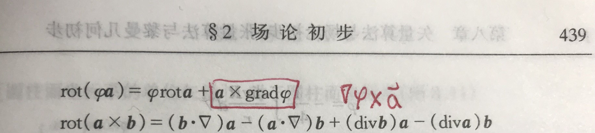
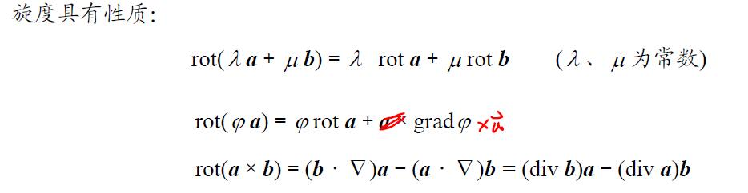

对数学手册上∇×(ϕu)公式的纠错，以及展开公式的方法。

一个很简单的问题。请在以下两个选项中选出正确的一项。

对于一般矢量场$\bm{u(x,y,z)}$和标量场$\phi(x,y,z)$而言，

1.  $$\nabla\times(\phi \bm{u})=(\nabla\phi)\times \bm{u}+\phi( \nabla \times \bm{u})$$

2.  $$\nabla\times(\phi \bm{u})=\bm{u}\times(\nabla\phi) + \phi( \nabla \times \bm{u})$$

# 纠错

正确答案是A，但是数学手册上写的是B。

小声吐槽：难以想象我就跟着数学手册错了一年多。

<figure>

  

<figcaption>《数学手册》中的一个错误</figcaption>
</figure>

于是去年在写数学分析期末复习的时候，搬运公式也错了。现在已经把原错误纠正。

# 方法

## Critical thinking

就算有解决问题的能力，首先也要发现问题。拿到公式后可以和已有的知识、别的书对比一下， 也可以自己算一遍，把公式的来龙去脉弄明白那是最好。等到应用公式发现和答案对不上， 则很难会怀疑到公式本身上去。因此最好保证拿到的公式都是正确的。

另一方面，使用这些已有的结论会加快速度，但是需要承担一定的记错公式或公式本身就不对的风险。 如果采用更为基本的原理，从基本定义开始推导，则虽然慢但正确性能获得一定保障。

## 行列式算法

对于一般同学可以直接用定义验证。 $$\nabla\times(\phi \bm{u})=
  \begin{vmatrix}
    \bm{i}&\bm{j}&\bm{k}\\
    \pp{}{x}&\pp{}{y}&\pp{}{z}\\
    \phi u_x&\phi u_y&\phi u_z
  \end{vmatrix}$$

只需要考虑$\bm{i}$方向的分量，其他类似。 $$\nabla\times(\phi \bm{u})=
  \begin{vmatrix}
    \pp{}{y}&\pp{}{z}\\
    \phi u_y&\phi u_z
  \end{vmatrix}
  \bm{i}+\dots$$ 二阶行列式的值为 $$\begin{aligned}
  &=\pp{(\phi u_z)}{y}-\pp{(\phi u_y)}{z}=\pp{\phi}{y}u_z+\pp{u_z}{y}\phi-\pp{\phi}{z}u_y-\pp{u_y}{z}\phi\\
  &=\brack{\pp{u_z}{y}\phi-\pp{u_y}{z}\phi}+\brack{\pp{\phi}{y}u_z-\pp{\phi}{z}u_y}\\
  &=\phi
    \begin{vmatrix}
      \pp{}{y}&\pp{}{z}\\
      u_y&u_z
    \end{vmatrix}
 +\begin{vmatrix}
      \pp{\phi}{y}&\pp{\phi}{z}\\
      u_y&u_z
    \end{vmatrix}
\end{aligned}$$ 这两项正分别是$\phi(\nabla\times \bm{u})$和$(\nabla\phi)\times \bm{u}$的$i$分量。写出相应的三阶行列式即可简单验证。

## 求和约定算法

通过引入Levi-Civita符号$\varepsilon_{ijk}$，当$ijk$是$123$的偶置换是取$1$，奇置换时取$0$，$i,j,k$有任意两个相等时取$0$， 可方便地计算旋度。（$x_i=x,y,z$，当$i=1,2,3$）

$$\begin{aligned}
  \nabla\times(\phi \bm{u})&=\pp{}{x_i}\bm{e}_i\times(\phi u_j\bm{e}_j)\\
                           &=\pp{(\phi u_j)}{x_i}\bm{e}_k\varepsilon_{ijk}\\
                           &=\brack{\pp{\phi}{x_i}u_j+\pp{u_j}{x_i}\phi}\varepsilon_{ijk}\bm{e}_k\\
                           &=\pp{\phi}{x_i}u_j\varepsilon_{ijk}\bm{e}_k+\phi\pp{u_j}{x_i}\varepsilon_{ijk}\bm{e}_k\\
                           &=\brack{\pp{\phi}{x_i}\bm{e}_i}\times u_j\bm{e}_j+\phi\brack{\pp{}{x_i}\bm{e}_i}\times u_j\bm{e}_j\\
  &=(\nabla \phi)\times \bm{u}+\phi  (\nabla\times \bm{u})
\end{aligned}$$ 和矢量叉乘$\bm{a}\times \bm{b}=a_ib_j\varepsilon_{ijk}\bm{e}_k$进行比较，立即得到上面的第一项为$(\nabla \phi)\times \bm{u}$。
