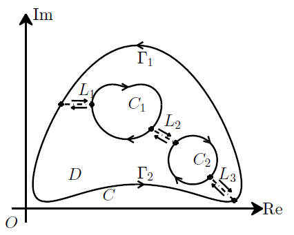
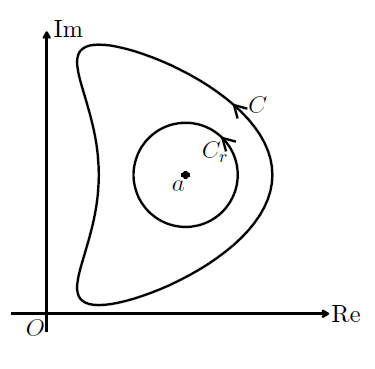
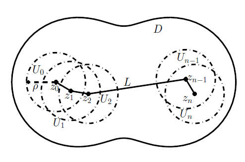

又到了期中考试前夕，照例要写复习讲义。本讲义内容参考自张波老师的讲义和吴
崇试《数学物理方法》。大家可以自行保存食用，转载请注明来源，网址即可。

# 写在前面 {#写在前面 .unnumbered}

又到了期中考试前夕，照例要写复习讲义。本讲义内容参考自张波老师的讲义和吴崇试《数学物理方法》。大家可以自行保存食用，转载请注明来源，网址即可。

`\tiny `{=latex}啊啊啊啊啊啊啊啊啊啊啊啊啊啊啊啊啊啊啊啊啊啊啊啊怎么写了这么多还没写完都写了一礼拜了啊啊啊啊啊啊啊啊啊啊啊啊我的手写实验报告还没动啊啊啊啊啊啊啊啊啊啊啊啊啊啊

------某周六晚 `\normalsize`{=latex} `\newpage`{=latex}

# 关于复数的简单知识

复数之源$i=\sqrt{-1}$

## 关于i的一些运算

-   如果$n$是偶数那么$i^n=\pm 1$

-   如果$n$还是$4$的倍数那么$i^n=1$，否则就是$-1$

-   如果$n$是个奇数，那么如果$n+1$是$4$的倍数的话$i^n=-i$

-   如果$n-1$是$4$的倍数的话$i^n=i$

-   $\frac{1}{i}=-i,\frac{1}{-i}=i$

## 复数的表示法

一个复数可以在复平面上直观地按照直角坐标或极坐标表示。 $$z=x+yi=re^{i\theta}=r(\cos\theta+\sin\theta)$$

当然我们一般规定这里的参数$x,y,r,\theta$都是实数，否则就乱了。 然而是复数也没有关系，通过相同的法则运算后仍然能化成用实数表示的形式。譬如

$$e^{e^{ix}}=e^{\cos x+i\sin x}=e^{\cos x}(\cos(\sin x)+i\sin(\sin x))$$

## 模和共轭

在实数表示的假定下，复数$z$的模$\left|
    z
  \right|=\sqrt{x^2+y^2}=r$，幅角为$\theta$。 复数相乘就是**幅角相加模相乘**，除法同理，用极坐标写一写就知道了。所以$\left|
    z_1z_2
  \right|=
  \left|
    z_1
  \right|
  \left|
    z_2
  \right|$

$z$的共轭$\bar{z}=x-yi=e^{-i\theta}$，由共轭可以得到

-   计算模长 $\left|
        z
      \right|^2=z\bar{z}$

-   实部 $Re(z)=\frac{z+\bar{z}}{2}$

-   虚部 $Im(z)=\frac{z-\bar{z}}{2i}$

模、共轭、取实部虚部不是解析函数。但是如果$z$在圆上，可以用另一种解析的方法取实部虚部，在留数定理求积分时会用到。见`\autoref{sec:res-app}`{=latex}

# 复变函数的分析

## 极限、连续和可导可微

以$z$为自变量的复变函数$f(z)$的极限、连续性和可导可微性，基本可以照搬实变函数的理论， 将绝对值换为模即可。

-   $f(z)$在$z_0$有极限$A$，设$f(z)$在$z_0$的去心邻域内有定义 $$\forall \varepsilon > 0,\exists \delta , \forall z, 0<
      \left|
        z-z_0
      \right|<\delta \Rightarrow
      \left|
        f(z)-A
      \right|<\varepsilon$$

    记为 $$\lim_{z\rightarrow z_0}{f(z)}=A$$

-   $f(z)$在$z_0$点连续，设$f(z)$在$z_0$的邻域内有定义 $$\forall \varepsilon > 0,\exists \delta , \forall z,
      \left|
        z-z_0
      \right|<\delta \Rightarrow
      \left|
        f(z)-f(z_0)
      \right|<\varepsilon$$

-   $f(z)$在$z_0$点可导，等价于以下极限存在，记为$f'(z_0)$ $$\label{eq:derivative}
        \lim_{\Delta z \rightarrow 0}{\frac{f(z_0+\Delta z)-f(z_0)}{\Delta z}}
        =\lim_{\Delta z \rightarrow 0}{\frac{\Delta f}{\Delta z}}$$

-   $f(z)$在$z_0$点可微，等价于 $$\label{eq:differential}
        \Delta f = L(z_0) \Delta z + \rho (\Delta z) \wedge \lim_{\Delta z \rightarrow 0}{\frac{\rho(\Delta z)}{\Delta z}} =0$$

    可微和可导等价。

## 柯西-黎曼方程

$f(z)$是一个复数，也可以按照直角坐标或极坐标表示。如果把$f(z)=f(x+yi)$表为$u(x,y)+v(x,y)i$，其中$u,v$是实函数， 则$\Delta f=\Delta u + i \Delta v$，$\Delta z = \Delta x +i \Delta y$

在`\autoref{eq:derivative}`{=latex}中，$\Delta z$是各个方向的。取其中沿实轴正方向和虚轴正方向的两个特殊方向，即$\Delta z=\Delta x$或$\Delta z =i \Delta y$

若$f(z)$在$z_0$点可导，则 $$\begin{aligned}
  f'(z_0)&=\lim_{\Delta z \rightarrow 0}{\frac{\Delta f}{\Delta z}} \\
        &=\lim_{\Delta x \rightarrow 0}{\frac{\Delta u + i \Delta v}{\Delta x}}=\lim_{\Delta y \rightarrow 0}{\frac{\Delta u + i \Delta v}{i\Delta y}}\\
       &=u_x+iv_x=-iu_y+v_y
\end{aligned}$$

因此，可以得到$f(z)$在某点可导的必要条件 $$\label{eq:CR}
  u_x=v_y,u_y=-v_x$$

此即柯西-黎曼方程。同时，可得到导数 $$f'(z_0)=u_x(x_0,y_0)+v_x(x_0,y_0)i=v_y(x_0,y_0)-u_y(x_0,y_0)i$$

## 极坐标的柯西黎曼方程

考虑方程 $$f(z)=u(x,y)+v(x,y)i=u(r,\theta)+v(r,\theta)i$$

极坐标变换 $$r=\sqrt{x^2+y^2},\theta=\arctan(\frac{y}{x})$$

求导 $$\begin{aligned}
  r_x&=\frac{x}{\sqrt{x^2+y^2}}=\cos\theta \\
  r_y&=\frac{y}{\sqrt{x^2+y^2}}=\sin\theta \\
  \theta_x&=-\frac{x^2}{x^2+y^2} \frac{y}{x^2}=-\frac{\sin\theta}{r}\\
  \theta_y&=\frac{x^2}{x^2+y^2} \frac{1}{x}=\frac{\cos\theta}{r}
\end{aligned}$$

于是 $$\begin{aligned}
  u_x&=u_rr_x+u_{\theta}\theta_x=u_r\cos\theta-u_{\theta}\frac{\sin\theta}{r} \\
  u_y&=u_rr_y+u_{\theta}\theta_y=u_r\sin\theta+u_{\theta}\frac{\cos\theta}{r} \\
  v_x&=v_rr_x+v_{\theta}\theta_x=v_r\cos\theta-v_{\theta}\frac{\sin\theta}{r} \\
  v_y&=v_rr_y+v_{\theta}\theta_y=v_r\sin\theta+v_{\theta}\frac{\cos\theta}{r}
\end{aligned}$$

代入柯西黎曼方程，得到 $$\begin{aligned}
  v_r\sin\theta+v_{\theta}\frac{\cos\theta}{r}&=u_r\cos\theta-u_{\theta}\frac{\sin\theta}{r} \\
  -v_r\cos\theta+v_{\theta}\frac{\sin\theta}{r}&=u_r\sin\theta+u_{\theta}\frac{\cos\theta}{r}
\end{aligned}$$

消去或比较正余弦的系数并由角度任意性即得 $$\begin{aligned}
  v_{\theta}=ru_r \\
  u_{\theta}=-rv_r
\end{aligned}$$

并且 $$\begin{gathered}
  f'(z)=u_x+iv_x\\=u_r\cos\theta-u_{\theta}\frac{\sin\theta}{r}+i(v_r\cos\theta-v_{\theta}\frac{\sin\theta}{r})\\
  =(u_r+iv_r)e^{-i\theta}=\frac{1}{r}(v_{\theta}-iu_{\theta})e^{-i\theta}
\end{gathered}$$

# 解析函数

## 概念解释

**区域**是由内点组成的连通点集。

> 注：由此可知区域都是"开"的，不包含边界。

-   $f(z)$在点$z_0$解析（或全纯）：$f(z)$在$z_0$的某个邻域内可导。

-   $f(z)$在区域$G$内解析（或全纯）：$f(z)$在$G$上逐点解析。

-   $f(z)$是**整函数**：$f(z)$在整个复平面上解析.

> 注：解析函数是定义在区域上的。如果函数只在某点可导，不能说函数在该点解析。只有在该点某邻域内处处可导时才可成为在该点解析。
>
> 再注：看到整函数就自动脑补扩充为"整（个复平面上解析的）函数"就不会忘了概念。虽然原意可能不是这个（entire funciton）。

## 所以哪些函数是解析函数

-   幂函数$z^n$在其定义域内解析，即指数大于零时是整函数，指数小于零时在除零点外解析。

-   指数函数$e^z$，这两个三角函数$\sin{z},\cos{z}$是整函数，其余三角函数在定义域内解析。

    > 注：复三角函数要用双曲函数计算，
    >
    > 即$\sin{z}=\frac{e^{iz}-e^{-iz}}{2i}=-i\sinh{iz}$，$\cos{z}=\frac{e^{iz}+e^{-iz}}{2}=\cosh{iz}$
    >
    > 由此可看出三角函数的解析性其实就是指数函数的解析性。

-   对数函数是多值函数，在规定主值区间后在除零点外解析。

-   解析函数的加减乘除、复合都在定义域内解析。

#### 例：模平方为什么不是解析函数

依照定义，设$f(z)=
  \left|
    z
  \right|^2=z\bar{z}$ $$\begin{gathered}
  \Delta f=f(z+\Delta z)-f(z)\\
  =(z+\Delta z)(\overline{z+\Delta z})-z\bar{z}=z\overline{\Delta z}+\bar{z}\Delta z+\Delta z \overline{\Delta z} \\
  =\Delta z(\bar{z}+\overline{\Delta z})+z\overline{\Delta z}
\end{gathered}$$

将结果与`\autoref{eq:differential}`{=latex}对比，线性部分$L=\bar{z}$（当$\Delta z$趋向零时$\overline{\Delta z}$也趋向零，忽略），剩余部分$\frac{\rho(\Delta z)}{\Delta z}=z\frac{\overline{\Delta z}}{\Delta z}=ze^{2i\theta}$，其中$\theta$是$\Delta z$的幅角。

显然，当$z\neq 0$时，$\Delta z$趋向于零并不能确定其幅角，剩余部分不趋于零甚至没有确定值。只有当$z=0$时才满足可导的定义。

因此，模平方只在零点处可导。由于某些前面已经说过的原因，不能称其为在零点解析。

另外，利用柯西-黎曼方程也可说明。 $$f(z)=x^2+y^2,u=x^2+y^2,v=0,u_x=2x,u_y=2y,v_x=v_y=0$$

于是在$x=0,y=0$即原点之外一定不可导。在原点的可导性无法单纯由柯西黎曼方程得到。

## 共轭函数及其求法

如果两个实函数分别是复平面区域$G$上的某解析函数的实部和虚部，则这两个函数是$G$上的**调和函数**.

如果区域$G$（此时应是XY实平面）中两个调和函数满足柯西黎曼方程，则它们互为**共轭调和函数**。

#### 例：

求$u=y^3-3x^2y$的共轭调和函数。

依照柯西黎曼方程直接积分即可，不过由于是偏导数 所以积分常数要换成关于另一个变量的函数。 $$\begin{aligned}
 & u_x=-6xy=v_y,u_y=3y^2-3x^2=-v_x \\
 & \therefore v=-3xy^2+f(x)=x^3-3xy^2+g(y) \\
 & \therefore f(x)=x^3+C,g(y)=C \\
 & \therefore v=x^3-3xy^2+C
\end{aligned}$$

由此，以$u,v$为实部和虚部的函数$h(z)=y^3-3x^2y+(x^3-3xy^2+C)i$成为解析函数。

为了防止出现掉积分常数的情况，可以对方法进行一些微调。 $$\begin{aligned}
 & u_x=-6xy=v_y,u_y=3y^2-3x^2=-v_x \\
 & \therefore v=-3xy^2+f(x)\\
 & \therefore -v_x=3y^2-f'(x)\\
  & \therefore f'(x)=3x^2,f(x)=x^3+C \\
    & \therefore v=x^3-3xy^2+C
\end{aligned}$$

下一步进行变换，使得表达式中只有$z$。为此，可以用取实部虚部的方法来表示$x,y$，但 更简易的办法是赋值。$h(z)=h(x+iy)$，令$y=0$，则有$h(x)=x^3i+Ci$，于是$h(z)=z^3i+Ci$。

## 解析函数的充要条件

::: center
`\large`{=latex} *对区域$G$中任意一点，都存在某个邻域，$f(z)$在邻域中可导*
:::

这是解析函数的定义。可导等价于可微，就是函数在区域中可以表示为$df=Ldz$的形式。或者直接说在区域内每一点可导。

::: center
`\large`{=latex} *复函数的的实部和虚部互为共轭调和函数*
:::

也就是在区域内满足柯西黎曼方程，并且实部和虚部都可微。注意，偏导数存在是不够的，必须要可微。

::: center
`\large`{=latex} *$f(z)$在区域内任意一条逐段光滑的闭曲线上积分为零*
:::

也就是积分与路径无关。

::: center
`\large`{=latex} *对区域内任意一点，$f(z)$可以在其一个邻域内展开为幂级数*
:::

一般用作性质。

# 复变积分初步

基本性质可以照搬实变函数的基本，如线性性质、绝对值性质（换成模）等。

## 曲线积分的计算

#### 参数化方法

设$C$是分段光滑曲线，可表示为 $$z(t)=x(t)+iy(t), t\in [a,b]$$ 且$f(z)$在$C$上分片连续，则可定义曲线积分 $$\int_{C}{f(z)dz}=\int_a^b{f(z(t))z'(t)dt}$$ 其实就是参数化和变量替换，实变函数中也是类似。 参数化方法也远远不限于分实部虚部。

**例：**求$z^2$在线段$0\rightarrow 1\rightarrow 1+i$上的曲线积分。

$$\int_{C}{z^2dz}=\int_0^1{t^2dt}+\int_0^1{(1+ti)^2idt}=\frac{2}{3}(-1+i)$$

**例：**求$z^2$在上半圆周$\left|
    z
  \right|=1$上的曲线积分。

$$\int_{C}{z^2dz}=\int_0^{\pi}e^{2i\theta}ie^{i\theta}d\theta =-\frac{2}{3}$$

#### 原函数

如果能找到原函数，就十分省事了。只需要将起点和终点的值代入原函数相减即可。

这其中大致有这么一个关系：存在原函数-解析-积分与路径无关。

**例：**求$e^{iz}$在线段$0\rightarrow 1\rightarrow 1+i$上的曲线积分。

$$\int_{C}{e^{iz}dz}=-ie^{iz}|_0^{1+i}=-ie^{i-1}+i$$

其实本来还有一种方法叫加一条线让歪歪扭扭的曲线闭合，然后利用解析函数在闭合曲线积分为零，只需要计算一条规整的线上的积分即可。不过既然都解析了，原函数也很好找，就没必要这样了。

一般如果被积函数是解析函数，就找原函数代入完事；如果被积函数是模、共轭等不解析的函数，则按照$xy$分解参数化的方式来做。

## 曲线积分的估算

#### ML定理

如果$f(z)$在长为$L$的曲线$C$上模有上界$M$，则 $$\label{eq:ML}
  \int_C{f(z)dz}\leq ML$$ 这个挺显然的，不证明了。

#### Jordan引理

如果$f(z)$在曲线$C$上模有上界$M$， 这个曲线刚好还是个半径为$R$的上半圆周，则对$\beta>0$，有 $$\label{eq:jordan}

  \left|
    \int_C{f(z)e^{i\beta z}dz}
  \right|<\frac{M\pi}{\beta}$$ 参数化代入，利用一下放缩使得$e^{\sin\theta}$变为$e^{\theta}$可积的形式，即可证明。

对于上半单位圆周而言，Jordan引理比ML有更好的估计，基本相差一个$R$的量级。这在留数定理的应用中有时是至关重要的。

## 柯西定理

区域边界的**正向规定**：当在区域边界上沿着这一方向行进时，区域总在左侧。

> 注：一般而言区域的正向为外边界逆时针，内边界顺时针。

**单连通区域和多连通区域**：如果区域$D$内任意一条闭曲线内的点都是$D$的点，则$D$为**单连通区域**。否则为**多连通区域**。或称复连通区域。

> 注：一般而言单连通区域就是没有洞的一整块区域。多连通区域就是例如环带的中间有洞的区域。

#### 单连通区域的柯西定理

在区域$D$上解析的函数$f(z)$在该区域内任意一条逐段光滑闭曲线$C$上积分为零。 $$\int_C{f(z)dz}=0$$

证明可以利用实部和虚部分解，用格林公式化为二重积分，并用柯西黎曼方程验证被积函数为零。 $$\int_C{f(z)dz}=\int_C{(udx-vdy)+(udy+vdx)i}=\iint_D{(-v_x-u_y)dS+i(u_x-v_y)dS}=0$$

于是解析函数积分与路径无关，上面已经用了不少这一结论，其实是从这儿来的。

#### 多连通区域的柯西定理

设$D$是多连通区域，其边界由外边界$C_0$和$C_1,\dots,C_n$组成。设函数$f(z)$在$\bar{D}$上解析（即在包含$\bar{D}$的某一个区域上解析），则有 $$\int_{C_0}{f(z)dz}+\sum_{k=1}^n{\int_{C_k}f(z)dz}=0$$ 其中所有曲线取正方向，即外边界逆时针，内边界顺时针。这就是说即使是多连通的区域，让解析函数在所有边界上正向积分仍然为零。这一定理可以通过加线将多连通区域化为几个单连通区域证明。

<figure>

<figcaption>多连通区域柯西定理示意图</figcaption>
</figure>

如果所有曲线取逆时针方向，则有 $$\int_{C_0}{f(z)dz}=\sum_{k=1}^n{\int_{C_k}f(z)dz}$$ 换个角度看，设内部曲线$C_1,\dots,C_n$分别围成区域$D_1,\dots,D_n$，则等式意味着解析函数在外边界上的正向积分等于在所有内部小区域的边界上正向积分之和。

#### 曲线变形

各条件和多连通柯西定理相同，除了此时内部只有一条闭曲线$C_1$，两条曲线均取逆时针方向，则 $$\int_{C_0}{f(z)dz}=\int_{C_1}f(z)dz$$

<figure>

<figcaption>曲线变形示意图</figcaption>
</figure>

由此，在任意一条曲线上积分时，可以直接转化为其内部一条曲线上的积分。经常取内部曲线为圆以简化计算。另一方面，这也说明了解析函数在一簇闭曲线上具有相同的积分值。

# 柯西积分公式及其推出的一些结论

## 柯西积分公式

设函数$f(z)$在区域$D$内解析，$C$是$D$内的任意逐段光滑闭曲线，取逆时针方向。 则对闭曲线$C$内任意一点$z_0$，有 $$\label{eq:CI}
  f(z_0)=\frac{1}{2\pi i}\int_C{\frac{f(z)}{z-z_0}dz}$$

几点意义，对于解析函数而言：

1.  函数与积分联系起来，由此微分也将和积分联系起来。

2.  函数在一点的值由包围它的闭曲线上的积分决定。

3.  函数在一族包围同一点的闭曲线上的积分都由在该点的值决定。

证明：参数化得到结论$\int_C{\frac{1}{z-z_0}}=2\pi i$，于是 $$f(z_0)=f(z_0)\frac{1}{2\pi i}\int_C{\frac{1}{z-z_0}dz}=\frac{1}{2\pi i}\int_C{\frac{f(z_0)}{z-z_0}dz}$$

和等式另一端作差比较

$$\frac{1}{2\pi i}\int_C{\frac{f(z)}{z-z_0}dz}-f(z_0)=\frac{1}{2\pi i}\int_C{\frac{f(z)-f(z_0)}{z-z_0}dz}$$

利用连续性，当曲线半径取得足够小时利用ML定理可证明其趋向于0。

#### 多连通区域的柯西积分公式

设$D$是由外边界$C_0$和内边界$C_1,\dots,C_n$围成的区域，$f(z)$在$\bar{D}$上解析。 则对$D$中任意一点$z_0$，有 $$f(z_0)=\frac{1}{2\pi i}\sum_{k=0}^n{\int_{C_k}{\frac{f(z)}{z-z_0}}}$$ 曲线均取正向，即$C_0$逆时针，内部曲线顺时针。

或者均取逆时针： $$f(z_0)+\frac{1}{2\pi i}\sum_{k=1}^n{\int_{C_k}{\frac{f(z)}{z-z_0}}}=\frac{1}{2\pi i}\int_{C_0}{\frac{f(z)}{z-z_0}}$$

#### 例：求

$$\frac{1}{2\pi i}\int_C{\frac{e^{zt}}{z^2+1}dz}$$ 其中$t>0,C:
  \left|
    z
  \right|=3$

#### 用单连通区域的积分公式

在圆周内有两个奇点，所以不能直接用单连通区域积分公式。 $$\begin{gathered}
  \frac{1}{2\pi i}\int_C{\frac{e^{zt}}{z^2+1}dz}\\
  =\frac{1}{4\pi i}\int_C{e^{zt}(\frac{1}{z-i}-\frac{1}{z+i})dz} \\
  =\frac{1}{4\pi i}\int_C{\frac{e^{zt}}{z-i}}-\frac{1}{4\pi i}\int_C{\frac{e^{zt}}{z+i}} \\
    =\frac{1}{4\pi i}2\pi i (e^{it}-e^{-it})\\
   =\sin t
\end{gathered}$$

#### 用多连通区域的积分公式

除了大圆$C$外，再绕$z=-i$作一个小圆$C_1$，则 $$\begin{gathered}
  \frac{1}{2\pi i}\int_C{\frac{e^{zt}}{z^2+1}dz}\\
  =\frac{1}{2\pi i}\int_C{\frac{\frac{e^{zt}}{z+i}}{z-i}dz}\\
  =\frac{1}{2\pi i}\int_{C_1}{\frac{\frac{e^{zt}}{z+i}}{z-i}dz}+e^{it}\frac{1}{2i}\\
  =e^{-it}\frac{1}{-2i}+e^{it}\frac{1}{2i}\\
  =\sin t
\end{gathered}$$ 注意第三行中$C_1$取逆时针方向，因而接下去第四行可直接用单连通区域积分公式。

## 均值定理，最大模原理及一些推论

#### 均值定理

在柯西积分公式`\autoref{eq:CI}`{=latex}中，取$C$为半径为$R$的圆，作参数化 $$z=z_0+Re^{i\theta},dz=iRe^{i\theta}$$

则得到 $$f(z_0)=\frac{1}{2\pi i}\int_0^{2\pi}{\frac{f(z_0+Re^{i\theta})}{Re^{i\theta}}iRe^{i\theta}d\theta}
  =\frac{1}{2\pi}\int_0^{2\pi}{f(z_0+Re^{i\theta})d\theta}$$ 于是函数在一点的值即为以该点为中心的任意圆（当然要保证解析）上的函数值的平均。

这就可以推知，如果函数$f(z)$在$z_0$的某个圆形邻域内解析，并且在$z_0$处达到邻域内**模的最大值**， 那么在这个邻域内$f(z)\equiv f(z_0)$。显然，一组数的平均值不可能是最小/最大值，用不等式关系即可证明。 首先得到的是在邻域内函数的模为定值，得到的方程进行求导，再利用解析性满足柯西黎曼方程推出函数为定值。这是一个重要的结论------解析函数在区域上模为定值，则函数为定值。

这儿只有最大值没有最小值，是因为放缩时模放进积分号只能往大放，不能往小了放。所以直接得到的也只有最大模原理， "最小模原理"是满足一定条件下变换才得出的。

#### 最大模原理 {#para:modulemax}

若$f(z)$在区域$D$中解析，并且不是常数，则$\left|
    f(z)
  \right|$在$D$中任意一点都不可能达到最大值。

> 换句话说，就是只能在边界上取到最大值。

1.  证明思路：反证法。如果在某一点$z$取得模最大值，试图说明区域中任意另一点$z'$，有$f(z)=f(z')$。

2.  为此，分别以这两点为起点和终点作曲线，使得这条曲线落在区域内。

3.  以起点为圆心作区域内的圆，使得圆尽量大。

4.  既然函数在起点处取得模最大值，由之前的推断可知函数在落在圆内的曲线上的点都有与起点相同的函数值。

5.  选取圆内曲线上不同于起点的另一点，间距尽量大，以它为新的"起点"，重复上述步骤。

6.  最终即可推知函数在整条曲线上的点都具有相同的函数值。

7.  由终点的任意性可知函数在区域内为常数。耶！

<figure>

<figcaption>最大模原理证明图示</figcaption>
</figure>

#### 最小模原理

若$f(z)$在区域$D$中解析，没有零点且不是常数，则$\left|
    f(z)
  \right|$在$D$中任意一点都不可能达到最小值。

> 利用$1\/ f(z)$的最大模原理即可推证。于是必须保证在区域中都解析，也就是区域中不能有零点。做题时要是看到给的条件有"无零点"，可以考虑构造倒数函数应用已有的定理。因为此时倒数函数也是**解析**的。

#### 调和函数的极值原理

非常数的调和函数不能在区域内部达到最大值或最小值。

设$f(z)=u(x,y)+iv(x,y)$在区域$D$内解析，$u(x,y)$不是常数，证明$u(x,y)$不能在$D$内部达到最大值或最小值。

可对$e^{f(z)}$应用最大模原理。$\left|
    e^{f(z)}
  \right|=
  \left|
    e^{u+iv}
  \right|=
  \left|
    e^u
  \right|$不能在区域内部达到最大值或最小值，于是结论显然。

#### 解析函数在边界上为常数，则在内部有零点

设$f(z)$在一有界区域内解析且不为常数，在其闭包上连续，在区域边界上模为常数，则在区域内有零点。

用反证法，假设没有零点，则由最大模和最小模原理可知不能在区域内取到模最小，也不能在区域内取到模最大。也就是说模最小最大都在边界上。但是边界上模为常数，于是区域内模均为常数，则函数在区域内也为常数。

遇到要证明有零点的问题时，往往反证法，假设没有零点，则可用最小模原理，然后导出矛盾。

## 高阶导数、柯西不等式和Liouville定理

设区域$D$边界由有限条逐段光滑的简单闭曲线组成，记为$C$，$f(z)$在闭区域$\bar{D}$上解析，则 $$f^{(n)}(z_0)=\frac{n!}{2\pi i}\int_C\frac{f(z)}{(z-z_0)^{n+1}}dz$$ 其中积分取正向。

对于二阶导数，可以由柯西积分公式`\autoref{eq:CI}`{=latex}形式求导得出，但是严格的证明需要将形式的结果与按导数定义得出的式子作差比较。对于高阶导数，可以用归纳法。

由此，可以得到比实变函数强得多的结论：解析函数有任意阶导数，并且导数也是解析函数。同时，它也可以计算一些积分。

#### 例：求

$$\int_C\frac{e^{2z}}{z^4}dz$$ 其中$C$为正向的$|z|=1$。

利用上面的公式， $$\int_C\frac{e^{2z}}{z^4}dz=\frac{2\pi i}{3!}(e^{2z})'''|_{z=0}=\frac{8\pi i}{3}$$

#### Cauchy不等式

用来估计导数模的上界。 $f(z)$在$\left|
    z-z_0
  \right|<R$内解析，如果$\left|
    f(z)
  \right|$在此区域内有上界$M$，则 $$\left|
    f^{(n)}(z_0)
  \right|\leq\frac{n!M}{R^n}$$ 证明利用高阶导数公式和ML定理即可。估计出来的导数可以用来衡量函数的"多项式"性质，接下去就会看到。

#### Liouville定理

如果$f(z)$在整个复平面上解析，$\left|
    f(z)
  \right|$在整个复平面上有界，则$f(z)$是常数。

证明：估计函数的一阶导数，设$\left|
    f(z)
  \right|$上界为$M$，对任意一点$z_0$，$\left|
    f'(z_0)
  \right|\leq\frac{M}{R}$，于是当半径趋向于无穷时这一点导数为零，于是任意点导数为零，利用牛顿莱布尼茨公式，可知任意两点函数差为零，则函数为常数。

#### 广义Liouville定理

整函数$f(z)$满足对所有$\left|
    z
  \right|>1$，$\left|
    f(z)
  \right|\leq A
  \left|
    z
  \right|^n$，$A$是正常数，$n$是一个正整数，则$f(z)$是一个最高$n$次的多项式。

类似Liouville定理的证明，考虑任意点$z_0$的$n+1$阶导数，取圆盘$\left|
    z-z_0
  \right|=R$。由于解析性，可设$\left|
    z
  \right|\leq 1$圆盘上函数上界为$M_0$，然后让$R$足够大使得$A(
  \left|
    z_0
  \right|+R)^n>C$，于是用这个真·上界代入柯西不等式。 $$\left|
    f^{(n+1)}(z_0)
  \right|\leq\frac{(n+1)!A
      \left(
        (
  \left|
    z_0
  \right|+R)^{n}
      \right)}{R^{n+1}}$$ 当半径趋向于无穷时右端趋向于零，于是$n+1$阶导数为零，简单推导（反复积分）可知$f(z)$最高为$n$次多项式。

## 打酱油的Morera定理

连续函数如果在区域内任意一条逐段光滑的闭曲线上积分为零，则其解析。

证明：利用此时存在解析的原函数，而解析函数的导数也是解析函数，证毕。

由此才建立了闭曲线积分为零和解析性的等价关系。这个定理虽然在做题时没什么用，但好歹也是个看起来比较高大上的定理，所以还是给它一个（打酱油的）位置吧。

# 复变级数

## 一个重要积分

$C$为绕$z_0$的闭合曲线，定向为正向，$n$为非零整数。 $$\label{eq:polyint}
  \int_C(z-z_0)^ndz=
  \left\{
      \begin{aligned}
        0,n\neq -1\\
        2\pi i ,n = -1
      \end{aligned}
    \right.$$

先用曲线变形原理把积分线变成圆，然后用$z=Re^{i\theta}$参数化计算即可。在$n\neq-1$时参数化后存在$e^{i\theta}$项，积分后上下限代入值相同，一减就都没了。这个积分的重要性在于显示了复变幂函数的某种正交性，这一点之后再讨论。

## 级数的一些概念

1.  复数项级数：每项是复数的级数。

2.  复数项级数的收敛等价于其实部和虚部分别收敛。

3.  柯西收敛准则照搬实变。绝对收敛照搬（绝对值改成模）。

4.  复变函数项级数：每项是复变函数的级数。

5.  逐点收敛和一致收敛照搬。柯西一致收敛准则照搬。

6.  Weierstrass判别法。如果对任意定义域内$z$有 $$\left|
        f_k(z)
      \right|\leq M_k$$ 则级数$M_k$的收敛性能够控制复变函数项级数$f_k(z)$的收敛。

7.  内闭一致收敛：在区域内部任意一个"闭区间"上一致收敛。如$\sum z^n$在$\left|
        z
      \right|<1$中内闭一致收敛，指的是对$\forall r<1$，级数在$\left|
        z
      \right|\leq r$上收敛，用W判别法即可。但是这个级数在$\left|
        z
      \right|<1$内不收敛，因为$\left|
        z
      \right|$趋向于$1$时$\left|
        f_n(z)-f(z)
      \right|$越来越大，收敛不是一致的。

8.  一致收敛可逐项积分，内闭一致收敛可逐项任意阶求导。证明？略。

## 幂级数

形如 $$\sum_{n=0}^{\infty}a_n(z-z_0)^n$$ 由$z-z_0$的幂次与复系数相乘相加的无穷级数称为$z$的幂级数。对所有的$n\geq 0$，$(z-z_0)^n$都是整函数。 因此幂级数也是整函数。

#### 幂级数的收敛半径

对如上所示的幂级数，设 $$\label{eq:converg-radius}
L=\overline{\lim_{n\rightarrow\infty}}
  \left|
    a_n
  \right|^{\frac{1}{n}}$$ 则幂级数的**收敛范围**（也叫**收敛圆**）为$\left|
    z-z_0
  \right|\leq R$ $$R=
  \left\{
    \begin{aligned}
      0&,L=\infty\\
      \infty&,L=0\\
      L^{-1}&,0<L<\infty
    \end{aligned}
  \right.$$ $R$称为**收敛半径**。$R>0$时，

1.  $\left|
        z-z_0
      \right|<R$则幂级数收敛。

2.  $\left|
        z-z_0
      \right|>R$则幂级数发散。

3.  $\left|
        z-z_0
      \right|=R$，幂级数收敛性无法确定。

在收敛半径内幂级数收敛可以通过柯西审敛法证明幂级数绝对收敛得到。发散性类似。另外，幂级数在收敛圆上**内闭一致收敛**。

## 泰勒级数展开

**解析函数**$f(z)$在解析区域内的任意一点的**邻域圆盘**上都可以展开成$z$的幂级数。 $$f(z)=\sum_{z=0}^{\infty}a_n(z-z_0)^n,where\quad a_n=\frac{f^{(n)}(z_0)}{n!}$$ 并且泰勒展开式是唯一的。另外，对在某区域上的解析函数$f(z)$而言，幂级数的收敛半径$R$等于$z_0$到$f(z)$最近一个奇点的距离。

#### 常见函数的Taylor展开

照搬实数。注意收敛域。 $$\begin{aligned}
  \frac{1}{1-z}&=\sum_{n=0}^{\infty}z^n&,
  \left|
    z
  \right|<1 \\
  e^z&=\sum_{n=0}^{\infty}\frac{z^n}{n!}&,
  \left|
    z
  \right|<\infty\\
  \cos{z}&=\sum_{n=0}^{\infty}\frac{z^{2n}}{(2n)!}&,
  \left|
    z
  \right|<\infty\\
  \sin{z}&=\sum_{n=0}^{\infty}\frac{z^{2n+1}}{(2n+1)!}&,
  \left|
    z
  \right|<\infty
\end{aligned}$$

关于具体的展开的例子到后面再一起讲。

#### 例：

求幂级数$\sum_{n=0}^\infty(z^{n+1}-z^{n})$的收敛域。

注意一下这个幂级数最后出来不是$1$，而是$\lim_{n\rightarrow \infty}z^n+1$ 应用limsup开n次方取倒数公式`\autoref{eq:converg-radius}`{=latex}（其实就考虑最高次系数$1$），得到半径为$1$。

## 零点孤立性定理和唯一性定理

#### 高阶零点

如果$f(z_0)=f'(z_0)=\dots=f^{(n-1)}(z_0)=0$且$f^{(n+1)}(z_0)\neq 0$， 则称$z_0$是$f(z)$的**$n$阶零点**。$n$当然是个正整数。

于是可以分解因式，找到$g(z)$使得$f(z)=(z-z_0)^ng(z)$

#### 解析函数的零点孤立性定理

设$f(z)$在一个零点$z_0$解析，且$f(z)$在$z_0$邻域内不恒为零， 则存在一个$z_0$的邻域，在这个邻域中$f(z)$没有别的零点。

这可以由$g(z)$也是解析函数，甚至因为$g(z_0)\neq 0$，而在整个邻域内解析，结合它的连续性得出。

相反地，设$f(z)$在区域$D$内解析，如果$f(z)$在$z_0$的某个邻域内恒为零，则 $$f(z)\equiv 0,\forall z \in D$$ 将函数在$z_0$的邻域圆盘上泰勒展开，由于在邻域内恒为零，可知展开式所有的系数均为零，那么显然函数在邻域圆盘上都为零。之后，类似最大模原理的证明`\autoref{para:modulemax}`{=latex}，对区域中任意两个点可构造一条曲线连接，而由刚刚的推理可知$f(z)$在一个点为零则在其邻域圆盘内为零。于是可以推知曲线上所有点函数值均为零。

#### 解析函数唯一性定理

设$f(z),g(z)$是$D$中的解析函数，且存在$D$中互不相同的无穷序列，在这个序列上都有$f(z_n)=g(z_n)$。如果$\{z_n\}$在$D$内有极限点，则 $$f(z)\equiv g(z),\forall z\in D$$

作差函数$f-g$，由条件显然可知在极限点的任何一个邻域内差函数都有一大堆零点，于是差函数恒等于零。

#### 一种应用

解析函数限制在实轴上的表达式如果知道，那么它在整个复平面上的表达式也就知道了（其实是同一个）。可以作差函数，于是差函数在实轴上全是零点。于是差函数恒为零。

例：整函数$f(z)$，满足$\forall x \in \mathbb{R},f(x)=e^x$，则$\forall z\in \mathbb{C},f(z)=e^z$

## Laurent级数展开

Laurent级数展开，是为了解决在某一点有奇性时引入的展开方法。

设$f(z)$在圆环域$r_1<
  \left|
    z-z_0
  \right|<r_2$中解析，则 $$f(z)=\sum_{n=-\infty}^{\infty}c_n(z-z_0)^n,r_1<
  \left|
    z-z_0
  \right|<r_2$$ 其中（如此重要值得我分两行写） $$c_n=\frac{1}{2\pi i}\int_{C_r}\frac{f(z)}{(z-z_0)^{n+1}}dz$$ $C_r$是圆环内的圆周，取正方向。

Laurent级数展开式也是**唯一的**。

可以把函数代到系数计算公式里看看会是什么样。交换积分与求和， $$c_n=\frac{1}{2\pi i}\sum_{m=-\infty}^{\infty}\int_{C_r}\frac{c_m(z-z_0)^m}{(z-z_0)^{n+1}}
  =\frac{1}{2\pi i}\sum_{m=-\infty}^{\infty}\int_{C_r}c_{m}(z-z_0)^{m-n-1}$$

由本节刚开始提到的`\autoref{eq:polyint}`{=latex}可知，仅当$m=n$时 $$\int_{C_r}c_{m}(z-z_0)^{m-n-1}=2\pi i c_n$$ 否则均为零，于是等式验证成立。

这就是某一种正交性的体现。将函数除以$(z-z_0)^{n+1}$次后积分，留下的只有$(z-z_0)$的$n$次方的系数，其他项的成分全部被消除了。

Laurent级数在圆环域中**内闭一致收敛**，证明需要用积分式子估计系数的值。

设$f(z)$在闭圆环域$r_1<r\leq
  \left|
    z-z_0
  \right|\leq R<r_2$上的上界为$M$ $$\left|
    c_n
  \right|=
  \left|
    \frac{1}{2\pi i}\int_{C_{\rho}}\frac{f(z)}{(z-z_0)^{n+1}}dz
  \right|\leq \frac{M}{\rho^ {n}},\forall\rho \in (r_1,r_2)$$ 把$f(z)$写为 $$\sum_{n=0}^{\infty}c_n(z-z_0)^n+\sum_{n=1}^{\infty}c_{-n}(z-z_0)^{-n}$$ 对每项分别有 $$\begin{aligned}

  \left|
    c_n(z-z_0)^n
  \right|\leq M(\frac{R}{\rho})^n\\

  \left|
    c_{-n}(z-z_0)^{-n}
  \right|\leq M(\frac{\rho}{r})^n
\end{aligned}$$ 由$\rho$的任意性，当$R<\rho<r_2$时第一项公比小于一，收敛；当$r_1<\rho<r$时第二项公比小于一，收敛。 于是两项均绝对收敛。 哦了。

## 级数展开合并及应用实例

事实上，进行洛朗展开时才不会用那个公式，仍旧是借助已经有的经验公式，利用一定的变换，按照幂级数的方式展开。 $$\begin{aligned}
  f(z)&=\frac{1}{z(1+z^2)}\\
  &=\frac{1}{z}\frac{1}{1-(-z^2)}\\
  &=\frac{1}{z}\sum_{n=0}^{\infty}(-z^2)^{n},0<\quad
  \left|
    (-z)^2
  \right|<1\\
  &=\frac{1}{z}+\sum_{n=1}^{\infty}(-1)^nz^{2n-1},0<\quad
  \left|
    z
  \right|<1
\end{aligned}$$ `\hrulefill`{=latex} $$\begin{aligned}
  f(z)&=\frac{z}{(z-1)(z-3)}\\
      &=\frac{1}{z-1}(1+\frac{3}{z-3})\\
  \frac{1}{z-3}&=-\frac{1}{2-(z-1)}\\
      &=-\frac{1}{2}\frac{1}{1-\frac{z-1}{2}}\\
      &=-\frac{1}{2}\sum_{n=0}^{\infty}\brack{\frac{z-1}{2}}^n,
  \left|
    \frac{z-1}{2}
  \right|<1\\
        f(z)&=\frac{1}{z-1}-\frac{3}{2}\frac{1}{z-1}\sum_{n=0}^{\infty}\brack{\frac{z-1}{2}}^n\\
              &=-\frac{1}{2}\frac{1}{z-1}-\frac{3}{2}\frac{1}{z-1}\sum_{n=1}^{\infty}\frac{(z-1)^n}{2^n}\\
              &=-\frac{1}{2}\frac{1}{z-1}-\frac{3}{4}\sum_{n=0}^{\infty}\frac{(z-1)^n}{2^n},0<
  \left|
    z-1
  \right|<2
\end{aligned}$$ `\hrulefill`{=latex} $$\begin{aligned}
  f(z)&=\frac{1}{1-z}\\
      &=-\frac{1}{z}\frac{1}{1-\frac{1}{z}}\\
      &=-\frac{1}{z}\sum_{n=0}^{\infty}\frac{1}{z^n},
  \left|
    \frac{1}{z}
  \right|<1\\
      &=-\sum_{n=1}^{\infty}\frac{1}{z^{n}},
  \left|
    z
  \right|>1
\end{aligned}$$ `\hrulefill`{=latex} $$\begin{aligned}
  f(z)&=\frac{1}{z^2}\\
  g(z)&=\frac{1}{z}\\
      &=-\frac{1}{1-(z+1)}\\
      &=-\sum_{n=0}^{\infty}(z+1)^n,
  \left|
    z+1
  \right|<1\\
  f(z)&=-g'(z)\\
      &=\sum_{n=0}^{\infty}(n+1)(z+1)^n,
  \left|
    z+1
  \right|<1 \\
  g(z)&=\frac{1}{z}\\
      &=\frac{1}{2-(2-z)} \\
      &=\frac{1}{2}\frac{1}{1-\frac{2-z}{2}} \\
      &=\frac{1}{2}\sum_{n=0}^{\infty}\brack{\frac{2-z}{2}}^n,
  \left|
    \frac{2-z}{2}
  \right|<1 \\
      &=\frac{1}{2}\sum_{n=0}^{\infty}(-1)^n\frac{(z-2)^n}{2^n},
  \left|
    z-2
  \right|<2 \\
  f(z)&=-g'(z)\\
  &=\sum_{n=0}^{\infty}(-1)^n\frac{(n+1)(z-2)^n}{2^{n+2}},
  \left|
    z-2
  \right|<2
\end{aligned}$$

#### 小结

展开时主要关注点在于题目给出的收敛范围，收敛范围不同，展开的形式也不同。 从收敛范围可以判断出应该对哪个整体进行展开操作，从而有目的地进行构造。 同时，也要注意使用分式化简、求导、整体代换等必要操作来更快达到目标。

$$\begin{aligned}
  f(z)&=\sum_{n=0}^{\infty}(n+1)(z-1)^{n+1} \\
      &=\sum_{n=0}^{\infty}(n+2)(z-1)^{n+1}-\sum_{n=0}^{\infty}(z-1)^{n+1}\\
      &=\brack{\sum_{n=0}^{\infty}(z-1)^{n+2}}'-\frac{z-1}{2-z}\\
      &=\brack{\frac{(z-1)^2}{2-z}}'-\frac{z-1}{2-z}\\
      &=\frac{z-1}{(z-2)^2}\\
  f(z)&=(z-1)\sum_{n=0}^{\infty}(n+1)(z-1)^{n} \\
      &=(z-1)\brack{\sum_{n=0}^{\infty}(z-1)^{n+1}}' \\
      &=(z-1)\brack{\frac{z-1}{2-z}}'\\
  &=\frac{z-1}{(z-2)^2}
\end{aligned}$$ `\hrulefill`{=latex} $$\begin{aligned}
  f(z)&=\sum_{n=1}^{\infty}\frac{2}{(n-1)!}z^{2n-1}\\
      &=z\sum_{n=0}^{\infty}\frac{2}{n!}(z^2)^{n}\\
  &=2ze^{z^2}
\end{aligned}$$ `\hrulefill`{=latex} $$\begin{aligned}
  S&=\sum_{n=0}^{\infty}\frac{n+1}{2^n}\\
  f(z)&=\sum_{n=0}^{\infty}(n+1)z^n\\
   &=\brack{\sum_{n=0}^{\infty}z^{n+1}}'\\
   &=\brack{\frac{z}{1-z}}'\\
   &=\frac{1}{(z-1)^2}\\
  S&=f\brack{\frac{1}{2}}=4
\end{aligned}$$

#### 小结

在将展开式合并回去的时候，一般简单的可以直接利用等比数列公式。 非多项式型的函数要着眼于$n!$的性质辨别函数类别，而不是依据$z$的指数性质。并利用求导积分、整体代换法、配凑等进行操作。在求具体数列的和时，对于多项式而言往往把公比换成$z$进行合并再代入值。

# 留数及应用 {#sec:res-app}

## 留数及其意义

函数$f(z)$在$z_0$处不可导，但是在$z_0$附近除了$z_0$之外解析，即存在一个邻域没有别的不可导点，则称$z_0$为$f(z)$的一个**孤立奇点**。

将函数在以$z_0$为中心的穿孔圆盘$0<
  \left|
    z-z_0
  \right|<r$内洛朗展开，即 $$f(z)=\sum_{n=0}^{\infty}a_n(z-z_0)^n+\sum_{n=1}^{\infty}\frac{b_n}{(z-z_0)^n}$$ 则$f(z)$在$z_0$的留数定义为 $$\mathrm{Res}\left(
    f;z_0
  \right):=b_1=\frac{1}{2\pi i}\int_Cf(z)dz$$ $C$是$0<
  \left|
    z-z_0
  \right|<r$中包围$z_0$的任意一条逐段光滑闭曲线，取正方向。 可以把展开式代入积分，由前面提到的重要积分`\autoref{eq:polyint}`{=latex}可知除了$b_1$项外其余项积分都为零。

> 留数把积分和级数展开联系在一起，因此是求积分的有力工具。

#### 柯西留数定理

设$f(z)$在单连通区域$D$内除了有限个点$z_1,\dots,z_n$外解析，则对于$D$内包含这些奇点的任意一条逐段光滑闭曲线$C$， 取正方向，有 $$\int_Cf(z)dz=2\pi i\sum_{k=1}^n
  \mathrm{Res}\left(
    f;z_k
  \right)$$ 证明略，利用多连通区域的柯西定理，在小区域上结合留数定义即可。

于是，在闭曲线上的积分就化为对其内部包含的所有奇点的留数求和。如果内部没有奇点怎么办？你说怎么办呢？嗯？

## 留数的求法

#### 极点及其分类

考虑在孤立奇点的洛朗展开 $$f(z)=\sum_{n=0}^{\infty}a_n(z-z_0)^n+\sum_{n=1}^{\infty}\frac{b_n}{(z-z_0)^n}$$ 对于系数$b_1,b_2,\dots$，如果其中

1.  有无穷多个不为零，则称$z_0$为$f(z)$的**本质奇点**。

2.  只有有限个不为零，设$b_m\neq 0,b_{m+1}=b_{m+2}=\dots=0$

    则称$z_0$为$f(z)$的**$m$阶极点**。若$m=1$则称为**单极点**

3.  全部为零，则称为**可去奇点**，在点补充定义则解析，可展开为泰勒级数。如$\frac{\sin{z}}{z}$

#### 试探极点的阶数

给定一个$f(z)$，怎么知道它的在孤立奇点$z_0$的极点阶数呢？

答：考虑极限 $$\label{eq:polydot}
  \lim_{z\rightarrow z_0}(z-z_0)^kf(z)$$ 继续考虑洛朗展开，其中正指数的部分不关心。假设它是$m$阶极点 $$f(z)=\cdots+\sum_{n=1}^m\frac{b_n}{(z-z_0)^n}$$

-   如果试探的$k=m$，那么刚好成为$(z-z_0)$从零次到无穷次的级数，取极限（代入）后只剩下$b_m\neq 0$

-   如果试探的$k>m$，那么$(z-z_0)$的次数从某个正数到无穷，取极限后全是$0$

-   如果试探的$k<m$，那么仍然有$(z-z_0)$的负指数项，取极限后等于无穷

由此可知，猜一个$k$代入`\autoref{eq:polydot}`{=latex}求极限，如果得到$0$则说明$k$大了，如果得到无穷则说明$k$小了。如果得到一个不为零的常数，恭喜你猜对了。

但如果是本质奇点的话，$k$永远是不够大的。这种情况可以用洛朗展开看出来，或者------都有$e^{1/z}$这类东西了肯定不正常嘛。

#### 由极点阶数求留数

如果是本质奇点的话，乖乖洛朗展开吧。没别的办法（除非你想积分反求留数但一般不需要这样）。 如果是$m$阶极点，可以发现$g(z)=(z-z_0)^mf(z)$成为了普通的多项式，原先$-1$次的系数现在成为了$m-1$次的系数。 因此只要求导$m-1$次后赋值$z_0$消去其余项，除掉求导多出来的系数即可。 $$\mathrm{Res}\left(
    f;z_0
  \right)=\lim_{z\rightarrow z_0}\frac{1}{(m-1)!}g^{(m-1)}(z)$$

#### 一些具体情况下的讨论

$m=1$时 $$\mathrm{Res}\left(
    f;z_0
  \right)=\lim_{z\rightarrow z_0}(z-z_0)f(z)$$ 也就是只要乘以个一次项然后取极限就行了。

$m=2$时 $$\mathrm{Res}\left(
    f;z_0
  \right)=\lim_{z\rightarrow z_0}(\brack{(z-z_0)^2f(z)})'$$ 此时需要乘二次项，然后求导再取极限。

三阶及以上，就要记得除掉系数了，依次是$1/2,1/6,...$

如果函数有$f(z)/g(z)$的形式，其中$f(z_0)\neq 0,g(z_0)=0$，并且是单极点，即$g'(z_0)\neq 0$

仍然按照$m=1$的方法，但是此时可以用洛必达法则简化，有时有奇效。 $$\mathrm{Res}\left(
    f/g;z_0
  \right)=\lim_{z\rightarrow z_0}\brack{\frac{(z-z_0)f(z)}{g(z)}}$$ 如果直接上下消去因子再代入，则回到了上面的方法。在这里，我们不消因子，直接进行洛必达。 $$\begin{aligned}

  \mathrm{Res}\left(
    f/g;z_0
  \right)&=\lim_{z\rightarrow z_0}\brack{\frac{(z-z_0)f(z)}{g(z)}}\\
               &=\lim_{z\rightarrow z_0}\brack{\frac{(z-z_0)f'(z)+f(z)}{g'(z)}}\\
  &=\frac{f(z)}{g'(z_0)}
\end{aligned}$$

## 求留数举例

#### 直接展开法

$$\begin{aligned}

  \mathrm{Res}\left(
    e^{\frac{1}{z}};0
  \right)&\\
  e^{\frac{1}{z}}&=\sum_{n=0}^{\infty}\frac{1}{n!}\frac{1}{z^n}\\

  \mathrm{Res}\left(
    e^{\frac{1}{z}};0
  \right)&=1
\end{aligned}$$ `\hrulefill`{=latex} $$\begin{aligned}
  f(z)&=\frac{z^2+1}{z^2(z+1)(z+5)}\\
      &=\frac{1}{5}\frac{1}{z^2}-\frac{6}{25}\frac{1}{z}+\frac{1}{2}\frac{1}{z+1}-\frac{13}{50}\frac{1}{z+5}\\

  \mathrm{Res}\left(
    f;0
  \right)&=-\frac{6}{25}\\

  \mathrm{Res}\left(
    f;-1
  \right)&=\frac{1}{2}\\

  \mathrm{Res}\left(
    f;-5
  \right)&=-\frac{13}{50}
\end{aligned}$$ 此处将分式完全展开，则其留数为对应一次项系数，也就是说各个分式之间是"互不干扰"的。在$a\neq b$的情况下， $1/(z-a)$的展开式不可能含有$(z-b)$负幂次的成分，否则代入$z=b$将会产生矛盾。在使用时这一点需要一些简单证明。

#### 极点求导法

$$\begin{aligned}

  \mathrm{Res}\left(
    \frac{1}{(z^2+1)^2};i
  \right)&\\
                            &=\lim_{z\rightarrow i}\brack{\frac{(z-i)^2}{(z^2+1)^2}}'\\
                            &=\brack{\frac{1}{(z+i)^2}}'|_{z=i}\\
                            &=-2\frac{1}{(z+i)^3}|_{z=i}\\
  &=-\frac{i}{4}
\end{aligned}$$

#### 一阶洛必达法

$$\begin{aligned}

  \mathrm{Res}\left(
    \frac{z}{z^4+1};e^{\frac{1}{4}\pi i}
  \right)&\\
                                           &=\lim_{z\rightarrow z_0}\frac{(z-z_0)z}{z^4+1}\\
                                           &=\lim_{z\rightarrow z_0}\frac{2z-z_0}{4z^3}\\
                                           &=\frac{1}{4z_0^2}\\
                                           &=\frac{1}{4e^{\frac{1}{2}\pi i}}\\
  &=-\frac{i}{4}
\end{aligned}$$ 这就是之前所说的有奇效的地方。如果按照传统方法，将分母分解为四个分式之和，将会发现这些复数相减相乘都比较麻烦。然而利用求导，就化为了简单的乘方运算。

\hrulefill

$$\begin{aligned}

  \mathrm{Res}\left(
    \frac{z}{\sin{z}};n\pi
  \right)&,n\in\mathbb{Z},n\neq 0\\
                               &=\lim_{z\rightarrow n\pi}\frac{(z-n\pi)z}{\sin z}\\
                               &=\lim_{z\rightarrow n\pi}\frac{2z-n\pi}{\cos z}\\
  &=(-1)^nn\pi
\end{aligned}$$

## 留数应用求积分举例

注意，凡是涉及到负无穷到正无穷的积分，都视为柯西主值。即 $$\int_{-\infty}^{\infty}=\lim_{R\rightarrow \infty}\int_{-R}^{R}$$

#### 利用上半圆弧求无穷积分 {#para:res-basic}

$$\begin{aligned}
f(x)&=\frac{x^2}{(x^2+1)(x^2+4)}\\
  I&=\int_0^{\infty}f(x)dx\\
  I_1&=\int_{-R}^{R}f(z)dz+\int_{C_R}f(z)dz\\
  C_R&:
  \left|
    z
  \right|=R,Im(z)>0,R>2\\

  \mathrm{Res}\left(
    f;i
  \right)&=\frac{i}{6}\\

  \mathrm{Res}\left(
    f;2i
  \right)&=-\frac{i}{3}\\
  I_1&=2\pi i \brack{\frac{i}{6}-\frac{i}{3}}=\frac{1}{3}\pi\\

  \left|
    \lim_{R\rightarrow \infty}\int_{C_R}f(z)dz
  \right|&\leq  \lim_{R\rightarrow \infty}\pi R \frac{R^2}{(R^2-1)(R^2+4)}=0\\
  \lim_{R\rightarrow \infty}I_1&=\int_{-\infty}^{\infty}f(z)dz=2I\\
                             I&=\frac{\pi}{6}
\end{aligned}$$

1.  先利用奇偶性让$0$到正无穷的积分变为负无穷到正无穷；

2.  在复平面补充上半圆弧，考虑闭曲线上的积分；

3.  求出留数，得到积分值；

4.  利用ML定理，说明在上半圆弧上积分当半径趋向无穷时为零；

5.  取极限，得到原积分。

#### 利用取实部和虚部求三角函数无穷积分

$$\begin{aligned}
  I&=\int_{-\infty}^{\infty}\frac{x\sin(ax)}{x^4+4},a>0\\
  f(z)&=\frac{ze^{iaz}}{z^4+4}\\
  I_1&=\int_{-\infty}^{\infty}f(z)dz\\
  I_2&=\int_{-R}^{R}f(z)dz+\int_{C_R}f(z)dz\\
  C_R&:
  \left|
    z
  \right|=R,Im(z)>0,R>\sqrt{2}\\

  \mathrm{Res}\left(
    f;\sqrt{2}e^{\frac{\pi}{4}i}
  \right)&=\frac{e^{a(-1+i)}}{8i}\\

  \mathrm{Res}\left(
    f;\sqrt{2}e^{\frac{3\pi}{4}i}
  \right)&=\frac{e^{a(-1-i)}}{-8i}\\
  I_2&=\frac{\pi}{4}\brack{e^{a(-1+i)}-e^{a(-1-i)}}=\frac{\pi}{2}e^{-a}i\sin a\\
  \lim_{R\rightarrow\infty}
  \left|
    \int_{C_R}f(z)dz
  \right|&\leq\lim_{R\rightarrow\infty}\frac{R}{R^4-4}\frac{\pi}{a}=0\\
  I_1&=\lim_{R\rightarrow\infty}I_2=\frac{\pi}{2}e^{-a}i\sin a\\
  I&=Im(I_1)=\frac{\pi}{2}e^{-a}\sin a
\end{aligned}$$

1.  补实部或补虚部将三角函数化为指数函数；

2.  重复`\autoref{para:res-basic}`{=latex}的步骤；

3.  估计上半圆弧的积分值时，一般用Jordan定理`\autoref{eq:jordan}`{=latex}而不是ML定理。

4.  最后取实部或虚部得到原积分值。

#### 利用单位圆求三角函数积分

$$\begin{aligned}
  I&=\int_0^{2\pi}\frac{d\theta}{2-\cos\theta}\\
   &=\int_C\frac{dz}{iz}\frac{1}{2-\frac{z+z^{-1}}{2}},C:
  \left|
    z
  \right|=1\\
   &=2i\int_C\frac{1}{z^2-4z+1}=2i\int_C\frac{1}{(z-z_1)(z-z_2)}\\
  z_1&=2+\sqrt{3},z_2=2-\sqrt{3}\\

  \mathrm{Res}\left(
    \frac{1}{(z-z_1)(z-z_2)};z_2
  \right)&=-\frac{1}{2\sqrt{3}}\\
  I&=2\pi i 2i \brack{-\frac{1}{2\sqrt{3}}}=\frac{2\pi}{\sqrt{3}}
\end{aligned}$$ 其中利用了换元 $$z=e^{i\theta},dz=ie^{i\theta}d\theta=izd\theta$$ 将$\theta$从$0$到$2\pi$的积分化为了复平面上在单位圆上的积分，然后重复`\autoref{para:res-basic}`{=latex}的步骤。注意挑选在单位圆内的奇点求留数。

#### 利用小圆弧绕过奇点求无穷积分

$$\begin{aligned}
  I&=\int_{-\infty}^{\infty}\frac{\sin x}{x}dx\\
  I_1&=\int_{-\infty}^{\infty}\frac{e^{iz}}{z}dz\\
  I_2&=\brack{\int_{-R}^{-r}+\int_r^{R}+\int_{C_R}+\int_{C_r}}\frac{e^{iz}dz}{z}=0\\
    C_{R}&:
  \left|
    z
  \right|=R,Im(z)>0;C_r:
  \left|
    z
  \right|=r,Im(z)>0,r<R\\
  \int_{C_r}\frac{e^{iz}dz}{z}&=\int_{\pi}^0\frac{e^{ire^{i\theta}}}{re^{i\theta}}ire^{i\theta}d\theta=i\int_{\pi}^0e^{ire^{i\theta}}d\theta\\
  \lim_{r\rightarrow 0}\int_{C_r}\frac{e^{iz}dz}{z}&=i\int_{\pi}^0e^{i0e^{i\theta}}d\theta=-i\pi\\
  \lim_{R\rightarrow \infty}
  \left|
    \int_{C_R}\frac{e^{iz}dz}{z}
  \right|&\leq\lim_{R\rightarrow \infty}\frac{\pi}{R}=0\\
  \lim_{R\rightarrow\infty}\lim_{r\rightarrow 0}I_2&=I_1-i\pi=0\\
  I_1&=i\pi\\
  I&=Im(I_1)=\pi
\end{aligned}$$ 利用两段圆弧，绕过奇点，在大圆弧上估计积分趋向于零，在小圆弧上参数化计算积分趋向于定值。在整个围道内部无奇点，所以围道积分为零。 最后可以得出在轴上的积分值，即为所求值。另外，在计算初将正余弦函数先变为指数函数以便积分。

#### 求级数的和

太难。没研究。不会。不写。
