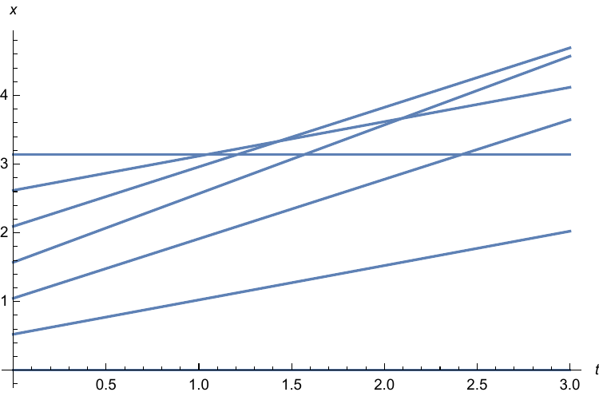
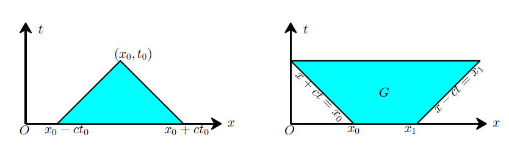

本复习讲义由庄逸为了复习数理方法期末考试而整理，转载请注明来源。
其中内容有不少参考了张波老师上课的讲义。时间紧迫，疏漏之处在所难免，敬请
谅解。

第一版于 2019 年 1 月完成。

# 写在前面 {#sec:prologue}

本复习讲义由庄逸为了复习数理方法期末考试而整理， 转载请注明来源

<https://hfdxmy.cn/math/mathphysic/review-2> 或 [hfdxmy.cn](hfdxmy.cn){.uri}

其中内容有不少参考了张波老师上课的讲义。时间紧迫，疏漏之处在所难免，敬请谅解。

第一版于2019年1月完成。

# 常微分方程 {#sec:ode}

## 名词和概念解释 {#sec:def}

-   **常微分方程：**关于函数及其各阶导数和自变量的方程，如$y'=x+y$，其解为函数。 常微分方程简称ODE(Ordinary Differential Equation)。

-   **线性：**如果常微分方程关于未知**函数**和**其各阶导数**都是一次的， 那么这个方程被称为线性的。注意，和自变量没有关系。如$y''+2y+1=x^2$是线性方程，$yy'+x=0$不是线性方程。

-   **阶数：**常微分方程中出现的最高阶导数的**阶数**称为常微分方程的阶数。如$y'''+y=0$是三阶的。

-   **齐次性：**对于一般线性微分方程$p_n(x)y^{(n)}+\dots+p_0(x)y=q(x)$而言，若方程右端$q(x)\equiv0$， 则这个方程称为是齐次的，否则被称为是非齐次的。

-   **常系数与变系数：**对于具有上面形式的一般线性常微分方程而言，若$p_n(x),\dots,p_0(x)$均为常数， 则方程称为常系数线性方程，否则称为变系数线性方程。

-   **通解与特解：**如果$n$阶ODE的某个解包含$n$个**相互独立的**任意常数，则这个解称为通解。 若某个解不包含任意常数，则称为特解。如对ODE $y''+y=0$而言，$y_1=C_1\sin{x}+C_2\cos{x}$是其通解， $y_2=\sin{x}$是其特解。

-   **定解条件：**如果只是解一个常微分方程，只能得到其通解。为了将任意常数确定下来，补充的条件就是定解条件。 联立常微分方程和合适的定解条件，就能得到同时满足ODE和定解条件的特解。如$y''+y=0$的通解为$C_1\sin{x}+C_2\cos{x}$, 补充定解条件$y(0)=0,y'(0)=2$后得到特解$y=2 \sin{x}$。

ODE的四个修饰语可以叠加使用，但齐次、常系数一般只针对线性而言。如$y'''-xy=2x$称作"三阶·线性·变系数·非齐次·常微分方程" （其实没有点间隔号，加上只是为了区分几个修饰词）。

## 线性ODE的一般理论 {#sec:theory}

一般的$n$阶线性常微分方程可表示为 $$\label{eq:linearode}
  y^{(n)}+p_{n-1}y^{(n-1)}+\dots+p_0(x)y=q(x)$$ 其中$p_{n-1}(x),\dots,p_0(x)$是问题所在区间$I$上的连续函数。

其对应的齐次方程为 $$\label{eq:linearodehomo}
  y^{(n)}+p_{n-1}y^{(n-1)}+\dots+p_0(x)y=0$$

### 解的存在唯一性

方程`\autoref{eq:linearode}`{=latex}满足初值条件 $$y(x_0)=a_0,y'(x_0)=a_1,\dots,y^{(n-1)}(x_0)=a_{n-1}$$ 的解在区间上**存在且唯一**。证明太难，略。

这一性质常用来由初值条件的性质（奇偶性等）推断解的性质，即证明$f(x)$和$f(-x)$均是方程满足条件的解， 那么由唯一性得到$f(x)=f(-x)$，推出偶函数。

注意，如果系数函数在区间上不连续，则没有存在唯一性。如方程$xy''+2y'-y=0$，其系数函数为$\frac{2}{x},-\frac{1}{x}$， 在$0$处间断，于是相应的问题在$\mathbb{R}$上没有存在唯一性。

### 解的叠加原理与齐次方程解的结构

对于齐次线性方程`\autoref{eq:linearodehomo}`{=latex}，若$y_1$和$y_2$是其两个解，那么其线性组合 $C_1y_1+C_2y_2$也是方程的解。证明简单，略。

另一方面，如果这个齐次线性方程在区间$I$上有$n$个**线性无关**的解$y_1,\dots,y_n$， 则其通解可表示为 $$y=\sum_{i=1}^n{C_iy_i}$$ 其中$C_i$是任意常数。在这里，**线性无关**指的是不存在$n$个全不为零的数$t_1,\dots,t_n$， 使得$t_1y_1+\dots+t_ny_n\equiv 0$。若存在，则称为**线性相关**。

> 证明思路则是利用解的存在唯一性，建立齐次线性方程解空间和向量空间的一一对应。 将$n$维向量空间$n$个线性无关的向量的坐标分别构建出$n$个初值问题， 得出$n$个解的线性无关性，并由向量空间的完备性推知方程解空间的完备性。

这些线性无关的$y_1,\dots,y_n$称为齐次方程`\autoref{eq:linearodehomo}`{=latex}（或有时非齐次方程） 的一个**基本解组**。显然基本解组不唯一，因为其内部有不同的常数和线性组合，就像基向量不唯一一样。

### Wronski行列式

线性齐次方程`\autoref{eq:linearodehomo}`{=latex}的$n$个线性无关解$y_1,\dots,y_n$的Wronski行列式是一个**函数**，定义为 $$\label{eq:wronski}
  W=
  \begin{vmatrix}
    y_1&y_2&\dots&y_n\\
    y_1'&y_2'&\dots&y_n'\\
    \vdots&\vdots&&\vdots\\
    y_1^{(n-1)}&y_2^{(n-1)}&\dots&y_n^{(n-1)}
  \end{vmatrix}$$

不同基本解组之间的差异只有线性组合，在Wronski行列式中体现为列的线性组合，对行列式的值 只有正负和常数倍的影响。因此，一个方程只可能有"一种"Wronski行列式的值。这点可以由下面的定理得到。

#### 定理

在区间$I$上，齐次线性常微分方程`\autoref{eq:linearodehomo}`{=latex}的Wronski行列式`\autoref{eq:wronski}`{=latex}满足方程 $$\label{eq:wronskiprop}
  W'+p_{n-1}(x)W=0$$ 于是 $$W=C\mathrm{e}^{-\int{p_{n-1}(x)\mathrm{d}x}}=W_0\mathrm{e}^{-\int_{x_0}^x{p_{n-1}(x)\mathrm{d}x}}$$ 其中$W_0=W(x_0)$，$p_{n-1}(x)$为线性方程中$n-1$阶导数项的系数，也就是从左往右写第二项的系数。 这个一阶线性方程的解法可见后面的`\autoref{eq:ode1homo}`{=latex}部分。

由此，就得到了Wronski行列式的"显式"表达式，从中可以看出其决定性因素只有第二项的系数$p_{n-1}(x)$。 另外，由于指数函数非零恒正连续的性质，Wronski行列式在整个$I$上的正负性由$W_0$决定。即若在某一点 为零，则恒为零；在某一点为正，则恒为正。

用Wronski行列式可以验证基本解组的线性无关性。如果Wronski行列式恒等于零，则参与运算的各函数线性相关； 如果恒不等于零（或等价地不恒等于零，为什么？），则参与运算的各函数线性无关。而恒等于零又等价于在某点等于零。

利用Wronski行列式的显式表达，有时能通过$n-1$个解去求另一个线性无关的解，从而解出方程。这在二阶方程中是 一个重要方法，之后再解释。

**例：**方程$y''+2y'+y=0$的一个基本解组为$\mathrm{e}^{-x},x\mathrm{e}^{-x}$，其Wronski行列式为 $$W=
  \begin{vmatrix}
    \mathrm{e}^{-x}&x\mathrm{e}^{-x}\\
    -\mathrm{e}^{-x}&\mathrm{e}^{-x}-x\mathrm{e}^{-x}
  \end{vmatrix}
  =\mathrm{e}^{-2x}$$ 由方程系数推知Wronski满足 $$W'+2W=0~\Rightarrow~W=C\mathrm{e}^{-2x}$$ 此二者相吻合。

### 非齐次线性方程解的结构 {#sec:nonhomostr}

通过常数变易法(见后`\autoref{sec:constfunc}`{=latex})可由对应的齐次线性方程的通解得到非齐次线性方程`\autoref{eq:linearode}`{=latex}的解为 $$y=\sum_{i=1}^n{C_iy_i}+y^{*}$$ 其中$y_1,\dots,y_n$是齐次线性方程的一个基本解组，$y^{*}$是满足非齐次线性方程的一个任意**特解**， 即不含任意常数的"确定的"一个函数。可见，非齐次线性方程的解由对应的齐次方程$n$个线性无关的通解的线性组合和 一个特解叠加而成。可以用以下公式确定这个特解。 $$\label{eq:special}
  y^{*}=\sum_{i=1}^n{y_i\int_{t_0}^t{\frac{W_i(\tau)}{W(\tau)}q(\tau)\mathrm{d}\tau}}$$ 其中$q(x)$是非齐次方程右端非零项。 $W_i$是Wronski行列式**第$n$行第$i$列的代数余子式**。这可以用常数变易法得到，实际解非齐次方程时 也往往不用套公式而是直接应用常数变易法。具体应用之后再详细说明。

## 一阶线性ODE {#sec:ode1}

先考虑齐次方程 $$\label{eq:ode1homo}
  y'+p(x)y=0$$

可将方程改写为 $$\frac{\mathrm{d}y}{y}=-p(x)\mathrm{d}x$$

两边积分并化简后得到 $$y=C\mathrm{e}^{-\int{p(x)\mathrm{d}x}}$$ 其中经过讨论合并后可得$C\in\mathbb{R}$。这便是一阶线性齐次方程`\autoref{eq:ode1homo}`{=latex}的通解。

然后来看非齐次方程 $$\label{eq:ode1nonhomo}
  y'+p(x)y=q(x)$$ 有数种办法可解。

### 积分因子法

推荐该方法。将方程改写为 $$\mathrm{d}y+p(x)y\mathrm{d}x=q(x)\mathrm{d}x$$

然后两边乘以积分因子$\mathrm{e}^{\int{p(x)\mathrm{d}x}}$，可知等号左端可依据微分的乘法原则合并。

$$\mathrm{d}(y\mathrm{e}^{\int{p(x)\mathrm{d}x}})=\mathrm{e}^{\int{p(x)\mathrm{d}x}}q(x)\mathrm{d}x$$

对两边积分即可得到 $$y\mathrm{e}^{\int{p(x)\mathrm{d}x}}=\int{\mathrm{e}^{\int{p(x)\mathrm{d}x}}q(x)\mathrm{d}x}+C$$

于是解可表为 $$y=\brack{\mathrm{e}^{-\int{p(x)\mathrm{d}x}}}\int{\mathrm{e}^{\int{p(x)\mathrm{d}x}}q(x)\mathrm{d}x}+C\mathrm{e}^{-\int{p(x)\mathrm{d}x}}$$

若将不定积分写为定积分形式，则结合条件$y(x_0)=y_0$可得到特解 $$y=y_0\mathrm{e}^{-\int_{x_0}^x{p(t)\mathrm{d}t}}+\int_{x_0}^x{q(t)\mathrm{e}^{-\int_t^x{p(t)\mathrm{d}t}}}$$

**例**：解方程$y'-2y\tan{x}=4x$

先求积分因子，对$-2\tan{x}$积分得到$2\ln{\abs{\cos{x}}}$，取指数后得到$\cos^2{x}$。于是两边乘积分因子得到 $$\cos^2{x}\mathrm{d}y-2y\sin{x}\cos{x}\mathrm{d}x=4x\cos^2{x}\mathrm{d}x$$

显然左端是$\mathrm{d}(y\cos^2x)$，两边积分得到$y\cos^2{x}=x^2+x\sin{2x}+\cos{2x}/2+C$

于是通解为 $$y=\frac{x^2}{\cos^2{x}}+2x\tan{x}+\frac{1}{2}-\frac{1}{2}\tan^2{x}+\frac{C}{\cos^2{x}}$$

**例**：解方程$y'-2y\tan{x}=4x,y(0)=2$

只需要将上面得到的解代入定解条件即可。 $$2=\frac{1}{2}+C\Rightarrow C=\frac{3}{2}$$ 于是 $$y=\frac{x^2}{\cos^2{x}}+2x\tan{x}+\frac{1}{2}-\frac{1}{2}\tan^2{x}+\frac{3}{2\cos^2{x}}$$ 为方程的特解。

注意，若首项系数不为$1$，需要先将其除掉，再对新的方程应用积分因子法。

**例：**方程$xy'-2y=1/x$，大家一定能看出其积分因子为 $$\mathrm{e}^{\int{-\frac{2}{x}}\mathrm{d}x}=\frac{1}{x^2}$$ 但是如果直接把积分因子乘到方程上，得到 $$\frac{xy'-2y}{x^2}=\frac{1}{x^3}$$ 则不对，而是要乘到首项系数为$1$的方程$y'-2y/x=1/x^2$的方程上，得到 $$\frac{xy'-2y}{x^3}=\frac{1}{x^4}$$ 才能顺利将左边化为$\mathrm{d}(y/x^2)$。

### 常数变易法 {#sec:constfunc1}

在求解齐次方程的时候，我们已经知道方程$y'+p(x)y=0$的通解为 $$y=C\mathrm{e}^{-\int{p(x)\mathrm{d}x}}$$

对于非齐次方程$y'+p(x)y=q(x)$，我们假设解具有类似的形式，不过解的常数变为一个函数，即设解为 $$y=C(x)\mathrm{e}^{-\int{p(x)\mathrm{d}x}}$$

将其代回到方程，化简后得到 $$C'(x)\mathrm{e}^{-\int{p(x)\mathrm{d}x}}=q(x)$$

移项积分得 $$C(x)=\int{q(x)\mathrm{e}^{\int{p(x)\mathrm{d}x}}\mathrm{d}x}+C_1$$

之后的推导与积分因子法相同。

**例：**解方程$y'-2y=x$

对应的齐次方程$y'-2y=0$的通解为$y=C\mathrm{e}^{2x}$，设非齐次方程的解为$y=C(x)\mathrm{e}^{2x}$， 代入原方程得到 $$C'(x)\mathrm{e}^{2x}+2C(x)\mathrm{e}^{2x}-2C(x)\mathrm{e}^{2x}=x$$

即$C'(x)=x\mathrm{e}^{-2x}~\Rightarrow~C(x)=-x\mathrm{e}^{-2x}/2+e^{-2x}/4+C_1$，于是解为 $$y=-\frac{x}{2}-\frac{1}{4}+C_1\mathrm{e}^{2x}$$

### 待定系数法

根据线性微分方程解的叠加原理`\autoref{sec:nonhomostr}`{=latex}，先解出齐次方程的通解， 然后结合方程特征，猜特解的形式，通过待定系数法定出特解。

**例：**解方程$xy'+2y=1$

其对应齐次方程为$xy'+2y=0$，解得通解为$C/x^2$。然后发现其有一个特解$y=1/2$，那么方程的解为 $$y=\frac{C}{x^2}+\frac{1}{2}$$

**例：**解方程$y'+y=2\mathrm{e}^x$

其对应齐次方程通解为$C\mathrm{e}^{-x}$。由方程右端的指数函数，猜想其特解也有$\mathrm{e}^x$的形式，设$A\mathrm{e}^x$为其特解，则 $$A\mathrm{e}^x+A\mathrm{e}^x=2\mathrm{e}^x~\Rightarrow~A=1$$ 于是特解为$\mathrm{e}^x$，方程的解为 $$y=C\mathrm{e}^{-x}+\mathrm{e}^{x}$$

> 待定系数法其实是之后解常系数线性方程用的方法，自然对一阶方程也适用。

### 齐次化方法

对于方程`\autoref{eq:ode1nonhomo}`{=latex}，若系数$p(x)\equiv p$为常数， 并且具有齐次的初始条件$y(0)=0$，则先解齐次方程 $$z'(x;\tau)+pz(x;\tau)=0,~z(0;\tau)=q(\tau)$$ 其中$z(x;\tau)$是$x$的函数，$\tau$为一个参数。那么原方程的解 $$y=\int_0^x{z(x-\tau;\tau)\mathrm{d}\tau}$$

**例：**解方程$y'+y=x,y(0)=0$

先解方程$z'+z=0,z(0)=\tau$，得到 $$z=C\mathrm{e}^{-x},C=\tau$$ 然后积分 $$\int_0^x{\mathrm{e}^{-(x-\tau)}\tau\mathrm{d}\tau}=x-1+\mathrm{e}^{-x}$$ 可验证$y=x-1+\mathrm{e}^{-x}$就是方程的解。

若方程的初始条件为$y(x_0)=0$，则可考虑作相应的平移变换$Y(x)=y(x+x_0)$。 若初始条件为一个常数，即$y(0)=m$，则考虑变换$Y(x)=y(x)-m$。

齐次化方法主要是在偏微分方程中使用，一般不在解ODE中用，因为限制比较多，步骤也比较麻烦难记， 不如别的方法来得经济省事儿。

> 在讲解完四种方法后，要提醒大家的是切忌硬背公式，死套公式。从例题中也可看出， 只需要了解**方法的思路**，作相应的变换，就可以顺利自然地推下去。 单纯地背公式，不仅耗力气，容易搞错，还无法领会各种方法的奥妙所在。

## 高阶线性方程的解法 {#sec:odesolve}

解高阶线性方程分为两部分，先是求出$n$个线性无关的解，然后再求出一个满足非齐次方程的特解。

### Wronski行列式辅助求解 {#sec:wronskisolve}

对于第一部分，求齐次线性方程`\autoref{eq:linearodehomo}`{=latex}的基本解组，没有一般的通法。 但是在已知$n-1$个线性无关的解的情况下，可以考虑利用Wronski行列式求出最后一个解。 其理论推导较为繁琐。以二阶方程为例，已知$y_1$是方程 $$y''+p_1(x)y'+p_0(x)y=0$$ 的一个解，则由Wronski行列式的定义`\autoref{eq:wronski}`{=latex}得到 $$W=
  \begin{vmatrix}
    y_1&y_2\\y_1'&y_2'
  \end{vmatrix}
  =y_1y_2'-y_1'y_2$$ 另一方面，由Wronski行列式的性质`\autoref{eq:wronskiprop}`{=latex}得到 $$W'+p_1(x)W=0$$ 借此可解出$W$。于是则得到关于$y_2$的一阶方程 $$y_1y_2'-y_1'y_2=W$$

**例：**已知$y_1=\mathrm{e}^{-x}$是方程$xy''+(x-2)y'-2y=0$的一个解，求另一个解。

先将方程首项化为$1$，得$y''+(x-2)y'/x-2y/x=0$，然后计算Wronski行列式。 $$W'+\frac{x-2}{x}W=0,~\Rightarrow~W=Cx^2\mathrm{e}^{-x}$$ 这里得到的常数不重要，令其为$1$。另一方面，$W=y_1y_2'-y_1'y_2$，代入得 $$\mathrm{e}^{-x}y_2'+\mathrm{e}^{-x}y_2=x^2\mathrm{e}^{-x}$$ 整理，并利用`\autoref{sec:ode1}`{=latex}中的方法解得 $$y_2'+y_2=x^2,~\Rightarrow~y_2=C_1\mathrm{e}^{-x}+(x^2-2x+2)$$ 可见，其中通解部分就是$y_1$的成分，独属于$y_2$的，与$y_1$线性无关的成分是特解 $y_2=x^2-2x+2$ 于是，原方程的解为 $$y=C_1\mathrm{e}^{-x}+C_2(x^2-2x+2)$$

对于三阶的情况，需要已知两个解，然后解一个二阶方程。显然，二阶方程中通解部分就是两个已知解的线性组合， 剩下的特解就是第三个解。更高阶的情况也是类似。

### 非齐次方程的常数变易法 {#sec:constfunc}

对于高阶非齐次方程`\autoref{eq:linearode}`{=latex}，假设已经完成了第一部分，即已知齐次方程$n$个线性无关的通解 $y_1,\dots,y_n$，现在求其特解$y^{*}$。

在之前，已经给出了特解的表达式`\autoref{eq:special}`{=latex}，但是在实际应用仍然采用"推导式"的做法。 设通解具有形式$C_1(x)y_1+C_2(x)y_2+\dots+C_n(x)y_n$，则各变易常数满足方程组 $$\left\{
    \begin{aligned}
  &y_1C_1'+y_2C_2'+\dots+y_nC_n'=0\\
  &y_1'C_1'+y_2'C_2'+\dots+y_n'C_n'=0\\
      &................\\
      &y_1^{(n-1)}C_1'+y_2^{(n-1)}C_2'+\dots+y_n^{(n-1)}C_n'=q(x)
\end{aligned}
\right.$$ 写成矩阵形式更为直观好记。 $$\begin{pmatrix}
    y_1&y_2&\dots&y_n\\
    y_1'&y_2'&\dots&y_n'\\
    \vdots&\vdots&&\vdots\\
    y_1^{(n-1)}&y_2^{(n-1)}&\cdots&y_n^{(n-1)}
  \end{pmatrix}
  \begin{pmatrix}
    C_1'\\C_2'\\\vdots\\C_n'
  \end{pmatrix}
  =
  \begin{pmatrix}
    0\\0\\\vdots\\q(x)
  \end{pmatrix}$$ 可见左端方阵形式如同Wronski行列式。解出各变易常数即可得到非齐次解。

**例：**解方程$y''-y=2\mathrm{e}^x/(\mathrm{e}^x-1)~(x>0)$

先解齐次方程，两线性无关解可取为$y_1=\mathrm{e}^x,y_2=\mathrm{e}^{-x}$，然后摆出矩阵代入。 $$\begin{pmatrix}
    y_1&y_2\\y_1'&y_2'
  \end{pmatrix}
  \begin{pmatrix}
    C_1'\\C_2'
  \end{pmatrix}
  =
  \begin{pmatrix}
    0\\
    q(x)
  \end{pmatrix}$$ $$\begin{pmatrix}
    \mathrm{e}^x&\mathrm{e}^{-x}\\\mathrm{e}^{x}&-\mathrm{e}^{-x}
  \end{pmatrix}
  \begin{pmatrix}
    C_1'\\C_2'
  \end{pmatrix}
  =
  \begin{pmatrix}
    0\\
   \frac{2\mathrm{e}^x}{\mathrm{e}^x-1}
  \end{pmatrix}$$ 写成方程组形式。 $$\left\{
    \begin{aligned}
      &\exp{x}C_1'+\exp{-x}C_2'=0\\
      &\exp{x}C_1'-\exp{-x}C_2'=\frac{2\exp{x}}{\exp{x}-1}
    \end{aligned}
  \right.$$ 解方程组，得到 $$\left\{
    \begin{aligned}
      &C_1'=\frac{1}{\expx-1}\\
      &C_2'=-\frac{\exp{2x}}{\expx-1}
    \end{aligned}
  \right.
  ~\Rightarrow~
  \left\{
    \begin{aligned}
      &C_1=\ln{(\expx-1)}-x+A\\
      &C_2=-\ln{(\expx-1)}-\expx+B
    \end{aligned}
  \right.$$ 结合$y_1=\expx,y_2=\exp{-x}$，忽略常数，可得特解为 $$y^{*}=(\expx-\exp{-x})\ln{(\expx-1)}-x\expx-1$$ 于是原方程的解为 $$y=D_1y_1+D_2y_2+y^{*}$$ $D_1,D_2$为任意常数。

### 幂级数和广义幂级数解法 {#sec:series}

幂级数解法是用幂级数形式来表示待求函数，将求导化为系数的变换， 最终通过数列递推公式得出幂级数解的办法。

幂级数解的存在性较难判断。对二阶方程$y''+p_1y'+p_0y=0$而言，如果 $p_1,p_0$在某个区间$\abs{x-x_0}<r$上可以展开成收敛幂级数，则该二阶方程 在这个区间上存在收敛的幂级数解。另外，如果$p_1,p_2$在区间内不是解析的，如存在间断点， 则可能不存在幂级数形式的解或幂级数解不收敛。

**例：**解方程$y''-xy'-y=0$

记$y=\sum_{k=0}^{\infty}{a_kx^k}$，则 $$\begin{aligned}
  y'&=\sum_{k=0}^{\infty}{(k+1)a_{k+1}x^{k}}\\
  y''&=\sum_{k=0}^{\infty}{(k+2)(k+1)a_{k+2}x^{k}}
\end{aligned}$$ 代入原方程，得到 $$\sum_{k=0}^{\infty}{(k+2)(k+1)a_{k+2}x^k}-\sum_{k=0}^{\infty}{(k+1)a_{k+1}x^{k+1}}
  -\sum_{k=0}^{\infty}{a_kx^k}=0$$ 即 $$(2a_2-a_0)x^0+\sum_{k=1}^{\infty}{
    \left(
      (k+2)(k+1)a_{k+2}-(k+1)a_k
\right)x^k}=0$$ 由各项系数为零得到 $$a_0=2a_2,~a_k=(k+2)a_{k+2},k\geq 1$$ 显然，奇项和偶项分别是两个解。令$a_0=1,a_1=0$，得到偶项解 $$a_{2n-1}=0,a_{2n}=\prod_{k=1}^n\frac{1}{2k},~n=1,2,\dots$$ $$y_1=1+\sum_{k=1}^{\infty}{\prod_{t=1}^k\frac{1}{2t}x^{2k}}=\sum_{k=0}^{\infty}{\frac{x^{2k}}{(2k)!!}}$$ 令$a_0=0,a_1=1$，得到奇项解 $$a_{2n}=0,a_{2n+1}=\prod_{k=0}^n\frac{1}{2k+1},~n=0,1,\dots$$ $$y_2=\sum_{k=0}^{\infty}{\frac{x^{2k+1}}{(2k+1)!!}}$$ 于是方程的解为$C_1y_1+C_2y_2$。

**广义幂级数**解法是对幂级数解法的扩展，不同之处在于对幂指数引入了一个自由指标$\alpha$。

**例：**解方程$2xy''+y'+xy=0$

设$y=\sum_{k=0}^{\infty}{a_kx^{k+\alpha}}$，并设$a_0\ne 0$，代入方程，得到 $$\alpha(2\alpha-1)a_0x^{\alpha-1}+(\alpha+1)(2\alpha+1)a_1x^{\alpha}
  +\sum_{k=2}^{\infty}{((k+\alpha)(2k+2\alpha-1)a_k+a_{k-2})x^{k+\alpha-1}}=0$$ 由各项系数为零和$a_0\ne 0$假设，得到指标方程$\alpha(2\alpha-1)=0$，即$\alpha=0$或$\alpha=1/2$。当$\alpha=0$时，继续解各项系数，得到 $$a_1=0,~k(2k-1)a_k+a_{k-2}=0$$ 设$a_0=1$，则得到一个解为 $$y_1=\sum_{k=1}^{\infty}{\prod_{t=1}^k\frac{1}{2t(4t-1)}(-1)^kx^{2k}}+1$$ 当$\alpha=1/2$时，得到 $$a_1=0,~k(2k+1)a_k+a_{k-2}=0$$ 设$a_0=1$，另一个解为 $$y_2=\sum_{k=1}^{\infty}{\prod_{t=1}^k\frac{1}{2t(4t+1)}(-1)^kx^{2k+1/2}}+x^{1/2}$$ 于是原方程解为$C_1y_1+C_2y_2$。

需要注意的是广义幂级数解法有时会出现指标方程产生重根，计算过程中自相矛盾等情况，则此时 可能只能解出一个具有广义幂级数形式的解，需要用别的方法才能得到全部的解。

## 常系数线性方程

对于非齐次线性方程`\autoref{eq:linearode}`{=latex}而言，如果各项系数均为常数，即 $p_{n-1}(x)\equiv p_{n-1},\dots,p_0(x)\equiv p_0$，则称其为常系数线性非齐次方程。 对应的也有常系数线性齐次方程。这两个方程存在一般的解法。同样，非齐次方程的结构为 齐次方程的通解线性组合加一个特解，因此仍然先解决齐次方程。

解方程的思想为假设解具有$\exp{tx}$的形式，代回原方程后即得到 $$\label{eq:eigeneq}
  t^n+p_{n-1}t^{n-1}+\dots+p_1t+p_0=0$$ 称为特征方程。在复数域内有$n$个复根$t_1,\dots,t_n$，则$\exp{t_1x},\dots,\exp{t_nx}$ 就是齐次方程的解组。

下面主要考虑二阶方程，对应二次的特征方程。高阶的实数方程在实数域内可分解为一次、二次因子乘积，故同理。

### 特征根为单根

这个情况没有什么特殊的，直接代入即可。

**例：**解方程$y''-4y'-5y=0$

特征方程为$t^2-4t-5=0$，两解$t_1=-1,t_2=5$，于是方程的解为 $$y=C_1\exp{-x}+C_2\exp{5x}$$

### 特征根为重根

设重根为$t_1$，那么一个解为$\exp{t_1x}$，另一个解呢？经过常数变易法可得到 另一个解为$x\exp{t_1x}$。对于高阶的情况也是同理，只需要递增$x$的次数即可。

**例：**解方程$y'''-3y''+3y'-y=0$

特征方程为$t^3-3t^2+3t-1=(t-1)^3=0$，有三重根$t=1$。于是方程的解为 $$y=C_1\expx+C_2x\expx+C_3x^2\expx$$

### 特征根为复根

只需要用到复数的一点知识，处理方式和单根差不多。

**例：**解方程$y''-4y'+5y=0$ 特征方程为$t^2-4t+5=0$，两根为$t_1=2+\mathrm{i},t_2=2-\mathrm{i}$。 $$\exp{(2+\mathrm{i})x}=\exp{2x}(\cos{x}+\mathrm{i}\sin{x})\qquad
  \exp{(2-\mathrm{i})x}=\exp{2x}(\cos{x}-\mathrm{i}\sin{x})$$ 不过注意到只需要找两个**线性无关**的解，最后方程的解可记为 $$y=C_1\exp{2x}\cos{x}+C_2\exp{2x}\sin{x}$$

需要注意的是当方程**系数**中含有复数时，单根也可能出现复数，并且复根不再成对出现。 复根的处理参照单根并结合复数运算即可。出现重根也只需要叠加$x$的幂次。 求出每个特征根后需要将其对应的解各个相加，做不到像上面这样把$\cos$和$\sin$割裂开来。

### 非齐次无冲突

非齐次的情况，只需要确定特解$y^{*}$。可以通过观察非齐次项$q(x)$，利用待定系数法确定。 例如，$q(x)$含有多项式的形式时，考虑设$y^{*}$中有具相同次数的多项式，然后代回方程 确定系数。但是，有时右端形式会与通解产生"冲突"，即通解中有$\expx$，而$q(x)$也含有 $\expx$。此时直接设$A\expx$代回方程只能得到零，需要叠加$x$的幂次。另外，无论 有无冲突，利用常数变易法(`\autoref{sec:constfunc}`{=latex})均可解决。这里只讨论简单的待定系数法。

无冲突的情况，举几个例子即可说明。

**例：**解方程$y''-2y=x^2-x$

观察右端为多项式，设$y^{*}=Ax^2+Bx+C$，代入方程得到 $$2A-2Ax^2-2Bx-2C=x^2-x$$ 由对应系数相等，得到$A=-1/2,~B=1/2,~C=-1/2$，于是 $$y^{*}=-\frac{1}{2}x^2+\frac{1}{2}x-\frac{1}{2}$$

**例：**解方程$y''+2y'+y=\exp{2x}$

设$y^{*}=A\exp{2x}$，代回后得到 $$4A\exp{2x}+4A\exp{2x}+A\exp{2x}=\exp{2x}$$ 解得$A=1/9$，于是 $$y=\frac{1}{9}\exp{2x}$$

**例：**解方程$y''-3y'+2y=3\sin{2x}$

右端为三角函数，设$y^{*}=A\sin{2x}+B\cos{2x}$，代回，得到 $$-4A\sin{2x}-4B\cos{2x}-6A\cos{2x}+6B\sin{2x}+2A\sin{2x}+2B\cos{2x}=3\sin{2x}$$ 比较对应系数，得到 $$\left\{
    \begin{aligned}
      -2A+6B=3\\
      -2B-6A=0
    \end{aligned}
  \right.
  ~\Rightarrow~
  \left\{
    \begin{aligned}
      A=-3/20\\B=9/20
    \end{aligned}
  \right.$$ 得到解为 $$y^{*}=-\frac{3}{20}\sin{2x}+\frac{9}{20}\cos{2x}$$

### 非齐次有冲突

非齐次项与通解冲突的情况只需要叠加$x$幂次即可。举几个例子即可说明。

**例：**解方程$y''-2y'-3y=2\exp{3x}$ 齐次方程两解为$\exp{3x}$和$\exp{-x}$，和右端冲突。此时， 若设$y^{*}=A\exp{3x}$，代回后左端显然为$0$。应设为$y^{*}=Ax\exp{3x}$，代回得到 $$(6\exp{3x}+9x\exp{3x}-2\exp{3x}-6x\exp{3x}-3x\exp{3x})A=2\exp{3x}$$ 其中$x\exp{3x}$项自然抵消（为什么？），比较系数得到$A=-2$，于是 $$y^{*}=-2x\exp{3x}$$

**例：**解方程$y'''-3y''+3y'-y=(x^2-3x)\expx$

之前已经解过这个方程的三个线性无关解为$\expx,x\expx,x^2\expx$。 依据右端有$\expx$，冲突，应当设为$x\expx$，但是仍然冲突。因此需要继续向上， 直到$x^3\expx$为止。另外，考虑到还有二次多项式，最终设特解为$y^{*}=x^3(Ax^2+Bx+C)\expx$。 代回后一通计算，解得$A=1/60,~B=-1/8,~C=0$。于是特解为 $$y^*=(\frac{1}{60}x^2-\frac{1}{8}x)x^3\expx$$

三角函数也可能会产生冲突，同样添加幂次项。

**例：**解方程$y''+4y'+13y=x\exp{-2x}\cos{3x}$

齐次方程的两解为$\exp{-2x}\sin{3x}$和$\exp{-2x}\cos{3x}$，有冲突。 注意到右边还有一个$x$，作为一个一次多项式。因此设特解$y^{*}=x(Ax+B)\exp{-2x}\sin{3x}+x(Cx+D)\exp{-2x}\cos{3x}$。

又经过一通计算后解得（尼玛，算死我了）$A=1/12,B=C=0,D=1/36$。于是特解为 $$y^{*}=\frac{1}{12}x^2\exp{-2x}\sin{3x}+\frac{1}{36}x\exp{-2x}\cos{3x}$$

## 其他的一些东西

### 欧拉方程

在极坐标方程中会遇到。 $$\label{eq:euler}
  r^2R''(r)+rR'(r)-n^2R(r)=0$$ 作变换$r=\exp{t}$，则方程变为 $$\frac{\mathrm{d}^2R}{\mathrm{d}t^2}-n^2R=0$$ 作为一个简单的二阶常系数线性方程，解法就不说了。其实，通过齐次性可以猜测$R$是$r$的幂次函数， 然后通过待定系数法做。在$n\ne 0$时也可以解决。`\tiny `{=latex}在$n=0$的时候主要有一个$\ln{r}$弄不出来，hiahiahia。`\normalsize`{=latex}

### 恰当方程

适用于所有一阶常微分方程（是不是心动了呢？），主要看容不容易凑微分。

**例：**解方程$y'/x+y-3\exp{2x^2}/y=0$

将方程整理并将求导写成微分形式，得 $$y\mathrm{d}y+xy^2\mathrm{d}x=3x\exp{2x^2}\mathrm{d}x$$ 给两边凑上$2\exp{x^2}$，得到 $$2\exp{x^2}y\mathrm{d}y+2xy^2\exp{2x^2}\mathrm{d}x=6x\exp{3x^2}\mathrm{d}x$$ 利用微分法则合并为 $$\mathrm{d}(y^2\exp{x^2})=\mathrm{d}(\exp{3x^2})$$ 于是解为 $$y^2=\exp{2x^2}+C\exp{-x^2}$$

`\tiny `{=latex}什么？你问我怎么看出凑的积分因子？~~当然是因为我是倒着出题的呀，哈哈哈哈哈哈哈哈哈~~咳咳咳，`\normalsize `{=latex}积分因子主要凭借经验和观察，当然也有一般的求解法。在线性的时候，就是之前介绍的积分因子法。如果不是线性，可以参照百度百科的积分因子词条，需要满足一定条件，解一个（大概困难程度差不多的）偏微分方程。 `\newpage`{=latex}

# 偏微分方程 {#sec:pde}

## 简介

### 名词和概念解释 {#名词和概念解释}

类似常微分方程。

-   **偏微分方程：**联系**多元函数及其各阶偏导数和各变量**的方程称为偏微分方程 (Partial Differential Equation, PDE)。如$u_{xx}+u_{y}=x+y$。其解为一个多元函数。

-   **元数：**（大概是非官方的说法）未知函数的变量个数称为PDE的元数，如$u(x,y)$满足的PDE就称为二元偏微分方程。

-   **线性：**偏微分方程中未知函数及其各阶偏导数如果都是**一次**的，那么称为线性偏微分方程，否则称为非线性偏微分方程。如$u_x+yu_y=u$是线性PDE，$u_xu_y+x=u$是非线性PDE。线性方程总能写成$\mathcal{L}u=0$的形式，例如 $$\label{eq:34}
    u_{xx}+u_{yy}+u_{zz}=0 \quad\Leftrightarrow \quad \mathcal{L}u=0,\;\mathcal{L}=(\partial_{xx}+\partial_{yy}+\partial_{zz})$$

    更确切地说，线性是指满足以下条件 $$\label{eq:35}
    \mathcal{L}(u_1+u_2)=\mathcal{L}(u_1+u_2) \qquad \mathcal{L}(cu)=c\mathcal{L}(u)$$

    如果PDE是线性的，则有两个好处（**叠加原理**, Superposition）：

    -   对于齐次方程（见后）而言，如果$u_1,\dots,u_n$都是齐次线性方程的解，则其线性组合也是解。证明略。

    -   对于非齐次方程$\mathcal{L}u=g,\;g\neq 0$而言，若$\mathcal{L}u_1=g,\; \mathcal{L}u_2=0$，则$u_1+u_2$是原来非齐次方程的解。

-   **阶数：**偏微分方程中出现的**最高阶导数的阶数**称为PDE的阶，如$u_{xx}+u_{xxy}=xy$是三阶PDE。

-   **通解与特解，定解条件：**仅通过一个偏微分方程得到的解含有任意**函数**（这一点与ODE不同，请注意），如$4u_x-3u_y=0$的解$u=f(3x+4y)$，$f$为一个任意函数。如果再附加一些方程，如$u(0,y)=y^3$，则可定出不含任意条件的解$u=(3x+4y)^3/64$，称为**特解**。用于确定方程的条件称为**定解条件**。定解条件可分为初值条件和边值条件。

-   **齐次性(homogeneous)：**对于线性PDE而言，具有 $$\sum{a_{i_1,\cdots,i_n}(x_1,\cdots,x_n)\frac{\partial^{\sum{i_k}}u}{\partial x_1^{i_1}\dots\partial x_n^{i_n}}}=q(x_1,\cdots,x_n)$$ 的形式。如果关于各变量的函数$q\equiv 0$，那么这个PDE就称为是齐次的。否则就称为是非齐次的。

    有时定解条件也有齐次与非齐次之分，如$u(x,0)=\phi(x)$，若$\phi(x)\equiv 0$，则这个条件称为是齐次的，否则称为非齐次的。

-   **常系数与变系数：**对于线性PDE而言，如果系数$a_{i_1,\dots,i_n}(x_1,\cdots,x_n)\equiv a_{i_1,\dots,i_n}$为常数，则称为线性常系数PDE。否则称为线性变系数PDE。

同样，元数、阶数、线性、齐次性、常系数修饰词可以叠加使用，如二元·二阶·线性·变系数·非齐次偏微分方程$u_{xx}+2u_x+yu_{yy}=x^2+y^2$（实际使用中当然也没有点间隔号，这里加上只是为了明显区分）。

> 这些形容词其实是将PDE作了分类，对于每个类别的PDE，需要利用其特性， 采取相适应的手段来解决。ODE也是如此。在讨论二阶物理方程时，还会有更多的形容词，也就是需要 分得更细才能解方程。

### 偏微分方程举例

1.  $u_t-u_{xx}=0$ `\qquad `{=latex}二阶热方程

2.  $u_t-c^2(u_{xx}+u_{yy}+u_{zz})=0$ `\qquad `{=latex}二阶波动方程

3.  $u_{xx}+u_{yy}+u_{zz}=0$ `\qquad `{=latex}Laplace方程

4.  $iu_t+u_{xx}+u_{yy}=0$ `\qquad `{=latex}Schrödiner方程

5.  $u_t+uu_x-u_{xx}=0$ `\qquad `{=latex}Burgers方程

6.  $u_t+u_{xxx}+6uu_x=0$ `\qquad `{=latex}三阶方程，KdV方程

7.  $u_{tt}+u_{xxxx}=0$ `\qquad `{=latex}四阶杆振动方程

8.  $u_x^2+u_y^2=1$ `\qquad `{=latex}几何光学方程 Eikonal方程

## 一阶线性方程 {#sec:pde1}

后面一般只考虑二元PDE。

### 直接积分法 {#sec:straightint}

对于简单的偏微分方程，如$u_x=1$，直接在方程两边对$x$积分即可。 但需要注意的是，原本加上的积分常数变为关于另一个变量的积分**常函数**。

**例：**解方程$u(x,y),u_{xx}=2$

积分一次得到$u_x=2x+f(y)$，再积分一次得到$u=x^2+f(y)x+g(y)$，其中$f,g$都是任意函数。

**例：**解方程$u(x,y),u_{xy}=2x$

先对$y$积分得到$u_x=2xy+f(x)$，再对$x$积分，由于$f$是任意函数，积分后还可以一个任意函数表示。 $u=x^2y+F(x)+g(y)$

### 齐次常系数特征线法 {#sec:eigenline}

此时方程具有一般形式 $$au_x+bu_y+cu=0$$

先考虑$c=0$的情况，即$au_x+bu_y=0$。将其写为$(a,b)\cdot \nabla u=0$，则可看出 二元函数$u$沿着$(a,b)$方向的方向导数为零，也就是$u$在直线 $$L:
  \left\{

    \begin{aligned}
      &x=x_0+at\\
      &y=y_0+bt
    \end{aligned}
  \right.$$ 上为常数。将直线写为$bx-ay=m,~m=bx_0-ay_0$，既然$u$在直线$L$上为常数，那么$u$的 值就由$m$唯一决定，即$u=f(m)=f(bx-ay)$，$f$为任意函数。验证可知其确实满足方程。

事实上，可作坐标变换$X=bx-ay,Y=ax+by$，则 $$u_x=u_XX_x+u_YY_x=bu_X+au_Y,\qquad u_y=-au_X+bu_Y$$ 于是 $$au_x+bu_y=0~\Rightarrow~abu_X+a^2u_Y-abu_X+b^2u_Y=(a^2+b^2)u_Y=0$$ 显然$a^2+b^2\ne 0$，于是$u_Y=0$，简单积分可得$u=f(X)=f(bx-ay)$

对于$c\ne 0$的情况，沿用坐标变换法，得到 $$(a^2+b^2)u_Y+cu=0$$ 此时可看作一个简单的常系数一阶齐次"ODE"，只需将解中常数变为常函数即可。 $$u=f(X)\exp{-\frac{c}{a^2+b^2}Y}=f(bx-ay)\exp{-\frac{c}{a^2+b^2}(ax+by)}$$

### 非齐次坐标变换法

对于非齐次方程，也可利用坐标变换法。

**例：**解方程$u_x+u_y+u=\exp{x+3y},u(x,0)=0$

令$X=x-y,Y=x+y$，则$u_x=u_X+u_Y,u_y=-u_X+u_Y$，方程变为 $$2u_Y+u=\exp{-X+2Y}=\exp{-X}\exp{2Y}$$ 将$\exp{-X}$视为常数，则方程成为一个关于$Y$的**一阶常系数线性非齐次方程**。其解为 $$u=f(X)\exp{-\frac{1}{2}Y}+\frac{1}{5}\exp{-X}\exp{2Y}$$ 结合条件$u(x,0)=0$可知$X=x,Y=x$时$u=0$，于是 $$f(x)\exp{-\frac{1}{2}x}+\frac{1}{5}\expx=0,~\Rightarrow~f(x)=-\frac{1}{5}\exp{\frac{3}{2}x}$$ 于是所求的解为 $$u=-\frac{1}{5}\exp{\frac{3X-Y}{2}}+\frac{1}{5}\exp{2Y-X}
  =-\frac{1}{5}\exp{x-2y}+\frac{1}{5}\exp{x+3y}$$

其实，此题参照非齐次线性常系数方程的"齐次方程通解+待定系数凑特解"法也能得到相同结果，但是 线性PDE解的结构老师没有特别讲，我也不敢下定论这样做就一定正确。

**例：**解方程$u_x+2u_y+(2x-y)u=2x^2+3xy-2y^2$

作变换$X=x+2y,\;Y=2x-y$，容易验证方程变为 $$\label{eq:1}
5u_X+Yu=XY$$ 将其看作一个关于$X$的常微分方程，两边除去碍眼的Y，得到 $$\label{eq:2}
\frac{5}{Y}u_X+u=X$$ 稍微凑一下，把零阶导数$u$吃掉，令 $$\label{eq:3}
u=v\exp{-\frac{Y}{5}X} \qquad u_X=v_X\exp{-\frac{Y}{5}X}-\frac{Y}{5}v\exp{-\frac{Y}{5}X}$$ 方程变为 $$\label{eq:6}
\frac{5}{Y}v_x\exp{-\frac{Y}{5}X}=X$$ 移项，直接积分得到 $$\label{eq:5}
v=\brack{X-\frac{5}{Y}}\exp{XY/5}+C(Y)$$ 代回$u$，得到 $$\label{eq:4}
u=  X-\frac{5}{Y}+C(Y)\exp{-XY/5}$$ 代回原变量略。

### 齐次变系数特征线法

对于变系数的情况，例如 $$xu_x+2yu_y=0$$ 用类似的方法可知$u$沿着方向$(x,2y)$的方向导数为零。此时特征直线变为特征曲线。 这个曲线满足 $$\frac{\mathrm{d}y}{\mathrm{d}x}=\frac{2y}{x}$$ 解得$L:y=Cx^2$。既然$u$在曲线$L$上保持不变，那么$u$的值由曲线族中每个曲线的属性 ，即$C$的值决定。于是解为 $$u=f\brack{\frac{y}{x^2}}$$

如果想要更好记，对于方程 $$a(x,y)u_x+b(x,y)u_y=0$$ 而言，可以对应地摆出式子 $$\frac{\mathrm{d}x}{a(x,y)}=\frac{\mathrm{d}y}{b(x,y)}$$ 然后求出特征线。并且，这样的写法可以很方便自然地扩展到解一阶多元变系数线性PDE。

### 化为常微分方程法

思想和特征线法类似，但比较直接。例如方程 $$\label{eq:41}
u_t+\sin t u_x=0 \qquad u(x,0)=\expx$$ 考虑$u(x,t)=(x(t),t)$， $$\label{eq:42}
\dd{u}{t}=\pp{u}{x}\dd{x}{t}+\pp{u}{t}$$ 相比较，则得到两个常微分方程 $$\label{eq:43}
\dd{u}{t}=0 \qquad \dd{x}{t}=\sin t$$ 设一个初值$x_0$，得到$x=-\cos t+x_0+1$，$u=\exp{x_0}$以满足原初值条件，于是$u=\exp{x+\cos t-1}$。

### 二元PDE变量转换法

对于ODE而言，自变量和因变量转换是十分容易的，$\mathrm{d}y$和$\mathrm{d}x$可以自由移项，高阶导数也可作变换。在偏微分方程中， 一般而言没有这么方便，但有时会遇到一些特殊情况。例如考虑齐次方程组 $$\begin{align}
    A_1u_x+B_1u_y+C_1v_x+D_1v_y=0  \\
A_2u_x+B_2u_y+C_2v_x+D_2v_y=0
  \end{align}$$ 其中$A_i,B_i,C_i,D_i\;(i=1,2)$均是关于$u,v$的函数。由于$u,v$都是关于$x,y$的函数，因此在求解时较为困难。但是我们作一些变换，使得$x,y$成为$u,v$的函数。条件是雅可比行列式不为零。 $$\label{eq:50}
J=\pp{(u,v)}{(x,y)}=
\begin{vmatrix}
  u_x&u_y \\
  v_x&v_y
\end{vmatrix}
\neq 0$$ 作变换关键是要求出$x_u,x_v$等与$u_x$等量的转换关系。可以直接计算： $$\begin{aligned}
\label{eq:51}
x_u&=\ppp{x}{u}{v}=\ppp{u}{x}{v}^{-1}= \brack{\ppp{u}{x}{y}+\ppp{u}{y}{x}\ppp{y}{x}{v}}^{-1} \\
  &= \brack{\ppp{u}{x}{y}-\ppp{u}{y}{x}\ppp{y}{v}{x}\ppp{v}{x}{y}}^{-1} \\
  &=\frac{1}{u_x-u_yv_y^{-1}v_x}=\frac{v_y}{u_xv_y-u_yv_X} \\
  &=\frac{v_y}{J}
\end{aligned}$$ 其他类似。或者直接利用方程组，分别对$x,y$求导 $$\begin{align}
  x(u(x,y),v(x,y))=x \\
  y(u(x,y),v(x,y))=y
\end{align}$$ 得 $$\begin{align}
    x_uu_x+x_vv_x=1 \\
    x_uu_y+x_vv_y=0 \\
    y_uu_x+y_vv_x=0 \\
    y_uu_y+y_vv_y=1
  \end{align}$$ 解得 $$\begin{aligned}
\label{eq:71}
x_u=\frac{v_y}{J} \qquad x_v=-\frac{u_y}{J} \qquad y_u=-\frac{v_x}{J} \qquad y_v=\frac{u_x}{J}
\end{aligned}$$ 代回方程，消去$J$，得 $$\begin{align}
    A_1y_v+B_1x_v+C_1y_u+D_1x_u=0  \\
A_2y_v+B_2x_v+C_2y_u+D_2x_u=0
  \end{align}$$ 此时可以将$u,v$视为自变量，则各系数中不含未知函数$x,y$。

### 拟线性和非线性波的性质

考虑方程 $$\label{eq:49}
u_t+u u_X=0 \qquad u(x,0)=\varphi(x)$$ 对应两个常微分方程及初始条件 $$\label{eq:72}
\ddt[x]=u \qquad \ddt[u]=0 \qquad x_0=0 \qquad u(0)=\varphi(x_0)$$ 解第二个方程，得$u=\varphi(x_0)$，然后解 $$\label{eq:73}
\ddt[x]=\varphi(x_0) \quad\Rightarrow \quad x=\varphi(x_0)t+x_0$$ 由这方程反解出$x_0=f(x,t)$，那么解为$u=\varphi(f(x,t))$.

这个方程有些奇异的性质，来求 $$\label{eq:74}
\pp{u}{x}=\dd{u}{x_0}\pp{x_0}{x}=\frac{\varphi'(x_0)}{1+t\varphi'(x_0)}$$ 其中 $$\label{eq:75}
1=\varphi'(x_0)\pp{x_0}{x}t+\pp{x_0}{x} \quad\Rightarrow \quad \pp{x_0}{x}=\frac{1}{1+\varphi't}$$ 由 `\autoref{eq:74}`{=latex}可知，如果$\varphi'(x_0)<0$，那么在某个时间$t$分母将为零。

例如$\phi(x_0)=\sin x_0$，在$x-t$图中，看特征线的分布将会相交。

<figure>

<figcaption>特征线相交</figcaption>
</figure>

另一方面，由于 $$\label{eq:76}
u=\varphi(x_0)=\varphi(x-\varphi(x_0)t)=\varphi(x-ut)$$ 这个结果表示这个波以$u$的速度传播。那么，如果此波在初始时是正常的波形状，那么振幅越大的地方传播速度越快， 最终波峰右侧斜率将达到无穷大。

## 二阶线性偏微分方程的一般理论 {#sec:pde2}

之后要讨论的方程都属于二阶线性PDE，首先提一些一般性的理论。

### 分类定理

二阶线性PDE的一般形式如下 $$a_{11}u_{xx}+2a_{12}u_{xy}+a_{22}u_{yy}+a_1u_x+a_2u_y+a_0u=0$$

通过变量替换，所有二元二阶线性PDE可以化为椭圆型、双曲型、抛物型中的一种。 可通过判别式$D=a_{11}a_{22}-a_{12}^2$判断。

1.  $D>0$，则方程可化为椭圆型方程，二阶项具有$u_{xx}+u_{yy}$的形式。

2.  $D<0$，则方程可化为双曲型方程，二阶项具有$u_{xx}-u_{yy}$的形式。

3.  $D=0$，则方程可化为抛物型方程，二阶项具有$u_{xx}$的形式。

对于多元的情况，可以通过矩阵的特征值的正负性来判断，也有类似的判别法。此处略。

对于变系数的情况，在平面上不同的区域，方程可能具有不同的类型。

### 形容词解释

常见的偏微分方程方程的分类可由其名称看出。最长的名称为：非齐次·波动方程·第一类·非齐次·单边·齐次·初值问题。 对其按照顺序进行逐一解释。

1.  **非齐次：**用于修饰波动方程。非齐次的波动方程即$u_{tt}-c^2u_{xx}=f(x,t)$， $f(x,t)$不恒为零。同位的还有：**齐次**、**（省略）**（省略一般默认表示齐次）。

2.  **波动方程：**中心属性词，表示这个PDE主要具有波动方程的形式。

3.  **第一类：**修饰边界条件。同位的还有：**第二类**、**第三类**、**混合**等。第一类指的是如$u(0,t)=g(t)$的条件，第二类指的是如$u_x(0,t)=g(t)$的条件。混合则一般针对双边而言，指的是在不同边上有不同类的条件。边界条件具体介绍见 `\autoref{sec:condition}`{=latex}。

4.  **非齐次：**修饰边界条件，表示边界条件中$g(t)$不恒为零。同位的还有：**齐次**、**（省略）**（省略默认表示齐次）。

5.  **单边：**修饰边界条件。同位的还有**双边**等。单边指的是考虑半直线时添加的$u(0,t)$等条件，双边指的是考虑一个线段时添加的$u(0,t)$和$u(l,t)$等条件。

6.  **齐次：**修饰初始条件。对波动方程而言，有两个初始条件。齐次则表示$u(x,0)$和$u_t(x,0)$均恒为零。否则称为非齐次。同位的还有：**非齐次**、**（省略）**（这里省略默认表示非齐次，因为初始条件一般都是非零的）

7.  **初值问题：**表示给定了相应的初始条件。

### 初值条件和边值条件 {#sec:condition}

初值条件和边值条件都是定解条件，但是它们有一定的物理意义。

#### 初值条件

对于某一个时刻$t_0$，给定解的状态。

例如，对热传导方程$u_t-u_{xx}=0$，因为其关于$t$是一阶的，因此需要给一个初值条件$u(x,t_0)=\phi(x)$才能确定解。 相对应地，波动方程$u_{tt}-c^2u_{xx}=0$需要给两个初值条件才能确定解。

#### 边值条件

偏微分方程一般求解的区域并不是全空间，而在某些边界上受到控制。例如吉他的弦，两端是固定的，只在两点之间满足弦振动方程。 一般而言，大部分边值条件可分为三类**线性**的情况：

1.  第一类边界条件(Dirichlet) $$\label{eq:36}
    u(\partial\Omega)=g(\partial\Omega,t)$$

2.  第二类边界条件(Neumann)，表示表面内外物质交换。 $$\label{eq:37}
    \pp{u}{n}\bigg|_{\partial \Omega}=g$$

3.  第三类边界条件(Robin) $$\label{eq:38}
    \brack{\alpha \pp{u}{n}+\beta u}\bigg|_{\partial\Omega}=g$$

注意，一般谈论偏微分方程时，默认偏微分方程主体控制方程在边界内部成立，而在边界上是否成立则有待商榷，需要进一步验证。因此一般说"在区域内部满足微分方程，在边界上满足边界条件"。 例如，若边界上函数$g$性质不好，不能求导，则其不能满足微分方程。

**例：**对于固定两端的弦振动，有

-   控制方程： $u_{tt}-u_{xx}=0$ `\qquad `{=latex}$t>t_0,x_1<x<x_2$

-   初值条件： $u(x,t_0)=\phi(x)$ `\quad `{=latex}$u_t(x,t_0)=\varphi(x)$ `\qquad `{=latex}$x_1<x<x_2$

-   边值条件： $u(x_1,t)=g_1(t)$ `\quad `{=latex}$u(x_2,t)=g_2(t)$ `\qquad `{=latex}$t>t_0$

### 定解问题的适定性

`\index{适定性}`{=latex} 一个描述物理现象的PDE，加上适当的定解条件，就称为一个**定解问题**，可用于 描述一个具体的物理过程。 定解问题的**适定性**有三个方面。

1.  存在性：至少存在一个解满足PDE和所有定解条件。 `\index{存在性}`{=latex}

2.  唯一性：至多只有一个解满足PDE和所有定解条件。`\index{唯一性}`{=latex}

3.  稳定性：解连续依赖于定解条件，即定解条件有小变化时，解也只能有小的变化。`\index{稳定性}`{=latex} 否则将产生混沌现象。

满足以上三个条件的定解问题才称为是适定的。

**例：**Hadamard问题 `\index{Hadamard问题}`{=latex} 考虑Laplace方程，具有"初值条件"的形式 $$\label{eq:39}
\begin{aligned}
  &u_{xx}+u_{yy}=0 \qquad -\infty<x<+\infty \quad y>0 \\
  &u(x,0)=0 \\
  &\pp{u}{y}(x,0)=\exp{-\sqrt{n}}\sin(nx)
\end{aligned}$$ 其解为 $$\label{eq:40}
u=\frac{1}{n}\exp{-\sqrt{n}}\sin(nx)\sinh(ny)$$ 因为当$n\rightarrow +\infty$时，方程 `\autoref{eq:39}`{=latex} 中各方程右端均为零，解为$u=0$。边界条件中$\exp{-\sqrt{n}}$项较小，且随$n$趋向无穷时 趋向于$0$，因此是小扰动。但是，它的解中含有$\sinh(ny)$，是一个趋向于无穷的量。因此，这个方程解不是适定的。更进一步的道理是，Laplace方程要想有 适定性的解，就不能给初值条件，只能给绕一圈的边界条件。

### 波方程与热方程的性质对比

具体性质的导出见后相关章节。

\centering

::: {#tab:compare}
            性质                  波方程          热方程
  ------------------------ -------------------- ----------
          传播速度                 有限            无限
            奇点               随特征线传播      立刻消失
       适定性$(t>0)$               满足            满足
       适定性$(t<0)$               满足           不满足
          极值原理                  无              有
   $t\rightarrow +\infty$   能量守恒，没有衰减   衰减至零
            信息                   传输          逐渐消散

  : 波方程与热方程的性质
:::

## 弦振动方程与波动方程

> 与老师讲义上的顺序不同，后面的顺序将按照方程类型一个一个来。 其核心思想为将PDE分为不同的类别，对不同的类别进行单独讨论。 较为通用的Fourier变换和特殊的格林函数最后单列。

下面研究一维形式的波动方程。方程形式为 $$\label{eq:wave}
  u_{tt}=c^2u_{xx},~x\in \mathbb{R},~t>0$$ 其中$u$表示弦在时间$t$，位置$x$处的振幅。

### 一维波方程的导出

考虑一根水平固定两端的均质弦在垂直方向上振动，并且没有水平运动。垂直振动幅度用$u(x)$描述，弦上张力为$T$。对于$x_1,x_2$区间内的一段弦， 水平方向上的合力应为零，垂直方向上的合力则等于质量乘加速度。 $$\label{eq:77}
\frac{T}{\sqrt{1+u_x^2}}\bigg|_{x_1}^{x_2} = 0 \qquad \frac{Tu_x}{\sqrt{1+u_x^2}}\bigg|_{x_1}^{x_2}=\int\limits_{x_1}^{x_2}\rho u_{tt}\mathrm{d}x$$ 假设波动很小，$\abs{u_x}\ll 1$，那么$\sqrt{1+u_x^2}\approx 1$，于是 水平方向上得到$T=\const$，垂直方向上得到 $$\label{eq:78}
\int\limits_{x_1}^{x_2}(Tu_x)_x\mathrm{d}x=\rho \int\limits_{x_1}^{x_2}u_{tt}\mathrm{d}x$$ 于是得到 $$\label{eq:79}
Tu_{xx}=\rho u_{tt} \qquad u_{tt}=c^2u_{xx} \quad c=\sqrt{\frac{T}{\rho}}$$

### 波动方程的通解

波动方程`\autoref{eq:wave}`{=latex}可以像二次因式一样分解，成为 $$(\partial_t-c\partial_x)(\partial_t+c\partial_x)u=0$$ 记$(\partial_t+c\partial_x)u=v$，则$v_t-cv_x=0$。这是一阶常系数齐次PDE，参照 `\autoref{sec:eigenline}`{=latex}中的方法可解得$v=h(x+ct)$。然后解 $$u_t+cu_x=h(x+ct)$$ 这是一阶常系数非齐次PDE。

由于$u$求导后是$x+ct$的某个函数，那么$u$本身应该也是某个$x+ct$的函数。设$u=w(x+ct)$， 代入得到$w'=h/2c$。经过一次积分后，$h$由于是个任意函数，其积分$H$也是个任意函数。同时要 加上$x-ct$的任意函数。

或是利用坐标变换，令$\xi=x-ct,\eta=x+ct$，变换得方程为$u_{\xi \eta}=0$，于是 $u=f(\xi)+g(\eta)$

最后得到 $$u=f(x+ct)+g(x-ct)$$ 其中$f,g$都是任意函数。

### 齐次波动方程的初值问题

引入$u$及$u_t$在$t=0$时的表现，即**初始条件**，就得到齐次波动方程的**初值问题**。 此处考虑的波动还是在整个实轴上，对应的弦也设为无限长。 $$\label{eq:wave010}
  \begin{align}
    &u_{tt}=c^2u_{xx},~t>0\\
    &u(x,0)=\phi(x),~u_t(x,0)=\psi(x)
  \end{align}$$

只需要将通解代入两初始条件，定出函数即可。 $$\left\{

    \begin{aligned}
      &f(x)+g(x)=\phi(x)\\
      &cf'(x)-cg'(x)=\psi(x)
    \end{aligned}
  \right.$$ 对第二个式子积分得到 $$f(x)-g(x)=\frac{1}{c}\int_0^x\psi(\tau)\mathrm{d}\tau+C$$ 然后解得 $$\left\{

    \begin{aligned}
      f(x)=\frac{1}{2}\phi(x)+\frac{1}{2c}\int_0^x\psi(\tau)\mathrm{d}\tau+\frac{1}{2}C\\
      g(x)=\frac{1}{2}\phi(x)-\frac{1}{2c}\int_0^x\psi(\tau)\mathrm{d}\tau-\frac{1}{2}C
    \end{aligned}
  \right.$$

代回$u$的表达式，即得到齐次波动方程初值问题`\autoref{eq:wave010}`{=latex}的解 $$\label{eq:Dalembert}
  u=\frac{1}{2}(\phi(x+ct)+\phi(x-ct))+\frac{1}{2c}\int_{x-ct}^{x+ct}{\psi(\tau)}\mathrm{d}\tau$$

这被称为**达朗贝尔公式**。然而解题时不需要硬背公式，直接用推导的方式解即可。

**例：**解方程$u_{tt}=c^2u_{xx},~u(x,0)=2\expx,~u_t(x,0)=2c\cos{x}$ 由$u=f(x+ct)+g(x-ct)$得到 $$f(x)+g(x)=2\expx,\qquad cf'(x)-cg'(x)=2c\cos{x}$$ 积分得 $$f(x)-g(x)=2\sin{x}+2C$$ 于是 $$f(x)=\expx+\sin{x}+C,~g(x)=\expx-\sin{x}-C$$ 解为 $$u=\exp{x+ct}+\exp{x-ct}+\sin{(x+ct)}-\sin{(x-ct)}=2\expx\cosh{ct}+2\cos{x}\sin{ct}$$

### 非齐次波动方程的齐次初值问题

如果振动时还有外加力，则波动方程就成为非齐次的。若其最初处于静止状态，就得到了 非齐次波动方程的齐次初值问题。 $$\label{eq:wave100}
  \begin{align}
    &u_{tt}-c^2u_{xx}=f(x,t),~t>0\\
    &u(x,0)=u_t(x,0)=0
  \end{align}$$

非齐次波动方程的齐次初值问题可以通过Duhamel齐次化方法解决。为了解方程`\autoref{eq:wave100}`{=latex}， 首先要解函数$w(x,t;\tau)$，其满足 $$\begin{align}
    &w_{tt}-c^2w_{xx}=0,~t>\tau\\
    &w(x,t=\tau;\tau)=0,~w_t(x,t=\tau;\tau)=f(x,\tau)
  \end{align}$$ 在此基础上，原方程的解为 $$u(x,t)=\int_0^t{w(x,t;\tau)}\mathrm{d}\tau$$

如果令$v(x,t;\tau)=w(x,t+\tau;\tau)$，则 $$\begin{align}
    &v_{tt}-c^2v_{xx}=0,~t>0\\
    &v(x,0;\tau)=0,~v_t(x,0;\tau)=f(x,\tau)
  \end{align}$$ 这是齐次波动方程的初值问题，可通过`\autoref{eq:wave010}`{=latex}解决。最后， $$u(x,t)=\int_0^t{v(x,t-\tau;\tau)}\mathrm{d}\tau$$

### 非齐次波动方程的非齐次初值问题

如果不仅有外加力，初始条件还不齐次，如 $$\label{eq:wave110}
  \begin{align}
    &u_{tt}-c^2u_{xx}=f(x,t),~t>0\\
    &u(x,0)=\phi(x),~u_t(x,0)=\psi(x)
  \end{align}$$

则可以考虑由线性叠加原理，解以下两个方程 $$\begin{align}
    &v_{tt}-c^2v_{xx}=f(x,t),~t>0\\
    &v(x,0)=0,~v_t(x,0)=0
  \end{align}$$ 这是非齐次波动方程齐次初值条件，可用齐次化原理，依照`\autoref{eq:wave100}`{=latex}解。 $$\begin{align}
      &w_{tt}-c^2w_{xx}=0,~t>0\\
      &w(x,0)=\phi(x),~w_t(x,0)=\psi(x)
  \end{align}$$ 这是齐次波动方程的初值问题，可参照`\autoref{eq:wave010}`{=latex}解

最后$u=v+w$，可验证其满足方程`\autoref{eq:wave110}`{=latex}

### 波动方程的性质

由达朗贝尔公式`\autoref{eq:Dalembert}`{=latex}，可知$u(x_0,t_0)$由 $\phi(x)$在$x_0-ct_0,x_0+ct_0$两点的值，和$\psi(x)$在区间$(x_0-ct_0,x_0+ct_0)$上的值 决定。换言之，对于$(x_0,t_0)$处的状态，只受初始时区间$(x_0-ct_0,x_0+ct_0)$上弦状态的影响。 区间$(x_0-ct_0,x_0+ct_0)$便称为$(x_0,t_0)$的**依赖区域**。而区间和点$(x_0,t_0)$所围成的三角形区域称为 区间的**决定区域**。

函数的**支集**是一个区间$[a,b]$，在这个区间外函数恒为零。如果初始函数$\phi(x)$和 $\psi(x)$有共同的支集区间$[x_0,x_1]$，那么在特征线$x+ct=x_0$和$x-ct=x_1$之外的区域， 函数$u$将总为零。特征线之内的区域$G$，就称为区间$[x_0,x_1]$的**影响区域**。如`\autoref{fig:wave}`{=latex} 所示。这正如同波向两端传播。

<figure id="fig:wave">

<figcaption>依赖区域与影响区域</figcaption>
</figure>

接下来讨论能量守恒定律。为保证积分收敛，我们假设在无穷远处$u=u_t=0$，这只要初始条件有支集 即可做到。设弦线密度为$\rho$，张力为$T$，则动能和势能分别定义为 $$KE(t)=\frac{1}{2}\int_{\mathbb{R}}\rho u_t^2\mathrm{d}x \qquad
  PE(t)=\frac{1}{2}\int_{\mathbb{R}}T u_x^2\mathrm{d}x$$ 此外，波动方程$u_{tt}=c^2u_{xx}$还满足$c^2=T/\rho$，于是$\rho u_{tt}=T u_{xx}$

可以通过能量积分来证明。在波动方程两端乘$u_t$并在$x$轴上积分，左边得到 $$\rho\int_{\mathbb{R}} u_{tt}u_{t}\mathrm{d}x
  =\frac{1}{2}\rho\brack{\int_{\mathbb{R}}u_t^2\mathrm{d}x}_t$$ 右边利用分部积分得到 $$T \int_{\mathbb{R}}u_{xx}u_{t}\mathrm{d}x=T\brack{u_xu_t|_{-\infty}^{\infty}-\int_{\mathbb{R}}u_xu_{xt}\mathrm{d}x}$$ 由假设得两个无穷代进去都是零，于是 $$T \int_{\mathbb{R}}u_{xx}u_{t}\mathrm{d}x=-\frac{1}{2}T\brack{\int_{\mathbb{R}}u_x^2\mathrm{d}x}_t$$ 由左右相等可得 $$(KE+PE)_t=0$$ 即动能加势能即总能量不随时间变化，于是它恒等于初始能量。 $$KE(t)+PE(t)\equiv KE(0)+PE(0)$$

### 波动方程第一类单边初值问题

对于半直线上的波动方程， 添加边界条件即可求解。齐次波动方程第一类单边初值问题， 具有形式 $$\label{eq:wave0111}
  \begin{align}
    &u_{tt}-c^2u_{xx}=0,&x>0,t>0\\
    &u(x,0)=\phi(x),~u_t(x,0)=\psi(x),&x>0\\
    &u(0,t)=0,&t>0
  \end{align}$$ 其中$u(0,t)=0$称为第一类边界条件，或Dirichlet边界条件。

#### Compatibility condition 相容性条件:

$\phi(0)=\psi(0)=0$

要解这个方程，只需要将初始条件两函数通过**奇延拓**到整个实轴上，求解即可。 即设 $$\phi_{odd}=
  \left\{

    \begin{aligned}
      &\phi(x),&x>0\\
      &-\phi(-x),&x<0\\
      &0,&x=0
    \end{aligned}
  \right.$$ $\psi_{odd}$同理，那么方程将化为齐次波动方程初值问题 $$\begin{align}
        &u_{tt}-c^2u_{xx}=0,&t>0\\
    &u(x,0)=\phi_{odd}(x),~u_t(x,0)=\psi_{odd}(x)
  \end{align}$$ 参照`\autoref{eq:wave010}`{=latex}求解，将得到的解限制在$x>0$上即可。

> 这一解法的理论关键在于如果两初始条件均为奇函数，那么解也为奇函数。这可以通过 解的存在唯一性证得。同理，如果初始条件为偶函数，那么解也为偶函数。

理论上分析，奇延拓后的解，用达朗贝尔公式可得 $$\label{eq:100}
\tilde{u}(x,t)=\frac{1}{2}[\phi_{odd}(x-ct)+\phi_{odd}(x+ct)]+\frac{1}{2c}\int\limits_{x-ct}^{x+ct}\psi_{odd}(s)\mathrm{d}s$$ 换为原解，得 $$\label{eq:101}
u(x,t)=
\left\{
\begin{aligned}
  &\frac{1}{2}[\phi(x+ct)+\phi(x-ct)]+\frac{1}{2c}\int\limits_{x-ct}^{x+ct}\psi(s)\mathrm{d}s \quad & x\geq ct \\
  &\frac{1}{2}[\phi(ct+x)-\phi(ct-x)]+\frac{1}{2c}\int\limits_{ct-x}^{ct+x}\psi(s)\mathrm{d}s \quad & x< ct \\
\end{aligned}
\right.$$ 其中积分限的确定方法如下。原本$x=t$线上方某一点，由$x-ct(<0)$到$x+ct$一段线上的积分决定，但是$x-ct$到$ct-x$一段由于奇函数的性质，积分为零。因此积分 只剩下$ct-x$到$ct+x$一段。

但是在实际题目时，应不需要硬套 `\autoref{eq:101}`{=latex}，而是写出奇延拓后的初始条件表达式，解方程时自动会适应？

### 波动方程第一类非齐次单边初值问题

如果边界条件是非齐次的，即方程具有形式 $$\label{eq:wave0111a}
  \begin{align}
    &u_{tt}-c^2u_{xx}=0,&x>0,t>0\\
    &u(x,0)=\phi(x),~u_t(x,0)=\psi(x),&x>0\\
    &u(0,t)=g(t),&t>0
  \end{align}$$ 我们可以将其平移，使得边界条件成为齐次的。即设$v(x,t)=u(x,t)-g(t)$，则$v$满足方程 $$\begin{align}
    &v_{tt}-c^2v_{xx}=-g''(t),&x>0,t>0\\
    &v(x,0)=\phi(x)-g(0),~u_t(x,0)=\psi(x)-g(0),&x>0\\
    &v(0,t)=0,&t>0
  \end{align}$$ 这是非齐次波动方程的第一类单边非齐次初值问题， 作**奇延拓**后可参照`\autoref{eq:wave110}`{=latex}求解。

### 波动方程第二类单边初值问题

对于波动方程第二类单边初值问题，可用**偶延拓**法求解。方程具有形式 $$\label{eq:wave0112}
  \begin{align}
    &u_{tt}-c^2u_{xx}=0,&x>0,t>0\\
    &u(x,0)=\phi(x),~u_t(x,0)=\psi(x),&x>0\\
    &u_x(0,t)=0,&t>0
  \end{align}$$ 此时作偶延拓。 $$\phi_{even}(x)=
  \left\{

    \begin{aligned}
      &\phi(x),~x\geq 0\\
      &\phi(-x),x<0
    \end{aligned}
  \right.$$ $\psi_{even}(x)$同理。于是方程化为 $$\begin{align}
    &u_{tt}-c^2u_{xx}=0,&t>0\\
    &u(x,0)=\phi_{even}(x),~u_t(x,0)=\psi_{even}(x)
  \end{align}$$ 这是波动方程初值问题。可参照`\autoref{eq:wave010}`{=latex}求解。最后将解限制在$x>0$上即可。 解法的关键在于偶函数的导数为奇函数，因此保证$u_x$为奇函数，在零点处取值一直为零。 另外，如果边界条件是非齐次的，也可进行类似`\autoref{eq:wave0111a}`{=latex}的平移操作。

### 波动方程第一类双边初值问题

在研究线段$[0,l]$上的波动方程时，需要添加两个边界条件。齐次的边界条件形式为 $$\label{eq:wave0121}
  \begin{align}
    &u_{tt}-c^2u_{xx}=0,&0<x<l,t>0\\
    &u(x,0)=\phi(x),~u_t(x,0)=\psi(x),&x>0\\
    &u(0,t)=u(l,t)=0,&t>0
  \end{align}$$

用类似的延拓想法，最终得到具有以$2l$为周期形式的解。

需要通过**分离变量法**求解。即假设方程具有形如$u=X(x)T(t)$形式的乘积解，则 $$XT''=c^2X''T,~\Rightarrow~\frac{T''}{c^2T}=\frac{X''}{X}$$ 一个关于$t$的函数等于一个关于$x$的函数，那他们只能都等于一个常数。设常数为$-\lambda^2$，则 $$T''+c^2\lambda^2T=0,\qquad X''+\lambda^2X=0$$ 再由边界条件，$u(0,t)=X(0)T(t)=0$，$u(l,t)=X(l)T(t)=0$，为了得到非平凡解，只能有 $X(0)=X(l)=0$。结合$X$的ode，得到所谓的**特征值问题** $$\begin{align}
    X''+\lambda^2X=0\\
    X(0)=X(l)=0
  \end{align}$$ 经过讨论可知只有$\lambda^2>0$时才给出了非平凡解。此时$X=C_1\sin{\lambda x}+C_2\cos{\lambda x}$，那么由$X(0)=0$得到$C_2=0$。再由$X(l)=0$，得 $$\sin{\lambda l}=0, ~\Rightarrow ~ \lambda=\frac{n\pi}{l},~n=1,2,\dots$$ 对于每个$n$都有一个三角函数满足特征值问题，称为**特征函数**。 $$X_n(x)=A_n\sin{\frac{n\pi x}{l}}$$ 得到$\lambda$的表达式后，也可类似计算$T(t)$（这里的$C_n$已经与前面$C_1,C_2$无关系。） $$T_n(t)=C_n\sin{\frac{n\pi c}{l}t}+D_n\cos{\frac{n\pi c}{l}t}$$ 将所有的对应的$X_n$和$T_n$组合线性叠加即得到方程的解 $$u=\sum_{n=1}^{\infty}A_n\sin{\frac{n\pi x}{l}}\brack{C_n\sin{\frac{n\pi c}{l}t}+D_n\cos{\frac{n\pi c}{l}t}}$$ 其中$A_n,C_n,D_n$为待定系数。不妨设$A_n=1$。然后使其满足初值条件。 $$u(x,0)=\sum_{n=1}^{\infty}D_n\sin{\frac{n\pi x}{l}}=\phi(x),\qquad
  u_t(x,0)=\sum_{n=1}^{\infty}C_n\frac{n\pi c}{l}\sin{\frac{n\pi x}{l}}$$ 由Fourier级数展开，可知 $$D_n=\frac{2}{l}\int_0^l\phi(x)\sin{\frac{n\pi x}{l}}\mathrm{d}x,\qquad
  C_n=\frac{l}{n\pi c}\frac{2}{l}\int_0^l\psi(x)\sin{\frac{n\pi x}{l}}\mathrm{d}x$$ 这两式是需要背下来的。作为验证，可以将$\phi(x)$的表达式代入检验$D_n=D_n$。

此时系数$C_n,D_n$均已确定，那么$u$也就完全确定了。

### 波动方程第二类双边初值问题

如果边界条件是第二类的，即具有 $$\label{eq:wave0122}
  \begin{align}
    &u_{tt}-c^2u_{xx}=0,&0<x<l,t>0\\
    &u(x,0)=\phi(x),~u_t(x,0)=\psi(x),&x>0\\
    &u_x(0,t)=u_x(l,t)=0,&t>0
  \end{align}$$ 的形式，则操作也是类似。设$u=X(x)T(t)$，首先得到特征值问题 $$\begin{align}
    X''+\lambda^2X=0\\
    X'(0)=X'(l)=0
  \end{align}$$ 此时当$\lambda=0$时，还有常数解$X_0=B_0\ne 0$。同时$T$满足方程$T''=0$，即$T_0=C_0t+D_0$ 其余时候只有$\lambda^2>0$时才有非平凡解。同样得到$\lambda=n\pi/l$，但$X$变为 $$X_n=B_n\cos{\frac{n\pi}{l}x},~n=1,2,\dots$$ 之后类似求$T$，最后得到的函数为 $$u=B_0D_0+B_0C_0t+\sum_{n=1}^{\infty}B_n\cos{\frac{n\pi x}{l}}\brack{C_n\sin{\frac{n\pi c}{l}t}+D_n\cos{\frac{n\pi c}{l}t}}$$ 令$B_n=1$，计算 $$u(x,0)=D_0+\sum_{n=1}^{\infty}D_n\cos{\frac{n\pi x}{l}}=\sum_{n=0}^{\infty}D_n\cos{\frac{n\pi x}{l}}$$ 则 $$D_n=\frac{2}{l}\int_0^l\phi(x)\cos{\frac{n\pi x}{l}}\mathrm{d}x,~n=0,1,\dots$$ 而 $$u_t(x,0)=C_0+\sum_{n=1}^{\infty}\frac{l}{n\pi x}C_n\cos{\frac{n\pi x}{l}}$$ 于是分别讨论。 $$C_0=\frac{2}{l}\int_0^l\psi(x)\mathrm{d}x,\qquad C_n=\frac{l}{n\pi c}\frac{2}{l}\int_0^l\psi(x)\cos{\frac{n\pi x}{l}}\mathrm{d}x$$

> 这样的方法对于混合边界条件，即形如 $$u(0,t)=u_x(l,t)=0$$ 的条件也适用。对于添加了阻尼项的弦振动方程也适用。

## 高维波方程

### 方程推导

#### $n=2$：鼓面振动方程

假设没有水平移动，并设$u(x,y,t)$表示鼓面垂直位移，和一维情况类似，表面张力$T=\const>0$。$\forall D \subset \mathbb{R}^2$，根据牛顿定律$F=ma$： $$\label{eq:7}
\int_{\partial D}T\pp{u}{\bm{n}}\mathrm{d}\bm{S}=\int_D\rho u_{tt}\mathrm{d}x\mathrm{d}y$$ 利用格林公式，左端化为 $$\label{eq:8}
\int_{\partial D}T\pp{u}{\bm{n}}\mathrm{d}\bm{S}=\int_D\div (T\nabla u)\mathrm{d}x \mathrm{d}y$$ 推出 $$\label{eq:9}
\int_D
\left[
  \rho u_{xx}-\div (T\nabla u)
\right]\mathrm{d}x \mathrm{d}y=0$$ 得到方程为 $$\label{eq:10}
\rho u_{xx}=T \Delta u \qquad \text{或}\qquad u_{tt}-c^2\Delta u=0, \quad c^2=\frac{T}{\rho}$$

#### $n=3$的情况

类似有$u_{tt}-c^2(u_{xx}+u_{yy}+u_{zz})=0$。

三维波： 光、声、雷达等。

### 三维波方程初值问题

三维波方程的初值问题如下： $$\begin{aligned}
\label{eq:11}
&u_{tt}-c^2(u_{xx}+u_{yy}+u_{zz})=0 \\
 &u(x,y,z,t=0)=\phi(x,y,z) \\
  &u_t(x,y,z,t=0)=\psi(x,y,z)
\end{aligned}$$ 令$r=\sqrt{x^2+y^2+z^2}$，我们假设如下球对称性质 $$\label{eq:12}
\phi(x,y,z)=\phi(r) \qquad \psi(x,y,z)=\psi(r) \qquad u(x,y,z,t)=u(r,t)$$ 求导 $$\label{eq:13}
u_x=u_rr_x=u_r \frac{x}{r} \qquad u_{xx}=u_{rr}\frac{x^2}{r^2}+u_r \frac{1}{r}-u_r \frac{x^2}{r^3}$$ 同理， $$\label{eq:14}
u_{yy}=u_{rr}\frac{y^2}{r^2}+u_r \frac{1}{r}-u_r \frac{y^2}{r^3}
\qquad u_{zz}=u_{rr}\frac{z^2}{r^2}+u_r \frac{1}{r}-u_r \frac{z^2}{r^3}$$ 此时原方程化为 $$\label{eq:15}
u_{tt}-c^2 \brack{u_{rr}+\frac{2}{r}u_r}=0$$ 再令$v=ru$，考虑到 $$\label{eq:17}
v_{rr}=(ru)_{rr}=ru_{rr}+2u_r \qquad v_{tt}=ru_{tt}$$ 方程最终化为 $$\label{eq:16}
v_{tt}-c^2v_{rr}=0 \qquad r>0$$ 这是一维波方程。

### 高维球面波与EPD引理

用球面平均法处理。球面平均为 $$\label{eq:102}
M_h(x_1,x_2,x_3,r)=\frac{1}{4\pi r^2}\iint_{S_r}h\mathrm{d}S=\overline{\int}_{S_r}h\mathrm{d}S$$

$n$维波方程具有形式$(n\geq 2,n\in \mathbb{Z})$ $$\label{eq:18}
u_{tt}-c^2\Delta u=0 \qquad\Delta=\sum\limits_{i=1}^n \frac{\partial^2}{\partial x_i^2}$$ 固定$x\in \mathbb{R}^n$，对$\forall r>0$ $$\label{eq:19}
U(x;r,t)=\overline{\int}_{\partial B(x,r)}u(y,t)\mathrm{d}S_y$$ $$\label{eq:20}
\Phi(x;r)=\overline{\int}_{\partial B(x,r)}\phi(y)\mathrm{d}S_y$$ $$\label{eq:21}
\Psi(x;r)=\overline{\int}_{\partial B(x,r)}\psi(y)\mathrm{d}S_y$$

#### Euler-Poisson-Darboux引理

固定$x\in \mathbb{R}^n$，对$\forall r>0$，如果$u\in C^2$是波方程 $$\begin{align}
\label{eq:22}
&u_{tt}-c^2\Delta u=0 \\
  &u(x,0)=\phi(x) \\
  &u_t(x,0)=\psi(x)
\end{align}$$

那么 $U\in C^2(\mathbb{R}^+\times[0,+\infty)])$ 是方程 $$\begin{align}
\label{eq:23}
&U_{tt}-c^2 \brack{U_{rr}+\frac{n-1}{r}U_r}=0 \\
  &U(x;r,t=0)=\Phi(x;r) \\
  &U(x;r,t=0)=\Psi(x;r)
\end{align}$$

#### 证明：

为了求$U_r$，把球心先平移到原点，半径缩放为$1$。 $$\label{eq:24}
U(x;r,t)=\overline{\int}_{\partial B(0,1)}u(x+rz,t)\mathrm{d}S_z$$

$$\begin{align}
\label{eq:25}
  U_r&=\overline{\int}_{\partial B(0,1)}z\cdot\nabla u(x+rz,t)\mathrm{d}S_z \\
  &=\overline{\int}_{\partial B(0,r)}\frac{z}{r}\cdot \nabla u(x+z)\mathrm{d}S_z\\
  &=\overline{\int}_{\partial B(x,r)}\frac{y-x}{r}\nabla u(y,t)\mathrm{d}S_y
\end{align}$$ 注意法线方向，上式可写为 $$\label{eq:26}
=\overline{\int}_{\partial B(x,r)}\nabla u(y,t)\cdot \bm{n}(y)\mathrm{d}S_y$$ 再用格林公式 $$\label{eq:27}
=\frac{r}{n}\overline{\int}_{B(x,r)}\Delta u \mathrm{d}y$$ 其中格林公式第一项的来源为 $$\label{eq:28}
\abs{B(x,r)}=\frac{r}{n}\abs{\partial B(x,r)}$$ 继续求导，有 $$\label{eq:29}
U_{rr}=\frac{1}{n}\overline{\int}_{B(x,r)}\Delta u\mathrm{d}y+\frac{r}{n} \brack{\overline{\int}_{B(x,r)}\Delta u \mathrm{d}y}_r$$ 为了计算后一项，我们把要对$r$求偏导数的项还原为求平均之前的形式，并且把体积分写为球面积分和按半径$r$积分的叠加。 $$\label{eq:30}
\overline{\int}_{B(x,r)}\Delta u \mathrm{d}y=\frac{1}{\abs{B(x,r)}}\int\limits_0^r\int_{\partial B(x,\xi)}\Delta u\mathrm{d}S_y\mathrm{d}\xi$$ 其中令$\abs{B(x,r)}=r^n\omega_n$， $$\begin{aligned}
\label{eq:31}
&=-\frac{n^2}{r^{n+1}\omega_n}\int_{B(x,r)}\Delta u\mathrm{d}y+\frac{n}{r^n\omega_n}\int_{\partial B(x,r)}\Delta u\mathrm{d}S_y \\
&=-\frac{n}{r}\overline{\int}_{B(x,r)}\Delta u \mathrm{d} y+\frac{n}{r}\overline{\int}_{B(x,r)} \Delta u \mathrm{d}S_y
\end{aligned}$$ 于是 $$\label{eq:32}
U_{rr}=\overline{\int}_{\partial B(x,r)}\Delta u\mathrm{d}S_y+ \brack{\frac{1}{n}-1}\overline{\int}_{B(x,r)}\Delta u\mathrm{d}y$$ 代入 `\autoref{eq:27}`{=latex}，可知 $$\label{eq:103}
U_{rr}+\frac{n-1}{r}U_r=\overline{\int}_{\partial B(x,r)}\Delta u\mathrm{d}S_y$$ 最终 $$\label{eq:33}
U_{tt}-c^2 \brack{U_{rr}+\frac{n-1}{r}U_r}=0$$ 证毕。

### 用EPD引理解三维波方程

下面来解方程，令$\tilde{U}(r,t)=rU(x;r,t)$，$\tilde{\Phi}=r\Phi$，$\tilde{\Psi}=r\Psi$，可以发现只有$n=3$时方程化为 $$\label{eq:52}
\begin{cases}
  \tilde{U}_{tt}-c^2\tilde{U}_{rr}=0 & r>0 \\
  \tilde{U}\bigg|_{t=0}=\tilde{\Phi} & \tilde{U}_t\bigg|_{t=0}=\tilde{\Psi} \\
  \tilde{U}(r=0,t)=0
\end{cases}$$ 方程的解为（注：下面过程略去$\Phi(x;r)$中的$x$，简记为$\Phi(r)$，$\Psi$同理） $$\label{eq:53}
\tilde{U}(r,t)=
\begin{cases}
  \frac{1}{2}[\tilde{\Phi}(r+ct)+\Phi(r-ct)]+\frac{1}{2c}\int\limits_{r-ct}^{r+ct}\tilde{\Psi}(\xi)\mathrm{d}\xi & r>ct \\
  \frac{1}{2}[\tilde{\Phi}(ct+r)+\Phi(ct-r)]+\frac{1}{2c}\int\limits_{ct-r}^{ct+r}\tilde{\Psi}(\xi)\mathrm{d}\xi & 0<r\leq ct
\end{cases}$$ 那么 $$\begin{aligned}
\label{eq:54}
u(x,t)&=\lim_{r\rightarrow 0^+}U(x;r,t)=\lim_{r\rightarrow 0^+}\frac{\tilde{U}}{r} \\
  &=\lim_{r\rightarrow 0^+} \brack{\frac{\tilde{\Phi}(ct+r)-\tilde{\Phi}(ct-r)}{2r}+\frac{1}{2cr}\int\limits_{ct-r}^{ct+r}\tilde{\Psi}(\xi)\mathrm{d}\xi} \\
  &=\tilde{\Phi}'(ct)+\frac{1}{c}\tilde{\Psi}(ct)=\pp{}{(ct)}\brack{ct\Phi(ct)}+t\Psi(ct) \\
  &= \brack{t\overline{\int}_{\partial B(x,ct)}\phi(y)\mathrm{d}S_y}_t+t\overline{\int}_{\partial B(x,ct)}\psi(y)\mathrm{d}S_y \\
  &=\overline{\int}_{\partial B(x,ct)}[\phi(y)+\nabla\phi(y)\cdot(y-x)+t\psi(y)]\mathrm{d}S_y   \qquad (?)
\end{aligned}$$ 惠更斯原理 Huygen's principle，只对大于等于$3$的奇数维成立。注：因为积分是对球面进行的，也就是说球面上的才有贡献。

### 用降维法解二维波方程

利用降维法，Dimension Reduction (Hardamard)。 $$\label{eq:55}
\begin{cases}
  u_{tt}-c^2(u_{x_1x_1}+u_{x_2x_2})=0 \\
  u(x_1,x_2,t=0)=\phi(x_1,x_2) & u_t(x_1,x_2,t=0)=\psi(x_1,x_2)
\end{cases}$$ 定义$\bar{x}=(x_1,x_2,0)\in \mathbb{R}^3 \quad x=(x_1,x_2)\in \mathbb{R}^2$，$\bar{u}(x_1,x_2,x_3,t)=u(x_1,x_2,t)$，$\bar{\phi}(x_1,x_2,x_3)=\phi(x_1,x_2)$，$\bar{\psi}(x_1,x_2,x_3)=\psi(x_1,x_2)$。于是有方程 $$\label{eq:44}
\begin{cases}
\bar{u}_{tt}-c^2(\bar{u}_{x_1x_1}+\bar{u}_{x_2x_2}+\bar{u}_{x_3x_3})=0 \\
\bar{u}(x_1,x_2,x_3,t=0)=\bar{\phi} \qquad \bar{u}_1(x_1,x_2,x_3,t=0)=\bar{\psi}
\end{cases}$$ 套用波方程的解， $$\begin{aligned}
\label{eq:45}
u(x_1,x_2,t)&=\bar{u}(x_1,x_2,x_3,t) \\
  &=\ppt \brack{t\overline{\int}_{\partial B(\bar{x},ct)}\bar{\phi}(y_1,y_2,y_3)\mathrm{d}S_y}+\overline{\int}_{\partial B(\bar{x},ct)}\bar{\psi}(y_1,y_2,y_3)\mathrm{d}S_y
\end{aligned}$$ $$\begin{aligned}
\label{eq:46}
\overline{\int}_{\partial B(\bar{x},ct)}\bar{\phi}(y_1,y_2,y_3)\mathrm{d}S_y&=\frac{1}{\abs{\partial B(\bar{x},ct)}} \int\limits_{\abs{y-x}=ct}^{}\phi(y_1,y_2)\mathrm{d}S_y \\
  &=\frac{2}{\abs{\partial B(\bar{x},ct)}}\int\limits_{B(x,ct)}^{}\phi(y_1,y_2)\sqrt{1+\abs{\nabla_{(y_1,y_2)}y_3(y_1,y_2)}^2}\mathrm{d}y_1\mathrm{d}y_2 \\
  &=\frac{2}{4\pi(ct)^2}\int\limits_{B(x,ct)}^{}\phi(y)\frac{ct}{\sqrt{(ct)^2-\abs{y-x}^2}}\mathrm{d}y \\
  &=\frac{ct}{2}\overline{\int}_{B(x,ct)}\frac{\phi(y)}{\sqrt{(ct)^2-\abs{y-x}^2}}\mathrm{d}y
\end{aligned}$$ 相当于从三维的球面投影到二维的圆面，系数的2是因为上方和下方均投影到圆上。其中可以由$y_3=\sqrt{(ct)^2-(y_1-x_1)^2-(y_2-x_2)^2}$计算 $$\label{eq:47}
1+\abs{\nabla y_3}^2=\abs{\frac{1}{2\sqrt{(ct^2)-\abs{y-x}^2}}(-2)(y-x)}^2+1=\frac{\abs{y-x}^2}{(ct^2)-\abs{y-x}^2}+1$$ 结论： $$\label{eq:48}
u(x_1,x_2,t)=\ppt \brack{\frac{ct^2}{2}\overline{\int}_{B(x,ct)}\frac{\phi(y)}{\sqrt{(ct)^2-\abs{y-x}^2}}\mathrm{d}y}+\frac{ct^2}{2}\overline{\int}_{B(x,ct)}\frac{\psi(y)}{\sqrt{(ct)^2-\abs{y-x}^2}}\mathrm{d}y$$

### 二维波方程的性质

由点$(x_0,y_0,t_0)$作斜率为$c$的圆锥，与$t=0$平面交于一圆，此圆即为该点的依赖区域。而此圆锥为该圆的决定区域。

初始平面的一个区域的影响区域则为倒置的圆锥。

三维波是在边界上积分，所以只有不断扩大的初始条件的球面上的振幅才对某时刻某点的振幅有影响，而内部没有影响。但是二维波不同。 对于在时间上前进的某一点，下一时刻的依赖区域包含上一时刻的依赖区域，因此之前所有的扰动都会影响到之后任意时刻的振幅，例如过去一段时间 内的声音会在之后持续叠加。 二维波没有惠更斯原理，二维世界也是没有声音的世界。注：因为在投影时从三维球面投影到了整个二维圆面，因此整个圆面对积分都有贡献。

## 扩散方程和热传导方程

### 扩散方程的导出

菲克定律（Fick's law)：扩散速度与浓度梯度成正比。

令$u(x,t)$表征浓度，在一维情况中为单位长度上的质量。于是在$[x_0,x_1]$上总质量为 $$\label{eq:56}
M(t)=\int\limits_{x_0}^{x_1}u(x,t)\mathrm{d}x$$ 质量变化率 $$\label{eq:57}
\ddt[M]=\int\limits_{x_0}^{x_1}u_t(x,t)\mathrm{d}x$$ 由于质量守恒，质量变化率应为流进$[x_0,x_1]$与流出的质量之差，再根据菲克定律，得到 $$\label{eq:58}
\ddt[M]=-ku_x(x,t)-(-ku_x)(x_1,t)=\int\limits_{x_0}^{x_1}(ku_x)_x\mathrm{d}x$$ 由于$x_0,x_1$是任意的，于是得到一维形式的扩散方程（类似地，热传导方程），具有形式 $$\label{eq:heat}
  u_t=ku_{xx},~t>0$$ 在热传导方程中$u$还能表示温度。

对多维的情况，则类似有 $$\label{eq:59}
u_t=k\Delta u$$ 如果有源或汇，则成为非齐次的： $$\label{eq:60}
u_t-ku_{xx}=f(x,t)$$

扩散方程似乎没有通解，直接研究其初值问题。

### 扩散方程解的性质与初值问题 {#sec:heat010}

齐次扩散方程的初值问题具有形式 $$\label{eq:heat010}
  \begin{align}
    &u_t=ku_{xx},~t>0\\
    &u(x,0)=\phi(x)
  \end{align}$$ 方程的解为 $$u=\intr{G(x-y,t)\phi(y)\mathrm{d}y}$$ 其中$G$称为**热核**或**基本解**。 $$\label{eq:hot-kernel}
  G(x,t)=\frac{1}{\sqrt{4\pi kt}}\exp{-x^2/4kt},~t>0$$ 具有性质 $$\label{eq:99}
\intr{G(x,t)\mathrm{d}x}=1$$

如果作积分变量替换$z=(x-y)/\sqrt{4kt}$，则积分式可表为 $$u=\frac{1}{\sqrt{\pi}}\intr{\exp{-z^2}\phi(x-z\sqrt{4kt})\mathrm{d}z}$$ 此式称为Poisson公式。有时这个公式更好记，但有时上面的热核积分式更好用。这种积分式也称为卷积。

下面给出求解的过程。首先考察方程 `\autoref{eq:heat010}`{=latex}的性质。

相似

:   如果$u(t,x)$是热方程 `\autoref{eq:heat010}`{=latex}的解，那么$u(\epsilon t,\sqrt{\epsilon}x)$也是此方程的解。

平移

:   如果$u(t,x)$是方程的解，那么$u(t,x-y)$也是方程的解。

导数

:   如果$u(t,x)$是方程的解，那么$u_x,u_t,u_{xx}$也是方程的解。

线性组合

:   显然；

积分

:   如果$S(t,x)$是方程的解，那么 $$\label{eq:86}
    \intr{S(t,x-y)g(y)\mathrm{d}y}$$ 只要有意义，也是方程的解。

接下去找一些特解。考虑初值为Heavyside函数的情况 $$\label{eq:87}
Q(x,t=0)=
\begin{cases}
  1&x>0 \\
  0,&x<0
\end{cases}$$ 设自相似解 $$\label{eq:88}
Q(x,t)=g(\xi) \qquad \xi=\frac{x}{\sqrt{4kt}}$$ 其中$\xi$的形式借鉴了相似变换不变的性质。继续计算 $$\begin{equation}
\label{eq:89}
Q_t=g'(\xi)\xi_t=g'(\xi)(-\frac{1}{2}\frac{x}{\sqrt{4kt}}\cdot \frac{1}{t})
\end{equation}
\begin{equation}
\label{eq:90}
Q_x=g'(\xi)\xi_x=g'(\xi) \frac{1}{\sqrt{4kt}}
\end{equation}
\begin{equation}
\label{eq:91}
Q_{xx}=g''(\xi)\frac{1}{4kt}
\end{equation}$$ 原方程化为 $$\begin{align}
\label{eq:92}
&Q_t-kQ_{xx}=0 \\
 \Rightarrow \quad &-\frac{1}{2t}\frac{x}{\sqrt{4kt}}g'(\xi)-k \frac{1}{4kt}g''(\xi) \\
  \Rightarrow \quad& \xi g'(\xi)+\frac{1}{2}g''(\xi)=0
\end{align}$$ 令$h(\xi)=g'(\xi)$，得到$\xi h+\frac{1}{2}h'(\xi)$，解常微分方程得 $$\label{eq:93}
h=c\exp{-\xi^2} \quad \forall c$$ 积分一次，得到 $$\label{eq:94}
g(\xi)=c \int\limits_0^{\xi}\exp{-s^2}\mathrm{d}s+c_1$$

确定一下常数。当$t\rightarrow 0^+$时 $$\label{eq:95}
\xi\rightarrow
\begin{cases}
  +\infty & x>0 \\
  -\infty & x<0
\end{cases}$$ 结合Heavyside初始条件，有 $$\begin{align}
  &c \int\limits_0^{+\infty}\exp{-s^2}\mathrm{d}s+c_1=1 \quad \Rightarrow \quad c \frac{\sqrt{\pi}}{2}+c_1=1 \\
   &c \int\limits_0^{-\infty}\exp{-s^2}\mathrm{d}s+c_1=0 \quad\Rightarrow \quad -c \frac{\sqrt{\pi}}{2}+c_1=0
  \end{align}$$ 解得 $$\label{eq:96}
c_1=\frac{1}{2} \qquad c_2=\frac{1}{\sqrt{\pi}}$$ 于是 $$\label{eq:97}
g(\xi)= \frac{1}{\sqrt{\pi}}\int\limits_0^{\xi}\exp{-s^2}\mathrm{d}s+\frac{1}{2}
\qquad Q(t,x)=\frac{1}{\sqrt{\pi}}\int\limits_0^{\frac{x}{\sqrt{4kt}}}\exp{-s^2}\mathrm{d}s+\frac{1}{2}$$ 那么$Q(t,x)$就是柯西问题在Heavyside函数为初始条件下的解。同时$S(t,x)=Q_x(t,x)$也是一个解。

我们断言对于任意的初始条件$\phi(x)$， $$\label{eq:98}
u(x,t)=\intr{S(t,x-y)\phi(y)\mathrm{d}y}$$ 是原方程的解。下面进行证明。由积分性质已经知其为解，只需说明它在$t\rightarrow 0^+$是趋向于$\phi(x)$。 $$\begin{align}
    u(x,t)&=\intr{S(t,x-y)\phi(y)\mathrm{d}y}=\intr{Q_x(t,x-y)\phi(y)\mathrm{d}y} \\
    &=-\intr{Q_y(t,x-y)\phi(y)\mathrm{d}y} \\
    &=-Q(t,x-y)\phi(y)\bigg|^{+\infty}_{-\infty}+\intr{Q(t,x-y)\phi'(y)\mathrm{d}y} \\
    &=\intr{Q(t,x-y)\phi'(y)\mathrm{d}y} \\
    \lim_{t\rightarrow 0^+}u(x,t)&=\intr{Q(t=0,x-y)\phi'(y)\mathrm{d}y} \\
    &=\int\limits_{-\infty}^x\phi'(y)\mathrm{d}y=\phi(x)-\phi(-\infty)=\phi(x)
  \end{align}$$ 其中$Q(t=0,x-y)$使用了 `\autoref{eq:87}`{=latex}的性质

### 指数平方积分和误差函数

在求解热方程时经常会遇到指数平方函数$\exp{-x^2}$的定积分。 主要通过配方法和误差函数表示法来解决。

**例：**解热方程`\autoref{eq:heat010}`{=latex}，其中$\phi(x)=\exp{3x}$

直接采用Poisson公式，令$z=(x-y)/\sqrt{4kt}$，计算积分 $$I=\intr{\exp{-z^2}\exp{3x-3z\sqrt{4kt}}\mathrm{d}z}=\exp{3x}\intr{\exp{-(z^2+3\sqrt{4kt}z)}\mathrm{d}z}$$ 其中配方可得 $$z^2+3\sqrt{4kt}z=(z+3\sqrt{kt})^2-9kt$$ 于是 $$I=\exp{3x+9kt}\intr{\exp{-(z+3\sqrt{kt})^2}\mathrm{d}z}$$ 已知 $$\intr{\exp{-z^2}\mathrm{d}z}=\sqrt{\pi}$$ 由于在整个轴上积分，变量的平移并不改变值，因此 $$I=\sqrt{\pi}\exp{3x+9kt}$$ 而原方程的解 $$u=\frac{1}{\sqrt{\pi}}I=\exp{3x+9kt}$$

如果系数比较复杂，直接配方比较头大，可以用待定系数法，将指数配成$-A(z-B)^2+C$的模式， 则有 $$\intr{\exp{-A(z-B)^2+C}}=\frac{\exp{C}}{\sqrt{{A}}}$$ 所以关键就是要求出$A$与$C$。

若积分不是整个实轴或半个实轴，则积分无法得出具体值，只能用误差函数表示。定义为 $$erf(x)=\frac{2}{\sqrt{\pi}}\int_0^x\exp{-y^2}\mathrm{d}y$$

**例：**解方程`\autoref{eq:heat010}`{=latex}，其中$\phi(x)=1,x>0;~\phi(x)=3,x<0$

仍然用Poisson公式，设$z=(x-y)/\sqrt{4kt}$，则积分变为两段。 $$I=\intr{\exp{-z^2}\phi(x-\sqrt{4kt}z)\mathrm{d}z}=\int_{-\infty}^{x/\sqrt{4kt}}\exp{-z^2}\mathrm{d}z+\int_{x/\sqrt{4kt}}^{+\infty}3\exp{-z^2}\mathrm{d}z$$ 为了化为误差函数，需要将积分上下限作整理。 $$I=\brack{\int_{-\infty}^0+\int_0^{x/\sqrt{4kt}}+3\int_0^{\infty}-3\int_0^{x/\sqrt{4kt}}}\exp{-z^2\mathrm{d}z}$$ 并结合半直线上积分为$\sqrt{\pi}/2$，得到 $$I=2\sqrt{\pi}-\sqrt{\pi}\frac{2}{\sqrt{\pi}}\int_0^{x/\sqrt{4kt}}\exp{-z^2}\mathrm{d}z
  =2\sqrt{\pi}-\sqrt{\pi}erf(x/\sqrt{4kt})$$ 方程的解为 $$u=\frac{I}{\sqrt{\pi}}=2-erf(x/\sqrt{4kt})$$

### 非齐次热方程的齐次初值问题

问题具有形式 $$\begin{align}
    &u_t-ku_{xx}=f(x,t),~t>0\\
    &u(x,0)=0
  \end{align}$$

类似波动方程的情况，利用Duhamel齐次化方法，先解 $$\begin{align}
    &w_t-kw_{xx}=0,~t>0\\
    &w(x,0;\tau)=f(x,\tau)
  \end{align}$$ 然后积分得原方程的解 $$u=\int_0^tw(x,t-\tau;\tau)\mathrm{d}\tau$$

### 各种热方程

类似波动方程，

-   非齐次热方程初值问题，用线性叠加法解；

-   热方程第一类第二类单边初值问题，用奇延拓偶延拓法解；

-   热方程第一类第二类非齐次单边初值问题，用平移法解；

-   热方程第一类第二类双边或混合初值问题，用分离变量法解。

### 扩散方程的极值原理与解的适定性

#### 极值原理

扩散方程具有极值原理。如果$u(x,t)$在矩形$0\leq x\leq l,0\leq t\leq T$上连续， 在其内部满足扩散方程$u_t=ku_{xx}$，则其在除上边的三条边$x=0,x=l,t=0$上取到最大值和最小值。（强极值原理：最大值只能在边上取到，内部永远小于最大值）。除非$u$为常数。

**证明：**令 $$\label{eq:61}
M=\max\{u(x,t=0),u(x=0,t),u(x=l,t)\}$$ 我们目的是证明 $$\label{eq:64}
u(x,t)\leq M \quad \forall x\in[0,l]\;\forall t\in[0,T]$$ 构造函数$\forall \varepsilon>0\; v(x,t)=u(x,t)+\varepsilon x^2$，如果能证明 $$\label{eq:63}
v(x,t)\leq M+\varepsilon l^2 \quad \forall(x,t)\in [0,l]\times[0,T]$$ 那么 $$\label{eq:62}
u(x,t)\leq M+\varepsilon(l^2-x^2) \qquad \forall(x,t)\in [0,l]\times[0,T]$$ 当$\varepsilon\rightarrow 0^+$时，即得到结论。而由于 $$\label{eq:65}
v_t-kv_{xx}=-2k\varepsilon <0$$ 于是如果$v$在某个内部点$(x_0,t_0)$达到最大值，那么由极大值点的性质 $$\label{eq:66}
  v_t|_{(x_0,t_0)}=0 \qquad v_{xx}|_{(x_0,t_0)}\leq 0$$ 那么在这一点有 $$\label{eq:67}
(v_t-kv_{xx})|_{x_0,t_0}\geq 0$$ 矛盾！因此内部没有极大值。下面看$t=T$的边界，如果$v$在这个边界上有最大值，那么 $$\label{eq:68}
v_t|_{(x_0,T)}=\lim_{\delta\rightarrow 0}\frac{v(x_0,T)-v(x_0,T-\delta)}{\delta}\geq 0$$ $$\label{eq:69}
v_x|_{(x_0,T)}=0 \qquad v_{xx}|_{(x_0,T)}\leq 0$$ 又一次推出了 $$\label{eq:70}
(v_t-kv_{xx})|_{(x_0,t)}\geq 0$$ 矛盾！因此$v$的最大值只能在底部或侧边取到。验证边界： $$\begin{aligned}
  &t=0 &v(x,t=0)\leq M+\varepsilon l^2 \\
  &x=0 &v(x=0,t)\leq M \\
  &x=l &v(x=l,t)\leq M+\varepsilon l^2
\end{aligned}$$ 证明完毕。

极值原理根据其物理意义也容易理解。由于浓度或温度是向外扩散或传导的，那么浓度或温度最高最低的情况 只会出现在"有人为干预的"杆的两端和初始时刻。随着时间进行，内部的温度和浓度将逐渐被"平均"。

#### 解的唯一性

极值原理将方程的解与初值条件、边值条件联系了起来。由此可证明解的唯一性。假设两解$u_1，u_2$满足非齐次热方程非齐次双边第一类初值问题 $$\begin{align}
    &u_t-ku_{xx}=f(x,t),&0<x<l,t>0\\
    &u(x,0)=\phi(x),&0\leq x\leq l\\
    &u(0,t)=g(t),~u(l,t)=h(t)&,t>0
  \end{align}$$ 则其差函数$v=u_1-u_2$满足齐次热方程齐次双边第一类齐次初值问题。这表明在三条边上$v$都恒为零，又 $v$的最大小值只能在边上取到，则$v$恒为零，从而证得解的唯一性。

或者用能量法证明。仍然考虑差函数$v=u_1-u_2$，满足方程 $$\label{eq:80}
v_t-kv_{xx}=0$$ 变形得 $$\label{eq:81}
\brack{\frac{v^2}{2}}_t-(kv_xv)_x+k v_x^2=0$$ 在$(0,l)$上对$x$作一次积分，其中因为$v$在两边界上为零，中间项消失。 $$\label{eq:82}
\ddt \int\limits_0^l \frac{v^2}{2}(x,t)\mathrm{d}x+\int\limits_0^lkv_x^2\mathrm{d}x=0$$ 再在$(0,t)$上作一次积分，得到 $$\label{eq:83}
\int\limits_0^l \frac{v^2}{2}(x,t)\mathrm{d}x+\int\limits_0^t \int\limits_0^lkv_x^2\mathrm{d}x\mathrm{d}t=0$$ 显然$v\equiv 0$。

对于非齐次热方程初值问题的唯一性，也可类似证得。此时需要假设解$u$在整条直线上有界，$\abs{u}\leq B$，考虑$w=u_1-u_2$，取矩形区域$\abs{x-x_0}\leq L,0\leq t\leq t_0$，作函数 $$v=w\pm \frac{4B}{L^2}\brack{\frac{(x-x_0)^2}{2}+kt}$$ 对$v$应用极值原理，可得$\abs{w}\leq 4Bkt_0/L^2$。令$L$趋向无穷可得$w$趋向$0$。

#### 解的稳定性

对于方程 $$\begin{align}
    &u_t-ku_{xx}=0 \\
    &u(x,t=0)=\phi_1(x) \\
    &u(x=0,t)=u(x=l,t)=0
  \end{align}$$ 其解设为$u_1$。将初始条件换为$\phi_2$，对应的解设为$u_2$，考虑其差值$v=u_1-u_2$，则 $v$满足初始条件$v(x,t=0)=\phi_1(x)-\phi_2(x)$。由极值原理，可得 $$\label{eq:84}
\abs{v(t,x)}\leq \max_{[0,l]}\abs{\phi_1(x)-\phi_2(x)}$$ 也就是函数的大小被初值条件改变的大小控制。而且稳定性是$L^{\infty}$的，例如 $$\label{eq:85}
\int\limits_0^lv^2(x,t)\mathrm{d}x \leq \int\limits_0^l\abs{\phi_1(x)-\phi_2(x)}^2$$

## 位势方程和Laplace方程

非齐次位势方程（二维）具有形式 $$u_{xx}+u_{yy}=f(x,y)$$ 当$f\equiv 0$时，成为齐次位势方程。

位势方程的定解条件有一些变化。此时没有初值条件。第一类边值条件变为 $$u(x,y)=\phi(x,y),~(x,y)\in\partial D$$ 其中$D$为所考虑的区域。

第二类边值条件变为 $$\frac{\partial u}{\partial n}=\phi(x,y),~(x,y)\in\partial D$$

第三类边值条件为 $$\frac{\partial u}{\partial n}+\alpha u=\phi(x,y) ,~(x,y)\in\partial D$$

在矩形区域上，位势方程也可通过分离变量法解。在圆形区域上，它有一些不同。

### 圆上的Laplace初值问题

方程具有形式 $$\begin{align}
    &u_{xx}+u_{yy}=0,~x^2+y^2<a^2\\
    &u=f(x,y),~x^2+y^2=a^2
  \end{align}$$

需要作极坐标变换。变换后方程为 $$\begin{align}
    &u_{rr}+\frac{1}{r}u_r+\frac{1}{r^2}u_{\theta\theta}=0,~r<a\\
    &u=f(r\cos{\theta},r\sin{\theta}),r=a
  \end{align}$$ 在边界上$r=a$，条件可替换为$u=g(\theta)$

此时在极坐标下，圆区域变为矩形区域$0\leq r\leq a,\theta\in\mathbb{R}$

通过分离变量法，设$u=R(r)\Theta(\theta)$，得到两个ode。 $$\Theta''+\lambda\Theta=0\qquad r^2R''+rR'-\lambda R=0$$

需要注意的是换元时有周期边界条件 $$\Theta(\theta+2\pi)=\Theta(\theta)$$

还需要补充有界条件$\abs{R(0)}<+\infty$，才能顺利解出这个方程

## Fourier变换

### 变换和逆变换的定义

连续函数如果在任意有界区间逐段光滑且在整个实轴上绝对可积，则存在Fourier变换。 $$\mathit{F}u(x)=\hat{u}(\xi)=\intr{u(x)\exp{-\mathrm{i}x\xi}\mathrm{d}x}$$

其逆变换为 $$\mathit{F^{-1}}\hat{u}(\xi)=u(x)=\frac{1}{2\pi}\intr{\hat{u}(\xi)\exp{\mathrm{i}x\xi}\mathrm{d}\xi}$$

### 变换的性质

**线性性质：** $$\mathit{F}(c_1u_1+c_2u_2)=c_1\mathit{F}u_1+c_2\mathit{F}u_2$$

**微分性质：** $$\mathit{F}u'=i\xi \mathit{F}u$$

**卷积性质：** 定义卷积 $$(f*g)(x)=\intr{f(y)g(x-y)\mathrm{d}y}=\intr{f(x-y)g(y)\mathrm{d}y}$$ 则 $$\mathit{F}(f*g)=\mathit{F}(f)\mathit{F}(g)$$ $$\mathit{F^{-1}}(\hat{f}\hat{g})=(\mathit{F}^{-1}\hat{f})*(\mathit{F}^{-1}\hat{g})$$

关于傅里叶变换的应用，可见另一篇。 <https://hfdxmy.cn/math/mathphysic/kaoshi/>

## 广义函数和格林函数

### 广义函数 {#sec:dist}

**广义函数**是以**检验函数**的集合为定义域，实数域为值域的函数。

检验函数$\phi (x)$是$\mathbb{R}$上的一个无穷次连续可微的函数，且只在一个有界区间上不为零， 即具有紧的支集。故当$\abs{x}$很大时，$\phi (x)\equiv 0$。所有检验函数的全体 记为$\mathscr{D}(\mathbb{R})$，即为广义函数的定义域。

记 $$(f,g)=\int_{-\infty}^{\infty}f(x)g(x)\mathrm{d}x$$

若泛函$F:\mathscr{D}(\mathbb{R})\rightarrow \mathbb{R}$可表为 $$\label{eq:def-func}
  F(\phi)=(f,\phi)$$ 其中$f$为某一函数，并且$F$是线性连续的，则$F$称为广义函数。

线性指的是如下的性质： $$F(a\phi+b\psi)=a F(\phi)+b F(\psi),~\forall a,b\in \mathbb{R},~\phi,\psi\in\mathscr{D}(\mathbb{R})$$

而连续指的是对一系列检验函数的集合${\phi_n}\subset\mathscr{D}(\mathbb{R})$，它们具有共同的紧支集，即 $$\exists M>0, \forall\abs{x}>M, \forall n, \phi_n(x)\equiv 0$$ 并且这一系列函数及其各阶导数分别一致收敛于某个检验函数$\phi$即其各阶导数，则 $$F(\phi_n)\rightarrow F(\phi),~n\rightarrow \infty$$

对于任意可积函数$f(x)$，按照`\autoref{eq:def-func}`{=latex}定义的泛函$F$也是广义函数。 为了简明起见，有时直接用$f(\phi)$代表泛函$F(\phi)$，即$f(\phi)=(f,\phi)$。 函数$f$由不同的变量类型（即是代入数字还是函数）采取不同的运算，不会产生歧义。

例如$\delta$函数，其直观定义是 $$\delta(x)=
  \left\{
    \begin{aligned}
      &0,&x\neq 0\\
      &+\infty,&x=0
    \end{aligned}
  \right.\qquad \intr{\delta(x)\mathrm{d}x}=1$$

但是根据其性质 $$\intr{\delta(x)\phi(x)}=\phi(0)$$ 可定义相应的广义函数$\delta$，即$\delta(\phi)=\phi(0)$。

#### 广义函数的收敛性

设广义函数序列$f_n$是一个广义函数序列，而$f$是一个广义函数， 若当$n \rightarrow \infty$时，有 $$\forall \phi\in\mathscr{D}(\mathbb{R}),~f_n(\phi)\rightarrow f(\phi)$$ 则称$f_n$弱收敛于$f$，例如热核$G(x,t)$（见`\autoref{eq:hot-kernel}`{=latex}） 当$t\rightarrow 0$时弱收敛于广义函数$\delta$。

#### 广义函数的导数

广义函数的导数由分部积分公式定义。考虑到对某一广义函数$f$及任意检验函数$\phi$， 形式地有 $$\intr{f'(x)\phi(x)\mathrm{d}x}=f(x)\phi(x)\bigg|_{-\infty}^{+\infty}-\intr{f(x)\phi'(x)\mathrm{d}x}$$ 而由检验函数具有紧支集的性质，可知 $$f(x)\phi(x)\bigg|_{-\infty}^{+\infty}=0$$ 于是按照如下方式定义广义函数的导数 $$f'(\phi)=(f',\phi):=-(f,\phi')$$

如$\delta$函数的导数 $$\delta'(\phi)=(\delta(x),\phi')=-\phi'(0)$$

而Heavyside函数$H(x)=1,x>0;~0,x<0$对应广义函数的导数为 $$H'(\phi)=-\intr{H(x)\phi'(x)\mathrm{d}x}=-\int_0^{\infty}\phi'(x)\mathrm{d}x=\phi(0)$$ 因此$H'=\delta$

### 格林公式和基本解

在$\mathbb{R}^n$中，首先由散度定理 $$\int_{\Omega}\nabla\cdot\vec{w}\mathrm{d}x=\int_{\partial\Omega}\vec{w}\cdot \vec{n}\mathrm{d}s$$ 取$\vec{w}=v\nabla u$，考虑到 $$\nabla\cdot (v\nabla u)=\nabla v \cdot \nabla u + v\Delta u
  \qquad v\nabla u \cdot \vec{n}=v \frac{\partial u}{\partial \vec{n}}$$ 于是得到**格林第一公式** $$\int_{\Omega} v\Delta u \mathrm{d}x=\int_{\partial\Omega}v\frac{\partial u}{\partial \vec{n}}\mathrm{d}s
  -\int_{\Omega}\nabla u \cdot \nabla v \mathrm{d}x$$ 将$u,v$对调，得到另一式子，相减得到**格林第二公式** $$\int_{\Omega}(u\Delta v-v\Delta u)\mathrm{d}x=\int_{\partial\Omega}
  \brack{u\frac{\partial v}{\partial \vec{n}}-v\frac{\partial u}{\partial \vec{n}}}\mathrm{d}s$$

设$x_0$为空间中一点，如果$u$在$x_0$处有奇性，并且满足 $$-\Delta u=\delta(x-x_0)$$ 则$u$称为Laplace方程以$x_0$为极点的基本解。

在二维、三维空间中，基本解$\Phi$表达式如下 $$\Phi(x,x_0)=\Phi(\abs{x-x_0})=
  \left\{

    \begin{aligned}
      &\frac{1}{2\pi}\ln{\frac{1}{\abs{x-x_0}}},&n=2\\
      &\frac{1}{4\pi\abs{x-x_0}},&n=3
    \end{aligned}

  \right.$$ 推导略，可代入验证。其中$\abs{x-x_0}$表示两点间距离。

基本解具有以下的性质，对于函数$u$，有 $$-u(x_0)=\int_{\Omega}\Phi\Delta u\mathrm{d}x
  +\int_{\partial\Omega}\brack{u\frac{\partial \Phi}{\partial \vec{n}}
  -\Phi\frac{\partial u}{\partial \vec{n}}}\mathrm{d}s$$ 其中$\Phi=\Phi(x,x_0)$，$x_0\in \Omega$。

证略，可以通过在极点$x_0$附近作半径为$\epsilon$的小球或小圆，在其间区域 利用格林第二公式，将第一项换为第二项的形式，合并后只剩下在小球或小圆上的 积分。此时代入$\partial/\partial \vec{n}=-\partial/\partial r$ ，再令$\epsilon \rightarrow 0$，可得极限为$u(x_0)$。

对于特殊的调和函数而言，如果在区域$\Omega$内有$\Delta u = 0$，则上面的第一项为零， 进一步得到 $$\label{eq:harfunc}
  u(x_0)=\int_{\partial\Omega}\brack{\Phi\frac{\partial u}{\partial \vec{n}}
  -u\frac{\partial \Phi}{\partial \vec{n}}}\mathrm{d}s$$ 这说明调和函数在某点的值可用其在边界上的值和外法向导数确定。

### 格林函数和位势方程

#### 解的唯一性

先证明Laplace方程的第一类边值问题解的唯一性。方程为 $$\label{eq:laplace}
  \begin{align}
    &\Delta u = 0 ,~x\in \Omega\\
    &u=\phi(x),~x\in\partial\Omega
  \end{align}$$ 设$u_1,u_2$是两个解，令$v=u_1-u_2$，则$v$满足方程 $$\begin{align}
    &\Delta v = 0 ,~x\in \Omega\\
    &v=0,~x\in\partial\Omega
  \end{align}$$ 可由极值原理得$v\equiv 0$。另一方面，结合$\Delta v=0$，也可由格林公式得到 $$\int_{\Omega}\nabla v \cdot \nabla v \mathrm{d}x=
  \int_{\partial\Omega}v \frac{\partial v}{\partial \vec{n}} \mathrm{d}s$$ 而在区域边界上，有$v=0$。因此右端为零。左端由于$(\nabla v)^2\geq 0$，可推知 $\nabla v \equiv 0$。于是在区域内$v$恒为常数，但由于其在边界上为零，故在整个 区域内也为零。于是$u_1\equiv u_2$，证得了解的唯一性。

然而，对于第二类边值问题 $$\label{eq:laplace2}
  \begin{align}
    &\Delta u = 0 ,~x\in \Omega\\
    &\frac{\partial u}{\partial \vec{n}}=\phi(x),~x\in\partial\Omega
  \end{align}$$ 解不唯一，互相相差一个常数。证明类似，但仅能到$\nabla v\equiv 0$一步。

对于第三类边值问题，即将边界条件换为 $$\frac{\partial u}{\partial\vec{n}}+au=\phi,~x\in\partial\Omega$$ 解又是唯一的。

#### 解的格林函数表达

由`\autoref{eq:harfunc}`{=latex}，结合边值条件可知上面方程的解可如下表示。 $$u(x_0)=\int_{\partial\Omega}\brack{\Phi(x,x_0)\frac{\partial \phi}{\partial \vec{n}}
  -\phi\frac{\partial \Phi(x,x_0)}{\partial \vec{n}}}\mathrm{d}s$$ 在此式的推导中，只用到了基本解$\Phi(x,x_0)$在$x_0$之外调和，在$x_0$处有奇性的性质。 而在上面解的表达式中$\partial \phi/\partial \vec{n}$项难以确定。所以 我们考虑用一个具有更好性质的函数来替代$\Phi$，使得这一项被消去。这一函数便 称为格林函数。一般按照以下三个性质对其定义：

1.  在$x_0$之外调和，即 $$\Delta G(x,x_0)=0,~x\in \Omega \wedge  x\neq x_0$$

2.  在边界上为零，即 $$G(x,x_0)=0,~x\in \partial \Omega$$

3.  和基本解的差$H=G(x,x_0)-\Phi(x,x_0)$在$x_0$处有界，且在整个区域上都是调和函数。

满足这三个性质的函数可以证明具有唯一存在性。

对两个调和函数$H$和$u$用格林第二公式，可知 $$\int_{\partial\Omega}\brack{H\frac{\partial u}{\partial \vec{n}}-u\frac{\partial H}{\partial \vec{n}}}\mathrm{d}s=0$$ 在边界上$u=\phi$。将该式加到位势方程解的表达式，相当于用$G$替代了$\Phi$。 而又由于$G$在边界上为零，表达式变为 $$u(x_0)=-\int_{\partial\Omega}\phi\frac{\partial G(x,x_0)}{\partial \vec{n}}\mathrm{d}s$$ 右端所有函数均已经确定，这即是Laplace方程边值问题`\autoref{eq:laplace}`{=latex}解的表达式。

而若方程是非齐次的，如 $$\label{eq:laplace01}
  \begin{align}
    &\Delta u = f(x) ,~x\in \Omega\\
    &u=\phi(x),~x\in\partial\Omega
  \end{align}$$ 则用同样的方法，只需要在格林第二公式时稍作修改，即可得到解的表达式为 $$u(x_0)=\int_{\Omega}G(x,x_0)f(x)\mathrm{d}x
  -\int_{\partial\Omega}\phi\frac{\partial G(x,x_0)}{\partial \vec{n}}\mathrm{d}s$$

另外，格林函数具有对称性，即 $$G(x,x_0)=G(x_0,x)$$

### 半空间上的格林函数

以三维空间$\mathbb{R}^3$为例，上半空间$\Omega=\{x|x_3>0\}$。这是 一个无界区域，一般要加上自然的当$\abs{x}\rightarrow \infty$时 调和函数及其偏导数都趋于$0$的条件。

由于基本解$\Phi$的表达式已经确定，而要成为格林函数只需要满足在边界上为零的条件， 因此考虑用镜像法实现。设$x_0$点关于边界平面的对称点为$x_0^{*}$， 则格林函数正是 $$G(x,x_0)=\Phi(x,x_0)-\Phi(x,x_0^{*})=\frac{1}{4\pi}\brack{\frac{1}{\abs{x-x_0}}-\frac{1}{\abs{x-x_0^{*}}}}$$

用坐标分量写出距离表达式 $$\begin{aligned}
  \abs{x-x_0}=\sqrt{(x_1-x_{01})^2+(x_2-x_{02})^2+(x_3-x_{03})^2}\\
  \abs{x-x_0^{*}}=\sqrt{(x_1-x_{01})^2+(x_2-x_{02})^2+(x_3+x_{03})^2}
\end{aligned}$$ 可见在边界上时，$x_3=0$，两距离相等，显然有$G=0$。

而格林函数与基本解的差为$\Phi(x,x_0^{*})$。 由于$x_0^{*}$在下半空间，因此在上半空间这是一个有界且调和的函数。 由此各项性质均验证完毕。

相应地，可以写出对应方程 $$\begin{align}
    &\Delta u = 0 ,~x\in \Omega\\
    &u=\phi(x),~x\in\partial\Omega
  \end{align}$$ 的解。只需注意此时在边界上有 $$\frac{\partial G}{\partial \vec{n}}=-\frac{\partial G}{\partial x_3}\bigg|_{x_3=0}
  =-\frac{1}{2\pi}\frac{x_{03}}{\abs{x-x_0}^3}\bigg|_{x_3=0}$$ 解的表达式为 $$u(x_0)=\frac{x_{03}}{2\pi}\int_{x_3=0}\frac{\phi(x_1,x_2)}{\brack{(x_1-x_{01})^2+(x_2-x_{02})^2+x_{03}^2}^{3/2}}\mathrm{d}x_1\mathrm{d}x_2$$

对于第二类边值问题，由于在边界上有$\partial u/\partial \vec{n}=\phi$是已知的，可以构造"格林函数"为 $$G(x,x_0)=\Phi(x,x_0)+\Phi(x,x_0^{*})=\frac{1}{4\pi}\brack{\frac{1}{\abs{x-x_0}}+\frac{1}{\abs{x-x_0^{*}}}}$$ 此时有 $$\frac{\partial G}{\partial \vec{n}} =0,~x\in\partial\Omega$$ 用类似的方式（以$G$代$\Phi$），可得此时第二类边值问题解的表达式。

### 球上的格林函数

对于球域也可用镜像法求出格林函数。简单起见设球心在原点，即 $\Omega=\{x|\abs{x}<R\}$。

若$x_0=0$在原点，则只需要设 $G(x,0)=\Phi(x,0)-\frac{1}{4\pi R}$即可使得在球面上格林函数为零。

若$x_0\neq 0$不在原点，则类似半空间的情况，设 $$G(x,x_0)=\frac{1}{4\pi}\brack{\frac{1}{\abs{x-x_0}}-\frac{q}{\abs{x-x_0^{*}}}}$$ 不过$q$和$x_0^{*}$都待定，条件是使得在球面上，$\abs{x}=R$时格林函数为零。即 $$q^2\abs{x-x_0}^2=\abs{x-x_0^{*}}^2$$ 用向量的方式展开整理，得到 $$\abs{x_0^{*}}^2+R^2-q^2(\abs{x_0}^2+R^2)=2x\cdot (x_0^{*}-q^2x_0)$$ 注意到只有右端与$x$有关，为了使其与$x$无关，使其系数为零，相应左端也需要等于零。即 $$x_0^{*}=q^2x_0,~\abs{x_0^{*}}^2+R^2-q^2(\abs{x_0}^2+R^2)=0$$ 解得 $$q=\frac{R}{\abs{x_0}},~x_0^{*}= \frac{R^2}{\abs{x_0}^2}x_0$$ 也就是说$x_0$和$x_0^{*}$及圆心三点共线，且长度满足$x_0\cdot x_0^{*}=R^2$

此时格林函数为 $$G(x,x_0)=\frac{1}{4\pi}\brack{\frac{1}{\abs{x-x_0}}-\frac{R}{\abs{x_0}}\frac{1}{\abs{x-x_0^{*}}}}$$

相应地，可以求出边值问题 $$\begin{align}
    &\Delta u = 0 ,~x\in \Omega\\
    &u=\phi(x),~x\in\partial\Omega
  \end{align}$$ 的解为 $$u(x_0)=\frac{R^2-x_0^2}{4\pi R}\int_{\abs{x}=R}\frac{\phi}{\abs{x-x_0}^3}\mathrm{d}s,~\abs{x_0}<R$$
