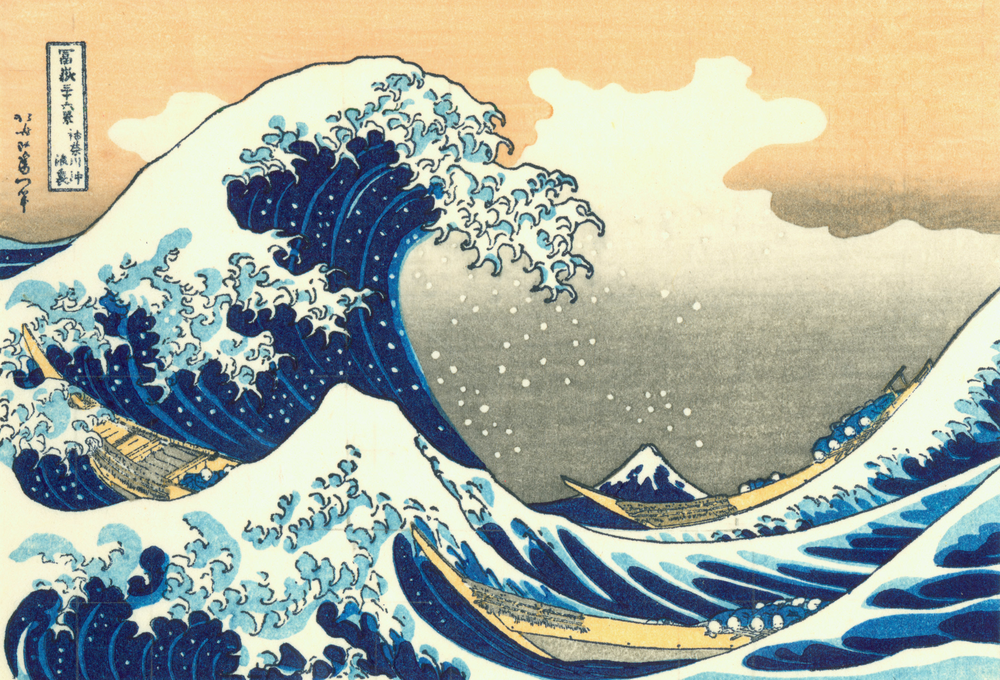

《音乐基础修养》课程作业。

\setstretch{1.8}

在拿到"音乐与科学的联系"这一题目后经过很长一段时间，我也没有找到很好的切入点。 诚然，很多科学家都对音乐情有独钟，也有研究表明大脑中负责音乐和科学研究等创造性工作的是同一块区域。 但是，要想从生理构造这一角度进行剖析，于我而言太缺乏相关知识。 由此，我就只好找找自己有没有相关的体验经历可以展开谈谈。 在音乐这方面，我也算得上是个发烧友，经常主动去搜罗音乐。 但要找联系音乐与科学的经历，也只有经常听着音乐研究科学问题罢了。 最后，思绪还是回到了最初钱学森的话。查找相关资料后才了解到，除了音乐之外，钱学森对美术也十分有兴趣， 在美国留学期间一直将《西湖一角》挂在墙上。而一想到画作，不知怎么的《神奈川冲浪里》就浮现在我眼前。 这是一副描绘海浪翻卷的名画，而恰好我的专业也是研究大气与海洋。艺术与科学都在关注同一事物，这其中是否有什么联系呢？

以我之见，这里存在一个人类认识发展的过程。用一句古话来说，就是从看山是山，到看山不是山，再到看山还是山。 最初，人们见到海浪翻涌的景色，将其画下来，欣赏它的姿态，感叹自然的神奇，是第一阶段； 接着，自然有人开始问："海浪为什么是形成这个形状？"科学家就开始从基础理论出发，研究海洋的运动规律。 这时候，他们看到的海洋不再是画中的那个海洋，而是拆解而成的一个个模型与公式，这是第二阶段； 最后，大家明白了海浪为什么会是那个样子，了解了其中的原理。再去看海浪时，虽然仍会为之惊叹，但其中的奥秘早已了熟于心。 人类似乎总是对美好的事物抱有强烈的好奇心，不满足于表面的美感，而更想从另一个角度，从内在研究它为什么具有如此的美感。 可以说，艺术为人们提供了一个美的直观的感受，而这成为了进行科学研究的一个动机。之后，科学研究又反哺于艺术，最终使得人们形成更全面的美感。 我最初选择专业时也是如此，感叹于大气现象的变化万千，瑰丽多姿，希望能从根本上理解这些现象形成的原因，便选择了大气科学专业。 相信有不少科学工作者，也是由于不满足于只欣赏表面美，而走上科学研究的道路。

那么，上面的分析过程能不能类比到音乐呢？大部分画作的传达是直接的，人们一看画就知道是什么事物，而音乐不同。 仅听一段音乐，很难体会到作者所联系的是哪一事物，或者作者也许根本没有联系实际事物， 音乐本身就蕴含了一种抽象的，玄之又玄的事物，其具备作者想传达的美感。以当下人类的认知水平而言， 很难直观地认识到这抽象的事物，说是存在于另一个世界，具有完全不同于我们世界的演化规则也不为过。 好奇的科学家只好侧敲旁击地对其分析，例如研究一些音乐为什么具有医疗效果，另一些音乐又为什么使人烦躁不安。 希望有朝一日，我们能够进一步了解音乐中蕴含的奥秘，达到看山还是山的境界。 `\vfill`{=latex}

<figure>

</figure>

\vfill
