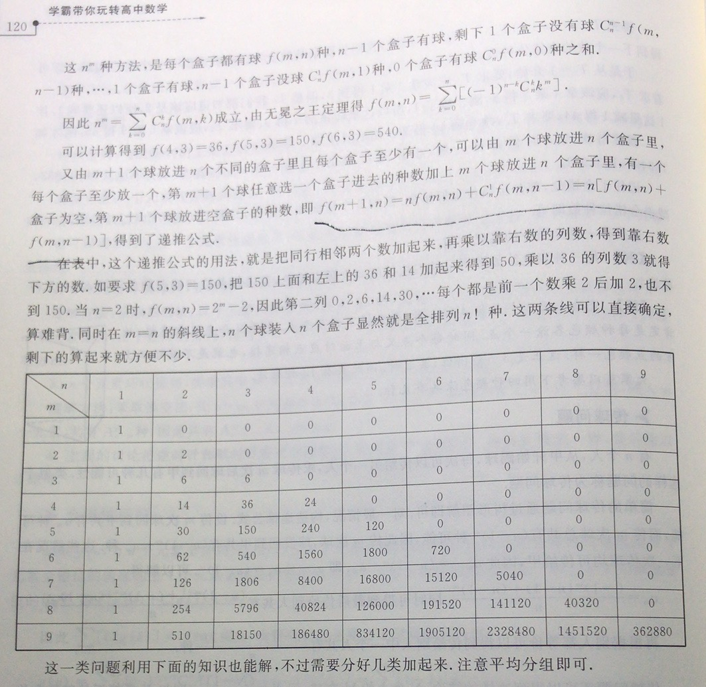

组合数学，很神奇吧。

# 一号数学研究之一:另一种范德蒙 {#sec:1}

最近经常碰到如下的行列式： $$\begin{vmatrix}
    1&1&\dots&1\\
        k_1&k_2&\dots&k_n\\
        k_1(k_1-1)&k_2(k_2-1)&\dots&k_n(k_n-1)\\
        \vdots&\vdots&\ddots&\vdots\\
        k_1\dots(k_1-n+2)&k_2\dots(k_2-n+2)&\dots&k_n(k_n-n+2)
     \end{vmatrix}$$ 应该如何计算呢？ 试着把第二行加到第三行,第三行变为 $$\label{eq:1}
        k_1^{2},k_2^{2},k_3^{2},\dots,k_n^{2}$$

猜想和范德蒙行列式有关系。考虑第四行，只看第一列：$k_1(k_1-1)(k_1-2)$。 加上第三行,可以把最后的$k_1-2$加成$k_1$得到$k_1^2(k_1-1)$。再由之前的结论（加上"加上第二行的第三行即 `\autoref{eq:1}`{=latex}"），可以得到$k_1^3$。 于是可以推得该行列式等于下面的行列式 $$\begin{vmatrix}
1&1&\dots&1\\
k_1&k_2&\dots&k_n\\
k_1^2&k_2^2&\dots&k_n^2\\
\vdots&\vdots&\ddots&\vdots\\
k_1^{n-1}&k_2^{n-1}&\dots&k_n^{n-1}
\end{vmatrix}$$ 这就是范德蒙行列式,值为 $$\prod_{1\le i<j\le n}\left(k_j-k_i\right)$$

# 一号数学研究之二：一道关于递归方程的习题

## 题目

考虑递归方程 $$u(n+k)=a_0u(n+1)+\dots +a_{k-1}u(n+k-1)$$ 置$f(x)=x^k-a_{k-1}x^{k-1}-\dots-a_0$。

证明：函数$u(n)=n^rc^n,r\ge0,c\ne 0$是递归方程的解当且仅当$c$是$f(x)$的根,其重数不小于$r+1$。

## 解

改写条件为 $$u(n+k)=\sum_{t=0}^{k-1}a_tu(n+t)$$ 设$P:u(n)=n^rc^n,r\ge 0, c\ne 0$是递归方程的解， 则$$\begin{aligned}
        P&\Leftrightarrow (n+k)^rc^{n+k}=\sum_{t=0}^{k-1}a_t(n+t)^rc^{n+t}\\
        &\Leftrightarrow \sum_{m=0}^{r}C_r^mn^{r-m}k^mc^{n+k}=\sum_{t=0}^{k-1}a_t\sum_{m=0}^{r}C_r^mn^{r-m}t^mc^{n+t}
\end{aligned}$$ 右边 $$=\sum_{m=0}^{r}C_r^{m}n^{r-m}\sum_{t=0}^{k-1}t^ma_tc^{n+t}$$ 由$n$的任意性,对应次数系数应相等。 $$\begin{aligned}
\therefore P&\Leftrightarrow k^rc^{n+k}=\sum_{t=0}^{k-1}t^ma_t^{n+t},\qquad m=0,1,\dots,r\\
&\Leftrightarrow k^mc^k=\sum_{t=0}^{k-1}a_tt^mc^{t},\qquad m=0,1,\dots,r
\end{aligned}$$ 另一方面， $$\begin{aligned}
f(x)=0&\Leftrightarrow x^k=\sum_{t=0}^{k-1}a_tx^t\\
f^{(m)}(x)=0&\Leftrightarrow \left(\prod_{q=0}^{m-1}\left(k-q\right)\right)x^{k-m}=\sum_{t=0}^{k-1}a_t\left(\prod_{q=0}^{m-1}\left(t-q\right)\right)x^{t-m}
\end{aligned}$$ 设$Q:c$是$f(x)$的根,其重数不小于$r+1$ $$\begin{aligned}
 Q&\Leftrightarrow f^{(m)}(c)=0,m=0,1,\dots,r\\
  &\Leftrightarrow\begin{cases}
 c^k=\sum_{t=0}^{k-1}a_tc^{t},& m=0\\
\left(\prod_{q=0}^{m-1}\left(k-q\right)\right)c^{k}=\sum_{t=0}^{k-1}a_t\left(\prod_{q=0}^{m-1}\left(t-q\right)\right)c^{t},&m=1,2,\dots,r
\end{cases}
\end{aligned}$$ 注意到$m=0$时已经成立$P\Leftrightarrow Q$ $$c^k=\sum_{t=0}^{k-1}a_tc^t\Leftrightarrow k^mc^k=\sum_{t=0}^{k-1}a_tt^mc^t,\qquad m=0$$

下面考虑对每一个$m=1,2,\dots,r$证明$P\Leftrightarrow Q$，即 $$\prod_{q=0}^{m-1}\left(k-q\right)c^k=\sum_{t=0}^{k-1}a_t\left(\prod_{q=0}^{m-1}\left(t-q\right)\right)c^t\Leftrightarrow k^mc^k=\sum_{t=0}^{k-1}a_tt^mc^t$$ 观察几项。当$m=1$时,需证 $$kc^k=\sum_{t=0}^{k-1}a_ttc^t\Leftrightarrow kc^k=\sum_{t=0}^{k-1}a_ttc^t$$ 显然成立。当$m=2$时,需证 $$k(k-1)c^k=\sum_{t=0}^{k-1}a_tt(t-1)c^t\Leftrightarrow k^2c^k=\sum_{t=0}^{k-1}a_tt^2c^t$$ 注意到之前已经有$$kc^k=\sum_{t=0}^{k-1}a_ttc^t$$将其加到两边即得到$$k^2c^k=\sum_{t=0}^{k-1}a_tt^2c^t$$ 显然，情况和方法都与`\autoref{sec:1}`{=latex}类似，于是可以认为对于每个$m$都成立$P\Leftrightarrow Q$。

# 一号数学研究之三：向外探求

上回提到,要证明$$\prod_{q=0}^{m-1}\left(k-q\right)c^k=\sum_{t=0}^{k-1}a_t\left(\prod_{q=0}^{m-1}\left(t-q\right)\right)c^t\Leftrightarrow k^mc^k=\sum_{t=0}^{k-1}a_tt^mc^t$$ 对$m=1,2,\dots,r$成立。通过观察,当$m=2$时,需证$$k(k-1)c^k=\sum_{t=0}^{k-1}a_tt(t-1)c^t\Leftrightarrow k^2c^k=\sum_{t=0}^{k-1}a_tt^2c^t$$ 当$m=3$时,需证$$k(k-1)(k-2)c^k=\sum_{t=0}^{k-1}a_tt(t-1)(t-2)c^t\Leftrightarrow k^3c^k=\sum_{t=0}^{k-1}a_tt^3c^t$$ 并且由$k^2=k(k-1)+k,k^3=k(k-1)(k-2)+2k(k-1)+k^2$，可以合理推知$k^m$是$k,k(k-1),\dots,k(k-1)\dots k(k-m+1)$的线性组合，即$$k^m=\sum_{s=0}^{m-1}x_{m,s}\prod_{q=0}^{s}\left(k-q\right)$$ 下面我们来在原命题中构造出上式的形式来精确证明。 $$\begin{aligned}
  &\left(\prod_{q=0}^{m-1}\left(k-q\right)\right)c^k=\sum_{t=0}^{k-1}a_t\left(\prod_{q=0}^{m-1}(t-q)\right)c^t,\qquad m=1,2,\dots,r  \\
  \Leftrightarrow \quad&
                    c^k\left(\prod_{q=0}^{s}(k-q)\right)=\sum_{t=0}^{k-1}c^ta_t\left(\prod_{q=0}^{s}(t-q)\right),\qquad s=0,1,\dots,r-1
\end{aligned}$$ 两边乘上$x_{m,s}$并从$s=0$到$m-1$求和，其中$1\leq m \leq r$，得 $$\begin{aligned}
     & \sum_{s=0}^{m-1}x_{m,s}c^k\left(\prod_{q=0}^{s}(k-q)\right)=\sum_{s=0}^{m-1}x_{m,s}\sum_{t=0}^{k-1}c^ta_t\left(\prod_{q=0}^{s}(t-q)\right) \\
          \Leftrightarrow \quad&
                c^k\sum_{s=0}^{m-1}x_{m,s}\left(\prod_{q=0}^{s}(k-q)\right)=\sum_{t=0}^{k-1}a_tc^t\sum_{s=0}^{m-1}x_{m,s}\left(\prod_{q=0}^{s}(t-q)\right) \\
          \Leftrightarrow \quad& c^kk^m=\sum_{t=0}^{k-1}a_tc^tt^m
\end{aligned}$$ 这正是所要证得等价关系的右端。

到这里这个证明就结束了，但是还有一个问题值得研究：能不能求出系数$x_s$？？ 观察前几个式子： $$\begin{aligned}
        k^1&=k\\
        k^2&=k(k-1)+k\\
        k^3&=k(k-1)(k-2)+\color{red}{2k}\color{black}(k-1)+\color{red}{k^2}\\
        &=k(k-1)(k-2)+3k(k-1)+k\\
        k^4&=k(k-1)(k-2)(k-3)+\color{red}{3k}\color{black}(k-1)(k-2)+\color{red}{2k^2}\color{black}(k-1)+\color{red}{k^3}\\
        &=k(k-1)(k-2)(k-3)+3k(k-1)(k-2)+2k(k-1)^2+2k(k-1)+k
\end{aligned}$$ 出现了$k(k-1)^2$怎么办?只需要$k-1$替代$k$代入第二个式子即可。 $$(k-1)^2=(k-1)(k-2)+(k-1)$$ 于是 $$\label{eq:2}
k^4=(k-1)(k-2)(k-3)+3k(k-1)(k-2)+2k(k-1)(k-2)+4k(k-1)+k$$ 从系数上看没有什么特别有用的规律，再往后算也比较困难。 不过在推导的过程中由红字部分不难推测出 $$k^m=\prod_{t=0}^{m-1}(k-t)+\sum_{r=2}^{m-1}rk^{m-r}\prod_{t=1}^{r-1}(k-t)+k^{m-1}\quad (m\ge 3)$$ 可惜的是这并没有什么卵用,因为代入之前所设表达式得到 $$\begin{aligned}
            k^m&=\sum_{s=0}^{m-1}x_{m,s}\prod_{q=0}^{s}(k-q) \\
            &=\prod_{t=0}^{m-1}(k-t)+\sum_{r=2}^{m-1}r\left(\sum_{s=0}^{m-r-1}x_{m-r,s}\prod_{q=0}^{s}(k-q)\right)\prod_{t=1}^{r-1}(k-t)+\sum_{s=0}^{m-2}x_{m-1,s}\prod_{q=0}^{s}(k-q)
\end{aligned}$$ 这太可怕了，看起来没法子处理。 那么，接下去怎么办呢?

# 一号数学研究之四：得出系数

上回提到,在求系数时遇到了前所未有的困难。 现在怎么办呢?继续算下去看看呗。 不过我不打算下手算了。这种事情当然是要交给电脑来做。 得到如下的系数矩阵：横向为$s$，纵向为$m$ $$\begin{matrix}
        1&\\
        1&1\\
        1&3&1\\
        1&7&6&1\\
        1&15&25&10&1\\
        1&31&90&65&15&1\\
        1&63&301&350&140&21&1\\
        1&127&966&1701&1050&266&28&1\\
        1&255&3025&7770&6951&2646&462&36&1\\
        1&511&9330&34105&42525&22827&5880&750&45&1\\
\end{matrix}$$

眼尖的同学也许已经发现了。注意这一部分： $$\begin{matrix}
        3\color{red}1&90&65\\
        63&30\color{red}1&350\\
        127&966&170\color{red}1\\
\end{matrix}$$

这几个$1$反复出现,其中一定有联系。 $$31+90\times3=301 \qquad 301+350\times4=1701$$ 用别的数字实验发现这个规律也对。 因此有递推公式 $x_{m+1,s}=sx_{m,s}+x_{m,s-1}$ 加上初始条件有$x_{m,1}=1,x_{m,m}=1$ 理论上可以确定整个矩阵。\
但是这里我们不讨论这个递推公式怎么解。

经过学长点拨,去找了第二类斯特林数的资料。

The triangle Stirling numbers of the Second kind is $$\begin{matrix}
1&\\
1&1\\
1&3&1\\
1&7&6&1\\
1&15&25&10&1\\
1&31&90&65&15&1\\
\end{matrix}$$ [http：//mathworld.wolfram.com/StirlingNumberoftheSecondKind.html](http：//mathworld.wolfram.com/StirlingNumberoftheSecondKind.html){.uri}

一模一样！往下翻就有通项公式 $$=\frac{1}{s!}\sum_{k=0}^{s}(-1)^kC_s^k(s-k)^m$$

# 一号数学研究之五：研究通项

然后我们来研究一下这个通项公式 先验证它满足递推式： $$\begin{aligned}
    x_{m,1}=\sum_{k=0}^{1}(-1)^kC_1^k(1-k)^m=1\\x_{m,m}=\frac{1}{m!}\sum_{k=0}^{m}(-1)^kC_m^k(m-k)^m
\end{aligned}$$ 诶,好像不能直接得到等于1。 但是这时我们往往能得到一些新东西。 将其展开,得到 $$\begin{aligned}
    \sum_{k=0}^{m}C^k_m(-1)^k\sum_{t=0}^{m}C^t_mm^{m-t}(-1)^tk^t=m! \\
    \sum_{k=0}^{m}\sum_{t=0}^{m}C^t_mC_m^tm^{m-t}(-1)^{k+t}k^t=m!

\end{aligned}$$ 这个等式是如何成立的仍旧是个谜。\
先验证$x_{m+1,s}=sx_{m,s}+x_{m,s-1}$ $$\begin{aligned}
        \text{右边}&=\frac{s}{s!}\sum_{k=0}^{s}(-1)^kC^k_s(s-k)^m+\frac{1}{(s-1)!}\sum_{k=0}^{s-1}(-1)^kC^k_{s-1}(s-1-k)^m\\
        &=\frac{1}{(s-1)!}\sum_{k=0}^{s}(-1)^kC^k_s(s-k)^m+\frac{1}{(s-1)!}\sum_{k=1}^{s}(-1)^{k-1}C^{k-1}_{s-1}(s-k)^m\\
        &=\frac{s^m}{(s-1)!}+\frac{1}{(s-1)!}\sum_{k=1}^{s}((-1)^k(s-k)^m)\left(C^k_s-C_{s-1}^{k-1}\right)\\
        &=\frac{1}{(s-1)!}\sum_{k=0}^{s}(-1)^kC_{s-1}^k(s-k)^m\\
        &=\frac{1}{(s-1)!}\sum_{k=0}^{s}(-1)^kC_s^k\cdot \frac{s-k}{s}(s-k)^m\\
        &=\frac{1}{s!}\sum_{k=0}^{s}(-1)^kC_s^k(s-k)^{m+1}=x_{m,s}\\
\end{aligned}$$

这个递推公式和通项公式有些眼熟，翻了下书发现很久以前其实研究过这东西。对比一下表，发现只是相差了列数的阶乘而已。

<figure>

<figcaption>原来我早就玩过这东西</figcaption>
</figure>

最后我们回到之前的问题，把$n$次方分解成阶乘的和。 $$n^m=\sum_{s=0}^{m-1}x_{m,s}\prod_{q=0}^{s}(n-q)=\sum_{s=0}^{m-1}\left(\frac{1}{s!}\sum_{k=0}^{s}(-1)^kC^k_s(s-k)^m\right)\prod_{q=0}^{s}(n-q)$$ 其中括号内的系数就是第二类斯特林数。

# 后记

显然，阶乘也能分解成幂次的和（全部展开就是了），但是系数是什么呢？其实和第一类斯特林数有些关系。有兴趣的读者可以查看"悬赏"中相关内容和其他资料。

感谢zx的人工ocr。
