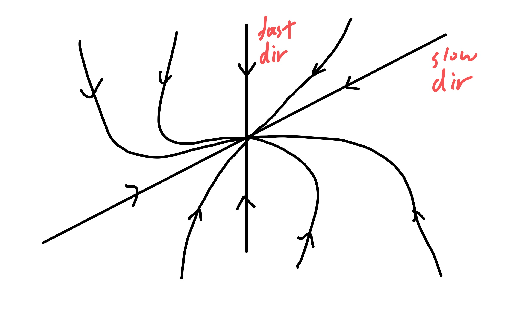
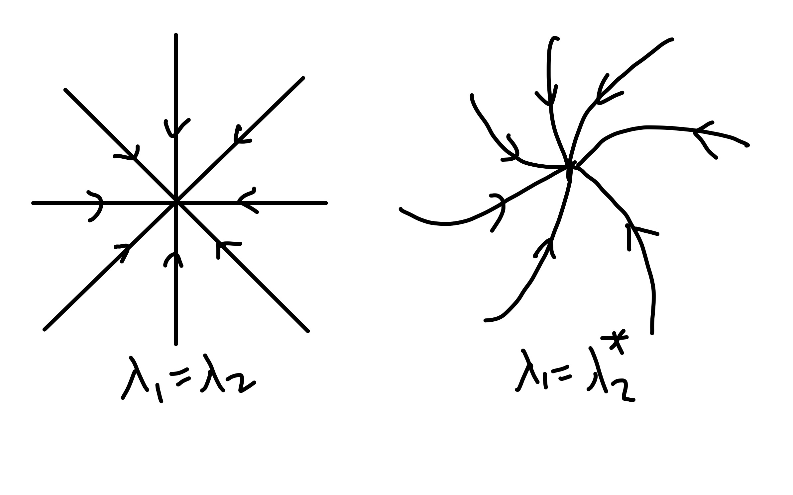
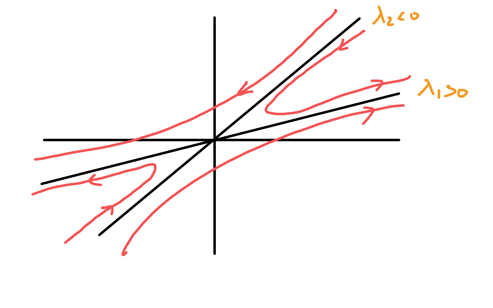
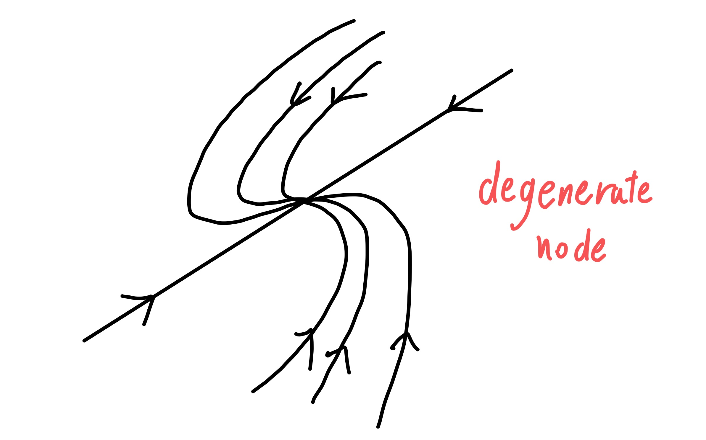
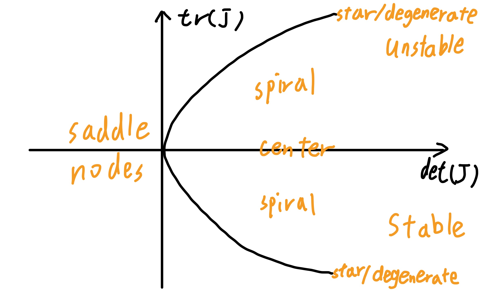
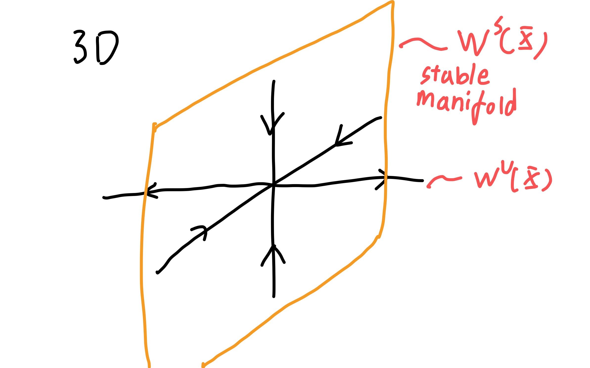
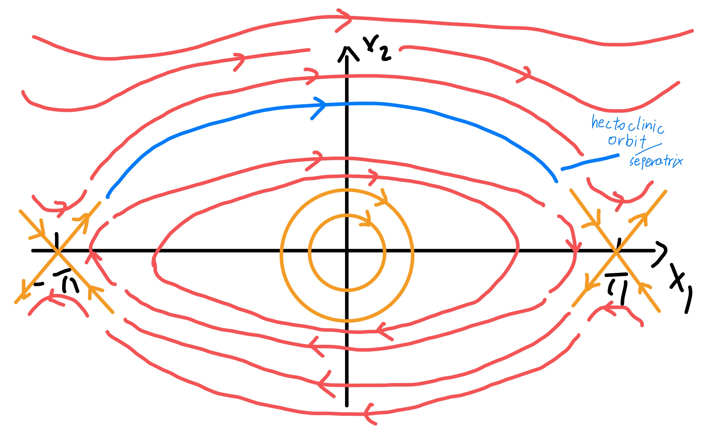
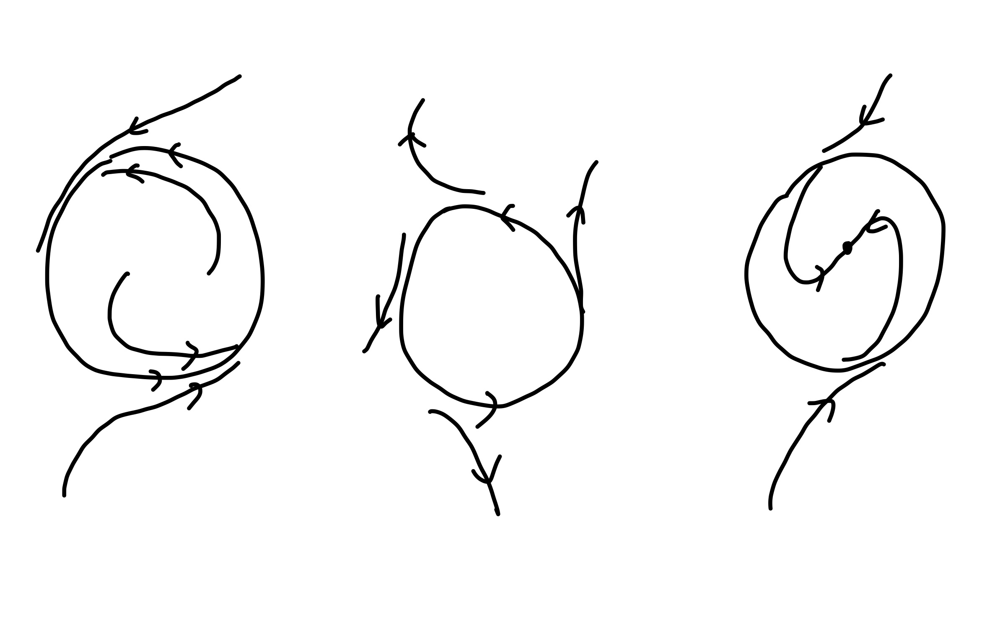
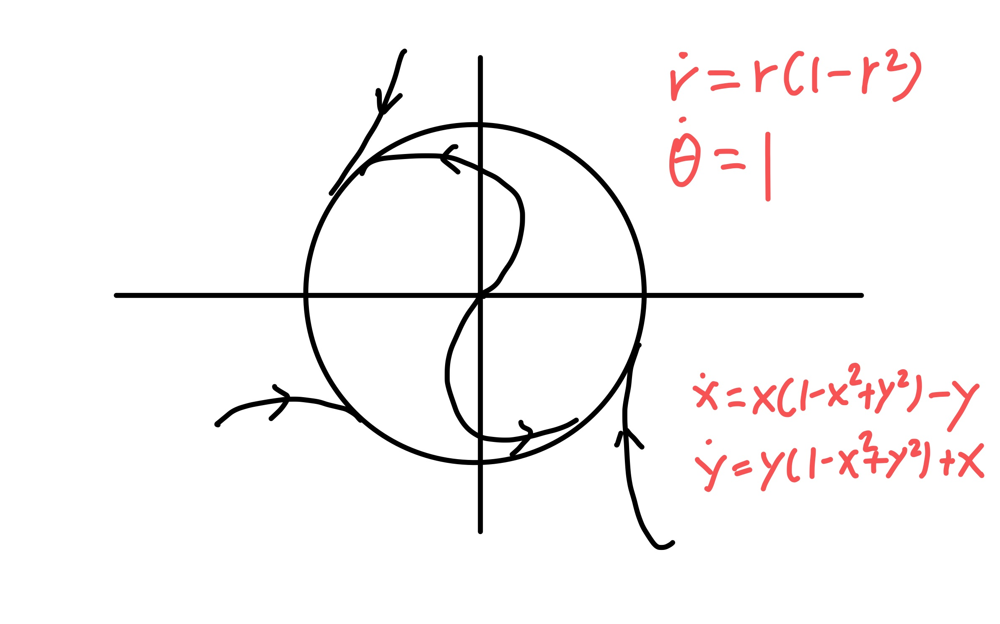
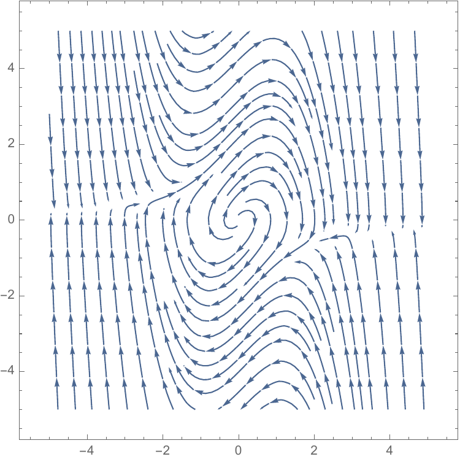

2020年春季学期于UCB访学时，上Nonlinear Dynamics and Chaos课程（Decal）所整理的笔记。

整理完善度较低。

Much thanks to Jonas Katona (and other "teachers"), who designed the whole course but is only one year elder than me.

#

#### Office hour

-   Jonas: W12-1PM, TH10-11AM FSM Cafe

-   Huws: TUTH5-6PM 141 LeConte

-   Kyler: M5-6PM 103 Birge

#### Introduction

ODE: $$F(x,y',y'',\cdots,y^{(n)})=0$$ e.g. $$y''+y=0 \qquad y'+x^2=0 \qquad mx''+2bx'+kx=F\cos(\omega t)$$ PDE: e.g. $$\pp{^2u}{t^2}+c^2\pp{u^2}{x^2}=0$$ The order of ODE is the highest order of derivative in the equation.

Linear ODE takes the form $$a_0(x)y+a_1(x)y'+\cdots +a_n(x)y^{(n)}=b(x)$$ can also be written into the operator form $$\mathcal{L}y= \Brack{a_0(x)+a_1\dd{}{x}+\cdots+a_n\ddn[n]{}{x}}y=b$$ so the linear property holds: $$\mathcal{L}[ay_1+by_2]=a \mathcal{L} [y_1]+b \mathcal{L}[y_2]$$ e.g., $$y'=\cos x \quad\Rightarrow\quad  y=\sin x+c$$ more e.g., $$\ddn{x}{t}=g \quad\Rightarrow\quad  x=\frac{1}{2}gt^2+c_1t+c_2$$ $$y''=y \quad y(0)=0 \quad y(\ln 2)=\frac{3}{4}\quad\Rightarrow\quad y=\sinh x$$ We can also use vector field to solve the ODE. Just draw $y'-x$ or other plots.

#### Separability

if the ODE has the form $$y'=\frac{f(x)}{g(y)}$$ then we can just separate them $$\dd{y}{x}=\frac{f(x)}{g(y)} \quad\Rightarrow\quad  \int\d y g(y)=\int\d x f(x)$$ As practice, $$y'=(1+y^2)(4x^3+2x) \quad\Rightarrow\quad  \frac{\d y}{1+y^2}=(4x^3+2x)\d x \quad\Rightarrow\quad  \arctan y=x^4+x^2+c$$ so $y=\tan(x^4+x^2+c)$. If having the form $y'=p(x)y$ then it is easy to calc. For $$y'+p(x)y=Q(x)$$ Let $I=\int p(x)\d x, A=\exp{c}$, then for $Q(x)=0$ we get $y=A\exp{-I}$. Then $$A=y\exp{I} \quad\Rightarrow\quad  \dd{}{x}(A)=\dd{}{x} \brack{y\exp{I}}=y'\exp{I}+y\exp{I}\dd{I}{x}=\exp{I}Q(x)$$ we get $$\dd{}{x}(y\exp{I})=Q\exp{I} \quad\Rightarrow\quad  y\exp{I}=\int Q \exp{I}\d x$$ For example, $$y'+\frac{1}{x}y=\cos(x^2)$$ Another e.g., Ra$\rightarrow$ Rn$\rightarrow$ Po. $N_0$ is the Ra atoms at $t=0$, $N_1$ is the Ra atoms at $t$, $N_2$ is the Rn atoms ar $t$. Half life(?) for Ra and Rn is $\lambda_1$ and $\lambda_2$. $$N_1'=-\lambda_1 N_1 \qquad N_2'=\lambda_1 N_1-\lambda_2N_2$$ So $$N_1=N_0\exp{-\lambda_1 t}  \qquad N_2= \frac{\lambda_1 N_0}{\lambda_2-\lambda_1} \brack{\exp{-\lambda_1t}-\exp{-\lambda_2}t} (?)$$ Bernoulli's equation $$y'+P(x)y=Q(x)y^n$$ change variable $z=y^{1-n}$, multiply by $(1-n)y^{-n}$ then $$(1-n)y^{-n}y'+P(1-n)y^{1-n}=Q(1-n)y^{-n}y^n \quad\Rightarrow\quad z'+(1-n)P(x)z=(1-n)Q(x)$$ ends up we get linear equation.

#### Exact differentials

$$\label{eq:exactdiff}
P(x,y)\d x+Q(x,y)\d y=0$$ If `\autoref{eq:exactdiff}`{=latex} has the property $\pp{P}{y}=\pp{Q}{x}$, then it is considered an exact differential of function $F(x,y)$, where $P=\pp{F}{x}$ and $Q=\pp{F}{y}$. Also $P\d x+Q\d y=\d F$, and if $\d F=0$ then $F(x,y)=\const$.

An ODE is considered homogeneous of order $n$ if $$\sum_{i=0}^na_i(x)y^{(i)}(x)=0 \qquad a_n\neq 0$$ If we assume $y(x)=\exp{rx}$, then $y^{(n)}=r^n\exp{rx}$, we get $$\sum_{i=0}^na_ir^i=0$$ if the $n$ roots are distinct, then $$y(x)=\sum_{i=1}^nA_i\exp{r_ix}$$ A little exercise, $$y''+5y'+4y=0 \quad\Rightarrow\quad  y=A_1\exp{-x}+A_2\exp{-4x}$$

#### Repeated roots

$$\brack{\dd{}{x}-a}^2y=0$$ let $\brack{\dd{}{x}-a}y=u$, then $$\brack{\dd{}{x}-a}u=0 \quad\Rightarrow\quad  u=A\exp{ax}$$ So $$y'-ay=A\exp{a} \quad\Rightarrow\quad y=(Ax+B)\exp{ax}$$ If charactistic equation has a root of multiplicity $k$, then a possible solution $$y(x)=\exp{rx}(A_{n-1}x^{n-1}+\cdots+A_1x+A_0)$$

#

#### Review

Linear operator: $$\mathcal{L}[au_1+bu_2]=a\mathcal{L}[u_1]+b \mathcal{L}[u_2]$$ $$\sum_{i=1}^n c_i\dd{^i}{x^i}u=0 \quad\Rightarrow\quad  u=\sum_{i=1}^nA_i \exp{r_ix}$$ Charactistic eqn $\sum_{i=1}^nc_ir^i$.

#### Complex roots

$$\sin x= \frac{\exp{\i x}-\exp{-\i x}}{2\i} \qquad \cos x=\frac{\exp{\i x}+\exp{-\i x}}{2}$$ Complex conjugate roots. $$\begin{aligned}
  y&=A\exp{(\alpha+\i\beta)x}+B\exp{(\alpha-\i \beta)x}\\
   &=\exp{\alpha x} \brack{A\exp{\i\beta x}+B\exp{-\i\beta x}}\\
  &=\exp{\alpha x}(c_1\sin \beta x+c_2\cos \beta x)
\end{aligned}$$ General principle, isolate parts which are imaginary and those which are real.

Example: Spring-mass system $$m \ddot{y} =-ky-l \dot{y} \qquad k,l>0$$ define $\omega^2=k/m$ and $2b =l/m$, $$\ddot{y}+2b \dot{y}+\omega^2y=0$$ assume $y=C \exp{rx}$, we get $$r=\frac{-2b\pm \sqrt{4b^2-4\omega^2}}{2}=-b\pm \sqrt{b^2-\omega^2}$$ overdamped: $b^2>\omega^2$. critically damp: $b^2=\omega^2$. underdamped/oscillatory: $b^2<\omega^2$

#### In homogeneous equations

$$\sum_{i=0}^na_i(x)y^{(i)}=f(x)$$ $f(x)$ is called forcing function. We can set $y=y_h+y_p$, solve $$\sum_{i=0}^na_i(x)y_h^{(i)}=0$$ and guess $y_p$. The guess are listed:

1.  $$f(x)=\alpha\sin(\omega x)+\beta\cos (\omega x) \qquad y_p(x)=A\sin(\omega x)+B\cos(\omega x)$$

2.  $$f(x)=a \exp{\lambda x} \qquad y_p(x)=A\exp{\lambda x}$$

3.  $$f(x)=a_mx^m+\cdots+a_1x+a_0 \qquad y_p(x)=A_kx^k+\cdots+A_1x+A_0$$ $k=m+n$, $n$ is the order of ODE.

#### Method of Undetermined Coefficients

$$(D-a)(D-b)y=\exp{cx}P_n(x) \qquad y_p=x^c\exp{cx}Q_n$$ e.g., $$(D-1)(D-2)y=\exp{x}+4\sin (2x)$$ guess $$y_p=\frac{1}{3}x\exp{x}$$

#### 2 types of dynamical systems

Differential equations and iterative maps. $$\dot{X}_1=f_1(X_1,\dots,X_n,t) \quad\cdots \quad \dot{X}_n=f_n(X_1,\dots,X_n,t)$$ e.g. $m\ddot{x}+b\dot{x}+kx=0$, let$X_1=x$,$X_2=\dot{x}$, so $$m\dot{X}_2+bX_2+kX_1=0 \quad\Rightarrow\quad  \dot{X}_2=-\frac{b}{m}X_2- \frac{k}{m}X_1$$ For $\dot{X}=\sin(x)$, we can draw a plot. Actually we can solve $$\dd{x}{t}= \sin x \quad\Rightarrow\quad  -\ln( \mathrm{csc}x+ \mathrm{cot}x)=t+c$$ But the solution is less interpretable than $\dot{x}-x$ graph.

#### Linear stablility analysis

At$x=0$, $\sin x \approx x-\frac{x^3}{3!}+\cdots$. $$\dot{x}=x \quad\Rightarrow\quad  x=\exp{t}$$ generally, $$\dot{x}=f(x) \qquad f(x_0)=0 \qquad f(x_0+\Delta x)\approx \dd{f}{x}\bigg|_{x_0}\Delta x$$ $x_0$ is called fixed point. $$\dot{\Delta x}=f(x_0+\Delta x)-f(x_0)=c\Delta x$$ so the stability depends on $c$

#### Existence and unitueness in 1D

e.g. $\dot{x}=x^{1/3}$ starting at $x_0=0$, it will stay at $x(t)=0$. But integrate, $$\dd{x}{t}=x^{1/3} \quad\Rightarrow\quad  \frac{3}{2}x^{2/3}=t+c \qquad c=0$$ we get $x=\brack{\frac{2}{3}t}^{3/2}$! The problem lies in the slope of $x^{1/3}$ at $x=0$ is infinity. So there is the theorem.

**Picard-Lindelof Theorem**: consider the IVP $\dot{x}=f(x),x(0)=x_0$, suppose $f$,$f'$ are continuous on some open interval $I\subset \mathbb{R}$ and suppose that $x_0\in I$, then, the IVP has a solution $x(t)$ on some interval $(-\tau,\tau)$ and that solution is unique.

Note, the solution might not exist forever. e.g., $\dot{x}=1+x^2,x(0)=0$, which leads to $x=\tan t$.

#### autonomous

if $\dot{x}=f(x)$, then the system is called autonomous. If $\dot{x}=f(x,t)$, then it is nonautonomous. But actually we can change nonautonomous into autonomous one by adding a new state var.

#### matrix differential eqn

$$\begin{pmatrix}
    \dot{x}_1 \\ \dot{x}_2
  \end{pmatrix}=A
  \begin{pmatrix}
    x_1\\x_2
  \end{pmatrix}$$ let $A=PDP^{-1}$, then $$P^{-1}
\begin{pmatrix}
  \dot{x}_1\\dot{x}_2
\end{pmatrix}=DP^{-1}
\begin{pmatrix}
  x_1\\x_2
\end{pmatrix}$$ let $z=P^{-1}[x_1,x_2]^t$, then we get $\dot{z}=Dz$. It will be separated, and can solve independantly.

#

For fixed point $f(x_0)=f_0$, then $$f(x)=f(x_0)+f'(x_0)(x-x_0)+O(x-x_0)^2$$ Type of fixed points, $\dot{x}=f(x)$

Stable

:   $f'(x_0)\leq 0$

Unstable

:   $f'(x_0)\geq 0$

Semistable

:   $f'(x_0)=0$

Fixed points in $\mathbb{R}^n$ $$\dot{\bm{x}}=f(\bm{x}) \qquad \bm{x}\in \mathbb{R}^n$$ An equlibrium solution, or fixed point, is a point $\bar{\bm{x}}\in \mathbb{R}^n$, s.t., $$\bar{\bm{x}}'=f(\bar{\bm{x}})=0$$ Note, if $f=f(\bm{x},t)$, then instaneous fixed points are not stationary Solutions. e.g., $$\dot{x}=-x+t$$ Linearization in $\mathbb{R}^n$, $$\dot{\bm{x}}=f(\bm{x})=f(\bar{\bm{x}})+\bm{J}(\bar{\bm{x}})(\bm{x}-\bar{\bm{x}})+O(\abs{\bm{x}-\bar{\bm{x}}})^2$$ where the jacobian $\bm{J}(\bar{\bm{x}})_{ij}=\pp{f_i}{x_j}(\bar{\bm{x}})$

#### Phase plane analysis

$\mathbb{R}^2$ for example, $\ddot{x}+x=0$, turns into $\dot{x}_1=x_2,\dot{x}_2=-x_1$, in the $x_1-x_2$ plane the trajectory is circle. Actually we can get $$x_1\dot{x}_1+x_2\dot{x}_2=\bm{x}\cdot \dot{\bm{x}}=0$$ also can get $$\ddt (x_1^2+x_2^2)/2=0 \quad\Rightarrow\quad  x_1^2+x_2^2=c$$ linearization, $$\begin{pmatrix}
    \dot{x}_1 \\ \dot{x}_2
  \end{pmatrix}=
  \begin{pmatrix}
    J_{11} &J_{12} \\J_{21} &J_{22}
  \end{pmatrix}
  \begin{pmatrix}
    x_1\\x_2
  \end{pmatrix}$$ let $J=PDP^{-1},D=diag(\lambda_1,\lambda_2)$, $\bm{y}=P^{-1}\bm{x}$,so $\dot{\bm{y}}=D\bm{y}$, and $\dot{y}_i=\lambda_iy_i$. It is easy to get $y_i=y_i(0)\exp{\lambda_it}$. When $\lambda <0$ it is stable, $\lambda >0$ is unstable.

In 2D, combine them, we get it is stable if $Re(\lambda_i)<0$, but there may be a fast direction and slow direction. If $\lambda_1=\lambda_2$, then trajectory will all be straight line and no fast or slow direction. If $\lambda_1=\lambda_2^{*}$, then it is also stable but spiral.

<figure id="fig:2dstable">

<figcaption>Fast dir and slow dir</figcaption>
</figure>

<figure id="fig:2dspiral">

<figcaption>Straight line and Spiral</figcaption>
</figure>

For unstable case $Re(\lambda_i)>0$, the trajectories are same but reverse direction. If $\lambda_1>0,\lambda_2<0$, so there will be hyperbolic or saddle situation. Finally, if $Re(\lambda_i)=0,Im(\lambda_i)\neq 0$, this will be completely circle.

<figure id="fig:2dunstable">

<figcaption>Unstable case</figcaption>
</figure>

Another situation is like $\begin{pmatrix}
  \lambda & 1\\ 0& \lambda
\end{pmatrix}$., where $J$ is non-diagonizable.

<figure id="fig:2ddegen">

<figcaption>degnerate node</figcaption>
</figure>

#

#### Index theory

Linear stablility is inherently local (falls apart if we go too far from fixed point). But it tells us nothing about systems which only have higher order terms.

\begin{examplebox}{Limit of linear stablility}
  \begin{equation}
\dot{x}=-x^2+y^3 \qquad \dot{y}=y^3-y
\end{equation}
\begin{equation}
J(x,y)=
\begin{pmatrix}
  -2x&-3y^2\\0 &3y^2-1
\end{pmatrix}
\qquad J(0,0)=
\begin{pmatrix}
  0&0\\0&-1
\end{pmatrix}
\end{equation}
It doesn't tells us useful information.
\end{examplebox}

Index theory, curve $C$ is simple and closed. Simple means trajectories do not intersect. Closed means it separates $\mathbb{R}^2$ into an inside and outside. Since $C$ is closed, if we start with an angle $\phi_c$, as we move all the way around $C$, we need to end back up at $\phi_c$. So $\phi$ must change by an integer multiple of $2\pi$.

So the index is $$I_C=\frac{1}{2\pi}\int_C\d \phi \qquad \d \phi =\pp{\phi}{f_1}\d f_1+\pp{\phi}{f_2}\d f_2$$ $$\phi=\tan^{-1} \frac{f_2}{f_1}\quad\Rightarrow\quad  \d \phi= \frac{f_1\d f_2-f_2\d f_1}{f_1^2+f_2^2}$$ $$\tcbhighmath{I_c=\frac{1}{2\pi}\int \frac{f_1\d f_2-f_2\d f_1}{f_1^2+f_2^2}}$$ Parameterize $C$ to solve this.

\begin{examplebox}{Circle index}
  $C=\{(x,y):x^2+y^2=1\}$ is the unit circle, let $x=\cos\theta$, $y=\sin\theta$, then
\begin{equation}
\d f_1\d =\pp{f_1}{\theta}\d \theta\qquad f_2=\pp{f_2}{\theta}\d \theta
\end{equation}
\end{examplebox}

What is the index similar to Winding number, residues, Gauss's Law.

#### Properties of the index

1.  Suppose $C$ is homotopic which can be continuously deformed into another curve $C'$ without passing through a fixed point, then, $I_C=I_{C'}$

2.  If $C$ encloses no fixed points, then $I_C=0$.

3.  $I_C$ does not change if we reverse the vector field in time, i.e., $t\rightarrow -t$

4.  If $C$ is a trajectory for the system, then $I_C=+1$

#### Index of a fixed point

-   Stable nodes have index $+1$

-   Unstable nodes have index $+1$

-   Saddle nodes have index $-1$

\begin{theorembox}{}
The index of the fixed point at the origin of $\dot{\bm{x}}=\bm{A}\bm{x}$ is $\operatorname{sgn}(\det \bm{A})$
\end{theorembox}
\begin{theorembox}{}
  If a closed curve $C$ surrounds isolated fixed points $\overline{\bm{x}_1}, \overline{\bm{x}_2},\dots, \overline{\bm{x}_n}$, then
 \begin{equation}
I_C=\sum_{k=1}^nI_k
\end{equation}, where $I_k$ is the index of $\overline{\bm{x}_k}$.
Isolatex fixed point $x^{*}$ means $\exists U\subset \mathbb{R}^2$ containing no other fixed points besides $x^{*}$
\end{theorembox}

Corollary: any closed orbit in the phase plane must enclose fixed points whose indices sum to $1$. Proof: Let $C$ be the closed orbit, from propertie 4, $I_C=+1$.

\begin{examplebox}{Lotta-Volterra system}
  Show the LV system
\begin{equation}
\dot{x}=x(3-x-2y) \qquad \dot{y}=y(2-x-y)
\end{equation}
has no closed orbits, where $x,y\geq 0$
\tcblower
Four fixed points. We can check every possible location for a closed orbit.
\begin{enumerate}
\item No fixed points $\quad\Rightarrow\quad $ $I_C=0$  X
\item Surrounds $(1,1)$ $\quad\Rightarrow\quad$  $I_C=-1$  X
\item Surrounds some node on the axes $\quad\Rightarrow\quad $  $I_C=1$
\end{enumerate}
But actually as $y=0$ leas to $\dot{y}=0$, $x=0$ leads to $\dot{x}=0$, the trajectory cannot leave the first quadrant. Trajectories must lie on either
axes, but this cannot be because trajectories can not cross.
\end{examplebox}

#

<figure id="fig:detandtr">

<figcaption>Find type of nodes from the tr and det of Jacobian</figcaption>
</figure>

Different type of nodes:

Stable

:   $Re(\lambda_i)<0$

Unstable

:   $Re(\lambda_i)>0$

Saddle

:   $\lambda_1\lambda_2<0$

center

:   $Re(\lambda_i)=0, \lambda_1=-\lambda_2\neq 0$

degenerate

:   $J$ is non-diagonizable

Star

:   $\lambda_1=\lambda_2$ all real number

Spiral

:   $Re(\lambda_i)\neq 0, Im(\lambda_i)\neq 0$

This is for 2D. For the general case, $J$ is $n\times n$ matrix, there are $n$ generalized eigenvalues or eigen vectors $\lambda_i$.

Stable

:   $Re(\lambda_i)<0$

Unstable

:   $Re(\lambda_i)>0$

Saddle

:   Some $Re(\lambda_i)>0$, some $Re(\lambda_i)<0$.

We can devide the space into stable manifold $W^s$, unstable manifold $W^u$, and center manifold $W^c$.

<figure id="fig:manifold">

<figcaption>Manifold</figcaption>
</figure>

\begin{theorembox}{Hartman-Grobman Theorem}
  The \textbf{local} behaviour of a hyperbolic(saddle) \marginnote{stable and unstable node are treated as special cases of saddle node} node is topologically equivlent to the linearized system.
 \begin{equation}
   \ddt[\bm{x}]=A\bm{x}+f(\bm{x}) \text{  is topologically equivalent with  }\ddt[\bm{z}]=A\bm{z}
 \end{equation}
$h\in C^1(\mathbb{R}^n),h:\bm{x}\rightarrow \bm{z}$ is invertible, $A$ must be diagonalizable, $Re(\lambda_i)\neq 0$
\end{theorembox}
\begin{examplebox}{Pendulum}
\begin{equation}
\ddot{x}=-\sin(x) \quad\Rightarrow\quad  \dot{x}_1=x_2 \quad \dot{x}_2=-\sin x_1
\end{equation}
First find fixed points is the $(n\pi,0)$. If we only consider $x_1\in [0,2\pi)$, and using periodic repeat for other place, then only two points.
\begin{equation}
x_c=(0,0)\qquad x_h=(\pi,0)
\end{equation}
Then consider jacobian,
\begin{equation}
J(x_c)=
\begin{pmatrix}
  0&1\\ -1 &0
\end{pmatrix}
\end{equation}
find the eigenvalue and eigenvector,
\begin{equation}
 \lambda_1=\i\quad \lambda_2=-\i \quad v_1=\frac{1}{2} \begin{pmatrix}   1\\\i \end{pmatrix} \quad v_2=\frac{1}{2} \begin{pmatrix}   1\\-\i \end{pmatrix}
\end{equation}
so locally
\begin{equation}
x=c_1v_1\exp{\lambda_1t}+c_2v_2\exp{\lambda_2t}=
\begin{pmatrix}
  c_1'\cos(t+c_2')\\c_1'+\sin(t+c_2')
\end{pmatrix}
\end{equation}
For another point,
\begin{equation}
J(x_h)=
\begin{pmatrix}
  0&1\\1&0
\end{pmatrix}
\end{equation}
\begin{equation}
\lambda_1=1\quad \lambda_2=-1\quad v_1=\frac{1}{2} \begin{pmatrix}   1\\ 1 \end{pmatrix} \quad v_2=\frac{1}{2} \begin{pmatrix}   1\\-1 \end{pmatrix}
\end{equation}
\begin{equation}
  x=\frac{c_1}{2}\exp{t}\begin{pmatrix}   1\\ 1 \end{pmatrix}+\frac{c_2\exp{-t}}{2}\begin{pmatrix}   1\\ -1 \end{pmatrix}
\end{equation}
\begin{figure}[H]
  \centering
  
  \caption{Pendulum phase trajectory. Organge lines show local behavior as calculated, red lines show connected trajectory, blue line is a critical one.}
  \label{fig:pendphase}
\end{figure}
\end{examplebox}

If we want to linearize the problem, first using taylor series, $$\dot{y}_1=y_2\qquad \dot{y}_2=y_1-\frac{1}{3!}y_1^3+\frac{1}{5!}y_1^5+\cdots$$ we want $\dot{z}_1=z_2,\dot{z}_2=z_1$. Assume $$\begin{aligned}
  &y_1=z_1-\brack{c_{130}z_1^3+c_{121}z_1^2z_2+c_{112}z_1z_2^2+c_{103}z_2^2} \\
   &y_2=z_2-\brack{c_{230}z_1^3+c_{221}z_1^2z_2+c_{212}z_1z_2^2+c_{203}z_2^2}
\end{aligned}$$

\begin{mybox}{Manifolds}
  First define Invariant Set, let $S\subset \mathbb{R}^n$ be a set
  \begin{enumerate}[a)]
  \item Continous time, $S$ is invariant under vector field $\dot{\bm{x}}=f(\bm{x})$. If for any $\bm{x}_0\in S$, we have
    $x(\bm{x}_0,\dot{\bm{x}}=\bm{0},t)\in S \forall t$. If it is restricted to $t\geq 0$, then $S$ is positive invariant. $t\leq 0$, $S$ s negative invariant.
  \end{enumerate}
  An invariant set $S\subset \mathbb{R}^n$ is said to be $C^r$ ($r\geq 1$) invariant manifold if $S$ has the structure of a $C^r$ differentiable manifold.
  Shortly, locally a manifold has a euclid structure.
\end{mybox}

#

Near identity change of variables. $$\dot{x}=7x+42x^2\qquad  \dot{y}=7y+3xy$$ want to linearize $$\dot{X}=7X+O(3) \qquad \dot{Y}=7Y+O(3)$$ assume $$X=x+a_1x^2+a_2xy+a_3y^2+O(3)=f(x,y) \qquad Y=y+b_1x^2+b_2xy+b_3y^2+O(3)=f(x,y)$$ So inverse are $x=F(X,Y),y=G(X,Y)$ $$x=X+A_1X^2+A_2XY+A_3Y^2+O(3) \qquad y=Y+B_1X^2+B_2XY+B_3Y^2+O(3)$$ so $$x=(x+a_1x^2+a_2xy+a_3y^2)+A_1x^2+A_2xy+A_3y^2+O(3)=x+(a_1+A_1)x^2+(a_2+A_2)xy+(a_3+A_3)y^2+O(3)$$ so $A_1=-a_1,A_2=-a_2,A_3=-a_3$. The case for $y$ is similar. So the inverse transform is $$x=X-a_1X^2-a_2XY-a_3Y^2+O(3) \qquad y=Y-b_1X^2-b_2XY-b_3Y^2+O(3)$$ Differentiate w.r.t. time, $$\begin{aligned}
  \dot{X}&=\dot{x}+2a_1x\dot{x}+a_2(x\dot{y}+\dot{x}y)+2a_3y\dot{y}+O(3)\\
         &=(7x+42x^2)+2a_1x(7x+42x^2)+a_2(x(7y+3xy)+y(7x+42x^2))+2a_3y(7y+3xy)+O(3)\\
         &=7(X-a_1X^2-a_2XY-a_3Y^2)+42X^2+2a_1X(7X)+a_2(X(7Y)+Y(7X))+2a_3Y(7Y)+O(3)\\
  &=7X+X^2(-7a_1+42+14a_1)+XY(-7a_2+14a_2)+Y^2(-7a_3+14a_3)
\end{aligned}$$ so $a_1=-6,a_2=a_3=0$. Similarily, $$\dot{Y}=7Y+X^2(-7b_1+14b_1)+XY(-7b_2+3+14b_2)+Y^2(-7b_3+14b_3)$$ so $b_1=b_3=0,b_2=-\frac{3}{7}$. The transform is $$x=X+6X^2+O(3) \qquad y=Y+\frac{3}{7}Y^2 \qquad  X=x-6x^2+O(x^3) \qquad Y=y-\frac{3}{7}xy+O(3)$$

Stable, unstable, center subspaces. Let $\bm{x}_0\in \mathbb{R}^n$ be a fixed point of $\dot{\bm{x}}=f(\bm{x})$, linearize to have $\dot{\bm{y}}=A\bm{y}$, the solution is $\bm{y}=\exp{At}\bm{y}_{c}$ where $\bm{y}(0)=\bm{y}_c$. We can denote $E^S,E^U,E^C$, such that, $$E^S= \mathrm{span}{\bm{e}_1,\dots,\bm{e}_{\sigma}} \quad E^U= \mathrm{span}{\bm{e}_{\sigma+1},\dots,\bm{e}_{\sigma+\Omega}} \quad E^C= \mathrm{span}{\bm{e}_{\sigma+\Omega+1},\dots,\bm{e}_{n}}$$ **more locally** $$E^s\otimes E^u\otimes E^c=\mathbb{R}^n \qquad \dim S+\dim U+\dim C=n$$ $Re(\lambda_S)<0$, $Re(\lambda_U)>0$, $Re(\lambda_C)=0$

\begin{mybox}{Complexificaiton}
  \begin{equation}
    \begin{pmatrix}
      a+b\i &0\\0&a-b\i
    \end{pmatrix}=Q
    \begin{pmatrix}
      a&-b\\b&a
    \end{pmatrix}Q^{-1}
\end{equation}
\end{mybox}

$E^S,E^U,E^C$ define what we call invariant manifolds. Invariant means structures do not change with time. After linearize, $$\begin{pmatrix}
    \dot{u}\\ \dot{v} \\ \dot{w}
  \end{pmatrix}=
  \begin{pmatrix}
    A_S&O&O\\O&A_u&O\\O&O&A_c
  \end{pmatrix}
  \begin{pmatrix}
    u\\ v\\ w
  \end{pmatrix}$$

Center manifold theorem: Local stable, unstable, and center manifolds. Suppose $\dot{\bm{x}}=f(\bm{x})$ is $C^r,r\geq 2$, then $\bm{x}_0$ possesses the following:

1.  unique $A^U$ local $C^r$ stable manifold $W_{loc}^S(\bm{x}_0)$

2.  unique $A_n$ local $C^r$ unstable manifold $W_{loc}^U(\bm{x}_0)$

$A$ not necessarily unique $C^{r-1}$, center manifold $W_{loc}^C(\bm{x}_0)$, then **less locally** $$W_{loc}^S(\bm{x}_0)\otimes W_{loc}^U(\bm{x}_0)\otimes W_{loc}^C(\bm{x}_0)=\mathbb{R}^n$$ and $W_{loc}^\Delta(\bm{x}_0)$ is tangent to $E^{\Delta}$, $\Delta=S,U,C$

Calculating: Perho's method, Power series.

#

For linear system, eigenspaces are equal to corresponding manifolds. For nonlinear ones, eigenspaces are tangential to their associated manifolds.

#### Calculating the invariant manifolds

$$\dot{x}=f(x,y)\qquad \dot{y}=g(x,y) \quad\Rightarrow\quad  \frac{\dot{y}}{\dot{x}}=\dd{y}{x}\frac{g(x,y)}{f(x,y)}$$ Many way: Graph transform, Perko's method, butsSimplest way: Power series.

suppose vector field $$\dot{\bm{x}}=\bm{f}(\bm{x},\bm{y})\quad \bm{x}\in \mathbb{R}^n \qquad \dot{\bm{y}}=\bm{g}(\bm{x},\bm{y}) \quad \bm{y}\in \mathbb{R}^m$$ manifold is assumed to be $n$ dimensional, $\bm{y}=h(\bm{x})$. vector field should lie tangent to this surface at the fixed point, this lies tangent to the associated eigenspace. The following must be satisfied. $$\underbrace{\nabla h(\bm{x})}_{ \text{Jacobian,}\mathbb{R}^{m\times n}}\cdot \dot{\bm{x}}= \dot{\bm{y}}$$ or same as $$\nabla h(\bm{x})\bm{f}(\bm{x},\bm{y})=\bm{g}(\bm{x},\bm{y})$$ This gives a set of coupled PDEs. For 1D manifold, it just is $\dd{y}{x}=g(x,y)/f(x,y)$.

#### Power series

suppose we are in $\mathbb{R}^2$, $$\dot{x}_1=f(x_1,x_2)\qquad \dot{x}_2=g(x_1,x_2)$$ First, diagonalize such that the eigenvalues lie along the axes. $$x_2=h_1(x_1)\pp{h_1(0)}{x_1}=0=h_1(0)$$ $$h_1(x_1)=ax_1^2+bx_1^3+O(x^4) \qquad h_2(x_2)=a' x_2^2+b'x_2^3+c'x_2^4+O(x_2^5)$$ Plug in series $$\dot{x}_2=\pp{h_1}{x_1}\dot{x}_1 \quad\Rightarrow\quad  g(x_1,x_2)=(2ax_1+3bx_1^2+O(x_1^3))f(x_1,x_2)$$ solve for $a,b,\dots$ order by order.

\begin{examplebox}{Power series}
  \begin{equation}
 \dot{x}=x \qquad \dot{y}=-y+x^2
\end{equation}
$\dim E^s=\dim E^u=1$ which is equivlent to $\dim W_{loc}^s(0,0)=\dim W_{loc}^u(0,0)=1$.
\begin{equation}
E^u(0,0)=\{(x,y)|y=0\} \qquad W_{loc}^s(0,0)=\{(x,y)|x=0\}
\end{equation},
find $W^u(0,0)$, or say $h(x)$
\begin{equation}
\pp{y}{x}=\frac{-y+x^2}{x}=\frac{-y}{x}+x \quad\Rightarrow\quad  y=\frac{x^2}{3}+\frac{c}{x}
\end{equation}
we require $y=h(x)$ should satisfy $h(0)=0$ and $h'(0)=0$. so $c=0$.
\begin{equation}
W^u(0,0)=
\left\{
  (x,y),y=\frac{x^3}{3}
\right\}
\end{equation}
further let $y=h(x)=ax^2+bx^3+O(x^4)$,
\begin{equation}
x(2ax+3bx^2+O(x^3))=-y+x^2=(1-a)x^2-bx^3+O(x^4)
\end{equation}
we get $O(x^2):2a=-a+1,a=1/3$, $O(x^3):3b=b,b=0$,..., so
\begin{equation}
h(x)=\frac{1}{3}+O(x^4)
\end{equation}
\end{examplebox}

#### Notions of nonlinear stability

$$\label{eq:1}
\dot{\bm{x}}=\bm{f}(\bm{x})\in \mathbb{R}^n$$

(Lyapunov) Stablility

:   a trajectory $\bm{x}(t)$ satisfying `\autoref{eq:1}`{=latex} is (Lyapunov) stable if $\forall \varepsilon>0$, $\exists \delta=\delta(\epsilon)>0$, such that for any $\bm{y}(t)$ also satisfying `\autoref{eq:1}`{=latex}, `\marginnote{Trajectory close enough will always stay close enough.}`{=latex} $$\abs{\bm{y}(t_0)-\bm{x}(t_0)}<\delta\quad\Rightarrow\quad \abs{\bm{y}(t)-\bm{x}(t)}<\varepsilon \text{ for } t>t_0$$

Semi-asymptotic stability

:   similarily, but $$\abs{\bm{y}(t_0)-\bm{x}(t_0)}<b\quad\Rightarrow\quad \lim_{x\rightarrow \infty}\abs{\bm{y}(t)-\bm{x}(t)}=0$$ for some $b>0$ . `\marginnote{note there is no bound for $t_0<t<\infty$}`{=latex}

Asymptotic stability

:   Lyapunov + semi-asymptotic.

Orbiral stability

:   An orbit is a **set** of points passing through a point in phase space. usually defined by an ODE or a map. While a trajectory is a **function**(curve) that passes through a point in phase space. Positive orbit through a point $\bm{x}_0\in\mathbb{R}^n$ is $$O^+(\bm{x}_0,t_0)=
    \left\{
      \bm{x}\in \mathbb{R}^n,\bm{x}=\bm{x}(t),t\geq t_0,\bm{x}(t_0)=\bm{x}_0
    \right\}$$ Similarily there are negative orbit $O^-$ for $t\leq t_0$. Define $$d(p,S)= \mathrm{inf}_{x\in S}\abs{p-x}$$ Orabital stablility just like lyapunov stablility, and asymptotic orbital just like aysmptotic stablility. But this time we foucus on the orbit.

#

#### Lyapunov Functions

Prove / show stability in a fully nonlinear sense. No approximations, no "neighborhoods of validity". No analaysis of the trajectories are needed. Only **vector field** are needed, similar to index theory.

The general idea is, draw a boundary like circle around a point $\bm{x}_0$. The boundary $U$ is $$U=
\left\{
  \bm{x}\in \mathbb{R}^n:V(\bm{x})=C,V\in C^1
\right\}$$ the function $V(\bm{x})$ is called Lyapunov function. Actually, take time average, as $\dot{\bm{x}}=f(\bm{x})$, $$\dd{}{t}V(\bm{x})=\nabla V\cdot \dot{\bm{x}}=\nabla V\cdot \bm{f}$$ If vector field arrows (demonstrated by $\bm{f}$) point towards $\bm{x}_0$, then\....

What if there are closed trajectories around $\bm{x}_0$? Obviously, as $\nabla V\cdot \bm{f}=0$, $\dd{V}{t}=0$, $V$ is consant on that trajectory, we call it a constant of motion for $\bm{x}$.

\begin{theorembox}{Lyapunov function}
  Consider $\dot{\bm{x}}=\bm{f}(\bm{x}),\bm{x}\in \mathbb{R}^n$, let $\bm{x}_0$ to be a fixed point, and let $V:U\rightarrow \mathbb{R}$ be a $C^1$ function
  defined on some neighborhood $U$ of $\bm{x}_0$, s.t.
  \begin{enumerate}[(i)]
  \item $V(\bm{x})_0=0$ and $V(\bm{x})>0 $ if $\bm{x}\neq \bm{X}_0$
  \item $\dot{V}(\bm{x})=\nabla V\cdot \bm{f}\leq 0$ in $U\setminus \{\bm{x}_0\}$

    Then $\bm{x}$ is stable, more over, if
  \item $\dot{V}(\bm{x})<0$ in $U\setminus \{\bm{x}_0\}$, then $\bm{x}$ is asymptotically stable.
  \end{enumerate}
\end{theorembox}
\begin{examplebox}{}
  \begin{equation}
\dot{x}=y \qquad \dot{y}=-x+\epsilon x^2y
\end{equation}
Fixed point $(0,0)$, Jacobian is
\begin{equation}
J=\begin{pmatrix}
0&1\\ -1+2\epsilon xy &\epsilon x^2
\end{pmatrix}
\qquad J(0,0)=
\begin{pmatrix}
  0&1\\-1&0
\end{pmatrix}
\end{equation}
This is a non-hyperbolic fixed point and we can not know its stablility, so we test the Lyapunove funtion
\begin{equation}
V(x,y)= \frac{1}{2}(x^2+y^2 )
\end{equation}
Note this is a very common lyapunov function. It satisfies $V(0,0)=0$, $V(x,y)>0$ for $(x,y)\neq (0,0)$.
\begin{equation}
\nabla V= (x,y)\qquad \dot{V}=\nabla V\cdot \bm{f}=xy-xy+\epsilon x^2y=\epsilon x^2y^2
\end{equation}
Therefore, if and only if $\epsilon<0$, $\dot{V}<0$
\end{examplebox}

#### Asymptotic behavior of trajectories

$\dot{\bm{x}}=\bm{f}(\bm{x})$, $\bm{x}\in \mathbb{R}^n$, $\bm{x}_0$ is an [$\omega$-limit point]{.underline} of $\bm{x}\in \mathbb{R}^n$, denoted $\omega(\bm{x})$, if there exists a sequence $\{t_n\}$, $t_n\rightarrow\infty$, s.t. $\bm{x}(t_i)\rightarrow \bm{x}_0$.

[$\alpha$-limit points]{.underline} are defined similarily by taking some sequence $\{s_n\}$ s.t. $s_n\rightarrow -\infty$.

The set of all $\omega$-limit points is called the [$\omega$-limit set]{.underline}. Same for [$\alpha$-limit set]{.underline}.

#### Properties of $\omega$-limit points

let $\bm{x}(t)$ be some trajectory, let $M$ be a positively invariant compact set, then for $p\in M$,

i.  $\omega(p)\neq \emptyset$

ii. $\omega(p)$ is closed.

iii. $\omega(p)$ is invariant under the flow. i.e. a union of orbits. ($\omega (p(t'>t))$ is the same).

iv. $\omega(p)$ is connected.

#### Attracting set / trapping region

A closed, invariant set $A\subset \mathbb{R}^n$ is called an [attracting set]{.underline} / [trapping region]{.underline} if there exists some neighborhood $U$ of $A$ s.t. $$\forall t\geq 0 \quad \{\bm{x}(t)\}\subset U \text{  and  } \bigcap_{t>0}\{\bm{x}(t)\}=A$$ All trajectories starts in $U$ will end up in $A$ in finite time. In comparison, [Region of attraction]{.underline} is a neighborhood region of a fixed point, where all points in the region will finally goes to that fixed point.

#### Topological transitivity

A closed invariant set $A$ is said to be [topologically transitive]{.underline} if for any open sets $U,V\subset A$, $\exists t\in \mathbb{R}$, s.t. $\{x(t)\}\cap V\neq \emptyset$, where $x(t)$ is trajectories in $U$. This is to say, some trajectory that passes through $U$ will cross $V$ at some time $t$.

An attractor is a [topologically transitive attracting set]{.underline}.

\begin{theorembox}{La Salle Invariance Principle}
  $\dot{\bm{x}}=\bm{f}(\bm{x})$, $\bm{x}\in \mathbb{R}^n$, $M\subset \mathbb{R}^n$ positive invariant set. $M$ also a trapping region, with a boundary that is at
  least $C^1$, $\dot{V}(x)\leq 0$ on $M$, $E=\{\bm{x}\in M:\dot{V}(x)=0\}$, $\mathcal{M}$ is the union of all trajectories that start in $E$ and remain in $E$ for all $t>0$,
  then for all $\bm{x}_0\in M$, $\bm{x}(t)\rightarrow \mathcal{M}$ as $t\rightarrow \infty$ (crosses this point)

 (Another version):
  Let $\Omega\subset \mathbb{R}^n$ be a compact, positively invariant set, $V\in C^1(\Omega)$ s.t. $\dot{V}\leq 0$ in $\Omega$, $E=\{x\in \Omega:V(x)=0\}$, let
  $M$ be the largest invariant set in $E$, then, every solution starting in $\Omega$, approaches $M$ as $t\rightarrow \infty$.
  \tcblower
  Corollary: suppopse $\bm{x}_0$ to be a fixed point, let $V\in C^1(D)$ positive-definite s.t. $\dot{V}\leq 0$ on $D$, let $s=\{x\in D:\dot{V}=0\}$,
  and suppose that no solution can stay in $S$, other than $\bm{x}(t)=\bm{x}_0$, then $\bm{x}_0$ is asymptotically stable.
\end{theorembox}
\begin{examplebox}{}
  \begin{equation}
\dot{x}_1=x_2 \qquad \dot{x}_2=-h_1(x_1)-h_2(x_2) \Leftrightarrow \ddot{x}_1+h_1(\dot{x}_1)+h_2(x_1)=0
\end{equation}
$h_i(0)=0$ and $yh_i(y)>0$, $\forall y\neq 0$. Also assume that $\int_0^yh_1(z)\d z\rightarrow\infty$ as $\abs{y}\rightarrow \infty$. Consider
\begin{equation}
V(\bm{x})=\int_0^{x_1}h_1(y)\d y+\frac{1}{2}x_2^2 \qquad V(0)=0
\end{equation}
obviously $V(\bm{x}>0)$ for $\bm{x}\neq \bm{0}$.
\begin{equation}
\dot{V}(\bm{x})=x_2h(x_1)+x_2(-h_1(x_1)-h_2(x_2))=-x_2h_2(x_2)\leq 0
\end{equation}
define a set $\{\bm{x}\in \mathbb{R}^2:\bm{V}(x)=0\}=\{x_2=0\}$, so if we have $x_2(t)=0$, then $\dot{x}_2=0$, $x_1=0$, so $\bm{x}=\bm{0}$, according to the corollary,
$\bm{x}=\bm{0}$ is aysmptotically stable.
\end{examplebox}

#### Constants of motion

$\dot{\bm{x}}=\bm{f}(\bm{x})$, $\Omega \in \mathbb{R}^n$, a constant of motion is some quantity $I\in C^1(\Omega)$, s.t. $$\dot{I }=\ddt [I(\bm{x})]=\dot{\bm{x}}\cdot \nabla I(\bm{x})=0$$ i.e. $I(\bm{x}(t))=c\in \mathbb{R}$.

\begin{examplebox}{constants of motion in 1D oscillator}
  \begin{equation}
m\ddot{x}=F(x)\qquad F=-\dd{V}{x} \quad\Rightarrow\quad  m\ddot{x}+\dd{V}{x}=0
\end{equation}
\begin{equation}
\quad\Rightarrow\quad  \ddt \Brack{\frac{1}{2}m \dot{x}^2+V(x)}=0
\end{equation}
\begin{equation}
I(x,\dot{x})=\frac{1}{2}m \dot{x}^2+V(x)
\end{equation}
\end{examplebox}

constants of motion can be used to plot the trajectory. $n$ dimensional systems requires $n-1$ constants of motion to constrain them. Solvability.

#### Nonlinear centers

consider $f\in C^1$, $$\dot{\bm{x}}=\bm{f}(\bm{x}) \qquad \bm{x}\in \mathbb{R}^2$$ suppose that there exists $I\in C^1$ s.t. $\dot{I }=0$, and suppose that $\bm{x}_0$ is an isolated fixed point. If $\bm{x}_0$ is a local minimum for $I$, then all trajectories near $\bm{x}_0$ are closed.

#### Reversibility in Systems

$$m\ddot{x}=F(x)$$ let $y(t)=x(-t)$, then $\ddot{y}(t)=\ddot{x}(-t)$, we get $$m\ddot{y}=F(y)$$ so this system is reversible. A reversible system have trajectories symmetry with $\dot{x}=0$ because $\dot{y}=-\dot{x}(-t)$.

\begin{theorembox}{}
  Suppose that $\bm{x}_0$, $\bm{f}(\bm{x})=\bm{0}$ at $\bm{x}_0$, and suppose that $\dot{\bm{x}}=\bm{f}(\bm{x})$ is reversible, then,
  sufficiently close to $\bm{x}_0$, all trajectories are closed.
\end{theorembox}
\begin{examplebox}{}
  show that the system
\begin{equation}
\dot{x}=y \qquad \dot{y}=x-x^2
\end{equation}
has a homoclinic orbit for $x\geq 0$.
\tcblower
At $(0,0)$, unstable direction $(1,1)$. Obviously $y$ increases when $x$ is small, but decreases when $x$ is large, it will surely drop to $y=0$ at some point.
Now we need to apply the theorem. Let $x'(t)=x(-t),y'(t)=-y(-t)$ \marginnote{by showing there is a same trajectory below $y=0$},
\begin{equation}
\dot{x}'=y' \qquad \dot{y}'=x'-x'^2
\end{equation}
\end{examplebox}

#

#### Limit Cycles

<figure id="fig:limitcycles">

<figcaption>Different limit cycles, left to right: stable, unstable, asymptotically stable</figcaption>
</figure>

For an example, $$\dot{r}=r(1-r^2)\qquad \dot{\theta}=1$$

<figure id="fig:limitcycleex">

<figcaption>An example of limit cycle</figcaption>
</figure>

Actually, if on a boundary all vector point inwards, and on the inside fixed points vectors point outwards, then there must be a limit cycle in it.

\begin{examplebox}{Van der Pol oscillator}
\begin{equation}
\ddot{x}+\mu(x^2-1)\dot{x}+x=0\qquad \mu\geq 0
\end{equation}
\begin{equation}
\dot{x}_1=x_2 \qquad \dot{x}_2=-x_1-\mu x_2(x_1^2-1)
\end{equation}
note that when $\mu\rightarrow 0$ it turns into normal harmolic oscillator.

\begin{center}

\end{center}
\end{examplebox}

#### Ruling out Closed orbits

Three methods:

1.  Gradient system $\dot{\bm{x}}=-\nabla V(\bm{x})$,

2.  Lyapunov funtions $V(\bm{x})>0$ for $\bm{x}\neq \bm{x}_0$, $V(\bm{x})_0=0$, $\dot{V}(\bm{x})<0$, not $\neq$

3.  Dulac's Criterion $\dot{\bm{x}}=\bm{f}(\bm{x})$, find $g(\bm{x})$, $\nabla\cdot (g\dot{\bm{x}})<0$ or $>0$ $\forall x$. $$\iint_A\nabla\cdot(g \dot{\bm{x}})\d A=\int_C g\dot{\bm{x}}\cdot \bm{n} \d l$$

#### Proving closed orbits

\begin{theorembox}{Poincar\'e-Bendixon Thm}
  $\dot{x}=f(x)\in C^1$ in $R$, $R$ has no fixed points. In $R$ exists a trajectory $C$, then either $C$ is a closed orbit or $C$ approaches a closed orbit as $t\rightarrow \infty$.
\end{theorembox}
\begin{examplebox}{Strogatz}
  \begin{equation}
\dot{r}=r(1-r^2)+\mu r\cos\theta \qquad \dot{\theta}=1 \qquad \mu>0
\end{equation}
we are going to prove trajectories finally stay in annulus between $r_{min}$, $r_{max}$.
First we want $\dot{r}<0$, since we know $\dot{r}\leq r(1-r^2)+\mu r$, we can choose $r_{max}$ to let the $rhs$ to be negative.
\begin{equation}
(\mu+1)r-r^3<0\quad\Rightarrow\quad  \mu +1<r_{max}^2
\end{equation}
so $r_{max}=\sqrt{\mu +1}$. Similarily, $r_{min}=\sqrt{1-\mu}$
\end{examplebox}

#### Liénard Equation

$$\ddot{x}+f(x)\dot{x}+g(x)=0 \qquad \dot{x}_1=x_2 \qquad \dot{x}_2=-f(x_1)x_2-g(x_1)$$

\begin{theorembox}{Li\'enard's theorem}
  For 1. $f,g\in C^1$, 2. $g(-x)=-g(x)$, 3. $g(x)>0$ for $x>0$, 4. $f(-x)=f(x)$, \newline 5. $F(x)\equiv \int_0^xf(u)\d u$, $F(0<x<a)<0$, $F(x>a)>0$, $F(\infty)=\infty$, then Li\'enard's equation has a unit stable limit cycle.
  \tcblower
  Proving limit cycles: $G(x)=\int_0^xg(u)\d u$, $V=\dot{x}^2/2+G(x)$,
\begin{equation}
\dot{V}=\dot{x}\ddot{x}+g(x)\dot{x}=-f(x) \dot{x}^2
\end{equation}
\end{theorembox}

#

#### Asymptotic methods

Prerequistie: there is a small quantitiy $0<\epsilon\ll 1$ or $\mu \gg 1, \mu^{-1}\ll 1$.

#### Relaxation oscillations

$$\ddot{x}+\mu(x^2-1)\dot{x}+x=0$$ can be transformed into $$F(x)=\frac{1}{3}x^3-x \qquad \omega=\dot{x}+\mu F(x) \qquad \dot{\omega}=-x$$ let $y=\frac{\omega }{\mu}$ $$\dot{x}=\mu(y-F(x)) \qquad \dot{y}=-\frac{1}{\mu }x$$ relaxation has slow time scale $O(\mu^{-1})$ and fast time scale $O(\mu)$.

\begin{examplebox}{Estimate period of the limit cycle VdP}
  $\mu\gg 1$, up to the first order the time, on the fast boundaries really fast.
For the slow branch, $\dot{x}\approx 0$, $y\approx F(x)$,
\begin{equation}
-\frac{1}{\mu}x=\ddt[y]=F'(x)\dd{x}{t}=(x^2-1)\dd{x}{t}
\end{equation}
\begin{equation}
\d t=-\frac{\mu(x^2-1)}{x}  \qquad T=2\int_{x(t_a)}^{x(t_b)}-\frac{\mu(x^2-1)}{x}\d x
\end{equation}
can approximately use $x(t_a)=2$, $x(t_b)=1$, get $T\approx \mu(3-2\ln 2)=O(\mu)$
\end{examplebox}

#### Weakly nonlinear oscillators

$$\ddot{x}+x+\epsilon h(x,\dot{x})=0$$ The last term is small nonlinearity. Try $x(t)=x_0(t)+\epsilon x_1(t)+O(\epsilon^2)$, I.C. $$x_0(0)=0 \qquad \dot{x}_0(0)=1 \qquad x_1(0)=0 \qquad \dot{x}_1(0)=0$$ For $h=2\epsilon$, the exact solution is $$x=(1-\epsilon)^{-1/2}\exp{-\epsilon t}\sin \brack{(1-\epsilon)^{1/2}t}$$ But using pertubation theory shows $$x=\sin t-\epsilon t\sin t+O(\epsilon^2)$$ this solution is not good because $\epsilon t \rightarrow \infty$ as $t$ increases, which doesn't match the actual damping.

note expansion of $y=\dot{x}$ in previous case is good.

#### Method of two-timing

Idea: define two different timescales for the problem. $0<\epsilon\ll 1$. Slow: $O(\epsilon^{-1})$, $T=\epsilon t$; Fast, $O(1)$, $\tau=t$. $$\ddot{x}+2\epsilon \dot{x}+x=0 \qquad \dot{x}=y \quad \dot{y}=-x-2\epsilon y$$ I.C. $x(0)=1;\dot{x}(0)=1$. Let $$x(t,\epsilon)=x_0(\tau,T)+\epsilon x_1(\tau,T)+O(\epsilon^2)$$ $$\begin{aligned}
  \dot{x}(t,\epsilon)=\partial_{\tau}x_0+\epsilon (\partial_{\tau}x_1+\partial_Tx_0)+O(\epsilon^2)=y_0+\epsilon y_1+O(\epsilon ^2)\\
  \dot{y}(t,\epsilon)=\partial_{\tau}y_0+\epsilon (\partial_{\tau}y_1+\partial_Ty_0)+O(\epsilon^2)=-x_0-\epsilon x_1-2\epsilon y_0+O(\epsilon^2)
\end{aligned}$$ For the $O(1)$, $$\partial_{\tau}x_0=y_0 \quad \partial_{\tau}y_0=-x_0  \quad\Rightarrow\quad x_0=a(T)\sin t+b(T)\cos t  \qquad y_0=a(T)\cos t-b(T)\sin t$$ Using I.C., find $a(0)=1,b(0)=0$. For the $O(\epsilon)$, $$\partial_{\tau\tau}x_1+2\partial_{\tau T}x_0+2\partial_{\tau}x_0+x_1=0$$ turns into $$\partial_{\tau\tau}x_1+x_1=2(\partial_Ta(T)\cos\tau-\partial_Tb(T)\sin(\tau)+2(a(T)\cos\tau-b(T)\sin \tau))$$ we want cycle terms to be zero, so $$2\partial_Ta(T)+2a(T)=0 \qquad 2\partial_Tb(T)+2b(T)=0 \quad\Rightarrow\quad a=a(0)\exp{-T} \quad b=b(0)\exp{-T}$$ and $$x_1=c(T)\sin(\tau)+d(T)\cos(\tau)$$ so $$x=x_0+\epsilon x_1=A\exp{-\epsilon t}\sin t+O(\epsilon)$$ While exact solution is $$x=\exp{-\epsilon t}(A\sin \sqrt{1-\epsilon^2}t+B\sin \sqrt{1-\epsilon^2}t)$$

#### Method of Averaging

$$\ddot{x}+x+\epsilon h(x,\dot{x})=0$$ $$\dot{x}=y \qquad \dot{y}=-x-\epsilon h$$ since the trajectory is a little deviated from unit circle, assume $$x=r(T)\cos(\tau+\phi(T)) \qquad y=-r(T)\sin(t+\phi(T))$$ where $$r=1+\epsilon r_1+\cdots \qquad \phi=0+\epsilon \phi_1+\cdots$$ so we get $$\begin{aligned}
  \dot{r}\cos(t+\phi)-r\dot{\phi}\sin(t+\phi)-r\sin(t+\phi)&=-r\sin(t+\phi)\\
  -\dot{r}\sin(t+\phi)-r\dot{\phi}\cos(t+\phi)-r\cos(t+\phi)&=r\cos(t+\phi)-\epsilon h
\end{aligned}$$ the equations turns into $$\dot{r}=\epsilon h\sin(t+\phi) \qquad r\dot{\phi}=\epsilon h\cos(t+\phi)$$ $r$ and $\phi$ not change in fast time scale because $\epsilon\ll 1$ is very small, so the above can be written as $$\pp{r}{T}=\epsilon h\sin(\tau+\phi(T)) \qquad r\pp{\phi}{T}=\epsilon h\cos(\tau+\phi(T))$$ Turn $h$ into fourier series, $$h=\sum_{k=0}^{\infty}a_k\cos(k\theta)+b_k\sin(k\theta) \qquad \theta=t+\phi$$ with $O(\epsilon)$ equation $$\partial_{\tau\tau}x_1+x_1=-2\partial_{T\tau}x_0-h=2 \Brack{\partial_Tr(T)\sin(\tau+\phi)+r(T)\partial_T\phi(T)\cos(\tau+\phi)}-h$$ still don't want cycle terms $$2\pp{r}{T}-b_1=0\qquad 2r\pp{\phi}{T}-a_1=0$$ so $$\begin{aligned}
\pp{r}{T}&=\frac{1}{2}b_1=\frac{1}{2\pi}\int_0^{2\pi}h(\theta)\sin\theta\d \theta=
\left\langle
  h\sin\theta
           \right\rangle\\
r  \pp{\phi}{T}&=\frac{1}{2}a_1=\frac{1}{2\pi}\int_0^{2\pi}h(\theta)\cos\theta\d \theta=
  \left\langle
  h\cos \theta
  \right\rangle
\end{aligned}$$ $$h(\theta)=h(r\cos\theta,-r\sin\theta)$$

$$\dot{x}=\epsilon f(x,t) \quad\Rightarrow\quad  \left\langle \dot{x} \right\rangle=\frac{1}{T}\int_0^T\epsilon f(x,t)\d t$$ $$\left\langle \dot{r} \right\rangle=\frac{1}{T_P}\int_0^{T_P}\epsilon h\sin(t+\phi)\d t=\frac{1}{2\pi}\int_0^{2\pi}\epsilon h\sin t\d t$$

#

$$\ddot{x}+x+\epsilon h(x,\dot{x})=0 \qquad 0<\epsilon\ll 1$$ because $\epsilon$ is very small, the solution is like harmonic oscillator, but modified by slow time scale $T$. $$x_0=r(T)\cos(\tau+\phi(T)) \qquad \theta=\tau+\phi$$

\begin{examplebox}{}
  \begin{equation}
\ddot{x}+x+\epsilon(x^2-1)\dot{x}=0 \qquad x(0)=1\qquad \dot{x}(0)=0
\end{equation}
\begin{equation}
x=r\cos \theta\qquad \dot{x}=-r\sin \theta
\end{equation}
\begin{equation}
h(x,\dot{x})=h(r\cos \theta,-r\sin \theta)=(r^2\cos^2\theta-1)(-r\sin\theta)
\end{equation}
\begin{equation}
r'=\left\langle h\sin\theta \right\rangle=\frac{r}{2}-\frac{r^3}{8} \qquad r\phi'=\left\langle h\cos\theta \right\rangle=0
\end{equation}
\begin{equation}
r(T)=2(1+3\exp{-T})^{-1/2}
\end{equation}
\begin{equation}
x(t,\epsilon)=\frac{2}{\sqrt{1+3\exp{-T}}}\cos t+O(\epsilon)
\end{equation}
\end{examplebox}

#### Poincaré-Lindstedt

\begin{examplebox}{Unforced Duffing oscillator}
  \begin{equation}
\ddot{x}+\omega_0^2x+\epsilon x^3=0  \qquad x(0)=1 \qquad \dot{x}(0)=0
\end{equation}
\begin{equation}
\tau=\omega t\qquad x(\tau)=A\cos\tau+B\sin \tau
\end{equation}
\begin{equation}
\dot{x}=\dd{}{t}x=\dd{\tau}{t}\dd{}{\tau}x=\omega x' \qquad  \ddot{x}=\omega^2x''
\end{equation}
the equation turns into
\begin{equation}
\omega^2x''+\omega_0^2x+\epsilon x^3=0
\end{equation}
let
\begin{equation}
x(\tau)=x_0(\tau)+\epsilon x_1(\tau)+O(\epsilon^2) \qquad \omega^2=\omega_0^2+2\epsilon \omega_0\omega_1+O(\epsilon)^2
\end{equation}
we get
\begin{equation}
\omega_0^2x_0''+\omega_0^2x_0+\epsilon(2\omega_0\omega_1x_0''+x_0^3+\omega_0^2x_1''+\omega_0^2x_1)+O(\epsilon^2)=0
\end{equation}
\begin{equation}
O(1): \qquad x_0''+x_0=0 \quad\Rightarrow\quad  x_0=\cos\tau
\end{equation}
\begin{equation}
O(\epsilon): \qquad 2\omega_0\omega_1(-\cos \tau)+\cos^3\tau+\omega_0^2x_1''+\omega_0^2x_1=0
\end{equation}
\begin{equation}
\quad\Rightarrow\quad  x_1''+x_1=-\frac{1}{\omega_0^2} (\cos^3\tau-2\omega_0\omega_1\cos \tau)
\end{equation}
\begin{equation}
\quad\Rightarrow\quad x_1=A\sin\tau+B\cos\tau+ \frac{\omega_1\tau}{\omega_0}\sin \tau-\frac{3\tau\sin\tau}{8\omega_0^2}+\frac{\cos 3\tau}{32\omega_0^2}
\end{equation}
Matching initial condition,
\begin{equation}
x_1=\frac{1}{32\omega_0^2}(\cos 3\tau-\cos \tau)+  \brack{\frac{\omega_1}{\omega_0}-\frac{3}{8\omega_0^2}}\tau \sin\tau
\end{equation}
let secular term to vanish, we have
\begin{equation}
\omega_1=\frac{3}{8\omega_0}
\end{equation}
And the solution is
\begin{equation}
x(t)=\cos \omega t+\frac{\epsilon}{32\omega_0^2}(\cos (3\omega t)-\cos(\omega t))\qquad\omega=\omega_0+\frac{3\epsilon}{8\omega_0}+O(\epsilon^2)
\end{equation}
\end{examplebox}

We are assuming $x$ and $\omega$ can be expressed by series of $\epsilon$, and get periodic solutions. So if system is not periodic, then PL method does not work.

\begin{questionbox}{}
  \begin{equation}
\ddot{x}+\mu(x^2-x_0^2)\dot{x}+\omega_0^2x=0 \qquad \mu\gg 1
\end{equation}
let $y=\dot{x}$, then $\ddot{x}=y\dd{y}{x}$,
\begin{equation}
y\dd{y}{x}+\mu(x^2-x_0^2)y+\omega_0^2x=0
\end{equation}
define $\epsilon=\mu^{-1}\ll 1$,
\begin{equation}
\epsilon y\dd{y}{x}+(x^2-x_0^2)y+\epsilon\omega_0^2x=0
\end{equation}
define $z=\epsilon x$, $\dd{}{x}=\epsilon\dd{}{z}$, $y(z)=y_0(z)+\epsilon y_1(z)+\epsilon^2y_2(z)+O(\epsilon^3)$, I find
\begin{equation}
\epsilon^2(y_0+O(\epsilon))(y_0'+O(\epsilon))+ \brack{\frac{z^2}{\epsilon^2}-x_0^2}(y_0+\epsilon y_1+\epsilon^2y_2+O(\epsilon^3))+\omega_0^2z=0
\end{equation}
The highest order is $\epsilon^{-2}$
\begin{align}
  &O(\epsilon^{-2}):\quad z^2y_0=0 \quad\Rightarrow\quad  y_0=0\\
  &O(\epsilon^{-1}):\quad z^2y_1=0 \quad\Rightarrow\quad  y_1=0\\
  &O(1):\quad z^2y_2-x_0^2y_0+\omega_0^2z=0 \quad\Rightarrow\quad  y_2=-\frac{\omega_0^2}{z}
\end{align}
so
\begin{equation}
y=\epsilon^2 -\frac{\omega_0^2}{z}=-\epsilon \frac{\omega_0^2}{x}
\end{equation}
\end{questionbox}

# Bifurcation Theory

Bifurcation point is point where bifurcation occurs. Bifurcation is a critical ? value at which the qualitative behavior of our dynamical system changes.

## Saddle-node Bifurcation

$$\dot{x}=r+x^2$$ two fixed points become no fixed points. and vice-versa.

We can plot Bifurcation diagram, which is $\overline{x}$ verses parameter.

\begin{examplebox}{Normal forms}

\begin{equation}
\dot{x}=r-x-\exp{-x}
\end{equation}
fixed point $\overline{x}+\exp{-\overline{x}}=r$, can solve with graphs. We take series
\begin{equation}
\dot{x}\approx r-x-(1-x+\frac{x^2}{2})=r-1-\frac{x^2}{2}
\end{equation}
\end{examplebox}

## Transcritical Bifurcation

$$\dot{x}=rx-x^2$$

## Pitchfork Bifurcation

supercritical pitchfork: $\dot{x}=rx-x^3$; subcritical pitchfork: $\dot{x}=rx+x^3$

## Hysteresis

$$\dot{x}=\mu x+x^3-x^5$$

## Imperfect Bifurcations

$$\dot{x}=h+\mu x-x^3$$

## ?

$$\dot{x}=\mu-x^2 \qquad \dot{y}=-y$$ when $\mu>0$, $x=\pm \sqrt{\mu}$, $y=0$, it is easy to find unstable point $(-\sqrt{\mu},0)$ and stable point $(\sqrt{\mu},0)$. when $\mu=0$, half-stable point $(0,0)$. When $\mu<0$, the fixed point disappeared, but we have "slow" region around origin.

$$\dot{x}=-ax+y \qquad \dot{y}=\frac{x^2}{1+x^2}-by \qquad a,b>0$$ 3 fixed points, find $a_c$ where two of the saddle points collapse. First look at the nullcline, $$\dot{x}=0\quad\Rightarrow\quad  y=ax$$ $$\dot{y}=0\quad\Rightarrow\quad  y=\frac{x^2}{b(1+x^2)}$$ find fixed points, $$ax=\frac{x^2}{b(1+x^2)}$$ It is easy to find $(0,0)$ is a fixed point. Other points satisfy $$ab(1+x^2)=x \quad\Rightarrow\quad  x^{*}=\frac{1\pm \sqrt{1-4a^2b^2}}{2ab}$$ so when $ab=1/2$, bifurcation occurs. $a_c=\frac{1}{2b}$. Look at jacobian, $$J=
\begin{pmatrix}
  -a&1\\ \frac{2x}{(1+x^2)^2} &-b
\end{pmatrix}
\quad\Rightarrow\quad  \tr (J)=-(a+b)<0$$ $$\Delta=ab \frac{x^{*2}-1}{x^{*2}+1}$$ middle point is unstable, others are stable.

\begin{mybox}{Summary}
  \begin{align}
    \dot{x}&=\mu x-x^2  \qquad \text{transcritical}\\
           &=\mu x-x^3\qquad  \text{supercritical pitchfork}
             &=\mu x+x^3 \qquad \text{subcritical pitchfork}
  \end{align}
  \begin{table}[H]
    \centering
    \begin{tabular}{cccc}
      &Tran&Super&Sub \\
      $\mu<0$&$0,\mu$&0&$0,\pm \sqrt{\mu}$ \\
      $\mu=0$&0&0&0 \\
      $\mu>0$&$0,\mu$&$0,\pm \sqrt{\mu}$&0
    \end{tabular}
  \end{table}
\end{mybox}

## Hopf Bifurcations

$\lambda$ cross the $y$ axis (imaginary) of the complex plane. $$\dot{r}=\mu r-r^3 \qquad \dot{\theta}=\omega+br^2$$ Jacobian at the origin $$J=
\begin{pmatrix}
  \mu &-\omega \\
  \omega&\mu
\end{pmatrix}$$ the eigenvalue $\lambda =\mu+\i\omega$, so the sign of $\mu$ determines the stablility of fixed point.

# Chaos

Chaos can only happen in $\mathbb{R}^n,n\geq 3$.

Undorced Duffing oscillator $$\ddot{x}+\delta \dot{x}+\omega_0^2x+\epsilon x^3=0$$ The Hamiltonian is $$E=-\frac{1}{2}\dot{x}^2+\frac{1}{2}\omega_0^2x^2 +\frac{1}{4}\epsilon x^4$$ Usually it has no chaos. But when forced with $A\cos\Omega t$, chaos can happen because now it is time-dependent and non-autonomus. It is topologically equivalent to systems 1 dimension higher, so chaos can exist.

## Definition of chaos

A state of disorder.

\begin{mybox}{Devaney's definition}
  A dynamical systerm is chaotic if it is
  \begin{enumerate}
  \item sensitive to initial conditions,
\begin{equation}
\dot{\bm{x}}=\bm{f}(\bm{x}) \qquad \bm{x}(0)=\bm{x}_0 \qquad \bm{x}'(0)=\bm{x}_0'
\end{equation}
\begin{equation}
\abs{\bm{x}(t)-\bm{x}'(t)}\geq \abs{\bm{x}_0-\bm{x}_0'}
\end{equation}
\item Topologically transitive. A continous map $f:X\rightarrow X$ is topologically transitive, if for every pair
  of nonempty set $A,B\subset X$, $\exists n\in \mathbb{Z} $ s.t. $f^n(A)\cap B\neq \emptyset$. Or for continous case
  $\phi_t(A)\cap B\neq \emptyset$. $A,B$ in this case are topologically mixing.
\item Has dense prodic (and can be different) orbits.
  \end{enumerate}

\end{mybox}

Horseshop map, equivalent to homoclinic hateroclinic tangle. Shift map.

## Melniko function

$H(x,y)$, $$\dot{x}_{\epsilon}= \pp{H}{y}+\epsilon g_1(x,y,\epsilon) \qquad \dot{y}_{\epsilon}=-\pp{H}{x}+\epsilon g_2(x,y,\epsilon)$$ $$M(t_0,\phi_0)=\int_{-\infty}^{\infty}DH(\tau_0(t))\cdot \bm{g}(\tau_0(t),\omega(t-t_0)+\phi_0,0)$$

General system, $$\dot{\bm{x}}=\bm{f}(\bm{x})+\epsilon \bm{y}(\bm{x},t)$$ $$M(t_0)=\int_{-\infty}^{\infty}f(\bm{h}(t-t_0))\cdot (?) g(\bm{h}(t-t_0)) \d t$$ $$\ddot{x}+x-x^3=\delta \sin\omega t \qquad H(x,y)=\frac{1}{2}y^2+\frac{1}{2}x^2-\frac{1}{4}x^{4}$$ First calculate homoclinic orbit $$H(x,y)=H(x(0),y(0))=H_0$$ $$\dot{x}=\pm \sqrt{2} \sqrt{H_0-\frac{1}{2}x^2+\frac{1}{4}x^4}$$ $$\pm \sqrt{2}\int_0^{x(t)}\frac{\d x}{\sqrt{4H_0-2x^2+x^4}}=\int_0^t \d t'=t$$ start with $x(0)=1$, $\dot{x}(0)=0$,then $H_0=1/4$ $$\pm \sqrt{2}\int_0^{x(t)}\frac{\d x}{\sqrt{4H_0-2x^2+x^4}}=\pm \sqrt{2} \operatorname{tanh}^{-1}(x(t))$$ so the orbit is $$x=\tanh \brack{\frac{\sqrt{2}}{2}t} \qquad \dot{x}(t)=\frac{\sqrt{2}}{2} \operatorname{sech}^2 \brack{\frac{\sqrt{2}}{2}t}$$ from $$\dot{x}=y \qquad \dot{y}=-x+x^3+\delta \sin\omega t$$ we know $$g_1=0 \qquad \delta g_2=\delta \sin\omega t$$ $$\begin{aligned}
  M(t_0)&=\int_{-\infty}^{\infty} \bm{f}(x_h(t),\dot{x}_h(t)) \times \bm{g} (x_h(t),\dot{x}_h(t),t+t_0)\d t\\
  &=\int_{-\infty}^{\infty}(f_1g_2-f_2g_1)\d t\\
  &=\frac{\sqrt{2}}{2} \int_{-\infty}^{\infty}\operatorname{sech}^2 \brack{\frac{\sqrt{2}}{2}t}\sin (\omega(t+t_0))\\
  &=\pi\omega \sqrt{2} \operatorname{csch} \brack{\frac{\sqrt{2}}{2}\pi \omega}\sin(\omega t_0)
\end{aligned}$$ require $$M(\overline{t}_0,\overline{\phi}_0)=1 \qquad \pp{M}{t}\bigg|_{t_0}\neq 0$$

## Lyapunov exponent

$$\abs{\delta(t)}\approx \abs{\delta_0}\exp{\lambda t}$$ lyapunov exponent $\lambda(x_0,\delta_0)$, general $$\dot{\bm{x}}=\bm{f}(\bm{x})=\bm{f}(\bm{x}_0)+D\bm{f}(\bm{x}_0)(\bm{x}-x_0)+O(\bm{x}-\bm{x}_0)^2$$ $D\bm{f}$ is Jacobian. Eigenvectors $\bm{e}_i$, $$\delta_0=\epsilon c_i \bm{e}_i$$

\begin{examplebox}{}
  \begin{equation}
\dot{x}=x-x^3 \qquad \dot{y}=-y
\end{equation}
three fixed points $(-1,0),(0,0),(1,0)$.
\begin{equation}
\lambda((0,0),\delta x)=+1 \qquad \lambda((0,0),\delta y)=-1
\end{equation}
\begin{equation}
\lambda((-1,0),\delta x)=-2 \qquad \lambda((-1,0),\delta y)=-1
\end{equation}
for point $(x(t),0)$
\begin{equation}
  \begin{pmatrix}
    \dot{x}\\ \dot{y}
  \end{pmatrix}=
  \begin{pmatrix}
    1-3x^2(t) &0\\ 0&-1
  \end{pmatrix}
  \begin{pmatrix}
    x\\ y
  \end{pmatrix}
\end{equation}
we get
\begin{equation}
x^2(t)=\frac{\exp{2t}}{\exp{2t}+1}
\end{equation}
\begin{equation}
  \begin{pmatrix}
    \dot{x}\\ \dot{y}
  \end{pmatrix}=
  \begin{pmatrix}
    1-\frac{3\exp{2t}}{\exp{2t}+1} &0\\ 0&-1
  \end{pmatrix}
  \begin{pmatrix}
    x\\ y
  \end{pmatrix}
\end{equation}
so
\begin{equation}
x=x_0\exp{-2t}(1+\exp{-2t})^{-3/2} \qquad \delta x=\delta x_0\exp{-2t}(1+\exp{-2t})^{-3/2}
\end{equation}
also
\begin{equation}
\delta y=-\delta y_0\exp{-t}
\end{equation}
so
\begin{equation}
\lambda((x,0),\delta x)=-2 \qquad \lambda((x,0),\delta y)=-1
\end{equation}
\end{examplebox}

$$\lambda(x_0,\delta_0)= \lim_{t\rightarrow +\infty} \frac{1}{t} \log \frac{\abs{\delta(t)}}{\delta_0}$$

\begin{examplebox}{}

\begin{equation}
\dot{x}=x+x^2-\frac{1}{y} \qquad \dot{y}=-2y
\end{equation}
$x_0=1,y_0=1$
\tcblower
\begin{enumerate}
\item
\begin{equation}
x(t)=\exp{t} \qquad y(t)=\exp{-2t}
\end{equation}
\item
\begin{equation}
A(t)=
\begin{pmatrix}
  1+2x & \frac{1}{y^2} \\
  0 &-2
\end{pmatrix}=
\begin{pmatrix}
1+2\exp{t} & \exp{4t} \\
0&-2
\end{pmatrix}
\end{equation}
\item
\begin{equation}
\dot{\bm{\delta}}=A \bm{\delta}
\end{equation}
\begin{equation}
 \dot{\delta}_y=-2\delta_y  \quad\Rightarrow\quad  \delta_y(t)=\delta_{y0}\exp{-2t}
\end{equation}
\begin{equation}
\dot{\delta}_x=(1+2\exp{t})\delta_x+\exp{4t}\delta_y=(1+2\exp{t})\delta_x+\delta_{y0}\exp{2t}
\end{equation}
\begin{equation}
\quad\Rightarrow\quad  \delta_x(t)=\exp{-2+t+\exp{t}}(\delta_{x0}+\delta_{y0}/2)-\exp{t}\delta_{y0}
\end{equation}
\item
\begin{equation}
\lambda((1,1),(1,-2))=1 \qquad \lambda((1,1), \text{any other dir})=\lim_{t\rightarrow\infty}\frac{1}{t}(t+\exp{t})=\infty
\end{equation}
\end{enumerate}
\end{examplebox}

#### Lyapounov exponents for 1D discrete time systems

$x_{i+1}=f(x_i)$ $$\lambda(x_0)=\lim_{n\rightarrow \infty} \frac{1}{n} \ln \frac{\abs{f^n(x_0+\delta_0)-f^n(x_0)}}{\abs{\delta_0}}$$ $$\lambda(x_0)=\lim_{n\rightarrow \infty}\frac{1}{n}\sum_{i=1}^n\ln \abs{f'(x_i)}$$

\begin{examplebox}{}
  f(x)=rx $\quad x<\frac{1}{2}$  $\qquad r(1-x) x\geq \frac{1}{2}$
\end{examplebox}

$$f'{x}=+r \quad  +r\frac{1}{2}     \qquad -r \quad x>\frac{1}{2}$$ $$\lambda=\lim_{n\rightarrow\infty}=\frac{1}{n}n\ln \abs{ r}=\ln \abs{r}$$

# Fractals

Chaos happens on a strange attractor. Non chaotic strange attractors exist.

$X,Y$ same cardinality if and only if $\exists f$ bijection s.t. $f(X)=Y$.

Fractal dimension usually is larger than topological dimension.

## Hausdorff dimension

$$\log C +d\log s=\log n]$$ also known as similarity dimension.

\begin{examplebox}{Cantor set}
$s=3, n=2$
  \begin{equation}
d=\frac{\log 2}{\log 3}
\end{equation}
\end{examplebox}
\begin{examplebox}{Han snowflake}
  $s=3$, $n=4$
\begin{equation}
d=\frac{\log 4}{\log 3}
\end{equation}
\end{examplebox}

#### Moran's equation

$$s^d=n \quad\Rightarrow\quad 1=ns^{-d}= \brack{\frac{1}{s}}^d+\cdots + \brack{\frac{1}{s}}^d$$ so we can have $s_1,s_2$\...

\begin{examplebox}{Asymmetric cantor set}
  $s_1=4$, $s_2=2$,
\begin{equation}
1= \brack{\frac{1}{2}}^d+ \brack{\frac{1}{4}}^d
\end{equation}
let $x=2^{-d}$, then $x^2+x-1=0$
\begin{equation}
x=\frac{\sqrt{5}-1}{2} \qquad d=\frac{\log x}{\log 1/2}
\end{equation}
\end{examplebox}

## Box counting dimension

$$d=\lim_{\epsilon\rightarrow 0} \frac{\ln (N(\epsilon))}{\ln (1/\epsilon)}$$

$$d_{correlation}\leq d_{information}\leq d_{hausdorff}$$
