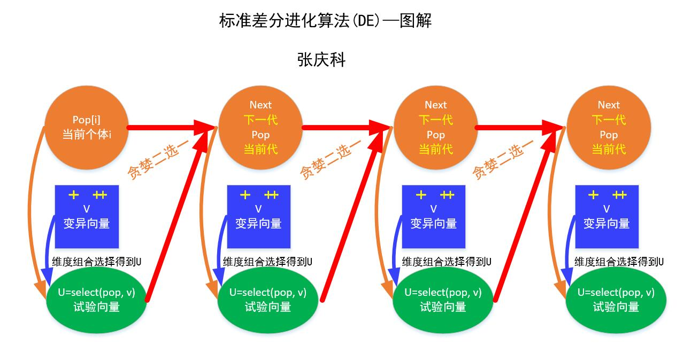
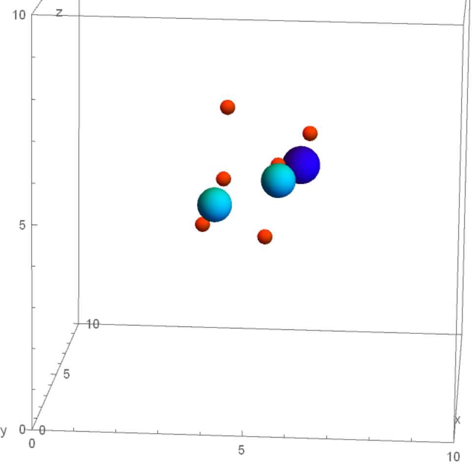
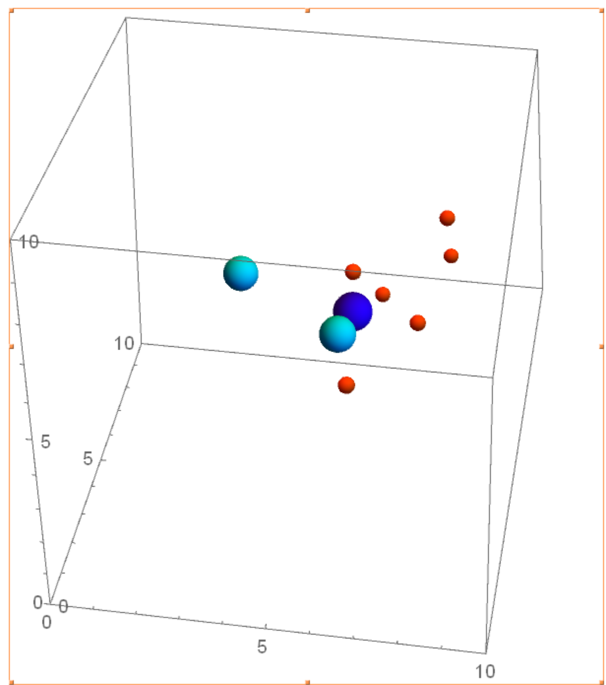
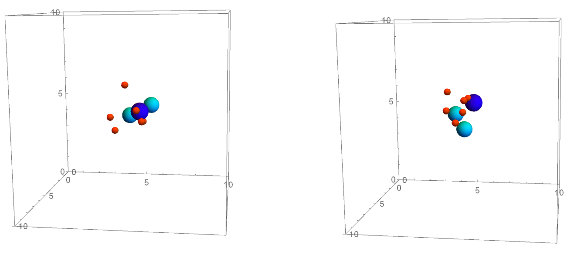
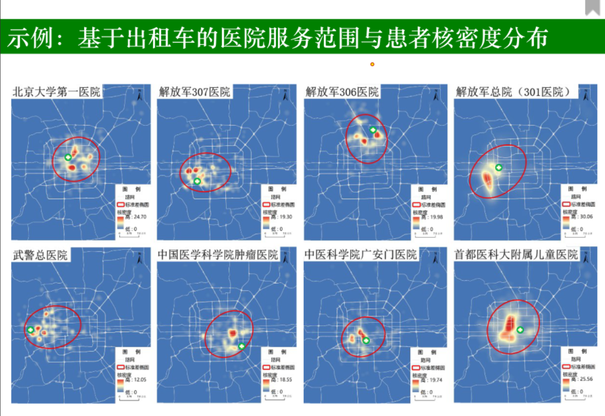
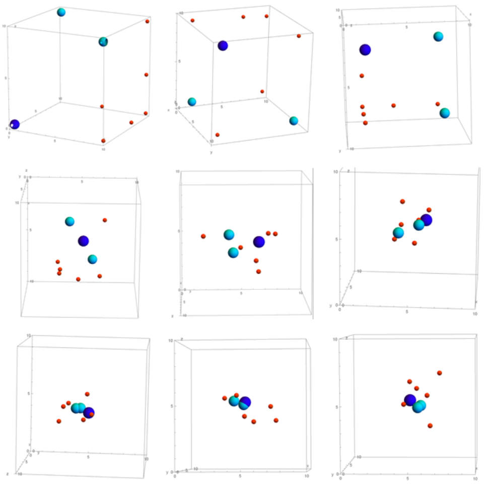
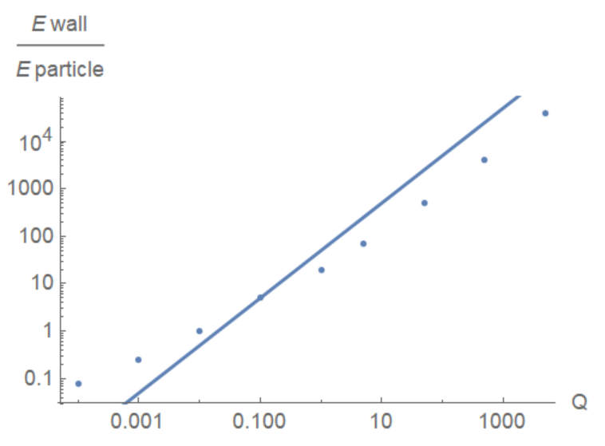

《系统工程与工程管理概论》课程作业。在引力模型下尝试不同的最优化方法，分析结果。

\begin{frame}[plain]\maketitle
\end{frame}
\begin{frame}[t]\frametitle{目录}
   \begin{multicols}{2}
  \tableofcontents
\end{multicols}
 \end{frame}

# 问题描述

\begin{frame}
  \frametitle{问题描述}
考虑这样一些粒子，他们分布在6块平板围成的一个矩形区域内，粒子同时位于薄壁平板与其他粒子产生的场中，寻求一种稳定的粒子空间分布状态使体系能量最低。
\end{frame}

# 模型

## 引力模型

\begin{frame}
  \frametitle{引力模型}
引力模型以牛顿经典万有引力公式为基础，是应用广泛的空间相互作用模型，在研究空间布局、贸易、人口迁移等方面取得了很多成果。
\par 该模型认为对象空间分布只与距离和事件权重有关，产生extract and push作用。例如，在分析人口流动问题时，可将各城市作为点源，假定人流受密度排斥作用与资源吸引作用两种因素驱动，分析人口流动过程与空间分布。
\end{frame}

## 模型的数学表述

\begin{frame}
  \frametitle{模型的数学描述}
区域中共有$n$个粒子，第$i$个粒子的坐标设为$x_i,y_i,z_i$，计算能量时的权重为$m_i$，$\sum m_i=1$。两个粒子$i,j$之间的距离为
\begin{equation}
r_{ij}=\sqrt{(x_i-x_j)^2+(y_i-y_j)^2+(z_i-z_j)^2}
\end{equation}

设薄壁平板由$x=0,y=0,z=0,x=x_0,y=y_0,z=z_0$定义。第$i$个粒子在第$k$块平板产生的场中的能量
和粒子到平板的距离$d_{ik}$，和粒子、平板本身的权重$m_i,M_k$成正比，即
\begin{equation}
        Ea_{ik}=m_i M_k f(d_{ik})
\end{equation}
第$i,j$粒子之间的相互作用能量，与两粒子之间的距离有关，和两粒子本身的权重成正比。即
\begin{equation}
        Eb_{ij}=m_i m_j g(r_{ij})
\end{equation}
\end{frame}
\begin{frame}
  \frametitle{模型的数学描述}
体系的总能量为相互作用能量和加权$Q$场能量的总和。
\begin{align}
        E&=Q\sum_{i,k}Ea_{ik}+\sum_{i=1}^n\sum_{j=1}^{i-1}Eb_{i,j}\\
        &=Q\sum_{i=1}^n \sum_{k=1}^6 m_i M_k f(d_{ik})
        +\sum_{i=1}^n\sum_{j=1}^{i-1}m_i m_j g(r_{ij})
\end{align}

能量要求最小，即需要优化函数$E$，结合粒子不能处于区域外部的条件，可写出最优化问题形式为
\begin{align}
        &\min E(x_1,\dots,x_n,y_1,\dots,y_n,z_1,\dots,z_n)\\
        &0<x_i<x_0 \qquad i=1,\dots,n\\
        &0<y_i<y_0 \qquad i=1,\dots,n\\
        &0<z_i<z_0 \qquad i=1,\dots,n
\end{align}
\end{frame}
\begin{frame}
  \frametitle{模型参数}
  用来调节模型的参数有
\begin{enumerate}
\item 描述平板场能量和粒子相互作用能量的函数$f,g$；
\item 平板的位置参数$x_0,y_0,z_0$；
\item 粒子和平板的权重$m_i,M_k$；
\item 场能量总体的权重$Q$。
\end{enumerate}
\end{frame}

# 模型求解

## 设定参数

\begin{frame}
  \frametitle{模型求解：设定参数}
平板场能量与粒子相互作用能量的函数取为相应距离的倒数，即
\begin{equation}
f(d_{ik})=\frac{1}{d_{ik}} \qquad g(r_{ij})=\frac{1}{r_{ij}}
\end{equation}

平板的位置设定为$x_0=y_0=z_0=10$，粒子在边长为$10$的立方体中运动。
考虑$\mathrm{C_2H_6O}$分子模型，共有九个粒子，根据相应的相对原子质量，取粒子权重为
\begin{equation}
\bm{m}=(1,1,1,1,1,1,12,12,16)/46
\end{equation}
平板权重则取为
\begin{equation}
\bm{M}=(2,3,4,2,3,4)
\end{equation}
即$x,y,z$法向的平板分别具有$2,3,4$的权重。最后取平板能量场权重$Q=5$。
\end{frame}

## 理论分析方法

\begin{frame}
  \frametitle{理论分析方法}
这是一个有约束多变量连续优化问题。对于约束，可以利用Sigmoid函数消除不等式约束，如
\begin{equation}
0<x<x_0 \qquad x=\frac{x_0}{1+ \mathrm{e}^{-X}} \quad\Rightarrow\quad X\in \mathbb{R}
\end{equation}
但是这会引入复杂的指数函数，使得求偏导后的方程无法求解。事实上，即使不作变换，方程也已经十分复杂，例如
\begin{equation}
\frac{\partial E}{\partial x_i}=Qm_i
\left(
  -\frac{M_1}{x_i^2}+\frac{M_4}{(x_0-x_i)^2}\right)-m_i\sum_{j=1,j\neq i}^n \frac{m_j(x_i-x_j)}{r_{ij}^3}=0
\end{equation}
要求解$3n$个这样的方程，即使是$n=2$的情况也是很艰难的，用软件尝试后也无法得到计算结果。因此无法得到解析解。
\end{frame}

## 差分进化方法

\begin{frame}
  \frametitle{差分进化算法}
差分进化算法是通过差异引导变异的进化算法。其原理可见图\ref{fig:diffe}。简单而言，
它是计算两个样本的向量差，加权加到第三个样本上，然后进行传统进化算法的参数混合，观察是否更优，若更优则保留这一样本。

\begin{figure}[H]
  \centering
  
  \caption{差分进化算法原理}
  \label{fig:diffe}
\end{figure}
\end{frame}
\begin{frame}
  \frametitle{差分进化算法模型结果}
利用差分进化算法，通过改变随机数种子，在五十次求解中得到的最优解为$E=18.5274$，构型如图\ref{fig:differe}。
\begin{figure}[H]
  \centering
  
  \caption{差分进化算法结果}
  \label{fig:differe}
\end{figure}

除了差分进化算法外，还可应用Nelder-Mead算法，效果类似；模拟退火算法，效果欠佳。
\end{frame}

## 蒙特卡罗方法

\begin{frame}
  \frametitle{蒙特卡罗方法}
随机搜索方法是简单地随机取变量，计算函数值，当发现更小的函数值时记录下新的结果。
经过1小时40分钟的1亿次随机搜索，结果得到最小能量为$20.0196$。
\begin{figure}[htbp]
  \centering
  
  \caption{蒙特卡罗方法结果}
  \label{fig:mtkl}
\end{figure}
\end{frame}

## 蚁群方法

\begin{frame}
  \frametitle{蚁群方法}
  \begin{block}{蚂蚁}
昆虫学家们在研究类似蚂蚁这样具有盲视动物如何沿着最佳路线丛其巢穴到食物源的过程中发现，蚂蚁与蚂蚁之间最重要的媒介是移动过程中释放的信息素，孤立的蚂蚁因此可以感受到其他同伴释放的信息素，并调整自身迁移的倾向，同时又释放信息素，在很多个重复之后，信息素的浓度会有一定的空间分布。由于最有效率的路径耗时最短，被重复次数更多，因此信息素浓度大。
\end{block}
\begin{block}{抽象模型}
蚁群模型是一种正反馈模型，对于求解一般的最小费用优化问题具有极高的收敛效率。（虽然仍然具有初值敏感性面临着群体迷失）。蚁群模型给出了“目标函数”和“概率调整函数”，通过概率调整函数生成转移概率，在此过程中，一个蚂蚁被抽象为一个可行解，通过目标函数生成概率调整函数，通过概率调整函数决定后面蚂蚁的转移概率，按分布移动后面的蚂蚁，然后形成循环。
\end{block}
\end{frame}
\begin{frame}
    \frametitle{蚁群方法}
概率调整函数即为信息素的生成过程，由于现实生活中，信息素随时间具有衰减规律，而这种衰减规律在蚁群群体构造初始最优子空间（例如：行走方向）时十分重要。

本例子中，一个粒子点组的集合被抽象为一只蚂蚁，信息素更新周期为1000只蚂蚁。首先在前1000次尝试中采用蒙特卡罗的方法，创建初始的信息素分布空间，在大于1000次尝试之后，信息素开始主导种群的运动方向，由信息素空间（前1000次蚂蚁位置的点集）生成转移概率。
\end{frame}
\begin{frame}
  \frametitle{蚁群方法}
  \begin{block}{思想}
    前1000次蚂蚁位置的一定半径范围确定了邻域，且前1000次蒙特卡罗方法投放蚂蚁会依评价函数存在一个最优点，为了让蚂蚁群体产生向最优点转移并且逐步优化最有点的目标，需要在信息素空间中逐步强化最优点，但这种强化不应以牺牲邻域空间为代价，否则只可能达到局部极值。
  \end{block}
  \begin{block}{策略}
在前1000次随机信息素空间的基础上，每次尝试清除1000次之前的信息素，同时加入目前最优点进入信息素空间，理应在1000次后，信息素空间至少会更新为1000次前最优点空间的邻域，在此过程中，又会不断更新最优点。
\end{block}

  模型的收敛周期是1000次，相比于蒙特卡罗方法具有极大的优势，但是缺点是——运行时长的提升。概率调整函数决定转移概率的过程需要依照整个信息素空间1000个样本，因此增加了信息素更新周期的一阶多项式时间复杂度。
\end{frame}
\begin{frame}
  \frametitle{蚁群算法模拟结果}
一万次尝试，能量收敛到18.4753，但是有趣的是十万次尝试后，能量收敛到18.4972。说明模型的收敛速度很快，但是初值敏感，且最终结果倾向于收敛到一个接近最优的超平面。
\begin{figure}[H]
  \centering
  
  \caption{蚁群算法结果（左图：十万次，右图：一万次）}
  \label{fig:ants}
\end{figure}
\end{frame}

# 模型的一些现实应用

## 城市规划中的应用

\begin{frame}
  \frametitle{现实应用：城市规划}
除了应用于分子稳定结构的分析，这一模型也能加以推广，采用不同的函数形式以用于空间要素的分析。
例如，城市的选址需要和其他城市及边界距离适中。
\begin{alertblock}{距离过近}
导致公共服务资源配置不足，城市与城市之间通勤人口流动增加，形成交通堵塞、贫民窟等边缘影响，进一步发展受限制等问题。
\end{alertblock}
\begin{alertblock}{距离过远}
则不便于交通运输与城市交流，也难以形成具有功能的城市群与大都市带。
\end{alertblock}
\begin{alertblock}{国土边境}
若是将国土边境作为边界，考虑边界的影响。靠近边境，容易受到邻国势力的干扰，且资源运输效率低下。
\end{alertblock}
因此可以设相互作用能为如$g(r_{ij})=r_{ij}+r_{ij}^{-1}$的形式进行求解，由此为城市选址提供参考。
\end{frame}
\begin{frame}
  \frametitle{城市规划中的应用}
若将边界的能量赋权改为负值，在空间中增加一些点源（具有负权重的点），将粒子之间的竞争排斥能量比例增大（增强竞争效应），可用来研究资源竞争模型下的空间分布问题。例如企鹅筑巢模式的预测，医院附近出租车核密度分布，进而可以为出租车分布的规划提供一些建议。
\begin{figure}[H]
  \centering
  
\end{figure}
\end{frame}

## 基于引力方程的人类行为学模型

\begin{frame}
  \frametitle{基于引力方程的人类行为学模型}
  \begin{block}{行为现象}
人常常习惯于到自己熟悉的地方，如果运用统计学方法统计一个人的行动范围、出现频率与停留时间，会观察到空间集聚的现象。同时，陌生人之间除了从随机因素考虑，也倾向于保持一定的空间距离，即排斥分布。这种例子可以在较大的自习室和宽松的图书馆中观察到，同学们大多不会选择与另一个同学紧靠的位置，除非座位紧张。也就是说，陌生人的空间分布模式除了随机分布还存在弱相互作用抑制的关系。
\end{block}
以上讨论说明，地点（空间）存在对人的内蕴的吸引与排斥作用，同时陌生人之间也存在弱空间相互抑制作用。那么熟悉的地点可作为吸引点源，不熟悉的地点可作为排斥点源，人作为被抽象的点可对每个地点有不同的赋权，同时点与点（人与人）之间也可有不同的能量赋权（关系），以此建立人流空间模型。
\end{frame}
\begin{frame}
  \frametitle{历史}
  值得注意的是，这种“社会物理学”的方法于19世纪被Thomas Hobbes提出，被Adolphe Quetelet发展，但是由于对人的非感性抽象而引起广泛攻击，但实际上，对于一些应急事件，例如拥堵事件、疏散事件，在人的主观性相对弱化，物理的位置与时间属性被彰显时，该模型具有强有力的说服力与预测能力，可为城市应急策略、疏散规划提供一定的建议与思路。
\end{frame}

# 讨论

## 经典方法与现代方法

\begin{frame}
  \frametitle{讨论：经典方法与现代方法}
  \begin{exampleblock}{经典方法}
连续空间欧拉最小距离优化问题的核心思路是确定目标函数，通过乘子法求解方程。这种方法的求解局限主要在于求解高次非线性多元方程组的困难。
\end{exampleblock}
\pause
\begin{block}{现代方法}
现代方法基于统计理论，认为——该问题先天存在一个最优解，而且该最优解可达，通过随机搜索的方法不断逼近最优解，最终达成到达最优解的收敛域的超平面。
\end{block}
相比起来，经典方法是最精确解的追求，现代方法是工程实践中的需求，即寻找一个可接受且具有实操性的解。
\end{frame}

## 参数因子的讨论

\begin{frame}
  \frametitle{墙壁能量强度因子}
在该引力模型中，引力因子受制于墙壁能量和粒子间能量两个因素共同作用，同时墙壁能量对粒子间能量可以有一个无量纲权重因子调整。该因子往往直接决定了粒子分布的形态。

粒子为达成最小能量条件，在远离墙壁和彼此远离之间权衡。根据能量的表达式可知墙壁能量场因子$Q$控制着两部分能量的相对大小。在上面的模型中，$Q=5$，改变$Q$值进行模拟，得到结果如~图\ref{fig:Qs}。
\begin{equation}
  E=Q\sum_{i=1}^n \sum_{k=1}^6 m_i M_k f(d_{ik})
        +\sum_{i=1}^n\sum_{j=1}^{i-1}m_i m_j g(r_{ij})
\end{equation}

\end{frame}
\begin{frame}
  \begin{figure}[H]
  \centering
  
  \caption{不同$Q$值的模拟结果。从左至右，第一排$Q$值为$10^{-4},10^{-3},10^{-2}$，第二排为$0.1,1,5$，第三排为$50,500,5000$}
  \label{fig:Qs}
\end{figure}
可见，当$Q$值增大时粒子会避免靠近墙而相互接近，$Q$值减小时粒子会倾向于相互远离。
\end{frame}
\begin{frame}
    \frametitle{墙壁能量强度因子}
  考虑到粒子更倾向于彼此远离还是倾向于远离墙壁可能与两部分能量的相对大小有关，对不同$Q$值及其对应的比例描点作图，结果如图\ref{fig:ewalland}所示。按照直觉思考，$Q$值提高十倍，墙壁能量场的能量也应当提高十倍，因此应当是图中直线的情况。但事实上得到的点连成直线的斜率要偏小，是因为粒子的分布也有影响。在$Q$值大时，墙壁能量场的能量占主要部分，斜率偏小说明体系在墙壁能量场能量有减小，体现粒子倾向于相互靠近而远离墙壁。在$Q$值小时，粒子之间相互作用能量占主要部分，斜率偏小说明体系在墙壁能量场能量有增加，体现粒子倾向于相互远离而靠近墙壁。
\begin{figure}[H]
  \centering
  
  \caption{$Q$值大小与两部分能量关系比值的关系}
  \label{fig:ewalland}
\end{figure}

\end{frame}
\begin{frame}
  \frametitle{蚁群模型中的一些因子}
蚁群模型通过概率调整函数（即信息素生成）为后续的搜索空间赋权，并不断更新空间权重。在本模型中，有两个因子对模型收敛速度与优化结果产生重大影响。

\begin{exampleblock}{信息素空间大小}
初始一个周期内蒙特卡罗方法生成的信息素空间决定了之后的邻域搜索区域，这也是该模型具有巨大的初值敏感性的原因。但是过大的信息素空间会导致模型收敛速度的变慢（类似蒙特卡罗方法），过小的信息素空间会导致模型收敛的局部最优值远远偏离最优解。这是一个时间和空间上的博弈。
\end{exampleblock}
\begin{exampleblock}{信息素空间决定的邻域搜索半径的大小}
本模型中采用0.3个wall scale。该因子同样对收敛速度和局部最优偏离情况有上述贡献，但对初值敏感性的贡献不大。
\end{exampleblock}

\end{frame}

## 未来优化方案

\begin{frame}
  \frametitle{未来优化方案}
\begin{block}{增强抽象模型的抗风险能力}
蚁群方法中，我们可以清楚地观察到，十个一万次尝试带来的结果远远优于十万次尝试带来的结果，在模型收敛的假定下，如何削减初值敏感带来的风险是一个值得深思的问题。
\end{block}

\begin{block}{增强模型的现实意义}
该模型以抽象的引力模型，抽象的求解方法为起点进行了研究和讨论，但是对模型的应用与现实意义的发掘不够深入，具有极大的改进空间。
\end{block}

\end{frame}
\begin{frame}[plain]\vfill
  \centerline{\Huge 谢谢！}
  \vfill
\end{frame}

\maketitle

# 问题描述

考虑这样一些粒子，他们分布在6块平板围成的一个矩形区域内，粒子同时位于薄壁平板与其他粒子产生的场中，寻求一种稳定的粒子空间分布状态使体系能量最低。

# 模型

## 引力模型

引力模型以牛顿经典万有引力公式为基础，是应用广泛的空间相互作用模型，在研究空间布局、贸易、人口迁移等方面取得了很多成果。

该模型认为对象空间分布只与距离和事件权重有关，产生extract and push作用。例如，在分析人口流动问题时，可将各城市作为点源，假定人流受密度排斥作用与资源吸引作用两种因素驱动，分析人口流动过程与空间分布。

## 模型的数学表述

区域中共有$n$个粒子，第$i$个粒子的坐标设为$x_i,y_i,z_i$，计算能量时的权重为$m_i$，$\sum m_i=1$。两个粒子$i,j$之间的距离为 $$r_{ij}=\sqrt{(x_i-x_j)^2+(y_i-y_j)^2+(z_i-z_j)^2}$$

设薄壁平板由$x=0,y=0,z=0,x=x_0,y=y_0,z=z_0$定义。第$i$个粒子在第$k$块平板产生的场中的能量 和粒子到平板的距离$d_{ik}$，和粒子、平板本身的权重$m_i,M_k$成正比，即 $$Ea_{ik}=m_i M_k f(d_{ik})$$ 第$i,j$粒子之间的相互作用能量，与两粒子之间的距离有关，和两粒子本身的权重成正比。即 $$Eb_{ij}=m_i m_j g(r_{ij})$$ 体系的总能量为相互作用能量和加权$Q$场能量的总和。 $$\begin{aligned}
        E&=Q\sum_{i,k}Ea_{ik}+\sum_{i=1}^n\sum_{j=1}^{i-1}Eb_{i,j}\\
        &=Q\sum_{i=1}^n \sum_{k=1}^6 m_i M_k f(d_{ik})
        +\sum_{i=1}^n\sum_{j=1}^{i-1}m_i m_j g(r_{ij})
\end{aligned}$$

能量要求最小，即需要优化函数$E$，结合粒子不能处于区域外部的条件，可写出最优化问题形式为 $$\begin{aligned}
        &\min E(x_1,\dots,x_n,y_1,\dots,y_n,z_1,\dots,z_n)\\
        &0<x_i<x_0 \qquad i=1,\dots,n\\
        &0<y_i<y_0 \qquad i=1,\dots,n\\
        &0<z_i<z_0 \qquad i=1,\dots,n
\end{aligned}$$ 用来调节模型的参数有

1.  描述平板场能量和粒子相互作用能量的函数$f,g$；

2.  平板的位置参数$x_0,y_0,z_0$；

3.  粒子和平板的权重$m_i,M_k$；

4.  场能量总体的权重$Q$。

# 模型求解

## 设定参数

平板场能量与粒子相互作用能量的函数取为相应距离的倒数，即 $$f(d_{ik})=\frac{1}{d_{ik}} \qquad g(r_{ij})=\frac{1}{r_{ij}}$$

平板的位置设定为$x_0=y_0=z_0=10$，粒子在边长为$10$的立方体中运动。 考虑$\mathrm{C_2H_6O}$分子模型，共有九个粒子，根据相应的相对原子质量，取粒子权重为 $$\bm{m}=(1,1,1,1,1,1,12,12,16)/46$$ 平板权重则取为 $$\bm{M}=(2,3,4,2,3,4)$$ 即$x,y,z$法向的平板分别具有$2,3,4$的权重。最后取$Q=5$。

## 理论分析方法

这是一个有约束多变量连续优化问题。对于约束，可以利用Sigmoid函数消除不等式约束，如 $$0<x<x_0 \qquad x=\frac{x_0}{1+ \mathrm{e}^{-X}} \quad\Rightarrow\quad X\in \mathbb{R}$$ 但是这会引入复杂的指数函数，使得求偏导后的方程无法求解。事实上，即使不作变换，方程也已经十分复杂，例如 $$\frac{\partial E}{\partial x_i}=Qm_i
\left(
  -\frac{M_1}{x_i^2}+\frac{M_4}{(x_0-x_i)^2}\right)-m_i\sum_{j=1,j\neq i}^n \frac{m_j(x_i-x_j)}{r_{ij}^3}=0$$ 要求解$3n$个这样的方程，即使是$n=2$的情况也是很艰难的，用软件尝试后也无法得到计算结果。因此无法得到解析解。

## 蒙特卡罗方法

随机搜索方法是简单地随机取变量，计算函数值，当发现更小的函数值时记录下新的结果。

### 模型结果

经过1小时40分钟的1亿次随机搜索，结果得到最小能量为$20.0196$。

<figure id="fig:mtkl">

<figcaption>蒙特卡罗方法结果</figcaption>
</figure>

## 差分进化方法

差分进化算法是通过差异引导变异的进化算法。其原理可见图`\ref{fig:diffe}`{=latex}。简单而言， 它是计算两个样本的向量差，加权加到第三个样本上，然后进行传统进化算法的参数混合，观察是否更优，若更优则保留这一样本。

<figure id="fig:diffe">

<figcaption>差分进化算法原理</figcaption>
</figure>

### 模型结果

利用差分进化算法，通过改变随机数种子，在五十次求解中得到的最优解为$E=18.5274$，构型如图`\ref{fig:differe}`{=latex}。

<figure id="fig:differe">

<figcaption>差分进化算法结果</figcaption>
</figure>

除了差分进化算法外，还可应用Nelder-Mead算法，效果类似；模拟退火算法，效果欠佳。

## 蚁群方法

昆虫学家们在研究类似蚂蚁这样具有盲视动物如何沿着最佳路线丛其巢穴到食物源的过程中发现，蚂蚁与蚂蚁之间最重要的媒介是移动过程中释放的信息素，孤立的蚂蚁因此可以感受到其他同伴释放的信息素，并调整自身迁移的倾向，同时又释放信息素，在很多个重复之后，信息素的浓度会有一定的空间分布。由于最有效率的路径耗时最短，被重复次数更多，因此信息素浓度大。蚁群模型是一种正反馈模型，对于求解一般的最小费用优化问题具有极高的收敛效率。（虽然仍然具有初值敏感性面临着群体迷失）。蚁群模型给出了"目标函数"和"概率调整函数"，通过概率调整函数生成转移概率，在此过程中，一个蚂蚁被抽象为一个可行解，通过目标函数生成概率调整函数，通过概率调整函数决定后面蚂蚁的转移概率，按分布移动后面的蚂蚁，然后形成循环。

概率调整函数即为信息素的生成过程，由于现实生活中，信息素随时间具有衰减规律，而这种衰减规律在蚁群群体构造初始最优子空间（例如：行走方向）时十分重要。

本例子中，一个粒子点组的集合被抽象为一只蚂蚁，信息素更新周期为1000只蚂蚁。首先在前1000次尝试中采用蒙特卡罗的方法，创建初始的信息素分布空间，在大于1000次尝试之后，信息素开始主导种群的运动方向，由信息素空间（前1000次蚂蚁位置的点集）生成转移概率，具体的思想是：前1000次蚂蚁位置的一定半径范围确定了邻域，且前1000次蒙特卡罗投放蚂蚁会依评价函数存在一个最优点，为了让蚂蚁群体产生向最优点转移并且逐步优化最有点的目标，需要在信息素空间中逐步强化最优点，但这种强化不应以牺牲邻域空间为代价，否则只可能达到局部极值。具体策略是，在前1000次随机信息素空间的基础上，每次尝试清除1000次之前的信息素，同时加入目前最优点进入信息素空间，理应在1000次后，信息素空间至少会更新为1000次前最优点空间的邻域，在此过程中，又会不断更新最优点。模型的收敛周期是1000次，相比于蒙特卡罗方法具有极大的优势，但是缺点是------运行时长的提升。概率调整函数决定转移概率的过程需要依照整个信息素空间1000个样本，因此增加了信息素更新周期的一阶多项式时间复杂度。

### 模型结果

一万次尝试，能量收敛到18.4753，但是有趣的是十万次尝试后，能量收敛到18.4972。说明模型的收敛速度很快，但是初值敏感，且最终结果倾向于收敛到一个接近最优的超平面。

<figure id="fig:ants">

<figcaption>蚁群算法结果（左图：十万次，右图：一万次）</figcaption>
</figure>

# 模型的一些现实应用

## 城市规划中的应用

除了应用于分子稳定结构的分析，这一模型也能加以推广，采用不同的函数形式以用于空间要素的分析。 例如，城市的选址需要和其他城市及边界距离适中。若是和其他城市距离过近， 会导致公共服务资源配置不足，城市与城市之间通勤人口流动增加，形成交通堵塞、贫民窟等边缘影响，进一步发展受限制等问题。而若是距离过远，则不便于交通运输与城市交流，也难以形成具有功能的城市群与大都市带。若是将国土边境作为边界，考虑边界的影响。靠近边境，容易受到邻国势力的干扰，且资源运输效率低下。因此可以设相互作用能为如$g(r_{ij})=r_{ij}+r_{ij}^{-1}$ 的形式进行求解，由此为城市选址提供参考。

若将边界的能量赋权改为负值，在空间中增加一些点源（具有负权重的点），将粒子之间的竞争排斥能量比例增大（增强竞争效应），可用来研究资源竞争模型下的空间分布问题。例如企鹅筑巢模式的预测，医院附近出租车核密度分布，进而可以为出租车分布的规划提供一些建议。

<figure>

</figure>

## 基于引力方程的人类行为学模型

人常常习惯于到自己熟悉的地方，如果运用统计学方法统计一个人的行动范围、出现频率与停留时间，会观察到空间集聚的现象。同时，陌生人之间除了从随机因素考虑，也倾向于保持一定的空间距离，即排斥分布。这种例子可以在较大的自习室和宽松的图书馆中观察到，同学们大多不会选择与另一个同学紧靠的位置，除非座位紧张。也就是说，陌生人的空间分布模式除了随机分布还存在弱相互作用抑制的关系。以上讨论说明，地点（空间）存在对人的内蕴的吸引与排斥作用，同时陌生人之间也存在弱空间相互抑制作用。那么熟悉的地点可作为吸引点源，不熟悉的地点可作为排斥点源，人作为被抽象的点可对每个地点有不同的赋权，同时点与点（人与人）之间也可有不同的能量赋权（关系），以此建立人流空间模型。值得注意的是，这种"社会物理学"的方法于19世纪被Thomas Hobbes提出，被Adolphe Quetelet发展，但是由于对人的非感性抽象而引起广泛攻击，但实际上，对于一些应急事件，例如拥堵事件、疏散事件，在人的主观性相对弱化，物理的位置与时间属性被彰显时，该模型具有强有力的说服力与预测能力，可为城市应急策略、疏散规划提供一定的建议与思路。

# 讨论

## 经典方法与现代方法

连续空间欧拉最小距离优化问题的核心思路是确定目标函数，通过乘子法求解方程。这种方法的求解局限主要在于求解高次非线性多元方程组的困难。

现代方法基于统计理论，认为------该问题先天存在一个最优解，而且该最优解可达，通过随机搜索的方法不断逼近最优解，最终达成到达最优解的收敛域的超平面。

相比起来，经典方法是最精确解的追求，现代方法是工程实践中的需求，即寻找一个可接受且具有实操性的解。

## 参数因子的讨论

### 墙壁能量强度因子

在该引力模型中，引力因子受制于墙壁能量和粒子间能量两个因素共同作用，同时墙壁能量对粒子间能量可以有一个无量纲权重因子调整。该因子往往直接决定了粒子分布的形态。

粒子为达成最小能量条件，在远离墙壁和彼此远离之间权衡。根据能量的表达式可知墙壁能量场因子$Q$控制着两部分能量的相对大小。在上面的模型中，$Q=5$，改变$Q$值进行模拟，得到结果如 图`\ref{fig:Qs}`{=latex}。可见，当$Q$值增大时粒子会避免靠近墙而相互接近，$Q$值减小时粒子会倾向于相互远离。

<figure id="fig:Qs">

<figcaption>不同<em>Q</em>值的模拟结果。从左至右，第一排<em>Q</em>值为10−4, 10−3, 10−2，第二排为0.1, 1, 5，第三排为50, 500, 5000</figcaption>
</figure>

考虑到粒子更倾向于彼此远离还是倾向于远离墙壁可能与两部分能量的相对大小有关，对不同$Q$值及其对应的比例描点作图，结果如图`\ref{fig:ewalland}`{=latex}所示。按照直觉思考，$Q$值提高十倍，墙壁能量场的能量也应当提高十倍，因此应当是图中直线的情况。但事实上得到的点连成直线的斜率要偏小，是因为粒子的分布也有影响。在$Q$值大时，墙壁能量场的能量占主要部分，斜率偏小说明体系在墙壁能量场能量有减小，体现粒子倾向于相互靠近而远离墙壁。在$Q$值小时，粒子之间相互作用能量占主要部分，斜率偏小说明体系在墙壁能量场能量有增加，体现粒子倾向于相互远离而靠近墙壁。

<figure id="fig:ewalland">

<figcaption><em>Q</em>值大小与两部分能量关系比值的关系</figcaption>
</figure>

### 蚁群模型中的一些因子

蚁群模型通过概率调整函数（即信息素生成）为后续的搜索空间赋权，并不断更新空间权重。在本模型中，有两个因子对模型收敛速度与优化结果产生重大影响。

首先是信息素空间大小，初始一个周期内蒙特卡罗方法生成的信息素空间决定了之后的邻域搜索区域，这也是该模型具有巨大的初值敏感性的原因。但是过大的信息素空间会导致模型收敛速度的变慢（类似蒙特卡罗方法），过小的信息素空间会导致模型收敛的局部最优值远远偏离最优解。这是一个时间和空间上的博弈。

其次是信息素空间决定的邻域搜索半径的大小，本模型中采用0.3个wall scale。该因子同样对收敛速度和局部最优偏离情况有上述贡献，但对初值敏感性的贡献不大。

## 未来优化方案

### 增强抽象模型的抗风险能力

蚁群方法中，我们可以清楚地观察到，十个一万次尝试带来的结果远远优于十万次尝试带来的结果，在模型收敛的假定下，如何削减初值敏感带来的风险是一个值得深思的问题。

### 增强模型的现实意义

该模型以抽象的引力模型，抽象的求解方法为起点进行了研究和讨论，但是对模型的应用与现实意义的发掘不够深入，具有极大的改进空间。
