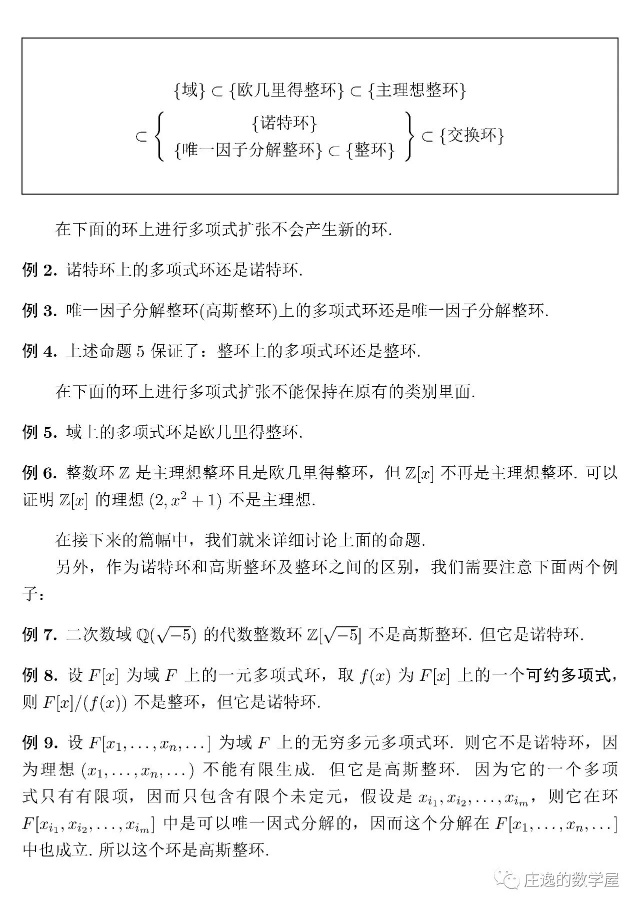

稍微整理的一些大一上下半学期线性代数复习知识。

求证：𝑓(𝑥) = 𝑥5 + 𝑥3 + 1 在 Q[𝑥]中不可约。

求证：Z[√−2] = {𝑎 + 𝑏√−2|𝑎, 𝑏 ∈ Z}是欧几里得环。

设𝐺为有限群，有二阶自同构𝑓（𝑓2为恒等映射），没有非平凡的不动点，即𝑎 ≠ 𝑒 ⇒ 𝑓(𝑎) ≠ 𝑎，证明𝐺为阿贝尔群。

设𝐹是𝐾的扩域，𝑢 ∈ 𝐹且𝑢是𝐾上的代数元，求证𝐹[𝑢]是域。

凯莱定理，环和整环的关系，拉格朗日/牛顿插值公式，斯图姆定理，艾森斯坦既约性判别法，霍纳法。

#### **有趣的题**

求证：$f(x) = x^{5} + x^{3} + 1在Q\lbrack x\rbrack 中不可约。$

$$证：若f(x)在Q\lbrack x\rbrack 中可约，则\overline{f}(x)在Z_{2}\lbrack x\rbrack 中可约。$$

$$因为f(0) = f(1) = 1\ (mod\ 2)，故\overline{f}(x)只有二次因子，$$

$$且只能为x^{2} + x + 1$$

由带余除法得$\overline{f}(x) = \left( x^{2} + x + 1 \right)\left( x^{3} + x^{2} + x \right) + x + 1$

$$因此\overline{f}(x)在Z_{2}\lbrack x\rbrack 中不可约，即f(x)在Q\lbrack x\rbrack 中不可约。$$

求证：$Z\left\lbrack \sqrt{- 2} \right\rbrack = \{ a + b\sqrt{- 2}|a,b \in Z\} 是欧几里得环$

$证：范数N(\alpha) = a^{2} + 2b^{2}$, $设\alpha,\beta \in Z\left\lbrack \sqrt{- 2} \right\rbrack$

$$在Q\left\lbrack \sqrt{- 2} \right\rbrack 中，\alpha\beta^{- 1}可表为m_{1} + n_{1}\sqrt{- 2},\ m_{1},n_{1} \in Q$$

$$m_{1},n_{1}又可分别表为m + u,n + v,\ 其中m,n \in Z,\ |u| \leq \frac{1}{2},|v| \leq \frac{1}{2}$$

$$因此\alpha = \beta\left( m + n\sqrt{- 2} \right) + \beta\left( u + v\sqrt{- 2} \right)$$

$$\because\alpha,\beta \in Z\left\lbrack \sqrt{- 2} \right\rbrack,\left( m + n\sqrt{- 2} \right) \in Z\left\lbrack \sqrt{- 2} \right\rbrack$$

$$\therefore\beta\left( u + v\sqrt{- 2} \right) \in Z\left\lbrack \sqrt{- 2} \right\rbrack$$

$$取q = m + n\sqrt{- 2}，r = \beta\left( u + v\sqrt{- 2} \right)$$

$$则有熟悉的形式\alpha = q\beta + r$$

$$取范数为尺度函数，要证N(r) < N(\beta)$$

$$即证N\left( \beta\left( u + v\sqrt{- 2} \right) \right) = N(\beta)N\left( u + v\sqrt{- 2} \right) < N(\beta)$$

$$只需证N\left( u + v\sqrt{- 2} \right) < 1$$

$$即证u^{2} + 2v^{2} < 1$$

$$因为u^{2} \leq \frac{1}{4},v^{2} \leq \frac{1}{4}$$

$$u^{2} + 2v^{2} < 1易得。$$

$$设G为有限群，有二阶自同构f\left( f^{2}为恒等映射 \right)，$$

$$没有非平凡的不动点，即a \neq e \Rightarrow f(a) \neq a$$

证明$G为阿贝尔群。$

$$证：考虑映射k:G \rightarrow G,a \rightarrow f(a)a^{- 1}是否为单射$$

$$若f(a)a^{- 1} = f(b)b^{- 1},则f(b)^{- 1}f(a) = b^{- 1}a$$

$$即f\left( b^{- 1}a \right) = b^{- 1}a，从而b^{- 1}a = e，b = a$$

$$因而k为单射，由G有限可得k为双射。$$

$$设g = f(a)a^{- 1},则f(g) = f\left( f(a)a^{- 1} \right) = f^{2}(a)f\left( a^{- 1} \right)$$

$$= af(a)^{- 1} = \left( f(a)a^{- 1} \right)^{- 1} = g^{- 1}$$

$$即映射f为g \rightarrow g^{- 1}$$

$$于是ab = f\left( a^{- 1} \right)f\left( b^{- 1} \right) = f\left( a^{- 1}b^{- 1} \right) = \left( a^{- 1}b^{- 1} \right)^{- 1} = ba$$

$$即G为阿贝尔群。$$

$$设F是K的扩域，u \in F且u是K上的代数元，$$

$$求证F\lbrack u\rbrack 是域。$$

$$证：设u的极小多项式为P(x)，则P(x)不可约。$$

$$\forall f(x) \in K\lbrack x\rbrack,若f(u) \neq 0,则存在s(x),t(x),$$

$$使得s(x)f(x) + t(x)P(x) = 1$$

$$\therefore s(u)f(u) = 1$$

$$\therefore f(u)有逆s(u)$$

#### 重要结论

凯莱定理：任意n阶有限群同构于对称群$S_{n}$的某个子群。

同构映射：$(a \in G)\ \ L:a \rightarrow L_{a} \in H,\ H \subset S_{n}$

$$其中\ L_{a}:G \rightarrow G,g \rightarrow ag$$

如果$\ker f = \left\{ e \right\},则f:G \rightarrow Im\ f是一个同构。$

有单位元的非平凡交换环R是整环，当且仅当在R中消去律成立。

$$即对\forall a,b,c \in R,ab = ac,a \neq 0 \Rightarrow b = c$$

域上的一元多项式环是欧几里得整环。

{width="2.8930555555555557in" height="0.9625in"}

唯一因子分解环上的多项式环还是唯一因子分解整环。

整环上的多项式环还是整环。

域上的多项式环是欧几里得整环。

正常情况：$当S \subseteq T时$

$$f在S\lbrack x\rbrack 中可约 \Rightarrow f在T\lbrack x\rbrack 中可约$$

$$f在T\lbrack x\rbrack 中不可约 \Rightarrow f在S\lbrack x\rbrack 中不可约$$

特殊：

$$f在Z\lbrack x\rbrack 中不可约 \Leftrightarrow f在Q\lbrack x\rbrack 中不可约$$

$$f在Z_{p}\lbrack x\rbrack 中不可约 \Leftrightarrow f在Z\lbrack x\rbrack 中不可约$$

$$p为素数且p不整除首项系数$$

$$设R是一个整环，其中每一个元素都有素因子分解，$$

$$则R为唯一因子分解环当且仅当$$

$$对每一个整除ab的素元p \in R,p|a或p|b$$

拉格朗日插值公式

$$f(X) = \sum_{k = 0}^{n}{b_{k}\frac{\left( X - c_{0} \right)\ldots\left( X - c_{i - 1} \right)\left( X - c_{i + 1} \right)\ldots\left( X - c_{n} \right)}{\left( c_{i} - c_{0} \right)\ldots\left( c_{i} - c_{i - 1} \right)\left( c_{i} - c_{i + 1} \right)\ldots\left( c_{i} - c_{n} \right)}}$$

牛顿插值公式

$$f(X) = u_{0} + u_{1}\left( X - c_{0} \right) + \ldots + u_{n}\left( X - c_{0} \right)\left( X - c_{1} \right)\ldots(X - c_{n - 1})$$

拉格朗日公式

$$\frac{f}{g} = \sum_{k = 1}^{n}\frac{f\left( c_{k} \right)}{g^{'}\left( c_{k} \right)\left( x - c_{k} \right)}$$

$$给定非零实系数多项式f(x)和闭区间\lbrack a,b\rbrack$$

$$f_{0}(x) = f(x),f_{1}(x),\ldots,f_{s}(x)$$

$$称为f(x)在闭区间\lbrack a,b\rbrack 上的斯图姆序列，$$

如果这些多项式都是实系数多项式且满足

$$末式无根：f_{s}(x)在\lbrack a,b\rbrack 上没有根；$$

$$端非首式根：f(a)f(b) \neq 0$$

$$中式相邻变号：对c \in \lbrack a,b\rbrack,1 \leq k \leq s - 1，$$

$$\ \ \ \ \ \ \ \ \ \ \ \ \ \ \ \ \ \ \ \ \ \ \ \ \ \ \ 若f_{k}(c) = 0，则f_{k - 1}(c)f_{k + 1}(c) < 0$$

$$首二式根处递增：若f(c) = 0,则f_{0}(x)f_{1}(x)在c附近是递增的。$$

$$由f_{0}(x) = f(x),f_{1}(x) = f^{'}(x)辗转相除法生成的序列$$

！注意要取负号

称为标准斯图姆序列。

斯图姆定理

正次数的实系数多项式在开区间$(a,b)上的根的个数$

（不计重数）等于$V_{a} - V_{b}$，

$$V_{a},V_{b}分别为a,b处任一斯图姆序列变号数。$$

笛卡尔定理

实多项式的正根个数（计重数）不超过系数序列的变号数，

且两者有相同的奇偶性。若没有虚根，则两者相等。

$$设有理数\frac{p}{q}(p,q互素)为多项式$$

$$f = a_{0}x^{n} + a_{1}x^{n - 1} + \ldots + a_{n - 1}x + a_{n} \in Z\lbrack x\rbrack 的根$$

$$则分子整除末项，分母整除首项：p\left| a_{n},q \right|a_{0}$$

$$之差整除f(1),之和整除f( - 1):q - p\left| f(1),q + p \right|f( - 1)$$

$$三次方程x^{3} + px + q = 0的判别式为D = - 4p^{3} - 27q^{2}$$

$$D > 0 \Rightarrow f有三个相异实根$$

$$D < 0 \Rightarrow f有一个实根，两个虚根$$

$$D = 0 \Rightarrow f有三个实根，其中一个是重根$$

$$卡尔丹公式：$$

$$c_{i} = \omega^{i - 1}\sqrt[3]{- \frac{q}{2} + \sqrt{- \frac{D}{108}}} + \omega^{1 - i}\sqrt[3]{- \frac{q}{2} - \sqrt{- \frac{D}{108}}}$$

Res大行列式：

f的系数写(g的次数)行，g的系数写(f的次数)行

$$f(x) = a_{0}\left( x - \alpha_{1} \right)\ldots\left( x - \alpha_{n} \right)$$

$$g(x) = b_{0}\left( x - \beta_{1} \right)\ldots(x - \beta_{m})$$

$$Res(f,g) = a_{0}^{m}b_{0}^{n}\prod_{i,j}^{\ }\left( \alpha_{i} - \beta_{j} \right)$$

$$注意a_{0}跟m次，b_{0}跟n次$$

$$多项式f判别式D(f) = ( - 1)^{\frac{n(n - 1)}{2}}a_{0}^{- 1}Res(f,f')$$

#### 方法

艾森斯坦既约性判别法

$$设f(X) = X^{n} + a_{1}X^{n - 1} + \ldots + a_{n - 1}X + a_{n}$$

$$是Z上的首一多项式，$$

$$如果a_{1},\ldots,a_{n}都能被某个素数p整除，但a_{n}不能被p^{2}整除$$

$$则f(X)在Q上是既约的。$$

霍纳法

$$a_{0}x^{n} + a_{1}x^{n - 1} + \ldots + a_{n - 1}x + a_{n}$$

$$= (x - c)\left( b_{0}x^{n - 1} + b_{1}x^{n - 2} + \ldots + b_{n - 2}x + b_{n - 1} \right) + r$$

$$\begin{matrix}
\  & a_{0} & a_{1} & a_{2} & \ldots & a_{n - 1}\  & a_{n} \\
c & b_{0} & b_{1} & b_{2} & \ldots & b_{n - 1} & b_{n} = r
\end{matrix}$$

$$b_{k + 1} = b_{k} \cdot c + a_{k + 1}\ \ \ \ \ \ \ \ b_{k} = 左 \times c + 上$$

反复作霍纳法

$$\begin{matrix}
\  & a_{0} & a_{1} & a_{2} & \ldots & a_{n - 1}\  & a_{n} \\
c & b_{0} & b_{1} & b_{2} & \ldots & b_{n - 1} & b_{n} = r_{0} \\
\  & \ldots & \ldots & \ldots & \ldots & r_{1} & \  \\
\  & \ldots & \  & \  & \  & \  & \  \\
\  & \ r_{n} & \  & \  & \  & \  & \
\end{matrix}$$

$$则r_{k} = \frac{f^{(k)}(c)}{k!},f(x) = \sum_{k = 0}^{n}{r_{k}(x - c)^{k}}$$
