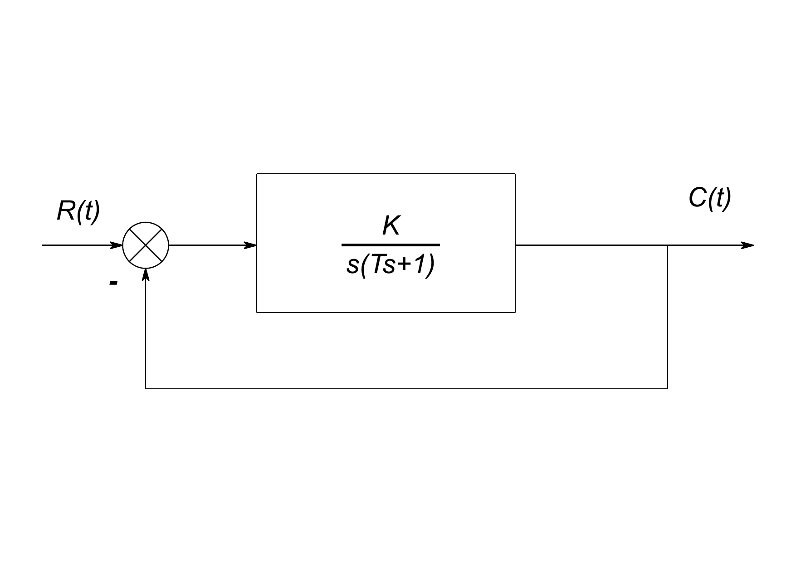

《自动控制原理》课程作业。

\maketitle
\tableofcontents

# 二阶系统理论及相关概念

## 二阶系统及其传递函数

如`\autoref{fig:secondordersys}`{=latex}所示为典型二阶系统的结构图。

<figure id="fig:secondordersys">

<figcaption>二阶系统结构图</figcaption>
</figure>

系统的输入为$r(t)$，输出为$c(t)$。相应拉氏变换设为$R(s),C(s)$。由图易知系统传递函数为 $$\label{eq:1}
G(s)=\frac{K}{Ts^2+s+K}$$ 其中$K$称为**开环放大系数**或开环增益，$T$称为**时间常数**。传递函数也可改写为 $$\label{eq:2}
G(s)=\frac{\omega_n^2}{s^2+2\zeta \omega_ns+\omega_n^2}$$ 其中$\omega_n$称为**无阻尼自然振荡角频率**，$\zeta$称为**阻尼系数**。它们与$K$，$T$的 换算关系如下 $$\label{eq:3}
\omega_n=\sqrt{\frac{K}{T}} \qquad \zeta = \frac{1}{2 \sqrt{TK}}$$ 由系统的特征方程及求根公式可得两极点 $$\label{eq:4}
s^2+2\zeta \omega_ns+\omega_n^2=0 \quad \Rightarrow \quad p=-\zeta\omega_n\pm\omega_n \sqrt{1-\zeta^2}i$$ 其中可设$\omega_d=\omega_n \sqrt{1-\zeta^2}$为**阻尼振荡角频率**

## 单位阶跃响应及动态性能指标

在单位阶跃输入，即$R(s)=1/s$下，可得到输出响应为 $$\label{eq:5}
C(s)=G(s)R(s)=\frac{\omega_n^2}{s^2+2\zeta \omega_ns+\omega_n^2} \frac{1}{s}$$

(i) 当系统处于$\zeta\geq 1$的**过阻尼状态**或**临界阻尼状态**时， 响应单调上升，无振荡，无超调量，无稳态误差，因此可分析的要素不多；

(ii) 当系统处于$\zeta =0$的**无阻尼状态**时，响应为均匀的等幅振荡，无法达到稳态；

(iii) 当系统处于$\zeta<0$时，系统不稳定，无法分析。

因此主要针对$0<\zeta<1$的情况分析动态性能指标。

在此条件下，输出响应经过拉氏逆变换后得到时域上的响应为 $$\label{eq:6}
c(t)=1-\frac{\exp{-\zeta w_nt}}{\sqrt{1-\zeta^2}}\sin(\omega_dt+\theta) \qquad t\geq 0$$ 其中$\theta$称为**阻尼角**，满足$\sin \theta =\sqrt{1-\zeta^2} \qquad \cos\theta=\zeta$

上升时间$t_r$

:   响应曲线第一次到达稳态值所需的时间，令$c(t_r)=1$解得 $$t_r=(\pi-\theta)/\omega_d$$

峰值时间$t_p$

:   响应曲线到达第一个峰值所需时间，令$c'(t_p)=0$解得 $$t_p=\pi/\omega_d$$

超调量$\sigma_p$

:   峰值与稳态值之比， $$\sigma_p=\frac{c(t_p)-c(\infty)}{c(\infty)}=\exp{-\frac{\pi\zeta}{\sqrt{1-\zeta^2}}}=\exp{-\frac{\pi}{\tan \theta}}$$

调节时间$t_s$

:   响应曲线到达并停留在稳态值的$\pm 5\%$误差范围内所需的最小时间。可利用数值解法计算 $$\label{eq:8}
    \abs{1-c(t_s)}=\frac{\exp{-\zeta \omega_n t_s}}{\sqrt{1-\zeta^2}}\abs{\sin (\omega_dt_s+\theta)}=0.05$$ 的最后一个解，或近似计算得$t_s=-\ln(0.05)/(\zeta\omega_n)$

振荡次数$N$

:   调节时间内波动的次数。一个周期为$2\pi/\omega_d$，故周期数为 $$N=\omega_dt_s/(2\pi)$$

## 二阶系统的MATLAB实现

相应的程序见"secondordersys.m"。

由 `\autoref{eq:1}`{=latex}和 `\autoref{eq:2}`{=latex}可知，一组$T,K$或一组$\omega_n,\zeta$都能唯一确定二阶系统，因此为适合不同的需求， 设置了开关变量"useTK"。当其值为$1$时，表示采用给定的$T,K$值确定二阶系统，同时根据 `\autoref{eq:3}`{=latex}计算出$\omega_n$和$\zeta$。当其值为$0$时则相反。

利用"tf"函数建立二阶系统"sys"，再利用"step"函数求出系统在单位阶跃输入下的响应，时间范围自动给定，得到表示时间取值点的向量"t"和表示对应时间响应的向量"c_t"。 由于不确定MATLAB内部算法得到的"t"与"c_t"是否正是理论计算出的函数 `\autoref{eq:6}`{=latex}，因此需根据各性能指标的意义，基于模拟出的值**重新定义计算方式**。

利用"stepinfo"函数，手动设置上升时间判定阈值"RiseTimeThershold"为向量$[0\; 1]$，调节时间判定阈值"SettlingTimeThreshold"为$0.05$。 可直接从结果中读取得到上升时间"RiseTime"，峰值时间"PeakTime"，峰值"Peak"，调节时间"SettlingTime"，超调量"Overshoot"（以百分数为单位）。

当$0<\xi<1$时，由峰值和超调量可算出程序默认稳态为$1$，于是以上各量和之前定义的意义一致。在$\xi\geq 1$时，程序记超调量为零，取一接近$1$的值及其时间作为峰值和峰值时间，无上升时间。调节时间则意义一致。 在$\xi\leq 0$时，上面的方法无法用于分析动态性能指标。

在$0<\xi<1$时发现系统会产生振荡，并且发现极大、极小值点对应的时间间隔相等。因此用以下方式计算振荡次数[^1]。 $$\label{eq:9}
\text{振荡次数}= \frac{ \text{调节时间} - \text{峰值时间}}{2\times (\text{第一次取到极小值时间}- \text{峰值时间})} + 0.5$$

最后进行作图。

# 具体案例

## 欠阻尼案例一

取$\omega_n = 1,\;\zeta = 0.25$构建二阶系统，此时$K=2$，响应曲线如 `\autoref{fig:data1}`{=latex}所示。

<figure id="fig:data1">

<figcaption>二阶系统输出响应<em>ω</em><em>n</em> = 1, <em>ζ</em> = 0.25</figcaption>
</figure>

动态性能指标为 $$\label{eq:7}
t_r = 1.88\;\mathrm{s} \qquad t_p=3.32\;\mathrm{s} \qquad t_s=10.79\;\mathrm{s} \qquad \sigma_p=44.32\% \qquad N=1.69$$

## 欠阻尼案例二：增大自振频率

将$\omega_n$增大$4$倍，$\zeta$不变，即取$\omega_n = 4,\;\zeta = 0.25$构建，此时$K=8$，响应曲线如 `\autoref{fig:data2}`{=latex}所示。

<figure id="fig:data2">

<figcaption>二阶系统输出响应<em>ω</em><em>n</em> = 4, <em>ζ</em> = 0.25</figcaption>
</figure>

动态性能指标为 $$\label{eq:10}
t_r = 0.47\;\mathrm{s} \qquad t_p=0.83\;\mathrm{s} \qquad t_s=2.69\;\mathrm{s} \qquad \sigma_p=44.32\% \qquad N=1.69$$ 可以看出图线形状没有明显差别，超调量和振荡次数也没有变化，只有时间尺度缩小为$1/4$，说明系统的响应性能提高了。

## 欠阻尼案例三：增大阻尼比

$\omega_n$不变，将$\zeta$增大$2$倍，即取$\omega_n = 1,\;\zeta = 0.5$构建，此时$K=1$，响应曲线如 `\autoref{fig:data3}`{=latex}所示。

<figure id="fig:data3">

<figcaption>二阶系统输出响应<em>ω</em><em>n</em> = 1, <em>ζ</em> = 0.5</figcaption>
</figure>

动态性能指标为 $$\label{eq:10}
t_r = 2.42\;\mathrm{s} \qquad t_p=3.59\;\mathrm{s} \qquad t_s=5.28\;\mathrm{s} \qquad \sigma_p=16.29\% \qquad N=0.73$$ 和第一种情况 `\autoref{fig:data1}`{=latex}相比，上升时间和峰值时间均后移，但是调节时间、超调量和振荡次数都显著减小，和阻尼增大的表现一致。

## 无阻尼的临界稳定情况

由 `\autoref{eq:4}`{=latex}可知两极点的实部为$-\zeta\omega_n$。由于$\omega_n,\zeta$同时变号对传递函数无影响，因此假设$\omega_n$符号总为正。若极点落在右半平面，即$\zeta<0$，则系统不稳定。相对应的临界稳定情况为$\zeta=0$。

仍然取$\omega_n=1$，构建二阶系统，参照第一种情况取时间为$20\;\mathrm{s}$进行模拟[^2]，响应曲线如 `\autoref{fig:data4}`{=latex}所示。此时$T,K$均趋向无穷。

<figure id="fig:data4">

<figcaption>二阶系统输出响应<em>ω</em><em>n</em> = 1, <em>ζ</em> = 0</figcaption>
</figure>

此时系统振荡不止，无法分析其性能指标，但大致可以看出其振荡周期为$2\pi \mathrm{s}$，在$13\mathrm{s}$内振动周期数约为$2$，较 第一种情况$N=1.69$多，也说明了阻尼对振荡有抑制作用。

## 不稳定情况

不稳定情况对应$\zeta <0$，取$\omega_n=1,\;\zeta=-0.5$，构建二阶系统。此时$\sqrt{TK}=-1$。取模拟时间$t=19\;\mathrm{s}$，响应曲线如 `\autoref{fig:data5}`{=latex}所示。

<figure id="fig:data5">

<figcaption>二阶系统输出响应<em>ω</em><em>n</em> = 1, <em>ζ</em> = −0.5</figcaption>
</figure>

可见此时系统仍有振荡，但是振幅抖动极为剧烈，逐渐趋向无穷，不会达到稳定状态[^3]。

# 小结

通过几个案例的仿真，得到关于二阶系统在单位阶跃输入下的以下结论：

1.  在欠阻尼情况下，系统总能达到稳态。在无阻尼、负阻尼情况下，系统无法达到稳态；其中无阻尼情况下系统保持等幅振荡，负阻尼情况下系统响应趋向无穷；

2.  在欠阻尼情况下，增大阻尼比会使得响应速度降低，但是系统振荡的振幅、频率均得到了抑制；

3.  在欠阻尼情况下，增大自振频率不影响系统响应规律，只使得特征时间变短，相当于加快了系统的响应速度。

# 参考文献和致谢

1.  徐老师的课件。

2.  MATLAB "Control System Toolbox Documentation" 等相关内容。

3.  卢子璇同学的作业及程序[^4]。

[^1]: 原先计划用极大极小值点数计算振荡次数，但是这样无法反映到达调节时间时的相位。 下面这样定义把从零到峰值时间作为半个周期，和之前的定义不太一样，但是更符合响应曲线的规律，并且更具有实际意义。

[^2]: 此时程序无法自动决定模拟时间。

[^3]: 通过其表达式为具有正指数的指数函数和正弦函数的乘积可明确这一性质。

[^4]: 思路貌似完全不一样。
