在空间中考察太阳与地球，根据定义，通过简单的数学方法得出计算昼长和太阳方位的公式，从而计算出给定地点时间的昼长及太阳方位等要素，进而导出一些常见结论。

# 摘要 {#摘要 .unnumbered}

在空间中考察太阳与地球，结合数学方法得出计算昼长和太阳方位的公式。通过该公式，可以在已知纬度等要素，忽略难以计算要素的情况下得出当地的昼长及太阳方位，进而定量计算出日出、日落时间等。结果可用作拓展教学资料，验证题目是否合乎事实。还可应用在其他星球模型。\
**关键词：**自然地理；预测公式；昼长；太阳方位

# 引言

湘教版地理教材对于昼长和高度角的计算绝大多数只有定性的分析，在空间坐标系中通过数学方法可以得到一般计算公式，从而进行定量分析。

之前对昼长的研究也有不少，但是鲜有研究海拔、太阳视半径对昼长影响的文献。另外，开篇的等价转化，把太阳高度角扩大到研究太阳方位，结合太阳高度角，分析视半径对昼长的影响等，是本文的新颖之处。

# 推导过程及应用讨论

## 等效转化

<figure id="fig:dqgzsyt">

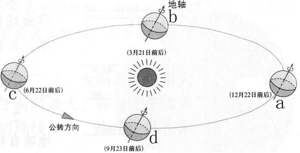 <a href="https://zhidao.baidu.com/question/512356661.html" class="uri">https://zhidao.baidu.com/question/512356661.html</a>

<figcaption>地球公转示意图</figcaption>
</figure>

如 `\autoref{fig:dqgzsyt}`{=latex} 所示，地球赤道面与公转平面有一夹角，即黄赤交角$23°26'$。由于研究的对象在地球上，考虑转化为地球为中心，太阳绕地球转动的模型。

第一步，由物理的相对运动可知当甲绕乙做匀速圆周运动时，可以把甲选作静止不动的参照物，转化为乙绕甲做匀速圆周运动。因此作把地球绕太阳运动近似为匀速圆周运动。这样，就可转化为太阳绕地球作匀速圆周运动。把 `\autoref{fig:dqgzsyt}`{=latex}中地球的图片和太阳的图片换一换，就是转化后的效果（时间也相应发生变化）。

第二步，此时地球地轴还是斜着的。所以旋转空间，使地轴竖直向上。这时太阳"公转"的平面也相应转过一个角度，即黄赤交角$\delta\approx 23°26'$。

最终得到的结果大致如 `\autoref{fig:zhhdydsyt}`{=latex}所示，太阳在倾斜着的平面上绕地球公转。

<figure id="fig:zhhdydsyt">
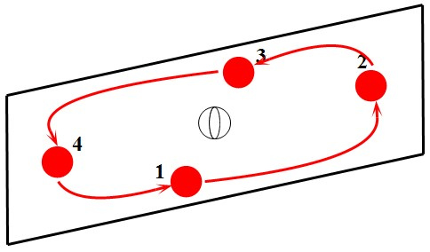
<figcaption>转化后的运动示意图</figcaption>
</figure>

## 推导太阳运动轨道方程

此时作第二个近似，把地球看作正球体。设其球心为$O$，北极在上南极在下。由于现在只研究太阳的运动，故地球可只看作一个点。以旋转前的太阳公转面为$xOy$平面。垂直于这个平面的方向，也就是地轴的方向为$z$轴，正方向取为向上。将原点指向 `\autoref{fig:zhhdydsyt}`{=latex}中处于1号位置太阳的直线和方向作为$x$轴和其正方向，再根据$xOy$平面和右手系建立$y$轴。

其中太阳的1、3号位置在$x$轴上，2号位置在$xOy$平面上方，相应地4号位置在$xOy$平面下方。但2、4号位置的$x$坐标均为0。

虽然太阳的运动轨道是个圆，但因为这个圆相对于坐标轴是倾斜的，所以难以直接得出方程。我们可以由平面中圆的方程$x^2+y^2=R^2$结合坐标旋转得出该圆在空间中的方程。

首先，在太阳运动轨道平面上建立$X$、$Y$轴，也以$O$作为原点。其中$X$轴与空间中的$x$轴重合，$Y$轴可由$y$轴绕$x$轴转过黄赤交角得到。再取垂直于此平面并满足右手系的方向为$Z$轴。建立完成的坐标系如 `\autoref{fig:jlwcdzbx}`{=latex}所示：

<figure id="fig:jlwcdzbx">
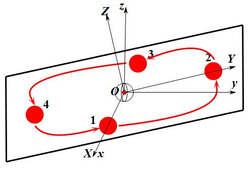
<figcaption>建立完成的坐标系</figcaption>
</figure>

在$XOY$平面中，可以直接写出圆的方程。如果考虑太阳的运动，设$T$为周期，$R$为半径，并取$(R,0)$为计时原点，太阳的坐标可用某时刻$t$表为： $$\label{eq:1}
\begin{cases}
  X(t)=R\cos \frac{360^{\circ}t}{T} \\
  Y(t)=R\sin \frac{360^{\circ}t}{T} \\
\end{cases}$$ 由于$OXYZ$坐标系相当于$Oxyz$坐标系绕$x$轴转过黄赤交角$\delta$，作简单的推导可得到 $$\label{eq:2}
\begin{cases}
  X=x \\
  Y=y\cos\delta+z\sin\delta \\
  Z=z\cos\delta-y\sin\delta
\end{cases}$$ 结合 `\autoref{eq:1}`{=latex} `\autoref{eq:2}`{=latex}，可得 $$\label{eq:3}
\begin{cases}
  x(t)=R\cos \frac{360^{\circ}t}{T} \\
  y(t)=R\sin \frac{360^{\circ}t}{T}\cos\delta \\
  z(t)=R\sin \frac{360^{\circ}t}{T}\sin\delta \\
\end{cases}$$ 这就是太阳运动的方程。

## 推导昼长计算公式

计算某一天的昼长时，我们只关心太阳直射点在哪个纬度，而不关心太阳的具体位置。因此这里再作两个近似，即在一天之中太阳直射点位置纬度不变和到达地球的太阳光看作平行光线。这样计算直射点纬度，只需要根据 `\autoref{eq:3}`{=latex}和球面坐标变换中"纬度"的表达式。一般的球面坐标系中"纬度"$\theta'$是某点与原点连线和$z$轴的夹角，因此和地理学上的纬度$\theta$恰好互余。

由球面坐标变换可知： $$\label{eq:4}
\theta'=\arccos \frac{z}{R}$$ 再根据互余关系可得 $$\label{eq:5}
\theta(t)=\arcsin \brack{\sin \brack{\frac{360^{\circ}t}{T}}\sin \delta}$$ 从这里已经可以看出折射点纬度大致的变化规律。同时根据两分两至日直射点纬度，可以知道$t=0$对应春分日，$t=T/4$对应夏至日，$t=T/2$对应秋分日，$t=3T/4$对应冬至日。

之所以会产生昼夜，是因为地球是不透明的球体。太阳光照射地球，会在另一侧产生阴影区。而因为地球自转，地球上某点在一天中经过的轨迹是一个圆。这个圆有一部分在阴影区，一部分在光亮区。（也可能全在阴影区或光亮区，即极昼极夜现象）由于地球匀速转动，在光亮区的部分占整圆的比例乘以$24$小时就是昼长。

所以我们只要找到这个圆上哪两点是这两部分的分界点，再计算对应角度在整圆中占的比值即可。先前已把地球近似为球体，这里将其半径记作$1$个单位，则可知阴影光亮区分界面是一个圆柱面，半径为$1$，轴线为指向地心的太阳光线所在直线。

<figure id="fig:zst">
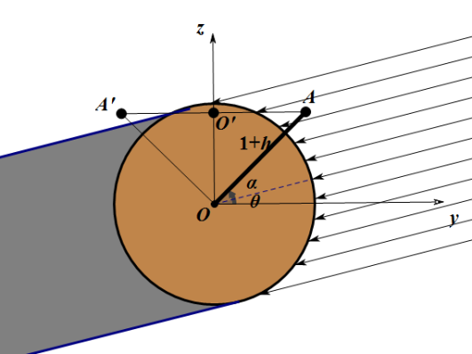

新注：<em>A</em><em>O</em>和<em>A</em>′<em>O</em>应缩短，使得左上角<em>A</em>′点落在阴影区。现在图上的情况接近因为海拔过高产生极昼，见 ，对下面推导有一定影响。

<figcaption>正视图</figcaption>
</figure>

为简化计算和直观，将太阳固定在$yOz$平面内，从$y$轴正方向照射而来。然后从$x$轴正方向看去，可得到如 `\autoref{fig:zst}`{=latex}的正视图。图中灰色部分即为阴影区。而考察点$A$（纬度设为$\alpha$，北纬为正，南纬为负；海拔设为$h$，$h$应为实际海拔与地球半径的比值）在一天中经过的轨迹即是圆$O'$（在图中显示为线段$AA'$）。根据传统球面坐标，可得圆$O'$方程为（由于球面坐标中$\theta$已被占用，这里记作$\gamma$）： $$\label{eq:6}
\begin{cases}
  r=1+h \\
  \gamma=90^{\circ}-\alpha
\end{cases}$$

根据点到直线的距离公式和过地心直线法向量$(0,\cos\theta,\sin\theta)$，得到圆柱面方程，和圆$O'$方程联立得 $$\label{eq:7}
 \cos ^{2} \alpha \cos ^{2} \theta \sin ^{2} \varphi+2 \sin a \cos \theta \cos \alpha \sin \theta \sin \varphi-\sin ^{2} \alpha \cos ^{2} \theta- \cos ^{2} \alpha+\frac{1}{(1+h)^{2}}=0$$

虽然看起来复杂，但是注意到未知量只有$\varphi$一个，而且求出这个$\varphi$的两个解，对应的就是两个分界点，问题就解决了。由二次方程求根公式，并注意到$\theta,\alpha$的余弦均为正值，可得 $$\label{eq:8}
\sin\varphi=\pm \frac{\sqrt{-\frac{1}{(1+h)^2}+1}}{\cos\alpha\cos\theta}-\tan\alpha\tan\theta$$

从$z$轴正方向看圆$O'$可得到如 `\autoref{fig:fst}`{=latex}所示的俯视图，易见太阳光从$y$轴正方向射来。而根据球面坐标的定义，$\varphi$即是与$x$轴的夹角，以逆时针方向为正。

令$\theta=20^{\circ},\alpha=30^{\circ},h=0$，大致考察一下太阳直射北纬$20^{\circ}$时，杭州的情况。由于一个正弦值对应两个角度值，可以得到$\varphi\approx -12^{\circ}$或$-168^{\circ}$，对应点$A,B$。再取此时$h=0.005$，可以得到分别对应点$C,D,E,F$:$\varphi\approx -175^{\circ},-5^{\circ},-161^{\circ},-19^{\circ}$。

<figure id="fig:fst">
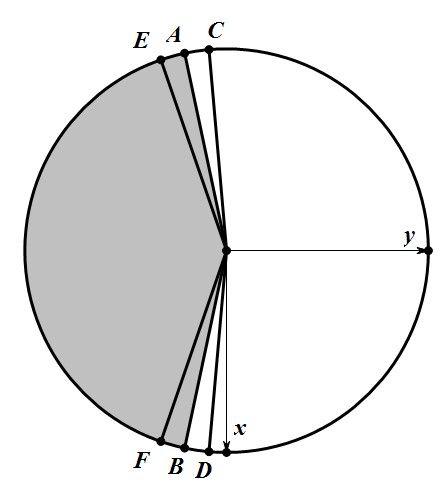
<figcaption>俯视图</figcaption>
</figure>

虽然改变了$h$，不再是同一个圆了，但只是半径发生了变化，而且只需要知道角度占整圈的比例即可，半径无关紧要，所以仍可以将$6$个点画在一个圆中，其中点$A,B$对应的是海拔为0的情况。但是当海拔变高，为什么会产生四个点？

注意到在 `\autoref{fig:zst}`{=latex}中真正的阴影部分圆柱面其实只有 `\autoref{fig:zst}`{=latex}左侧的一半，但是在联立方程的时候并没有方程控制这一点。因此，在同一地点海拔不为$0$时，靠近$y$轴正方向的一点一定在右侧半个应该去掉的圆柱面上，故 `\autoref{eq:8}`{=latex}中正负号应当取负号，即 $$\label{eq:9}
\sin\varphi=- \frac{\sqrt{-\frac{1}{(1+h)^2}+1}}{\cos\alpha\cos\theta}-\tan\alpha\tan\theta$$ 根据白色部分占大圆的比例就是昼长在$24$小时中的比例，得到昼长公式 $$\label{eq:10}
T=12+\frac{2\arcsin \brack{\tan\alpha\tan\theta+\frac{H}{\cos\alpha\cos\theta}}}{15^{\circ}}  \quad \text{（小时）}$$ 其中$\sqrt{1-\frac{1}{(1+h)^2}}$称作海拔因子。

## 对昼长计算公式的讨论和应用

### 对太阳直射点的讨论

在推导昼长公式的时候用到了太阳直射点纬度公式即 `\autoref{eq:5}`{=latex}

如果把一年记作$364$天，即$T=364$，可以得到函数关系式 $$\label{eq:11}
\theta(t)=\arcsin \brack{\sin \frac{360^{\circ}t}{364}\sin\delta}$$ 其中$t$应当理解为距前一个春分日的天数或距下一个春分日的天数的负值。可以作出图像，如 `\autoref{fig:tyzsdwdgysjdtx}`{=latex}所示。

<figure id="fig:tyzsdwdgysjdtx">
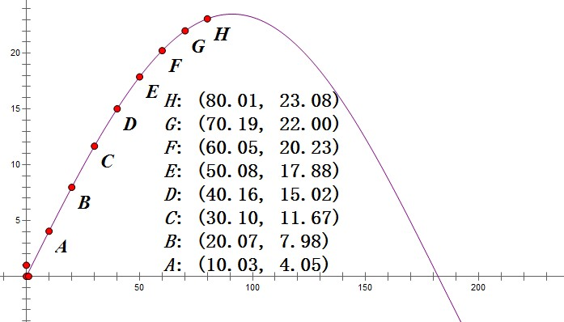
<figcaption>太阳直射点纬度关于时间的图像</figcaption>
</figure>

可以发现每过十天，移动的纬度逐渐减少。而熟知的"每个月移动$8^{\circ}$"的说法也有一定误差，实际情况大约是第一个月移动$11^{\circ}$，第二个月移动$8^{\circ}$，第三个月移动$3^{\circ}$。

### 对海拔的理解

昼长公式中的海拔$h$应该怎么理解呢？$h$的定义是某点海拔与地球半径的比值。而在建立的模型中，这一点的海拔自然应该理解成到球体球面的距离。但是实际情况往往如 `\autoref{fig:sjqk}`{=latex}所示：考察点$A$凌空，在当地看来高度为$h_1$，但实际上海拔为$h_1+h_2$。

<figure id="fig:sjqk">
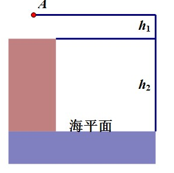
<figcaption>实际情况</figcaption>
</figure>

这个情况下，如果按照$h=h_1+h_2$计算，其实是把地面到海平面的这一段地层当作是透明的。通过实例计算可以发现海拔还是有较大的影响。为了提高准确度，在这个情况下应当把地球半径$r$延长至$r+h_2$。也就是说，$h$应该等于$h_1/(r+h_2)$。

### 海拔可以忽略的情况

如果考察点在地面或者很接近地面，即可认为$H=0$，此时昼长公式退化为 $$\label{eq:12}
T=12+\frac{2\arcsin \brack{\tan\alpha\tan\theta}}{15^{\circ}}  \quad \text{（小时）}$$

接着就可以得到教材中的一系列结论：

(1) 若考察点在赤道上，即$\alpha=0$，则得到$T=12$，即全年昼夜平分。

(2) 若考察春秋分日，即$\theta=0$，则得到$T=12$，全球各地昼夜平分。

(3) 对于北半球某地$\alpha>0$，当$\theta>0$时有$T>12$，也就是说直射点在北半球时昼长大于$12$小时，且直射点纬度越高昼长越长。南半球则可对应得到类似结论。

(4) 对于夏半年某时刻$\theta>0$，当$\alpha>0$时$T>12$，也就是说夏半年北半球昼长大于$12$小时，且纬度越高昼长越长。

(5) 由反三角函数的定义域可以得到特殊情况 $\abs{\tan\alpha\tan\theta}>1$，此时有$\alpha>90^{\circ}-\abs{\theta}$或$\alpha<-90^{\circ}+\abs{\theta}$。例如，当$\theta=20^{\circ}$时，$\alpha>70^{\circ}$或$\alpha<-70^{\circ}$，也就是说在南北纬$70^{\circ}$以外产生了极昼极夜的现象，此时需要单独定义 $$\label{eq:13}
    T=
    \begin{cases}
      24, &\tan\alpha\tan\theta>1 \\
        0, &\tan\alpha\tan\theta<-1
    \end{cases}$$

(6) 由奇偶性可知$T(-\alpha,\theta)$，$T(\alpha,-\theta)$与$T(\alpha,\theta)$关于$12$对称，$T(\alpha,\theta)=T(-\alpha,-\theta)$。例如，如果知道杭州北纬$30°$今天昼长是$10$小时，那么可以知道南纬$30°$的城市A今天昼长是$14$小时。再过半年，A的昼长是$10$小时，而杭州的昼长则为$14$小时。

(7) 取$\alpha,\theta$中一个为参数，以$T$为纵坐标，另一个为横坐标，还可绘出函数图像，如 `\autoref{fig:zcgywddtx}`{=latex}所示（取$\theta=15°$绘出$T-\alpha$图像）。可以从图中很直观地看出变化相同纬度，纬度较高时昼长变化较快：从$75°$减小到$70°$就减少了$5.5$小时的昼长，而从$70°$减小到$30°$只减少了$5$个小时$6$分钟的昼长。

    <figure id="fig:zcgywddtx">
    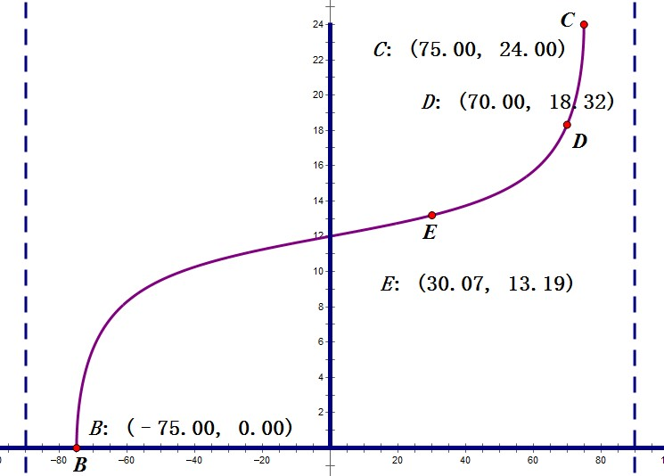
    <figcaption>昼长关于纬度的图像</figcaption>
    </figure>

(8) 结合具体地点的纬度，可以计算出其夏至日的昼长（夏至日比较具有代表性），从而让学生有定量的认识。如 `\autoref{tab:gdxzrzc}`{=latex}所示。

    \centering

    ::: {#tab:gdxzrzc}
       纬度($^{\circ}$)    城市    昼长(小时:分钟)
      ------------------ -------- -----------------
             1.2          新加坡        12:04
             18.6          孟买         13:07
             23.1          广州         13:25
             31.1          上海         14:01
             34.0         洛杉矶        14:16
             38.5         华盛顿        14:41
             39.6          北京         14:48
             41.5          罗马         15:01
             48.5          巴黎         15:55
             51.3          伦敦         16:22
             55.5         莫斯科        17:13

      : 各地夏至日昼长
    :::

    \vspace{1em}

    城市纬度数据来源：<https://zhidao.baidu.com/question/323141478.html>

### 不忽略海拔的情况 {#sec:不忽略海拔情况}

虽然一般情况下海拔比起地球半径来微不足道，但在一定的高度上，其产生的影响还是比较明显的。在春分的时候，一架飞机以$10\mathrm{km}$高度飞过赤道上空，在上面的人看到的昼长会达到$12$小时$25$分钟。

在直射北回归线时，北纬$65°$处地面昼长为$21$小时$10$分钟，而站在$50\mathrm{m}$高的楼顶上昼长则会达到$21$小时$24$分钟，并且在高度$2185\mathrm{m}$以上产生了极昼现象。

在直射南纬$20°$时，北纬$70°$处已经产生极夜，但只要在$10$米高的地方,就会有$48$分钟的昼长。北纬$85°$处也已是极夜，但如果处在$660\mathrm{km}$的高空，却可以看到极昼现象。

总之，海拔对昼长的影响总是正的，而一千米以下的海拔对昼长影响大约在几分钟十几分钟的量度。但纬度、海拔越高，对昼长的影响就越出人意料。更多结论，就靠大家自己研究了。

### 对太阳视半径和大气折射的考虑 {#sec:对太阳视半径和大气折射的考虑}

由于在地球上看去，太阳是个圆面，其半径大约是$0.5°$。可近似认为太阳每分钟转过$0.25°$（在得到了太阳高度角公式之后可以定量计算），由于之前计算的昼长是按太阳圆心出现在地平线上方计算，如果考虑太阳露出一点就算日出，整个落下才算日落，日出日落时间会各往前后推$2$分钟。

如果考虑大气折射，日出日落时间也会各往前后推$2.33$分钟$^1$。

综合考虑，一天的昼长应该再加$8.66$分钟。

## 推导太阳方位计算公式

<figure id="fig:zdqskddqk">
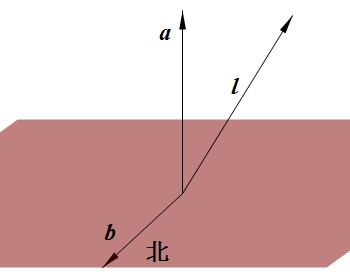
<figcaption>在地球上看到的情况</figcaption>
</figure>

如 `\autoref{fig:zdqskddqk}`{=latex}所示，在地球上某个考察点，我们考虑这四个向量：地球在该点切面的法向量$\bm{a}$,在这个面上的正北方向$\bm{b}$和正东方向$\bm{c}$（图中未画出），太阳光向量$\bm{l}$。

为方便起见，把太阳位置固定在$xOz$平面内并从$x$轴负方向照射而来，并且忽略折射因素，得到$\bm{l}=(-\cos\theta,0,\sin\theta)$。由于同一纬线上太阳高度角当然不同，就要考虑经度。设某地地方时为$t_l$，由于直射处地方时为正午$12$时，可以得到某地球面坐标中$\varphi=t_l\times 15°$。再设其纬度为$\alpha$，得到$\bm{a}=(\cos\alpha\cos\varphi,\cos\alpha\sin\varphi,\sin\alpha)$。

根据向量夹角公式可以得到$\bm{l}$与$\bm{a}$夹角的余角（即太阳高度角）正弦值为 $$\label{eq:14}
\sin\psi=\sin\alpha\sin\theta-\cos\alpha\cos\theta\cos\varphi$$

太阳高度角当然不会超过90°，因此可以求出唯一值 $$\label{eq:15}
\psi=\arcsin(\sin\alpha\sin\theta-\cos\alpha\cos\theta\cos\varphi)$$ 如果考虑太阳视半径，只需在$\psi$的基础上加减$0.5°$就是太阳高度角的范围。

为了得到$\bm{b}$,先得出该点指向北极点的向量$\bm{x}=(-\cos\alpha\cos\varphi,-\cos\alpha\sin\varphi,1-\sin\alpha)$，该向量在切平面内投影方向即为$\bm{b}$的方向。列方程$(\bm{x}-\mu \bm{a})\cdot\bm{a}=0$，得$\mu=\sin\alpha-1$,为了使$\bm{b}$的长度也为$1$，方便计算，将$(\bm{x}-\mu \bm{a})$单位化，得到 $$\label{eq:16}
\bm{b}=(-\cos\varphi\sin\alpha,-\sin\varphi\sin\alpha,\cos\alpha)$$

再求$\bm{l}$在切平面内的投影，列方程$(\bm{l}-\lambda \bm{a})\cdot\bm{a}=0$，解得$\lambda=\sin\theta\sin\alpha-\cos\theta\cos\alpha\cos\varphi$，代入得$\bm{l}$在切平面内的投影$\bm{l}_p=\bm{l}-\lambda \bm{a}$，其长度应是$\cos\psi$。再根据向量夹角公式，得到$\bm{l}_p$跟$\bm{b}$的夹角余弦值为$(\cos\theta\cos\varphi\sin\alpha+\cos\alpha\sin\theta)/\cos\psi$。

注： $$\label{eq:24}
\bm{l}_p\cdot \bm{b}=(\bm{l}-\lambda \bm{a})\cdot \bm{b}=\bm{l}\cdot \bm{b}-\lambda \bm{a}\cdot \bm{b}=\bm{l}\cdot \bm{b}  \quad \since \bm{a}\perp \bm{b}$$

$\bm{c}$作为正东方向，恰好等于$\bm{b}$与$\bm{a}$的矢量积，为$(-\sin\varphi,\cos\varphi,0)$，同理得到$\bm{l}$在切平面内的投影与$\bm{c}$夹角的余弦值为$(\cos\theta\sin\varphi)/\cos\psi$。这样，在切平面内以正东方向建立$x$轴，正北方向建立$y$轴，太阳的位置可表示为 $$\label{eq:17}
\brack{\frac{\cos \theta \sin \varphi}{\cos \psi}, \frac{\cos \theta \cos \varphi \sin \alpha+\cos \alpha \sin \theta}{\cos \psi}}$$ 也就是 $$\label{eq:18}
(\sin\varphi,\cos\varphi\sin\alpha+\cos\alpha\tan\theta)$$

## 对太阳方位计算公式的讨论和应用

在前面的推导中，得出了 `\autoref{eq:15}`{=latex}和 `\autoref{eq:18}`{=latex}两个用于描述太阳位置的结论。其中 `\autoref{eq:15}`{=latex}表示太阳高度角大小， `\autoref{eq:18}`{=latex}表示太阳在地面投影的方位。通过这两个结论，只需要知道某地纬度、地方时，结合直射点纬度便可得出太阳方位。

### 正午时

取$\varphi=180^{\circ}$， `\autoref{eq:15}`{=latex}退化为$\psi_{12}=\arcsin(\cos(\theta-\alpha))=90^{\circ}-\abs{\alpha-\theta}$。这正是教材中的结论：正午太阳高度角等于$90^{\circ}$减当地纬度和直射点纬度之差。 `\autoref{eq:18}`{=latex}退化为$(0,-\sin\alpha+\cos\alpha\tan\theta)$。从横坐标为零可看出此时太阳一定在南北方向上。至于具体是南还是北，要看纵坐标正负性。

若纵坐标大于$0$，即太阳在北方。可以解得$\theta>\alpha$，直射点纬度比当地纬度高，确实符合实际情况。纵坐标小于$0$或等于$0$可以类似分析。

### 日出和日落时

在昼长公式中取$H=0$，进一步可得到日出地方时$T_1=6-\frac{\arcsin(\tan\alpha\tan\theta)}{15^{\circ}}$，此时$\varphi_1=90^{\circ}-\arcsin(\tan\alpha\tan\theta)$，代入 `\autoref{eq:15}`{=latex}得到高度角为零，这是显然的；代入 `\autoref{eq:18}`{=latex}得日出投影点坐标为 $$\label{eq:19}
\left(\cos (\operatorname{arcsin}(\tan \alpha \tan \theta)), \frac{\tan \theta}{\cos \alpha}\right)$$ 其中横坐标必然是正的，而纵坐标只取决于$\theta$正负性。这就得到了一个重要结论：太阳直射北半球时全球日出东北，直射南半球时全球日出东南。类似也可得到日落时的结论。

### 太阳高度角的临界点

虽然太阳在地平面以下时太阳高度角可以看成是负的，但我们仍然希望找到临界点。令$\psi>0$，解得$\tan\alpha\tan\theta>\cos\varphi$。这个临界点可以从另一个角度解读昼长。由这个不等式可以知道$\varphi$的范围，进而求出地方时的范围，就是白昼。而若$\tan\alpha\tan\theta>1$，则不等式恒成立，太阳高度角总大于零，产生极昼现象，与之前得到的结论一样。

### 午夜

午夜并不意味着太阳就在地平面以下，在产生极昼现象的区域，太阳整日不落。

令$\varphi=0^{\circ}$， `\autoref{eq:15}`{=latex}式退化为$\psi_0=\arcsin(-\cos(\alpha+\theta))=\abs{\alpha+\theta}-90^{\circ}$。于是有以下重要结论：

1.  对于北极圈内极昼的情况，有$(\psi_{12}+\psi_0)/2=\theta$，$(\psi_{12}-\psi_0)/2=90^{\circ}-\alpha$

2.  对于南极圈内极昼的情况，有$(\psi_{12}+\psi_0)/2=\theta$，$(\psi_{12}-\psi_0)/2=90^{\circ}+\alpha$。

这也是一个重要考点。

### 在地面的"投影"

虽然 `\autoref{eq:18}`{=latex}表示只表示太阳在地面投影的方向，但是如果在这个方向上固定一个单位长度取点，可以看到这个点的轨迹应当是个椭圆。其中心为$(0,\cos\alpha\tan\theta)$,半长轴为$1$，离心率为$\cos\alpha$， 焦点为$(\pm\cos\alpha,\cos\alpha\tan\theta)$。这个椭圆能够反映一天中太阳方位的变化。例如

<figure>
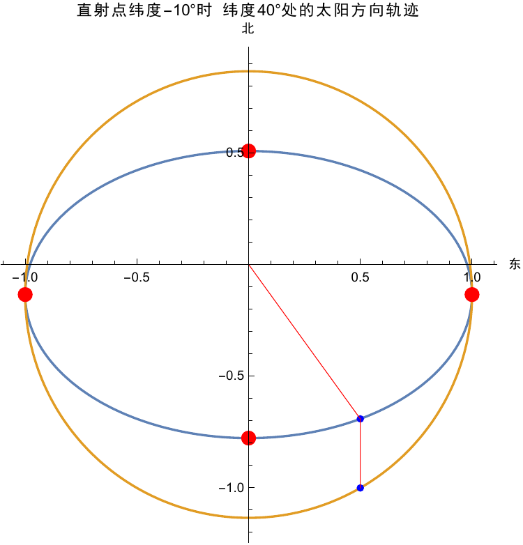
<figcaption>深秋北京太阳方位变化</figcaption>
</figure>

此图应如此理解：蓝色椭圆为所求的椭圆，四个红点分别表示午夜、日出、正午、日落四个时刻太阳的位置，而橙色圆为相切的正圆。橙色圆上蓝点沿着圆顺时针匀速运行，作垂线交椭圆于近的一蓝点，此蓝点与原点连的红线即为太阳的方位。

再来看赤道和极点的情况，由离心率分别为$1$和$0$可以看出情况十分不同。

<figure>
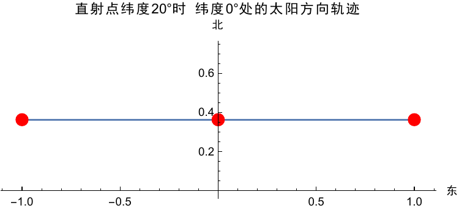
<figcaption>赤道地区太阳方位变化</figcaption>
</figure>

<figure>
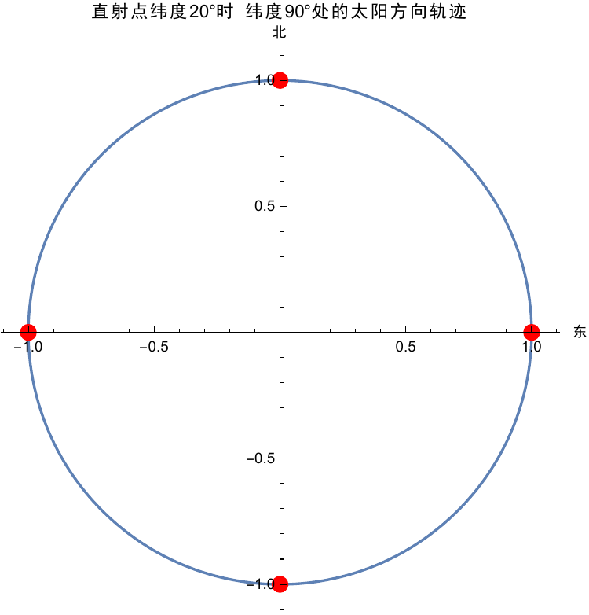
<figcaption>极地地区太阳方位变化</figcaption>
</figure>

可以看到，在赤道地区太阳投影方向只在一个比较小的范围内变动，而在极点上太阳投影方向匀速旋转一周。

### 周日视运动

有了 `\autoref{eq:15}`{=latex} `\autoref{eq:18}`{=latex}式，可以只用两个角度描述太阳的位置。由此，可以画出一天中太阳经过的路线，也就是教学中经常提到的"太阳周日视运动"。例如在北纬$30^{\circ}$处，二分二至日的周日视运动如 `\autoref{fig:bw30defezrzrsyd}`{=latex}所示：

<figure id="fig:bw30defezrzrsyd">
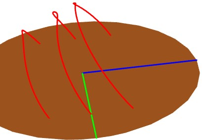
<figcaption>北纬30°二分二至日周日视运动</figcaption>
</figure>

其中蓝、绿色线分别指示北方、东方。可以看到实际运动轨迹和圆还是有些差别的。

### 进一步研究太阳视半径对昼长影响 {#sec:进一步研究太阳视半径对昼长影响}

之前在计算太阳视半径对昼长影响时，把太阳运动速度看成是匀速的。这里可以定量计算。只需要在 `\autoref{eq:15}`{=latex}中令$\psi=0^{\circ}$和$-0.5°$，算出对应的时间差即可。

从定性角度上，可以得到当地纬度和直射点纬度绝对值越大，时间差越大。

定量角度，可以计算得到直射赤道时，南北纬$50°$之间的时间差在$2$分钟至$3$分钟，南北纬$73°$左右时间差为$7$分钟，纬度继续升高时时间差迅速增大，$86°$时时间差有$30$分钟，也就是说因为太阳的视半径一天昼长增加了一小时。

在不直射赤道时，最小的时间差，也就是赤道上的时间差在$2$分钟到$2.18$分钟变化。在极夜产生边界上时间差大约在$30-50$分钟（$0.1°$的差距也会产生很大影响）。

由此，若考虑太阳视半径对昼长的影响，只需根据太阳高度角公式算出对应时间差，加到之前计算得到的昼长公式即可。

# 梳理总结

通过数学方法我们得到了计算昼长及太阳方位的几个公式，通过这些公式，我们能在知道时间、纬度等易知数据的情况下直接计算出昼长、太阳方位，对地理教学和气象预测具有重大意义。

这里将这些公式和忽略因素一并罗列如下：

## 忽略的因素

太阳方面，到达地面的太阳光看作平行。

地球方面，一是把地球绕日运动看作是圆周运动，并且在一天中忽略太阳的运动；二是把地球近似成正球体，表面无凹凸，完全不透明，只会阻挡光线而不会反射，没有天气现象；三是在计算太阳方位时没有很具体地分析大气层的折射因素造成的影响。

## 计算太阳直射点纬度

$$\label{eq:20}
\theta(t)=\arcsin\sin \left(\frac{360^{\circ} t}{T}\right) \sin \delta$$ 其中$t/T$为距春分的时间占一年总时间的比例，若把一年近似为$365$天，$t$则为距上一个春分日的日数（或距下一个春分日的日数的负值）。$\delta$为黄赤交角，一般取作$23.5°$。得到的$\theta$北纬为正，南纬为负。

## 计算昼长

$$\label{eq:21}
T=12+\frac{2\arcsin \brack{\tan\alpha\tan\theta+\frac{H}{\cos\alpha\cos\theta}}}{15^{\circ}}  \quad \text{（小时）}$$ 其中$H=\sqrt{1-\frac{1}{(1+h)^2}}$，$h$为观察点距离地面高度，与地面到地心距离的比值。若忽略海拔则$H=0$。$\alpha$为某地纬度，北纬为正，南纬为负。$\theta$为直射点纬度。如果考虑大气折射和太阳视半径，请参考 `\autoref{sec:对太阳视半径和大气折射的考虑}`{=latex}和 `\autoref{sec:进一步研究太阳视半径对昼长影响}`{=latex}

## 计算太阳高度角

$$\label{eq:22}
\psi=\arcsin(\sin\alpha\sin\theta-\cos\alpha\cos\theta\cos\varphi)$$ 其中$\varphi=15^{\circ}$乘此刻当地地方时（小时），若$\psi<0$则说明太阳在地平线以下。$\alpha$和$\theta$的意义同前节。

## 计算太阳方位

取正东为$x$轴正方向，正北为$y$轴正方向，太阳在当地地面上的投影位置（方向）可表为 $$\label{eq:23}
(\sin\varphi,\cos\varphi\sin\alpha+\cos\alpha\tan\theta)$$ 其中各符号的含义同前节。

## 推广应用

宇宙中绕行星运动的卫星，绕恒星运动的行星，均可用这一模型表示。只需调整几个参数，这些公式同样适用于别的星球。

其中意义较大的一是月-地模型，可以得出在月球上能看到地球的时间（"昼长"）和地球方位。二是火-日模型，近年来对火星的探索热情高涨。易知昼长对温度的影响较大。火星探测器若难以经受长时间高温低温，需要降落地点有合适的温度，因此昼长这一因素可以借由得到的公式加以考虑。

# 参考文献 {#参考文献 .unnumbered}

\[1\]石凤良，祝玉华. 大气折射与日出提前的时间长短\[J\]. 物理教师, 2008, 29(7):57-57.

\[2\]朱翔，刘新民，普通高中课程标准实验教科书地理必修I\[M\].第3版.长沙: 湖南教育出版社,2008

\[3\]张宏兵. 坐标系旋转变换公式图解\[EB/OL\].\[2017-1\].<http://blog.sina.com.cn/s/blog_3fd642cf0101cc8w.html>

\[4\]蒋洪力. 光的传播与地球昼长\[J\]. 物理教师, 2004, 25(2):49-51.
