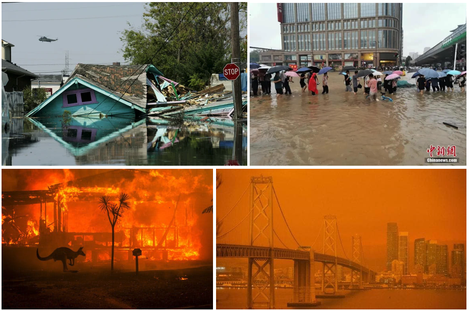
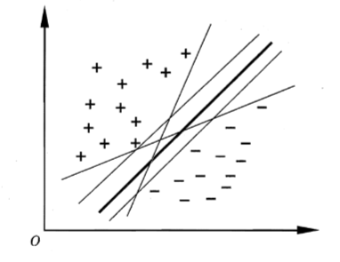
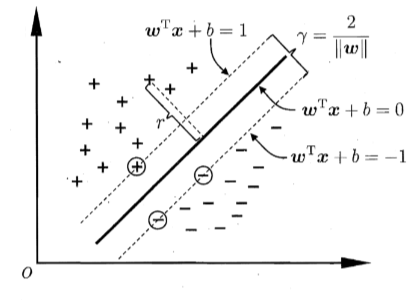
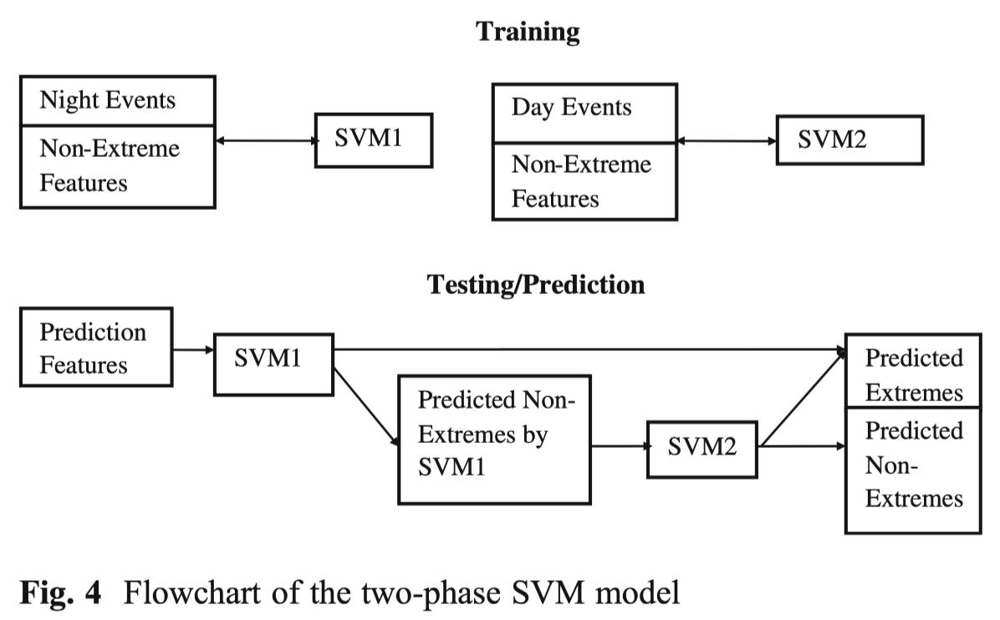
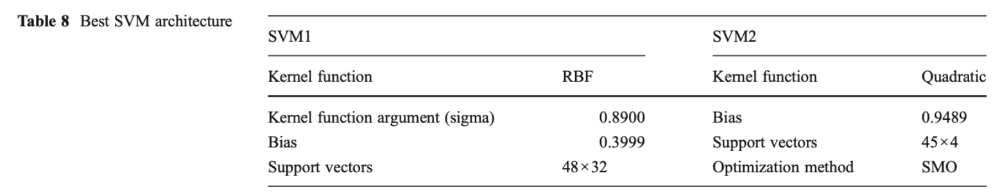
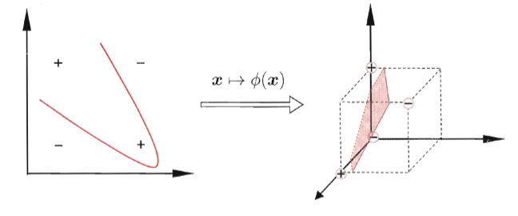
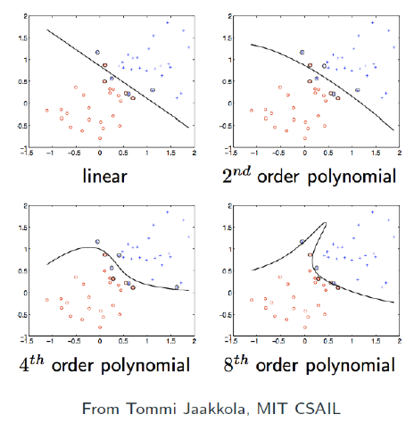
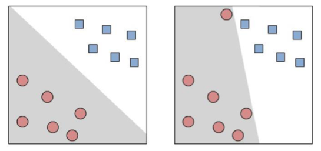
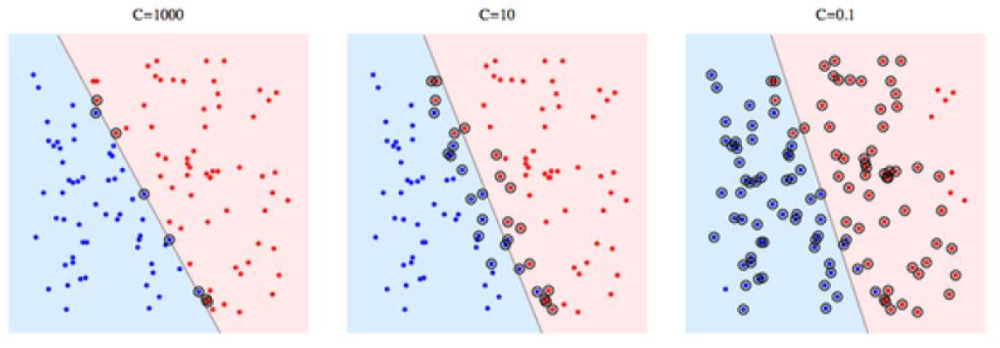
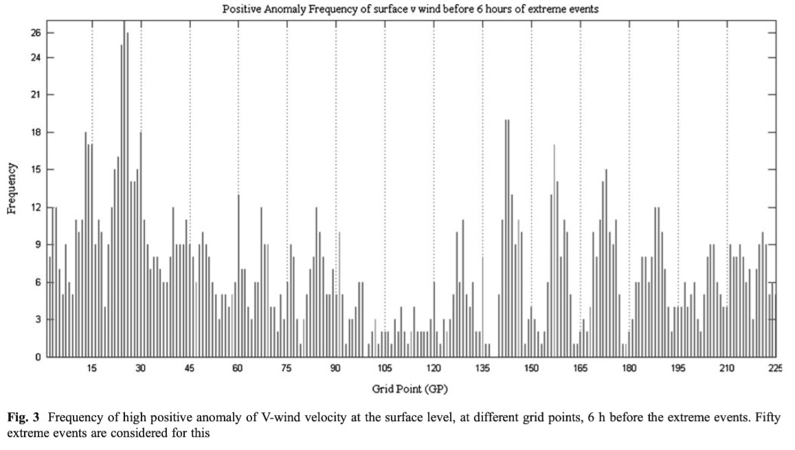

《气候统计方法》课程作业。

\begin{frame}[plain]\maketitle
\end{frame}
\begin{frame}[t]\frametitle{Contents}
  \tableofcontents
\end{frame}

# Introduction {#sec:1}

## Extreme weather prediction and Analog methods

\begin{frame}[t]\frametitle{Extreme weather}
  \begin{itemize}
  \item Extreme weather is \alert{disastrous} and tends to occur \alert{more frequently}.
  \item Heat Waves, Drought, Heavy Downpours, Floods, Hurricanes, ...
  \item By making \alert{better prediction}, we can reduce its loss effectively.
\end{itemize}
  \begin{figure}
    
    \caption{Extreme weathers}
  \end{figure}
\end{frame}
\begin{frame}[t]\frametitle{Method for predicting extreme weather}
  \begin{itemize}
  \item There are many ways to predict extreme weather.
\end{itemize}
  \begin{exampleblock}{Numerical weather prediction (NWP)}
    \begin{itemize}
    \item NWP rely on basic \alert{physical laws} and current \alert{weather state}.
    \item Generally, NWP works fine; But it fails to predict certain \alert{extreme weather} well, e.g. heavy rainfall.
    \item This may results from \alert{complicated processes} and \alert{multiscale} property.
    \end{itemize}
  \end{exampleblock}
  \pause
  \begin{block}{Analog method}
    \begin{itemize}
    \item Analog method is a \alert{statistical} and \alert{probabilistic} model.
    \item Based on \alert{similarity of atmospheric conditions} on extreme days.
    \end{itemize}
  \end{block}
  \pause
  \begin{center}
  \Large The key point is how to define "Similarity"?
\end{center}
\end{frame}
\begin{frame}[t]\frametitle{To be more specific...}
  \begin{itemize}
  \item Assume we have the following knowledge\footnote{Fake examples, just for explanation.}.
    \small\begin{table}
    \begin{tabular}{ccc}\toprule
      Date   & Temperature at noon ($^{\circ}$C)& Weather in the afternoon  \\ \midrule
      2021/8/16 & 33    & Heavy rain \\
      2021/8/17 & 35    & Heavy rain   \\
      2021/8/18 & 28     & Sunny     \\
      2021/8/19 & 31     & Heavy rain    \\
      2021/8/20 & 26     & Sunny \\ \bottomrule
    \end{tabular}
    \caption{Example data}
  \end{table}
  \pause
\normalsize
\item We may conclude that an $\geq30\ ^{\circ}$C Temp. at noon leads to heavy rain in the afternoon. And we can use this \alert{criterion} to predict heavy rainfall in the afternoon.
\item Now we have \alert{large amount} of atmospheric data before extreme weather, how can we develop a \alert{criterion} for prediction?
    \end{itemize}
  \end{frame}

# Support Vector Machine {#sec:2}

## Definition, Computation, Extension and Application

\begin{frame}[t]\frametitle{What is SVM?}
  \begin{itemize}
  \item Support Vector Machine(SVM), is a \alert{binary classifier}.
  \item We have labelled data $D=\left\{ (\bm{x}_{1},y_1),\dots,(\bm{x}_n,y_n) \right\},y_i=\pm 1$.
    \begin{itemize}
    \item Vector $\bm{x}_{i}$ represents \alert{atmospheric conditions}(Temp., Wind, etc.).
    \item $y_i=+1,-1$ stands for \alert{extreme} weather and \alert{non-extreme} weather respectively.
    \end{itemize}
  \item We seek for a hyperplane for \alert{separation} by the sign of $y_i$.
\end{itemize}
    \begin{figure}
    
%    \caption{Which hyperplane to choose?}
  \end{figure}
  \begin{itemize}
  \item For \alert{generalization} purpose, the ``center'' one is the best.
\end{itemize}
\end{frame}
\begin{frame}[t]\frametitle{How to compute?}
    We define \alert{Canonical Separating Hyperplane} $\mathcal{H}$, that
    \begin{equation}
\mathcal{H}: \bm{w}^{\mathrm{T}}\bm{x}+b=0
\end{equation}
For $\bm{x}_1$ and $\bm{x}_2$ which are two \alert{closet} points from each side, they satisfy
\begin{equation}
\bm{w}^{\mathrm{T}}\bm{x}_1+b=1, \qquad \bm{w}^{\mathrm{T}}\bm{x}_2+b=-1
\end{equation}
And the \alert{margin width} $\gamma$ can be computed as
 \begin{equation}
   \gamma= \frac{\bm{w}^{\mathrm{T}}}{\Vert \bm{w}\Vert}(\bm{x}_1-\bm{x}_2)=\frac{2}{\Vert \bm{w}\Vert}
\end{equation}
    \begin{figure}
    
%  \caption{Canonical Optimal Separating Hyperplane}
  \end{figure}
\end{frame}
\begin{frame}[t]\frametitle{How to compute? The optimization problem.}
    \begin{itemize}
    \item Now, as we want to \alert{maximize} margin and the margin directly depends on $\Vert \bm{w}\Vert$, we reach the
      following optimization problem.
    \begin{block}{Optimization problem for solving SVM}
      \begin{equation}
        \begin{aligned}
          &\operatorname{min} \frac{1}{2}\Vert \bm{w}\Vert^2\\
          &s.t.\quad y_i (\bm{w}^{\mathrm{T}}\bm{x}_i+b)\geq 1
        \end{aligned}
      \end{equation}
    \end{block}
  \item There are many developed \alert{optimization methods} to solve it.
  \end{itemize}
  \pause
  \begin{figure}
           \begin{minipage}{0.57\linewidth}
             \begin{exampleblock}{What is support vector?}
             \begin{itemize}
             \item It is obvious that, only closet points\\(e.g. $\bm{x}_1,\bm{x}_2$) will affect the result.
             \item They are called \alert{Support Vectors},\\
               and that is where \alert{Support Vector Machine} comes from.
\end{itemize}
\end{exampleblock}
  \end{minipage}\hfill
       \begin{minipage}{0.35\linewidth}
    
%  \caption{Canonical Optimal Separating Hyperplane}
  \end{minipage}
  \end{figure}
  \end{frame}
\begin{frame}[t]\frametitle{Application and Discussion}
    \begin{itemize}
    \item Face recognition, text classification, OCR, bioinformatics, ...
    \item Based on analog methods and SVM, Nayak(\citeyear{nayak13}) developed a \alert{classifier} which predicts \alert{extreme rainfall} in Mumbai 6-48 h ahead, according to corresponding atmosphere conditions.
    \item They collected extreme rainfall data of Mumbai from 1969 to 2008.
      \begin{itemize}
      \item The \alert{training set} contains data from 1969 to 1999.
      \item The \alert{validation set} contains data from 2000 to 2008.
      \end{itemize}
    \end{itemize}
    \pause
            \begin{minipage}{0.48\linewidth}
              \begin{itemize}
              \item For better performance, \alert{day} events and \alert{night} events are separately trained.
              \item Both SVM1 and SVM2 are used for prediction.
      \end{itemize}
            \end{minipage}
            \hfill
      \begin{minipage}{0.48\linewidth}
        
      \end{minipage}
    \end{frame}
\begin{frame}[t]\frametitle{Application and Discussion}
      \begin{itemize}
      \item Result:
        \begin{itemize}
        \item Besides \alert{16 correct} extreme predictions, there are \alert{133 false alarms}. 0 miss.
        \item Much better than previous fingerprinting method (\alert{900+ false alarms}).
        \end{itemize}
      \item Limitations:
        \begin{itemize}
        \item Region choice: small $\rightarrow$ \alert{exclude} important factors; large $\rightarrow$ \alert{less weight}.
        \item Lack of data: only 40 yrs and extremes are \alert{rare}.
        \item Detailed data: \alert{high-resolution} weather pattern, \alert{Doppler radar data}.
        \end{itemize}
      \end{itemize}
                        \begin{figure}
      
    \end{figure}
      \end{frame}
\begin{frame}[t]\frametitle{Application and Discussion}
        \begin{itemize}
            \item An advantage of SVM is that we know \alert{how predictor works}.
        \begin{itemize}
        \item E.g. if we find $\bm{w}=(w^{(1)},\dots,w^{(m)},\dots,w^{(n)})$ have $w^{(m)}\approx 0$, then
          it indicates the corresponding variable $x_i^{(m)}$ may not be important. (Why?)
        \item The article does not provide it though, which may results from \alert{kernel function} and other difficulties.
        \end{itemize}\vfill \pause
      \item SVM disadvantages:
        \begin{itemize}
        \item Cost \alert{great computational effort} for large amount of training data.
        \item The selection of kernel function, parameters, etc. is \alert{subjective}.
        \end{itemize}\vfill \pause
      \item Open questions:
        \begin{itemize}
        \item Is it reliable in the future? How can we take \alert{climate change} into account?
        \item Should \alert{other factors} be included, like forest area, pollution level, etc.?
        \item Can we turn binary classification into \alert{continous} one, which provides rainfall \alert{probability} and \alert{strength} information?
        \item How to adapt the method for \alert{other extreme weather} prediction?
        \end{itemize}
              \end{itemize}
    \end{frame}

# Summary

\begin{frame}[t]\frametitle{Take Home Message}
      \large
      \begin{itemize}
      \item Support Vector Machine(SVM) is a \alert{binary classifier} and is trained by solving an \alert{optimization} problem.
        \vfill
%   \item SVM is trained by solving an \alert{optimization} problem. \alert{Kernel functions} and \alert{Soft margin} are introduced for nonlinearity and outliers respectively. \vfill
    \item Analog method predicts extreme weather by recognizing \alert{similar weather pattern} ahead.\vfill
  \item After training with historical data, SVM is able to predict extreme weather.\
      \end{itemize}
      \normalsize
    \end{frame}
\begin{frame}[t]\frametitle{Tools for SVM}
    \begin{itemize}
    \item LIBSVM\\
      \url{http://www.csie.ntu.edu.tw/~cjlin/libsvm/}
      \vfill
    \item LIBLINEAR\\
      \url{http://www.csie.ntu.edu.tw/~cjlin/liblinear/}
      \vfill
    \item SVM-light, SVM-perf, SVM-struct\\
      \url{http://svmlight.joachims.org/svm_struct.html}
      \vfill
    \item Pegasos\\
      \url{http://www.cs.huji.ac.il/~shais/code/index.html}
      \vfill
    \end{itemize}
  \end{frame}

`\label{sec:summary}`{=latex}

\begin{frame}[noframenumbering, allowframebreaks, t]\frametitle{Reference}
  \nocite{*}% 打印未引用，但已列入 .bib 文件内的文献
  \printbibliography%
  \vspace{1em}
  Many thanks to lecture slides from Prof. Lan Yanyan (2019).
\end{frame}
\begin{frame}[plain]\vfill
  \centerline{\Huge THANKS!}
  \vfill
\end{frame}
\begin{frame}[t]\frametitle{Pratical problems and Extensions: Kernel Function}
    \begin{itemize}
    \item What if... the data is not \alert{linearly separable}?
          \begin{figure}
      
    \end{figure}
  \end{itemize}
  \pause
    \begin{itemize}
    \item We can introduce a \alert{function}, which maps data into the \alert{feature space}, where they are separable.
    \end{itemize}
    In practice, we only need to deal with $\phi(\bm{x}_i)^{\mathrm{T}}\phi(\bm{x}_j)$, and we simply define
    \begin{equation}
K(\bm{x}_i,\bm{x}_j)=\phi(\bm{x}_i)^{\mathrm{T}}\phi(\bm{x}_j)
\end{equation}
Where $K$ is called \alert{Kernel Function}.
\end{frame}
\begin{frame}[t]\frametitle{Pratical problems and Extensions: Kernel Function}
    \begin{center}
   \Large The choice of $K$ requires experience and attempts. \normalsize
  \end{center}
    \begin{minipage}{0.48\linewidth}
\begin{table}
    \begin{tabular}{cc}\toprule
      Type  &Formula \\ \midrule
    Linear  &$\bm{x}_i^{\mathrm{T}}\bm{x}_j$  \\
    Polynomial   & $(\bm{x}_i^{\mathrm{T}}\bm{x}_j)^q$  \\
     Gaussian    &$\operatorname{exp}(-\Vert \bm{x}_i-\bm{x}_j\Vert^2/2\sigma^2 )$ \\
  Laplace     & $\operatorname{exp}(-\Vert \bm{x}_i-\bm{x}_j\Vert/\sigma )$    \\
    Sigmoid     &$\operatorname{tanh}(\beta \bm{x}_i^{\mathrm{T}}\bm{x}_j+\theta)$ \\ \bottomrule
    \end{tabular}
    \caption{Common Kernel Functions}
  \end{table}
    \end{minipage}
    \hfill
       \begin{minipage}{0.48\linewidth}
      
    \end{minipage}
    \end{frame}
\begin{frame}[t]\frametitle{Pratical problems and Extensions: Soft margin}
      \begin{itemize}
      \item What if... there is noise or \alert{outliers} in the data?
            \begin{figure}
      
    \end{figure}
    \pause
  \item For \alert{generalization} purpose, we may want a separation that is not so \alert{strict}.
  \item So we can relax the constraint a little.
    \begin{equation}
 y_i(\bm{w}^{\mathrm{T}}\bm{x}_i+b)\geq 1 \quad\rightarrow\quad    y_i(\bm{w}^{\mathrm{T}}\bm{x}_i+b)\geq 1-\xi_i
\end{equation}
\item Where $ \xi_i>0$ represents the \alert{error}.
      \end{itemize}
    \end{frame}
\begin{frame}[t]\frametitle{Pratical problems and Extensions: Soft margin}
      \begin{itemize}
      \item On the other hand, we don't want the error to be \alert{too large}, thus the goal is reformulated as
        \begin{equation}
          \operatorname{min} \frac{1}{2}\Vert w\Vert^2   \quad\rightarrow\quad     \operatorname{min} \left( \frac{1}{2}\Vert w\Vert^2 +C\sum_{i=1}^n\xi_i  \right)
        \end{equation}
      \item Where parameter $C$ measures the tradeoff between \alert{margin maximization} and \alert{training error minimization}.
      \item Now we can solve the new \alert{optimization problem}.
      \end{itemize}
                  \begin{figure}
      
    \end{figure}
  \end{frame}
\begin{frame}[t]\frametitle{Backup: AFM method}
  \begin{itemize}
  \item Anomaly frequency method(AFM) is an efficient technique in
    extracting the \alert{features} which discriminate extreme events
    and non-extreme events.
  \item  For a variable, those grid points are
    selected as feature grid points which have a very \alert{high frequency}
    of extreme anomalies.
\end{itemize}
\begin{figure}
  \centering
  
\end{figure}
\end{frame}
\begin{frame}[t]\frametitle{Backup: Fingerprinting approach drawbacks}
  \begin{enumerate}
  \item The fingerprints identified by the approach may also be present on a \alert{non-extreme} day, which may result in false alarms.
  \item  There may be \alert{multiple numbers of weather patterns}, which may result in extreme events; however, the fingerprinting approach considers only one fingerprint.
  \end{enumerate}
\end{frame}
