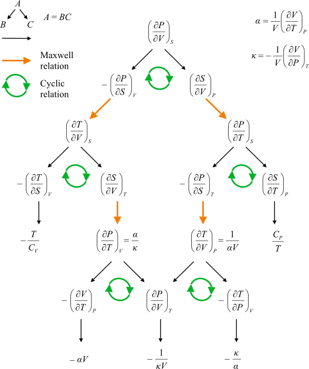

热力学中各类偏导数的推导方法，如何从最基本的偏导数导出其他偏导数，应用于迈耶公式，内能公式，TdS方程等。

当我最开始学热统的时候，我对这些偏导数是完全懵逼的。还记得第一次作业是写$T\mathrm{d}S$方程的第二、第三形式（换不同的变量），费了 好几个晚上，看了好几本书的介绍才莫名其妙地好像算了出来。然而在理解了和数学上偏导数的联系，特别是全微分的式子之后，我就明白了 这些偏导数的来由以及相应的性质。但是老师讲了内能公式的推导，其过程仍然让我感觉"这怎么想到的"。 然而接下去三个星期，我就想试试算每个偏导数，就一个个列出来算。最初还感到十分困难，要把函数式写出来看链式法则， 几个常用量也总是要查。然而在硬着头皮算了$STpVU$五个量组成的所有偏导数后，我已经能得心应手地应用体系中的前五把刷子了。 等到现在回头看，内能公式，$T\mathrm{d}S$方程实在是最为简单的东西了。这个故事告诉我们什么呢？仁者见仁吧$\sim$

# 热力学偏导数引入

在学习热力学时，往往会碰到如下形式的偏导数。 $$\label{eq:1}
\ppp{U}{T}{V} \qquad \ppp{H}{P}{V} \qquad \ppp{G}{T}{P,N}$$ 对于偏导数$\ppp{f}{g}{h}$而言，其意义是在$h$不变的情况下$f$对$g$的偏导数。例如， $\ppp{U}{T}{V}$就是在体积不变的情况下，内能对温度的导数，其物理意义也就是定容热容。

这些偏导数和数学分析课上学的偏导数相比，差别在于外面套了一层"壳"。 热力学要求我们掌握这些偏导数之间的联系。要怎么处理呢？先要从其根源讲起， 和数学上的偏导数建立联系。

# 热力学偏导数的导出·二元函数

在最简单的情况，即对于分子数目不变，也没有电磁场等的热力学系统，每个热力学量都是其他某两个量的二元函数。 例如，对于理想气体状态方程 $$\label{eq:2}
pV=nRT$$ 就可以说$p$是$V,T$的函数，记为$p=p(V,T)$。而对于一个二元（好）函数，总有全微分公式 $$\label{eq:3}
\mathrm{d}p=\pp{p}{V}\mathrm{d}V+\pp{p}{T}\mathrm{d}T$$ 由此式可以推知在温度不变时，若体积有微小$\delta V$的变化，则压强$p$相应地有$\delta p=\pp{p}{V}\delta V$的变化。 可见，此中的$\pp{p}{V}$就是我们要找的"在温度不变时压强对体积的偏导数"。为了表示是温度不变，我们在偏导数上加上下标，就成了 $\ppp{p}{V}{T}$。类似地， `\autoref{eq:3}`{=latex}就成为 $$\label{eq:4}
\mathrm{d}p=\ppp{p}{V}{T}\mathrm{d}V+\ppp{p}{T}{V}\mathrm{d}T$$ 而若是给定偏导数$\ppp{S}{T}{U}$，就可以知道它是从函数$S(T,U)$而来。 $$\label{eq:6}
\mathrm{d}S=\ppp{S}{T}{U}\mathrm{d}T+\ppp{S}{U}{T}\mathrm{d}U$$ 如果分子数可变，则每个热力学量将会是其他三个热力学量的函数，此时每个偏导数就会有两个不变量，例如对$U=U(S,V,N)$而言， $$\label{eq:5}
\mathrm{d}U=\ppp{U}{S}{V,N}\mathrm{d}S+\ppp{U}{V}{S,N}\mathrm{d}V+\ppp{U}{N}{S,V}\mathrm{d}N$$

热力学函数的自变量选择，除了变量个数固定之外，具体的选择并没有什么特别的限制。个数固定的原因可联系系统的自由度。如果$p$是 $T,V$的函数，那么确定了$T,V$以后，$p$就确定，其他热力学参数，连同整个热力学系统的状态也就确定了。也就是说， 这个系统只有两个自由度，那么任何变量都只能是其他两个变量的函数。至于具体的变量选择，一般总是选与问题联系最紧密的变量； 而如果需要转换变量，也是十分容易的，在接下去的章节会介绍转换的方法。

另外，热力学中的偏导数还可以写为雅可比行列式的形式。例如 $$\label{eq:7}
\ppp{U}{V}{T}=\pp{(U,T)}{(V,T)}$$ 我没啥研究也不怎么用，略。

# 热力学基础知识

这些公式在后面的推导中会用到。

1.  $T\mathrm{d}S$方程，热力学第一第二定律的结合（分子数不变，做功仅有$pV$情况，下同） $$\label{eq:8}
    T\mathrm{d}S=\mathrm{d}U+p\mathrm{d}V$$

2.  其余三个热力学量的引入 $$\label{eq:9}
    H=U+PV  \qquad F=U-TS \qquad G=U-TS+PV$$

3.  四个表示能量的热力学量基本方程 $$\begin{aligned}
    \label{eq:10}
    \mathrm{d}U&=T\mathrm{d}S-p\mathrm{d}V \\
      \mathrm{d}H&=T\mathrm{d}S+V\mathrm{d}p \\
      \mathrm{d}F&=-S\mathrm{d}T-p\mathrm{d}V \\
      \mathrm{d}G&=-S\mathrm{d}T+V\mathrm{d}p
    \end{aligned}$$ 由四个热力学基本方程可知，对于偏导数$\ppp{f}{g}{h}$，只要$f,g,h$是$(U,S,V)$或$(H,S,P)$或$(F,T,V)$或$(G,T,p)$的某种组合，那么直接从这四个方程中的相应方程即可直接得出结果。例如，由第三个式子可知 $$\label{eq:13}
    \ppp{F}{T}{V}=-S$$

4.  一些热力学量，定容热容$C_V$，定压热容$C_p$，定压膨胀系数$\alpha$，定容压强系数$\beta$，等温压缩系数$\kappa$ $$C_V=\ppp{U}{T}{V} \qquad C_p=\ppp{U}{T}{P}$$ $$\label{eq:11}
        \alpha=\frac{1}{V}\ppp{V}{T}{p} \qquad \beta=\frac{1}{p}\ppp{p}{T}{V} \qquad \kappa=-\frac{1}{V}\ppp{V}{p}{T}$$

# 热力学偏导数定义转换法

所有热力学偏导数都能通过一些已知，容易观测的偏导数（例如上面五个）或题目已经给出的偏导数来表达。 给定一个热力学偏导数，我们的任务就是寻找这些表达方式。

下面介绍的这些转换方法，都是基于[全微分表达式的代入计算]{.underline}得出。事实上这些变换还不能使某个偏导数能按需表达， 还需要基[于全微分表达式进行求导、移项]{.underline}得出的性质才可完全保证。这在下一节会介绍。

还需要注意的是，下面推导都是基于二元函数的情况，三元函数可以类似推广。

## 构造全微分表达式转换

考虑表达式 $$\label{eq:14}
\mathrm{d}p=\ppp{p}{T}{S}\mathrm{d}T+ \ppp{p}{S}{T} \mathrm{d}S$$ 如果我们不想要$\mathrm{d}S$，而想换成$\mathrm{d}V$，则可以用 $$\label{eq:12}
\mathrm{d}S=\ppp{S}{V}{T}\mathrm{d}V+\ppp{S}{T}{V}\mathrm{d}T$$ 代入，得 $$\begin{aligned}
\label{eq:15}
\mathrm{d}p&=\ppp{p}{T}{S}\mathrm{d}T+\ppp{p}{S}{T}\ppp{S}{V}{T}\mathrm{d}V+\ppp{p}{S}{T}\ppp{S}{T}{V}\mathrm{d}T \\
  &= \brack{\ppp{p}{T}{S}+\ppp{p}{S}{T}\ppp{S}{T}{V}}\mathrm{d}T+\ppp{p}{S}{T}\ppp{S}{V}{T}\mathrm{d}V
\end{aligned}$$ 和 $$\label{eq:16}
\mathrm{d}p=\ppp{p}{T}{V}\mathrm{d}T+\ppp{p}{V}{T}\mathrm{d}V$$ 相比，立刻得到 $$\label{eq:17}
\ppp{p}{T}{V}=\ppp{p}{T}{S}+\ppp{p}{S}{T}\ppp{S}{T}{V} \qquad \ppp{p}{V}{T}=\ppp{p}{S}{T}\ppp{S}{V}{T}$$ 注意，在 `\autoref{eq:12}`{=latex}中必须选择$\mathrm{d}T$作为$\mathrm{d}S$的另一个变量（可理解为"线性表达的基"），以配合 `\autoref{eq:14}`{=latex}中$\mathrm{d}p$中的$\mathrm{d}T$项， 否则将产生三个变元，虽然不能算错，但是就不能和 `\autoref{eq:16}`{=latex}相对照得出结论了。当然，也可以直接把两个变元都换掉，例如代入 $$\label{eq:18}
\mathrm{d}T = \ppp{T}{U}{V}\mathrm{d}U+\ppp{T}{V}{U}\mathrm{d}V \qquad \mathrm{d}S=\ppp{S}{U}{V}\mathrm{d}U+\ppp{S}{V}{U}\mathrm{d}V$$ 当然对于$\mathrm{d}T$和$\mathrm{d}S$，新选择的变元也要对应。

#### 评价

这种方法比较通用，在顺下去做（即代入-整理-比较）时没有太大困难。在过程的严谨性上讲也是最根本，最无懈可击的。 但是实际上在做题时，需要从偏导数构造全微分表达式，会引入另一个量，如何代换也不好确定，因此实际（我）不太用。

## 构造函数形式链式法则转换

直接从函数表达式入手，把$p(T,V)$改写为$p(T,S(T,V))$，根据求导的链式法则即得 $$\label{eq:20}
\ppp{p}{T}{V}=\ppp{p}{T}{S}+\ppp{p}{S}{T}\ppp{S}{T}{V}$$ 虽然偏导数链式法则也是从全微分表达式而来，但基本已经被广泛接受而可以直接拿来用了。

#### 评价

偏导数链式法则需要从偏导数去构造函数及变量的关系，除了构造方式多样，一时难以找准方向以外，这种方法便于理思路、打草稿、计算、交流，是（我）比较常用的一种。

## 偏导数通用转换

直接把两个变元都代换掉，考虑$p(S,T)=p(V(S,T),U(S,T))$ $$\label{eq:19}
\ppp{p}{S}{T}=\ppp{p}{V}{U}\ppp{V}{S}{T}+\ppp{p}{U}{V}\ppp{U}{S}{T}$$ 抽象出来 $$\label{eq:21}
\ppp{f}{x}{y}=\ppp{f}{s}{t}\ppp{s}{x}{y}+\ppp{f}{t}{s}\ppp{t}{x}{y}$$ 其中$t$和$s$可以任意选择，甚至可以和$x$、$y$相同，使得上式中某些项为$0$或$1$。

#### 评价

大概是最通用的方法，它的优点在于直接对偏导数进行操作，不需要再构造函数式或者全微分式。 缺点在于过于庞大，事实上很多变换都比较简洁，如果每次都寻找变元，写成两项加两项的形式，会比较麻烦。

## 雅可比行列式转换

没有研究，只举个例子 $$\label{eq:22}
\ppp{p}{S}{T}=\pp{(p,T)}{(S,T)}=\pp{(p,T)}{(V,T)}\pp{(V,T)}{(S,T)}=\ppp{p}{V}{T}\ppp{V}{S}{T}$$

#### 评价

没用过，不予评价。

# 六把刷子转换体系

## 起源

六把刷子转换体系，是我在算了一百多个热力学偏导数的过程中积累下来的经验之谈。可以说所有二元的热力学偏导数，都能 通过这六把刷子中的某几把相互转换，直至一些基本量。"六把刷子"代表六种方法，每种方法都有其应用场景，而且是直接从 未知量出发进行变换，而非从已知量开始进行艰难的构造。虽然是用来对付二元热力学偏导数，但是三元，多元的情况也可根据相应原理推广。

## 第一把刷子·定义法【O】

这把刷子适合能直接从热力学基本方程得出，或者已经被定义的量。例如要求$\ppp{U}{S}{V}$， 则想到方程 $$\label{eq:24}
\mathrm{d}U = T\mathrm{d}S-p\mathrm{d}V$$ 那么显然$\ppp{U}{S}{V}=T$。此方法需要对热力学量及特性函数比较敏感，看到$F,T,V$这种组合就能想到特性函数和热力学基本方程， 然后直接从方程中读出就行。

稍微有些变化，如果要求$\ppp{S}{V}{U}$怎么办呢？它还是这三个量的组合，我们把方程改写为 $$\label{eq:29}
\mathrm{d}S=\frac{1}{T}\mathrm{d}U+\frac{p}{T}\mathrm{d}V$$ 就可以直接写出 $$\label{eq:30}
\ppp{S}{V}{U}=\frac{p}{T}$$

另一种情况是，例如要求$\ppp{U}{T}{V}$，这当然就是定容热容$C_V$，这是实验可观测的量，一般就可以拿来用，不需要进一步变换了。

因为定义法直接从方程中读出结果，或者已经人为定义，实在是没什么意思，于是用一个圈圈或者字母O来表示。

## 第二把刷子·两项链式法则【D】

第二第三把刷子都是和链式法则相关，或者说从全微分式子进行代入得出。第二把刷子是比较简单形式的链式法则，和 $$\label{eq:25}
\ppp{f}{x}{y}=\ppp{f}{s}{t}\ppp{s}{x}{y}+\ppp{f}{t}{s}\ppp{t}{x}{y}$$ 相比，令$t=y$，得到 $$\label{eq:26}
\ppp{f}{x}{y}=\ppp{f}{s}{y}\ppp{s}{x}{y}+\ppp{f}{y}{s}\ppp{y}{x}{y}$$ 其中，对于$\ppp{y}{x}{y}$而言，在$y$不变的时候求偏导数，当然是$0$了（相当于$y$是常数拿出去，然后$1$对$x$求导）。于是只剩下 $$\label{eq:27}
\ppp{f}{x}{y}=\ppp{f}{s}{y}\ppp{s}{x}{y}$$ 也可以从函数关系上推导，令$f(x,y)=f(s(x,y),y)$，两边对$x$求导即可。

应用的例子如 $$\label{eq:23}
\ppp{U}{p}{V}=\ppp{U}{T}{V}\ppp{T}{p}{V}=C_V\cdot \frac{1}{p\beta}$$ 其中$\ppp{T}{p}{V}=1\big/\ppp{p}{T}{V}$和第一把刷子一样无趣，就默认大家都知道了（严格来说它是第四把刷子的附带结论）。

再如 $$\label{eq:34}
\ppp{S}{p}{V}=\ppp{S}{U}{V}\ppp{U}{T}{V}\ppp{T}{p}{V}=\frac{C_V}{T\beta p}$$

第二把刷子的特点是，它不改变右下角的不变量，直接"插入"一个新变量。因此，如果右下角是$U,H$这种量，用第二把刷子是没什么用的， 因为$U,H$不变的偏导数大部分都比较复杂，变换完之后的两个偏导数还是没法算。相比之下，如果右下角是$p,T,V$之类，由于$p,T,V$三个量的 转换关系比较明确，偏导数已经给定（三个系数$\alpha,\beta,\kappa$），就可以利用第二把刷子修改原项的分子或分母，使之像第二个例子一样将$U$和$V$组合在一起。

由于第二把刷子是由偏导数链式法则得到，就用导数的Derivative首字母D来表示。

## 第三把刷子·三项链式法则【P】

这把刷子是有点复杂的链式法则。对于方程 $$\label{eq:28}
\ppp{f}{x}{y}=\ppp{f}{s}{t}\ppp{s}{x}{y}+\ppp{f}{t}{s}\ppp{t}{x}{y}$$ 令$s=x$，得到 $$\label{eq:31}
\ppp{f}{x}{y}=\ppp{f}{x}{t}\ppp{x}{x}{y}+\ppp{f}{t}{x}\ppp{t}{x}{y}$$ 显然$\ppp{x}{x}{y}=1$，于是 $$\label{eq:32}
\ppp{f}{x}{y}=\ppp{f}{x}{t}+\ppp{f}{t}{x}\ppp{t}{x}{y}$$ 也可以令$f(x,y)=f(t(x,y),x)$，然后两边对$x$求偏导得到。

应用的例子如 $$\label{eq:33}
\ppp{H}{p}{V}=\ppp{H}{p}{S}+\ppp{H}{S}{p}\ppp{S}{P}{V}=V+T\cdot \frac{C_V}{T\beta p}=V+\frac{C_V}{\beta p}$$ 其中第一步用第三把刷子展开后，前两项是直接从定义得出，后一项是在讲解第二把刷子中举过的例子 `\autoref{eq:34}`{=latex}

第三把刷子的特点是，它能改变不变量，但是原不变量仍然存在，出现在最后一项。还是以$\ppp{H}{p}{V}$为例，由于特性函数组合是$H,S,P$， 只有一个不一样，而且位置是不变量（如果位置是分母的话，就可以用第二把刷子）。经过第三把刷子操作后，得到的三项中两项都是可以直接得出，最后一项 则已经和$H$等能量量纲的量没有关系，就很容易变换为已知量了。由于不变量仍然存在，所以如果是以$U,H$等为不变量的偏导数，一般不用这把刷子，除非最后能得到$\ppp{S}{V}{U}$这样的结果。

因为在第一到第五把刷子中只有它这个变换有加号，所以用Plus的首字母P表示。

## 第四把刷子·麦克斯韦关系【M】

第四把刷子是利用全微分公式及二阶导数可交换的性质得到的（当然这些函数都是"好"函数）。 $$\label{eq:40}
\frac{\partial^2f}{\partial x\partial y}=\brack{\pp{}{x}\ppp{f}{y}{x}}_y=\brack{\pp{}{y}\ppp{f}{x}{y}}_x=\frac{\partial^2f}{\partial y\partial x}$$ 当然我们暂时不讨论显式的二阶偏导数，所以我们只能从四个基本方程中找（即一阶偏导数已经是$T,p,S$之类，没有偏导数的形式）。考虑方程 $$\label{eq:41}
\mathrm{d}U=T\mathrm{d}S-p\mathrm{d}V$$ $\mathrm{d}S$前的$T$对$V$求导，$\mathrm{d}V$前的$-p$对$S$求导，则根据二阶偏导数与顺序无关，我们有 $$\label{eq:42}
\ppp{T}{V}{S}=-\ppp{p}{S}{V}$$ 由其他三个式子，类似有 $$\label{eq:43}
\begin{array}{l@{\quad\Rightarrow\quad}l}
\mathrm{d}H=T\mathrm{d}S+V\mathrm{d}p & \ppp{T}{p}{S}=\ppp{V}{S}{p}\\
\mathrm{d}F=-S\mathrm{d}T-p\mathrm{d}V & \ppp{S}{V}{T}=\ppp{p}{T}{V}\\
  \mathrm{d}G=-S\mathrm{d}T+V\mathrm{d}p& -\ppp{S}{p}{T}=\ppp{V}{T}{p}
\end{array}$$ 这四个偏导数关系即为麦克斯韦关系。

关于麦克斯韦关系的记法有好几种，这里只介绍我用的方法。注意三个规律：

1.  分子和不变量总是成对共轭量。

2.  一侧分子和另一侧的分母总是成对共轭量。

3.  如果分子和分母性质相同（同为强度量或广延量），则无需变号，否则需要变号。

然后以$\ppp{S}{V}{T}$为例，发现其分子$S$和不变量$T$是共轭量，分母也是$SVTp$中的一个，因此可以用麦克斯韦关系。 其对应的偏导数，由规律2可知分子是$p$，分母是$T$，再由规律1知不变量是$V$，再验证$S$和$V$都是广延量，因此不需要加符号，最终得到 $$\label{eq:45}
\ppp{S}{V}{T}=\ppp{p}{T}{V}$$ 这一规律在多元时貌似有时候不成立，可以自己再从基本微分方程开始推。

麦克斯韦关系的特点是它只能对这八个偏导数进行转化，但是却往往是不可或缺的一环。一般在遇到熵的时候，要么利用$U,S,V$的特性函数消去， 要么利用麦克斯韦关系化掉（后二式）。并且，（二元）麦克斯韦关系牵涉到的量只有$V,S,T,p$四个。一般都是看看能用的话就试一试。

根据麦克斯韦关系的英文名Maxwell relations，把这刷子记为M。

## 第五把刷子·循环置换关系【C】

第五把刷子则是对全微分公式移项后得到的结论。循环置换关系指的是 $$\label{eq:35}
\ppp{f}{x}{y}\ppp{x}{y}{f}\ppp{y}{f}{x}=-1$$ 不难推导，考虑全微分式 $$\label{eq:36}
  \mathrm{d}f=\ppp{f}{x}{y}\mathrm{d}x+\ppp{f}{y}{x} \mathrm{d}y$$ 移项，得 $$\label{eq:37}
\mathrm{d}x=\ppp{x}{f}{y}\mathrm{d}f-\ppp{x}{f}{y}\ppp{f}{y}{x}\mathrm{d}y$$ 用$x$的全微分式，比较第二项，得到 $$\label{eq:38}
\ppp{x}{y}{f}=-\ppp{x}{f}{y}\ppp{f}{y}{x}$$ 就是结论了。

实际应用的例子如 $$\label{eq:39}
\ppp{p}{T}{H}=-\ppp{p}{H}{T}\ppp{H}{T}{p}=-C_p\bigg/ \ppp{H}{p}{T}$$ 再用一下刷子3【P】和刷子4【M】 $$\label{eq:46}
\ppp{H}{p}{T}=\ppp{H}{p}{S}+\ppp{H}{S}{p}\ppp{S}{p}{T}=V-T\ppp{V}{T}{p}=V-TV\alpha$$

循环置换关系的特点是它不引入新的变量，只是对原先三个量进行置换。最大的用处就是处理具有能量量纲的量$U,H,F,G$在不变量 上的情况，将这些量换到分子或分母上进行下一步处理。当然，如果偏导数中有两个以上这样的量，那么就失效了。

根据循环置换关系的英文名cyclic relations，把这把刷子称为【C】

## 第六把刷子·能量表征量转换【S】

其实前五把刷子应该已经能解决所有的偏导数转换问题，第六把刷子虽说有些多余，但是在一些特定情况下也比较好用。 这一方法是直接利用$U,H,F,G$的加减关系进行处理，例如 $$\label{eq:47}
\ppp{U}{T}{p}=\ppp{H-pV}{T}{p}=\ppp{H}{T}{p}-p\ppp{V}{T}{p}=C_p-pV\alpha$$ 而原本需要如下多次操作 $$\label{eq:44}
\ppp{U}{T}{p}=\ppp{U}{T}{V}+\ppp{U}{V}{T}\ppp{V}{T}{p}=C_V+V\alpha \ppp{U}{V}{T}$$ 其中$\ppp{U}{V}{T}$之后还需要一次【P】和【M】，之后在内能公式会提到。还有在极少数场合的一些应用 $$\label{eq:48}
\ppp{H}{U}{p}=\ppp{U+pV}{U}{p}=1+p\ppp{V}{U}{p}$$

利用$U,H,F,T$四个量的关系进行转换，需要考虑多方面的因素。一般而言，这么做的原因是化为特性函数或从两个及以上能量表征量中消去一个， 但是这个操作附加的项不少，有时还需要结合乘法求导规律，出来的一些项更为难算。

跟前面几把刷子比起来，这个操作有些特殊，因此用Special的首字母S命名。

# 应用

有了六把刷子，就可以算各种偏导数了，注意最后可以检查下量纲。

## 内能公式

推导内能公式 $$\begin{aligned}
\label{eq:49}
\ppp{U}{V}{T}&=\ppp{U}{V}{S}+\ppp{U}{S}{V}\ppp{S}{V}{T} \\
  &=-p+T\ppp{p}{T}{V} \\
  &=-p+T\beta p
\end{aligned}$$ 其中利用了一次三项链式法则【P】刷子，和一次麦克斯韦【M】刷子。

## 迈耶公式

推导迈耶公式 $$\begin{aligned}
\label{eq:50}
C_p-C_V&=\ppp{H}{T}{p}-\ppp{U}{T}{V} \\
  &=\ppp{U+pV}{T}{p}-\ppp{U}{T}{V} \\
  &=\ppp{U}{T}{p}-\ppp{U}{T}{V}+p\ppp{V}{T}{p} \\
  &=\ppp{U}{V}{T}\ppp{V}{T}{p}+pV\alpha \\
  &=V\alpha(-p+T\beta p+p) \\
  &=V\alpha T\beta p
\end{aligned}$$ 其中先用了一次能量表征量转换【S】刷子。若不用【S】刷子，则相当于抛弃了$H$和$U$的关系， 相应的$C_p$和$C_V$之间的关系也失去了，也就几乎不可能"化简"原式。接着用了一次三项链式法则【P】刷子， 把不变量不同的两项之差消去。接着只需要代入之前推过的内能公式即可。

## 第二第三$T\mathrm{d}S$方程

第一$T\mathrm{d}S$方程是以$U$和$V$（或$T,V$）为自变量，第二$T\mathrm{d}S$方程是以$T,p$为自变量，而第三$T\mathrm{d}S$方程是以$p,V$为自变量。

从 $$\label{eq:51}
T\mathrm{d}S=\mathrm{d}U+p\mathrm{d}V$$ 开始，将$\mathrm{d}U$代成$V$和$T$的变量，即求 $$\label{eq:52}
\ppp{U}{T}{V}=C_V \qquad \ppp{U}{V}{T}=T\beta p-p$$ 其中一个是定义，一个已经由内能公式得到。因此 $$\label{eq:53}
T\mathrm{d}S=C_V\mathrm{d}T+T\beta p \mathrm{d}V$$ 下一步，将$\mathrm{d}V$代为$\mathrm{d}T$和$\mathrm{d}p$，已经知道$\ppp{V}{T}{p}=V\alpha$和$\ppp{V}{p}{T}=-\kappa V$，于是得到 $$\label{eq:54}
T\mathrm{d}S=C_V\mathrm{d}T+T\beta p V\alpha\mathrm{d}T- T\beta p \kappa V \mathrm{d}p=C_p\mathrm{d}T-TV\alpha \mathrm{d}p$$ 这即是第二$T\mathrm{d}S$方程。最后一步应用了迈耶公式和$\alpha=\kappa\beta p$的循环置换关系，即 $$\label{eq:55}
\ppp{p}{V}{T}\ppp{V}{T}{p}\ppp{T}{p}{V}=-1 \quad\Rightarrow \quad \frac{V\alpha}{-\kappa V p\beta}=-1 \quad \Rightarrow \quad \alpha=p\beta\kappa$$ 从 `\autoref{eq:53}`{=latex}开始推第三个方程，将$\mathrm{d}T$代为$\mathrm{d}V$和$\mathrm{d}p$，类似地可以直接写出结果 $$\label{eq:56}
T\mathrm{d}S=\frac{C_V}{p\beta}\mathrm{d}p+\brack{ \frac{C_V}{V\alpha}+T\beta p}\mathrm{d}V=\frac{C_V}{p\beta}\mathrm{d}p+\frac{C_p}{V\alpha}\mathrm{d}V$$

## 实际习题例

（汪志诚2.6）水的体胀系数$\alpha$在$273.15\mathrm{K}<t<277.15\mathrm{K}$时为负值，试证明在这温度范围内，水在绝热压缩时变冷。（其他液体和所有液体在绝热压缩时都升温）

把题目要我们证的东西翻译成数学语言，绝热指的就是熵不变，变冷就是温度降低，压缩就是体积减小，因此目的是证明 $$\label{eq:57}
\ppp{T}{V}{S}>0$$ 即绝热时体积减小，温度也减小。将这个偏导数转化为已知量的表达，注意到$T$和$S$是共轭量，可以用麦克斯韦关系 $$\label{eq:58}
\ppp{T}{V}{S}=-\ppp{p}{S}{V}$$ 然后为了消去$S$，可以利用$U,S,V$的组合，用两项链式法则刷子化为 $$\label{eq:59}
-\ppp{p}{S}{V}=-\ppp{U}{S}{V}\ppp{p}{U}{V}$$ 接着可以利用$U,T,V$的组合消去$U$，最后剩下的仅仅是$p,V,T$的已知组合。 $$\label{eq:60}
-\ppp{U}{S}{V}\ppp{p}{U}{V}=-T\cdot \ppp{T}{U}{V}\ppp{p}{T}{V}=-\frac{Tp\beta}{C_V}$$ 由于默认的有$\kappa>0$和题目给的$\alpha$，将$p\beta$再次代为$\alpha/\kappa$，最终得到 $$\label{eq:61}
\ppp{T}{V}{S}=-\frac{T\alpha}{C_V\kappa}$$ 现在考虑每一项符号，$T>0$，$\alpha<0$是题目条件，$C_V>0$，因为定容时不可能同时降温且内能增加；$\kappa>0$，因为不可能等温下体积减小时压强也减小。 因此算上负号，整个项为正，证明完毕。

# 热力学偏导数地图

热力学偏导数之间存在着千丝万缕的关系，例如

<figure>

<figcaption>维基上的热力学地图</figcaption>
</figure>

可以发现，所有偏导数在经过一系列变换之后，总能用几个基本量来表示。既然如此， 是否可以做一张联系图，囊括了所有热力学偏导数之间的转换关系，由此得到每个热力学偏导数的 **已知量表达形式**和**转换路径**呢？

显然只要有时间和耐心，只需要付出计算的活儿就可以做了。但是仍然有一些细节值得考虑，例如

1.  图的规模有多大？

2.  应该以何种顺序来计算各偏导数？

3.  最少需要几个量来表示所有的偏导数？

4.  最少需要几种路径（刷子）？

5.  对每个偏导数是否存在一种最短路径？

6.  三元、更高阶的偏导数呢？

7.  在数学上是否有等价的群结构？

如果只考虑$STVpUHFG$八个热力学量的话，抽三个组成偏导数，把分子分母倒一下不算新的，总共有$A_8^3/2=168$个热力学偏导数。对于计算的顺序，我的建议是先搞明白 $STVp$四个量之间的$A_4^3/2=12$个偏导数（当然要结合一下$U$，否则没法处理$S$），接着搞明白$STVp$和$U$五个量组成的$A_5^3/2=30$个偏导数。接下去算$STVp$和$H$的 时候就能进行类比，只有同时含$H,U$的偏导数需要新算。然后再加入$FG$。对于基本量而言，我在算了$STVpUH$六个量组成的所有偏导数后，发现大概只涉及到$TpV\beta\alpha\kappa C_VC_p$， 其中$C_V$和$C_p$；$\alpha,\beta$和$\kappa$又分别能互相表示，因此可能只需要六个量即可。如果是含有$F,G$的偏导数，可能还会出现$S$。而最少的刷子数，和可以用的基本量有关，例如 如果$C_p$和$C_V$均能使用，一般来说就可能不用刷子【S】了。而如果不把$C_p$当作独立的，就一定需要【S】。当然，也可能还可以用我不知道的新的刷子。关于最短路径， 由于变换可能需要不同的刷子，因此不太容易定义。但是如果单看刷子使用次数的话，可能还是可以的。对于最后两个问题，我就一无所知了，有待大家探索。

那么有没有完全版的热力学地图？虽然我是算了很多偏导数，但是做成地图还是非常麻烦，当时课程重心也早就不在偏导数计算上了，所以我就没做了。大家可以自己加油。
