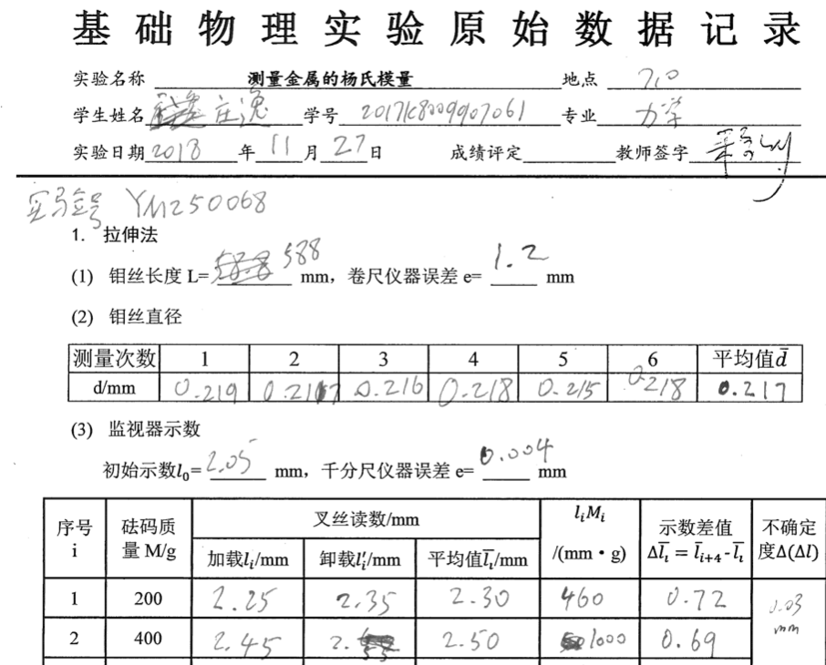
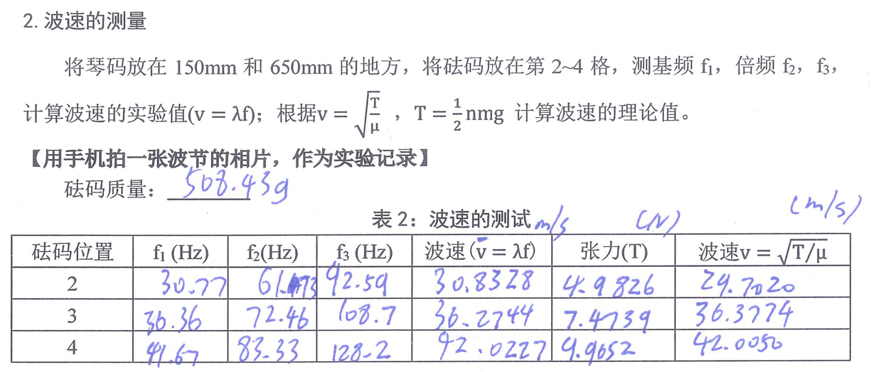
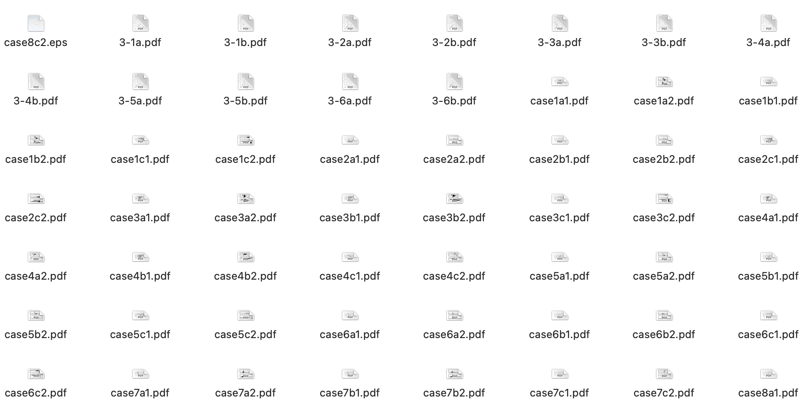

《学术道德与学术写作-通论》课程作业。

\tableofcontents

# 科研数据存储问题的引出

《怎样当一名科学家》[@mg14]一书阐释了科学研究中所需要遵守的各种科研规范，其中关于数据处理的一小节引起了我的共鸣。 这一节讨论了数据操纵现象，数据记录的要求和数据共享等方面的内容。数据操纵毫无疑问是违反科研规范的行为， 历来已经听过不少老师强调这一点。而如何记录，共享数据，则很少听老师同学提起。 书中提到："遗憾的是，刚从事科研工作的科研人员一般没有或很少接受过有关数据记录、分析、储存和分享的正式培训。" 我对此深有体会。一方面，我在本科的科研经历中，确实遇到了数据记录、存储方面的问题。 另一方面，无论是学校课程，还是图书馆讲座，或是导师的指导，都没有专门对这一问题进行探讨。 而单拿着"如何记录，存储数据"的问题去问同学老师或是网上搜索，又显得太过笼统。 就如同"如何打字打得快"这样的问题，大部分人只能给出"熟能生巧"之类的答案，而无法阐明其中的细节门道。 而事实上，科研数据的记录存储是科学研究的基石。做好了数据的记录存储，能更好地进行数据管理，使用和共享。 因此，我想结合我本科有关科研数据记录存储的实践经验，作一些分析探讨。

# 科研数据记录存储的个人经历

## 实验课

本科有安排专门的实验课，这是我第一次接触到科研数据管理的相关问题。 对于大部分实验，老师都会提前上传原始数据记录表，而我们需要提前打印好数据记录表，带去做实验，在实验结束后交给助教签字，再带回进行数据分析。 一部分实验数据记录表如`\autoref{fig:1}`{=latex}所示。

<figure id="fig:1">

<figcaption>原始数据记录表例</figcaption>
</figure>

这大概是最原始的科研数据记录方法。经过几次实验后，我发现这样的方法存在下面这些问题：

1.  不易储存和获取。如果这一张纸不慎丢失或是沾染污物，可能很难找回数据。 而即使妥善保存，若不是我把所有的数据记录纸都扫描留存在硬盘中，在数年后的今天也很难快速将其找到。

2.  不易辨认。一方面，如果记录得不是很美观整洁，不同的人看，甚至自己隔一段时间再看，都可能会辨认不清或弄混部分数字。 另一方面，记在纸上也不方便计算机辨认，还需要人工录入，不利于直接进行数据的进一步处理。

3.  灵活性差。虽然表格中预留好了需要采集数据的空位，但是实际实验中不可能总是理想情况。 重做实验时删删改改会使得表格变得不美观，需要临时加记数据时则又无处可写。

如今回过头来想，纸质科研数据记录也有两个优点。

-   其一是在短时间内它具有绝对的可靠性。笔和纸都是常见的，构造非常简单的物品，采用纸笔一定能够将数据记录下来。 相比之下，直接记录在电脑上则有小概率遇到电量不足或是软件崩溃的问题。

-   其二是它具有很高的可信度，一般能记录下所有的删改，并且非印刷的签名或章印也防止了伪造行为（电子记录也可以做到这一点，但是具有相当的技术门槛）。

但是这两个优点相对于电子数据记录，在当时的环境下并没有较强的竞争力。 而那时的一次驻波实验让我深刻体会到了电子数据记录的便捷性。

驻波实验是一个验证性实验。弦上波的速度可以通过频率（由频率发生器读数得到）和波长（由观察驻波波节位置得到）计算得到， 也可以根据弦的物理性质（已知）和张力（由外挂砝码得到）计算得到。我们需要验证这两个方法得出的波速相等， 为此，需要验证九组参数，结果如`\autoref{fig:2}`{=latex}所示。

<figure id="fig:2">

<figcaption>驻波实验部分数据记录表</figcaption>
</figure>

在实验中，挂好砝码后，需要手动调节频率发生器，使其达到合适的值，观察到对应的驻波现象才可读数。 然而，从实验数据表中可看出频率调节的精度要求较高，并且在调整时也难以从现象确定应该向大调还是向小调。 所以，如果能预先计算出应当调节到的频率，就能较大地提高实验效率。 这一计算虽然不复杂，但是需要重复九次，使用一般的计算器也比较麻烦。 而那时我正好把相应的数据记到了Excel中，正适合这样的简单批量计算，一下就把九个理论频率列了出来。 在调节到理论频率附近后，果然现象符合预期，再微调找到最佳的状态作为实际测量值记录下来，进度一下就超过了同组同学。 这次经历让我认识到，数据分析并不是一定要在实验完成之后。在实验中进行数据分析，也能够反作用于实验的顺利进行。 而要想高效地在实验中进行一定程度的数据分析，就必须依靠电子数据记录。

## 科研实践与毕设论文

本科后期的科研实践和毕设论文，是我第二次接触到大规模的科研数据储存的问题。 由于我做的是理论和数值工作，所以就不再有纸质实验记录数据了。而这一阶段主要有以下两个问题。

1.  如何妥善储存科研工作中产生的各类文件？

2.  如何妥善整理产出的各种初级科研结果？

整个科研流程所产生的文件可谓是多而繁杂。 如今回顾，有大量的参考文献，每周的工作报告，用于模拟的程序代码文件， 模拟结果的图和数据，开题计划书，中期报告和结题报告及相关表格等等。 按照一个项目一个文件夹存放所有的相关资料，是一个最直觉的选择， 但并不是最理想的方案。 根据我科研实践的经历，参考文献存于文献管理软件中以方便制作引用， 也存于阅读软件中用以精读分析。程序代码有A软件和B软件的两份， 分别被我存在了专门用于存放AB两软件代码的地方。 部分考虑是基于潜在的复用性，例如同一篇文献，可以在很多项目中被引用。 故如果每个项目文件夹都存放相关文献， 就会造成空间浪费和无法同步的问题。 另一个考虑则是部分数值软件运行默认目录下的程序更为方便， 若将程序放在项目文件夹下，则每次都需要指定较长的项目路径，比较费事。

在漫长的科研流程中，产生的初级科研成果也是多种多样：小到看文献时做的注解， 每周的工作报告，大到自己发展的方法，程序模拟的大量结果。 这些初级科研成果往往在之后的科研写作中经常用到，需要不时翻找出来并回忆当时的思路。 而我在实践中发现，这些初级科研成果往往细碎地散落在各个地方而难以检索到。 例如想要寻找当时看一篇文献的注记，却忘了是写在了第几周的工作报告中。

<figure>

<figcaption>大量的图片</figcaption>
</figure>

而在做程序数值模拟时，往往需要对多个参数组合进行模拟，产生大量的图片和数据。上图显示了我在毕设工作中所生成的大量图片。 例如参数$A$取值六种，参数$B$取值三种，每种情况运行出四张图加一份数据，最后总共就有$90$个文件。 以目前的树形文件系统分类存储，需要在每个$A$参数文件夹下建三个$B$参数取值文件夹， 有一些繁复，并且在对比不同参数的结果时需要反复跳转，不甚方便。而直接存放在一个文件夹中， 以文件名区分，虽然一定程度上能解决这个问题，但又对文件名的批量操作提出了要求，且在文件进一步增多时翻找起来也较麻烦。 此外，有时会遇到获取结果生成时所采用的参数（包括$A,B$之外的一些参数）的需求，例如需要复现某一情况再作一个图。 这就需要在生成数据时不仅仅只是产生并存储数据，还需要将如何生成的这些数据记录在单独的一个实验记录文档中。

# 浅谈标签式管理软件和未来工作

上面这些我在科研实践和毕设过程中遇到的问题，有一些直到最后也没有解决。 但我从这些需求中获得了一个初步的想法，那就是依靠一个标签式的文件管理软件进行科研项目管理。 它通过硬链接[^1]的方式把分散在各个地方 的文件集中到一起进行管理，并对这些文件打上标签。硬链接解决了空间浪费和同步的问题，而通过搜索或标签筛选可以 很方便地找到需要的文件，对比不同组合的参数结果图，进行跨项目的文件共享等。 不过直到目前我还没有找到一个合适的能实现这些功能的软件。

很快，我就要进入课题组参加工作，课题组所采用的主要研究手段为大气的数值模拟。 大气的数据想来也是规模巨大，所以估计到时也一定会遇到类似的数据存储的问题。 结合之前的经验和大气数据的相关特点，拟定了如下的注意事项：

1.  需要做好关于科研初步结果的总索引，可以在一个文件中查到所有工作内容。

2.  记录下关于数据本身的信息，将其和数据放在一起。对于源数据，记录下获取方式和时间； 对于程序运行得到的数据，记录下生成这些数据所采用的参数等。

3.  在平时工作中多留意多思考，和同学老师多交流相关经验。

除了前面谈到的这些，科研数据的记录和存储还包含了很多方面，例如包含隐私数据的安全性和访问权限[@Best]， 数据的存储格式，备份方案和永久储存仓库[@Best92]等。 可见，科研数据的记录存储工作具有相当的重要性，是合格的科研工作者的必备技能，需要我们认真对待。

\printbibliography

[^1]: 计算机术语。通过硬链接复制的文件得到的文件，表面上类似直接复制，但其和源文件指向硬盘中同一个实体。
