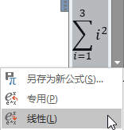
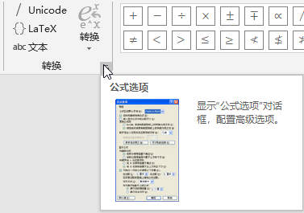
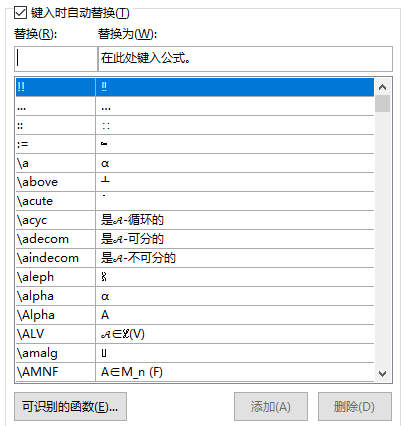
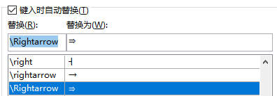
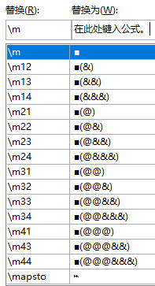
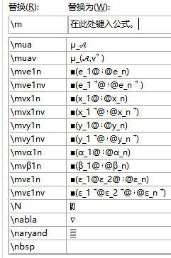

讲解如何在Word中输入公式以及技巧。

庄逸，2019/03/09 at UCAS

就算没有下一版本也要记录版本号1.0

# 目录 {#目录 .TOC-Heading}

[Word公式输入攻略 [1](#word公式输入攻略)](#word公式输入攻略)

[1 前言 [2](#前言)](#前言)

[1.1 声明 [2](#声明)](#声明)

[1.2 这一攻略能够适用在哪些软件？ [2](#这一攻略能够适用在哪些软件)](#这一攻略能够适用在哪些软件)

[1.3 为什么要信我？ [2](#为什么要信我)](#为什么要信我)

[2 基础知识 [3](#基础知识)](#基础知识)

[3 四条经验 [5](#四条经验)](#四条经验)

[3.1 多试，多查，多练 [5](#多试多查多练)](#多试多查多练)

[3.2 自己查找数学符号的命令 [5](#自己查找数学符号的命令)](#自己查找数学符号的命令)

[3.3 自己查找数学结构的命令 [6](#自己查找数学结构的命令)](#自己查找数学结构的命令)

[3.4 自动替换和函数识别 [7](#自动替换和函数识别)](#自动替换和函数识别)

[4 杂项 [9](#杂项)](#杂项)

# 1 前言

巨轮想学word敲公式，于是我总结我的经验为四句话，然而发现QQ上光文字说说仍然弄不清楚，所以还是写一篇攻略好了，也算是两年多从入坑word公式到脱坑的经历记录。

## 1.1 声明

本攻略为作者原创，转载请注明源网址 <https://vortexer99.github.io/>，作者只负责解答读者的疑惑，对于本攻略造成的一切如Word崩溃丢失数据等后果概不负责。

## 1.2 这一攻略能够适用在哪些软件？

我的版本为Word 2016，其他版本不保证有完全相同的表现，可自行尝试类似操作。据我所知，可以适用同一种模式的公式输入的包括但不限于Word、PowerPoint、OneNote及对应的iOS版本。

## 1.3 为什么要信我？

~~如果你不信我的话大可以右上角关闭啦。不过既然你已经点进来看到这里了，想来也不会这么做XD。~~

这一小节主要是~~显摆~~记录我的Word输入公式经历，进而说明这些经验都是在摸爬滚打中总结出来的。只关心主要内容的可以跳过此节。

最开始接触Word公式输入是在2016年底，刚开始写数学书的时候。不知道准备好的一大堆公式怎么输进文档。先是试了MathType，发现用着十分难受效率也不高（因为当时也没去仔细钻研它的设计理念，无意引战，欢迎MathType大佬也写些攻略教教我）。后来还试着用Mathematica打公式然后复制（还是导出图片）到文档里，结果发现仍然十分麻烦。最后发现Word自带功能就能插入公式，还十分容易上手使用，就一直用到现在。

高三下半年写完整本书后，公式就基本上能熟练输入，不少符号的命令也都烂熟于心。接着到了大一上学期，办了数学公众号（现已经转到网站），又打了不少数学文章------一般都是满屏的公式。有时给同学讲题，就直接拿Word打草稿展示运算过程了。大一下学期，又是在上课时同步记录线性代数课老师在黑板上的演算，对速度要求比较高。有一次测试了一下，发现一节课要敲键盘一万五千多次，总共二十次课就是三十万了------还没算上课后的校对。在此过程中，又发现了一些高级操作。但在整完讲义后，深感Word本身在某些方面比较愚蠢，于是打算脱坑。然而大二上打实验报告时必须要用Word，只好又敲了一学期公式。之后就转入LaTeX，好久不用Word写公式了。

# 2 基础知识

**Q：Word公式是什么？**

A：可以当成一种环境，在其中可以用特定的方式输入在普通环境下打不出的数学符号，并进行数学格式的排版。也可以将整个公式作为一个整体对象。

**Q：怎么创建公式？**

A：菜单栏"插入"然后点公式按钮的[上半部分]{.underline}，或者按[下半部分]{.underline}弹出详细菜单中选择输入 公式的方式。可以使用Word快捷键序列组合（似乎是2016新特性），按照提示，依次按下Alt，N，E，I（插入新公式，或依照指示按其他）。或者在公式环境中Alt，J，E，E。

但是最**简单常用**的方法是快捷键Alt+=（在你没改过快捷键的前提下）（iOS版的似乎是Ctrl+=还是啥），直接在当前光标位置开始输入公式。

**Q：创建公式有哪几种方法？**

A：①通过快捷键Alt+=或者插入新公式，就可以自己输入。②在公式下拉菜单中可以选择插入之前保存的公式或者Office自带的公式，但是实际使用中公式形式不会如此固定，这个方式效率太低，一般不用。本篇不讲。③通过墨迹公式输入。效率偏低，本篇不讲。鼠标写公式实在费劲。触摸屏用笔写还行，但每次输公式都要指望手写的话就太麻烦了。

**Q：是不是跟LaTeX一样有行间公式的概念？**

A：是的，当公式所在的行中有非公式的内容（最后的换行符不算）就会成为行间公式，分数会变小，求和号的上下标会跑到右上角右下角，以适应行高。只有正行都是公式内容时才不会形成行间公式。另外，它们依据环境的转换是自动完成的。

{width="1.7569444444444444in" height="1.4770833333333333in"} 有时明明一行中只有公式，但是却是行间公式的样子。这可能是由于不可见符号导致的，譬如公式前有缩进符，空格；后有分页符、分节符，甚至图片的锚挂在公式前面也会让其变为行间公式。可以通过"显示/隐藏编辑标记"（ctrl+\*或依次按Alt-H-8）查看。如右图所示，挂着锚的公式变为了行间公式。

行间公式的例子如$\frac{2}{3}\sum_{n = 1}^{2}n$，独立公式如

$$x = \frac{- b \pm \sqrt{b^{2} - 4ac}}{2a}$$

要是觉得行间公式有些难受，可以把整行文字都放进公式里面。如：

$$行间公式的例子如\frac{2}{3}\sum_{n = 1}^{2}n，独立公式如$$

这被认为一个独立公式。在Word中，相应的术语叫"内嵌"和"显示"。

**Q：输入公式用的是什么语言？**

A：主要用的是UnicodeMath，似乎微软之外的办公套件都不用这个语言。在网上搜索可以找到微软的官方指南，推荐去阅读一下。另外也可以使用LaTeX的数学输入方式，本篇略过。一来UnicodeMath是默认选项，二来在Word中用LaTeX比UnicodeMath麻烦（想想\\frac{2}{3}和2/3），想用LaTeX的话可以找更好的专业编辑器。

**Q：语法？**

A：一般符号直接键入，数学符号和结构采用自动替换命令方式键入。其中数学符号命令为反斜杠+名称，结构有的是以反斜杠+名称形式输入，大部分是借助特殊字符的形式。输入完命令后，按下空格、回车、加减等于号、正斜杠等键都会触发解析，将之前的内容解析为相应的形式并显示。其中只有空格只起到解析的作用，不会在之后再插入一个空格。当然，如果前面没什么东西可解析的，就只是插入空格了。

例如，\\alpha后按空格，解析出$\alpha$。2/3后按空格，正斜杠被解析，形成分式。

另外，小括号有时作为界定符，如2+3/2得到$2 + \frac{3}{2}$，而(2+3)/2得到$\frac{2 + 3}{2}$。在求和号下标n=1中，也需要以$\sum$\_(n=1)输入，否则在输等号时就会触发解析，使得下标只有n。

# 3 四条经验

## 3.1 多试，多查，多练

多试就是没事多看看公式选项卡里各种操作，公式右键菜单的各个选项都有什么操作等等，自己"瞎"摆弄摆弄，说不定就找到一些有用的操作。分式、矩阵等的右键菜单都各有不同，我都还没有摸透。

多查就是遇到一些功能不知道如何实现，多上百度或者官方文档查查。

多练则更为关键，不仅能熟悉各种命令名称，还能遇到各种不同的场景需求，特别是在有时限的紧张环境下，能迫使你寻找完成任务更快更好方法。

任何技巧离了实践都是空谈，所以这六个字放在所有经验的前面。

## 3.2 自己查找数学符号的命令

如果把所有数学符号及其命令列出来给你，然后你每次用的时候都来找，那就太Low了。我只会教你怎么去查一个符号的命令。

当第一次接触的时候，相信没有人知道诸如$\mathbb{R}$，$\mathcal{F}$，$\cong$之类的符号怎么打，于是就去公式选项卡里找相应的符号，然后点一下，就会在光标位置插入。

然而这是一个效率及其低的方式。就算你知道符号的位置在哪，在双手打字的时候总要去找一下鼠标，离开文本编辑区点点点，才得到一个符号。公式里可能有很多这种符号，譬如短短的$\alpha\mathbb{\in R}$，三个字母都不能直接打出来，如果每个符号都要去找去点，就很拖时间，眼睛也要看花掉了。如果我告诉你它们的命令是\\alpha\\in\\doubleR，甚至在我的电脑上是\\a\\inr，相信你会很愿意用这种方式输入。

{width="2.3027777777777776in" height="1.2013888888888888in"} 那么问题来了，怎么看一个符号的命令呢？很简单。只要鼠标在选项卡里的符号上**悬停一会**，就会出现其命令浮窗，如右图所示。下面的所有命令都能被解析为这个符号。有的符号没有命令，说明它们只能点击插入，但我们也有办法（见3.4节）。自己设置的命令也会显示出来，如图中\\or就是我后来自己设的命令（见3.4节）。

看到命令之后，就能回到公式中，按照学习到的命令打一遍。当你下次还遇到这个符号的时候，可能仍然不记得命令是什么，所以可以再去看一下。然而Word的大部分数学符号的名字都很有规律很好记。三四次之后，再遇到这个符号估计就已经记住命令是什么了。另外，如果你不喜欢系统默认的命令，可以自定义（见3.4节）。

## 3.3 自己查找数学结构的命令

数学结构，包括分式结构、矩阵结构、上下标结构、函数结构等等，也是公式的重要组成部分。同样，我不会把所有结构的命令都列出来，只会教你怎么去找。

在不知道怎么打数学结构的时候，我们也是在公式选项卡中直接找需要的结构，再点击插入。但是很遗憾，此时鼠标悬浮只会提供结构描述。那么怎么看命令呢？需要利用公式转线性的功能。

{width="1.1916666666666667in" height="1.2527777777777778in"} 例如想知道求和式的上下标怎么打，先在结构中点选插入大求和式，然后随意敲几个数字，例如

$$\sum_{i = 1}^{3}i^{2}
$$ 然后，鼠标移到公式上，出现下箭头后点击弹出下拉菜单，点"线性"。如右图所示。然后，公式就会变为

$$\sum\_(i = 1)\hat{}3▒\ i\hat{}2\ $$

于是我们看到下标的符号是下划线，上标的符号是"\^"，并且知道了这个求和号是如何构建的。然后可以作各种改动，在其后按空格等进行解析可以将它还原为专用模式的公式显示。如果没反应，说明解析失败，一定是有哪儿改坏掉了。

再来分析一下矩阵的结构。点选一个2x2矩阵，转为线性，得到

$$\begin{pmatrix}
1 & 2 \\
3 & 4
\end{pmatrix}\ \ \ \ \ \ \ \ \ \ \ \ \ \ \ \ \ \ \ \ (\blacksquare(1\& 2@3\& 4))$$

发现矩阵的结构是一个黑块和紧跟着其后的一对小括号，其中&表示下一列，@表示下一行。

大家可能已经发现一些奇怪的符号，例如上面的$\sum ▒\blacksquare$，这些都是会被解析的特殊符号。必须要有它们，才能正确输入公式。但是，这些符号是直接打不出来的，也不知道去哪儿查命令。怎么办呢？要结合下一节的知识。

## 3.4 自动替换和函数识别

{width="1.9965277777777777in" height="1.4027777777777777in"} 这两项使得我们能自定义公式的行为模式，其中自动替换对提高效率的作用是巨大的。

他们之间并没什么关系，放在一起讲只是因为是在同一个地方设置的罢了。这个地方叫"公式选项"，有些隐蔽，在公式菜单的转换一栏右下角，点小箭头进入，如右图所示。

{width="2.2736111111111112in" height="2.415277777777778in"} 打开设置选项卡后可以设置各种格式，略过不讲，大家可以自己调整。重点讲中间两个按钮"数学符号自动更正"和"可识别的函数"。

所谓"数学符号自动更正"，点进去就明白了。如右图所示，它是一个两列的表，左列是用于替换的命令，右列是替换得到的文字。这个表包含了所有的命令，无论是系统自带的还是自己添加的。

要想自己添加命令，只需要在最上方键入相应的替换模式，然后点右下角的添加，一路确定出去就行。在左上方输命令时，下方还会根据字符串相应进行查找，有助于检查是否和已有的重复。

{width="2.1104166666666666in" height="0.7347222222222223in"} 譬如，推出符号常用右双箭头符号$\Rightarrow$表示。但是系统中这个符号被当做箭头，命令为\\Rightarrow。这是个很常用的符号，输这个显然太麻烦了。于是我就自己加上一个替换规则。左上先打\\right，定位到相应的位置，选择系统自带的规则，然后把左上的命令改为"=\>"，点添加，确定退出后，打公式只需要键入"=\>"就会自动替换成$\Rightarrow$。当然，还可以直接左上角打"=\>"，右边去抓一个已经有的箭头符号复制粘贴过来点添加就行。

从上面的图中也可以看到替换的文字甚至可以是中文，这些便是当时为了跟上老师写的速度而设置的。

在3.3节中提到过不少结构有特殊字符，无法打出。怎么办呢？说到底，它们仍然还是个字符，可以直接复制粘贴。那么，我们直接去自动替换里面给它设置一个命令就行了。例如我给不同行列矩阵设置的自动替换命令，以及$\begin{matrix}
\overrightarrow{x_{1}} & \cdots & \overrightarrow{x_{n}}
\end{matrix}$之类的向量，如下图所示。

{width="1.5522386264216972in" height="2.8602176290463692in"}{width="1.902267060367454in" height="2.8731342957130357in"}

甚至可以进行迭代替换，如手写体的字母默认都是\\scriptA,\\scripts之类，有共同的前缀，我就设置\\sc自动替换为\\script，将\\scriptA简化为\\sc（空格）A（空格）。总之，这完全取决于你的创造力。

顺带一提，如果你经常需要访问自动替换编辑界面，大概会需要进入的快捷键序列，在公式环境中依次按下Alt，J，E，T，1，Alt+M。再用好Tab和shift+Tab，熟练了以后很快，完全可以手不离开键盘，在写到一半的时候进去加个命令，保存出来马上现用。

"可识别的函数"则是排版上的细节。公式环境中的字母默认都是斜体（但是偶尔，如插入新公式最开始时不会斜体，这点十分恼人）。但是如果函数名称也成为斜体，则不美观，不利于区分变量，对比 $\sin{2x}$ 和 $sin\ 2x$ 即可体会。同时，函数名和变量之间还应当有一个小间隔。Word公式能够自动识别大部分函数名，并且在键入函数名后按空格，就会自动将其变为整体，在其后产生一个占位符，如此这个函数就形成了一个整体。

但是，有些函数名Word没有收录，此时就可以通过"可识别的函数"按钮进入，增加函数名项。如原先ker不被认为是一个函数，但是在列表中增加保存之后，再打ker空格，就会将ker变为正体，凸显出其函数的意义。

# 4 杂项

**Q：如何给公式编号？**

A：在输入完公式后，紧跟着打#号和需要的编号，然后回车（空格等无效）。此时会自动生成带编号的独立公式。如(x-1)\^2-1=x\^2-2x#(4.1)，回车得到

$$\begin{array}{r}
(x - 1)^{2} - 1 = x^{2} - 2x\#(4.1)
\end{array}$$

但是还不知道怎么实现自动编号，我也是刚刚查了下才发现#可以编号。

**Q：怎么取消解析？**

A：在解析后立刻按撤销键，则会还原解析。如果是空格触发解析，会在之后插入一个空格。

**Q：我想打斜杠和反斜杠，但是它总是解析掉了。**

A：不会被解析的斜杠请输\\/，反斜杠可以用差集符号\\setminus表示。

**Q：矩阵的公式太紧凑了。**

A：选中矩阵右键，可以设置间距。

**Q：上下标怎么删除？矩阵行列怎么删除？**

A：不能简单删除，一种方法是在其上右键菜单选择删除上标或删除下标，另一种方法是转成线性，将多余的符号删除，重新解析。当然也可以重新打一遍。

**Q：虚线框是啥？**

A：是占位符，表示这个位置没有内容，但可以输入字符。矩阵中占位符可通过选中矩阵，然后右键菜单隐藏矩阵中的占位符。

**Q：公式中有小灰块，没选中的时候也存在。**

A：其实没有大影响，如果实在看得不舒服可以重输公式或者重启Word。

**Q：Word突然大半个页面都无法显示出来。**

A：立即停止一切操作，先Ctrl+S保存，然后试着向上滚动页面再向下滚回来。若问题持续存在，重启Word。正常打公式时出现一般不会有大问题，但复制粘贴大量公式，特别是跨程序时容易崩溃。
