

<section class="milestones-hero">

Selected memories

<h1>Life Milestones</h1>

<strong>Life Milestones are selected important achivements in my life</strong>. On average only one achivement per year is worth mentioning here, which means, from another perspective, you are selecting roughly 80 events to summarize your presence in this world. The selection is very subjective so the milestones displayed below are subject to change, until it turns into a QR code on my tomb.

</section>

<section class="milestone-feed" aria-label="Life milestones timeline">

2025Research
EGB-SPG Framework for CNOP CalculationA numerical framework for calculating CNOP in the Martian atmosphere.
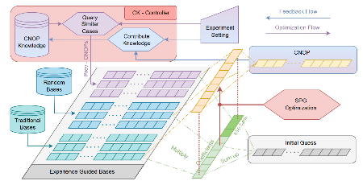

Since 2025, I have been developing a numerical program to calculate the Conditional Nonlinear Optimal Perturbation (CNOP) in the Martian atmosphere. CNOP identifies the initial errors that cause the largest forecast errors, and is derived by solving a nonlinear optimization problem. Initially, I adapted an existing code from senior group members, which combined dimension reduction with the Spectral Projected Gradient (SPG) algorithm, and transferred it to the LMD Martian model. However, the preliminary optimization results were unsatisfactory.

My supervisor suggested incorporating Bred Vector (BV) results I had obtained from earlier work. From February to April, I iterated through four versions, finding that its effectiveness varied across different time periods. This led me to take a further step: not only using BV results but leveraging all CNOP results in previous cases. This idea became the core logic of a new framework, where each CNOP is computed using knowledge from previous calculations and subsequently contributes to future ones. I named this framework Experience-Guided Bases-SPG (EGB-SPG), kind of inspired by Hofstadter's book.

Implementing this framework proved challenging. Through multiple iterations, I gradually realized that I was, in effect, designing a database from the ground up. This concept strongly appeals to me –– it mirrors how we organize knowledge, with every new advance building upon this evolving "database."

2025Conferences
International ConferencesConference presentations became a way to organize and test my research narrative.
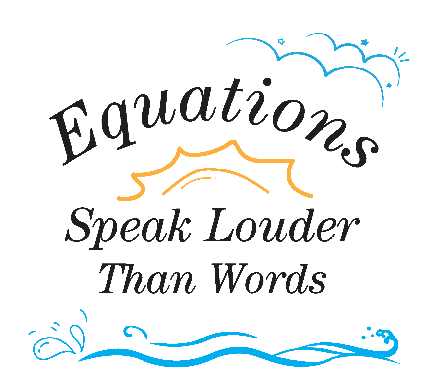

Conference presentations became an important way to organize my research narrative, exchange ideas with the planetary-atmosphere community, and receive feedback on my work on Martian weather predictability.

<ul>
<li>Mars Through Time. 2025/10. Paris, France. Poster.</li>
<li>8th Symposium on Nonlinear Atmospheric and Oceanic Science. 2025/08. Inner Mongolia, China. Outstanding Poster.</li>
<li>AOGS-2025. 2025/07. Singapore. Oral.</li>
<li>2024 National Planetary Science Conference. 2024/10. Nanjing, China.</li>
</ul>

2024Research
Net Exchange Matrix of Longwave RadiationA radiative-transfer diagnostic that clarified an error-amplification mechanism.
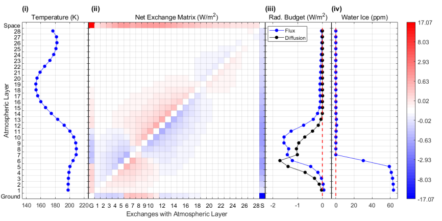

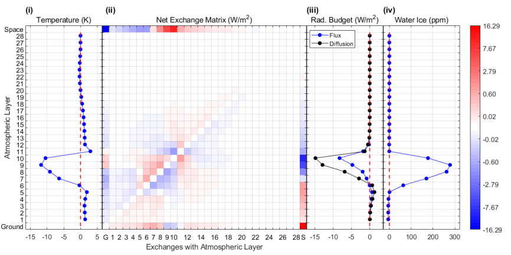

My PhD research unexpectedly pivoted to the Martian atmosphere, a field entirely new to me before 2022. In September 2023, I encountered a persistent problem: why cold initial temperature errors in the lower atmosphere strengthen in my experiments. It was not until spring 2024 that I discovered water ice takes effect in this case, which marked overcoming one of my toughest obstacles –– think of something that wasn't even in your mind.

A temperature tendency decomposition pinpointed longwave radiation as the cooling source. However, with my foundational knowledge limited to basic concepts like 𝜀𝜎𝑇4, I could not explain why water ice clouds were losing more longwave radiation than they absorbed. I began by consulting senior researchers and literature, which revealed the complexity of cloud radiative effects and their uncertain applicability to Mars. This led me to examine the model's mechanics directly, where I discovered that radiative transfer was far more complex than I had anticipated. Venturing into this field and studying relevant concepts cost me several weeks.

A key insight came when I noticed the LMD model uses the net exchange formulation by Dufresne (2005) for longwave calculations, unlike the common flux formulation. This method clearly illustrates longwave exchange between atmospheric layers, making it ideal for diagnosing my results. After familiarizing myself with this approach, I modified the model code to output the necessary matrix data, as it is not included in normal outputs. The results were conclusive: by decomposing the longwave budget into layer-by-layer net exchanges, I clearly demonstrated that the cloud layer simultaneously absorbs longwave radiation from the ground and lower atmosphere while emitting stronger outgoing longwave radiation, thereby completing the causal chain.

2021Mathematics
Applied Mathematics for UndergraduateUndergraduate applied mathematics training shaped my taste for theory and derivation.
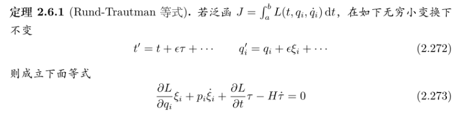

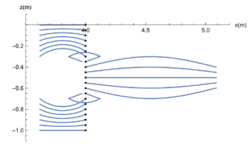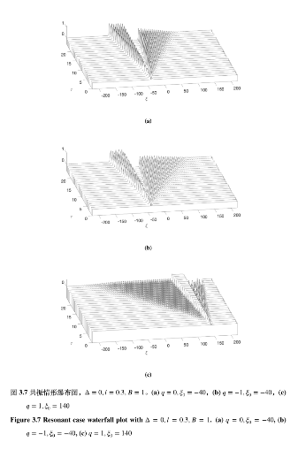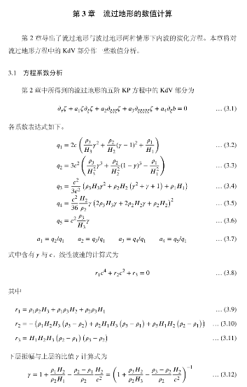

My undergraduate research supervisor, Prof. Zhan Wang from the Institute of Mechanics, Chinese Academy of Sciences, is an expert in applied mathematics. His course, "Applied Mathematics in Engineering Science," was a profound inspiration. He masterfully covered fluid dynamics equations and theoretical solving techniques, such as variational methods and asymptotic analysis, entirely on the chalkboard. Though I set down his notes and tried to organize them, I found truly mastering these techniques challenging.

Under his guidance, I undertook two theoretical projects. The first is “Material Transport of Flows induced by Nonlinear Internal Waves”, including KdV, MCC and DJL type. Later, I worked on “Effects of Topography on Nonlinear Internal Wave in Three-layer Flows” as my bachelor’s thesis, where asymptotic methods were applied to derive the fifth-order KdV equation. In both theoretical works, I was stuck at certain points, making no progress for some time. It is tough as you have to find the direction of derivation independently.

It was regrettable that these theoretical works were not published—partly due to their abstract nature and my subsequent shift to atmospheric science for my Ph.D.—the experience was invaluable. In my current field, where numerical experiments dominate, such "old-school" theoretical approaches are rare, and I've been out of touch with this kind of formula derivation for quite a while. While I personally prefer this foundational style, I wonder if I would have opportunities to apply it in the future.

2020Exchange
One Semester in UC BerkeleyMy first extended experience of living and studying overseas.
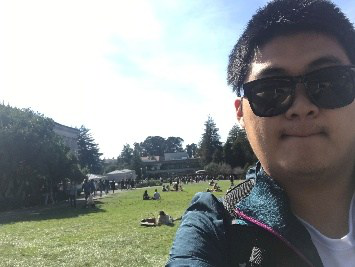

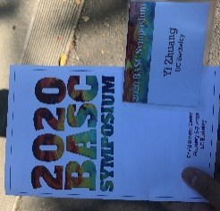

In January 2020, I commenced a semester abroad at UC Berkeley as an exchange student through the University of Chinese Academy of Sciences. This is my first time living and studying abroad for several months. Despite being enrolled in Mechanical Engineering, I pursued an interdisciplinary curriculum. This includes “Convective Transport and Computational Methods”, which is a graduate-level course; “Atmospheres”, which is based on my decision to study atmospheric science; and “Nonlinear Dynamics and Chaos”, which is an interested mathematical class organized by students who were only one year my senior. I also attended the 2020 BASC symposium, marking my first participation in an atmospheric science conference. The interactions with professors there provided crucial guidance and encouragement for my future research.

The program was abruptly interrupted by the COVID-19 pandemic after just half a semester on campus. While many peers returned home, I persisted, completing all courses remotely by May despite significant logistical challenges, including securing a return flight with embassy assistance.

A pivotal moment during that time was the passing of Prof. Adam P. Showman, news I initially encountered in my Atmospheres class maybe. While it seemed a distant event then, I finally recognized its profound influence on the direction of my graduate studies many years later.

2017Book
My Math BookA high-school mathematics study guide built from my own notes and methods.
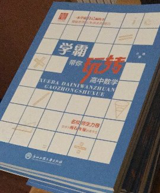

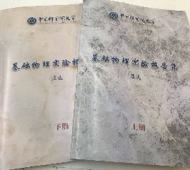

In the summer of 2017, I authored and published a study guide titled "Ace Your High School Math with the Masters." The project originated from my personal need to systematically consolidate mathematical formulas into a streamlined reference, which I initially called "Reference for High School Mathematical Study." Also, for sharing techniques with my friends, I enriched the content by adding my practical insights.

The drafting process was accelerated by a policy change in the Zhejiang provincial college entrance exam starting in 2014. This policy, which required me to focus only on Chinese, Mathematics, and English from October 2016 onward, afforded me the time to refine and complete the manuscript. Out of my expectation, the book was well-received by peers and even gained media attention. Later, my parents assisted me with its formal publication.

At university, I have continued this passion for synthesizing knowledge. I compile and reframe lecture notes into structured collections for courses such as Linear Algebra, Mathematical and Physical Methods, Applied Mathematics, Basic Physical Experiments, Heat Transfer, and Mesoscale Meteorology. I am also constantly exploring better ways to share these resources, having utilized the WeChat public platform, a personal website built with WordPress, and currently maintaining a static site with Jekyll on GitHub.

</section>

