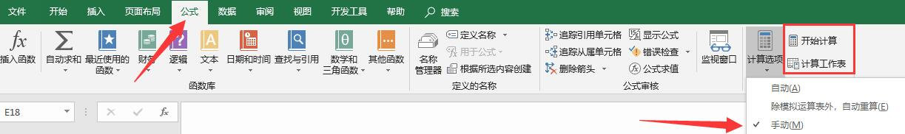
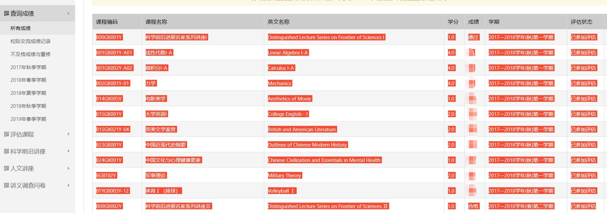
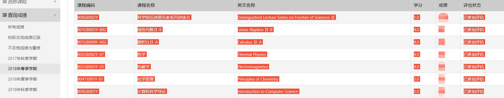
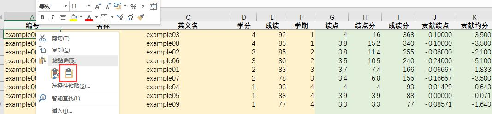

适用于GKD的GPA计算器(Excel)，用于导入成绩并计算GPA，并提供根据学期和课程类型筛选计算，各门课对总GPA的边际贡献计算，到达指定GPA还需要几门几分的课等进阶功能。

[程序下载](/files/blog/gpacalc4.0.zip)
[计算的理论基础](/posts/2019/07/gpacalc-math/)

# 使用前须知

## 声明

本作品（指GPA计算器，下同）几乎完全开源，本作品不含任何有害内容，本作品不会收集你的个人信息， 本作品采用知识共享署名-相同方式共享 4.0 国际许可协议进行许可（与本手册最后声明相同）。

以上仅限于未被修改的版本。如果不信任你的文件来源，或在打开文件，使用时遇到奇怪的问题，请从本文末尾所示博客源地址进行下载， 或禁用宏（默认设置，这样就只有Excel基本的安全功能）使用或使用无宏版本，见`\autoref{sec:nomacro}`{=latex}。

本计算器理论依据为《GPA计算理论分析》。

另外，本作品只适合在PC端使用，基本只适合国科大同学使用。应该不适合低版本Excel使用。

## 关于自动计算

为了避免卡顿，默认关闭了自动计算功能，可在公式选项卡中最右端修改。如果遇到数据未更新或较为奇怪的情况，可以按F9（计算当前工作表）或 Shift+F9（计算全部工作表）试试。如果你开启了自动计算功能，那么可忽略以下说明中"按F9更新"之类的指令。无宏版本默认开启自动计算。 在整个Excel中，记住**黄色区域**是需要你填写或导入的，**绿色区域**都是会自动计算，一般无需更改的。

<figure>

<figcaption>自动计算设置</figcaption>
</figure>

# 第一步·导入课程信息

1.  登录SEP选课系统（亦可通过计算器中的控制面板-快捷导航），进入查询成绩页面。在左侧查询成绩一栏中选择**所有成绩**或**某某学期**均可。

2.  选中成绩表格中**除了标题栏**的所有数据，或你需要添加的数据行，复制。

    <figure>
    
    <figcaption>在所有课程中复制课程数据</figcaption>
    </figure>

    <figure>
    
    <figcaption>在按学期查询课程中复制数据</figcaption>
    </figure>

3.  打开GPA计算器，**启用宏**，在GPA计算器的**课程**工作表中，选中A2格。如果是在之前的基础上增加课程，则选中AX格（X为之下第一个空行）。

4.  在选中的格上执行**选择性粘贴------文本**，如果看到复制的数据均匀分布在表格中则成功。**切勿直接ctrl+v**。

    <figure>
    
    <figcaption>右键粘贴方式</figcaption>
    </figure>

    <figure>
    
    <figcaption>选择性粘贴位置</figcaption>
    </figure>

5.  有补考通过记录的同学，请将相应成绩改为$60.01$。

6.  点击**打开控制台按钮**呼出控制台，选择"课程表"选项卡。以下操作均在控制台中完成。

7.  点击**尝试自动填写学期**按钮，即尝试将学期依次填为1-8。不计入GPA计算的讲座课程将填为0。注意，[只有在课程按照学期顺序排列（SEP默认顺序）时才能正确填写学期。]{.underline} 如自动填写有误，可**手动更改**学期。

8.  如不想使用分学期统计功能，请点击**跳过学期填写**。注意，此操作会将除讲座外所有课程学期设为1且**无法撤销**。但你仍然可以查看总GPA和均分。

9.  单选框选择GPA计算模式，默认为国科大模式。

10. 点击**计算**按钮，将自动依次执行每个课程的绩点等计算、总信息表中的统计计算、绘图调整、每个课程对GPA和均分的贡献计算。

11. 点击各排序按钮，即可按照其文字说明自动排序。

注意，GPA和均分贡献计算，表示当前GPA/均分与除去这一门课后计算得到的GPA/均分差值，当前GPA/均分是基于总信息表中的**自定义统计G**，默认情况下是对所有课程统计。这里有一个意义 上的bug，即不在统计学期中的课程也有贡献。其表示直接在当前统计得到的绩点、绩点分、成绩分作相应扣除产生的差异。

# 第二步·查看信息表

注意，统计的学分与选课系统中显示学分有所不同，原因有二。一是讲座等课程不计入GPA计算，二是选课系统包括了下学期新选择的课程。

另外，课程工作表经过手动更改后，需要在信息表中按F9更新或在控制台中手动更新。G行统计将作为课表中课程GPA和均分贡献和两个扎心表的基准。

## 如果你没有跳过学期填写且学期填写正确

1.  切换到**总信息表**工作表中，可以在最上面一栏中看到逐学期的学分、成绩等统计表。

2.  在中间一栏共有7行，提供了7套自定义学期统计。其中1和0可以自由更改，如在B8格填1，则自定义统计A将统计学期1的课程。在G11格填0，则自定义统计D将不统计学期6的课程。

3.  统计开关可在控制台中调控。点击打开控制台，选择"总信息表"选项卡，其相应调节功能见后。

4.  调节完统计开关后，按手动更新按钮进行计算，将会看到最下方的自定义统计发生相应变化。最下方的**全部**统计永远统计全部课程。

5.  在图中可看到逐学期的GPA和均分变化。如果数据范围不对，可在控制台"总信息表"选项卡中点击**自动调整绘图坐标轴**按钮或手动更改。对于只有一个学期的情况，自动调整功能无效。

统计开关功能说明如下。

1.  **ABCD按学年统计**按钮指的是将ABCD统计分别设为12学期、34学期、56学期、78学期。

2.  **除G行统计全开/全关**按钮指的是将ABCDEF统计设为对1-8学期均统计/均不统计。

3.  运算的操作为选择**参考**统计（记为ref），再选择**目标**统计（记为dst），选择操作，然后点"执行操作"按钮，最后手动更新按钮计算。以下将对各操作作解释。

4.  复制操作：将ref统计模式覆盖到dst统计模式。

5.  交换操作：将ref统计模式与dst统计模式交换。

6.  叠加操作：将ref打开的统计在dst中也打开。

7.  差集操作：将ref打开的统计在dst中关闭。

8.  目标全开/关操作：将dst全部打开/关闭。

9.  目标反相操作：将dst原先打开的统计关闭，原先关闭的统计打开。

## 如果你跳过了学期填写

即你按了课程工作表中**跳过学期填写**按钮，且要统计的课程学期都设为了1，那么你只需要看第一学期或全部的统计即可。其他功能都无意义。

# GPA和均分扎心表

以GPA扎心表为例，均分扎心表类似。

1.  切换到**GPA扎心表**工作表，可见到两个区域，分别执行不同计算。

2.  在左侧区域或右侧区域的每一行，填写所有黄色背景的单元格的内容，按F9计算出绿色背景的单元格。

计算依据的是**总信息表**工作表中的G行统计，因此你可以在总信息表对G行统计自定义以修改基准。

# 禁用宏或无宏版本使用 {#sec:nomacro}

如果禁用宏进行使用，控制台将无法使用，导入时有一点麻烦。所有的按钮都无法使用。但是此时不会很卡，可以打开公式-计算选项-自动计算功能（无宏版本默认）。则可以忽略以下F9更新的指示。

导入成绩操作，需要避免粘贴时吞掉右方公式。

1.  如果是首次导入，**请粘贴在A3格**，然后利用第2行的公式，通过拖动手柄**自动填充**功能填充绿色范围内之后课程的公式，按F9计算。最后删掉第2行。

2.  如果不是首次导入，直接粘贴在AX格（X为第一个空行），然后利用自动填充功能填充公式，按F9计算。

3.  有补考通过课程请将成绩改为60.01，按F9更新。

4.  如果需要按学期统计功能，则手动修改课程的学期。将讲座课程的学期置为0。

5.  如果不需要按学期统计功能，则将课程学期全部改为1。将讲座课程的学期置为0。

6.  只能手动进行排序。

在**总信息表**中，按F9更新，除了控制台调节统计的几个按钮不能用，除了需要自己设定参与的统计开关，图表的坐标轴、数据范围等之外，与之前无异。

在**GPA和均分扎心表**中，按F9更新，与之前无异。

# Q&A

`\noindent`{=latex} Q:能不能使用筛选功能来控制计入统计的课程？\
A:实测不能。\
Q:单元格显示###？\
A:列宽太小，拉大点。\
Q:统计的学分跟选课系统里看到的差很多？\
A:算算讲座学分，再算算你下学期选课的学分，扣掉看看。\
Q:为什么补考通过要把成绩改成60.01？\
A:因为补考通过分数记为60分，但成绩绩点换算表中60分已经被1.6绩点占去了，于是只好新增了一个60.01对应1.0绩点。另外，这样也能使得均分不会产生太大影响。（其实是因为根本不知道补考通过长啥样）\
Q:我没有禁用宏，也无法使用按钮？\
A:宏是默认禁用的，请点击提示栏启用。

<figure>

<figcaption>启用宏</figcaption>
</figure>

\
Q:还有问题？\
A:请在源网页上留言或QQ联系我。Excel相关问题请百度。

# 更新记录

## v4.0--190731

1.  增加了控制台，把按钮都丢进控制台。

2.  增加了北大和美国的gpa算法可供选择。

3.  降低了调整绘图区域出错可能性，现在只有1个学期时绘图区域将不会调整。

4.  增加了A-G统计互相操作。取消了G行统计全开全关按钮。

5.  更新声明描述和说明书。

6.  增加无宏版本。

7.  excel中不再有更新记录页。

8.  增加了到sep、本科教育网、gpa计算器官网、庄逸的数学与技术屋链接。

#### 已知bug

若1-8学期有学期学分为0，自动调整绘图区域应不会考虑该学期之后的学期，即使有值。

# 使用前须知

## 声明

本作品（指GPA计算器，下同）几乎完全开源，本作品不含任何有害内容，本作品不会收集你的个人信息， 本作品采用知识共享署名-相同方式共享 4.0 国际许可协议进行许可（与本手册最后声明相同）。

以上仅限于未被修改的版本。如果不信任你的文件来源，请从本文末尾所示博客地址进行下载， 或禁用宏（这样就只有Excel基本的安全功能）使用，见`\autoref{sec:nomacro}`{=latex}。

本计算器理论依据为博文"GPA计算理论分析"。

另外，本作品只适合在PC端使用，基本只适合国科大同学使用。应该不适合低版本Excel使用。

## 关于自动计算

为了避免卡顿，默认关闭了自动计算功能，可在公式选项卡中最右端修改。如果遇到数据未更新或较为奇怪的情况，可以按F9（计算当前工作表）或 Shift+F9（计算全部工作表）试试。如果你开启了自动计算功能，那么可忽略以下说明中"按F9更新"之类的指令。 在整个Excel中，记住**黄色区域**是需要你填写的，**绿色区域**都是会自动计算，一般无需更改的。

<figure>

<figcaption>自动计算设置</figcaption>
</figure>

# 第一步·导入课程信息

1.  登录SEP选课系统，进入查询成绩页面。在左侧查询成绩一栏中选择**所有成绩**或**某某学期**均可。

2.  选中成绩表格中**除了标题栏**的所有数据，或你需要添加的数据行，复制。

    <figure>
    
    <figcaption>在所有课程中复制课程数据</figcaption>
    </figure>

    <figure>
    
    <figcaption>在按学期查询课程中复制数据</figcaption>
    </figure>

3.  打开GPA计算器，**启用宏**，在GPA计算器的**课程**工作表中，选中A2格。如果是在之前的基础上增加课程，则选中AX格（X为第一个空行）。

4.  在选中的格上执行**选择性粘贴------文本**，如果看到复制的数据均匀分布在表格中则成功。**切勿直接ctrl+v**。

    <figure>
    
    <figcaption>右键粘贴方式</figcaption>
    </figure>

    <figure>
    
    <figcaption>选择性粘贴位置</figcaption>
    </figure>

5.  有补考通过记录的同学，请将相应成绩改为$60.01$。

6.  点击**尝试自动填写学期**按钮，即尝试将学期依次填为1-8。不计入GPA计算的讲座课程将填为0。注意，**只有在课程按照学期顺序排列（SEP默认顺序）时才能正确填写学期。** 如自动填写有误，可**手动更改**学期。

7.  如不想使用分学期统计功能，请点击**跳过学期填写**。注意，此操作会将除讲座外所有课程学期设为1且**无法撤销**。但你仍然可以查看总GPA和均分。

8.  点击**计算**按钮，将自动依次执行每个课程的绩点等计算、总信息表中的统计计算、绘图调整、每个课程对GPA和均分的贡献计算。

9.  点击排序按钮，即可按照其文字说明自动排序。

注意，GPA和均分贡献计算，表示当前GPA/均分与除去这一门课后计算得到的GPA/均分差值，当前GPA/均分是基于总信息表中的**自定义统计G**，默认情况下是对所有课程统计。这里有一个意义 上的bug，即不在统计学期中的课程也有贡献。其表示直接在当前统计得到的绩点、绩点分、成绩分作相应扣除产生的差异。

# 第二步·查看信息表

注意，统计的学分与选课系统中显示学分有所不同，原因有二。一是讲座等课程不计入GPA计算，二是选课系统包括了下学期新选择的课程。

另外，课程工作表经过手动更改后，需要在信息表中按F9更新。G行统计将作为课表中课程GPA和均分贡献和两个扎心表的基准。

## 如果你没有跳过学期填写且学期填写正确

1.  切换到**总信息表**工作表中，可以在最上面一栏中看到逐学期的学分、成绩等统计表。

2.  在中间一栏共有7行，提供了7套自定义学期统计。其中1和0可以自由更改，如在B8格填1，则自定义统计A将统计学期1的课程。在G11格填0，则自定义统计D将不统计学期6的课程。

3.  统计开关可通过右下方的按钮操控，其**中ABCD按学年统计**指的是将ABCD统计分别设为12学期、34学期、56学期、78学期。

4.  调节完统计开关后，**按F9执行计算**，将会看到最下方的自定义统计发生相应变化。最下方的**全部**统计永远统计全部课程。

5.  在图中可看到逐学期的GPA和均分变化。如果数据范围不对，可点击**自动调整绘图坐标轴**按钮或手动更改。

## 如果你跳过了学期填写

即你按了课程工作表中**跳过学期填写**按钮，且要统计的课程学期都设为了1，那么你只需要看第一学期或全部的统计即可。其他功能都无意义。

# GPA和均分扎心表

以GPA扎心表为例，均分扎心表类似。

1.  切换到**GPA扎心表**工作表，可见到两个区域，分别执行不同计算。

2.  在左侧区域或右侧区域的每一行，填写所有黄色背景的单元格的内容，按F9计算出绿色背景的单元格。

计算依据的是**总信息表**工作表中的G行统计，因此你可以在总信息表对G行统计自定义以修改基准。

# 禁用宏使用 {#sec:nomacro}

如果禁用宏进行使用，有一点麻烦。所有的按钮都无法使用。但是此时不会很卡，可以打开公式-计算选项-自动计算功能。则可以忽略以下F9更新的指示。

导入成绩操作，需要避免粘贴时吞掉右方公式。

1.  如果是首次导入，请粘贴在A3格，然后利用第2行的公式，通过**自动填充**功能填充绿色范围内之后课程的公式，按F9计算。最后删掉第2行。

2.  如果不是首次导入，直接粘贴在AX格（X为第一个空行），然后利用自动填充功能填充公式，按F9计算。

3.  有补考通过课程请将成绩改为60.01，按F9更新。

4.  如果需要按学期统计功能，则手动修改课程的学期。将讲座课程的学期置为0。

5.  如果不需要按学期统计功能，则将课程学期全部改为1。将讲座课程的学期置为0。

6.  只能手动进行排序。

在**总信息表**中，按F9更新，除了几个按钮不能用，图表的坐标轴、数据范围需要自己设定外，与之前无异。

在**GPA和均分扎心表**中，按F9更新，与之前无异。

# Q&A

`\noindent`{=latex} Q:能不能使用筛选功能来控制计入统计的课程？\
A:实测不能。\
Q:单元格显示###？\
A:列宽太小，拉大点。\
Q:统计的学分跟选课系统里看到的差很多？\
A:算算讲座学分，再算算你下学期选课的学分，扣掉看看。\
Q:为什么补考通过要把成绩改成60.01？\
A:因为补考通过分数记为60分，但成绩绩点换算表中60分已经被1.6绩点占去了，于是只好新增了一个60.01对应1.0绩点。另外，这样也能使得均分不会产生太大影响。（其实是因为根本不知道补考通过长啥样）\
Q:我没有禁用宏，也无法使用按钮？\
A:宏是默认禁用的，请点击提示栏启用。

<figure>

<figcaption>启用宏</figcaption>
</figure>

\
Q:还有问题？\
A:请在源网页上留言或QQ联系我。Excel相关问题请百度。
